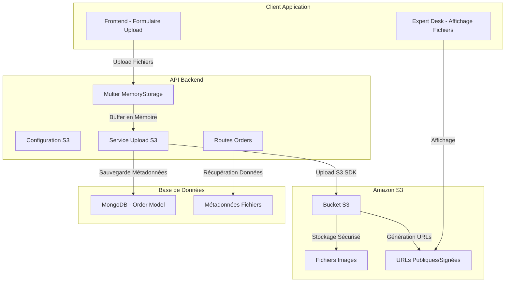
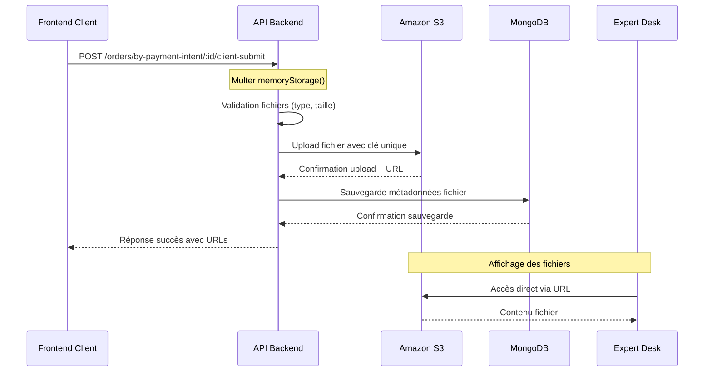

# Migration vers Amazon S3 et Nettoyage Complet - Système d'Upload de Fichiers

## Vue d'Ensemble

### Problématique Actuelle
Le système d'upload de fichiers souffre d'une erreur critique `EACCES` causée par des problèmes de permissions sur le système de fichiers local dans l'environnement conteneurisé. Cette architecture basée sur le stockage local présente plusieurs limitations :
- Erreurs de permissions difficiles à résoudre en production
- Perte de fichiers lors des redéploiements de conteneurs
- Pas de scalabilité horizontale
- Complexité de gestion des sauvegardes

### Solution Proposée
Migration complète vers Amazon S3 pour bénéficier d'un stockage cloud robuste, scalable et hautement disponible. Cette migration inclut la suppression totale de l'ancien système de stockage local pour éviter tout conflit.

### Objectifs Stratégiques
- **Fiabilité** : Éliminer les erreurs EACCES et garantir l'accessibilité des fichiers
- **Scalabilité** : Supporter une croissance importante du volume de fichiers
- **Sécurité** : Contrôle d'accès granulaire et chiffrement des données
- **Performance** : CDN intégré pour la diffusion rapide des contenus
- **Simplicité** : Suppression de la complexité liée aux permissions de fichiers

## Architecture du Système

### Diagramme d'Architecture Cible



### Flux de Données



## Modèle de Données

### Nouveau Schéma des Fichiers

| Propriété | Type | Description | Exemple |
|-----------|------|-------------|---------|
| `name` | String | Nom d'affichage du fichier | `"photo-visage-client.jpg"` |
| `url` | String | URL publique d'accès S3 | `"https://bucket.s3.region.amazonaws.com/key"` |
| `key` | String | Clé unique dans le bucket S3 | `"uploads/2024/12/uuid-photo-visage.jpg"` |
| `contentType` | String | Type MIME du fichier | `"image/jpeg"` |
| `size` | Number | Taille en octets | `2048576` |
| `uploadedAt` | Date | Timestamp d'upload | `"2024-12-09T10:30:00Z"` |
| `type` | String | Type fonctionnel | `"face_photo"` ou `"palm_photo"` |

### Évolution du Modèle Order

**Structure Actuelle (à supprimer)**
```
files: [{
  filename: string,
  originalName: string,
  path: string,        // ❌ À supprimer (chemin local)
  mimetype: string,
  size: number,
  uploadedAt: Date
}]
```

**Nouvelle Structure S3**
```
files: [{
  name: string,        // ✅ Nom d'affichage
  url: string,         // ✅ URL publique S3
  key: string,         // ✅ Clé S3 pour gestion
  contentType: string, // ✅ Type MIME
  size: number,
  uploadedAt: Date,
  type: string         // ✅ Type fonctionnel
}]
```

## Configuration Technique

### Configuration S3

#### Variables d'Environnement Requises

| Variable | Description | Exemple | Obligatoire |
|----------|-------------|---------|-------------|
| `AWS_ACCESS_KEY_ID` | Clé d'accès AWS | `AKIA...` | ✅ |
| `AWS_SECRET_ACCESS_KEY` | Clé secrète AWS | `xyz123...` | ✅ |
| `AWS_REGION` | Région du bucket | `eu-west-3` | ✅ |
| `AWS_S3_BUCKET_NAME` | Nom du bucket | `lumira-uploads-prod` | ✅ |
| `AWS_S3_BASE_URL` | URL de base (optionnel) | `https://cdn.lumira.com` | ❌ |

#### Configuration du Client S3

```typescript
// Configuration sécurisée avec retry et timeout
const s3Config = {
  region: process.env.AWS_REGION,
  credentials: {
    accessKeyId: process.env.AWS_ACCESS_KEY_ID,
    secretAccessKey: process.env.AWS_SECRET_ACCESS_KEY
  },
  maxAttempts: 3,
  requestTimeout: 30000
}
```

#### Stratégie de Nommage des Clés

**Format** : `uploads/{année}/{mois}/{uuid}-{nom-original}`
**Exemple** : `uploads/2024/12/a1b2c3d4-e5f6-7890-abcd-ef1234567890-photo-visage.jpg`

**Avantages** :
- Organisation chronologique pour la maintenance
- UUID garantit l'unicité globale
- Conservation du nom original pour la traçabilité
- Structure compatible avec les outils d'analyse S3

### Configuration Multer

#### Passage de DiskStorage à MemoryStorage

**Avant (problématique)**
```javascript
const storage = multer.diskStorage({
  destination: (req, file, cb) => {
    cb(null, uploadsDir); // ❌ Erreur EACCES
  },
  filename: (req, file, cb) => {
    // ❌ Logique de nommage locale
  }
});
```

**Après (solution)**
```javascript
const upload = multer({
  storage: multer.memoryStorage(), // ✅ Buffer en mémoire
  limits: {
    fileSize: 10 * 1024 * 1024    // ✅ 10MB max
  },
  fileFilter: (req, file, cb) => {
    // ✅ Validation des types maintenue
  }
});
```

## Logique Métier

### Processus d'Upload S3

#### Étapes de Traitement

1. **Réception** : Multer charge le fichier en mémoire (buffer)
2. **Validation** : Vérification du type MIME et de la taille
3. **Génération Clé** : Création d'une clé unique S3
4. **Upload S3** : Transfert du buffer vers le bucket
5. **URL Génération** : Construction de l'URL d'accès public
6. **Persistance** : Sauvegarde des métadonnées en base
7. **Nettoyage** : Libération du buffer mémoire

#### Gestion des Erreurs

| Type d'Erreur | Cause | Action |
|---------------|--------|--------|
| `ValidationError` | Type de fichier invalide | Rejet avec message explicite |
| `FileTooLarge` | Dépassement de taille | Rejet avec limite indiquée |
| `S3UploadError` | Échec transfert S3 | Retry automatique (3 tentatives) |
| `NetworkError` | Connectivité S3 | Retry avec backoff exponentiel |
| `AuthenticationError` | Credentials S3 invalides | Alerte administrateur |

#### Optimisations Performance

- **Upload Parallèle** : Traitement simultané des fichiers multiples
- **Compression Automatique** : Réduction de taille pour les images > 2MB
- **Multipart Upload** : Pour les fichiers > 5MB (future évolution)
- **Mise en Cache** : Cache des URLs générées (TTL: 1h)

### Sécurité et Contrôle d'Accès

#### Stratégie de Sécurité

**Bucket Configuration**
- Accès public en lecture pour les URLs directes
- Accès en écriture restreint aux credentials de l'application
- Chiffrement AES-256 côté serveur
- Versioning activé pour la récupération de données

**Validation Côté Application**
- Whitelist stricte des types MIME autorisés
- Scan antivirus des uploads (intégration future)
- Rate limiting des uploads par utilisateur
- Audit trail complet des accès

#### URLs Signées vs URLs Publiques

**URLs Publiques** (recommandé pour ce cas)
- Accès direct sans authentification
- Performance optimale
- Compatible CDN
- Simplicité d'implémentation

**URLs Signées** (évolution future)
- Accès temporaire sécurisé
- Contrôle granulaire des permissions
- Expiration automatique
- Audit des accès

## Stratégie de Migration

### Phase 1 : Préparation (J-2)
- Configuration des credentials AWS
- Création et configuration du bucket S3
- Tests de connectivité et permissions
- Validation de la configuration dans l'environnement de staging

### Phase 2 : Implémentation (J-1)
- Déploiement du nouveau code S3
- Migration des données existantes (si applicable)
- Tests fonctionnels complets
- Formation de l'équipe sur les nouveaux outils

### Phase 3 : Bascule (J-Day)
- Activation de la nouvelle logique S3
- Suppression complète de l'ancien code local
- Monitoring intensif des uploads
- Support réactif pour résolution d'incidents

### Phase 4 : Nettoyage (J+1)
- Suppression des répertoires locaux
- Nettoyage des variables d'environnement obsolètes
- Documentation mise à jour
- Retour d'expérience équipe

## Nettoyage Complet de l'Ancien Système

### Éléments à Supprimer

#### Dans `server.ts`
```javascript
// ❌ À SUPPRIMER COMPLÈTEMENT
app.use('/uploads', express.static(uploadsPath));
```

#### Dans `orders.ts`
```javascript
// ❌ À SUPPRIMER COMPLÈTEMENT
const uploadsDir = process.env.UPLOADS_DIR || path.join(process.cwd(), 'uploads');
const storage = multer.diskStorage({ ... });
const ensureDirectoriesExist = () => { ... };
```

#### Variables d'Environnement Obsolètes
- `UPLOADS_DIR`
- `UPLOAD_MAX_SIZE` (remplacé par la config Multer)
- Toute référence aux chemins `/app/uploads`

#### Dépendances Système
```javascript
// ❌ À SUPPRIMER
import fs from 'fs';
import path from 'path'; // Garder seulement si utilisé ailleurs
```

### Checklist de Validation du Nettoyage

- [ ] Aucune référence à `multer.diskStorage`
- [ ] Aucune référence aux chemins `/uploads` locaux
- [ ] Aucune utilisation de `fs.writeFileSync` pour les uploads
- [ ] Aucune création de répertoires d'upload
- [ ] Suppression du middleware static pour `/uploads`
- [ ] Tests confirment l'absence de fallback vers le stockage local

## Tests et Validation

### Stratégie de Tests

#### Tests Unitaires
- Validation de la configuration S3
- Test de génération des clés uniques
- Vérification de la validation des fichiers
- Simulation des erreurs S3

#### Tests d'Intégration
- Upload end-to-end avec S3 réel
- Affichage des fichiers dans Expert Desk
- Gestion des erreurs de connectivité
- Performance sur différentes tailles de fichiers

#### Tests de Charge
- Upload simultané de 100 fichiers
- Validation de la gestion mémoire
- Test de résistance aux pics de trafic
- Mesure des temps de réponse

### Métriques de Succès

| Métrique | Cible | Mesure |
|----------|--------|---------|
| Taux de succès upload | > 99.5% | Logs applicatifs |
| Temps de réponse moyen | < 3 secondes | Monitoring APM |
| Disponibilité fichiers | 99.9% | Tests périodiques |
| Erreurs EACCES | 0 | Surveillance continue |

## Monitoring et Observabilité

### Indicateurs Clés

#### Métriques Techniques
- **Latence Upload** : Temps entre réception et confirmation S3
- **Taux d'Erreur** : Pourcentage d'échecs par type d'erreur  
- **Utilisation Mémoire** : Pic mémoire pendant les uploads
- **Bande Passante** : Débit vers S3

#### Métriques Métier
- **Volume Fichiers** : Nombre de fichiers uploadés par jour
- **Taille Moyenne** : Évolution de la taille des fichiers
- **Types de Contenu** : Répartition des formats de fichiers
- **Géolocalisation** : Origine géographique des uploads

### Alertes Critiques

| Alerte | Seuil | Action |
|--------|-------|--------|
| Échec Upload S3 | > 5% sur 5min | Notification immédiate équipe |
| Latence Élevée | > 10s moyens | Investigation performance |
| Quota S3 Dépassé | > 80% utilisation | Scaling bucket |
| Erreur Credentials | 1 occurrence | Vérification configuration |

## Évolutions Futures

### Fonctionnalités Avancées

#### Phase 2 (Q1 2025)
- **CDN CloudFront** : Mise en cache géographique
- **Compression Intelligente** : Optimisation automatique des images
- **Thumbnails Automatiques** : Génération de vignettes
- **Watermarking** : Protection des contenus

#### Phase 3 (Q2 2025)
- **URLs Signées** : Sécurisation avancée des accès
- **Analytics S3** : Analyse détaillée des utilisations
- **Archivage Intelligent** : Transition automatique vers Glacier
- **Backup Cross-Region** : Réplication pour haute disponibilité

### Optimisations Techniques

#### Performance
- **Upload Multipart** : Parallélisation pour gros fichiers
- **Pré-signature Côté Client** : Upload direct depuis le frontend
- **Mise en Cache Aggressive** : Cache applicatif des métadonnées
- **Optimisation Réseau** : Compression transport et keep-alive

#### Sécurité
- **Scan Antivirus** : Intégration avec AWS GuardDuty
- **DLP (Data Loss Prevention)** : Détection de contenu sensible
- **Audit Avancé** : Traçabilité complète des accès
- **Chiffrement Côté Client** : Protection maximale des données

## Risques et Mitigation

### Risques Identifiés

| Risque | Probabilité | Impact | Mitigation |
|--------|-------------|--------|------------|
| Panne AWS S3 | Faible | Élevé | Multi-région + backup local temporaire |
| Dépassement Quota | Moyen | Moyen | Monitoring + alertes préventives |
| Latence Réseau | Moyen | Faible | Cache + CDN |
| Erreur Migration | Faible | Élevé | Tests exhaustifs + rollback plan |

### Plan de Continuité

#### Scenario de Dégradation
1. **Panne S3 Partielle** : Queue des uploads + retry automatique
2. **Panne S3 Totale** : Mode dégradé sans upload + notification users
3. **Erreur Configuration** : Rollback automatique vers version stable
4. **Saturation Mémoire** : Limitation dynamique de la taille des uploads

#### Procédures de Récupération
- Scripts de migration automatisés testés
- Sauvegarde des configurations critiques
- Documentation complète des procédures
- Équipe d'astreinte formée aux incidents S3