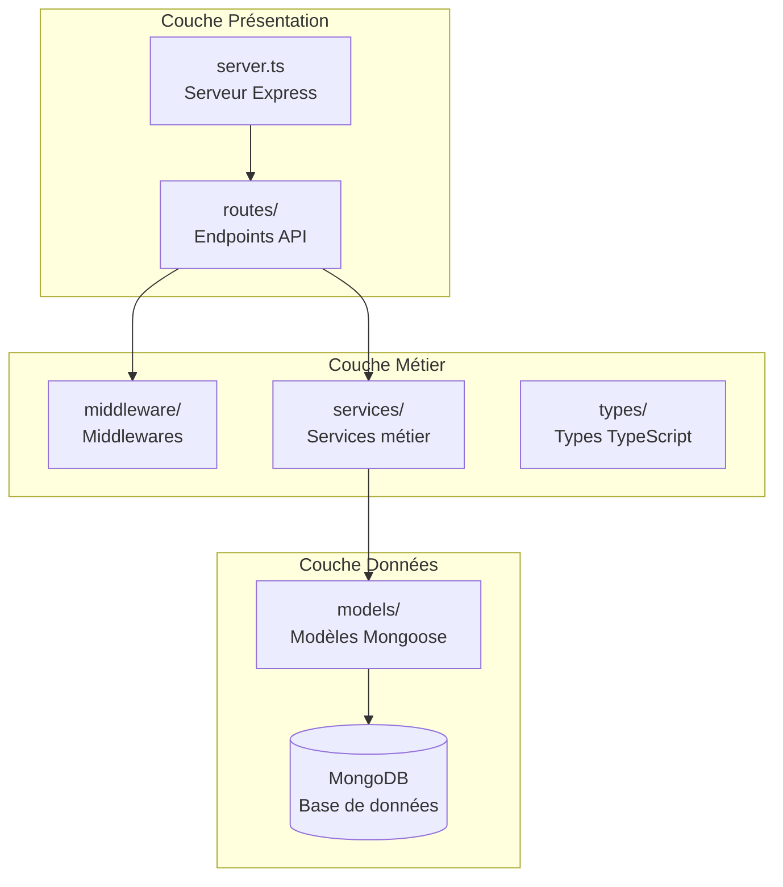
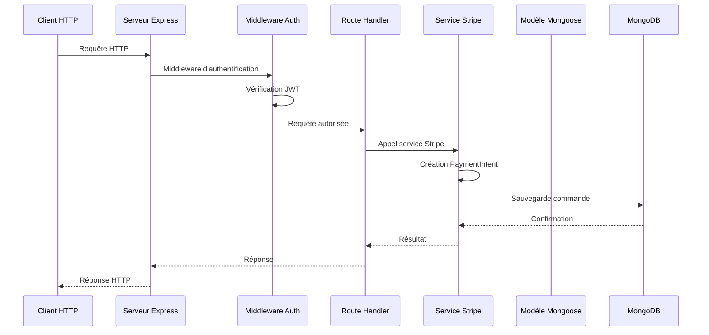
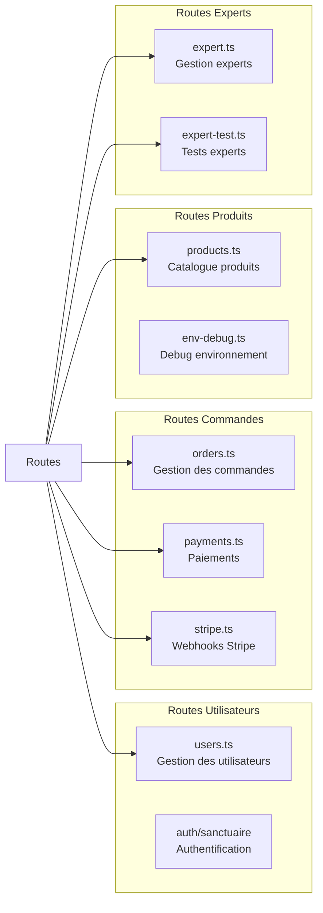
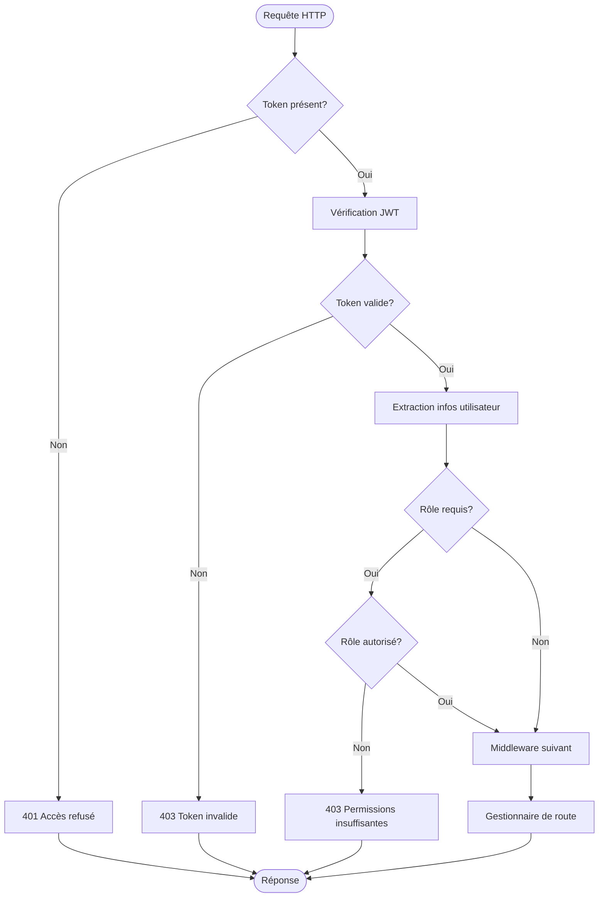
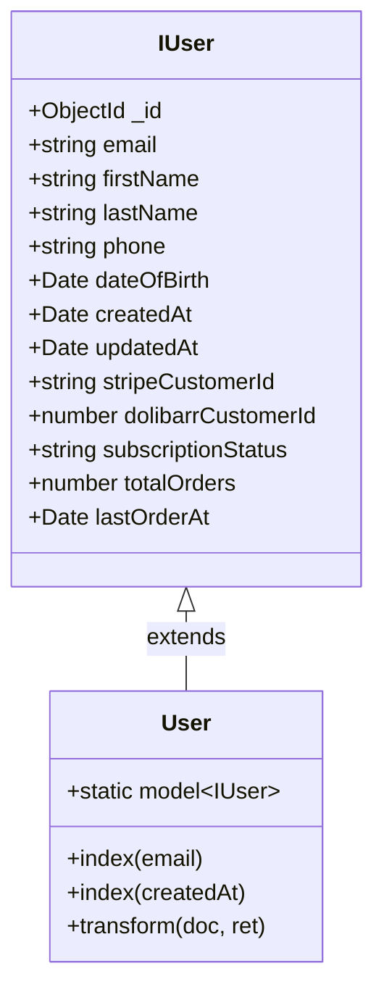
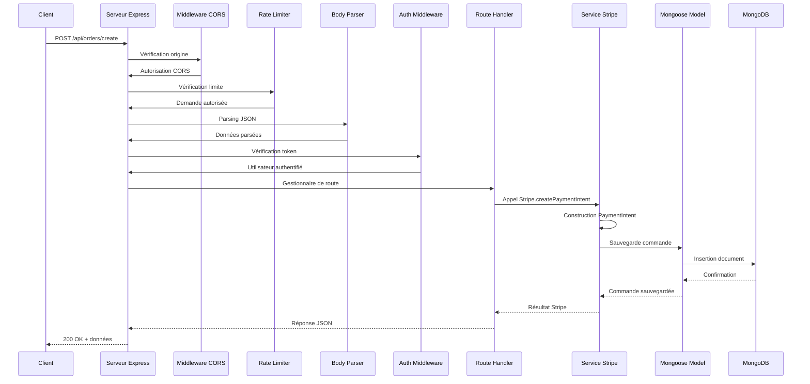
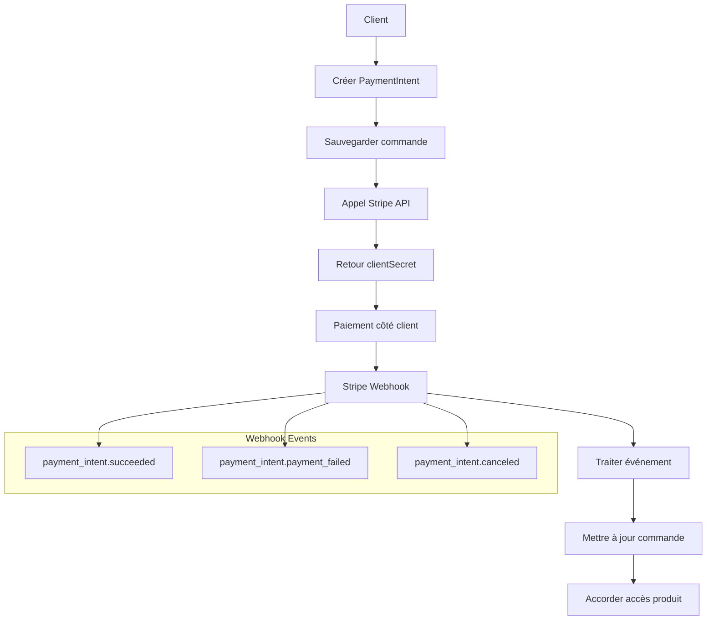

# Architecture Backend API

<cite>
**Fichiers Référencés dans ce Document**
- [server.ts](file://apps/api-backend/src/server.ts)
- [users.ts](file://apps/api-backend/src/routes/users.ts)
- [auth.ts](file://apps/api-backend/src/middleware/auth.ts)
- [User.ts](file://apps/api-backend/src/models/User.ts)
- [Order.ts](file://apps/api-backend/src/models/Order.ts)
- [stripe.ts](file://apps/api-backend/src/services/stripe.ts)
- [payments.ts](file://apps/api-backend/src/routes/payments.ts)
- [products.ts](file://apps/api-backend/src/routes/products.ts)
- [logging.ts](file://apps/api-backend/src/middleware/logging.ts)
- [validation.ts](file://apps/api-backend/src/middleware/validation.ts)
</cite>

## Table des Matières
1. [Introduction](#introduction)
2. [Structure du Projet](#structure-du-projet)
3. [Architecture Globale](#architecture-globale)
4. [Couche Serveur](#couche-serveur)
5. [Couche Routes](#couche-routes)
6. [Couche Middleware](#couche-middleware)
7. [Couche Modèles](#couche-modèles)
8. [Flux de Traitement des Requêtes](#flux-de-traitement-des-requêtes)
9. [Patterns Architecturaux](#patterns-architecturaux)
10. [Gestion des Paiements Stripe](#gestion-des-paiements-stripe)
11. [Considérations de Performance](#considérations-de-performance)
12. [Guide de Dépannage](#guide-de-dépannage)
13. [Conclusion](#conclusion)

## Introduction

Le backend API de Lumira est une architecture moderne basée sur Express.js qui implémente une architecture en couches avec séparation claire des responsabilités. Cette documentation explore l'architecture complète du système, depuis la gestion des requêtes HTTP jusqu'à l'intégration avec Stripe pour les paiements sécurisés.

Le système suit les principes de l'architecture RESTful avec une approche modulaire des routes, une sécurité robuste grâce à JWT, et une intégration transparente avec MongoDB via Mongoose pour la persistance des données.

## Structure du Projet

L'architecture backend est organisée selon une structure en couches bien définie :



**Sources du Diagramme**
- [server.ts](file://apps/api-backend/src/server.ts#L1-L275)
- [users.ts](file://apps/api-backend/src/routes/users.ts#L1-L50)

**Sources de Section**
- [server.ts](file://apps/api-backend/src/server.ts#L1-L275)

## Architecture Globale

L'architecture suit un pattern MVC implicite avec une séparation claire entre les responsabilités :



**Sources du Diagramme**
- [server.ts](file://apps/api-backend/src/server.ts#L1-L275)
- [auth.ts](file://apps/api-backend/src/middleware/auth.ts#L1-L119)
- [stripe.ts](file://apps/api-backend/src/services/stripe.ts#L1-L165)

## Couche Serveur

Le fichier `server.ts` constitue le cœur de l'application, configurant Express.js avec toutes les configurations nécessaires :

### Configuration Sécurité

Le serveur implémente plusieurs couches de sécurité :

```typescript
// Protection CSRF avec Helmet
app.use(helmet({
  contentSecurityPolicy: {
    directives: {
      defaultSrc: ["'self'"],
      styleSrc: ["'self'", "'unsafe-inline'"],
      scriptSrc: ["'self'"],
      imgSrc: ["'self'", "data:", "https:"],
    },
  },
}));

// Configuration CORS flexible
const corsOptions = {
  origin: allowedOrigins,
  methods: ['GET', 'POST', 'PUT', 'DELETE', 'OPTIONS'],
  allowedHeaders: ['Content-Type', 'Authorization', 'stripe-signature'],
  credentials: false,
};
```

### Gestion des Middlewares

Le serveur configure une séquence de middlewares essentiels :

1. **Rate Limiting** : Protection contre les attaques DDoS
2. **Body Parsing** : Gestion des requêtes JSON et URL-encoded
3. **Logging** : Journalisation des requêtes
4. **Static Files** : Servir les fichiers uploadés

**Sources de Section**
- [server.ts](file://apps/api-backend/src/server.ts#L40-L150)

## Couche Routes

Les routes sont organisées de manière modulaire, avec chaque fichier gérant un domaine fonctionnel spécifique :

### Architecture des Routes



**Sources du Diagramme**
- [users.ts](file://apps/api-backend/src/routes/users.ts#L1-L50)
- [orders.ts](file://apps/api-backend/src/routes/orders.ts)
- [payments.ts](file://apps/api-backend/src/routes/payments.ts#L1-L50)

### Exemple : Route d'Authentification Sanctuaire

La route `/api/users/auth/sanctuaire` illustre l'implémentation d'un endpoint sécurisé :

```typescript
// Endpoint d'authentification sanctuaire
router.post('/auth/sanctuaire', async (req: any, res: any) => {
  const { email } = req.body;
  
  // Recherche utilisateur
  const user = await User.findOne({ email: email.toLowerCase() });
  
  // Vérification des commandes complétées
  const completedOrders = await Order.find({ 
    userId: user._id, 
    status: 'completed' 
  }).countDocuments();
  
  // Génération token JWT temporaire
  const token = jwt.sign(
    { userId: user._id, email: user.email, type: 'sanctuaire_access' },
    process.env.JWT_SECRET || 'fallback_secret',
    { expiresIn: '24h' }
  );
});
```

**Sources de Section**
- [users.ts](file://apps/api-backend/src/routes/users.ts#L100-L150)

## Couche Middleware

Le système de middleware offre une sécurité fine et une validation des requêtes :

### Middleware d'Authentification



**Sources du Diagramme**
- [auth.ts](file://apps/api-backend/src/middleware/auth.ts#L10-L60)

### Fonctions de Middleware

Le système propose trois types de middleware d'authentification :

1. **authenticateToken** : Authentification obligatoire
2. **optionalAuth** : Authentification optionnelle
3. **requireRole** : Contrôle des rôles utilisateur

```typescript
export const requireRole = (roles: string[]) => {
  return (req: AuthenticatedRequest, res: Response, next: NextFunction) => {
    if (!req.user) {
      return res.status(401).json({ error: 'Authentication required' });
    }
    
    if (!req.user.role || !roles.includes(req.user.role)) {
      return res.status(403).json({ 
        error: 'Insufficient permissions',
        required: roles,
        current: req.user.role
      });
    }
    
    next();
  };
};
```

**Sources de Section**
- [auth.ts](file://apps/api-backend/src/middleware/auth.ts#L80-L119)

## Couche Modèles

Les modèles Mongoose définissent la structure des données et la validation :

### Modèle User



**Sources du Diagramme**
- [User.ts](file://apps/api-backend/src/models/User.ts#L1-L84)

### Modèle Order

Le modèle Order est particulièrement complexe, gérant toute la chaîne de traitement des commandes :

```typescript
export interface IOrder extends Document {
  orderNumber: string;
  userId: mongoose.Types.ObjectId;
  userEmail: string;
  level: 1 | 2 | 3 | 4;
  levelName: 'Simple' | 'Intuitive' | 'Alchimique' | 'Intégrale';
  amount: number;
  currency: string;
  status: 'pending' | 'paid' | 'processing' | 'awaiting_validation' | 'completed' | 'failed' | 'refunded';
  paymentIntentId?: string;
  formData: {
    firstName: string;
    lastName: string;
    email: string;
    phone?: string;
    dateOfBirth?: Date;
    specificQuestion?: string;
    preferences?: {
      audioVoice?: 'masculine' | 'feminine';
      deliveryFormat?: 'email' | 'whatsapp';
    };
  };
  files?: [{
    filename: string;
    originalName: string;
    path: string;
    mimetype: string;
    size: number;
    uploadedAt: Date;
  }];
  expertReview?: {
    expertId?: string;
    expertName?: string;
    status: 'pending' | 'approved' | 'rejected' | 'revision_needed';
    notes?: string;
    reviewedAt?: Date;
  };
}
```

**Sources de Section**
- [Order.ts](file://apps/api-backend/src/models/Order.ts#L1-L100)

## Flux de Traitement des Requêtes

Le flux complet d'une requête HTTP suit un chemin structuré :



**Sources du Diagramme**
- [server.ts](file://apps/api-backend/src/server.ts#L80-L120)
- [payments.ts](file://apps/api-backend/src/routes/payments.ts#L15-L50)

## Patterns Architecturaux

### Pattern MVC Implicite

Bien que ne suivant pas strictement MVC, l'architecture implémente des concepts similaires :

- **Modèles** : Mongoose Models (User, Order, ProductOrder)
- **Vues** : Pas applicables (API REST)
- **Contrôleurs** : Express Routes

### Modularité des Routes

Chaque domaine fonctionnel possède son propre module de routes :

```typescript
// Montage des routes dans server.ts
app.use('/api/users', userRoutes);
app.use('/api/orders', orderRoutes);
app.use('/api/payments', paymentRoutes);
app.use('/api/products', productRoutes);
app.use('/api/expert', expertRoutes);
```

### Séparation des Responsabilités

- **Routes** : Gestion des endpoints et routage
- **Middleware** : Validation, authentification, logging
- **Services** : Logique métier (Stripe, calculs)
- **Modèles** : Persistance et validation des données

**Sources de Section**
- [server.ts](file://apps/api-backend/src/server.ts#L180-L200)

## Gestion des Paiements Stripe

L'intégration Stripe est centralisée dans le service dédié :

### Flux de Paiement



**Sources du Diagramme**
- [stripe.ts](file://apps/api-backend/src/services/stripe.ts#L40-L100)
- [payments.ts](file://apps/api-backend/src/routes/payments.ts#L80-L150)

### Implémentation StripeService

Le service Stripe encapsule toute la logique de paiement :

```typescript
export class StripeService {
  static async createPaymentIntent(request: CreatePaymentIntentRequest) {
    const { productId, customerEmail, metadata = {} } = request;
    
    // Validation produit
    const product = getProductById(productId);
    if (!product) {
      throw new Error(`Invalid product ID: ${productId}`);
    }
    
    // Création PaymentIntent avec métadonnées
    const paymentIntent = await getStripe().paymentIntents.create({
      amount: product.amountCents,
      currency: product.currency,
      automatic_payment_methods: { enabled: true },
      metadata: {
        productId,
        productName: product.name,
        level: product.level,
        customerEmail: customerEmail || '',
        ...metadata,
      },
    });
    
    return {
      clientSecret: paymentIntent.client_secret!,
      paymentIntentId: paymentIntent.id,
      amount: product.amountCents,
      currency: product.currency,
      productName: product.name,
    };
  }
}
```

**Sources de Section**
- [stripe.ts](file://apps/api-backend/src/services/stripe.ts#L40-L80)

## Considérations de Performance

### Optimisations Mongoose

Le serveur applique plusieurs optimisations MongoDB :

```typescript
// Désactivation autoIndex en production
if (process.env.NODE_ENV === 'production') {
  mongoose.set('autoIndex', false);
  logger.info('MongoDB autoIndex disabled in production');
}

// Configuration des indexes
userSchema.index({ createdAt: -1 });
orderSchema.index({ userId: 1, createdAt: -1 });
```

### Gestion des Webhooks

Le système gère les webhooks Stripe avec déduplication :

```typescript
const processedEvents = new Set<string>();

router.post('/webhook', async (req, res) => {
  const sig = req.headers['stripe-signature'] as string;
  const event = getStripe().webhooks.constructEvent(req.body, sig, process.env.STRIPE_WEBHOOK_SECRET!);
  
  // Détection doublon
  if (processedEvents.has(event.id)) {
    return res.json({ received: true, duplicate: true });
  }
  
  processedEvents.add(event.id);
});
```

**Sources de Section**
- [server.ts](file://apps/api-backend/src/server.ts#L250-L275)
- [payments.ts](file://apps/api-backend/src/routes/payments.ts#L80-L120)

## Guide de Dépannage

### Erreurs Communes

1. **JWT_EXPIRED** : Token expiré, nécessite nouvelle authentification
2. **INVALID_TOKEN** : Signature JWT invalide
3. **NO_AUTH** : Authentification requise mais non fournie
4. **INSUFFICIENT_PERMISSIONS** : Rôle utilisateur insuffisant

### Debugging Middleware

Le middleware de logging capture tous les requêtes :

```typescript
app.use((req, res, next) => {
  logger.info(`${req.method} ${req.path} - ${req.ip}`);
  next();
});
```

### Validation des Environnements

Le serveur vérifie automatiquement les répertoires nécessaires :

```typescript
const ensureDirectoriesExist = (dirs: string[]) => {
  dirs.forEach(dir => {
    if (!fs.existsSync(dir)) {
      fs.mkdirSync(dir, { recursive: true });
      console.log(`✅ [STARTUP] Directory created: ${dir}`);
    }
  });
};
```

**Sources de Section**
- [server.ts](file://apps/api-backend/src/server.ts#L120-L180)

## Conclusion

L'architecture backend de Lumira représente une implémentation moderne et robuste d'une API RESTful. Elle combine :

- **Sécurité** : Authentification JWT, validation des rôles, protection CORS
- **Scalabilité** : Architecture modulaire, séparation des responsabilités
- **Fiabilité** : Gestion d'erreurs, logging, validation des données
- **Intégration** : Webhooks Stripe, persistance MongoDB

Cette architecture permet une maintenance aisée tout en offrant une base solide pour l'évolution future du système. La modularité des routes facilite l'ajout de nouvelles fonctionnalités, tandis que l'implémentation de Stripe garantit des transactions sécurisées et fiables.