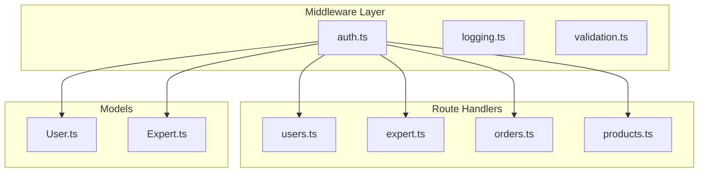
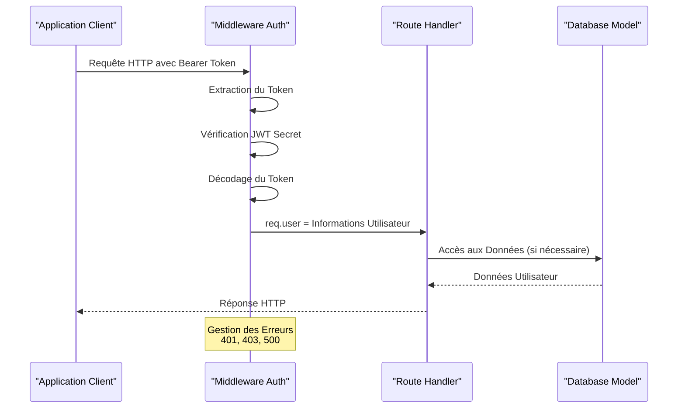
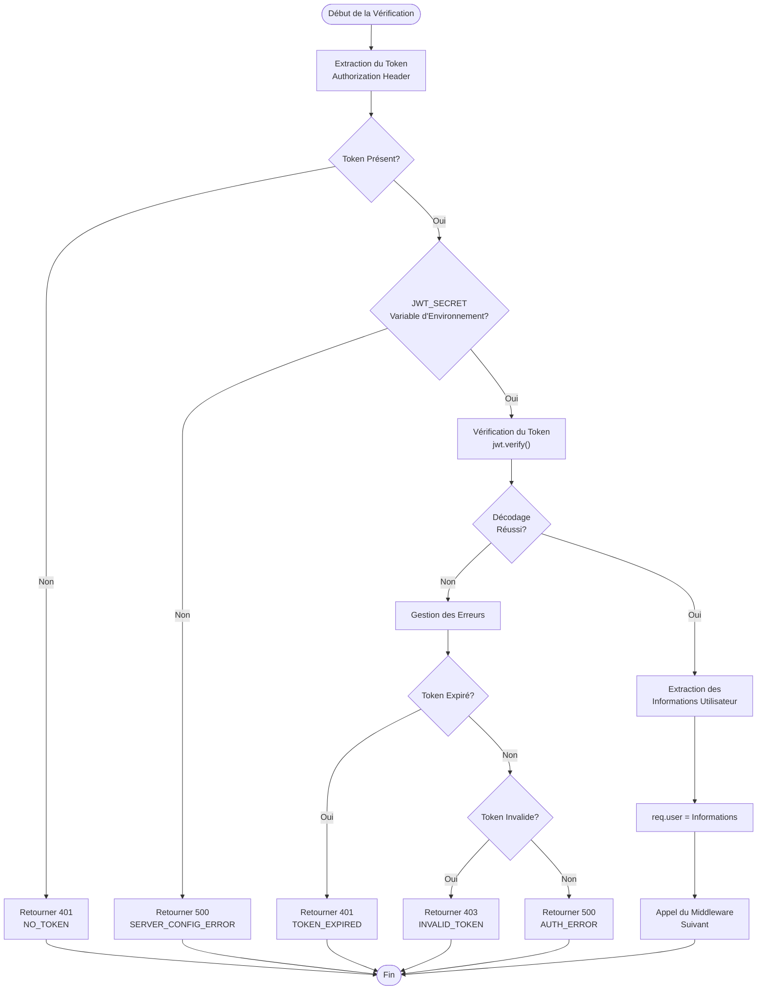
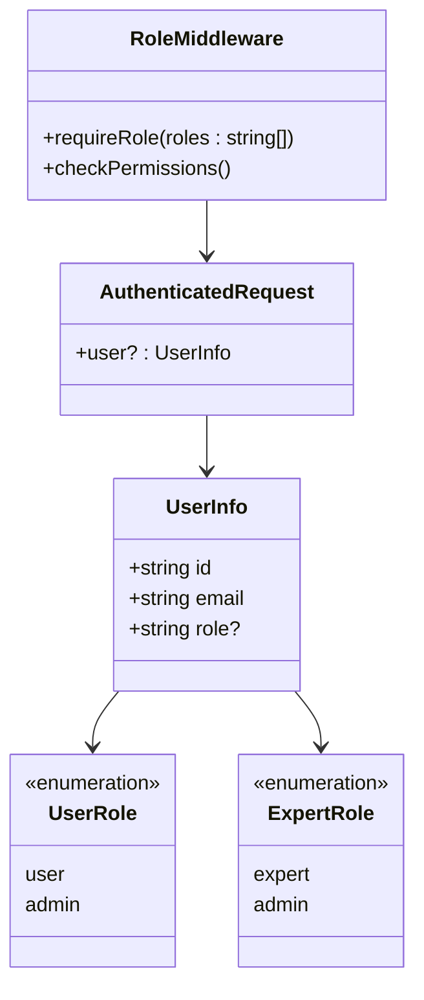
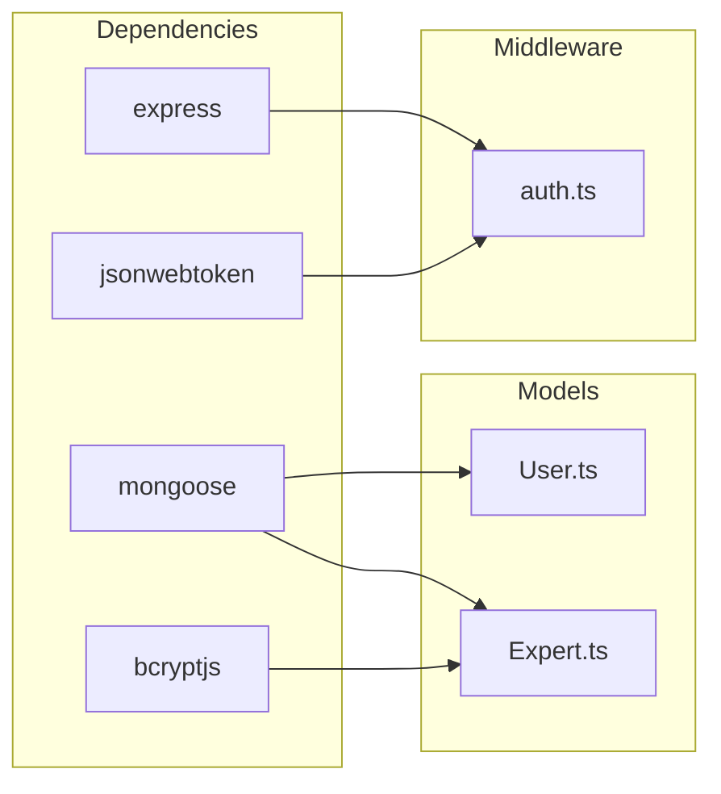

# Middleware d'Authentification JWT

<cite>
**Fichiers Référencés dans ce Document**
- [auth.ts](file://apps/api-backend/src/middleware/auth.ts)
- [users.ts](file://apps/api-backend/src/routes/users.ts)
- [expert.ts](file://apps/api-backend/src/routes/expert.ts)
- [Expert.ts](file://apps/api-backend/src/models/Expert.ts)
- [User.ts](file://apps/api-backend/src/models/User.ts)
- [server.ts](file://apps/api-backend/src/server.ts)
- [useAuth.ts](file://apps/expert-desk/src/hooks/useAuth.ts)
</cite>

## Table des Matières
1. [Introduction](#introduction)
2. [Structure du Projet](#structure-du-projet)
3. [Composants Principaux](#composants-principaux)
4. [Vue d'Ensemble de l'Architecture](#vue-densemble-de-larchitecture)
5. [Analyse Détaillée des Composants](#analyse-détaillée-des-composants)
6. [Analyse des Dépendances](#analyse-des-dépendances)
7. [Considérations de Performance](#considérations-de-performance)
8. [Guide de Dépannage](#guide-de-dépannage)
9. [Conclusion](#conclusion)

## Introduction

Le middleware d'authentification JWT (JSON Web Token) constitue le cœur de la sécurité des routes Express dans cette application. Il fournit une couche d'authentification robuste qui sécurise les endpoints API en vérifiant la validité des tokens JWT, extrayant les informations utilisateur et gérant les rôles différenciés entre clients et experts.

Ce système d'authentification utilise plusieurs couches de sécurité :
- **Authentification obligatoire** avec `authenticateToken`
- **Authentification optionnelle** avec `optionalAuth`
- **Contrôle de rôle** avec `requireRole`
- **Gestion des erreurs** avec codes d'erreur HTTP spécifiques
- **Validation des tokens** avec expiration automatique

## Structure du Projet

Le middleware d'authentification est organisé dans le répertoire `apps/api-backend/src/middleware/` et comprend principalement le fichier `auth.ts` qui contient toutes les fonctions d'authentification.



**Sources du Diagramme**
- [auth.ts](file://apps/api-backend/src/middleware/auth.ts#L1-L119)
- [users.ts](file://apps/api-backend/src/routes/users.ts#L1-L50)
- [expert.ts](file://apps/api-backend/src/routes/expert.ts#L1-L40)

**Sources de Section**
- [auth.ts](file://apps/api-backend/src/middleware/auth.ts#L1-L119)

## Composants Principaux

### Interface AuthenticatedRequest

L'interface `AuthenticatedRequest` étend l'interface `Request` d'Express pour ajouter la propriété `user` optionnelle :

```typescript
export interface AuthenticatedRequest extends Request {
  user?: {
    id: string;
    email: string;
    role?: string;
  };
}
```

Cette interface permet aux handlers de routes d'accéder aux informations utilisateur décodées du token JWT.

### Fonction authenticateToken

La fonction principale `authenticateToken` implémente l'authentification obligatoire :

```typescript
export const authenticateToken = (req: AuthenticatedRequest, res: Response, next: NextFunction) => {
  const authHeader = req.headers['authorization'];
  const token = authHeader && authHeader.split(' ')[1];
  
  if (!token) {
    return res.status(401).json({ 
      error: 'Access denied. No token provided.',
      code: 'NO_TOKEN'
    });
  }
  
  // Vérification du token...
};
```

### Fonction optionalAuth

La fonction `optionalAuth` permet l'accès sans authentification si aucun token n'est fourni :

```typescript
export const optionalAuth = (req: AuthenticatedRequest, res: Response, next: NextFunction) => {
  const authHeader = req.headers['authorization'];
  const token = authHeader && authHeader.split(' ')[1];

  if (!token) {
    return next();
  }
  
  // Vérification du token...
};
```

### Fonction requireRole

La fonction `requireRole` crée un middleware de contrôle de rôle :

```typescript
export const requireRole = (roles: string[]) => {
  return (req: AuthenticatedRequest, res: Response, next: NextFunction) => {
    if (!req.user) {
      return res.status(401).json({ 
        error: 'Authentication required',
        code: 'NO_AUTH'
      });
    }

    if (!req.user.role || !roles.includes(req.user.role)) {
      return res.status(403).json({ 
        error: 'Insufficient permissions',
        code: 'INSUFFICIENT_PERMISSIONS',
        required: roles,
        current: req.user.role
      });
    }

    next();
  };
};
```

**Sources de Section**
- [auth.ts](file://apps/api-backend/src/middleware/auth.ts#L4-L119)

## Vue d'Ensemble de l'Architecture

Le système d'authentification suit une architecture en couches qui sépare clairement les responsabilités :



**Sources du Diagramme**
- [auth.ts](file://apps/api-backend/src/middleware/auth.ts#L10-L50)
- [users.ts](file://apps/api-backend/src/routes/users.ts#L15-L25)

## Analyse Détaillée des Composants

### Processus de Vérification du Token JWT

Le processus de vérification du token JWT suit un flux strict avec gestion d'erreurs détaillée :



**Sources du Diagramme**
- [auth.ts](file://apps/api-backend/src/middleware/auth.ts#L10-L50)

### Gestion des Rôles Différentiés

Le système supporte deux types d'utilisateurs principaux : clients (`user`) et experts (`expert`). Les rôles sont gérés via la fonction `requireRole` :



**Sources du Diagramme**
- [auth.ts](file://apps/api-backend/src/middleware/auth.ts#L94-L119)
- [User.ts](file://apps/api-backend/src/models/User.ts#L1-L20)
- [Expert.ts](file://apps/api-backend/src/models/Expert.ts#L1-L20)

### Implémentation dans les Routes

Voici comment le middleware est utilisé dans différentes routes :

#### Route Utilisateur avec Contrôle de Rôle

```typescript
// Route protégée par authentification et rôle admin
router.get('/', authenticateToken, requireRole(['admin']), async (req: any, res: any) => {
  // Logique métier...
});
```

#### Route Expert avec Authentification Optionnelle

```typescript
// Route accessible même sans token
router.get('/public-data', optionalAuth, async (req: any, res: any) => {
  // Logique métier...
});
```

#### Route Sanctuaire avec Authentification Temporaire

```typescript
// Authentification temporaire pour le sanctuaire
router.post('/auth/sanctuaire', async (req: any, res: any) => {
  // Génération d'un token temporaire (24h)
  const token = jwt.sign(
    { 
      userId: user._id, 
      email: user.email,
      type: 'sanctuaire_access'
    },
    process.env.JWT_SECRET || 'fallback_secret',
    { expiresIn: '24h' }
  );
});
```

**Sources de Section**
- [users.ts](file://apps/api-backend/src/routes/users.ts#L15-L30)
- [users.ts](file://apps/api-backend/src/routes/users.ts#L100-L130)

## Analyse des Dépendances

Le middleware d'authentification dépend principalement de :

### Dépendances Externes



**Sources du Diagramme**
- [auth.ts](file://apps/api-backend/src/middleware/auth.ts#L1-L3)
- [Expert.ts](file://apps/api-backend/src/models/Expert.ts#L1-L3)

### Variables d'Environnement Critiques

Le système repose sur plusieurs variables d'environnement :

- `JWT_SECRET` : Clé secrète pour la signature des tokens
- `NODE_ENV` : Mode d'environnement (production, development, test)
- `MONGODB_URI` : Connexion à la base de données

**Sources de Section**
- [auth.ts](file://apps/api-backend/src/middleware/auth.ts#L20-L25)

## Considérations de Performance

### Optimisations Implémentées

1. **Vérification Précoce** : Le middleware vérifie l'absence de token avant toute opération coûteuse
2. **Gestion Asynchrone** : Utilisation de `async/await` pour éviter les callbacks
3. **Cache des Tokens** : Les tokens sont vérifiés uniquement lors de la première requête
4. **Erreurs Spécialisées** : Codes d'erreur HTTP spécifiques pour chaque cas d'échec

### Bonnes Pratiques de Sécurité

1. **Stockage du Secret** : Le secret JWT doit être stocké en tant que variable d'environnement
2. **Expiration Appropriée** : Les tokens expirent après 8 heures par défaut
3. **Validation Stricte** : Vérification stricte des formats d'email et de mot de passe
4. **Hashage des Mots de Passe** : Utilisation de bcrypt pour le hashage des mots de passe

## Guide de Dépannage

### Cas d'Échec Courants

#### 1. Token Absent (401 - NO_TOKEN)

**Symptôme** : Réponse avec `{ error: 'Access denied. No token provided.', code: 'NO_TOKEN' }`

**Résolution** :
- Vérifier que le header `Authorization` est présent
- S'assurer que le format est `Bearer TOKEN`
- Valider que le token n'est pas vide

#### 2. Token Expiré (401 - TOKEN_EXPIRED)

**Symptôme** : Réponse avec `{ error: 'Token expired', code: 'TOKEN_EXPIRED' }`

**Résolution** :
- Demander un nouveau token à l'utilisateur
- Implémenter une logique de refresh token côté client
- Vérifier l'heure système du serveur

#### 3. Token Invalide (403 - INVALID_TOKEN)

**Symptôme** : Réponse avec `{ error: 'Invalid token', code: 'INVALID_TOKEN' }`

**Résolution** :
- Vérifier la validité du format JWT
- S'assurer que le secret JWT est correct
- Valider que le token n'a pas été modifié

#### 4. Configuration Serveur (500 - SERVER_CONFIG_ERROR)

**Symptôme** : Réponse avec `{ error: 'Server configuration error', code: 'SERVER_CONFIG_ERROR' }`

**Résolution** :
- Vérifier que `JWT_SECRET` est défini
- Redémarrer l'application après modification des variables
- Valider les permissions d'accès aux variables d'environnement

### Scénarios de Test Recommandés

1. **Test de Base** : Vérification d'une route authentifiée
2. **Test d'Expiration** : Validation du comportement des tokens expirés
3. **Test de Rôle** : Vérification du contrôle de permissions
4. **Test d'Optionnalité** : Validation de l'authentification optionnelle
5. **Test d'Erreurs** : Simulation de différents cas d'échec

**Sources de Section**
- [auth.ts](file://apps/api-backend/src/middleware/auth.ts#L40-L60)

## Conclusion

Le middleware d'authentification JWT offre une solution robuste et flexible pour sécuriser les routes Express. Ses caractéristiques principales incluent :

- **Sécurité Renforcée** : Vérification stricte des tokens avec gestion d'erreurs détaillée
- **Flexibilité** : Support des authentifications obligatoires, optionnelles et par rôle
- **Performance** : Optimisations pour minimiser les latences
- **Maintenabilité** : Architecture modulaire et bien documentée

Cette implémentation constitue une base solide pour l'authentification des utilisateurs dans l'application, supportant efficacement les différents types d'utilisateurs (clients et experts) tout en maintenant des standards élevés de sécurité.