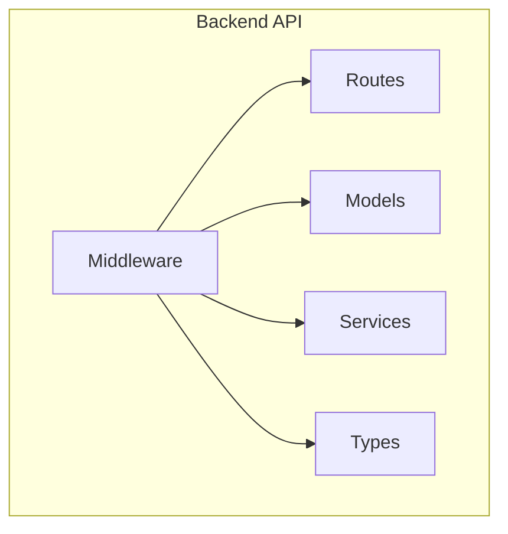
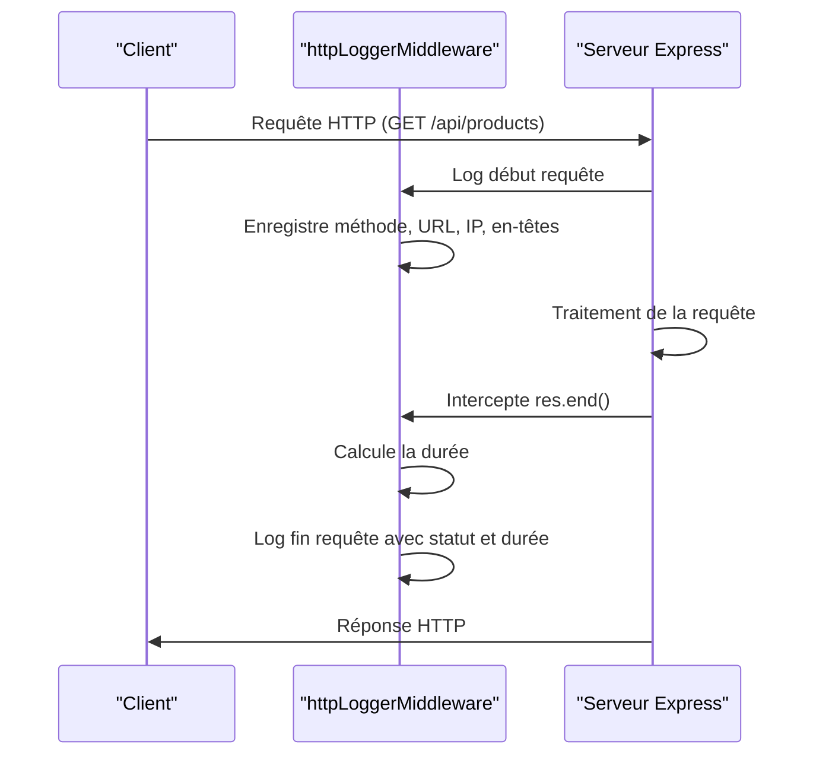
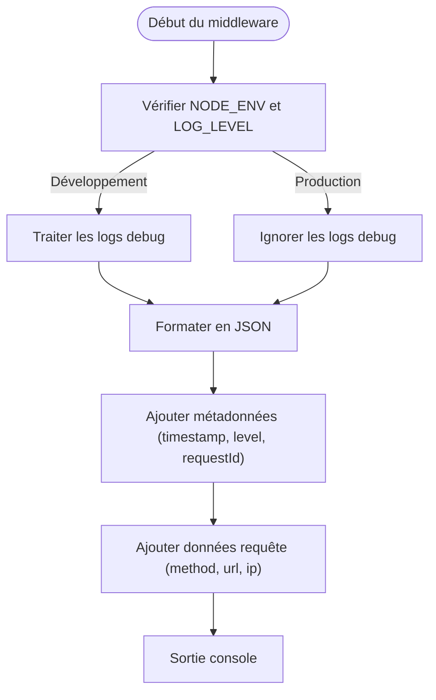
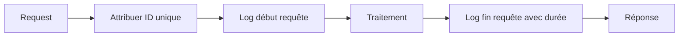
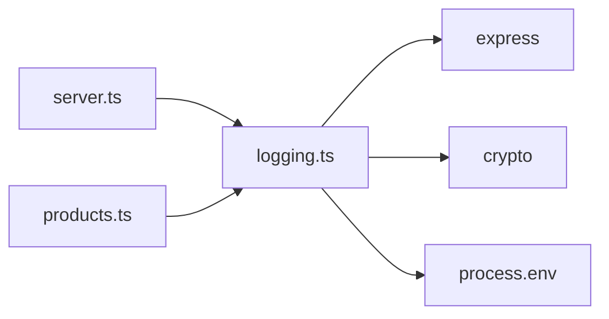

# Middleware de Journalisation

<cite>
**Fichiers référencés dans ce document**  
- [logging.ts](file://apps/api-backend/src/middleware/logging.ts)
- [server.ts](file://apps/api-backend/src/server.ts)
- [products.ts](file://apps/api-backend/src/routes/products.ts)
- [ecosystem.config.json](file://ecosystem.config.json)
- [validation.ts](file://apps/api-backend/src/middleware/validation.ts)
- [catalog.ts](file://apps/api-backend/src/catalog.ts)
- [ProductOrder.ts](file://apps/api-backend/src/models/ProductOrder.ts)
- [User.ts](file://apps/api-backend/src/models/User.ts)
- [Order.ts](file://apps/api-backend/src/models/Order.ts)
- [payments.ts](file://apps/api-backend/src/types/payments.ts)
- [stripe.ts](file://apps/api-backend/src/services/stripe.ts)
- [health.ts](file://apps/api-backend/src/routes/health.ts)
- [ready.ts](file://apps/api-backend/src/routes/ready.ts)
</cite>

## Table des matières
1. [Introduction](#introduction)
2. [Structure du projet](#structure-du-projet)
3. [Composants principaux](#composants-principaux)
4. [Vue d'ensemble de l'architecture](#vue-densemble-de-larchitecture)
5. [Analyse détaillée des composants](#analyse-détaillée-des-composants)
6. [Analyse des dépendances](#analyse-des-dépendances)
7. [Considérations de performance](#considérations-de-performance)
8. [Guide de dépannage](#guide-de-dépannage)
9. [Conclusion](#conclusion)

## Introduction
Ce document présente une analyse complète du middleware de journalisation (logging.ts) dans le cadre de l'application Oracle Lumira. Le middleware joue un rôle central dans l'observabilité du système, en capturant les métadonnées des requêtes HTTP, en structurant les logs au format JSON, et en intégrant des niveaux de log (info, error, debug). Il est conçu pour fonctionner en étroite collaboration avec Express, d'autres middlewares, et des services externes, tout en offrant une configuration flexible pour la sortie des logs (console, fichiers, services externes).

## Structure du projet
Le middleware de journalisation est situé dans le répertoire `apps/api-backend/src/middleware/` et fait partie d'une architecture backend Node.js/Express bien structurée. Il interagit avec les routes, les modèles, les services et les fichiers de configuration.



**Sources du diagramme**
- [logging.ts](file://apps/api-backend/src/middleware/logging.ts)
- [server.ts](file://apps/api-backend/src/server.ts)

**Sources de la section**
- [logging.ts](file://apps/api-backend/src/middleware/logging.ts)
- [server.ts](file://apps/api-backend/src/server.ts)

## Composants principaux

Le middleware de journalisation est composé de plusieurs composants clés :
- **requestIdMiddleware** : Génère et gère un ID de requête unique pour chaque requête HTTP.
- **structuredLogger** : Fournit une interface de journalisation structurée avec différents niveaux (info, error, warn, debug).
- **httpLoggerMiddleware** : Enregistre le cycle de vie des requêtes HTTP, du début à la fin.
- **errorLoggerMiddleware** : Capture et journalise les erreurs non gérées.
- **dbLogger** : Journalise les opérations de base de données avec le suivi des performances.
- **securityLogger** : Journalise les événements de sécurité tels que l'authentification et les accès refusés.

**Sources de la section**
- [logging.ts](file://apps/api-backend/src/middleware/logging.ts#L1-L220)

## Vue d'ensemble de l'architecture

L'architecture de journalisation est intégrée au serveur Express et fonctionne en tandem avec d'autres middlewares de sécurité et de limitation de débit.

```mermaid
graph TD
Client[Client] --> |Requête HTTP| Server[Serveur Express]
Server --> RequestId[requestIdMiddleware]
Server --> HttpLogger[httpLoggerMiddleware]
Server --> Security[Sécurité (Helmet, CORS)]
Server --> RateLimit[Limitation de débit]
Server --> Routes[Routes]
Routes --> DbLogger[dbLogger]
Routes --> SecurityLogger[securityLogger]
Server --> ErrorLogger[errorLoggerMiddleware]
Server --> |Réponse| Client
```

**Sources du diagramme**
- [logging.ts](file://apps/api-backend/src/middleware/logging.ts#L1-L220)
- [server.ts](file://apps/api-backend/src/server.ts#L0-L199)

## Analyse détaillée des composants

### Analyse du composant de journalisation HTTP

Le middleware de journalisation HTTP capture les métadonnées des requêtes et les durées de traitement, fournissant une visibilité complète sur le cycle de vie des requêtes.

#### Diagramme de séquence du middleware de journalisation


**Sources du diagramme**
- [logging.ts](file://apps/api-backend/src/middleware/logging.ts#L100-L150)
- [server.ts](file://apps/api-backend/src/server.ts#L100-L150)

#### Diagramme de flux de journalisation structurée


**Sources du diagramme**
- [logging.ts](file://apps/api-backend/src/middleware/logging.ts#L40-L90)

**Sources de la section**
- [logging.ts](file://apps/api-backend/src/middleware/logging.ts#L1-L220)
- [server.ts](file://apps/api-backend/src/server.ts#L1-L199)

### Vue conceptuelle
Le middleware de journalisation suit un flux de conception basé sur les principes de l'observabilité moderne, en intégrant des ID de corrélation, des formats structurés et des niveaux de log appropriés.



## Analyse des dépendances

Le middleware de journalisation dépend de plusieurs composants du système, notamment Express pour les objets Request et Response, et des variables d'environnement pour la configuration.



**Sources du diagramme**
- [logging.ts](file://apps/api-backend/src/middleware/logging.ts#L1-L10)
- [server.ts](file://apps/api-backend/src/server.ts#L1-L10)

**Sources de la section**
- [logging.ts](file://apps/api-backend/src/middleware/logging.ts#L1-L220)
- [ecosystem.config.json](file://ecosystem.config.json#L1-L30)

## Considérations de performance

Le middleware de journalisation a un impact minimal sur la latence, car les opérations de journalisation sont synchrones mais rapides. L'utilisation de `console.log` et `console.error` est optimisée dans les environnements Node.js modernes.

**Sources de la section**
- [logging.ts](file://apps/api-backend/src/middleware/logging.ts#L100-L150)
- [server.ts](file://apps/api-backend/src/server.ts#L100-L150)

## Guide de dépannage

Le middleware de journalisation est essentiel pour le débogage et la surveillance. Les logs structurés permettent une analyse facile des problèmes.

**Sources de la section**
- [logging.ts](file://apps/api-backend/src/middleware/logging.ts#L1-L220)
- [products.ts](file://apps/api-backend/src/routes/products.ts#L1-L781)

## Conclusion

Le middleware de journalisation de Oracle Lumira est une solution robuste et bien conçue qui fournit une observabilité complète du système. Son intégration avec Express, son format de log structuré en JSON, et sa prise en charge des niveaux de log en font un composant essentiel de l'architecture backend. La configuration via des variables d'environnement et l'intégration avec PM2 assurent une flexibilité et une scalabilité optimales.