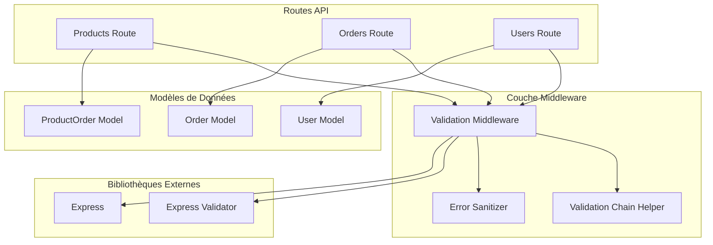
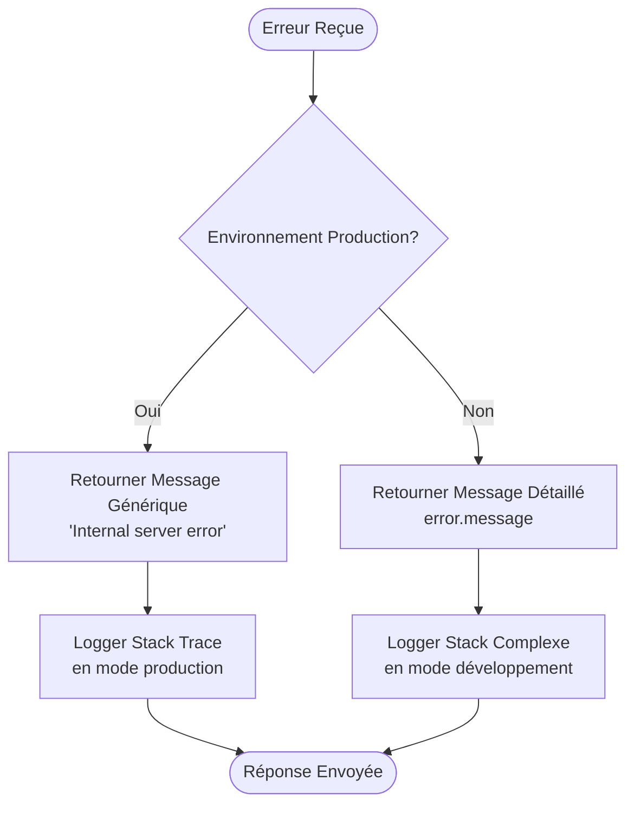
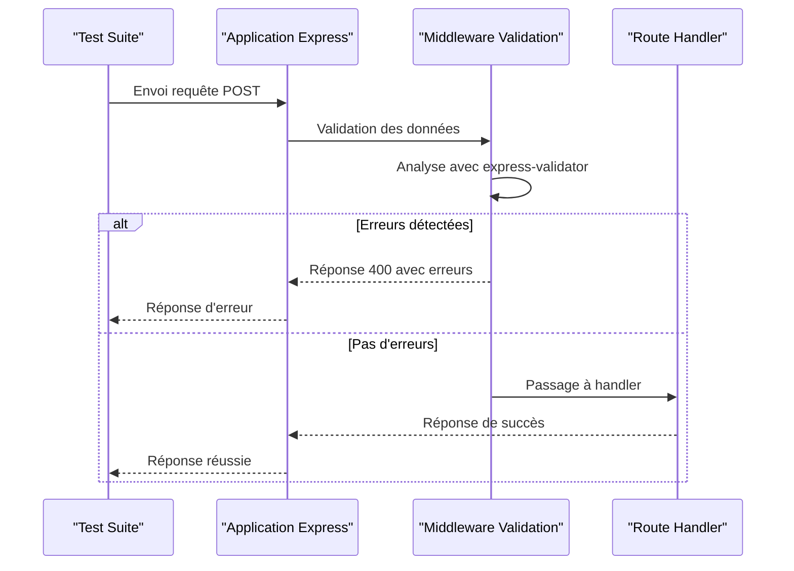

# Middleware de Validation des Données

<cite>
**Fichiers Référencés dans ce Document**
- [validation.ts](file://apps/api-backend/src/middleware/validation.ts)
- [products.ts](file://apps/api-backend/src/routes/products.ts)
- [orders.ts](file://apps/api-backend/src/routes/orders.ts)
- [ProductOrder.ts](file://apps/api-backend/src/models/ProductOrder.ts)
- [payments.ts](file://apps/api-backend/src/types/payments.ts)
- [products.route.test.ts](file://apps/api-backend/src/__tests__/products.route.test.ts)
- [package.json](file://apps/api-backend/package.json)
</cite>

## Table des Matières
1. [Introduction](#introduction)
2. [Architecture du Middleware](#architecture-du-middleware)
3. [Composants Principaux](#composants-principaux)
4. [Schémas de Validation](#schémas-de-validation)
5. [Gestion des Erreurs](#gestion-des-erreurs)
6. [Intégration avec les Routes](#intégration-avec-les-routes)
7. [Exemples Pratiques](#exemples-pratiques)
8. [Tests et Validation](#tests-et-validation)
9. [Bonnes Pratiques](#bonnes-pratiques)
10. [Conclusion](#conclusion)

## Introduction

Le middleware de validation de LumiraV1-MVP constitue un composant essentiel de l'écosystème backend, responsable de la vérification structurée et sécurisée des données entrantes dans toutes les requêtes API. Ce système centralisé garantit que toutes les données reçues par le serveur respectent des critères stricts de validation avant d'être traitées par les contrôleurs.

Le middleware utilise principalement la bibliothèque `express-validator` pour implémenter des validations robustes sur les corps de requête (body), les paramètres d'URL (params), et les chaînes de requête (query). Cette approche permet une validation uniforme et centralisée tout en offrant une flexibilité maximale pour adapter les règles selon les besoins spécifiques de chaque route.

## Architecture du Middleware

Le système de validation repose sur une architecture modulaire qui sépare clairement les responsabilités entre la validation proprement dite, la gestion des erreurs, et l'intégration avec les routes API.



**Sources du Diagramme**
- [validation.ts](file://apps/api-backend/src/middleware/validation.ts#L1-L64)
- [products.ts](file://apps/api-backend/src/routes/products.ts#L1-L50)

**Sources de Section**
- [validation.ts](file://apps/api-backend/src/middleware/validation.ts#L1-L64)

## Composants Principaux

### Validation Middleware Principal

Le cœur du système réside dans la fonction `validateRequest`, qui constitue le middleware de validation principal. Cette fonction s'exécute après que `express-validator` a analysé les requêtes et génère des erreurs potentielles.

```typescript
export const validateRequest = (req: Request, res: Response, next: NextFunction): void => {
  const errors = validationResult(req);
  
  if (!errors.isEmpty()) {
    res.status(400).json({
      error: 'Validation failed',
      details: errors.array().map(error => ({
        field: error.type === 'field' ? error.path : 'unknown',
        message: error.msg,
        value: error.type === 'field' ? error.value : undefined,
      })),
      timestamp: new Date().toISOString(),
    });
    return;
  }
  
  next();
};
```

Cette implémentation offre plusieurs avantages critiques :
- **Centralisation** : Toutes les erreurs de validation sont gérées de manière uniforme
- **Standardisation** : La réponse d'erreur suit un format cohérent
- **Flexibilité** : Les détails d'erreur incluent le champ concerné et sa valeur originale
- **Traceabilité** : L'horodatage permet un suivi précis des erreurs

### Chaîne de Validation Helper

La fonction `createValidationChain` simplifie la création de chaînes de validation complexes :

```typescript
export const createValidationChain = (validators: ValidationChain[]) => {
  return [...validators, validateRequest];
};
```

Cette approche permet de :
- **Réutilisation** : Éviter la duplication du middleware de validation
- **Flexibilité** : Adapter facilement les chaînes selon les besoins
- **Lisibilité** : Garder le code des routes propre et concis

### Nettoyage d'Erreurs

Le système intègre également un mécanisme de nettoyage d'erreurs pour protéger les informations sensibles :

```typescript
export const sanitizeError = (error: unknown): { message: string; code?: string } => {
  if (error instanceof Error) {
    console.error('Server error:', error.stack);
    
    if (process.env.NODE_ENV === 'production') {
      return { message: 'Internal server error' };
    }
    
    return { message: error.message };
  }
  
  return { message: 'Unknown error occurred' };
};
```

**Sources de Section**
- [validation.ts](file://apps/api-backend/src/middleware/validation.ts#L8-L64)

## Schémas de Validation

### Types de Validation Disponibles

Le middleware supporte plusieurs types de validation intégrés dans `express-validator` :

1. **Validation de Corps de Requête (Body)** : Pour les données POST/PUT
2. **Validation de Paramètres (Params)** : Pour les segments d'URL
3. **Validation de Chaîne de Requête (Query)** : Pour les paramètres GET
4. **Validation Personnalisée** : Pour des règles métier complexes

### Exemple de Schéma Complexe

Voici un exemple typique de schéma de validation pour une route de produit :

```typescript
const createPaymentIntentValidators = createValidationChain([
  body('productId')
    .isString()
    .notEmpty()
    .withMessage('Product ID is required'),
  body('customerEmail')
    .optional()
    .isEmail()
    .withMessage('Valid email address required'),
  body('metadata')
    .optional()
    .isObject()
    .withMessage('Metadata must be an object')
]);
```

### Validation des Modèles de Données

Le système valide également les structures de données complexes à travers les modèles Mongoose :

```typescript
const ProductOrderSchema = new Schema<IProductOrder>({
  productId: { type: String, required: true, index: true },
  customerId: { type: String },
  customerEmail: { type: String, lowercase: true },
  amount: { type: Number, required: true, min: 0 },
  currency: { type: String, required: true, default: 'eur' },
  status: { 
    type: String, 
    enum: ['pending', 'processing', 'completed', 'failed', 'cancelled'],
    default: 'pending',
    index: true
  },
  paymentIntentId: { type: String, required: true, unique: true, index: true },
  completedAt: { type: Date },
  metadata: { type: Schema.Types.Mixed },
}, {
  timestamps: true,
  toJSON: {
    transform: (doc: any, ret: any) => {
      delete ret.__v;
      return ret;
    }
  }
});
```

**Sources de Section**
- [ProductOrder.ts](file://apps/api-backend/src/models/ProductOrder.ts#L1-L49)
- [validation.ts](file://apps/api-backend/src/middleware/validation.ts#L28-L30)

## Gestion des Erreurs

### Types d'Erreurs Générées

Le système de validation génère plusieurs catégories d'erreurs :

1. **Erreurs de Validation de Base** : Types incorrects, champs manquants
2. **Erreurs de Règles Métier** : Logique métier spécifique aux applications
3. **Erreurs de Système** : Problèmes internes du serveur
4. **Erreurs de Configuration** : Variables d'environnement manquantes

### Format de Réponse d'Erreur Standardisé

Toutes les erreurs suivent un format cohérent :

```json
{
  "error": "Validation failed",
  "details": [
    {
      "field": "email",
      "message": "Invalid email format",
      "value": "invalid-email"
    }
  ],
  "timestamp": "2024-01-15T10:30:00.000Z"
}
```

### Stratégie de Nettoyage d'Erreurs

Le système applique une stratégie de nettoyage adaptative basée sur l'environnement :



**Sources du Diagramme**
- [validation.ts](file://apps/api-backend/src/middleware/validation.ts#L42-L64)

**Sources de Section**
- [validation.ts](file://apps/api-backend/src/middleware/validation.ts#L10-L25)
- [validation.ts](file://apps/api-backend/src/middleware/validation.ts#L42-L64)

## Intégration avec les Routes

### Pattern d'Intégration Typique

Chaque route utilise le middleware de validation selon un pattern standardisé :

```typescript
router.post(
  '/create-payment-intent',
  createPaymentIntentValidators,
  async (req: Request, res: Response): Promise<void> => {
    // Le middleware de validation s'exécute ici automatiquement
    // Si des erreurs sont détectées, la requête ne passe pas au handler
    // Sinon, elle continue vers le code métier
  }
);
```

### Intégration avec Multer pour Uploads

Pour les routes nécessitant des uploads de fichiers, le middleware s'intègre avec Multer :

```typescript
router.post('/by-payment-intent/:paymentIntentId/client-submit', 
  uploadPermissive.fields([{ name: 'facePhoto', maxCount: 1 }, { name: 'palmPhoto', maxCount: 1 }]),
  createValidationChain([
    param('paymentIntentId')
      .isString()
      .isLength({ min: 1 })
      .trim()
      .withMessage('Order ID is required'),
  ]),
  async (req: any, res: any) => {
    // Validation automatique des paramètres d'URL
  }
);
```

### Validation Hybride

Certaines routes combinent la validation automatique avec des validations manuelles pour des cas spécifiques :

```typescript
// Validation automatique des champs requis
if (!productId) {
  res.status(400).json({
    error: 'Product ID is required',
    code: 'MISSING_PRODUCT_ID',
    message: 'The productId field is required and must be a non-empty string',
    validProductIds: Object.keys(PRODUCT_CATALOG),
    timestamp: new Date().toISOString(),
    requestId,
  });
  return;
}

// Validation automatique via express-validator
const createPaymentIntentValidators = createValidationChain([
  body('productId')
    .isString()
    .notEmpty()
    .withMessage('Product ID is required'),
]);
```

**Sources de Section**
- [products.ts](file://apps/api-backend/src/routes/products.ts#L40-L100)
- [orders.ts](file://apps/api-backend/src/routes/orders.ts#L40-L80)

## Exemples Pratiques

### Validation de Produit

Exemple complet de validation pour la création d'intentions de paiement :

```typescript
// Schéma de validation pour la route de paiement
const createPaymentIntentValidators = createValidationChain([
  body('productId')
    .isString()
    .notEmpty()
    .withMessage('Product ID is required')
    .custom(async (value) => {
      const product = getProductById(value);
      if (!product) {
        throw new Error('Product not found');
      }
      return true;
    }),
  body('customerEmail')
    .optional()
    .isEmail()
    .withMessage('Valid email address required'),
  body('metadata')
    .optional()
    .isObject()
    .withMessage('Metadata must be an object')
    .custom((value) => {
      // Validation personnalisée des métadonnées
      if (value && typeof value === 'object') {
        const keys = Object.keys(value);
        if (keys.some(key => key.length > 100)) {
          throw new Error('Metadata keys too long');
        }
      }
      return true;
    })
]);
```

### Validation de Commande

Validation pour les commandes avec gestion d'upload :

```typescript
// Validation des paramètres d'URL
const getOrderValidators = createValidationChain([
  param('orderId')
    .isString()
    .isLength({ min: 1 })
    .trim()
    .withMessage('Order ID is required'),
]);

// Validation des données de formulaire
const submitOrderValidators = createValidationChain([
  body('formData')
    .exists()
    .withMessage('Form data is required')
    .custom((value) => {
      try {
        const parsed = JSON.parse(value);
        if (!parsed.email || !parsed.level) {
          throw new Error('Missing required form fields');
        }
        return true;
      } catch {
        throw new Error('Invalid form data format');
      }
    }),
]);
```

### Validation de Produit avec Catalogue

Validation avec référence au catalogue de produits :

```typescript
// Validation avec contraintes de catalogue
const productValidators = createValidationChain([
  body('productId')
    .isString()
    .notEmpty()
    .withMessage('Product ID is required')
    .custom(async (value) => {
      const product = getProductById(value);
      if (!product) {
        throw new Error('Product not found in catalog');
      }
      return true;
    }),
  body('quantity')
    .optional()
    .isInt({ min: 1 })
    .toInt()
    .withMessage('Quantity must be a positive integer'),
]);
```

**Sources de Section**
- [products.ts](file://apps/api-backend/src/routes/products.ts#L40-L120)
- [orders.ts](file://apps/api-backend/src/routes/orders.ts#L40-L100)

## Tests et Validation

### Structure des Tests de Validation

Les tests suivent un pattern rigoureux pour couvrir tous les scénarios de validation :

```typescript
describe('POST /api/products/create-payment-intent', () => {
  describe('Validation Errors (4xx)', () => {
    it('should return 400 for missing productId', async () => {
      const response = await request(app)
        .post('/api/products/create-payment-intent')
        .send({
          customerEmail: 'test@example.com',
        })
        .expect(400);

      expect(response.body).toEqual({
        error: 'Product ID is required',
        code: 'MISSING_PRODUCT_ID',
        message: 'The productId field is required and must be a non-empty string',
        validProductIds: Object.keys(PRODUCT_CATALOG),
        timestamp: expect.any(String),
        requestId: expect.any(String),
      });
    });

    it('should return 404 for unknown product', async () => {
      const response = await request(app)
        .post('/api/products/create-payment-intent')
        .send({
          productId: 'unknown-product',
          customerEmail: 'test@example.com',
        })
        .expect(404);

      expect(response.body).toEqual({
        error: 'Product not found',
        code: 'PRODUCT_NOT_FOUND',
        message: "Product 'unknown-product' does not exist",
        validProductIds: Object.keys(PRODUCT_CATALOG),
        timestamp: expect.any(String),
        requestId: expect.any(String),
      });
    });
  });
});
```

### Couverture des Cas Limites

Les tests couvrent systématiquement :
- **Cas d'erreur attendus** : Champs manquants, formats invalides
- **Cas d'erreur inattendus** : Erreurs de serveur, exceptions
- **Cas limites** : Valeurs extrêmes, formats inhabituels
- **Cas de réussite** : Validation complète avec données valides

### Méthodes de Test Automatisées



**Sources du Diagramme**
- [products.route.test.ts](file://apps/api-backend/src/__tests__/products.route.test.ts#L40-L100)

**Sources de Section**
- [products.route.test.ts](file://apps/api-backend/src/__tests__/products.route.test.ts#L1-L100)

## Bonnes Pratiques

### Création de Nouveaux Schémas

Pour créer de nouveaux schémas de validation, suivez ces étapes :

1. **Identifier les champs critiques** : Déterminez quels champs doivent être validés
2. **Choisir les validateurs appropriés** : Utilisez les validateurs intégrés quand possible
3. **Ajouter des messages personnalisés** : Rendez les messages d'erreur compréhensibles
4. **Implémenter la validation personnalisée** : Pour les règles métier complexes

```typescript
// Exemple de nouvelle validation
const createUserValidators = createValidationChain([
  body('email')
    .isEmail()
    .normalizeEmail()
    .withMessage('Valid email address required'),
  body('password')
    .isLength({ min: 8 })
    .matches(/^(?=.*[a-z])(?=.*[A-Z])(?=.*\d)/)
    .withMessage('Password must be at least 8 characters with uppercase, lowercase and number'),
  body('username')
    .isAlphanumeric()
    .isLength({ min: 3, max: 20 })
    .withMessage('Username must be 3-20 alphanumeric characters'),
  body('profile')
    .optional()
    .isObject()
    .withMessage('Profile must be an object')
    .custom((value) => {
      // Validation personnalisée du profil
      if (value.bio && value.bio.length > 500) {
        throw new Error('Bio too long (max 500 characters)');
      }
      return true;
    }),
]);
```

### Optimisation des Performances

Pour optimiser les performances de validation :

1. **Ordre des validateurs** : Placez les validateurs rapides en premier
2. **Validation conditionnelle** : Utilisez `.optional()` quand approprié
3. **Validation personnalisée efficace** : Évitez les opérations coûteuses
4. **Cache des résultats** : Réutilisez les validations quand possible

### Sécurité et Protection

Implémentez ces mesures de sécurité :

1. **Nettoyage des données** : Utilisez `.trim()` et `.normalizeEmail()`
2. **Validation des types** : Toujours vérifier le type des données
3. **Protection contre les injections** : Validez les entrées utilisateur
4. **Limitation des tailles** : Contrôlez la taille des données

### Maintenance et Évolution

Pour maintenir et évoluer le système :

1. **Documentation** : Documentez chaque nouveau validateur
2. **Tests** : Ajoutez des tests pour chaque nouvelle validation
3. **Monitoring** : Surveillez les taux d'erreurs de validation
4. **Refactoring** : Améliorez régulièrement les schémas existants

## Conclusion

Le middleware de validation de LumiraV1-MVP représente un système robuste et flexible pour la gestion centralisée de la validation des données API. Son architecture modulaire, ses patterns de validation cohérents, et sa gestion d'erreurs sophistiquée en font un élément fondamental de l'infrastructure backend.

Les points clés à retenir :

- **Centralisation** : Un point unique de validation pour toute l'application
- **Flexibilité** : Support de multiples types de validation et de schémas
- **Robustesse** : Gestion d'erreurs complète avec protection des informations sensibles
- **Performance** : Optimisations pour minimiser l'impact sur les performances
- **Maintenabilité** : Structure claire facilitant l'évolution et le debugging

Ce système garantit que toutes les données entrantes respectent des critères stricts de qualité et de sécurité, prévenant ainsi de nombreux problèmes potentiels avant même leur traitement par les contrôleurs métier.

L'investissement dans cette infrastructure de validation paye largement en termes de fiabilité, de sécurité, et de facilité de maintenance du système global.