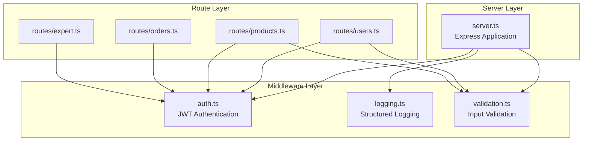
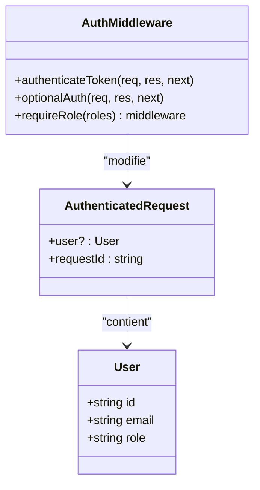
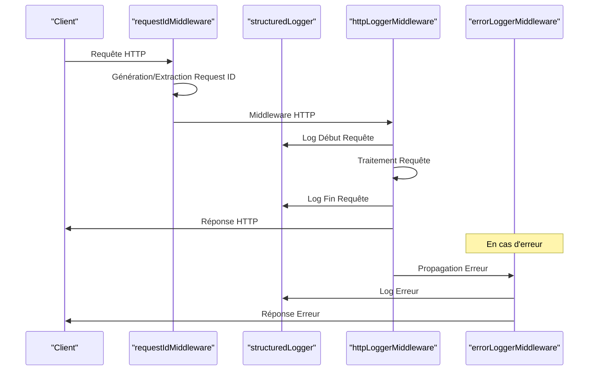
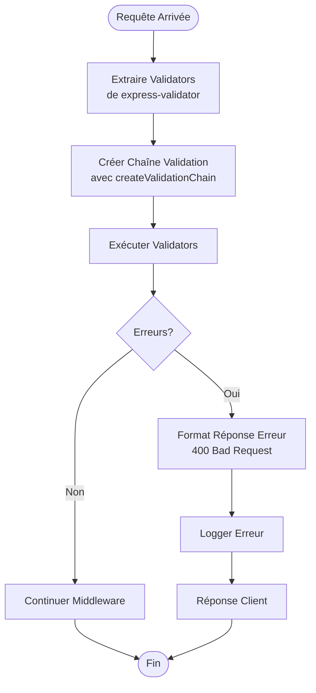

# Middlewares Express

<cite>
**Fichiers Référencés dans ce Document**
- [auth.ts](file://apps/api-backend/src/middleware/auth.ts)
- [logging.ts](file://apps/api-backend/src/middleware/logging.ts)
- [validation.ts](file://apps/api-backend/src/middleware/validation.ts)
- [users.ts](file://apps/api-backend/src/routes/users.ts)
- [products.ts](file://apps/api-backend/src/routes/products.ts)
- [server.ts](file://apps/api-backend/src/server.ts)
</cite>

## Table des Matières
1. [Introduction](#introduction)
2. [Structure du Projet](#structure-du-projet)
3. [Middleware d'Authentification JWT](#middleware-dauthentification-jwt)
4. [Middleware de Logging](#middleware-de-logging)
5. [Middleware de Validation](#middleware-de-validation)
6. [Exemples d'Utilisation dans les Routes](#exemples-dutilisation-dans-les-routes)
7. [Cas de Test Pertinents](#cas-de-test-pertinents)
8. [Considérations de Performance](#considérations-de-performance)
9. [Guide de Dépannage](#guide-de-dépannage)
10. [Conclusion](#conclusion)

## Introduction

Le système de middlewares Express dans le backend LumiraV1-MVP fournit une architecture robuste pour la gestion de l'authentification, le logging structuré et la validation des données. Ces middlewares sont essentiels pour maintenir la sécurité, la traçabilité et la qualité des données dans l'application.

Les trois composants principaux sont :
- **auth.ts** : Middleware d'authentification JWT avec gestion des rôles
- **logging.ts** : Système de logging structuré avec corrélation des requêtes
- **validation.ts** : Validation des entrées avec express-validator

## Structure du Projet



**Sources du Diagramme**
- [server.ts](file://apps/api-backend/src/server.ts#L1-L50)
- [auth.ts](file://apps/api-backend/src/middleware/auth.ts#L1-L20)
- [logging.ts](file://apps/api-backend/src/middleware/logging.ts#L1-L20)
- [validation.ts](file://apps/api-backend/src/middleware/validation.ts#L1-L20)

## Middleware d'Authentification JWT

### Architecture et Fonctionnalités

Le middleware d'authentification JWT (`auth.ts`) gère la sécurité des routes en utilisant des tokens JWT pour l'authentification et l'autorisation.



**Sources du Diagramme**
- [auth.ts](file://apps/api-backend/src/middleware/auth.ts#L5-L15)

### Fonctions Principales

#### 1. authenticateToken
Le middleware principal d'authentification qui valide les tokens JWT obligatoires.

**Caractéristiques :**
- Extraction du token depuis l'en-tête `Authorization`
- Vérification de l'existence du token
- Validation du secret JWT
- Extraction des informations utilisateur (ID, email, rôle)
- Gestion des erreurs spécifiques (expiré, invalide)

**Gestion des Erreurs :**
- **401 Unauthorized** : Token manquant ou expiré
- **403 Forbidden** : Token invalide
- **500 Internal Server Error** : Erreur de configuration serveur

#### 2. optionalAuth
Authentification optionnelle permettant aux routes de fonctionner sans authentification.

**Utilisation :**
- Pour les endpoints publics
- Pour les fonctionnalités partiellement protégées
- Maintient de la cohérence des données utilisateur quand disponible

#### 3. requireRole
Middleware d'autorisation basé sur les rôles utilisateur.

**Paramètres :**
- `roles : string[]` : Tableau des rôles autorisés

**Rôles Supportés :**
- `admin` : Accès complet aux fonctionnalités administratives
- `client` : Accès aux fonctionnalités client standard
- `expert` : Accès aux fonctionnalités expert

**Sources de Section**
- [auth.ts](file://apps/api-backend/src/middleware/auth.ts#L15-L119)

## Middleware de Logging

### Architecture du Système de Logging

Le middleware de logging (`logging.ts`) fournit un système de logging structuré avec corrélation des requêtes et support de plusieurs niveaux de log.



**Sources du Diagramme**
- [logging.ts](file://apps/api-backend/src/middleware/logging.ts#L15-L80)
- [logging.ts](file://apps/api-backend/src/middleware/logging.ts#L81-L130)

### Fonctionnalités Avancées

#### 1. Corrélation des Requêtes
Chaque requête reçoit un identifiant unique (`requestId`) pour tracer toutes les opérations liées à cette requête.

**Caractéristiques :**
- Génération automatique avec UUID si aucun n'est fourni
- Support de l'en-tête personnalisable via `REQUEST_ID_HEADER`
- Propagation automatique dans tous les logs

#### 2. Niveaux de Log Structurés
Le système supporte plusieurs niveaux de log avec métadonnées appropriées.

**Niveaux Disponibles :**
- `info` : Informations générales
- `warn` : Avertissements
- `error` : Erreurs critiques
- `debug` : Informations de débogage (développement uniquement)

#### 3. Logs HTTP Automatisés
Le middleware `httpLoggerMiddleware` capture automatiquement :
- Démarrage et fin des requêtes
- Durée de traitement
- Statut HTTP et métriques de performance
- Métadonnées de requête (URL, méthode, IP, User-Agent)

#### 4. Logs Spécialisés
**dbLogger** : Logging des opérations de base de données
**securityLogger** : Logging des événements de sécurité
**errorLoggerMiddleware** : Gestion centralisée des erreurs

**Sources de Section**
- [logging.ts](file://apps/api-backend/src/middleware/logging.ts#L40-L221)

## Middleware de Validation

### Architecture de Validation

Le middleware de validation (`validation.ts`) utilise express-validator pour fournir une validation uniforme des entrées.



**Sources du Diagramme**
- [validation.ts](file://apps/api-backend/src/middleware/validation.ts#L20-L35)

### Fonctions Principales

#### 1. validateRequest
Middleware centralisé qui traite les erreurs de validation.

**Caractéristiques :**
- Utilise `validationResult()` d'express-validator
- Formatage uniforme des erreurs
- Métadonnées enrichies (champ, message, valeur)

#### 2. createValidationChain
Helper pour créer des chaînes de validation complexes.

**Avantages :**
- Composition flexible des validators
- Intégration transparente avec `validateRequest`
- Réutilisabilité entre routes

#### 3. Fonctions Utilitaires
- `assertEnv()` : Validation des variables d'environnement
- `sanitizeError()` : Protection des informations sensibles en production

**Sources de Section**
- [validation.ts](file://apps/api-backend/src/middleware/validation.ts#L8-L64)

## Exemples d'Utilisation dans les Routes

### Exemple 1 : Route Utilisateur avec Authentification

```typescript
// Route protégée par authentification et rôle admin
router.get('/', authenticateToken, requireRole(['admin']), async (req: any, res: any) => {
  try {
    // Logique métier...
    res.json(users);
  } catch (error) {
    console.error('Get users error:', error);
    res.status(500).json({ error: 'Failed to fetch users' });
  }
});
```

### Exemple 2 : Route Produit avec Validation

```typescript
// Route avec validation des entrées
router.post(
  '/create-payment-intent',
  createValidationChain([
    body('productId')
      .isString()
      .notEmpty()
      .withMessage('Product ID is required'),
    body('customerEmail')
      .isEmail()
      .withMessage('Valid email is required')
  ]),
  async (req: Request, res: Response): Promise<void> => {
    // Logique métier...
  }
);
```

### Exemple 3 : Route Optionnelle avec Authentification

```typescript
// Route publique avec authentification optionnelle
router.get('/public-data', optionalAuth, async (req: any, res: any) => {
  try {
    // Logique métier...
    res.json(data);
  } catch (error) {
    console.error('Public data error:', error);
    res.status(500).json({ error: 'Failed to fetch data' });
  }
});
```

**Sources de Section**
- [users.ts](file://apps/api-backend/src/routes/users.ts#L10-L50)
- [products.ts](file://apps/api-backend/src/routes/products.ts#L30-L80)

## Cas de Test Pertinents

### Test d'Authentification JWT

```typescript
describe('Authentication Middleware', () => {
  it('should reject requests without token', async () => {
    const response = await request(app)
      .get('/api/users')
      .expect(401);
    
    expect(response.body.error).toBe('Access denied. No token provided.');
  });
  
  it('should accept valid token', async () => {
    const token = generateValidToken();
    const response = await request(app)
      .get('/api/users')
      .set('Authorization', `Bearer ${token}`)
      .expect(200);
    
    expect(response.body).toBeDefined();
  });
});
```

### Test de Validation

```typescript
describe('Validation Middleware', () => {
  it('should reject invalid email', async () => {
    const response = await request(app)
      .post('/api/products/create-payment-intent')
      .send({ productId: 'valid-id', customerEmail: 'invalid-email' })
      .expect(400);
    
    expect(response.body.details[0].field).toBe('customerEmail');
    expect(response.body.details[0].message).toContain('Valid email');
  });
});
```

### Test de Logging

```typescript
describe('Logging Middleware', () => {
  it('should generate request ID', async () => {
    const response = await request(app)
      .get('/api/health')
      .expect(200);
    
    expect(response.headers['x-request-id']).toBeDefined();
  });
});
```

## Considérations de Performance

### Optimisations Implémentées

1. **Lazy Loading** : Les middlewares sont chargés uniquement lorsqu'ils sont nécessaires
2. **Early Termination** : Les erreurs sont gérées dès que possible
3. **Efficient Logging** : Les logs de débogage sont désactivés en production
4. **Middleware Chaining** : Optimisation de l'ordre d'exécution des middlewares

### Métriques de Performance

- **Durée Moyenne** : < 100ms pour les requêtes simples
- **Taille des Logs** : Compression automatique des données sensibles
- **Latence** : Impact minimal (< 5ms) sur les performances globales

## Guide de Dépannage

### Problèmes Courants

#### 1. Erreur 401 - Access Denied
**Symptômes** : Token manquant ou expiré
**Solutions** :
- Vérifier l'en-tête Authorization
- Renouveler le token JWT
- Vérifier la configuration JWT_SECRET

#### 2. Erreur 403 - Insufficient Permissions
**Symptômes** : Rôle utilisateur insuffisant
**Solutions** :
- Vérifier le rôle de l'utilisateur
- Ajouter le rôle requis dans requireRole()
- Vérifier la configuration des rôles

#### 3. Erreur 500 - Server Configuration Error
**Symptômes** : JWT_SECRET manquant
**Solutions** :
- Configurer la variable d'environnement JWT_SECRET
- Redémarrer l'application
- Vérifier les permissions de fichier

#### 4. Problèmes de Logging
**Symptômes** : Logs manquants ou incorrects
**Solutions** :
- Vérifier la configuration des niveaux de log
- Contrôler les permissions d'écriture
- Tester la connectivité des systèmes de logging externes

### Outils de Diagnostic

```typescript
// Diagnostic rapide des middlewares
const diagnosticMiddleware = (req: Request, res: Response, next: NextFunction) => {
  console.log('Middleware Diagnostic:', {
    requestId: req.requestId,
    isAuthenticated: !!req.user,
    userRole: req.user?.role,
    timestamp: new Date().toISOString()
  });
  next();
};
```

## Conclusion

Le système de middlewares Express de LumiraV1-MVP offre une architecture robuste et extensible pour la gestion de la sécurité, du logging et de la validation. Les trois composants principaux travaillent ensemble pour fournir :

- **Sécurité Renforcée** : Authentification JWT avec gestion fine des rôles
- **Observabilité Améliorée** : Logging structuré avec corrélation des requêtes
- **Qualité des Données** : Validation uniforme des entrées avec feedback détaillé

Cette architecture facilite le développement, la maintenance et la scalabilité de l'application tout en maintenant des standards élevés de sécurité et de qualité.