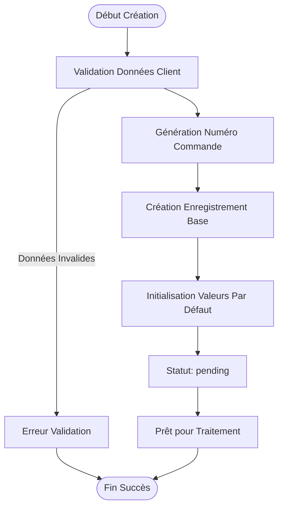
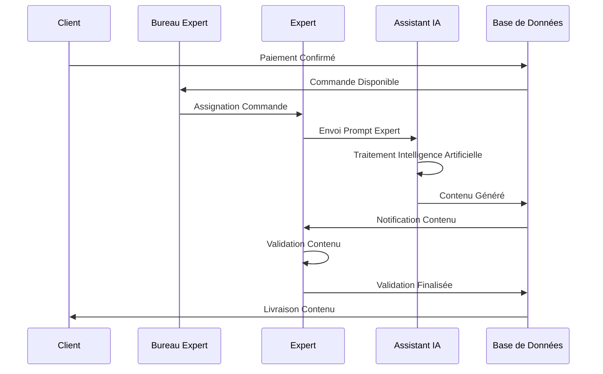
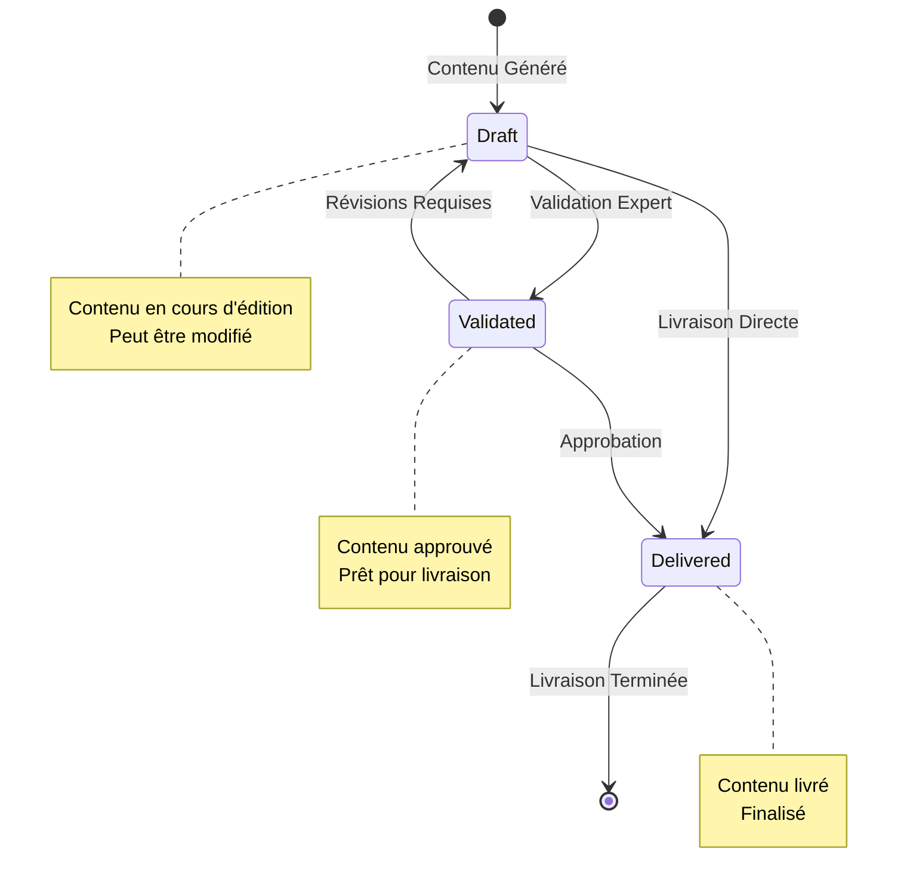
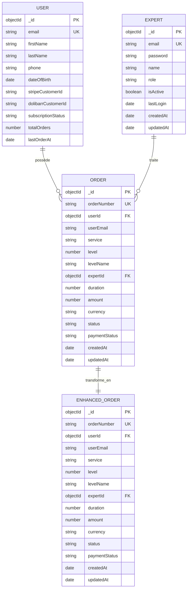
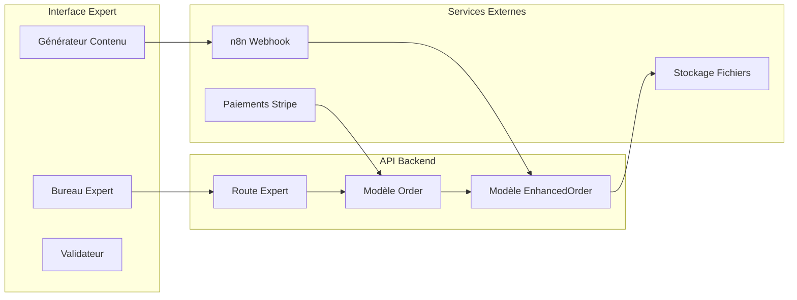
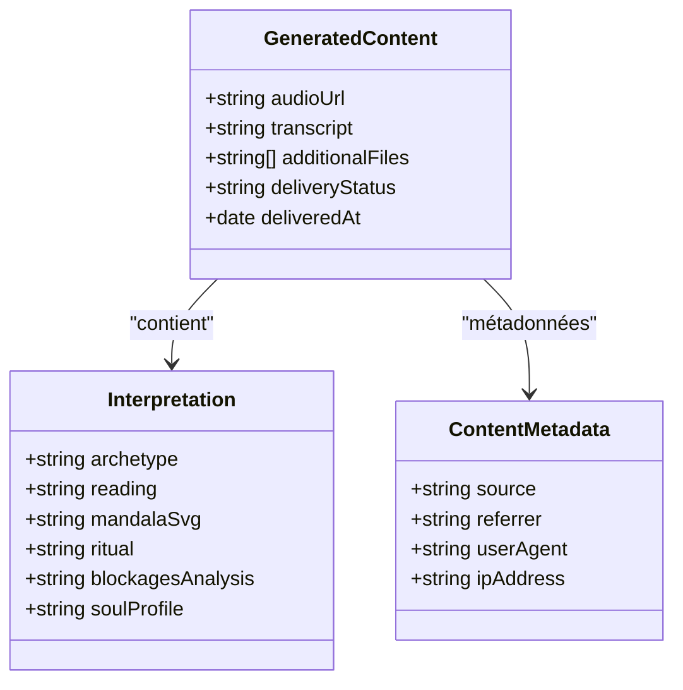
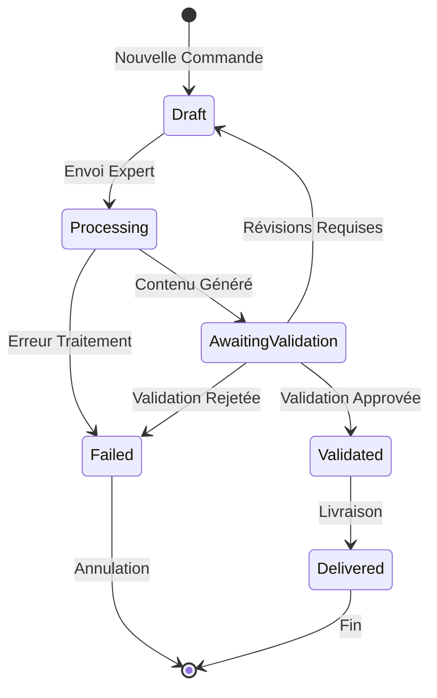

# Modèle EnhancedOrder

<cite>
**Fichiers Référencés dans ce Document**
- [EnhancedOrder.ts](file://apps/api-backend/src/models/EnhancedOrder.ts)
- [Order.ts](file://apps/api-backend/src/models/Order.ts)
- [Expert.ts](file://apps/api-backend/src/models/Expert.ts)
- [User.ts](file://apps/api-backend/src/models/User.ts)
- [expert.ts](file://apps/api-backend/src/routes/expert.ts)
- [ContentGenerator.tsx](file://apps/expert-desk/src/components/ContentGenerator.tsx)
- [ContentValidator.tsx](file://apps/expert-desk/src/components/ContentValidator.tsx)
</cite>

## Table des Matières
1. [Introduction](#introduction)
2. [Structure du Modèle](#structure-du-modèle)
3. [Cycle de Vie des Commandes](#cycle-de-vie-des-commandes)
4. [Relations et Interactions](#relations-et-interactions)
5. [Hooks et Méthodes](#hooks-et-méthodes)
6. [Exemple de Contenu Enrichi](#exemple-de-contenu-enrichi)
7. [Gestion des Statuts](#gestion-des-statuts)
8. [Optimisations et Index](#optimisations-et-index)
9. [Guide de Dépannage](#guide-de-dépannage)
10. [Conclusion](#conclusion)

## Introduction

Le modèle EnhancedOrder représente une commande enrichie qui émerge après traitement par l'expert dans le système Lumira. Il constitue une extension avancée du modèle Order traditionnel, ajoutant des fonctionnalités de transcription, d'interprétation, et de validation spécialisée. Ce modèle est essentiel pour gérer le flux de travail complet depuis la création d'une commande jusqu'à sa livraison finale au client.

Le système EnhancedOrder intègre plusieurs couches de traitement : d'abord la collecte des données initiales, puis l'enrichissement par l'expert, la validation par un expert qualifié, et enfin la livraison structurée du contenu enrichi. Cette approche garantit une qualité élevée et une traçabilité complète de chaque étape du processus.

## Structure du Modèle

### Interface IOrder Étendue

Le modèle EnhancedOrder étend l'interface IOrder existante avec des champs spécialisés pour le traitement enrichi :

```typescript
export interface IOrder extends Document {
  _id: mongoose.Types.ObjectId;
  orderNumber: string;
  userId?: mongoose.Types.ObjectId;
  userEmail: string;
  
  // Configuration de service améliorée
  service: 'basic' | 'premium' | 'vip';
  level: 1 | 2 | 3 | 4;
  levelName: 'Simple' | 'Intuitive' | 'Alchimique' | 'Intégrale';
  expertId?: mongoose.Types.ObjectId;
  duration: number;
  
  // Informations de paiement améliorées
  amount: number;
  currency: string;
  status: 'pending' | 'confirmed' | 'paid' | 'processing' | 'completed' | 'failed' | 'refunded' | 'cancelled';
  paymentStatus: 'pending' | 'completed' | 'failed' | 'refunded';
  
  // Données utilisateur enrichies
  formData: {
    firstName: string;
    lastName: string;
    email: string;
    phone?: string;
    dateOfBirth?: Date;
    specificQuestion?: string;
    preferences?: {
      audioVoice?: 'masculine' | 'feminine';
      deliveryFormat?: 'email' | 'whatsapp';
    };
  };
  
  // Fichiers clients enrichis
  files?: [{
    filename: string;
    originalName: string;
    path: string;
    mimetype: string;
    size: number;
    uploadedAt: Date;
  }];
  
  // Entrées client supplémentaires
  clientInputs?: {
    birthTime?: string;
    birthPlace?: string;
    specificContext?: string;
    lifeQuestion?: string;
  };
  
  // Traitement expert amélioré
  expertPrompt?: string;
  expertInstructions?: string;
  expertNotes?: string;
  
  // Gestion de session améliorée
  sessionUrl?: string;
  sessionStartTime?: Date;
  sessionEndTime?: Date;
  actualDuration?: number;
  
  // Contrôle qualité amélioré
  rating?: number;
  review?: string;
  
  // Livraison de contenu enrichie
  generatedContent?: {
    audioUrl?: string;
    transcript?: string;
    additionalFiles?: string[];
    deliveryStatus?: 'pending' | 'sent' | 'delivered' | 'failed';
    deliveredAt?: Date;
  };
  
  // Métadonnées de traitement
  createdAt: Date;
  updatedAt: Date;
  paidAt?: Date;
  completedAt?: Date;
}
```

### Schéma Mongoose Détaillé

Le schéma EnhancedOrder implémente des contraintes strictes et des validations sophistiquées :

```typescript
const OrderSchema: Schema = new Schema({
  // Numéro de commande unique
  orderNumber: { 
    type: String, 
    required: true, 
    unique: true,
    default: () => `ORD-${Date.now()}-${Math.random().toString(36).substr(2, 9).toUpperCase()}`
  },
  
  // Référence utilisateur avec support guest
  userId: { 
    type: mongoose.Schema.Types.ObjectId, 
    ref: 'User',
    required: false
  },
  
  // Email utilisateur optimisé
  userEmail: { 
    type: String, 
    required: true,
    trim: true,
    lowercase: true
  },
  
  // Configuration de service améliorée
  service: { 
    type: String, 
    enum: ['basic', 'premium', 'vip'], 
    required: true 
  },
  
  // Niveaux de lecture avec noms localisés
  level: { 
    type: Number, 
    enum: [1, 2, 3, 4], 
    required: true 
  },
  
  levelName: { 
    type: String, 
    enum: ['Simple', 'Intuitive', 'Alchimique', 'Intégrale'], 
    required: true 
  },
  
  // Expert assigné
  expertId: { 
    type: mongoose.Schema.Types.ObjectId, 
    ref: 'Expert',
    required: false
  },
  
  // Durée de consultation
  duration: { 
    type: Number, 
    required: true,
    min: 15 // minimum 15 minutes
  },
  
  // Informations de paiement améliorées
  amount: { 
    type: Number, 
    required: true,
    min: 0
  },
  
  currency: { 
    type: String, 
    default: 'eur',
    enum: ['eur', 'usd']
  },
  
  // Statuts améliorés
  status: { 
    type: String, 
    enum: ['pending', 'confirmed', 'paid', 'processing', 'completed', 'failed', 'refunded', 'cancelled'], 
    default: 'pending' 
  },
  
  paymentStatus: { 
    type: String, 
    enum: ['pending', 'completed', 'failed', 'refunded'], 
    default: 'pending' 
  },
  
  // Timestamps améliorés
  paidAt: { type: Date },
  completedAt: { type: Date },
  
  // Préférences de notification
  notifications: {
    sms: { type: Boolean, default: false },
    email: { type: Boolean, default: true },
    whatsapp: { type: Boolean, default: false }
  },
  
  // Métadonnées de traçabilité
  metadata: {
    source: { type: String },
    referrer: { type: String },
    userAgent: { type: String },
    ipAddress: { type: String }
  }
}, { 
  timestamps: true,
  toJSON: { virtuals: true },
  toObject: { virtuals: true }
});
```

**Sources de Section**
- [EnhancedOrder.ts](file://apps/api-backend/src/models/EnhancedOrder.ts#L1-L372)

## Cycle de Vie des Commandes

### Phase 1 : Création et Initialisation

La création d'une commande EnhancedOrder suit un processus structuré :



**Sources de Diagramme**
- [EnhancedOrder.ts](file://apps/api-backend/src/models/EnhancedOrder.ts#L165-L200)

### Phase 2 : Traitement par l'Expert

Une fois la commande payée, elle entre dans le processus de traitement expert :



**Sources de Diagramme**
- [expert.ts](file://apps/api-backend/src/routes/expert.ts#L400-L500)

### Phase 3 : Validation et Livraison

Le processus de validation implémente un système de contrôle qualité rigoureux :



**Sources de Diagramme**
- [EnhancedOrder.ts](file://apps/api-backend/src/models/EnhancedOrder.ts#L20-L30)

**Sources de Section**
- [EnhancedOrder.ts](file://apps/api-backend/src/models/EnhancedOrder.ts#L250-L320)
- [expert.ts](file://apps/api-backend/src/routes/expert.ts#L300-L400)

## Relations et Interactions

### Relations avec les Autres Modèles

Le modèle EnhancedOrder maintient des relations clés avec les autres entités du système :



**Sources de Diagramme**
- [EnhancedOrder.ts](file://apps/api-backend/src/models/EnhancedOrder.ts#L1-L50)
- [User.ts](file://apps/api-backend/src/models/User.ts#L1-L30)
- [Expert.ts](file://apps/api-backend/src/models/Expert.ts#L1-L30)

### Flux de Communication

Les composants interagissent selon ces patterns :



**Sources de Diagramme**
- [expert.ts](file://apps/api-backend/src/routes/expert.ts#L1-L100)
- [ContentGenerator.tsx](file://apps/expert-desk/src/components/ContentGenerator.tsx#L1-L50)

**Sources de Section**
- [EnhancedOrder.ts](file://apps/api-backend/src/models/EnhancedOrder.ts#L1-L100)
- [Order.ts](file://apps/api-backend/src/models/Order.ts#L1-L100)

## Hooks et Méthodes

### Middleware Pre-Save

Le modèle implémente des hooks de validation sophistiqués :

```typescript
// Hook de validation des temps de session
OrderSchema.pre('save', function(next) {
  if (this.sessionStartTime && this.sessionEndTime) {
    const startTime = toDateSafe(this.sessionStartTime);
    const endTime = toDateSafe(this.sessionEndTime);
    
    if (startTime && endTime) {
      if (endTime <= startTime) {
        return next(new Error('Session end time must be after start time'));
      }
      
      // Calcul de la durée réelle
      this.actualDuration = Math.floor(
        (endTime.getTime() - startTime.getTime()) / (1000 * 60)
      );
    }
  }
  
  // Mise à jour des timestamps de complétion
  if (this.status === 'completed' && !this.completedAt) {
    this.completedAt = new Date();
  }
  
  // Mise à jour des timestamps de paiement
  if (this.paymentStatus === 'completed' && !this.paidAt) {
    this.paidAt = new Date();
  }
  
  next();
});
```

### Méthodes Utilitaires

Le modèle expose plusieurs méthodes pour la gestion avancée :

```typescript
// Calcul du montant de remboursement
OrderSchema.methods.calculateRefundAmount = function(): number {
  if (this.paymentStatus !== 'completed') return 0;
  
  const actualDuration = this.actualDuration || 0;
  const bookedDuration = this.duration;
  
  if (actualDuration >= bookedDuration) return 0;
  
  // Remboursement proportionnel au temps non utilisé
  const usedRatio = actualDuration / bookedDuration;
  const refundRatio = Math.max(0, 1 - usedRatio);
  
  return Math.floor(this.amount * refundRatio) / 100; // Convert from cents and round
};

// Vérification de possibilité d'annulation
OrderSchema.methods.canBeCancelled = function(): boolean {
  return ['pending', 'confirmed', 'paid'].includes(this.status) && 
         this.paymentStatus !== 'refunded';
};

// Vérification de possibilité de démarrage de session
OrderSchema.methods.canStartSession = function(): boolean {
  return this.status === 'confirmed' && 
         this.paymentStatus === 'completed' &&
         !this.sessionStartTime;
};
```

**Sources de Section**
- [EnhancedOrder.ts](file://apps/api-backend/src/models/EnhancedOrder.ts#L250-L320)

## Exemple de Contenu Enrichi

### Lecture de Niveau 2 Intuitive

Voici un exemple concret de contenu enrichi pour une lecture de niveau 2 (Intuitive) :

```json
{
  "orderNumber": "ORD-1234567890-ABCDEF",
  "level": 2,
  "levelName": "Intuitive",
  "content": {
    "transcription": "Votre lecture intuitive commence par une connexion profonde avec votre essence spirituelle...",
    "interpretation": {
      "archetype": "Le Sage",
      "reading": "Votre chemin actuel révèle des opportunités de croissance intellectuelle et spirituelle...",
      "mandalaSvg": "<svg>...</svg>",
      "ritual": "Méditation guidée pour connecter avec votre intuition...",
      "blockagesAnalysis": "Blocages émotionnels identifiés : résistance au changement...",
      "soulProfile": "Profil d'âme : explorateur spirituel, curieux, ouvert d'esprit..."
    },
    "audioFileUrl": "https://storage.googleapis.com/lumira-content/audio/1234567890.mp3",
    "additionalFiles": [
      "https://storage.googleapis.com/lumira-content/pdf/1234567890.pdf",
      "https://storage.googleapis.com/lumira-content/mandala/1234567890.svg"
    ]
  },
  "status": "validated",
  "validationDate": "2024-01-15T14:30:00Z",
  "metadata": {
    "source": "expert-desk",
    "ipAddress": "192.168.1.100",
    "userAgent": "Mozilla/5.0..."
  }
}
```

### Structure du Contenu Généré

Le contenu généré suit cette structure hiérarchique :



**Sources de Diagramme**
- [EnhancedOrder.ts](file://apps/api-backend/src/models/EnhancedOrder.ts#L150-L180)

**Sources de Section**
- [ContentGenerator.tsx](file://apps/expert-desk/src/components/ContentGenerator.tsx#L60-L93)

## Gestion des Statuts

### États du Cycle de Vie

Le système EnhancedOrder gère plusieurs états avec transitions spécifiques :



### Transitions de Statut

Chaque transition est contrôlée par des règles métier :

```typescript
// Validation des transitions de statut
const validateStatusTransition = (currentStatus: string, newStatus: string): boolean => {
  const validTransitions: {[key: string]: string[]} = {
    'pending': ['paid', 'processing'],
    'paid': ['processing'],
    'processing': ['awaiting_validation', 'failed'],
    'awaiting_validation': ['validated', 'draft'],
    'validated': ['delivered'],
    'failed': ['pending', 'cancelled']
  };
  
  return validTransitions[currentStatus]?.includes(newStatus) || false;
};
```

**Sources de Section**
- [EnhancedOrder.ts](file://apps/api-backend/src/models/EnhancedOrder.ts#L20-L30)
- [Order.ts](file://apps/api-backend/src/models\Order.ts#L20-L30)

## Optimisations et Index

### Stratégies d'Indexation

Le modèle utilise des index optimisés pour les requêtes fréquentes :

```typescript
// Indexes pour performances optimales
OrderSchema.index({ userId: 1, createdAt: -1 });
OrderSchema.index({ expertId: 1, createdAt: -1 });
OrderSchema.index({ userEmail: 1 });
OrderSchema.index({ orderNumber: 1 });
OrderSchema.index({ status: 1 });
OrderSchema.index({ paymentStatus: 1 });
OrderSchema.index({ stripePaymentIntentId: 1 });
OrderSchema.index({ 'formData.email': 1 });
```

### Virtual Fields

Des champs virtuels améliorent l'accès aux données dérivées :

```typescript
// Champ virtuel pour nom complet du client
OrderSchema.virtual('customerFullName').get(function() {
  const formData = this.formData as { firstName?: string; lastName?: string };
  return `${formData.firstName || ''} ${formData.lastName || ''}`.trim();
});

// Champ virtuel pour nom de service
OrderSchema.virtual('serviceDisplayName').get(function() {
  const serviceNames: { [key: string]: string } = {
    basic: 'Consultation Basique',
    premium: 'Consultation Premium',
    vip: 'Consultation VIP'
  };
  const serviceKey = this.service as string;
  return serviceNames[serviceKey] || serviceKey;
});
```

**Sources de Section**
- [EnhancedOrder.ts](file://apps/api-backend/src/models/EnhancedOrder.ts#L280-L320)

## Guide de Dépannage

### Problèmes Courants

#### 1. Erreurs de Validation de Temps de Session

**Symptôme** : `Session end time must be after start time`

**Solution** :
```typescript
// Vérification de la logique de validation
const validateSessionTimes = (startTime: Date, endTime: Date): boolean => {
  return endTime > startTime;
};
```

#### 2. Problèmes de Génération de Numéro de Commande

**Symptôme** : Conflits de numéro de commande

**Solution** :
```typescript
// Logique de génération robuste
const generateUniqueOrderNumber = (): string => {
  const timestamp = Date.now();
  const randomSuffix = Math.random().toString(36).substr(2, 9).toUpperCase();
  return `ORD-${timestamp}-${randomSuffix}`;
};
```

#### 3. Erreurs de Validation de Paiement

**Symptôme** : Montants de remboursement incorrects

**Solution** :
```typescript
// Validation précise des montants
const calculateRefundAmount = (order: IOrder): number => {
  if (order.paymentStatus !== 'completed') return 0;
  
  const durationUsed = order.actualDuration || 0;
  const durationBooked = order.duration;
  const ratioUsed = durationUsed / durationBooked;
  const ratioUnused = Math.max(0, 1 - ratioUsed);
  
  return Math.floor(order.amount * ratioUnused) / 100;
};
```

### Outils de Diagnostic

#### 1. Vérification des Index

```bash
# Vérifier les index MongoDB
db.orders.getIndexes()

# Analyser les performances des requêtes
db.orders.explain("executionStats").find({ status: "awaiting_validation" })
```

#### 2. Validation des Données

```typescript
// Script de validation des données
const validateEnhancedOrder = async (orderId: string) => {
  const order = await EnhancedOrder.findById(orderId);
  
  if (!order) {
    throw new Error('Order not found');
  }
  
  // Validation des champs obligatoires
  const requiredFields = ['orderNumber', 'userEmail', 'level', 'amount'];
  for (const field of requiredFields) {
    if (!order[field]) {
      throw new Error(`Missing required field: ${field}`);
    }
  }
  
  // Validation des dates
  if (order.sessionStartTime && order.sessionEndTime) {
    if (order.sessionEndTime <= order.sessionStartTime) {
      throw new Error('Invalid session timing');
    }
  }
  
  return true;
};
```

**Sources de Section**
- [EnhancedOrder.ts](file://apps/api-backend/src/models/EnhancedOrder.ts#L250-L280)

## Conclusion

Le modèle EnhancedOrder représente une solution sophistiquée pour la gestion des commandes enrichies dans le système Lumira. Il combine robustesse technique, flexibilité fonctionnelle, et expérience utilisateur optimale.

### Points Clés

1. **Architecture Modulaire** : Le modèle suit une approche modulaire permettant l'évolution continue
2. **Validation Rigoureuse** : Des hooks et méthodes de validation garantissent l'intégrité des données
3. **Flexibilité de Traitement** : Support des différents niveaux de lecture et formats de contenu
4. **Traçabilité Complète** : Métadonnées détaillées pour le suivi et l'audit
5. **Performance Optimisée** : Indexation stratégique pour les requêtes fréquentes

### Recommandations Futures

1. **Amélioration de l'IA** : Intégration de modèles d'IA plus avancés pour la génération de contenu
2. **Personnalisation** : Options de personnalisation accrues pour les experts
3. **Analytics** : Métriques avancées pour l'analyse des performances
4. **Internationalisation** : Support multilingue pour une expansion globale

Le modèle EnhancedOrder constitue une base solide pour l'écosystème Lumira, offrant une plateforme robuste pour la création et la distribution de contenu spirituel de haute qualité.