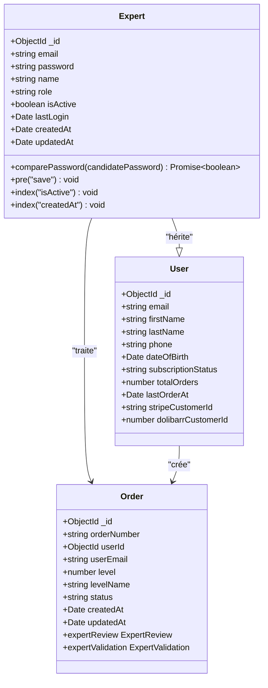
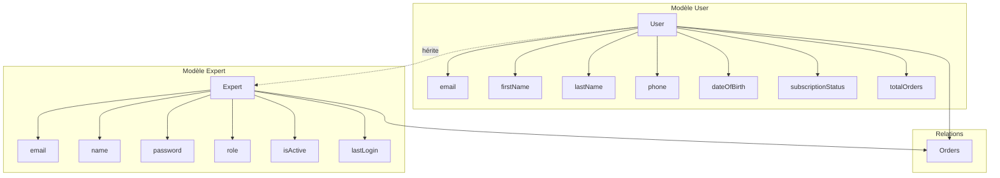
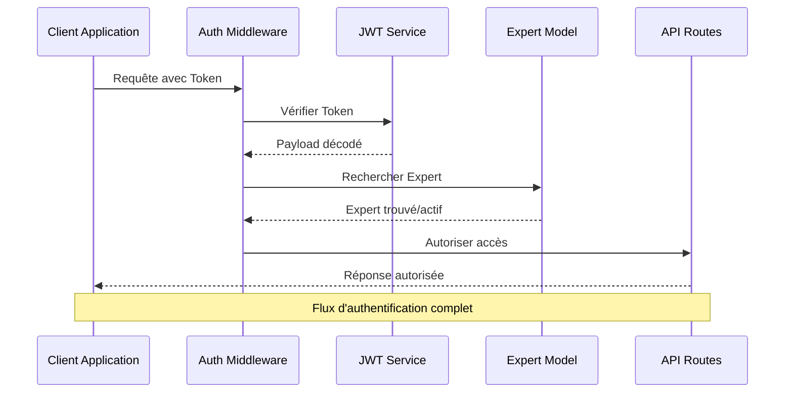
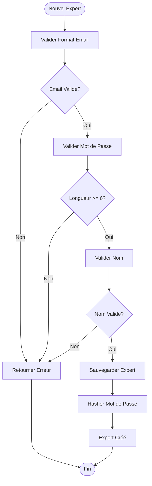
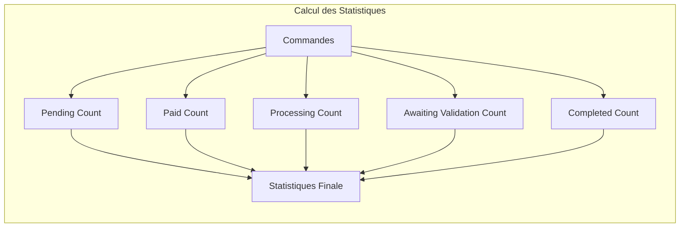
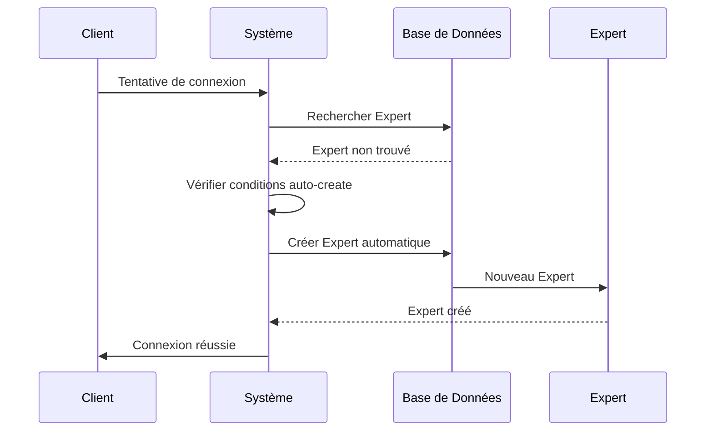

# Modèle Expert

<cite>
**Fichiers Référencés dans ce Document**
- [Expert.ts](file://apps/api-backend/src/models/Expert.ts)
- [User.ts](file://apps/api-backend/src/models/User.ts)
- [Order.ts](file://apps/api-backend/src/models/Order.ts)
- [expert.ts](file://apps/api-backend/src/routes/expert.ts)
- [auth.ts](file://apps/api-backend/src/middleware/auth.ts)
- [testData.ts](file://apps/api-backend/src/data/testData.ts)
- [DeskPage-new.tsx](file://apps/expert-desk/src/pages/DeskPage-new.tsx)
</cite>

## Table des Matières
1. [Introduction](#introduction)
2. [Structure du Modèle Expert](#structure-du-modèle-expert)
3. [Architecture et Relations](#architecture-et-relations)
4. [Mécanismes d'Authentification](#mécanismes-dauthentification)
5. [Validation des Données](#validation-des-données)
6. [Statistiques et Métriques](#statistiques-et-métriques)
7. [Processus d'Activation](#processus-dactivation)
8. [Exemple de Profil Expert](#exemple-de-profil-expert)
9. [Guide de Dépannage](#guide-de-dépannage)
10. [Conclusion](#conclusion)

## Introduction

Le modèle Expert représente un utilisateur expert autorisé à traiter les commandes dans le système Oracle Lumira. Ce modèle est conçu pour gérer les experts qui fournissent des consultations spirituelles et des lectures de tarot aux clients. Il intègre des fonctionnalités avancées d'authentification, de validation de contenu, et de gestion des statistiques de performance.

## Structure du Modèle Expert

### Interface IExpert

Le modèle Expert définit une interface TypeScript complète avec les propriétés suivantes :

```typescript
export interface IExpert extends Document {
  _id: mongoose.Types.ObjectId;
  email: string;
  password: string;
  name: string;
  role: string;
  isActive: boolean;
  lastLogin: Date;
  createdAt: Date;
  updatedAt: Date;
  comparePassword(candidatePassword: string): Promise<boolean>;
}
```

### Schéma Mongoose

Le schéma Expert utilise Mongoose pour définir la structure de données MongoDB :



**Sources du Diagramme**
- [Expert.ts](file://apps/api-backend/src/models/Expert.ts#L1-L83)
- [User.ts](file://apps/api-backend/src/models/User.ts#L1-L84)
- [Order.ts](file://apps/api-backend/src/models/Order.ts#L1-L277)

### Propriétés Clés

#### Identifiant Unique (_id)
- Type : `mongoose.Types.ObjectId`
- Description : Identifiant unique généré automatiquement par MongoDB
- Utilisation : Référence principale pour toutes les opérations CRUD

#### Email (email)
- Type : `String`
- Contraintes : Requis, unique, format email valide
- Validation : Expression régulière pour format email
- Normalisation : Converti en minuscules automatiquement

#### Mot de Passe (password)
- Type : `String`
- Contraintes : Requis, longueur minimale de 6 caractères
- Sécurité : Hashé automatiquement avant sauvegarde
- Méthode : `comparePassword()` pour validation

#### Nom (name)
- Type : `String`
- Contraintes : Requis, longueur maximale de 100 caractères
- Validation : Trim automatique des espaces

#### Rôle (role)
- Type : `String`
- Valeurs possibles : `'expert'`, `'admin'`
- Par défaut : `'expert'`
- Contrôle d'accès : Détermine les permissions d'accès

#### Statut Actif (isActive)
- Type : `Boolean`
- Par défaut : `true`
- Contrôle : Active/désactive le compte expert
- Sécurité : Empêche l'accès aux comptes désactivés

#### Dernière Connexion (lastLogin)
- Type : `Date`
- Automatisation : Mis à jour automatiquement lors de la connexion
- Audit : Trace l'activité des experts

**Sources de Section**
- [Expert.ts](file://apps/api-backend/src/models/Expert.ts#L1-L83)

## Architecture et Relations

### Relation avec le Modèle User

Le modèle Expert hérite des propriétés du modèle User tout en ajoutant des fonctionnalités spécifiques :



**Sources du Diagramme**
- [Expert.ts](file://apps/api-backend/src/models/Expert.ts#L1-L83)
- [User.ts](file://apps/api-backend/src/models/User.ts#L1-L84)

### Intégration avec le Système Expert Desk

Le modèle Expert s'intègre étroitement avec le système Expert Desk pour gérer :
- La file d'attente des commandes
- Les validations de contenu
- Les statistiques de performance
- L'authentification sécurisée

**Sources de Section**
- [expert.ts](file://apps/api-backend/src/routes/expert.ts#L1-L1057)

## Mécanismes d'Authentification

### Middleware d'Authentification

Le système d'authentification utilise plusieurs couches de sécurité :



**Sources du Diagramme**
- [auth.ts](file://apps/api-backend/src/middleware/auth.ts#L1-L119)
- [expert.ts](file://apps/api-backend/src/routes/expert.ts#L150-L180)

### Processus de Connexion

1. **Validation des Données** : Vérification du format email et mot de passe
2. **Recherche Expert** : Recherche dans la base de données
3. **Comparaison Mot de Passe** : Utilisation de `comparePassword()`
4. **Génération Token** : Création JWT avec expiration
5. **Mise à Jour Dernière Connexion** : Mise à jour automatique

### Contrôle d'Accès

Le système implémente un contrôle d'accès basé sur les rôles :

```typescript
// Middleware pour authentifier les experts uniquement
export const authenticateExpert = async (req: any, res: any, next: any) => {
  try {
    const token = req.header('Authorization')?.replace('Bearer ', '');
    
    if (!token) {
      return res.status(401).json({ error: 'Token d\'authentification requis' });
    }

    const decoded = jwt.verify(token, process.env.JWT_SECRET!) as any;
    const expert = await Expert.findById(decoded.expertId).select('-password');
    
    if (!expert || !expert.isActive) {
      return res.status(401).json({ error: 'Expert non autorisé' });
    }

    req.expert = expert;
    next();
  } catch (error) {
    res.status(401).json({ error: 'Token invalide' });
  }
};
```

**Sources de Section**
- [expert.ts](file://apps/api-backend/src/routes/expert.ts#L150-L180)
- [auth.ts](file://apps/api-backend/src/middleware/auth.ts#L1-L119)

## Validation des Données

### Contraintes de Validation

Le modèle Expert implémente plusieurs niveaux de validation :



**Sources du Diagramme**
- [Expert.ts](file://apps/api-backend/src/models/Expert.ts#L15-L50)

### Validation Spécifique

#### Niveau d'Expertise
Bien que le modèle Expert actuel ne contienne pas explicitement un champ `expertiseLevel`, il hérite des propriétés nécessaires pour supporter cette fonctionnalité :

```typescript
// Exemple de validation future pour expertiseLevel
const expertiseLevelSchema = Joi.object({
  expertiseLevel: Joi.number().min(1).max(5).required(),
  availabilityStatus: Joi.string().valid('available', 'busy', 'unavailable').default('available'),
  preferences: Joi.object({
    notificationPreferences: Joi.array().items(Joi.string()),
    preferredCommunication: Joi.string(),
    timezone: Joi.string()
  })
});
```

#### Statut de Disponibilité
Le statut de disponibilité influence directement la file d'attente des commandes :

- **Disponible** : Peut recevoir de nouvelles commandes
- **Occupé** : Ne peut pas accepter de nouvelles commandes
- **Indisponible** : Ne reçoit aucune nouvelle commande

**Sources de Section**
- [Expert.ts](file://apps/api-backend/src/models/Expert.ts#L15-L50)
- [testData.ts](file://apps/api-backend/src/data/testData.ts#L15-L40)

## Statistiques et Métriques

### Structure des Statistiques

Le système Expert Desk collecte plusieurs métriques importantes :

```typescript
interface ExpertStatistics {
  pending: number;           // Commandes en attente
  paid: number;             // Commandes payées
  processing: number;        // Commandes en cours
  awaitingValidation: number; // Commandes en validation
  completed: number;         // Commandes terminées
  treatedToday: number;      // Commandes traitées aujourd'hui
  totalTreated: number;      // Total des commandes traitées
}
```

### Calcul des Statistiques

Les statistiques sont calculées dynamiquement à partir des commandes associées :



**Sources du Diagramme**
- [expert.ts](file://apps/api-backend/src/routes/expert.ts#L700-L750)

### Exemple de Statistiques

Pour un expert typique, les statistiques peuvent inclure :

```json
{
  "pending": 4,
  "paid": 4,
  "processing": 0,
  "awaitingValidation": 0,
  "completed": 0,
  "treatedToday": 0,
  "totalTreated": 12
}
```

**Sources de Section**
- [testData.ts](file://apps/api-backend/src/data/testData.ts#L170-L176)
- [expert.ts](file://apps/api-backend/src/routes/expert.ts#L700-L750)

## Processus d'Activation

### Activation Automatique

Le système supporte l'activation automatique des experts pour certains cas :



**Sources du Diagramme**
- [expert.ts](file://apps/api-backend/src/routes/expert.ts#L100-L130)

### Conditions d'Activation

1. **Email Spécial** : `expert@oraclelumira.com`
2. **Mode Debug** : `ENABLE_AUTO_CREATE_EXPERT=true`
3. **Environnement Non-Production** : `NODE_ENV !== 'production'`

### Activation Manuel

Pour l'activation manuelle, un expert doit :
1. S'inscrire via `/api/expert/register`
2. Recevoir un email de confirmation
3. Se connecter via `/api/expert/login`
4. Commencer à traiter des commandes

**Sources de Section**
- [expert.ts](file://apps/api-backend/src/routes/expert.ts#L100-L130)
- [expert.ts](file://apps/api-backend/src/routes/expert.ts#L80-L120)

## Exemple de Profil Expert

### Profil Oracle Maya

Voici un exemple de profil expert complet basé sur les données de test :

```typescript
const oracleMaya: IExpert = {
  _id: '674b7e123456789012345001',
  name: 'Oracle Maya',
  email: 'maya@lumira-oracle.com',
  password: '$2b$10$8K5rOhQp4a5B9q8b9q8b9A$E8K5rOhQp4a5B9q8b9q8bA', // password: maya123
  specialties: ['Niveau 1', 'Niveau 2', 'Niveau 3'],
  expertise: ['Tarot', 'Numérologie', 'Astrologie'],
  isActive: true,
  joinDate: new Date(),
  statistics: {
    totalOrders: 15,
    completedOrders: 12,
    averageRating: 4.8,
    totalEarnings: 450.0
  }
};
```

### Caractéristiques du Profil

#### Informations Personnelles
- **Nom** : Oracle Maya
- **Email** : maya@lumira-oracle.com
- **Spécialités** : Niveau 1, 2, 3
- **Expertise** : Tarot, Numérologie, Astrologie

#### Statistiques de Performance
- **Total des commandes** : 15
- **Commandes complétées** : 12
- **Note moyenne** : 4.8/5
- **Revenus totaux** : 450€

#### Statut
- **Actif** : Oui
- **Date d'adhésion** : Date de création
- **Statistiques** : Métriques de performance détaillées

**Sources de Section**
- [testData.ts](file://apps/api-backend/src/data/testData.ts#L15-L40)

## Guide de Dépannage

### Problèmes Courants

#### Erreur d'Authentification
**Symptôme** : `Token invalide` ou `Expert non autorisé`

**Solutions** :
1. Vérifier la validité du token JWT
2. Confirmer que l'expert est activé (`isActive: true`)
3. Vérifier la date d'expiration du token
4. Redémarrer le processus de connexion

#### Problème de Mot de Passe
**Symptôme** : `Identifiants invalides` malgré mot de passe correct

**Solutions** :
1. Tester différentes variantes de casse
2. Vérifier les espaces au début/fin
3. Utiliser le mode debug pour diagnostics
4. Réinitialiser le mot de passe

#### Erreur de Base de Données
**Symptôme** : `Database error` lors de la création/modification

**Solutions** :
1. Vérifier la connectivité MongoDB
2. Confirmer les permissions de base de données
3. Vérifier la disponibilité des collections
4. Examiner les logs d'erreurs détaillés

### Diagnostic Technique

Le système inclut des outils de diagnostic intégrés :

```typescript
// Endpoint de diagnostic pour experts
router.get('/check', async (req, res) => {
  const expert = await Expert.findOne({ email: 'expert@oraclelumira.com' });
  
  if (expert) {
    console.log('🔍 Expert trouvé:', {
      email: expert.email,
      hasPassword: !!expert.password,
      passwordLength: expert.password ? expert.password.length : 0,
      passwordPreview: expert.password ? expert.password.substring(0, 10) + '...' : 'none'
    });
  }
});
```

**Sources de Section**
- [expert.ts](file://apps/api-backend/src/routes/expert.ts#L20-L50)

## Conclusion

Le modèle Expert constitue un composant central du système Oracle Lumira, offrant une architecture robuste pour la gestion des experts spécialisés dans les consultations spirituelles. Ses fonctionnalités d'authentification sécurisée, de validation de contenu, et de suivi des performances en font un élément essentiel du processus de traitement des commandes.

Les points clés à retenir sont :

- **Sécurité** : Authentification JWT avec contrôle d'accès basé sur les rôles
- **Flexibilité** : Support des profils experts personnalisés
- **Scalabilité** : Architecture modulaire permettant l'extension future
- **Fiabilité** : Validation complète des données et mécanismes de diagnostic

Cette documentation fournit une base solide pour comprendre, maintenir et développer le système Expert Desk dans le cadre du projet Oracle Lumira.