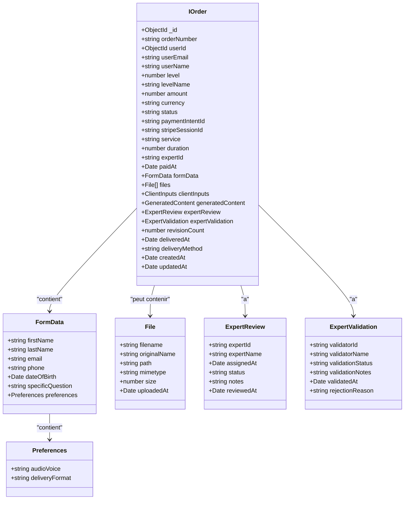
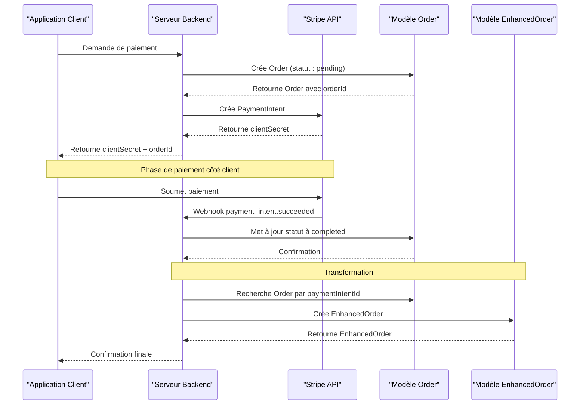
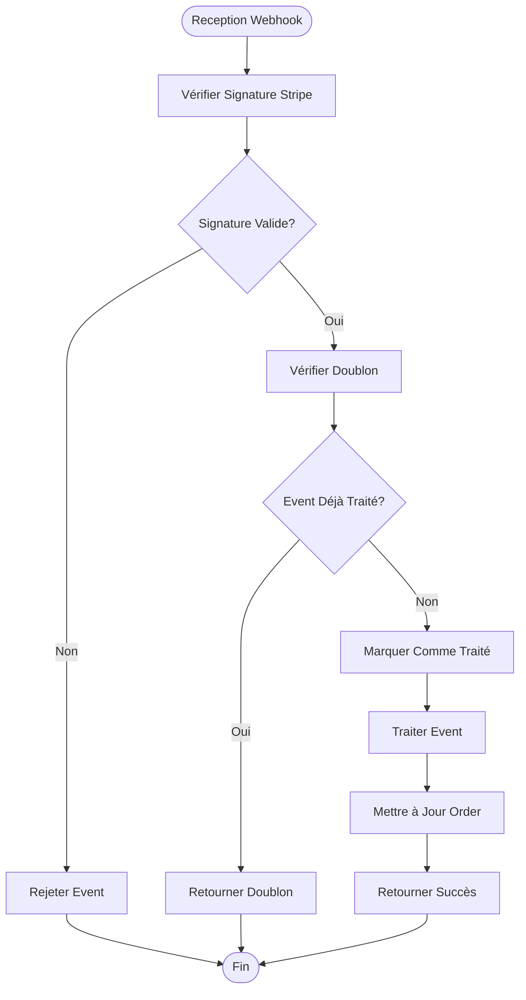
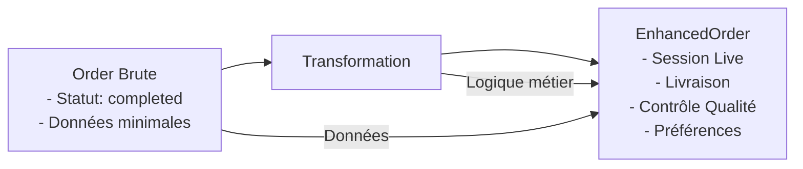
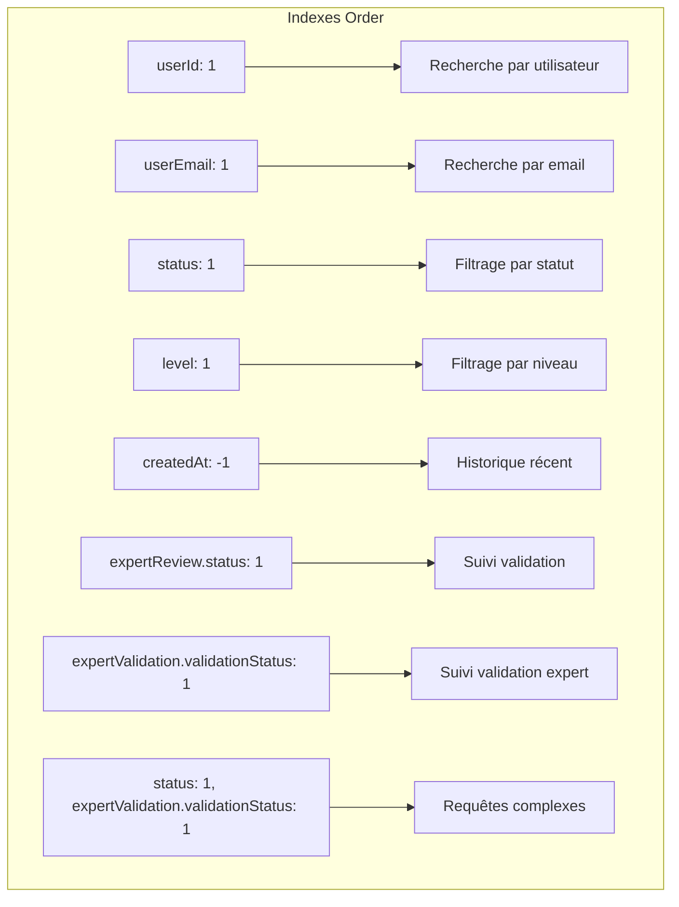
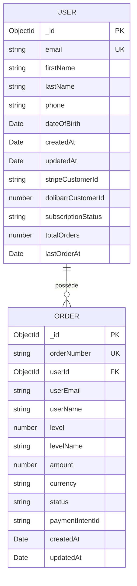
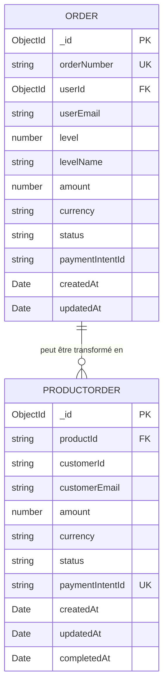
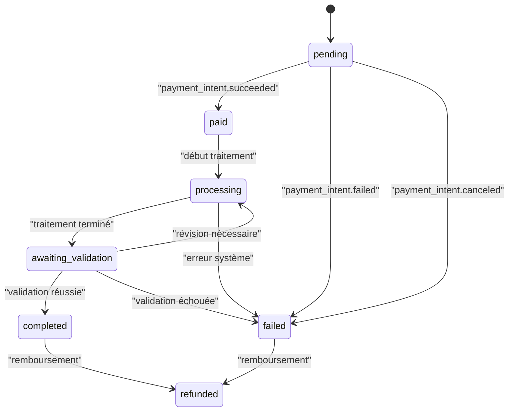
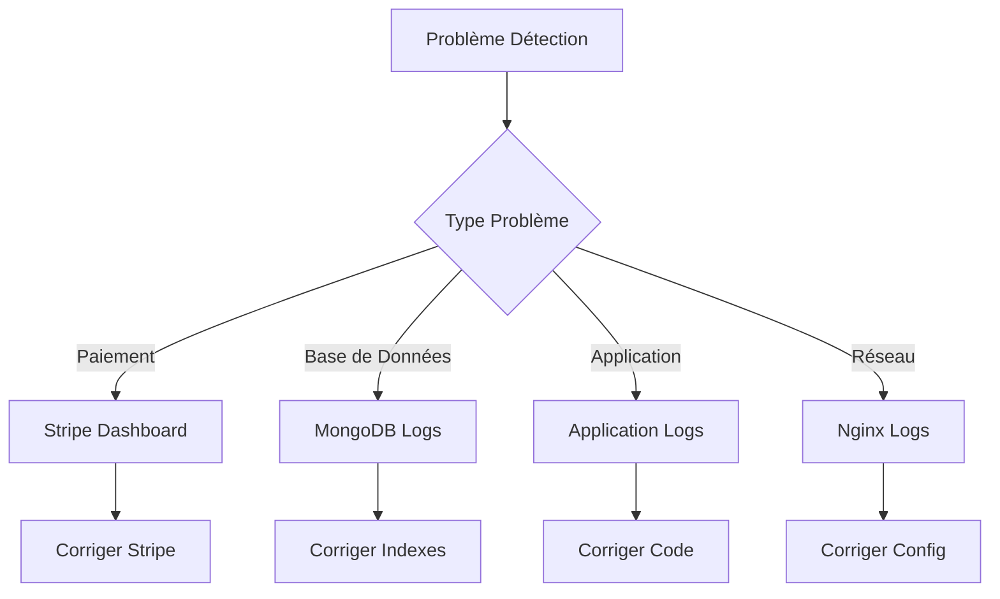

# Modèle Order

<cite>
**Fichiers Référencés dans ce Document**
- [Order.ts](file://apps/api-backend/src/models/Order.ts)
- [User.ts](file://apps/api-backend/src/models/User.ts)
- [EnhancedOrder.ts](file://apps/api-backend/src/models/EnhancedOrder.ts)
- [ProductOrder.ts](file://apps/api-backend/src/models/ProductOrder.ts)
- [payments.ts](file://apps/api-backend/src/routes/payments.ts)
- [stripe.ts](file://apps/api-backend/src/services/stripe.ts)
- [payments.ts](file://apps/api-backend/src/types/payments.ts)
</cite>

## Table des Matières
1. [Introduction](#introduction)
2. [Structure du Modèle](#structure-du-modèle)
3. [Champs Principaux](#champs-principaux)
4. [Architecture du Tunnel de Paiement](#architecture-du-tunnel-de-paiement)
5. [Création via Webhook Stripe](#création-via-webhook-stripe)
6. [Transformation en EnhancedOrder](#transformation-en-enhancedorder)
7. [Validations et Contraintes](#validations-et-contraintes)
8. [Index et Optimisations](#index-et-optimisations)
9. [Relations avec Autres Modèles](#relations-avec-autres-modèles)
10. [Transitions de Statut](#transitions-de-statut)
11. [Exemple de Payload Stripe](#exemple-de-payload-stripe)
12. [Points de Surveillance](#points-de-surveillance)
13. [Conclusion](#conclusion)

## Introduction

Le modèle `Order` est un composant central du système de paiement d'Oracle Lumira, représentant une commande brute qui gère le cycle complet de vie d'un paiement depuis la création jusqu'à la finalisation. Ce modèle Mongoose joue un rôle crucial dans le tunnel de paiement, servant d'enregistrement intermédiaire entre la création d'un PaymentIntent Stripe et la transformation finale en un objet enrichi (`EnhancedOrder`).

Le modèle `Order` est conçu pour suivre l'état d'une transaction de paiement complexe, incluant plusieurs niveaux de service, des données utilisateur détaillées, et un système de validation expert. Il maintient un historique complet des événements de paiement et facilite la coordination entre les différents systèmes internes.

## Structure du Modèle

Le modèle `Order` définit une interface TypeScript complète qui étend `Document` Mongoose, offrant une typage strict pour toutes les propriétés de la commande.



**Sources du Diagramme**
- [Order.ts](file://apps/api-backend/src/models/Order.ts#L4-L100)

**Sources de Section**
- [Order.ts](file://apps/api-backend/src/models/Order.ts#L1-L277)

## Champs Principaux

### Identifiants et Métadonnées

**`_id`** : Identifiant unique généré automatiquement par MongoDB, servant de clé primaire.

**`orderNumber`** : Numéro de commande séquentiel unique formaté comme `LUYYMMDDNNN` (par exemple `LU241215001`). Généré automatiquement lors de la sauvegarde avec une logique de séquence journalière.

**`userId`** : Référence vers l'utilisateur propriétaire de la commande, liée au modèle `User` via `mongoose.Schema.Types.ObjectId`.

**`userEmail`** : Adresse email de l'utilisateur, stockée en minuscules pour la cohérence.

**`userName`** : Nom complet de l'utilisateur (optionnel, ajouté pour améliorer l'expérience utilisateur).

### Informations de Service

**`level`** : Niveau de service (1, 2, 3, 4) correspondant à Simple, Intuitive, Alchimique, Intégrale.

**`levelName`** : Nom textuel du niveau de service pour l'affichage.

**`service`** : Type de service (optionnel) pour différencier les offres.

**`duration`** : Durée du service en minutes (minimum 15 minutes).

**`expertId`** : Référence vers l'expert assigné (optionnel).

### Informations de Paiement

**`amount`** : Montant en centimes d'euros (ex: 19900 pour 199,00 €).

**`currency`** : Devise (défaut: 'eur').

**`status`** : État de la commande avec valeurs prédéfinies :
- `'pending'` : Créé mais pas encore payé
- `'paid'` : Paiement reçu
- `'processing'` : Traitement en cours
- `'awaiting_validation'` : En attente de validation
- `'completed'` : Terminé
- `'failed'` : Échec du paiement
- `'refunded'` : Remboursé

**`paymentIntentId`** : Identifiant Stripe PaymentIntent associé.

**`stripeSessionId`** : Identifiant Stripe Checkout Session (optionnel).

**`paidAt`** : Horodatage du paiement réussi.

**Sources de Section**
- [Order.ts](file://apps/api-backend/src/models/Order.ts#L101-L180)

## Architecture du Tunnel de Paiement

Le tunnel de paiement d'Oracle Lumira suit un flux complexe impliquant plusieurs étapes et transformations de données.



**Sources du Diagramme**
- [payments.ts](file://apps/api-backend/src/routes/payments.ts#L131-L170)
- [Order.ts](file://apps/api-backend/src/models/Order.ts#L181-L220)

Cette architecture permet une traçabilité complète des paiements tout en maintenant une séparation claire entre les états intermédiaires et finaux.

**Sources de Section**
- [payments.ts](file://apps/api-backend/src/routes/payments.ts#L1-L234)

## Création via Webhook Stripe

La création d'une commande via webhook Stripe implémente un mécanisme robuste de traitement des événements de paiement.

### Processus de Création

1. **Détection d'Event Dupliqué** : Vérification dans `ProcessedEvent` pour éviter les doublons
2. **Enregistrement de l'Event** : Marquage comme traité
3. **Traitement par Type d'Event** : Gestion différente selon le type d'événement
4. **Mise à Jour de l'Order** : Modification de l'état en fonction du résultat

### Mécanismes de Sécurité



**Sources du Diagramme**
- [payments.ts](file://apps/api-backend/src/routes/payments.ts#L80-L120)

**Sources de Section**
- [payments.ts](file://apps/api-backend/src/routes/payments.ts#L80-L170)

## Transformation en EnhancedOrder

La transformation d'un `Order` brut en `EnhancedOrder` représente une étape critique où les données sont enrichies et structurées pour l'utilisation finale.

### Différences Clés

Le modèle `EnhancedOrder` ajoute des fonctionnalités avancées absentes dans le modèle `Order` initial :

- **Gestion de Session** : Suivi des sessions de consultation en temps réel
- **Contrôle Qualité** : Système de notation et avis
- **Livraison de Contenu** : Gestion des fichiers générés et leur distribution
- **Préférences de Notification** : Configuration des canaux de communication
- **Métadonnées Avancées** : Informations de contexte pour l'audit

### Processus de Transformation



**Sources du Diagramme**
- [EnhancedOrder.ts](file://apps/api-backend/src/models/EnhancedOrder.ts#L1-L50)

**Sources de Section**
- [EnhancedOrder.ts](file://apps/api-backend/src/models/EnhancedOrder.ts#L1-L199)

## Validations et Contraintes

Le modèle `Order` implémente un système de validations rigoureux pour garantir l'intégrité des données.

### Validations de Base

**Montant Positif** : Champ `amount` avec contrainte `min: 0`.

**Niveaux de Service** : Valeurs limitées à `[1, 2, 3, 4]`.

**Statuts Prédéfinis** : Enumération stricte pour `status`, `levelName`, et autres champs énumérés.

### Validations de Schéma

```typescript
// Exemple de validation de schéma
const orderSchema = new Schema<IOrder>({
  amount: {
    type: Number,
    required: true,
    min: 0  // Validation de montant positif
  },
  level: {
    type: Number,
    required: true,
    enum: [1, 2, 3, 4]  // Validation de niveau
  },
  status: {
    type: String,
    enum: ['pending', 'paid', 'processing', 'awaiting_validation', 'completed', 'failed', 'refunded'],
    default: 'pending'
  }
});
```

### Contraintes Uniques

- `orderNumber` : Unique et auto-généré
- `paymentIntentId` : Unique (via Stripe)
- Indexes multiples pour optimiser les requêtes fréquentes

**Sources de Section**
- [Order.ts](file://apps/api-backend/src/models/Order.ts#L101-L180)

## Index et Optimisations

Le modèle `Order` utilise un ensemble d'indexes stratégiques pour optimiser les performances des requêtes courantes.

### Index Principaux



**Sources du Diagramme**
- [Order.ts](file://apps/api-backend/src/models/Order.ts#L221-L230)

### Stratégie d'Optimisation

Les indexes sont conçus pour supporter les requêtes les plus fréquentes :

- **Recherche par Utilisateur** : Pour accès personnel
- **Filtrage par Statut** : Pour gestion d'état
- **Tri Chronologique** : Pour historique
- **Recherches Composées** : Pour requêtes complexes

**Sources de Section**
- [Order.ts](file://apps/api-backend/src/models/Order.ts#L221-L230)

## Relations avec Autres Modèles

Le modèle `Order` établit des relations importantes avec d'autres entités du système.

### Relations avec User



**Sources du Diagramme**
- [User.ts](file://apps/api-backend/src/models/User.ts#L4-L20)
- [Order.ts](file://apps/api-backend/src/models/Order.ts#L101-L120)

### Relations avec ProductOrder

Le modèle `ProductOrder` offre une alternative simplifiée pour les commandes produits simples :



**Sources du Diagramme**
- [ProductOrder.ts](file://apps/api-backend/src/models/ProductOrder.ts#L1-L20)

**Sources de Section**
- [User.ts](file://apps/api-backend/src/models/User.ts#L1-L84)
- [ProductOrder.ts](file://apps/api-backend/src/models/ProductOrder.ts#L1-L49)

## Transitions de Statut

Le système de statut du modèle `Order` suit un workflow bien défini avec des transitions valides.

### Workflow de Statut



### Gestion des Erreurs

Le système implémente une gestion robuste des erreurs avec des transitions appropriées :

- **Échec de Paiement** : Transition vers `failed` avec logs détaillés
- **Annulation** : Transition vers `failed` pour maintenir cohérence
- **Remboursement** : Transition vers `refunded` avec mise à jour des métadonnées

**Sources de Section**
- [payments.ts](file://apps/api-backend/src/routes/payments.ts#L131-L170)

## Exemple de Payload Stripe

Voici un exemple concret de payload Stripe déclenchant la création d'une commande :

```json
{
  "id": "evt_1Q2W3E4R5T6Y7U8I9O0P",
  "type": "payment_intent.succeeded",
  "data": {
    "object": {
      "id": "pi_1Q2W3E4R5T6Y7U8I9O0P",
      "object": "payment_intent",
      "amount": 19900,
      "currency": "eur",
      "status": "succeeded",
      "created": 1702444800,
      "metadata": {
        "orderId": "65789abc123def456ghi789",
        "expertId": "5fbcdef123456789abcdef12",
        "serviceType": "consultation",
        "level": "2"
      }
    }
  },
  "created": 1702444800
}
```

### Interprétation du Payload

Ce payload contient toutes les informations nécessaires pour identifier et traiter la commande :

- **Identifiant Stripe** : `pi_1Q2W3E4R5T6Y7U8I9O0P`
- **Identifiant de la commande** : `orderId` dans les métadonnées
- **Détails de paiement** : Montant, devise, statut
- **Contexte métier** : Expert, niveau de service

**Sources de Section**
- [payments.ts](file://apps/api-backend/src/routes/payments.ts#L131-L170)

## Points de Surveillance

### Monitoring et Alertes

Le système implémente plusieurs mécanismes de surveillance :

1. **Logs d'Event Dupliqué** : Détection automatique des tentatives de traitement répétées
2. **Audit des Statuts** : Tracé complet des transitions de statut
3. **Monitoring des Erreurs** : Alertes sur les échecs de paiement
4. **Performance des Requêtes** : Surveillance des temps de réponse

### Bonnes Pratiques

- **Idempotence** : Les opérations doivent être idempotentes
- **Transaction Atomicité** : Maintien de la cohérence des données
- **Logging Détaillé** : Trace complète de chaque étape
- **Validation Croisée** : Vérification des données à chaque étape

### Outils de Diagnostic



**Sources de Section**
- [payments.ts](file://apps/api-backend/src/routes/payments.ts#L80-L120)

## Conclusion

Le modèle `Order` constitue un élément fondamental du système de paiement d'Oracle Lumira, offrant une solution robuste et extensible pour la gestion des commandes complexes. Sa conception modulaire, ses validations strictes, et ses mécanismes de transformation en `EnhancedOrder` permettent de gérer efficacement le cycle de vie complet d'un paiement.

Les points forts du modèle incluent :

- **Flexibilité** : Support de multiples niveaux de service et types de paiement
- **Robustesse** : Gestion d'erreurs complète et prévention des doublons
- **Performance** : Indexation stratégique pour optimiser les requêtes
- **Extensibilité** : Architecture permettant l'évolution future

Le système de transformation en `EnhancedOrder` représente une étape cruciale qui transforme les données brutes en informations riches exploitables, facilitant ainsi la fourniture de services de haute qualité aux utilisateurs.