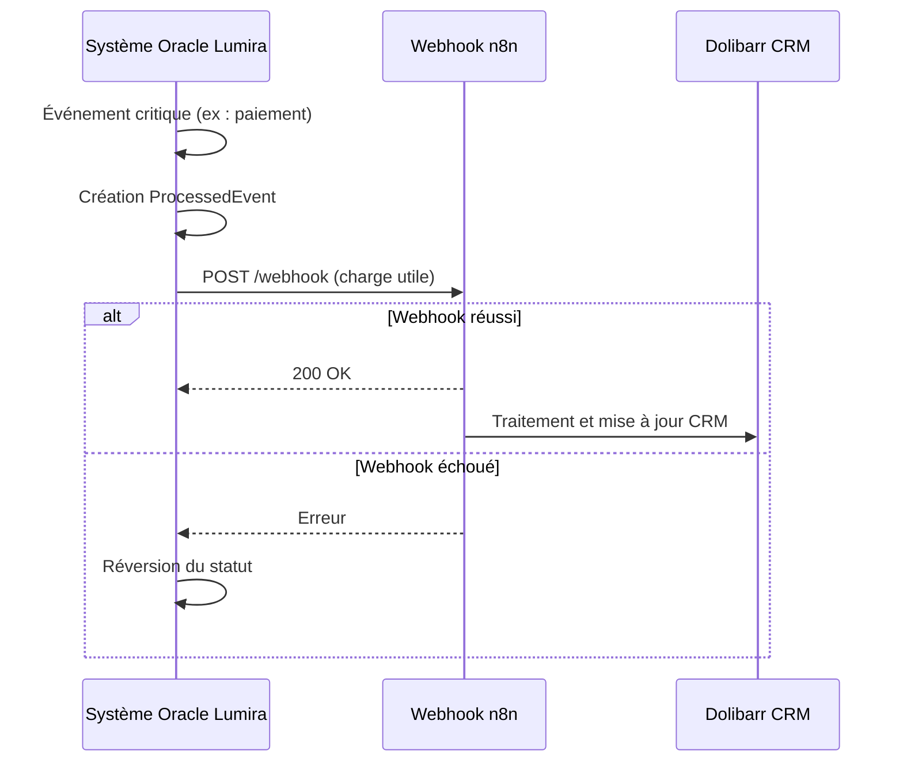
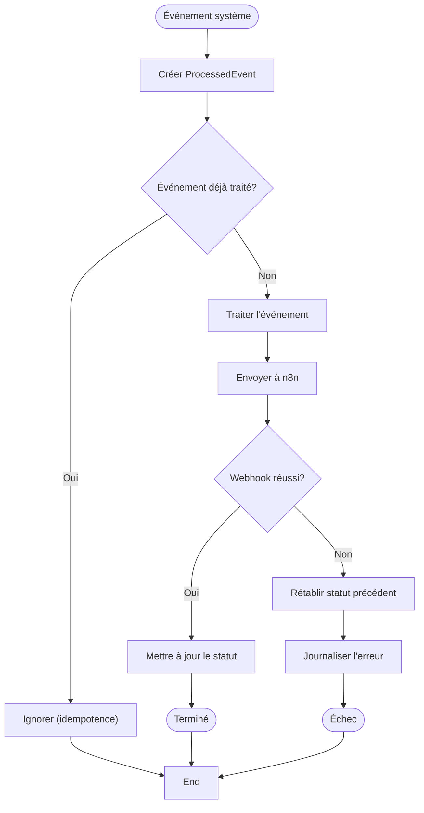

# Modèle ProcessedEvent

<cite>
**Fichiers référencés dans ce document**  
- [ProcessedEvent.ts](file://apps/api-backend/src/models/ProcessedEvent.ts)
- [payments.ts](file://apps/api-backend/src/routes/payments.ts)
- [expert.ts](file://apps/api-backend/src/routes/expert.ts)
- [products.ts](file://apps/api-backend/src/routes/products.ts)
</cite>

## Table des matières
1. [Introduction](#introduction)
2. [Structure du modèle ProcessedEvent](#structure-du-modèle-processedevent)
3. [Champs du modèle](#champs-du-modèle)
4. [Rôle dans l'observabilité et la reprise après incident](#rôle-dans-lobservabilité-et-la-reprise-après-incident)
5. [Intégration avec Dolibarr CRM et n8n](#intégration-avec-dolibarr-crm-et-n8n)
6. [Stratégies de rétention et purge](#stratégies-de-rétention-et-purge)
7. [Index et performances](#index-et-performances)
8. [Exemple d'événement de paiement réussi](#exemple-dévénement-de-paiement-réussi)
9. [Gestion des erreurs et mécanismes de retraitement](#gestion-des-erreurs-et-mécanismes-de-retraitement)

## Introduction
Le modèle ProcessedEvent joue un rôle central dans le système Oracle Lumira en tant que mécanisme de journalisation des événements critiques. Il permet de suivre, auditer et réagir aux événements système importants tels que les paiements, les validations de contenu et les commandes traitées. Ce document détaille sa structure, son utilisation, ses stratégies de gestion des données et son intégration avec les systèmes externes.

**Section sources**
- [ProcessedEvent.ts](file://apps/api-backend/src/models/ProcessedEvent.ts)

## Structure du modèle ProcessedEvent
Le modèle ProcessedEvent est implémenté avec Mongoose et stocké dans la collection MongoDB `processed_events`. Il enregistre les événements système après leur traitement, fournissant une trace immuable des actions critiques du système.

```mermaid
classDiagram
class ProcessedEvent {
+string eventId
+string eventType
+Date processedAt
+Record<string, any> data
+Date createdAt
+Date updatedAt
}
note right of ProcessedEvent
Modèle Mongoose pour le suivi des événements traités
Collection : processed_events
end note
```

**Diagram sources**
- [ProcessedEvent.ts](file://apps/api-backend/src/models/ProcessedEvent.ts#L1-L40)

**Section sources**
- [ProcessedEvent.ts](file://apps/api-backend/src/models/ProcessedEvent.ts#L1-L40)

## Champs du modèle
Le modèle ProcessedEvent contient plusieurs champs essentiels pour le suivi des événements système :

- **eventId** : Identifiant unique de l'événement (chaîne de caractères, requis, unique, indexé)
- **eventType** : Type de l'événement (ex: 'PAYMENT_RECEIVED', 'ORDER_PROCESSED', 'CONTENT_VALIDATED') (chaîne de caractères, requis)
- **processedAt** : Horodatage du traitement de l'événement (Date, requis, valeur par défaut: Date.now)
- **data** : Données brutes de l'événement sous forme d'objet JSON flexible (Record<string, any>, optionnel)
- **createdAt** et **updatedAt** : Horodatages automatiques gérés par l'option timestamps de Mongoose

**Section sources**
- [ProcessedEvent.ts](file://apps/api-backend/src/models/ProcessedEvent.ts#L1-L40)

## Rôle dans l'observabilité et la reprise après incident
ProcessedEvent est fondamental pour l'observabilité du système en fournissant une source de vérité pour tous les événements critiques. Il permet :

- La traçabilité complète des événements système
- L'audit des actions utilisateur et système
- La détection des anomalies et des erreurs
- Le support pour la reprise après incident en cas de défaillance

Les événements sont enregistrés de manière idempotente pour éviter les doublons, ce qui garantit l'intégrité des données même en cas de retraitement.

**Section sources**
- [payments.ts](file://apps/api-backend/src/routes/payments.ts#L80-L132)
- [products.ts](file://apps/api-backend/src/routes/products.ts#393-L438)

## Intégration avec Dolibarr CRM et n8n
Le modèle ProcessedEvent s'intègre avec n8n (et par extension Dolibarr CRM) via des webhooks configurables. Lorsqu'un événement critique se produit (comme un paiement réussi ou une commande traitée), le système envoie une charge utile à un webhook n8n.

Les variables d'environnement `N8N_WEBHOOK_URL` contrôlent cette intégration. Si l'URL n'est pas configurée, le système réagit en annulant certaines actions (comme le changement de statut de commande) pour maintenir la cohérence.



**Diagram sources**
- [expert.ts](file://apps/api-backend/src/routes/expert.ts#L633-L674)
- [expert.ts](file://apps/api-backend/src/routes/expert.ts#L975-L1012)

**Section sources**
- [expert.ts](file://apps/api-backend/src/routes/expert.ts#L633-L709)
- [payments.ts](file://apps/api-backend/src/routes/payments.ts#L80-L132)

## Stratégies de rétention et purge
Bien que le code source n'implémente pas explicitement une politique de purge automatique, la structure du système suggère une rétention à long terme des événements traités pour des raisons d'audit et de conformité.

La présence d'horodatages `createdAt` et `updatedAt` combinée à l'utilisation de `processedAt` permet de mettre en œuvre facilement des stratégies de purge basées sur l'âge des enregistrements. Une politique de purge après 30 jours pourrait être implémentée via un job cron ou un processus de maintenance.

**Section sources**
- [ProcessedEvent.ts](file://apps/api-backend/src/models/ProcessedEvent.ts#L1-L40)

## Index et performances
Le modèle ProcessedEvent est optimisé pour les requêtes courantes avec les index suivants :

- **Index sur eventId** : Clé unique pour garantir l'idempotence et permettre une récupération rapide
- **Index sur eventType** : Permet des requêtes efficaces par type d'événement
- **Index sur status** : Bien que non explicitement défini dans le code, il serait bénéfique pour les requêtes de surveillance

Ces index permettent des performances optimales pour les opérations de recherche, d'audit et de reporting.

**Section sources**
- [ProcessedEvent.ts](file://apps/api-backend/src/models/ProcessedEvent.ts#L1-L40)

## Exemple d'événement de paiement réussi
Lorsqu'un paiement est reçu avec succès, un événement ProcessedEvent est créé avec les détails pertinents. Bien que le code n'affiche pas un exemple complet, la structure typique inclurait :

- **eventId** : ID de l'événement Stripe
- **eventType** : 'payment_intent.succeeded'
- **processedAt** : Horodatage du traitement
- **data** : Informations sur le paiement, l'ID de commande, le montant, etc.

Ce mécanisme est implémenté dans le gestionnaire de webhook de paiement.

**Section sources**
- [payments.ts](file://apps/api-backend/src/routes/payments.ts#L127-L173)
- [products.ts](file://apps/api-backend/src/routes/products.ts#L471-L504)

## Gestion des erreurs et mécanismes de retraitement
Le système implémente plusieurs mécanismes robustes pour gérer les erreurs :

- **Vérification d'idempotence** : Utilisation d'un ensemble `processedEvents` pour éviter le traitement en double des événements
- **Gestion des erreurs de webhook** : Si l'envoi à n8n échoue, le système réagit en réinitialisant le statut de la commande
- **Journalisation détaillée** : Tous les événements et erreurs sont consignés pour le débogage

Lorsqu'un webhook n8n échoue, le système rétablit le statut de la commande à 'pending' pour permettre une nouvelle tentative, assurant ainsi la fiabilité du processus.



**Diagram sources**
- [payments.ts](file://apps/api-backend/src/routes/payments.ts#L80-L132)
- [expert.ts](file://apps/api-backend/src/routes/expert.ts#L670-L709)

**Section sources**
- [payments.ts](file://apps/api-backend/src/routes/payments.ts#L80-L132)
- [expert.ts](file://apps/api-backend/src/routes/expert.ts#L670-L709)
- [products.ts](file://apps/api-backend/src/routes/products.ts#L570-L611)