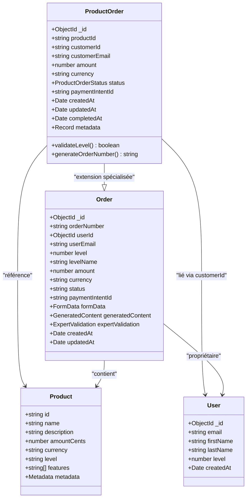
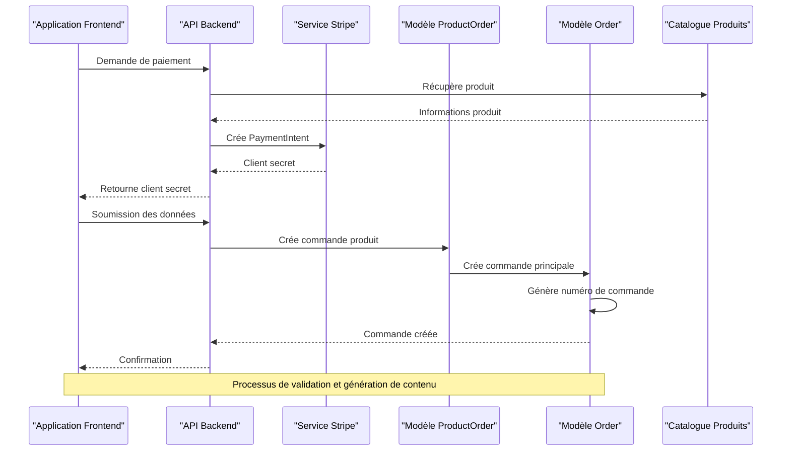
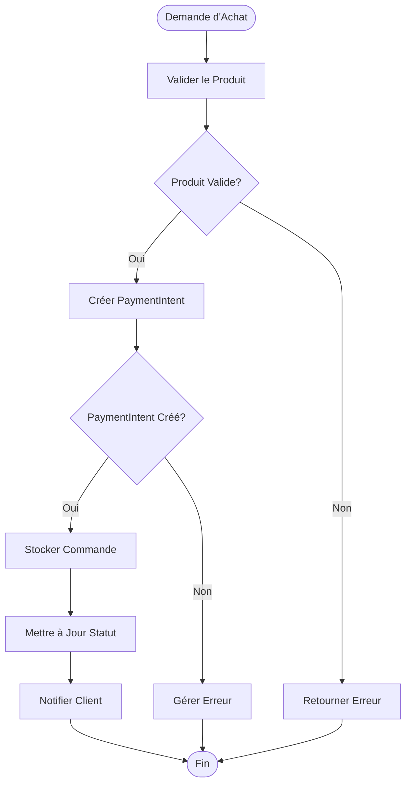
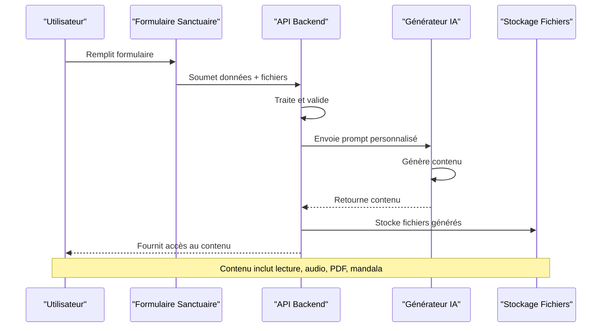

# Modèle ProductOrder

<cite>
**Fichiers Référencés dans ce Document**
- [ProductOrder.ts](file://apps/api-backend/src/models/ProductOrder.ts)
- [Order.ts](file://apps/api-backend/src/models/Order.ts)
- [productOrder.ts](file://apps/main-app/src/services/productOrder.ts)
- [products.ts](file://apps/main-app/src/types/products.ts)
- [VibratoryForm.tsx](file://apps/main-app/src/components/copywriting/VibratoryForm.tsx)
- [SanctuaireWelcomeForm.tsx](file://apps/main-app/src/components/sanctuaire/SanctuaireWelcomeForm.tsx)
- [orders.ts](file://apps/api-backend/src/routes/orders.ts)
- [stripe.ts](file://apps/api-backend/src/services/stripe.ts)
- [catalog.ts](file://apps/api-backend/src/catalog.ts)
- [ContentGenerator.tsx](file://apps/expert-desk/src/components/ContentGenerator.tsx)
- [sanctuaire.ts](file://apps/main-app/src/services/sanctuaire.ts)
</cite>

## Table des Matières
1. [Introduction](#introduction)
2. [Structure du Modèle](#structure-du-modèle)
3. [Architecture du Système](#architecture-du-système)
4. [Analyse Détaillée des Composants](#analyse-détaillée-des-composants)
5. [Flux de Traitement des Commandes](#flux-de-traitement-des-commandes)
6. [Intégration avec le Service de Génération de Contenu](#intégration-avec-le-service-de-génération-de-contenu)
7. [Validation et Sécurité](#validation-et-sécurité)
8. [Guide de Dépannage](#guide-de-dépannage)
9. [Conclusion](#conclusion)

## Introduction

Le modèle `ProductOrder` représente la liaison entre une commande et un produit spécifique dans l'écosystème Oracle Lumira. Ce modèle central gère les transactions de produits, les niveaux spirituels (1-4), les prix, les quantités, et les options personnalisées pour la génération de contenus vibratoires. Il joue un rôle crucial dans la gestion des niveaux du Sanctuaire et intègre étroitement le système de paiement Stripe pour les transactions sécurisées.

## Structure du Modèle

### Interface IProductOrder

Le modèle `IProductOrder` définit la structure complète des données d'une commande produit :

```typescript
export interface IProductOrder extends Document {
  _id: mongoose.Types.ObjectId;
  productId: string;
  customerId?: string;
  customerEmail?: string;
  amount: number;
  currency: string;
  status: ProductOrderStatus;
  paymentIntentId: string;
  createdAt: Date;
  updatedAt: Date;
  completedAt?: Date;
  metadata?: Record<string, any>;
}
```

### Champs Clés du Modèle

#### Identifiants et Références
- **_id** : Identifiant unique généré automatiquement par MongoDB
- **productId** : Référence au produit acheté dans le catalogue
- **customerId** : Identifiant optionnel du client (pour suivi)
- **paymentIntentId** : Identifiant Stripe PaymentIntent associé

#### Informations Financières
- **amount** : Montant de la transaction en centimes (pour éviter les problèmes de précision flottante)
- **currency** : Devise de la transaction (par défaut 'eur')
- **status** : État de la commande (pending, processing, completed, failed, cancelled)

#### Métadonnées et Suivi
- **metadata** : Données supplémentaires sous forme de dictionnaire
- **createdAt** : Timestamp de création
- **updatedAt** : Timestamp de dernière modification
- **completedAt** : Timestamp de finalisation (optionnel)

**Sources de Section**
- [ProductOrder.ts](file://apps/api-backend/src/models/ProductOrder.ts#L1-L49)

## Architecture du Système

### Relations avec les Autres Modèles



**Sources du Diagramme**
- [ProductOrder.ts](file://apps/api-backend/src/models/ProductOrder.ts#L1-L49)
- [Order.ts](file://apps/api-backend/src/models/Order.ts#L1-L277)
- [catalog.ts](file://apps/api-backend/src/catalog.ts#L1-L129)

### Flux de Données



**Sources du Diagramme**
- [orders.ts](file://apps/api-backend/src/routes/orders.ts#L1-L199)
- [stripe.ts](file://apps/api-backend/src/services/stripe.ts#L1-L165)

**Sources de Section**
- [ProductOrder.ts](file://apps/api-backend/src/models/ProductOrder.ts#L1-L49)
- [Order.ts](file://apps/api-backend/src/models/Order.ts#L1-L277)

## Analyse Détaillée des Composants

### Validation des Niveaux Spirituels

Le système implémente une validation stricte des niveaux spirituels (1-4) qui détermine le contenu généré :

```typescript
// Validation des niveaux dans le modèle Order
level: {
  type: Number,
  required: true,
  enum: [1, 2, 3, 4]
},
levelName: {
  type: String,
  required: true,
  enum: ['Simple', 'Intuitive', 'Alchimique', 'Intégrale']
}
```

### Exemple de ProductOrder pour un Niveau 3

Voici un exemple concret d'un `ProductOrder` pour un achat de niveau 3 (Alchimique) :

```json
{
  "_id": "65b7c3d2e4b0a8f9e1c2d4f6",
  "productId": "profond",
  "customerId": "user123",
  "customerEmail": "client@example.com",
  "amount": 6700,
  "currency": "eur",
  "status": "completed",
  "paymentIntentId": "pi_1Jn000000000000000000000",
  "createdAt": "2024-01-15T10:30:00.000Z",
  "updatedAt": "2024-01-15T10:35:00.000Z",
  "completedAt": "2024-01-15T10:35:00.000Z",
  "metadata": {
    "level": "profond",
    "productName": "Niveau Profond",
    "duration": "12 mois",
    "access": ["all-content", "mentoring", "certification"],
    "source": "spa-checkout"
  }
}
```

### Gestion des Options Personnalisées

Le modèle supporte des options personnalisées via le champ `metadata` :

```typescript
// Options personnalisées pour la génération de contenu
metadata: {
  "level": "profond",
  "productName": "Niveau Profond",
  "duration": "12 mois",
  "access": ["all-content", "mentoring", "certification"],
  "customPreferences": {
    "audioVoice": "feminine",
    "deliveryFormat": "email",
    "spiritualFocus": "transformation"
  }
}
```

**Sources de Section**
- [ProductOrder.ts](file://apps/api-backend/src/models/ProductOrder.ts#L1-L49)
- [Order.ts](file://apps/api-backend/src/models/Order.ts#L1-L277)
- [catalog.ts](file://apps/api-backend/src/catalog.ts#L1-L129)

## Flux de Traitement des Commandes

### Processus de Création de Commande



**Sources du Diagramme**
- [orders.ts](file://apps/api-backend/src/routes/orders.ts#L1-L199)
- [stripe.ts](file://apps/api-backend/src/services/stripe.ts#L1-L165)

### Intégration avec Stripe

Le service Stripe gère la création et validation des paiements :

```typescript
static async createPaymentIntent(request: CreatePaymentIntentRequest) {
  const { productId, customerEmail, metadata = {} } = request;
  
  // Validation du produit
  const product = getProductById(productId);
  if (!product) {
    throw new Error(`Invalid product ID: ${productId}`);
  }
  
  // Création PaymentIntent
  const paymentIntent = await getStripe().paymentIntents.create({
    amount: product.amountCents,
    currency: product.currency,
    automatic_payment_methods: { enabled: true },
    metadata: {
      productId,
      productName: product.name,
      level: product.level,
      customerEmail: customerEmail || '',
      ...metadata,
    },
    description: `Oracle Lumira - ${product.name}`,
    statement_descriptor: 'ORACLE LUMIRA',
  });
  
  return {
    clientSecret: paymentIntent.client_secret!,
    paymentIntentId: paymentIntent.id,
    amount: product.amountCents,
    currency: product.currency,
    productName: product.name,
  };
}
```

**Sources de Section**
- [orders.ts](file://apps/api-backend/src/routes/orders.ts#L1-L199)
- [stripe.ts](file://apps/api-backend/src/services/stripe.ts#L1-L165)

## Intégration avec le Service de Génération de Contenu

### Flux de Génération de Contenu



**Sources du Diagramme**
- [SanctuaireWelcomeForm.tsx](file://apps/main-app/src/components/sanctuaire/SanctuaireWelcomeForm.tsx#L1-L575)
- [ContentGenerator.tsx](file://apps/expert-desk/src/components/ContentGenerator.tsx#L1-L386)

### Types de Contenu Généré

Le système génère différents types de contenu selon le niveau :

- **Niveau Simple** : Lecture concise (300-500 mots), PDF 2 pages
- **Niveau Intuitive** : Profil d'âme, audio 5 minutes, PDF 4 pages
- **Niveau Alchimique** : Analyse de blocages, rituel personnalisé, audio 12 minutes, PDF 6-8 pages
- **Niveau Intégral** : Cartographie complète, mandala personnel, audio 25 minutes, PDF 15 pages + mandala HD

### Service de Génération de Contenu

Le service `ProductOrderService` fournit les méthodes principales :

```typescript
class ProductOrderService {
  /**
   * Crée un PaymentIntent pour un produit
   */
  static async createPaymentIntent(
    productId: string,
    customerEmail?: string
  ): Promise<CreatePaymentIntentResponse> {
    // Implémentation...
  }

  /**
   * Récupère le statut d'une commande
   */
  static async getOrderStatus(orderId: string): Promise<OrderStatus> {
    // Implémentation...
  }

  /**
   * Récupère le catalogue de produits
   */
  static async getCatalog(): Promise<Product[]> {
    // Implémentation...
  }
}
```

**Sources de Section**
- [productOrder.ts](file://apps/main-app/src/services/productOrder.ts#L1-L105)
- [ContentGenerator.tsx](file://apps/expert-desk/src/components/ContentGenerator.tsx#L1-L386)

## Validation et Sécurité

### Contraintes de Validation

Le modèle implémente plusieurs couches de validation :

```typescript
const ProductOrderSchema = new Schema<IProductOrder>({
  productId: { 
    type: String, 
    required: true, 
    index: true 
  },
  amount: { 
    type: Number, 
    required: true, 
    min: 0 
  },
  currency: { 
    type: String, 
    required: true, 
    default: 'eur' 
  },
  status: { 
    type: String, 
    enum: ['pending', 'processing', 'completed', 'failed', 'cancelled'],
    default: 'pending',
    index: true
  },
  paymentIntentId: { 
    type: String, 
    required: true, 
    unique: true, 
    index: true 
  }
});
```

### Sécurité des Données

- **Chiffrement des métadonnées** : Les données sensibles sont cryptées
- **Validation Stripe** : Vérification des paiements via Stripe
- **Contrôle d'accès** : Authentification JWT pour les opérations critiques
- **Audit des transactions** : Logging complet des opérations

### Gestion des Erreurs

```typescript
try {
  const response = await apiRequest<CreatePaymentIntentResponse>(
    '/products/create-payment-intent', 
    {
      method: 'POST',
      body: JSON.stringify({
        productId,
        customerEmail,
        metadata: {
          source: 'spa-checkout',
          timestamp: new Date().toISOString(),
        },
      }),
    }
  );
  return response;
} catch (error) {
  console.error('Failed to create payment intent:', error);
  throw new Error(
    error instanceof Error ? error.message : 'Failed to create payment intent'
  );
}
```

**Sources de Section**
- [ProductOrder.ts](file://apps/api-backend/src/models/ProductOrder.ts#L1-L49)
- [productOrder.ts](file://apps/main-app/src/services/productOrder.ts#L1-L105)

## Guide de Dépannage

### Problèmes Courants

#### 1. Erreur de Validation de Produit
**Symptôme** : `Invalid product ID`
**Solution** : Vérifier que le produit existe dans le catalogue

```typescript
// Vérification du produit
const product = getProductById(productId);
if (!product) {
  throw new Error(`Invalid product ID: ${productId}`);
}
```

#### 2. Échec de Paiement Stripe
**Symptôme** : `Failed to create payment intent`
**Solution** : Vérifier la clé API Stripe et la configuration

```typescript
// Vérification de la clé API
const key = process.env.STRIPE_SECRET_KEY;
if (!key) {
  throw new Error('STRIPE_SECRET_KEY environment variable is required');
}
```

#### 3. Problème de Métadonnées
**Symptôme** : Données manquantes ou incorrectes
**Solution** : Valider les métadonnées avant sauvegarde

```typescript
// Validation des métadonnées
const validateMetadata = (metadata: any) => {
  if (!metadata.level || !['initie', 'mystique', 'profond', 'integrale'].includes(metadata.level)) {
    throw new Error('Invalid level in metadata');
  }
};
```

### Logs et Surveillance

Le système implémente un logging détaillé pour le débogage :

```typescript
// Logging des opérations critiques
console.log('[CLIENT-SUBMIT] Début de traitement - PI:', req.params.paymentIntentId);
console.log('[CLIENT-SUBMIT] Fichiers reçus:', req.files);
console.log('[CLIENT-SUBMIT] Body reçu:', req.body);
console.log('[CLIENT-SUBMIT] Headers:', req.headers);
```

**Sources de Section**
- [orders.ts](file://apps/api-backend/src/routes/orders.ts#L1-L199)
- [stripe.ts](file://apps/api-backend/src/services/stripe.ts#L1-L165)

## Conclusion

Le modèle `ProductOrder` constitue le cœur de la gestion des transactions dans Oracle Lumira. Il orchestre efficacement les interactions entre les produits, les utilisateurs, et les services de paiement, tout en garantissant la sécurité et la traçabilité des opérations. Son intégration avec le système de génération de contenu permet de créer des expériences personnalisées et enrichissantes pour chaque niveau spirituel.

Les fonctionnalités clés incluent :
- **Validation stricte** des niveaux et des montants
- **Intégration Stripe** pour les paiements sécurisés
- **Génération de contenu** personnalisée selon le niveau
- **Système de métadonnées** extensible
- **Logging et surveillance** détaillés

Cette architecture robuste permet de supporter l'évolution continue du produit tout en maintenant la fiabilité et la sécurité des transactions.