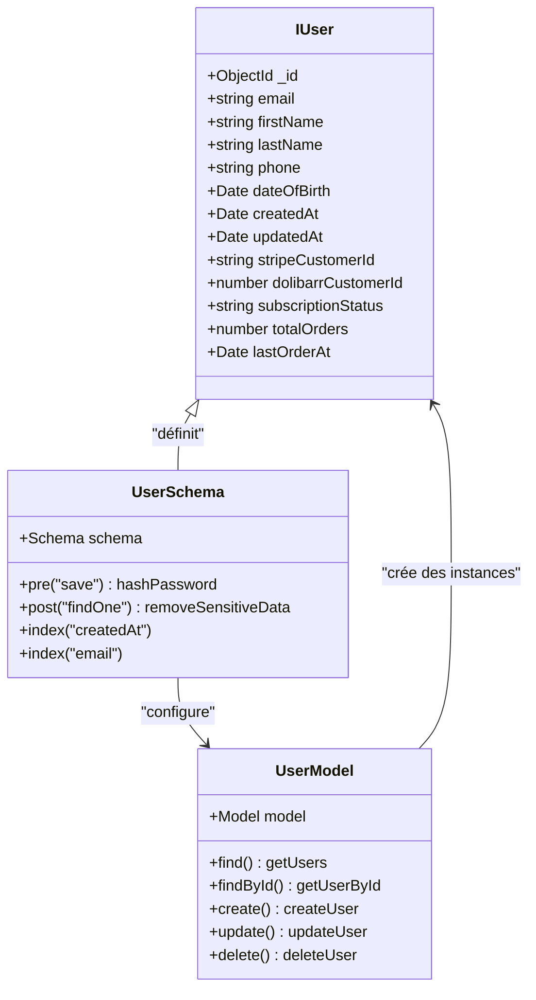
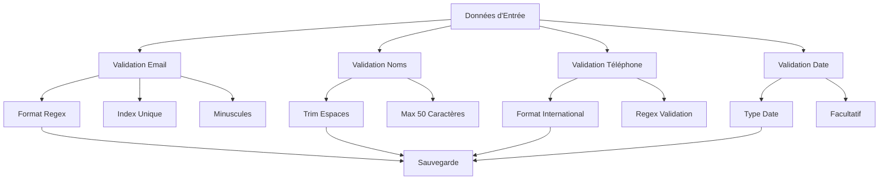
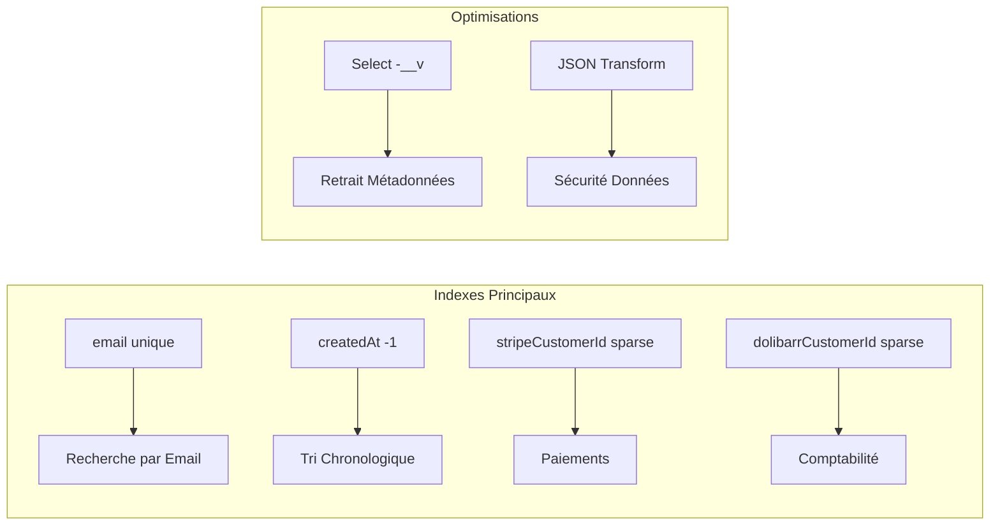
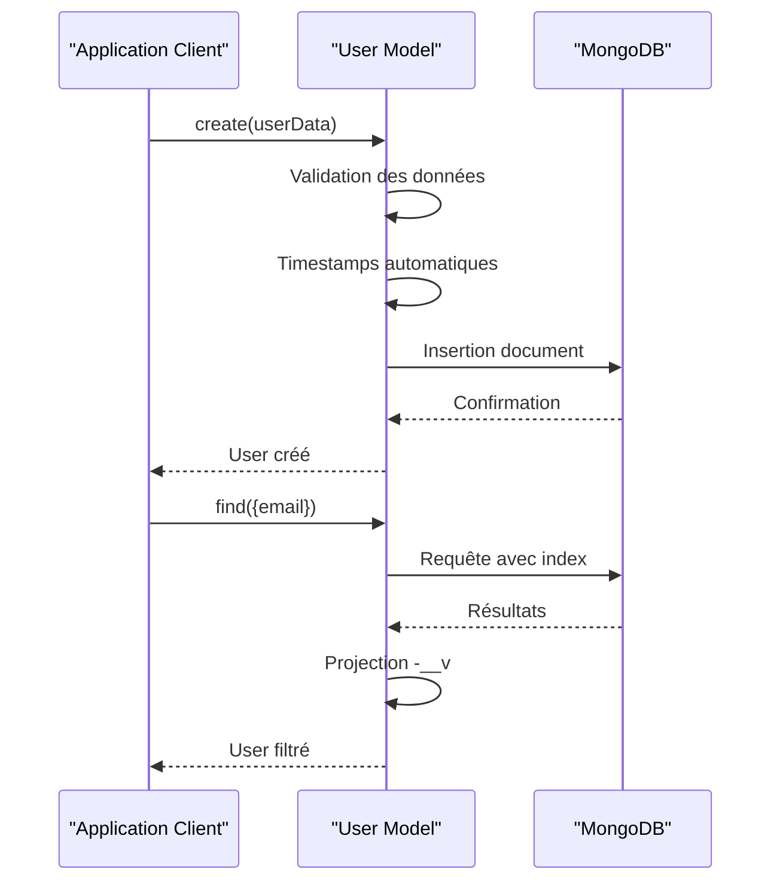
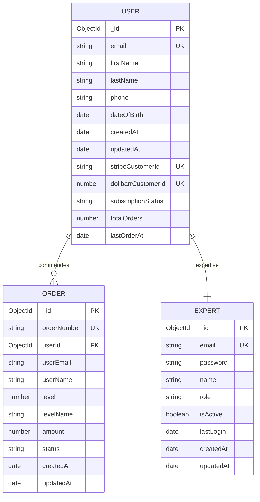
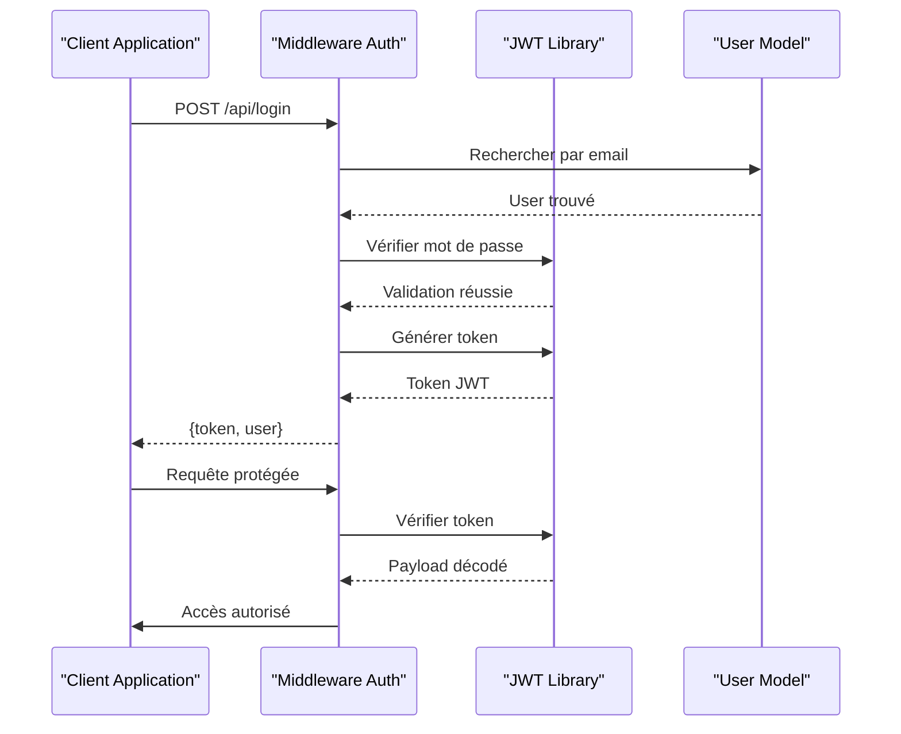
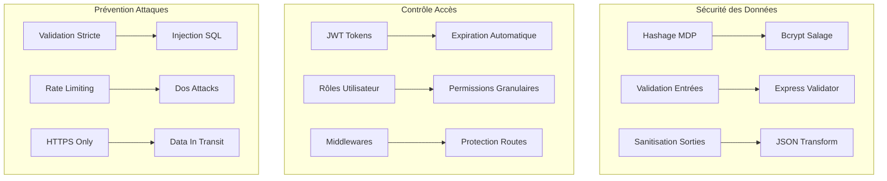
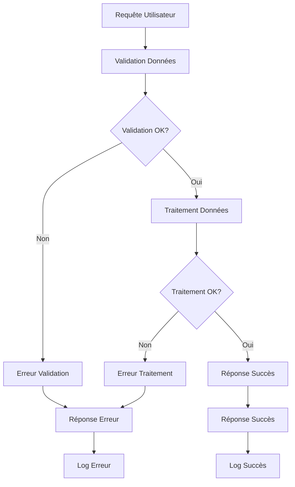

# Modèle User Mongoose

<cite>
**Fichiers Référencés dans ce Document**
- [User.ts](file://apps/api-backend/src/models/User.ts)
- [auth.ts](file://apps/api-backend/src/middleware/auth.ts)
- [users.ts](file://apps/api-backend/src/routes/users.ts)
- [Order.ts](file://apps/api-backend/src/models/Order.ts)
- [Expert.ts](file://apps/api-backend/src/models/Expert.ts)
- [validation.ts](file://apps/api-backend/src/middleware/validation.ts)
- [testData.ts](file://apps/api-backend/src/data/testData.ts)
- [package.json](file://apps/api-backend/package.json)
</cite>

## Table des Matières
1. [Introduction](#introduction)
2. [Structure du Modèle](#structure-du-modèle)
3. [Champs du Modèle](#champs-du-modèle)
4. [Validations et Contraintes](#validations-et-contraintes)
5. [Indexes et Optimisations](#indexes-et-optimisations)
6. [Hooks et Méthodes](#hooks-et-méthodes)
7. [Relations avec Autres Modèles](#relations-avec-autres-modèles)
8. [Système d'Authentification JWT](#système-dauthentification-jwt)
9. [Bonnes Pratiques de Sécurité](#bonnes-pratiques-de-sécurité)
10. [Cas d'Usage et Exemples](#cas-dusage-et-exemples)
11. [Gestion des Erreurs](#gestion-des-erreurs)
12. [Conclusion](#conclusion)

## Introduction

Le modèle User est le cœur du système d'authentification et de gestion des utilisateurs dans l'application Oracle Lumira. Il utilise Mongoose pour définir la structure des données utilisateur dans MongoDB et fournit toutes les fonctionnalités nécessaires pour l'inscription, la connexion et la gestion des profils utilisateur.

Ce modèle est conçu pour supporter un système de niveaux progressifs (Simple, Intuitif, Alchimique, Intégrale) et intègre des fonctionnalités avancées comme la gestion des abonnements, les statistiques de commande et l'accès au sanctuaire spirituel.

## Structure du Modèle

Le modèle User est défini comme une interface TypeScript étendant `Document` de Mongoose, suivie par la définition du schéma Mongoose lui-même.



**Sources du Diagramme**
- [User.ts](file://apps/api-backend/src/models/User.ts#L4-L20)

**Sources de Section**
- [User.ts](file://apps/api-backend/src/models/User.ts#L1-L84)

## Champs du Modèle

### Champs Obligatoires

**email** (`String`, requis)
- Format email valide avec validation regex
- Converti en minuscules automatiquement
- Index unique pour éviter les doublons
- Champ central pour l'authentification

**firstName** (`String`, requis)
- Nom de famille de l'utilisateur
- Limite de 50 caractères
- Trim automatique des espaces

**lastName** (`String`, requis)
- Prénom de l'utilisateur
- Limite de 50 caractères
- Trim automatique des espaces

**subscriptionStatus** (`String`, enum)
- Statut de l'abonnement : 'active', 'inactive', 'trial'
- Valeur par défaut : 'inactive'

**totalOrders** (`Number`, default: 0)
- Nombre total de commandes passées par l'utilisateur
- Utilisé pour déterminer le niveau d'accès au sanctuaire

### Champs Optionnels

**phone** (`String`)
- Numéro de téléphone international valide
- Validation avec regex pour les formats internationaux
- Facultatif pour respecter la confidentialité

**dateOfBirth** (`Date`)
- Date de naissance de l'utilisateur
- Stockée sous forme de Date MongoDB
- Utilisée pour des analyses spécifiques

**stripeCustomerId** (`String`)
- Identifiant Stripe pour les paiements récurrents
- Index unique et sparse pour optimiser l'espace

**dolibarrCustomerId** (`Number`)
- Identifiant Dolibarr pour la comptabilité
- Index unique et sparse pour compatibilité

**lastOrderAt** (`Date`)
- Date de la dernière commande
- Utilisé pour le suivi et l'analytique

**Sources de Section**
- [User.ts](file://apps/api-backend/src/models/User.ts#L21-L60)

## Validations et Contraintes

Le schéma User implémente plusieurs couches de validation pour garantir l'intégrité des données :



**Sources du Diagramme**
- [User.ts](file://apps/api-backend/src/models/User.ts#L21-L50)

### Validation Email
- **Format** : Regex strict pour les adresses email valides
- **Index** : Unique pour éviter les doublons
- **Normalisation** : Converti en minuscules automatiquement
- **Trim** : Suppression des espaces superflus

### Validation Noms
- **Limite** : 50 caractères maximum par champ
- **Trim** : Suppression automatique des espaces
- **Requis** : Obligatoire pour tous les nouveaux utilisateurs

### Validation Téléphone
- **Format** : Regex pour numéros internationaux
- **Pattern** : `^[+]?[1-9][0-9]{0,15}$`
- **Facultatif** : Respect de la confidentialité

### Validation Abonnement
- **Enum** : Seulement 'active', 'inactive', 'trial'
- **Default** : 'inactive' si non spécifié

**Sources de Section**
- [User.ts](file://apps/api-backend/src/models/User.ts#L21-L50)

## Indexes et Optimisations

Le schéma User utilise plusieurs indexes pour optimiser les performances des requêtes courantes :



**Sources du Diagramme**
- [User.ts](file://apps/api-backend/src/models/User.ts#L62-L65)

### Indexes Clés
- **email** : Index unique pour les recherches rapides
- **createdAt** : Index descendant pour les listes récentes
- **stripeCustomerId** : Index sparse pour les paiements
- **dolibarrCustomerId** : Index sparse pour la comptabilité

### Optimisations de Performance
- **Sparse Indexes** : Économie d'espace pour les champs optionnels
- **Projection** : Retrait automatique des métadonnées Mongoose
- **Transform JSON** : Sécurité des données sensibles

**Sources de Section**
- [User.ts](file://apps/api-backend/src/models/User.ts#L62-L65)

## Hooks et Méthodes

Le modèle User ne contient pas de hooks Mongoose personnalisés dans le fichier actuel, mais il hérite des fonctionnalités standard de Mongoose :



**Sources du Diagramme**
- [User.ts](file://apps/api-backend/src/models/User.ts#L67-L69)

### Fonctionnalités Standard
- **Timestamps** : Création et mise à jour automatiques
- **Projection** : Retrait automatique des métadonnées
- **Validation** : Validation automatique des schémas

**Sources de Section**
- [User.ts](file://apps/api-backend/src/models/User.ts#L67-L69)

## Relations avec Autres Modèles

Le modèle User établit des relations importantes avec d'autres modèles du système :



**Sources du Diagramme**
- [User.ts](file://apps/api-backend/src/models/User.ts#L4-L20)
- [Order.ts](file://apps/api-backend/src/models/Order.ts#L4-L30)

### Relations avec Order
- **Relation One-to-Many** : Un utilisateur peut avoir plusieurs commandes
- **Clé étrangère** : `userId` dans le modèle Order
- **Statistiques** : `totalOrders` et `lastOrderAt` maintenus automatiquement

### Relations avec Expert
- **Relation One-to-One** : Un utilisateur peut être expert
- **Rôle** : Champ `role` dans le modèle Expert
- **Authentification** : Système d'authentification séparé

**Sources de Section**
- [User.ts](file://apps/api-backend/src/models/User.ts#L4-L20)
- [Order.ts](file://apps/api-backend/src/models/Order.ts#L4-L30)

## Système d'Authentification JWT

Le modèle User s'intègre avec un système d'authentification JWT robuste :



**Sources du Diagramme**
- [auth.ts](file://apps/api-backend/src/middleware/auth.ts#L10-L40)

### Fonctionnalités d'Authentification
- **Tokens JWT** : Génération et validation sécurisées
- **Middleware** : Protection des routes critiques
- **Rôles** : Système de permissions basé sur les rôles
- **Expiration** : Gestion automatique de l'expiration

### Types d'Authentification
- **Authentification Obligatoire** : Routes protégées
- **Authentification Optionnelle** : Routes publiques
- **Contrôle de Rôles** : Autorisations granulaires

**Sources de Section**
- [auth.ts](file://apps/api-backend/src/middleware/auth.ts#L1-L117)

## Bonnes Pratiques de Sécurité

Le système implémente plusieurs bonnes pratiques de sécurité pour protéger les données utilisateur :



### Sécurité des Mot de Passe
- **Hashage Bcrypt** : Algorithme moderne et sécurisé
- **Salage Automatique** : Génération aléatoire de sel
- **Coût Adaptatif** : Paramètres optimisés

### Validation des Entrées
- **Express Validator** : Validation côté serveur
- **Typescript** : Typage fort pour la sécurité
- **Sanitisation** : Protection contre les injections

### Contrôle d'Accès
- **JWT** : Authentification stateless
- **Rôles** : Permissions granulaires
- **Middlewares** : Protection automatique

**Sources de Section**
- [validation.ts](file://apps/api-backend/src/middleware/validation.ts#L1-L64)

## Cas d'Usage et Exemples

### Inscription d'Utilisateur

```typescript
// Exemple de création d'utilisateur
const newUser = new User({
  email: 'utilisateur@example.com',
  firstName: 'Jean',
  lastName: 'Dupont',
  phone: '+33612345678',
  dateOfBirth: new Date('1990-01-15'),
  subscriptionStatus: 'trial'
});

await newUser.save();
```

### Connexion et Authentification

```typescript
// Exemple de génération de token JWT
const token = jwt.sign(
  { 
    userId: user._id, 
    email: user.email,
    role: user.role 
  },
  process.env.JWT_SECRET,
  { expiresIn: '24h' }
);
```

### Gestion des Rôles

```typescript
// Contrôle d'accès basé sur les rôles
const requireAdmin = requireRole(['admin']);
const requireExpert = requireRole(['expert', 'admin']);

router.get('/admin-panel', requireAdmin, (req, res) => {
  // Accès réservé aux administrateurs
});
```

### Accès au Sanctuaire

```typescript
// Exemple d'authentification sanctuaire
const sanctuaireToken = jwt.sign(
  { 
    userId: user._id, 
    email: user.email,
    type: 'sanctuaire_access'
  },
  process.env.JWT_SECRET,
  { expiresIn: '24h' }
);
```

**Sources de Section**
- [users.ts](file://apps/api-backend/src/routes/users.ts#L100-L150)

## Gestion des Erreurs

Le système implémente une gestion d'erreurs robuste avec des messages informatifs :



### Types d'Erreurs
- **Validation** : Données invalides ou manquantes
- **Authentification** : Token invalide ou expiré
- **Autorisation** : Permissions insuffisantes
- **Serveur** : Erreurs internes

### Messages d'Erreur
- **Développement** : Détails complets pour le débogage
- **Production** : Messages génériques pour la sécurité
- **Logging** : Traces complètes côté serveur

**Sources de Section**
- [validation.ts](file://apps/api-backend/src/middleware/validation.ts#L10-L30)

## Conclusion

Le modèle User Mongoose constitue la fondation solide du système d'authentification et de gestion des utilisateurs d'Oracle Lumira. Il combine efficacement les fonctionnalités de Mongoose avec des pratiques de sécurité modernes pour offrir un système robuste et extensible.

### Points Forts
- **Architecture Modulaire** : Séparation claire entre données et logique métier
- **Sécurité Renforcée** : Hashage des mots de passe et validation stricte
- **Extensibilité** : Facilité d'ajout de nouveaux champs et fonctionnalités
- **Performance** : Indexes optimisés et projections automatiques

### Évolutions Futures
- **Authentification Multi-Facteurs** : Support des méthodes d'authentification additionnelles
- **Audit Trail** : Historique complet des actions utilisateur
- **Internationalisation** : Support multilingue pour les interfaces
- **Analytics** : Métriques avancées sur l'utilisation du système

Le modèle User est conçu pour évoluer avec les besoins croissants de l'application tout en maintenant la sécurité et la performance essentielles à un système de production de qualité.