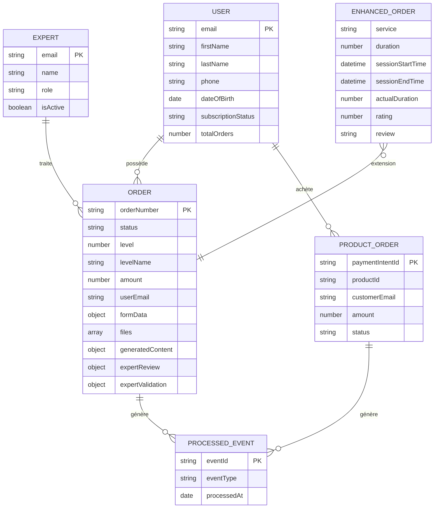
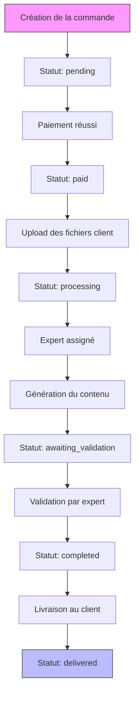
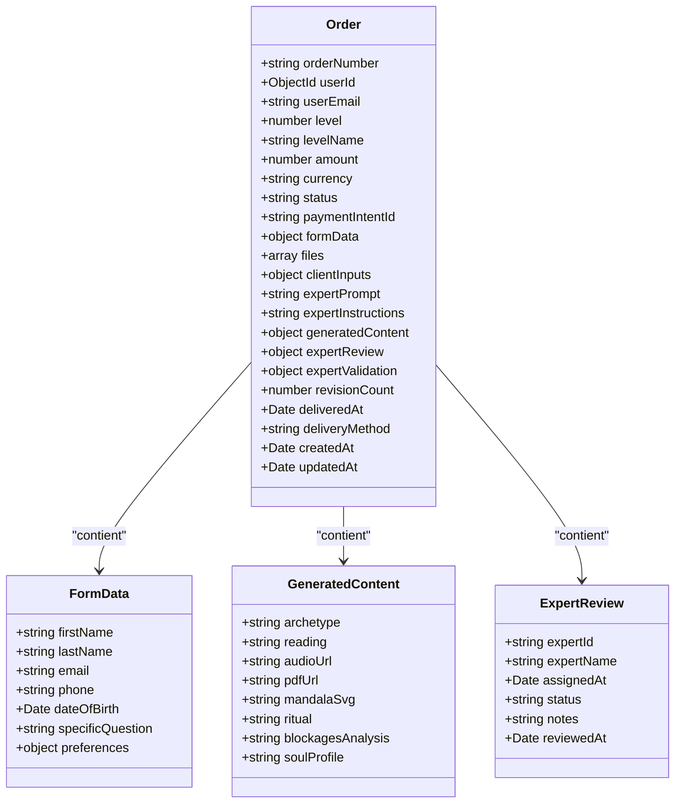
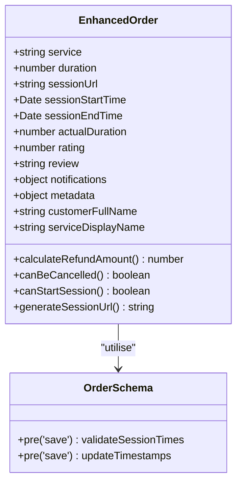
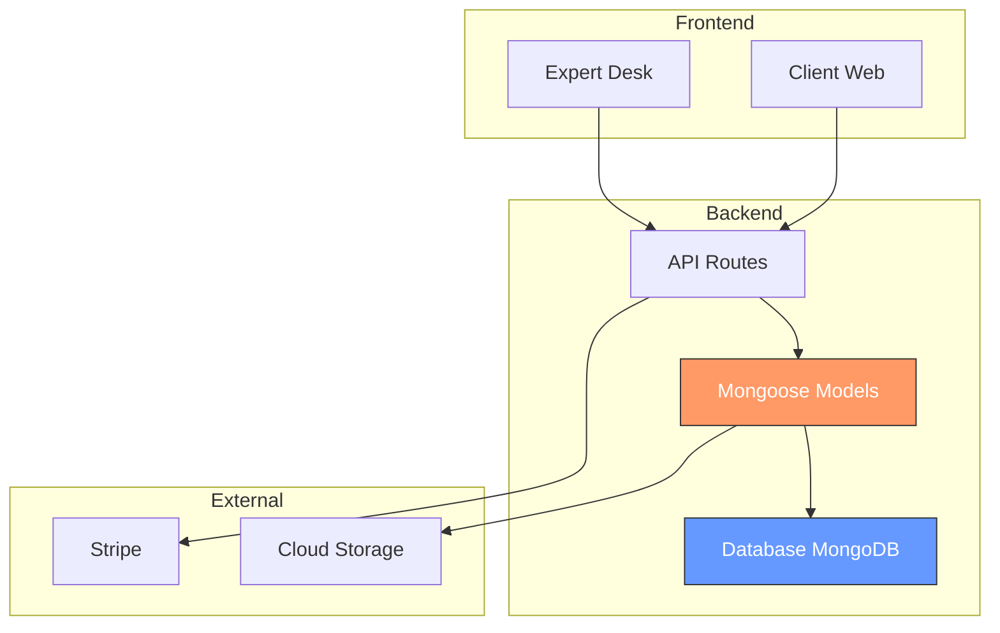

# Modèles de données

<cite>
**Fichiers référencés dans ce document**  
- [User.ts](file://apps/api-backend/src/models/User.ts)
- [Order.ts](file://apps/api-backend/src/models/Order.ts)
- [ProductOrder.ts](file://apps/api-backend/src/models/ProductOrder.ts)
- [EnhancedOrder.ts](file://apps/api-backend/src/models/EnhancedOrder.ts)
- [Expert.ts](file://apps/api-backend/src/models/Expert.ts)
- [ProcessedEvent.ts](file://apps/api-backend/src/models/ProcessedEvent.ts)
- [orders.ts](file://apps/api-backend/src/routes/orders.ts)
</cite>

## Table des matières
1. [Introduction](#introduction)
2. [Entités du modèle de données](#entités-du-modèle-de-données)
3. [Relations entre les modèles](#relations-entre-les-modèles)
4. [Cycle de vie des données et transformation](#cycle-de-vie-des-données-et-transformation)
5. [Analyse détaillée des composants](#analyse-détaillée-des-composants)
6. [Diagramme d'architecture des données](#diagramme-darchitecture-des-données)
7. [Performance et indexation](#performance-et-indexation)
8. [Conclusion](#conclusion)

## Introduction

Ce document présente une documentation complète des modèles de données backend de l'application Lumira, utilisant Mongoose comme ODM (Object Document Mapper) pour MongoDB. Les modèles documentaires sont conçus pour gérer les commandes, utilisateurs, experts et événements traités dans le cadre d'une plateforme de consultations spirituelles personnalisées. L'architecture met en œuvre un système de transformation de données où une commande brute est enrichie progressivement par des experts pour devenir une commande finale validée. Cette documentation décrit chaque entité, ses champs, validations, index, hooks Mongoose, ainsi que les relations entre les modèles.

**Section sources**
- [User.ts](file://apps/api-backend/src/models/User.ts#L1-L83)
- [Order.ts](file://apps/api-backend/src/models/Order.ts#L1-L276)
- [EnhancedOrder.ts](file://apps/api-backend/src/models/EnhancedOrder.ts#L1-L371)

## Entités du modèle de données

Les modèles de données représentent les entités principales du système, chacune correspondant à une collection MongoDB. Chaque modèle est défini avec des interfaces TypeScript pour une typage strict, des validations, des index pour les performances et des hooks Mongoose pour le comportement automatisé.

### Utilisateur (User)

L'entité **User** représente un utilisateur inscrit sur la plateforme, avec des informations personnelles et des données de souscription.

**Champs principaux :**
- `email` : requis, unique, format validé par regex
- `firstName`, `lastName` : requis, max 50 caractères
- `phone` : format international validé
- `dateOfBirth` : date facultative
- `stripeCustomerId`, `dolibarrCustomerId` : identifiants externes uniques
- `subscriptionStatus` : enum ('active', 'inactive', 'trial')
- `totalOrders` : compteur d'ordres, par défaut 0
- `lastOrderAt` : dernière commande

**Validations :**
- Email validé par expression régulière
- Champs requis et limites de longueur
- Numéro de téléphone validé

**Index :**
- `createdAt` (décroissant) pour les requêtes chronologiques

**Section sources**
- [User.ts](file://apps/api-backend/src/models/User.ts#L1-L83)

### Commande (Order)

L'entité **Order** représente une commande brute initiale, créée après un paiement et contenant les données brutes du client.

**Champs principaux :**
- `orderNumber` : généré automatiquement au format LUYYMMDDXXX
- `userId`, `userEmail` : référence à l'utilisateur
- `level` : niveau de consultation (1 à 4)
- `levelName` : nom du niveau ('Simple', 'Intuitive', etc.)
- `amount`, `currency` : détails du paiement
- `status` : enum ('pending', 'paid', 'processing', etc.)
- `paymentIntentId`, `stripeSessionId` : intégration Stripe
- `formData` : données du formulaire client
- `files` : fichiers uploadés (photos)
- `clientInputs` : contexte supplémentaire (heure de naissance, etc.)
- `expertPrompt`, `expertInstructions` : instructions pour l'expert
- `generatedContent` : contenu généré (lecture, audio, etc.)
- `expertReview` : évaluation par l'expert
- `expertValidation` : validation finale du contenu
- `deliveredAt`, `deliveryMethod` : livraison

**Validations :**
- `orderNumber` unique
- `status` et `level` dans des enums définis
- Validation d'email et de numéro de téléphone
- `amount` minimum de 0

**Hooks :**
- `pre('save')` : génération automatique du numéro de commande si nouveau

**Index :**
- `userId`, `userEmail`, `status`, `level`, `createdAt`
- `expertReview.status`, `expertValidation.validationStatus`
- Composé : `status` + `expertValidation.validationStatus`

**Section sources**
- [Order.ts](file://apps/api-backend/src/models/Order.ts#L1-L276)

### Produit lié à une commande (ProductOrder)

L'entité **ProductOrder** gère les commandes de produits spécifiques, indépendamment des consultations.

**Champs principaux :**
- `productId`, `customerId`, `customerEmail`
- `amount`, `currency`
- `status` : enum ('pending', 'processing', 'completed', etc.)
- `paymentIntentId` : requis et unique
- `completedAt` : timestamp de complétion
- `metadata` : données supplémentaires

**Validations :**
- `paymentIntentId` unique
- `amount` minimum de 0
- `status` dans enum

**Index :**
- `createdAt` (décroissant)
- `productId`, `paymentIntentId` (index unique)

**Section sources**
- [ProductOrder.ts](file://apps/api-backend/src/models/ProductOrder.ts#L1-L48)

### Commande enrichie (EnhancedOrder)

L'entité **EnhancedOrder** représente une commande enrichie avec des métadonnées supplémentaires pour les consultations premium.

**Champs principaux :**
- `service` : type de service ('basic', 'premium', 'vip')
- `expertId` : référence à l'expert
- `duration` : durée en minutes (min 15)
- `sessionUrl`, `sessionStartTime`, `sessionEndTime` : gestion de session
- `actualDuration` : durée réelle calculée
- `rating`, `review` : qualité du service
- `generatedContent` : contenu généré (transcription, etc.)
- `notifications` : préférences de notification
- `metadata` : source, referrer, userAgent, IP

**Validations :**
- `sessionEndTime` après `sessionStartTime`
- `actualDuration` calculée automatiquement
- `completedAt` mis à jour quand `status` = 'completed'
- `paidAt` mis à jour quand `paymentStatus` = 'completed'

**Méthodes :**
- `calculateRefundAmount()` : remboursement proportionnel
- `canBeCancelled()` : vérifie si annulable
- `canStartSession()` : vérifie si la session peut commencer
- `generateSessionUrl()` : génère l'URL de session

**Champs virtuels :**
- `customerFullName` : nom complet du client
- `serviceDisplayName` : nom affiché du service

**Index :**
- `userId`, `expertId`, `userEmail`, `orderNumber`, `status`, `paymentStatus`
- `stripePaymentIntentId`, `formData.email`

**Section sources**
- [EnhancedOrder.ts](file://apps/api-backend/src/models/EnhancedOrder.ts#L1-L371)

### Utilisateur expert (Expert)

L'entité **Expert** représente un expert autorisé à traiter les commandes.

**Champs principaux :**
- `email`, `password` : authentification
- `name` : nom de l'expert
- `role` : enum ('expert', 'admin')
- `isActive` : statut actif/inactif
- `lastLogin` : dernière connexion

**Validations :**
- Email unique et formaté
- Mot de passe hashé avec bcrypt (10 tours)
- Mot de passe min 6 caractères

**Hooks :**
- `pre('save')` : hash du mot de passe si modifié

**Méthodes :**
- `comparePassword()` : compare le mot de passe fourni

**Index :**
- `isActive`, `createdAt` (décroissant)

**Section sources**
- [Expert.ts](file://apps/api-backend/src/models/Expert.ts#L1-L82)

### Événements traités (ProcessedEvent)

L'entité **ProcessedEvent** enregistre les événements déjà traités pour éviter les doublons.

**Champs principaux :**
- `eventId` : identifiant unique
- `eventType` : type d'événement
- `processedAt` : timestamp de traitement
- `data` : données supplémentaires

**Validations :**
- `eventId` unique
- `processedAt` requis

**Index :**
- `eventId` (unique)

**Section sources**
- [ProcessedEvent.ts](file://apps/api-backend/src/models/ProcessedEvent.ts#L1-L41)

## Relations entre les modèles

Les relations entre les modèles sont établies via des références MongoDB (ObjectID) et des relations logiques.

### Relations principales

**Diagram sources**
- [User.ts](file://apps/api-backend/src/models/User.ts#L1-L83)
- [Order.ts](file://apps/api-backend/src/models/Order.ts#L1-L276)
- [ProductOrder.ts](file://apps/api-backend/src/models/ProductOrder.ts#L1-L48)
- [Expert.ts](file://apps/api-backend/src/models/Expert.ts#L1-L82)
- [ProcessedEvent.ts](file://apps/api-backend/src/models/ProcessedEvent.ts#L1-L41)
- [EnhancedOrder.ts](file://apps/api-backend/src/models/EnhancedOrder.ts#L1-L371)

### Détails des relations

- **User → Order** : relation un-à-plusieurs via `userId` (référence)
- **User → ProductOrder** : relation un-à-plusieurs via `customerId`
- **Expert → Order** : relation un-à-plusieurs via `expertId` (référence)
- **Order → ProcessedEvent** : relation un-à-plusieurs via `eventId` (logique)
- **ProductOrder → ProcessedEvent** : relation un-à-plusieurs
- **EnhancedOrder → Order** : spécialisation/logique (même collection ou extension)

**Section sources**
- [User.ts](file://apps/api-backend/src/models/User.ts#L1-L83)
- [Order.ts](file://apps/api-backend/src/models/Order.ts#L1-L276)
- [Expert.ts](file://apps/api-backend/src/models/Expert.ts#L1-L82)

## Cycle de vie des données et transformation

Le cycle de vie d'une commande suit un flux de transformation progressif, passant d'une commande brute à une commande enrichie et validée.

### Flux de transformation

**Diagram sources**
- [orders.ts](file://apps/api-backend/src/routes/orders.ts#L1-L667)

### Processus de transformation

La transformation d'une **Order** en **EnhancedOrder** n'est pas une conversion directe de modèle, mais plutôt un enrichissement progressif des données au sein du même document. Le modèle `Order` contient déjà la plupart des champs nécessaires à une commande enrichie, et certains champs sont ajoutés ou mis à jour au fur et à mesure du traitement.

1. **Création initiale** : La commande est créée avec les données de paiement et du formulaire.
2. **Upload des fichiers** : Le client soumet des photos via l'endpoint `/client-submit`.
3. **Traitement par l'expert** : L'expert génère le contenu (lecture, audio, etc.).
4. **Validation finale** : Un deuxième expert valide la qualité du contenu.
5. **Livraison** : La commande est marquée comme complétée et livrée.

Les données de `EnhancedOrder` sont en réalité un sous-ensemble ou une extension des données de `Order`, avec des champs supplémentaires comme `sessionUrl`, `rating`, ou `notifications` qui peuvent être ajoutés dynamiquement.

**Section sources**
- [Order.ts](file://apps/api-backend/src/models/Order.ts#L1-L276)
- [EnhancedOrder.ts](file://apps/api-backend/src/models/EnhancedOrder.ts#L1-L371)
- [orders.ts](file://apps/api-backend/src/routes/orders.ts#L1-L667)

## Analyse détaillée des composants

### Analyse du modèle Order

Le modèle **Order** est le cœur du système, centralisant toutes les données d'une consultation.

#### Structure des données

**Diagram sources**
- [Order.ts](file://apps/api-backend/src/models/Order.ts#L1-L276)

### Analyse du modèle EnhancedOrder

Le modèle **EnhancedOrder** étend les fonctionnalités pour les consultations premium.

#### Méthodes et comportements

**Diagram sources**
- [EnhancedOrder.ts](file://apps/api-backend/src/models/EnhancedOrder.ts#L1-L371)

## Diagramme d'architecture des données

**Diagram sources**
- [User.ts](file://apps/api-backend/src/models/User.ts#L1-L83)
- [Order.ts](file://apps/api-backend/src/models/Order.ts#L1-L276)
- [EnhancedOrder.ts](file://apps/api-backend/src/models/EnhancedOrder.ts#L1-L371)
- [Expert.ts](file://apps/api-backend/src/models/Expert.ts#L1-L82)

## Performance et indexation

Les index sont cruciaux pour les performances des requêtes. Chaque modèle dispose d'index optimisés pour les cas d'utilisation courants.

### Index par modèle

| Modèle | Index | Utilisation |
|-------|-------|-------------|
| **User** | `createdAt` | Tri chronologique |
| **Order** | `userId`, `userEmail`, `status`, `createdAt` | Requêtes par utilisateur, statut, date |
| **Order** | `expertReview.status`, `expertValidation.validationStatus` | Files d'attente des experts |
| **Order** | `status` + `expertValidation.validationStatus` | Requêtes combinées |
| **ProductOrder** | `createdAt` | Historique des commandes |
| **ProductOrder** | `paymentIntentId` | Recherche par paiement |
| **Expert** | `isActive`, `createdAt` | Experts actifs, historique |
| **ProcessedEvent** | `eventId` | Vérification de doublon |

Des index composés sont recommandés pour améliorer les performances :
- `{ status: 1, createdAt: -1 }` pour les commandes par statut et date
- `{ userEmail: 1, status: 1 }` pour les commandes utilisateur par statut

**Section sources**
- [User.ts](file://apps/api-backend/src/models/User.ts#L80-L83)
- [Order.ts](file://apps/api-backend/src/models/Order.ts#L258-L275)
- [ProductOrder.ts](file://apps/api-backend/src/models/ProductOrder.ts#L46-L48)
- [Expert.ts](file://apps/api-backend/src/models/Expert.ts#L79-L82)
- [ProcessedEvent.ts](file://apps/api-backend/src/models/ProcessedEvent.ts#L21-L24)

## Conclusion

Les modèles de données de Lumira sont conçus pour supporter un flux de traitement complexe de consultations spirituelles, depuis la commande initiale jusqu'à la livraison du contenu enrichi. L'architecture repose sur Mongoose pour garantir l'intégrité des données, avec des validations strictes, des hooks automatisés et des index performants. La transformation d'une commande brute