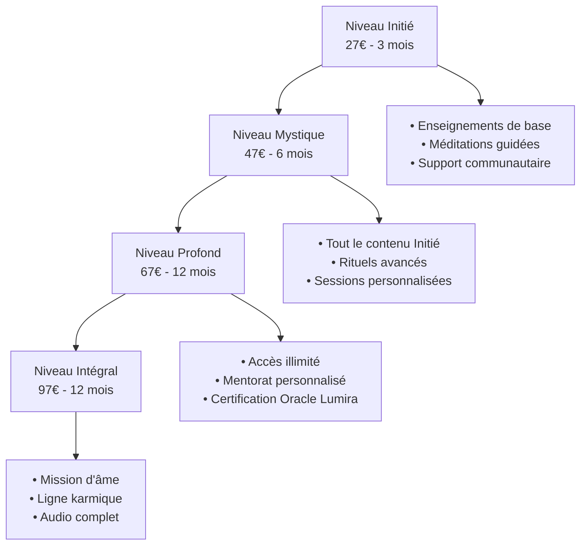
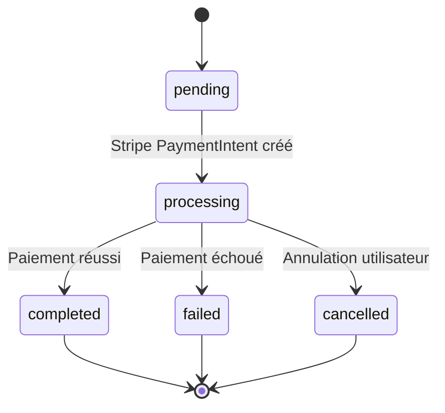
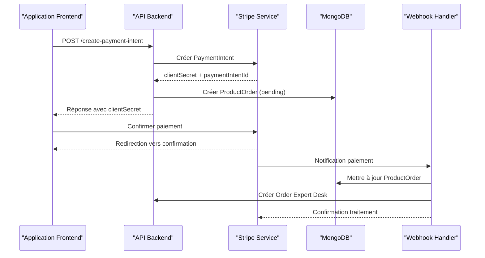
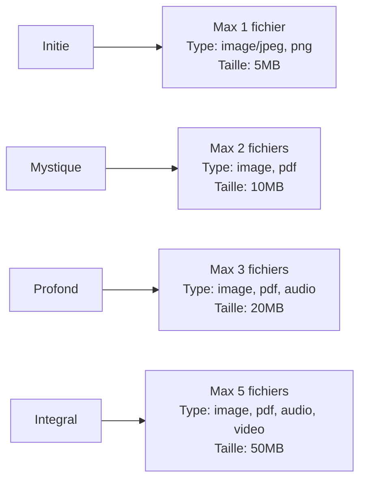
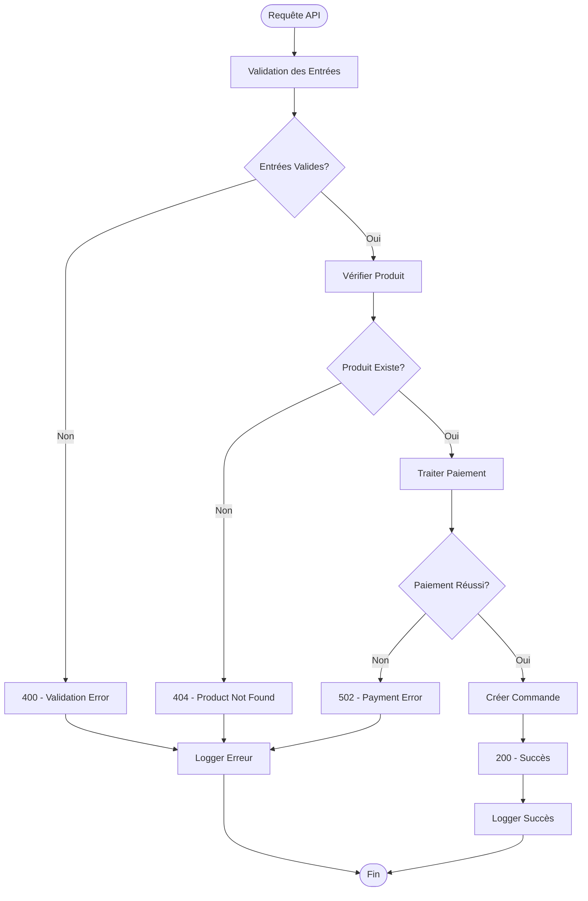

# Catalogue des Produits

<cite>
**Fichiers Référencés dans ce Document**
- [products.ts](file://apps/api-backend/src/routes/products.ts)
- [catalog.ts](file://apps/api-backend/src/catalog.ts)
- [testData.ts](file://apps/api-backend/src/data/testData.ts)
- [useProducts.ts](file://apps/main-app/src/hooks/useProducts.ts)
- [products.ts](file://apps/main-app/src/types/products.ts)
- [LandingTemple.tsx](file://apps/main-app/src/pages/LandingTemple.tsx)
- [CommandeTemple.tsx](file://apps/main-app/src/pages/CommandeTemple.tsx)
- [stripe.ts](file://apps/api-backend/src/services/stripe.ts)
- [ProductOrder.ts](file://apps/api-backend/src/models/ProductOrder.ts)
</cite>

## Table des Matières
1. [Introduction](#introduction)
2. [Structure du Catalogue](#structure-du-catalogue)
3. [Endpoints API](#endpoints-api)
4. [Modèle de Données](#modèle-de-données)
5. [Architecture des Produits](#architecture-des-produits)
6. [Intégration Frontend](#intégration-frontend)
7. [Stratégies de Mise en Cache](#stratégies-de-mise-en-cache)
8. [Gestion des Erreurs](#gestion-des-erreurs)
9. [Guide de Développement](#guide-de-développement)
10. [Conclusion](#conclusion)

## Introduction

Le système de catalogue de produits d'Oracle Lumira constitue le cœur de l'écosystème de commerce électronique de l'application. Il gère la structure des niveaux spirituels, les prix, les descriptions et fournit une API robuste pour la gestion des commandes et des paiements via Stripe.

Le catalogue est conçu autour de quatre niveaux distincts : Initié, Mystique, Profond et Intégral, chacun offrant un accès progressif aux enseignements spirituels de l'Oracle Lumira.

## Structure du Catalogue

### Niveaux Spirituels

Le système utilise une hiérarchie de niveaux qui reflète le parcours spirituel des utilisateurs :



**Sources du Diagramme**
- [catalog.ts](file://apps/api-backend/src/catalog.ts#L1-L129)

### Structure des Produits

Chaque produit dans le catalogue possède une structure définie :

```typescript
interface Product {
  id: string;
  name: string;
  description: string;
  amountCents: number;
  currency: string;
  level: 'initie' | 'mystique' | 'profond' | 'integrale';
  features: string[];
  metadata: {
    duration?: string;
    access?: string[];
    bonus?: string[];
  };
}
```

**Sources de la Section**
- [catalog.ts](file://apps/api-backend/src/catalog.ts#L4-L18)

## Endpoints API

### GET /api/products

**Description** : Récupère la liste complète du catalogue de produits

**Réponse** :
```json
{
  "products": [
    {
      "id": "initie",
      "name": "Niveau Initié",
      "description": "Découverte des mystères fondamentaux",
      "amountCents": 2700,
      "currency": "eur",
      "level": "initie",
      "features": [
        "Accès aux enseignements de base",
        "Méditations guidées",
        "Support communautaire"
      ],
      "metadata": {
        "duration": "3 mois",
        "access": ["basic-content", "community"],
        "bonus": ["welcome-guide"]
      }
    }
  ]
}
```

### POST /api/products/create-payment-intent

**Description** : Crée un PaymentIntent pour un achat de produit

**Corps de Requête** :
```json
{
  "productId": "initie",
  "customerEmail": "client@example.com",
  "metadata": {
    "source": "spa-checkout",
    "requestId": "req_1234567890"
  }
}
```

**Réponse** :
```json
{
  "clientSecret": "pi_1234567890_secret_abc123",
  "orderId": "pi_1234567890",
  "amount": 2700,
  "currency": "eur",
  "productName": "Niveau Initié"
}
```

### GET /api/products/order/:orderId

**Description** : Récupère le statut et les détails d'une commande

**Réponse** :
```json
{
  "order": {
    "id": "pi_1234567890",
    "productId": "initie",
    "customerEmail": "client@example.com",
    "amount": 2700,
    "currency": "eur",
    "status": "completed",
    "paymentIntentId": "pi_1234567890",
    "createdAt": "2024-01-01T10:00:00.000Z",
    "updatedAt": "2024-01-01T10:05:00.000Z",
    "completedAt": "2024-01-01T10:05:00.000Z",
    "metadata": {
      "productName": "Niveau Initié",
      "level": "initie"
    }
  },
  "product": {
    "id": "initie",
    "name": "Niveau Initié",
    "level": "initie"
  },
  "accessGranted": true,
  "sanctuaryUrl": "/sanctuaire"
}
```

**Sources de la Section**
- [products.ts](file://apps/api-backend/src/routes/products.ts#L25-L782)

## Modèle de Données

### ProductOrder

La collection MongoDB `ProductOrder` stocke toutes les commandes de produits :

```typescript
interface IProductOrder extends Document {
  _id: mongoose.Types.ObjectId;
  productId: string;
  customerId?: string;
  customerEmail?: string;
  amount: number;
  currency: string;
  status: ProductOrderStatus;
  paymentIntentId: string;
  createdAt: Date;
  updatedAt: Date;
  completedAt?: Date;
  metadata?: Record<string, any>;
}
```

### États de Commande



**Sources du Diagramme**
- [ProductOrder.ts](file://apps/api-backend/src/models/ProductOrder.ts#L4-L10)

**Sources de la Section**
- [ProductOrder.ts](file://apps/api-backend/src/models/ProductOrder.ts#L1-L49)

## Architecture des Produits

### Flux de Traitement des Paiements



**Sources du Diagramme**
- [products.ts](file://apps/api-backend/src/routes/products.ts#L25-L180)
- [stripe.ts](file://apps/api-backend/src/services/stripe.ts#L30-L80)

### Gestion des Webhooks

Le système traite trois types d'événements Stripe :

1. **payment_intent.succeeded** : Mise à jour du statut en "completed"
2. **payment_intent.payment_failed** : Mise à jour du statut en "failed"
3. **payment_intent.canceled** : Mise à jour du statut en "cancelled"

**Sources de la Section**
- [products.ts](file://apps/api-backend/src/routes/products.ts#L250-L450)

## Intégration Frontend

### Hook useProducts

Le hook React `useProducts` fournit une interface simplifiée pour l'accès au catalogue :

```typescript
export interface ProductWithLevel extends Product {
  displayOrder: number;
  uploadConfig: {
    maxFiles: number;
    allowedTypes: string[];
    requiredFields: string[];
    maxSizeBytes: number;
  };
}

export const useProducts = () => {
  const [data, setData] = useState<ProductWithLevel[] | null>(null);
  const [isLoading, setIsLoading] = useState(true);
  const [error, setError] = useState<Error | null>(null);
};
```

### Configuration d'Upload par Niveau



**Sources du Diagramme**
- [useProducts.ts](file://apps/main-app/src/hooks/useProducts.ts#L10-L35)

**Sources de la Section**
- [useProducts.ts](file://apps/main-app/src/hooks/useProducts.ts#L1-L90)
- [products.ts](file://apps/main-app/src/types/products.ts#L1-L157)

## Stratégies de Mise en Cache

### Optimisations de Performance

Le système implémente plusieurs stratégies de mise en cache :

1. **Catalogue en Mémoire** : Le catalogue de produits est stocké en mémoire pour un accès rapide
2. **Idempotence des Webhooks** : Utilisation d'un Set pour éviter le traitement répété des mêmes événements
3. **Cache des Commandes** : Les commandes sont mises en cache localement avant vérification Stripe

### Exemple de Mise en Cache

```typescript
// Idempotence des webhooks
const processedWebhookEvents = new Set<string>();

// Vérification d'idempotence
if (processedWebhookEvents.has(event.id)) {
  console.log('Webhook event already processed:', event.id);
  res.json({ received: true, already_processed: true });
  return;
}
```

**Sources de la Section**
- [products.ts](file://apps/api-backend/src/routes/products.ts#L180-L200)

## Gestion des Erreurs

### Stratégies de Gestion d'Erreurs

Le système implémente une gestion d'erreurs granulaire avec codes d'erreur spécifiques :



**Sources du Diagramme**
- [products.ts](file://apps/api-backend/src/routes/products.ts#L50-L150)

### Codes d'Erreur Spécifiques

- **INVALID_REQUEST_BODY** : Corps de requête invalide
- **MISSING_PRODUCT_ID** : ID de produit requis
- **PRODUCT_NOT_FOUND** : Produit non trouvé
- **INVALID_EMAIL** : Format d'email invalide
- **STRIPE_CONFIG_ERROR** : Configuration Stripe manquante
- **STRIPE_SERVICE_ERROR** : Erreur de service Stripe

**Sources de la Section**
- [products.ts](file://apps/api-backend/src/routes/products.ts#L180-L280)

## Guide de Développement

### Environnements de Développement

Le fichier `testData.ts` fournit des données de test pour les environnements de développement :

```typescript
export const testOrders: TestOrder[] = [
  {
    _id: '674b7e123456789012345101',
    orderNumber: 'LUM-2024-001',
    level: 1,
    levelName: 'Niveau 1 - Guidance Spirituelle',
    customerEmail: 'client1@email.com',
    customerName: 'Marie Dupont',
    status: 'paid',
    amount: 29.99,
    currency: 'EUR',
    createdAt: new Date('2024-12-01T10:30:00Z'),
    updatedAt: new Date('2024-12-01T10:30:00Z')
  }
];
```

### Ajout d'un Nouveau Produit

Pour ajouter un nouveau produit au catalogue :

1. Mettre à jour `PRODUCT_CATALOG` dans `catalog.ts`
2. Ajouter la configuration d'upload dans `useProducts.ts`
3. Mettre à jour les types dans `products.ts`
4. Tester avec les routes de debug si nécessaire

**Sources de la Section**
- [testData.ts](file://apps/api-backend/src/data/testData.ts#L1-L177)

## Conclusion

Le système de catalogue de produits d'Oracle Lumira représente une architecture robuste et bien structurée pour la gestion des achats de niveaux spirituels. Il combine efficacement les technologies modernes (Stripe, MongoDB, React) avec une approche de développement axée sur la fiabilité et la performance.

Les points forts incluent :
- **Architecture modulaire** avec séparation claire des responsabilités
- **Gestion d'erreurs granulaire** avec codes d'erreur spécifiques
- **Stratégies de performance** avec mise en cache intelligente
- **Intégration frontend** optimisée avec hooks React
- **Support des webhooks** pour la synchronisation en temps réel

Cette architecture permet une scalabilité future tout en maintenant la simplicité d'utilisation pour les développeurs et les utilisateurs finaux.