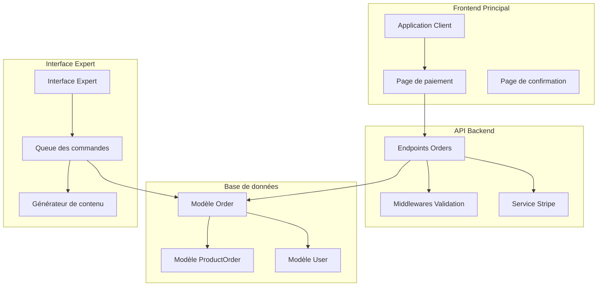
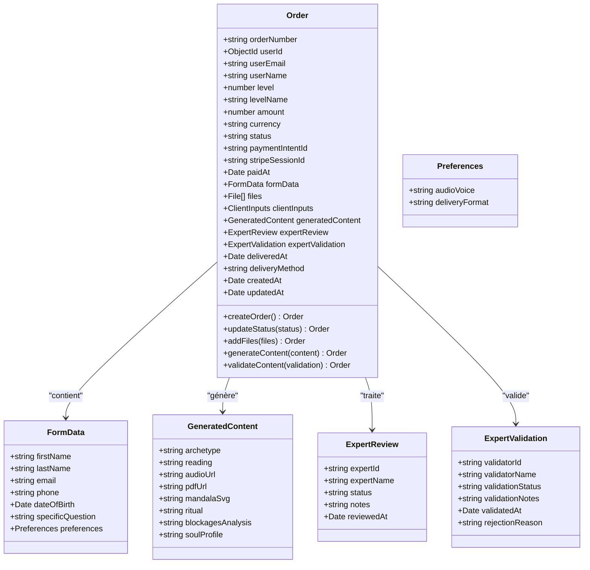
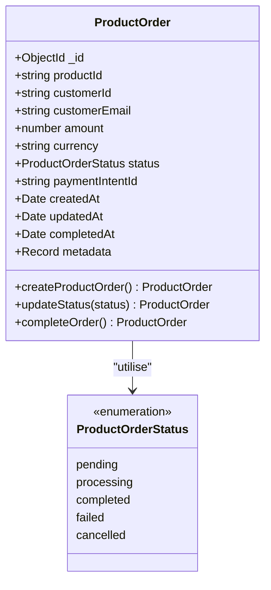
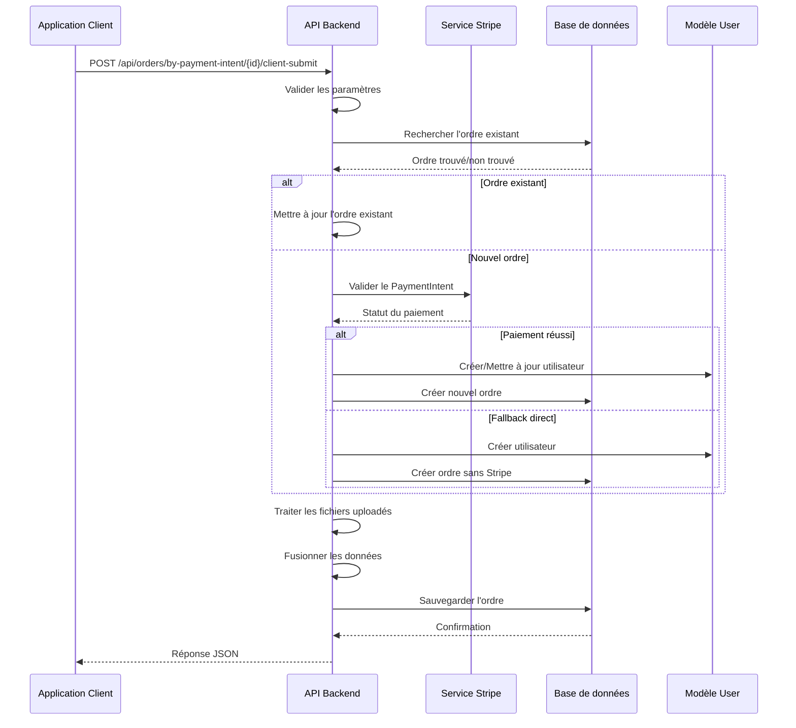
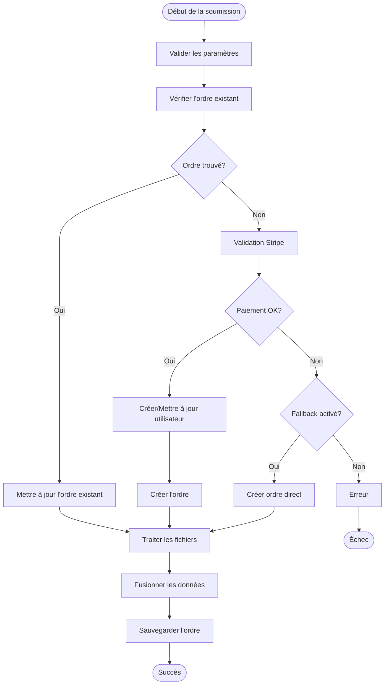
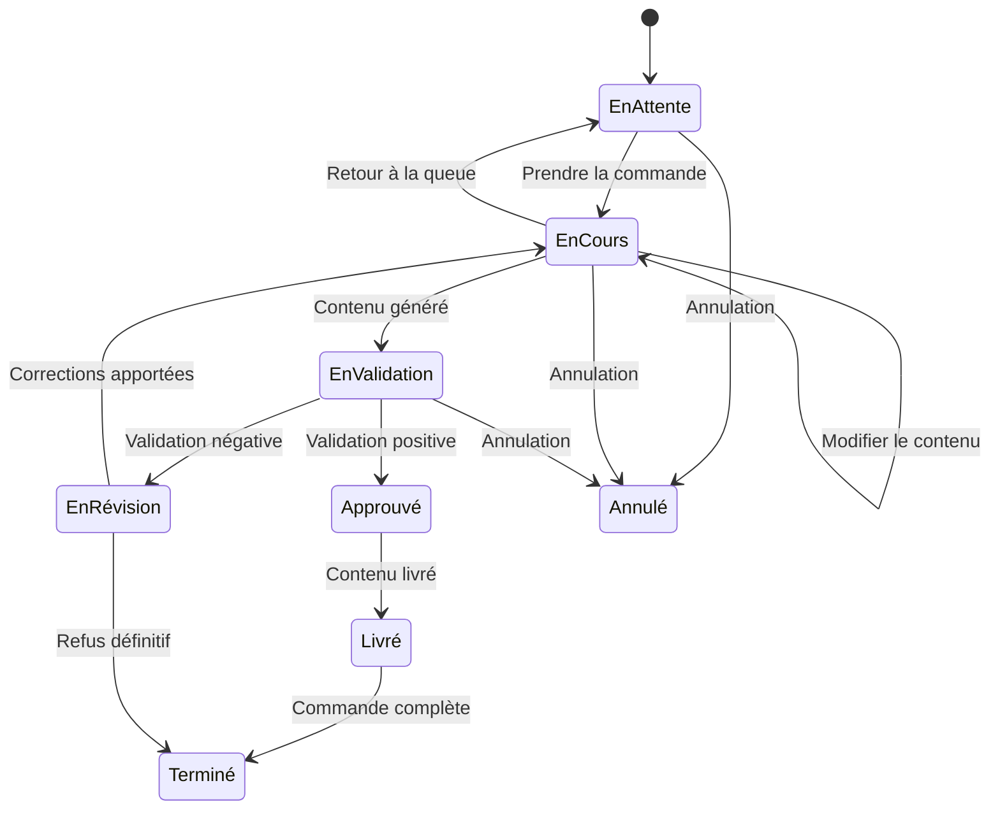
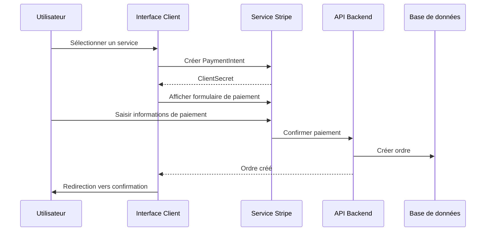
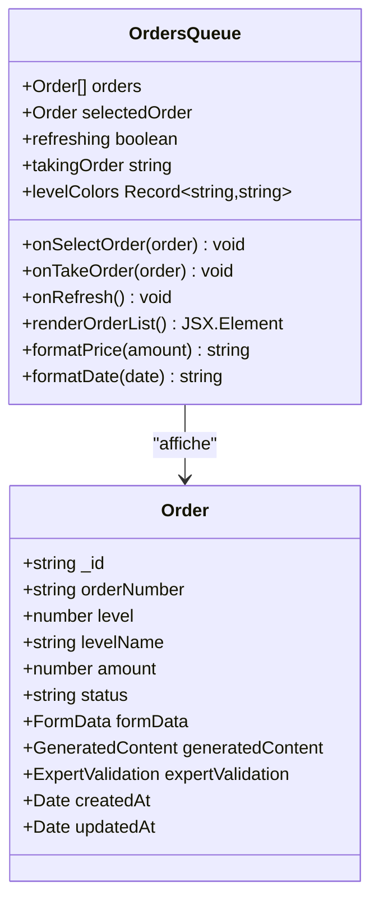
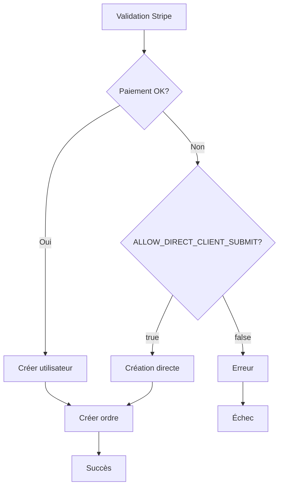

# Gestion des commandes

<cite>
**Fichiers référencés dans ce document**
- [orders.ts](file://apps/api-backend/src/routes/orders.ts)
- [Order.ts](file://apps/api-backend/src/models/Order.ts)
- [ProductOrder.ts](file://apps/api-backend/src/models/ProductOrder.ts)
- [EnhancedOrder.ts](file://apps/api-backend/src/models/EnhancedOrder.ts)
- [validation.ts](file://apps/api-backend/src/middleware/validation.ts)
- [CommandeTemple.tsx](file://apps/main-app/src/pages/CommandeTemple.tsx)
- [OrdersQueue.tsx](file://apps/expert-desk/src/components/OrdersQueue.tsx)
- [Order.ts](file://apps/expert-desk/src/types/Order.ts)
</cite>

## Table des matières
1. [Introduction](#introduction)
2. [Structure du système](#structure-du-système)
3. [Modèles de données](#modèles-de-données)
4. [Endpoints API](#endpoints-api)
5. [Flux de traitement des commandes](#flux-de-traitement-des-commandes)
6. [Validation et sécurité](#validation-et-sécurité)
7. [Intégration frontend](#intégration-frontend)
8. [Interface expert](#interface-expert)
9. [Gestion des erreurs](#gestion-des-erreurs)
10. [Optimisations et performances](#optimisations-et-performances)
11. [Guide de dépannage](#guide-de-dépannage)
12. [Conclusion](#conclusion)

## Introduction

Le système de gestion des commandes de Lumira V1 est une architecture complète qui permet la création, suivi et traitement des commandes clients. Il intègre plusieurs couches : backend API, frontend principal, et interface expert, chacune ayant ses responsabilités spécifiques dans le processus de commande.

Le système gère principalement deux types d'ordres :
- **Ordres de niveau** (Order) : Pour les services de consultation et de développement personnel
- **Ordres de produits** (ProductOrder) : Pour les achats de produits physiques ou numériques

## Structure du système

Le système de gestion des commandes suit une architecture en couches bien définie :



**Sources du diagramme**
- [orders.ts](file://apps/api-backend/src/routes/orders.ts#L1-L50)
- [Order.ts](file://apps/api-backend/src/models/Order.ts#L1-L50)

## Modèles de données

### Modèle Order principal

Le modèle `Order` est au cœur du système de gestion des commandes. Il contient toutes les informations nécessaires pour suivre le statut d'une commande de début à fin.



**Sources du diagramme**
- [Order.ts](file://apps/api-backend/src/models/Order.ts#L5-L100)
- [EnhancedOrder.ts](file://apps/api-backend/src/models/EnhancedOrder.ts#L5-L100)

### Modèle ProductOrder

Le modèle `ProductOrder` gère les commandes de produits, avec des champs spécifiques pour les achats de produits physiques ou numériques.



**Sources du diagramme**
- [ProductOrder.ts](file://apps/api-backend/src/models/ProductOrder.ts#L5-L40)

### Modèle EnhancedOrder

Le modèle `EnhancedOrder` est une version améliorée de l'ordre standard, incluant des fonctionnalités avancées comme les sessions de consultation en temps réel et la gestion des notifications.

**Sources de la section**
- [Order.ts](file://apps/api-backend/src/models/Order.ts#L1-L277)
- [ProductOrder.ts](file://apps/api-backend/src/models/ProductOrder.ts#L1-L49)
- [EnhancedOrder.ts](file://apps/api-backend/src/models/EnhancedOrder.ts#L1-L372)

## Endpoints API

### Création de commande

L'endpoint principal pour créer des commandes est `/api/orders/by-payment-intent/:paymentIntentId/client-submit`. Ce endpoint gère la soumission finale des commandes après paiement.



**Sources du diagramme**
- [orders.ts](file://apps/api-backend/src/routes/orders.ts#L40-L200)

### Récupération d'ordres

L'API fournit plusieurs endpoints pour récupérer les ordres :

- **GET /api/orders/** : Liste paginée avec filtres
- **GET /api/orders/:id** : Détails d'un ordre spécifique
- **GET /api/orders/number/:orderNumber** : Recherche par numéro de commande
- **GET /api/orders/stats/overview** : Statistiques générales

### Mise à jour d'ordres

Les endpoints de mise à jour permettent de modifier différents aspects des commandes :

- **PATCH /api/orders/:id/status** : Changement de statut
- **PATCH /api/orders/:id/expert-review** : Ajout d'un avis d'expert
- **PATCH /api/orders/:id/content** : Mise à jour du contenu généré
- **PATCH /api/orders/:id/delivered** : Marquer comme livré

**Sources de la section**
- [orders.ts](file://apps/api-backend/src/routes/orders.ts#L200-L400)

## Flux de traitement des commandes

### Flux de création de commande

Le processus de création suit un pipeline sophistiqué avec plusieurs étapes de validation et de fallback :



**Sources du diagramme**
- [orders.ts](file://apps/api-backend/src/routes/orders.ts#L40-L200)

### Flux de traitement par l'expert

L'interface expert suit un processus structuré pour traiter les commandes :



**Sources de la section**
- [OrdersQueue.tsx](file://apps/expert-desk/src/components/OrdersQueue.tsx#L1-L187)

## Validation et sécurité

### Validation des requêtes

Le système utilise un middleware de validation centralisé qui gère uniformément toutes les erreurs de validation :

```typescript
// Exemple de validation
const validateRequest = (req: Request, res: Response, next: NextFunction): void => {
  const errors = validationResult(req);
  
  if (!errors.isEmpty()) {
    res.status(400).json({
      error: 'Validation failed',
      details: errors.array().map(error => ({
        field: error.type === 'field' ? error.path : 'unknown',
        message: error.msg,
        value: error.type === 'field' ? error.value : undefined,
      })),
      timestamp: new Date().toISOString(),
    });
    return;
  }
  
  next();
};
```

### Sécurité des uploads

Le système implémente des contrôles stricts sur les uploads de fichiers :

- **Taille maximale** : 10MB par fichier
- **Types autorisés** : image/jpeg, image/png, image/gif, image/webp
- **Validation des métadonnées** : Vérification des types MIME
- **Stockage sécurisé** : Uploads sur disque avec nommage aléatoire

**Sources de la section**
- [validation.ts](file://apps/api-backend/src/middleware/validation.ts#L1-L64)
- [orders.ts](file://apps/api-backend/src/routes/orders.ts#L20-L40)

## Intégration frontend

### Application client principal

L'application client principal (`main-app`) gère le processus de commande complet :



**Sources du diagramme**
- [CommandeTemple.tsx](file://apps/main-app/src/pages/CommandeTemple.tsx#L1-L100)

### Gestion des paiements

Le système utilise Stripe pour la gestion des paiements avec support pour plusieurs niveaux de service :

- **Niveau Initie** : Service basique
- **Niveau Mystique** : Service avancé
- **Niveau Profond** : Service premium
- **Niveau Intégral** : Service VIP

**Sources de la section**
- [CommandeTemple.tsx](file://apps/main-app/src/pages/CommandeTemple.tsx#L1-L387)

## Interface expert

### Queue des commandes

L'interface expert (`expert-desk`) fournit une vue d'ensemble des commandes en attente avec des fonctionnalités avancées :



**Sources du diagramme**
- [OrdersQueue.tsx](file://apps/expert-desk/src/components/OrdersQueue.tsx#L1-L50)
- [Order.ts](file://apps/expert-desk/src/types/Order.ts#L1-L30)

### Fonctionnalités de l'interface expert

L'interface expert offre les fonctionnalités suivantes :

- **Vue d'ensemble** : Liste des commandes triées par priorité
- **Détails de commande** : Informations complètes sur chaque commande
- **Génération de contenu** : Outils pour créer le contenu personnalisé
- **Validation** : Processus de validation du contenu généré
- **Suivi** : Statistiques et métriques de performance

**Sources de la section**
- [OrdersQueue.tsx](file://apps/expert-desk/src/components/OrdersQueue.tsx#L1-L187)
- [Order.ts](file://apps/expert-desk/src/types/Order.ts#L1-L65)

## Gestion des erreurs

### Types d'erreurs courantes

Le système identifie et gère plusieurs types d'erreurs :

1. **Produits indisponibles** : Stock insuffisant ou produit épuisé
2. **Données invalides** : Formats incorrects ou champs manquants
3. **Erreurs de paiement** : Problèmes avec Stripe ou informations de paiement
4. **Erreurs de validation** : Données ne respectant pas les règles métier
5. **Erreurs de système** : Problèmes techniques internes

### Mécanismes de fallback

Le système implémente plusieurs niveaux de fallback :



**Sources du diagramme**
- [orders.ts](file://apps/api-backend/src/routes/orders.ts#L100-L150)

## Optimisations et performances

### Stratégies d'optimisation

Le système implémente plusieurs optimisations pour garantir des performances élevées :

1. **Pagination** : Limitation des résultats pour éviter les requêtes trop volumineuses
2. **Indexation** : Indexation appropriée des champs fréquemment consultés
3. **Lazy loading** : Chargement progressif des données
4. **Cache** : Mise en cache des données statiques
5. **Streaming** : Traitement des gros fichiers en streaming

### Monitoring et métriques

Le système surveille plusieurs métriques clés :

- **Taux de conversion** : Ratio entre commandes initiées et terminées
- **Temps de traitement** : Durée moyenne de traitement par étape
- **Disponibilité** : Temps de réponse moyen et temps d'arrêt
- **Qualité** : Taux de validation réussie et satisfaction client

## Guide de dépannage

### Problèmes courants

#### Erreur 400 - Données invalides

**Symptôme** : Réponse avec code 400 et détails de validation

**Causes possibles** :
- Format de date incorrect
- Email invalide
- Taille de fichier excessive
- Type de fichier non autorisé

**Solution** :
```javascript
// Vérifier les formats attendus
const date = new Date(formData.dateOfBirth);
const email = formData.email.toLowerCase();
const isValidFileSize = file.size <= 10 * 1024 * 1024;
```

#### Erreur 404 - Ordre non trouvé

**Symptôme** : Ordre inexistant ou ID invalide

**Causes possibles** :
- Ordre supprimé
- ID incorrect
- Permissions insuffisantes

**Solution** :
- Vérifier l'existence de l'ordre avant traitement
- Implémenter des vérifications préalables
- Fournir des messages d'erreur explicites

#### Erreur 500 - Échec interne

**Symptôme** : Erreur serveur non gérée

**Causes possibles** :
- Base de données inaccessible
- Dépendance manquante
- Configuration incorrecte

**Solution** :
- Vérifier les logs serveur
- Tester les connexions aux services externes
- Valider la configuration environnementale

### Debugging avancé

Pour déboguer les problèmes complexes, le système fournit des logs détaillés :

```typescript
// Logs d'instrumentation
console.log('[CLIENT-SUBMIT] Début de traitement - PI:', req.params.paymentIntentId);
console.log('[CLIENT-SUBMIT] Fichiers reçus:', req.files);
console.log('[CLIENT-SUBMIT] Body reçu:', req.body);
console.log('[CLIENT-SUBMIT] Headers:', req.headers);
```

**Sources de la section**
- [orders.ts](file://apps/api-backend/src/routes/orders.ts#L40-L80)

## Conclusion

Le système de gestion des commandes de Lumira V1 représente une architecture robuste et évolutive qui répond aux besoins complets de gestion des commandes clients. Il intègre parfaitement les différentes couches technologiques (frontend, backend, base de données) tout en maintenant une séparation claire des responsabilités.

### Points forts du système

1. **Flexibilité** : Support de multiples types de commandes et de services
2. **Robustesse** : Mécanismes de fallback et validation complète
3. **Scalabilité** : Architecture modulaire permettant l'évolution future
4. **Expérience utilisateur** : Interfaces intuitives pour tous les acteurs
5. **Sécurité** : Contrôles de validation et protection contre les erreurs

### Recommandations futures

- **Amélioration de l'IA** : Intégration de modèles d'IA pour la génération de contenu
- **Optimisation mobile** : Amélioration de l'expérience mobile
- **Analytics avancés** : Dashboard de reporting enrichi
- **Automatisation** : Processus automatisés pour les tâches répétitives
- **Internationalisation** : Support multilingue et multi-devise

Le système constitue une base solide pour l'évolution continue de l'application Lumira V1, offrant les outils nécessaires pour gérer efficacement la croissance des commandes et améliorer constamment l'expérience utilisateur.