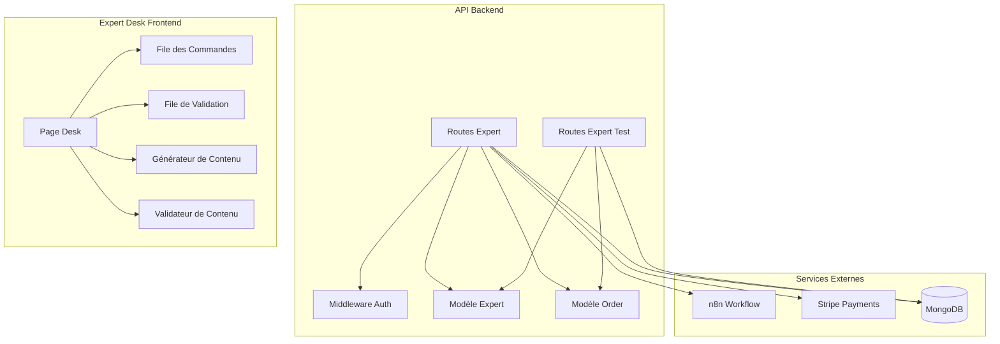
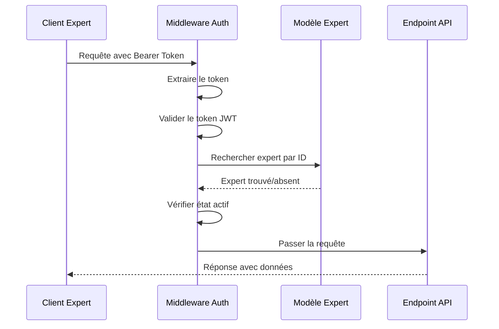
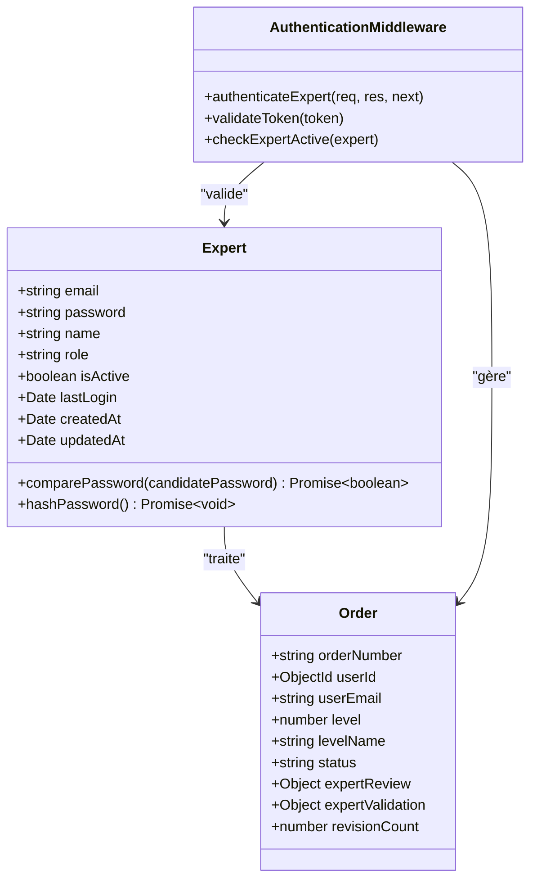
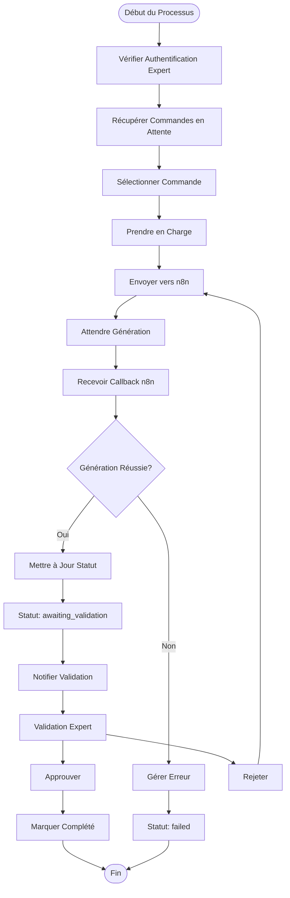
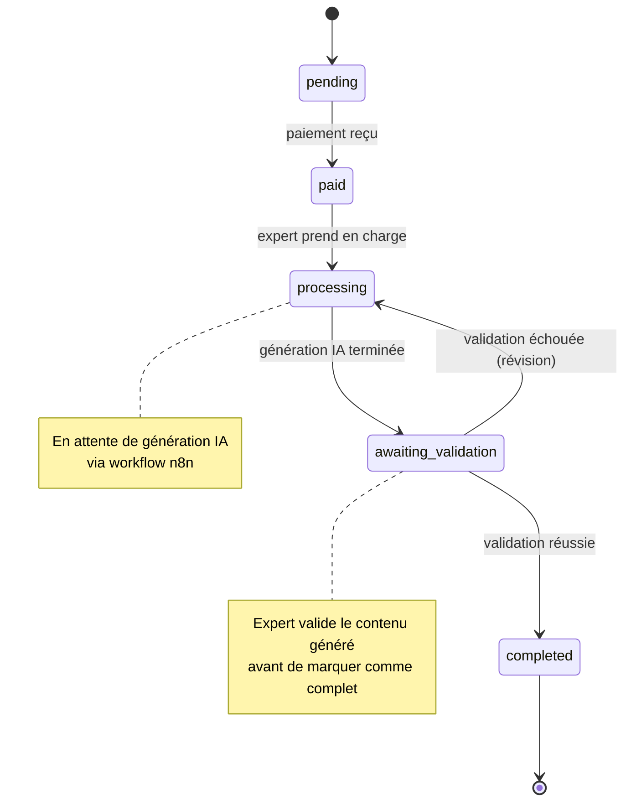
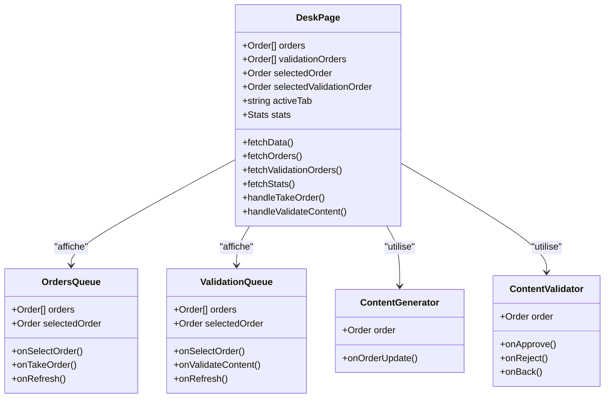
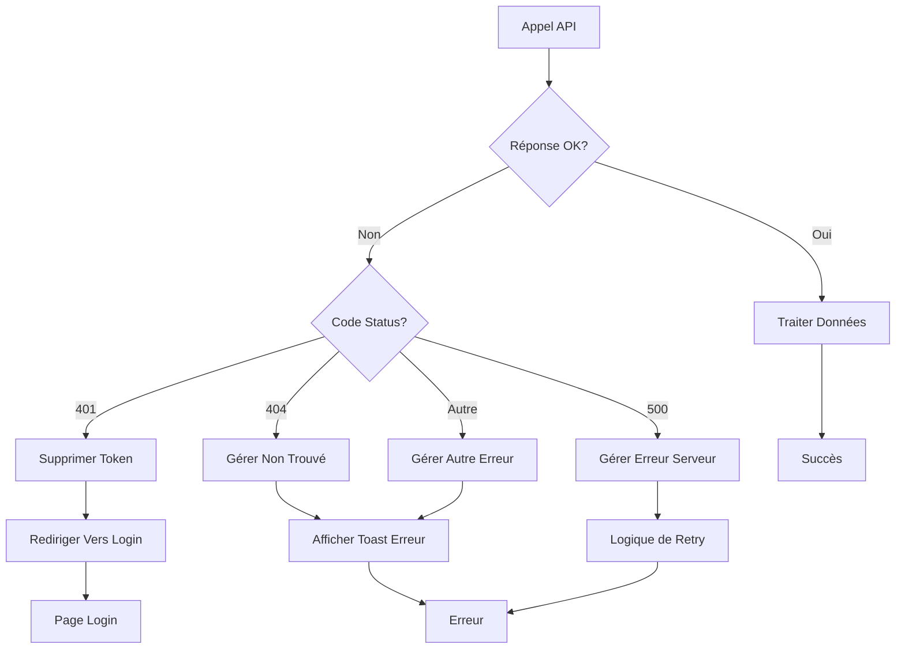
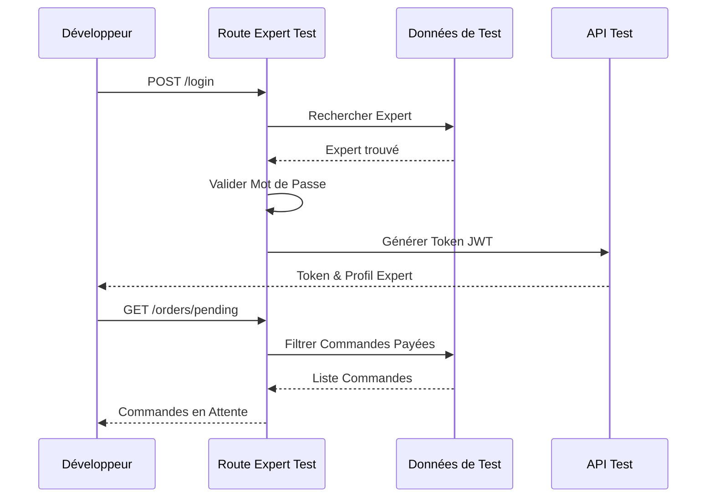

# Interface Expert

<cite>
**Fichiers Référencés dans ce Document**
- [apps/api-backend/src/routes/expert.ts](file://apps/api-backend/src/routes/expert.ts)
- [apps/api-backend/src/routes/expert-test.ts](file://apps/api-backend/src/routes/expert-test.ts)
- [apps/api-backend/src/models/Expert.ts](file://apps/api-backend/src/models/Expert.ts)
- [apps/api-backend/src/models/Order.ts](file://apps/api-backend/src/models/Order.ts)
- [apps/api-backend/src/middleware/auth.ts](file://apps/api-backend/src/middleware/auth.ts)
- [apps/expert-desk/src/pages/DeskPage.tsx](file://apps/expert-desk/src/pages/DeskPage.tsx)
- [apps/expert-desk/src/utils/api.ts](file://apps/expert-desk/src/utils/api.ts)
- [apps/api-backend/src/data/testData.ts](file://apps/api-backend/src/data/testData.ts)
</cite>

## Table des Matières
1. [Introduction](#introduction)
2. [Structure du Projet](#structure-du-projet)
3. [Endpoints de l'Interface Expert](#endpoints-de-linterface-expert)
4. [Architecture de l'Authentification](#architecture-de-lauthentification)
5. [Flux de Travail Expert](#flux-de-travail-expert)
6. [Composants Frontend](#composants-frontend)
7. [Gestion des Erreurs](#gestion-des-erreurs)
8. [Environnements de Développement](#environnements-de-développement)
9. [Guide de Dépannage](#guide-de-dépannage)
10. [Conclusion](#conclusion)

## Introduction

L'interface expert constitue le cœur du système de gestion des commandes pour les experts de Lumira Oracle. Cette API RESTfully conçue permet aux experts de gérer leur flux de travail complet : accès aux commandes en attente, validation du contenu généré par l'IA, et marquage des commandes comme complétées. L'interface comprend également un frontend dédié appelé Expert Desk qui offre une expérience utilisateur intuitive pour ces opérations.

Le système utilise une architecture basée sur Express.js avec MongoDB pour la persistance des données, et implémente un système d'authentification robuste utilisant JWT (JSON Web Tokens). Les experts peuvent accéder aux fonctionnalités via des endpoints sécurisés protégés par middleware d'authentification.

## Structure du Projet



**Sources du Diagramme**
- [apps/api-backend/src/routes/expert.ts](file://apps/api-backend/src/routes/expert.ts#L1-L50)
- [apps/api-backend/src/routes/expert-test.ts](file://apps/api-backend/src/routes/expert-test.ts#L1-L30)
- [apps/expert-desk/src/pages/DeskPage.tsx](file://apps/expert-desk/src/pages/DeskPage.tsx#L1-L50)

**Sources de Section**
- [apps/api-backend/src/routes/expert.ts](file://apps/api-backend/src/routes/expert.ts#L1-L100)
- [apps/api-backend/src/routes/expert-test.ts](file://apps/api-backend/src/routes/expert-test.ts#L1-L50)

## Endpoints de l'Interface Expert

### Routes d'Authentification

#### POST /api/expert/register
Permet aux experts de s'enregistrer dans le système.

**Exemple de Requête :**
```json
{
  "email": "expert@oraclelumira.com",
  "password": "Lumira2025L",
  "name": "Oracle Expert"
}
```

**Réponse Succès :**
```json
{
  "message": "Expert créé avec succès",
  "token": "eyJhbGciOiJIUzI1NiIsInR5cCI6IkpXVCJ9...",
  "expert": {
    "id": "674b7e123456789012345001",
    "email": "expert@oraclelumira.com",
    "name": "Oracle Expert",
    "role": "expert",
    "isActive": true
  }
}
```

#### POST /api/expert/login
Authentifie un expert et génère un token JWT.

**Exemple de Requête :**
```json
{
  "email": "expert@oraclelumira.com",
  "password": "Lumira2025L"
}
```

**Réponse Succès :**
```json
{
  "success": true,
  "token": "eyJhbGciOiJIUzI1NiIsInR5cCI6IkpXVCJ9...",
  "expert": {
    "id": "674b7e123456789012345001",
    "name": "Oracle Expert",
    "email": "expert@oraclelumira.com",
    "lastLogin": "2024-12-01T10:30:00Z"
  }
}
```

### Routes de Gestion des Commandes

#### GET /api/expert/orders/pending
Récupère la liste des commandes en attente pour l'expert connecté.

**Paramètres de Requête :**
- `page`: Numéro de page (défaut: 1)
- `limit`: Nombre d'éléments par page (défaut: 20)

**Réponse :**
```json
{
  "orders": [
    {
      "_id": "674b7e123456789012345101",
      "orderNumber": "LUM-2024-001",
      "level": 1,
      "levelName": "Simple",
      "amount": 2999,
      "currency": "eur",
      "status": "paid",
      "createdAt": "2024-12-01T10:30:00Z",
      "updatedAt": "2024-12-01T10:30:00Z",
      "userId": {
        "firstName": "Marie",
        "lastName": "Dupont",
        "email": "client1@email.com",
        "phone": "0612345678"
      }
    }
  ],
  "pagination": {
    "current": 1,
    "total": 1,
    "count": 1,
    "limit": 20
  }
}
```

#### POST /api/expert/process-order
Traite une commande en l'envoyant vers le workflow n8n pour génération IA.

**Exemple de Requête :**
```json
{
  "orderId": "674b7e123456789012345101",
  "expertPrompt": "Créer une lecture spirituelle personnalisée pour cette cliente.",
  "expertInstructions": "Utiliser un langage inspirant et professionnel."
}
```

**Réponse Succès :**
```json
{
  "success": true,
  "message": "Commande envoyée avec succès à l'assistant IA",
  "orderId": "674b7e123456789012345101",
  "orderNumber": "LUM-2024-001",
  "n8nStatus": 200
}
```

### Routes de Validation

#### GET /api/expert/orders/validation-queue
Récupère la file d'attente des commandes en attente de validation par l'expert.

**Réponse :**
```json
{
  "orders": [
    {
      "_id": "674b7e123456789012345101",
      "orderNumber": "LUM-2024-001",
      "status": "awaiting_validation",
      "generatedContent": {
        "reading": "Votre lecture spirituelle générée...",
        "audioUrl": "https://storage.googleapis.com/...",
        "pdfUrl": "https://storage.googleapis.com/..."
      },
      "expertValidation": {
        "validationStatus": "pending",
        "validationNotes": "Contenu généré par IA - En attente de validation Expert"
      }
    }
  ]
}
```

#### POST /api/expert/n8n-callback
Reçoit les callbacks du workflow n8n avec le contenu généré.

**Exemple de Requête :**
```json
{
  "orderId": "674b7e123456789012345101",
  "success": true,
  "generatedContent": {
    "reading": "Votre lecture spirituelle personnalisée...",
    "audioUrl": "https://storage.googleapis.com/audio.mp3",
    "pdfUrl": "https://storage.googleapis.com/readings.pdf"
  },
  "files": [],
  "isRevision": false
}
```

**Sources de Section**
- [apps/api-backend/src/routes/expert.ts](file://apps/api-backend/src/routes/expert.ts#L100-L300)
- [apps/api-backend/src/routes/expert.ts](file://apps/api-backend/src/routes/expert.ts#L400-L600)
- [apps/api-backend/src/routes/expert.ts](file://apps/api-backend/src/routes/expert.ts#L700-L900)

## Architecture de l'Authentification

### Middleware d'Authentification



**Sources du Diagramme**
- [apps/api-backend/src/middleware/auth.ts](file://apps/api-backend/src/middleware/auth.ts#L10-L50)
- [apps/api-backend/src/routes/expert.ts](file://apps/api-backend/src/routes/expert.ts#L150-L200)

### Schéma de Validation des Experts



**Sources du Diagramme**
- [apps/api-backend/src/models/Expert.ts](file://apps/api-backend/src/models/Expert.ts#L1-L50)
- [apps/api-backend/src/models/Order.ts](file://apps/api-backend/src/models/Order.ts#L1-L100)
- [apps/api-backend/src/middleware/auth.ts](file://apps/api-backend/src/middleware/auth.ts#L1-L50)

**Sources de Section**
- [apps/api-backend/src/middleware/auth.ts](file://apps/api-backend/src/middleware/auth.ts#L1-L119)
- [apps/api-backend/src/models/Expert.ts](file://apps/api-backend/src/models/Expert.ts#L1-L83)

## Flux de Travail Expert

### Processus de Traitement des Commandes



**Sources du Diagramme**
- [apps/api-backend/src/routes/expert.ts](file://apps/api-backend/src/routes/expert.ts#L300-L500)
- [apps/api-backend/src/routes/expert.ts](file://apps/api-backend/src/routes/expert.ts#L500-L700)

### Cycle de Vie d'une Commande



**Sources du Diagramme**
- [apps/api-backend/src/models/Order.ts](file://apps/api-backend/src/models/Order.ts#L10-L20)
- [apps/api-backend/src/routes/expert.ts](file://apps/api-backend/src/routes/expert.ts#L400-L500)

**Sources de Section**
- [apps/api-backend/src/routes/expert.ts](file://apps/api-backend/src/routes/expert.ts#L300-L700)
- [apps/api-backend/src/models/Order.ts](file://apps/api-backend/src/models/Order.ts#L1-L100)

## Composants Frontend

### Expert Desk Application

L'interface utilisateur est construite avec React et TypeScript, offrant une expérience moderne et responsive pour les experts.



**Sources du Diagramme**
- [apps/expert-desk/src/pages/DeskPage.tsx](file://apps/expert-desk/src/pages/DeskPage.tsx#L1-L100)
- [apps/expert-desk/src/utils/api.ts](file://apps/expert-desk/src/utils/api.ts#L1-L50)

### Gestion des Statistiques

L'application affiche plusieurs indicateurs de performance pour chaque expert :

- **Commandes en attente** : Nombre de commandes disponibles
- **En traitement** : Commandes actuellement traitées
- **En attente de validation** : Contenu généré en attente
- **Traitées aujourd'hui** : Nombre de commandes complétées
- **Total traitées** : Historique complet

**Sources de Section**
- [apps/expert-desk/src/pages/DeskPage.tsx](file://apps/expert-desk/src/pages/DeskPage.tsx#L1-L401)
- [apps/expert-desk/src/utils/api.ts](file://apps/expert-desk/src/utils/api.ts#L1-L65)

## Gestion des Erreurs

### Stratégies de Gestion d'Erreurs



**Sources du Diagramme**
- [apps/expert-desk/src/utils/api.ts](file://apps/expert-desk/src/utils/api.ts#L30-L60)

### Codes d'Erreur Standardisés

- **401 Unauthorized** : Token expiré ou invalide
- **403 Forbidden** : Permissions insuffisantes
- **404 Not Found** : Ressource non trouvée
- **409 Conflict** : Conflit d'enregistrement (expert existant)
- **500 Internal Server Error** : Erreur serveur interne

**Sources de Section**
- [apps/expert-desk/src/utils/api.ts](file://apps/expert-desk/src/utils/api.ts#L30-L65)

## Environnements de Développement

### Route de Test Spécialisée

La route `/api/expert-test` fournit une version simplifiée pour le développement sans base de données MongoDB.



**Sources du Diagramme**
- [apps/api-backend/src/routes/expert-test.ts](file://apps/api-backend/src/routes/expert-test.ts#L30-L80)

### Données de Test

Les données de test incluent :
- **Experts** : Maya et Sophia avec leurs spécialités
- **Commandes** : 4 commandes de test avec différents niveaux
- **Statistiques** : Métriques simulées pour le dashboard

**Sources de Section**
- [apps/api-backend/src/routes/expert-test.ts](file://apps/api-backend/src/routes/expert-test.ts#L1-L213)
- [apps/api-backend/src/data/testData.ts](file://apps/api-backend/src/data/testData.ts#L1-L177)

## Guide de Dépannage

### Problèmes Courants

#### 1. Erreur d'Authentification
**Symptôme** : Code 401 lors des appels API
**Solution** : 
- Vérifier que le token JWT est présent dans le header Authorization
- S'assurer que le token n'a pas expiré
- Redémarrer l'application Expert Desk

#### 2. Commandes Non Disponibles
**Symptôme** : Liste des commandes vide malgré présence de commandes
**Solution** :
- Vérifier que les commandes sont dans les statuts appropriés (paid, pending)
- S'assurer que l'expert n'a pas déjà une commande assignée
- Actualiser la page pour rafraîchir les données

#### 3. Échec d'Envoi vers n8n
**Symptôme** : Commande reste en statut processing sans avancement
**Solution** :
- Vérifier la configuration N8N_WEBHOOK_URL
- S'assurer que le service n8n est accessible
- Contrôler les logs du backend pour plus de détails

#### 4. Validation Échouée
**Symptôme** : Rejet de contenu sans message explicite
**Solution** :
- Vérifier la qualité du contenu généré
- S'assurer que tous les champs requis sont remplis
- Utiliser des notes de validation claires et constructives

### Outils de Diagnostic

#### Logs Importants
- **Expert login attempts** : Pour diagnostiquer les problèmes d'authentification
- **Order processing** : Pour suivre le cycle de vie des commandes
- **n8n callback** : Pour vérifier la communication avec le workflow
- **Validation queue** : Pour surveiller les commandes en attente de validation

#### Commandes de Test
```bash
# Tester l'authentification
curl -X POST http://localhost:3001/api/expert/login \
  -H "Content-Type: application/json" \
  -d '{"email":"expert@oraclelumira.com","password":"Lumira2025L"}'

# Vérifier les commandes en attente
curl -X GET http://localhost:3001/api/expert/orders/pending \
  -H "Authorization: Bearer YOUR_JWT_TOKEN"
```

**Sources de Section**
- [apps/api-backend/src/routes/expert.ts](file://apps/api-backend/src/routes/expert.ts#L200-L300)
- [apps/api-backend/src/routes/expert.ts](file://apps/api-backend/src/routes/expert.ts#L500-L600)

## Conclusion

L'interface expert représente un système robuste et bien structuré pour la gestion des commandes chez Lumira Oracle. Elle combine efficacement les technologies modernes (React, Express, MongoDB) avec des pratiques de développement solides (TypeScript, JWT, validation).

### Points Forts du Système

1. **Architecture Modulaire** : Séparation claire entre backend API et frontend dédié
2. **Sécurité Renforcée** : Authentification JWT avec middleware de validation
3. **Flexibilité** : Support des deux environnements (production avec base de données et développement avec données de test)
4. **Expérience Utilisateur** : Interface intuitive avec feedback en temps réel
5. **Gestion d'Erreurs** : Stratégies robustes pour tous les cas d'échec

### Recommandations Futures

1. **Monitoring Amélioré** : Ajouter des métriques de performance et alertes
2. **Tests Automatisés** : Développer une suite complète de tests E2E
3. **Documentation API** : Générer automatiquement la documentation Swagger
4. **Optimisation des Performances** : Implémenter le caching pour les données fréquemment consultées
5. **Accessibilité** : Améliorer l'accessibilité de l'interface Expert Desk

Le système est prêt pour une mise en production avec une base de données MongoDB complète et des configurations de sécurité appropriées. La version de test permet un développement et une validation efficaces pendant la phase de développement.