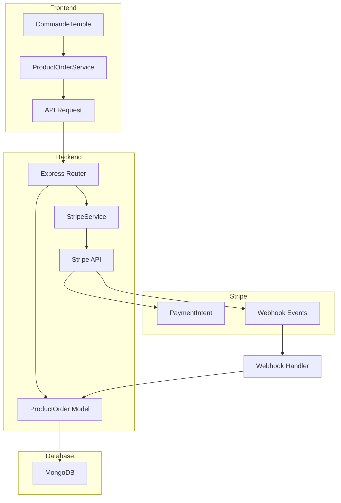
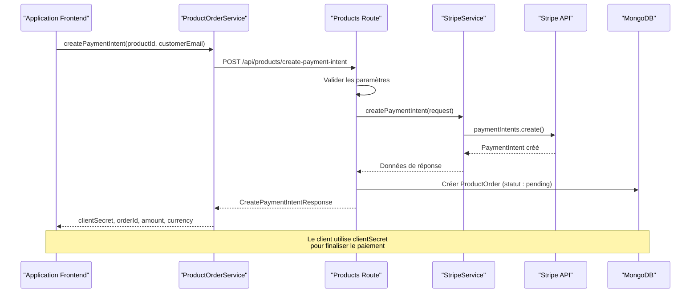
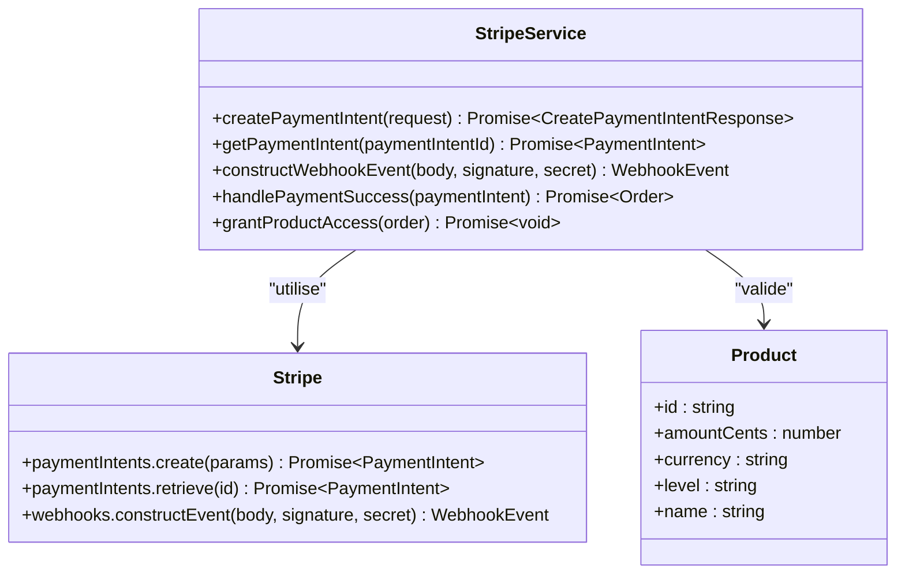
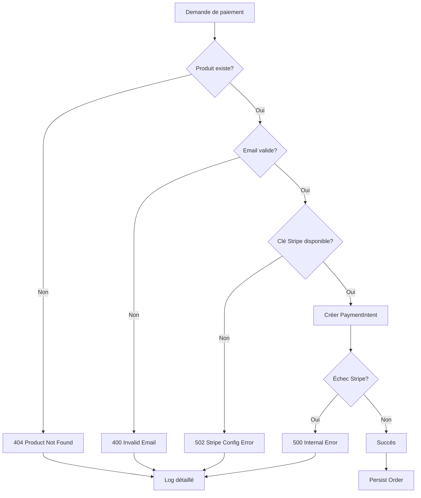

Maintenant, je vais générer la documentation complète sur la création d'intents de paiement Stripe dans le projet LumiraV1-MVP :

<docs>
# Création d'intents de paiement Stripe

<cite>
**Fichiers Référencés dans ce Document**
- [apps/api-backend/src/services/stripe.ts](file://apps/api-backend/src/services/stripe.ts)
- [apps/api-backend/src/types/payments.ts](file://apps/api-backend/src/types/payments.ts)
- [apps/api-backend/src/routes/products.ts](file://apps/api-backend/src/routes/products.ts)
- [apps/api-backend/src/routes/payments.ts](file://apps/api-backend/src/routes/payments.ts)
- [apps/api-backend/src/models/ProductOrder.ts](file://apps/api-backend/src/models/ProductOrder.ts)
- [apps/api-backend/src/catalog.ts](file://apps/api-backend/src/catalog.ts)
- [apps/main-app/src/services/productOrder.ts](file://apps/main-app/src/services/productOrder.ts)
- [apps/main-app/src/api/stripe.ts](file://apps/main-app/src/api/stripe.ts)
- [apps/main-app/src/pages/CommandeTemple.tsx](file://apps/main-app/src/pages/CommandeTemple.tsx)
- [apps/main-app/src/pages/CommandeTempleSPA.tsx](file://apps/main-app/src/pages/CommandeTempleSPA.tsx)
- [apps/main-app/src/types/products.ts](file://apps/main-app/src/types/products.ts)
- [test-payment-intent.js](file://test-payment-intent.js)
</cite>

## Table des Matières
1. [Introduction](#introduction)
2. [Architecture du Système de Paiement](#architecture-du-système-de-paiement)
3. [Flux de Création d'Intent de Paiement](#flux-de-création-dintent-de-paiement)
4. [Interfaces TypeScript](#interfaces-typescript)
5. [Services Backend](#services-backend)
6. [Services Frontend](#services-frontend)
7. [Validation et Gestion d'Erreurs](#validation-et-gestion-derreurs)
8. [Exemples Concrets](#exemples-concrets)
9. [Bonnes Pratiques](#bonnes-pratiques)
10. [Dépannage](#dépannage)

## Introduction

Le système de paiement de LumiraV1-MVP utilise Stripe pour gérer les transactions de produits. La création d'intents de paiement suit un flux complet depuis la demande frontend jusqu'à l'appel à l'API Stripe, incluant la validation des paramètres, la persistance des commandes, et la gestion des métadonnées pour le suivi et l'audit.

## Architecture du Système de Paiement

Le système de paiement est structuré en plusieurs couches :



**Sources du Diagramme**
- [apps/main-app/src/services/productOrder.ts](file://apps/main-app/src/services/productOrder.ts#L1-L105)
- [apps/api-backend/src/services/stripe.ts](file://apps/api-backend/src/services/stripe.ts#L1-L165)
- [apps/api-backend/src/routes/products.ts](file://apps/api-backend/src/routes/products.ts#L1-L200)

## Flux de Création d'Intent de Paiement

Le flux complet de création d'un intent de paiement suit cette séquence :



**Sources du Diagramme**
- [apps/main-app/src/services/productOrder.ts](file://apps/main-app/src/services/productOrder.ts#L10-L35)
- [apps/api-backend/src/routes/products.ts](file://apps/api-backend/src/routes/products.ts#L40-L150)
- [apps/api-backend/src/services/stripe.ts](file://apps/api-backend/src/services/stripe.ts#L35-L85)

**Sources de Section**
- [apps/main-app/src/services/productOrder.ts](file://apps/main-app/src/services/productOrder.ts#L10-L35)
- [apps/api-backend/src/routes/products.ts](file://apps/api-backend/src/routes/products.ts#L40-L150)
- [apps/api-backend/src/services/stripe.ts](file://apps/api-backend/src/services/stripe.ts#L35-L85)

## Interfaces TypeScript

### CreatePaymentIntentRequest

L'interface `CreatePaymentIntentRequest` définit la structure des données envoyées pour créer un intent de paiement :

```typescript
interface CreatePaymentIntentRequest {
  productId: string;           // Identifiant du produit à acheter
  customerEmail?: string;      // Email du client (optionnel)
  metadata?: Record<string, string>; // Métadonnées additionnelles
}
```

### CreatePaymentIntentResponse

La réponse contient toutes les informations nécessaires pour finaliser le paiement :

```typescript
interface CreatePaymentIntentResponse {
  clientSecret: string;        // Clé secrète pour Stripe Elements
  orderId: string;             // Identifiant de la commande Stripe
  amount: number;              // Montant en centimes
  currency: string;            // Devise (ex: 'eur')
  productName: string;         // Nom du produit acheté
}
```

### Order

L'interface `Order` représente une commande persistée en base de données :

```typescript
interface Order {
  id: string;                           // Identifiant unique
  productId: string;                    // Produit acheté
  customerId?: string;                  // Identifiant client
  customerEmail?: string;               // Email du client
  amount: number;                       // Montant en centimes
  currency: string;                     // Devise
  status: 'pending' | 'processing' | 'completed' | 'failed' | 'cancelled';
  paymentIntentId: string;              // Identifiant Stripe
  createdAt: Date;                      // Date de création
  updatedAt: Date;                      // Date de dernière mise à jour
  completedAt?: Date;                   // Date de completion
  metadata?: Record<string, any>;       // Métadonnées personnalisées
}
```

**Sources de Section**
- [apps/api-backend/src/types/payments.ts](file://apps/api-backend/src/types/payments.ts#L3-L57)
- [apps/api-backend/src/models/ProductOrder.ts](file://apps/api-backend/src/models/ProductOrder.ts#L5-L15)

## Services Backend

### StripeService

Le `StripeService` centralise toutes les opérations Stripe :



**Sources du Diagramme**
- [apps/api-backend/src/services/stripe.ts](file://apps/api-backend/src/services/stripe.ts#L25-L165)

#### Méthode createPaymentIntent

Cette méthode crée un intent de paiement avec les paramètres suivants :

```typescript
static async createPaymentIntent(request: CreatePaymentIntentRequest) {
  const { productId, customerEmail, metadata = {} } = request;
  
  // Validation du produit
  const product = getProductById(productId);
  if (!product) {
    throw new Error(`Invalid product ID: ${productId}`);
  }
  
  // Création de l'Intent avec configuration Stripe
  const paymentIntent = await getStripe().paymentIntents.create({
    amount: product.amountCents,
    currency: product.currency,
    automatic_payment_methods: { enabled: true },
    metadata: {
      productId,
      productName: product.name,
      level: product.level,
      customerEmail: customerEmail || '',
      ...metadata,
    },
    description: `Oracle Lumira - ${product.name}`,
    statement_descriptor: 'ORACLE LUMIRA',
  });
  
  return {
    clientSecret: paymentIntent.client_secret!,
    paymentIntentId: paymentIntent.id,
    amount: product.amountCents,
    currency: product.currency,
    productName: product.name,
  };
}
```

### Routes de Produits

Le routeur `/products` expose l'endpoint principal :

```typescript
router.post('/create-payment-intent', async (req: Request, res: Response) => {
  // Validation des paramètres
  const { productId, customerEmail, metadata = {} } = req.body;
  
  // Validation du produit
  const product = getProductById(productId);
  if (!product) {
    res.status(404).json({
      error: 'Product not found',
      code: 'PRODUCT_NOT_FOUND',
      message: `Product '${productId}' does not exist`,
    });
    return;
  }
  
  // Création de l'Intent Stripe
  const paymentData = await StripeService.createPaymentIntent({
    productId,
    customerEmail,
    metadata: {
      ...metadata,
      source: 'spa-checkout',
      timestamp: new Date().toISOString(),
      requestId,
    },
  });
  
  // Persistance en base de données
  await ProductOrder.create({
    productId,
    customerEmail,
    amount: paymentData.amount,
    currency: paymentData.currency,
    status: 'pending',
    paymentIntentId: paymentData.paymentIntentId,
    metadata: {
      productName: product.name,
      level: product.level,
      requestId,
    },
  });
});
```

**Sources de Section**
- [apps/api-backend/src/services/stripe.ts](file://apps/api-backend/src/services/stripe.ts#L35-L85)
- [apps/api-backend/src/routes/products.ts](file://apps/api-backend/src/routes/products.ts#L40-L150)

## Services Frontend

### ProductOrderService

Le service frontend orchestre les appels API pour la création d'intents de paiement :

```typescript
class ProductOrderService {
  static async createPaymentIntent(
    productId: string,
    customerEmail?: string
  ): Promise<CreatePaymentIntentResponse> {
    try {
      const response = await apiRequest<CreatePaymentIntentResponse>(
        '/products/create-payment-intent',
        {
          method: 'POST',
          body: JSON.stringify({
            productId,
            customerEmail,
            metadata: {
              source: 'spa-checkout',
              timestamp: new Date().toISOString(),
            },
          }),
        }
      );
      
      return response;
    } catch (error) {
      console.error('Failed to create payment intent:', error);
      throw new Error(
        error instanceof Error ? error.message : 'Failed to create payment intent'
      );
    }
  }
}
```

### StripeAPI

Le service `StripeAPI` fournit une interface TypeScript pour les appels Stripe :

```typescript
class StripeAPI {
  async createPaymentIntent(
    data: CreatePaymentIntentRequest
  ): Promise<CreatePaymentIntentResponse> {
    return this.request<CreatePaymentIntentResponse>(
      '/payments/create-payment-intent',
      {
        method: 'POST',
        body: JSON.stringify(data),
      }
    );
  }
}
```

**Sources de Section**
- [apps/main-app/src/services/productOrder.ts](file://apps/main-app/src/services/productOrder.ts#L10-L35)
- [apps/main-app/src/api/stripe.ts](file://apps/main-app/src/api/stripe.ts#L50-L70)

## Validation et Gestion d'Erreurs

### Validation côté Backend

Le système implémente une validation robuste avec des codes d'erreur spécifiques :



**Sources du Diagramme**
- [apps/api-backend/src/routes/products.ts](file://apps/api-backend/src/routes/products.ts#L60-L120)

### Codes d'Erreur Spécifiques

Le système retourne des codes d'erreur détaillés :

- `MISSING_PRODUCT_ID`: Produit manquant
- `PRODUCT_NOT_FOUND`: Produit inconnu
- `INVALID_EMAIL`: Format email invalide
- `STRIPE_CONFIG_ERROR`: Configuration Stripe manquante
- `PAYMENT_FAILED`: Échec de paiement Stripe

### Gestion des Métadonnées

Les métadonnées sont utilisées pour le suivi et l'audit :

```typescript
metadata: {
  productId,           // Identifiant du produit
  productName: product.name,     // Nom du produit
  level: product.level,          // Niveau d'accès
  customerEmail: customerEmail || '', // Email du client
  source: 'spa-checkout',        // Origine de la demande
  timestamp: new Date().toISOString(), // Horodatage
  requestId,                     // Identifiant unique
  ...customMetadata,            // Métadonnées personnalisées
}
```

**Sources de Section**
- [apps/api-backend/src/routes/products.ts](file://apps/api-backend/src/routes/products.ts#L60-L120)
- [apps/api-backend/src/services/stripe.ts](file://apps/api-backend/src/services/stripe.ts#L50-L70)

## Exemples Concrets

### Exemple de Requête HTTP

Voici un exemple de requête pour créer un intent de paiement :

```bash
curl -X POST https://api.oraclelumira.com/api/products/create-payment-intent \
  -H "Content-Type: application/json" \
  -H "Authorization: Bearer YOUR_TOKEN" \
  -d '{
    "productId": "mystique",
    "customerEmail": "client@example.com",
    "metadata": {
      "source": "spa-checkout",
      "campaign": "summer-sale"
    }
  }'
```

### Exemple de Réponse

```json
{
  "clientSecret": "pi_12345_secret_67890",
  "orderId": "pi_12345",
  "amount": 4700,
  "currency": "eur",
  "productName": "Niveau Mystique"
}
```

### Exemple de Code Frontend

```typescript
// Initialisation du paiement
const initializePayment = async () => {
  try {
    const paymentData = await stripeAPI.createPaymentIntent({
      productId: 'mystique',
      customerEmail: 'client@example.com',
      customerName: 'Jean Dupont',
    });
    
    // Utilisation du clientSecret avec Stripe Elements
    const stripe = await loadStripe(STRIPE_PUBLIC_KEY);
    const elements = stripe.elements();
    
    // Affichage du formulaire de paiement
    const paymentElement = elements.create('payment');
    paymentElement.mount('#payment-element');
    
  } catch (error) {
    console.error('Erreur d\'initialisation:', error);
  }
};
```

### Exemple de Configuration Stripe

```typescript
const stripeOptions: StripeElementsOptions = {
  clientSecret: clientSecret!,
  appearance: {
    theme: 'night',
    variables: {
      colorPrimary: '#D4AF37',
      colorBackground: '#0F0B19',
      borderRadius: '12px',
    },
  },
};
```

**Sources de Section**
- [test-payment-intent.js](file://test-payment-intent.js#L1-L30)
- [apps/main-app/src/pages/CommandeTempleSPA.tsx](file://apps/main-app/src/pages/CommandeTempleSPA.tsx#L1-L100)

## Bonnes Pratiques

### Configuration Stripe

1. **Automatic Payment Methods** : Toujours activer `automatic_payment_methods.enabled: true`
2. **Descriptif de Facturation** : Utiliser `statement_descriptor: 'ORACLE LUMIRA'`
3. **Métadonnées** : Inclure toujours des métadonnées pour le suivi
4. **Idempotence** : Utiliser des clés d'idempotence uniques

### Gestion des Erreurs

1. **Logging Détaillé** : Logger tous les échecs avec contexte
2. **Codes d'Erreur Spécifiques** : Retourner des codes d'erreur appropriés
3. **Validation Frontend** : Valider les données côté client
4. **Fallbacks** : Implémenter des mécanismes de récupération

### Sécurité

1. **Validation des Emails** : Vérifier le format des emails
2. **Validation des Produits** : S'assurer que les produits existent
3. **Protection CSRF** : Utiliser des tokens CSRF
4. **HTTPS** : Toujours utiliser HTTPS en production

### Performance

1. **Lazy Loading** : Charger Stripe dynamiquement
2. **Caching** : Mettre en cache les produits
3. **Optimisation des Requêtes** : Minimiser les appels API
4. **Monitoring** : Surveiller les performances

## Dépannage

### Problèmes Courants

#### 1. Produit Invalide

**Symptôme** : Erreur 404 "Product not found"

**Solution** :
```typescript
// Vérifier que le produit existe dans le catalogue
const product = getProductById(productId);
if (!product) {
  console.error(`Produit introuvable: ${productId}`);
  // Vérifier PRODUCT_CATALOG dans catalog.ts
}
```

#### 2. Échec de Connexion Stripe

**Symptôme** : Erreur 502 "Stripe Config Error"

**Solution** :
```bash
# Vérifier les variables d'environnement
echo $STRIPE_SECRET_KEY
echo $STRIPE_WEBHOOK_SECRET

# Tester la connexion Stripe
node -e "require('stripe')(process.env.STRIPE_SECRET_KEY)"
```

#### 3. Format d'Email Incorrect

**Symptôme** : Erreur 400 "Invalid email format"

**Solution** :
```typescript
// Valider l'email côté client
const validateEmail = (email: string): boolean => {
  const emailRegex = /^[^\s@]+@[^\s@]+\.[^\s@]+$/;
  return emailRegex.test(email);
};
```

#### 4. Métadonnées Manquantes

**Symptôme** : Logs d'erreur concernant les métadonnées

**Solution** :
```typescript
// Assurer que les métadonnées sont bien fournies
const metadata = {
  source: 'spa-checkout',
  timestamp: new Date().toISOString(),
  requestId: generateRequestId(),
  ...providedMetadata,
};
```

### Debugging

#### Activer le Mode Debug

```typescript
const DEBUG = import.meta.env.DEV ||