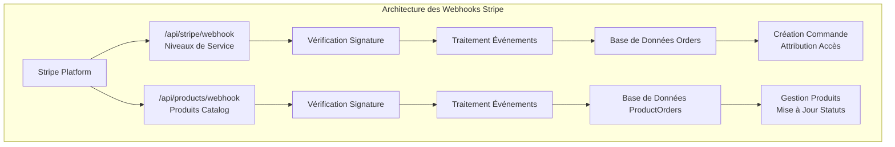
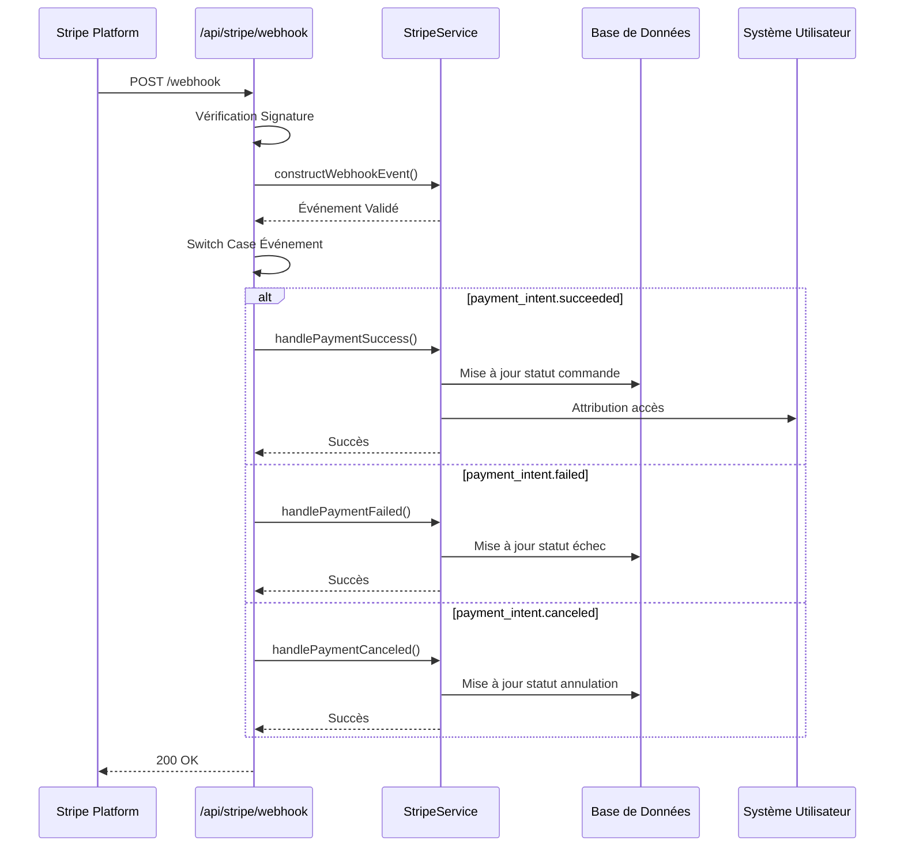

Maintenant, je vais créer la documentation complète sur la gestion des webhooks Stripe dans LumiraV1-MVP.

<docs>
# Gestion des webhooks Stripe

<cite>
**Fichiers Référencés dans ce Document**
- [apps/api-backend/src/routes/stripe.ts](file://apps/api-backend/src/routes/stripe.ts)
- [apps/api-backend/src/services/stripe.ts](file://apps/api-backend/src/services/stripe.ts)
- [apps/api-backend/src/routes/products.ts](file://apps/api-backend/src/routes/products.ts)
- [apps/api-backend/src/models/Order.ts](file://apps/api-backend/src/models/Order.ts)
- [apps/api-backend/src/models/ProductOrder.ts](file://apps/api-backend/src/models/ProductOrder.ts)
- [apps/api-backend/src/types/payments.ts](file://apps/api-backend/src/types/payments.ts)
- [PAYMENT-SYSTEM-GUIDE.md](file://PAYMENT-SYSTEM-GUIDE.md)
- [apps/api-backend/src/catalog.ts](file://apps/api-backend/src/catalog.ts)
</cite>

## Table des Matières
1. [Introduction](#introduction)
2. [Architecture du Système de Webhooks](#architecture-du-système-de-webhooks)
3. [Endpoint Principal : `/api/stripe/webhook`](#endpoint-principal--apistripewebhook)
4. [Vérification de Signature](#vérification-de-signature)
5. [Traitement des Événements](#traitement-des-événements)
6. [Structure des Charges Utiles](#structure-des-charges-utiles)
7. [Mesures de Sécurité](#mesures-de-sécurité)
8. [Gestion des Erreurs](#gestion-des-erreurs)
9. [Exemples Pratiques](#exemples-pratiques)
10. [Guide de Dépannage](#guide-de-dépannage)
11. [Conclusion](#conclusion)

## Introduction

Le système de webhooks Stripe dans LumiraV1-MVP constitue le cœur de la gestion des paiements sécurisés et automatique. Ce système permet de traiter en temps réel les événements de paiement provenant de Stripe, garantissant une intégration robuste entre le système de paiement et la base de données de commandes.

Le système implémente plusieurs endpoints dédiés à différents types de produits et niveaux de service, chacun avec ses propres configurations de webhooks et logiques de traitement spécifiques. Cette approche modulaire permet une gestion fine des différents types de transactions tout en maintenant une sécurité élevée et une traçabilité complète.

## Architecture du Système de Webhooks

Le système de webhooks Stripe est structuré autour de deux endpoints principaux qui gèrent différents types de produits :



**Sources du Diagramme**
- [apps/api-backend/src/routes/stripe.ts](file://apps/api-backend/src/routes/stripe.ts#L100-L167)
- [apps/api-backend/src/routes/products.ts](file://apps/api-backend/src/routes/products.ts#L370-L450)

**Sources de Section**
- [apps/api-backend/src/routes/stripe.ts](file://apps/api-backend/src/routes/stripe.ts#L1-L242)
- [apps/api-backend/src/routes/products.ts](file://apps/api-backend/src/routes/products.ts#L370-L450)

## Endpoint Principal : `/api/stripe/webhook`

L'endpoint `/api/stripe/webhook` est conçu pour gérer les niveaux de service Oracle Lumira (Simple, Intuitive, Alchimique, Intégrale). Il utilise une approche basée sur les PaymentIntents pour traiter les paiements.

### Configuration de l'Endpoint

```typescript
router.post('/webhook', express.raw({ type: 'application/json' }), async (req: any, res: any) => {
  const sig = req.headers['stripe-signature'];
  const webhookSecret = process.env.STRIPE_WEBHOOK_SECRET;
  
  if (!webhookSecret) {
    console.error('Stripe webhook secret not configured');
    return res.status(400).json({ error: 'Webhook secret not configured' });
  }
  
  let event;
  
  try {
    event = stripe.webhooks.constructEvent(req.body, sig, webhookSecret);
  } catch (err: any) {
    console.error('Webhook signature verification failed:', err.message);
    return res.status(400).json({ error: 'Webhook signature verification failed' });
  }
});
```

### Flux de Traitement des Événements



**Sources du Diagramme**
- [apps/api-backend/src/routes/stripe.ts](file://apps/api-backend/src/routes/stripe.ts#L100-L167)
- [apps/api-backend/src/services/stripe.ts](file://apps/api-backend/src/services/stripe.ts#L82-L128)

**Sources de Section**
- [apps/api-backend/src/routes/stripe.ts](file://apps