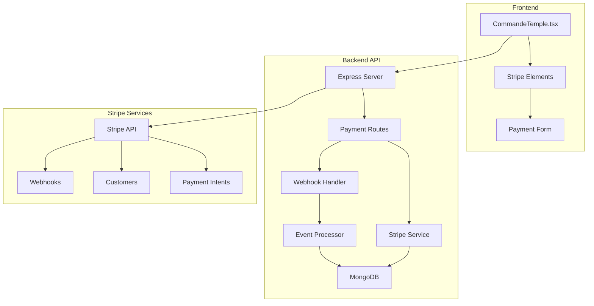
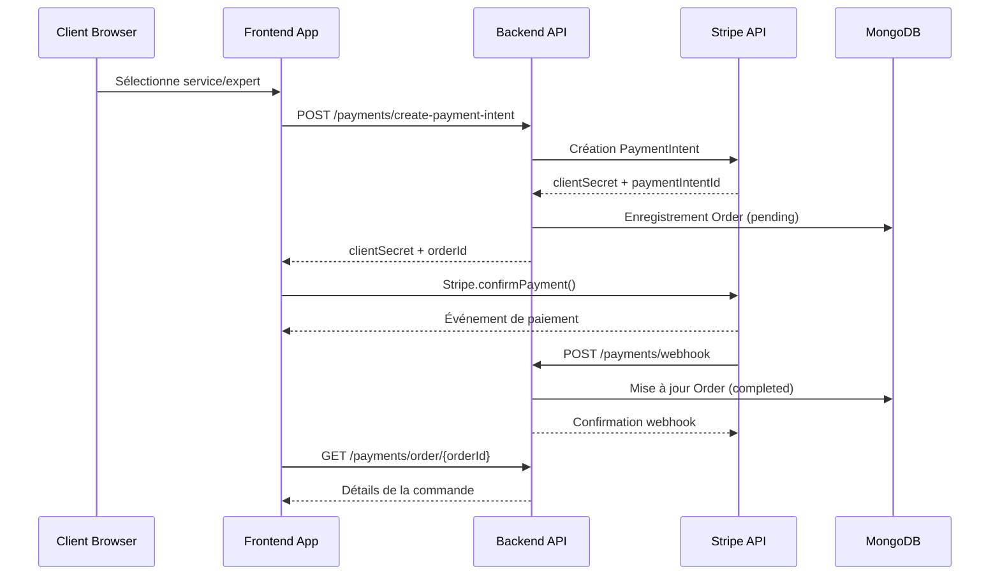
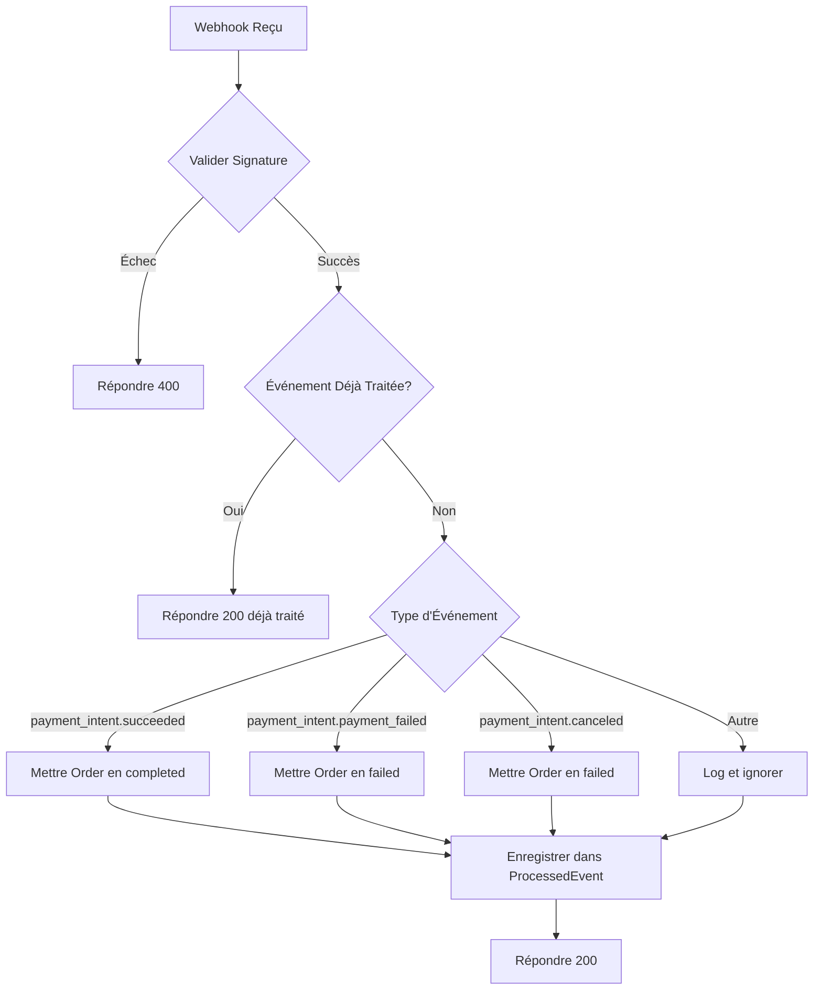
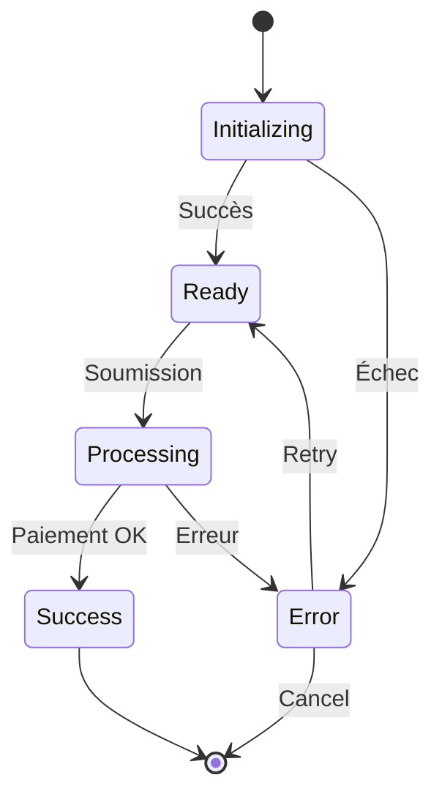

# Intégration des Paiements Stripe

<cite>
**Fichiers Référencés dans ce Document**
- [PAYMENT-SYSTEM-GUIDE.md](file://PAYMENT-SYSTEM-GUIDE.md)
- [apps/api-backend/src/routes/payments.ts](file://apps/api-backend/src/routes/payments.ts)
- [apps/api-backend/src/services/stripe.ts](file://apps/api-backend/src/services/stripe.ts)
- [apps/api-backend/src/types/payments.ts](file://apps/api-backend/src/types/payments.ts)
- [apps/api-backend/src/models/Order.ts](file://apps/api-backend/src/models/Order.ts)
- [apps/api-backend/src/catalog.ts](file://apps/api-backend/src/catalog.ts)
- [apps/main-app/src/api/stripe.ts](file://apps/main-app/src/api/stripe.ts)
- [apps/main-app/src/pages/CommandeTemple.tsx](file://apps/main-app/src/pages/CommandeTemple.tsx)
- [apps/api-backend/src/routes/stripe.ts](file://apps/api-backend/src/routes/stripe.ts)
</cite>

## Table des Matières
1. [Introduction](#introduction)
2. [Architecture du Système de Paiement](#architecture-du-système-de-paiement)
3. [Endpoints API](#endpoints-api)
4. [Flux de Paiement](#flux-de-paiement)
5. [Gestion des Webhooks](#gestion-des-webhooks)
6. [Modèles de Données](#modèles-de-données)
7. [Types et Interfaces](#types-et-interfaces)
8. [Implémentation Frontend](#implémentation-frontend)
9. [Sécurité et Validation](#sécurité-et-validation)
10. [Gestion des Erreurs](#gestion-des-erreurs)
11. [Bonnes Pratiques](#bonnes-pratiques)
12. [Dépannage](#dépannage)

## Introduction

Le système de paiement Stripe de Lumira Oracle constitue une solution complète et sécurisée pour traiter les transactions financières au sein de la plateforme. Ce système intègre Stripe Elements pour l'interface utilisateur, un backend Express.js pour la logique métier, et une base de données MongoDB pour le stockage persistant des données de paiement.

Le système offre plusieurs niveaux de service avec des tarifs dynamiques, une gestion complète des états de paiement, et une synchronisation automatique des événements via les webhooks Stripe. Il supporte également les paiements récurrents, les remboursements partiels, et fournit une interface utilisateur moderne pour les clients.

## Architecture du Système de Paiement

Le système de paiement suit une architecture modulaire avec séparation claire des responsabilités entre le frontend, le backend, et les services tiers.



**Sources du Diagramme**
- [apps/main-app/src/pages/CommandeTemple.tsx](file://apps/main-app/src/pages/CommandeTemple.tsx#L1-L50)
- [apps/api-backend/src/routes/payments.ts](file://apps/api-backend/src/routes/payments.ts#L1-L30)
- [apps/api-backend/src/services/stripe.ts](file://apps/api-backend/src/services/stripe.ts#L1-L20)

**Sources de Section**
- [PAYMENT-SYSTEM-GUIDE.md](file://PAYMENT-SYSTEM-GUIDE.md#L1-L50)
- [apps/api-backend/src/routes/payments.ts](file://apps/api-backend/src/routes/payments.ts#L1-L20)

## Endpoints API

### Création d'Intent de Paiement

**Endpoint**: `POST /api/payments/create-payment-intent`

Crée un nouvel intent de paiement Stripe avec métadonnées personnalisées.

```typescript
interface CreatePaymentIntentRequest {
  expertId: string;
  amount: number;
  description?: string;
  metadata?: Record<string, string>;
}

interface CreatePaymentIntentResponse {
  clientSecret: string;
  orderId: string;
  amount: number;
  expertName: string;
}
```

**Exemple de Requête**:
```json
{
  "expertId": "674123456789abcdef012345",
  "amount": 7900,
  "description": "Consultation Premium avec Expert Test",
  "metadata": {
    "level": "premium",
    "service": "premium"
  }
}
```

**Exemple de Réponse**:
```json
{
  "clientSecret": "pi_1234567890_secret_abc123",
  "orderId": "674123456789abcdef012345",
  "amount": 7900,
  "expertName": "Expert Test"
}
```

### Confirmation de Paiement

**Endpoint**: `POST /api/payments/confirm-payment`

Confirme un paiement en utilisant l'ID de l'intent de paiement.

```typescript
interface ConfirmPaymentRequest {
  paymentIntentId: string;
}

interface ConfirmPaymentResponse {
  success: boolean;
  order?: {
    id: string;
    status: string;
    paymentStatus: string;
    amount: number;
    service: string;
  };
}
```

### Webhook Stripe

**Endpoint**: `POST /api/payments/webhook`

Reçoit et traite les événements Stripe via les webhooks.

```typescript
interface StripeWebhookPayload {
  id: string;
  type: string;
  data: {
    object: any;
  };
  created: number;
}
```

**Sources de Section**
- [apps/api-backend/src/routes/payments.ts](file://apps/api-backend/src/routes/payments.ts#L15-L80)
- [apps/api-backend/src/types/payments.ts](file://apps/api-backend/src/types/payments.ts#L1-L30)

## Flux de Paiement

Le système de paiement suit un flux complet depuis la création de l'intent jusqu'à la confirmation finale.



**Sources du Diagramme**
- [apps/main-app/src/pages/CommandeTemple.tsx](file://apps/main-app/src/pages/CommandeTemple.tsx#L100-L150)
- [apps/api-backend/src/routes/payments.ts](file://apps/api-backend/src/routes/payments.ts#L15-L60)

### Étapes Détaillées

1. **Initialisation du Paiement**:
   - Le frontend appelle l'API pour créer un intent de paiement
   - Un objet Order est créé en statut "pending" avec l'ID de l'expert
   - L'ID de l'intent de paiement est stocké dans l'objet Order

2. **Interface de Paiement**:
   - Stripe Elements affiche le formulaire de paiement
   - Les informations de paiement sont envoyées directement à Stripe
   - Stripe retourne un résultat immédiat

3. **Validation et Confirmation**:
   - Si le webhook échoue, le frontend peut confirmer manuellement
   - La confirmation vérifie l'état actuel de l'intent de paiement
   - L'ordre est mis à jour selon le résultat

4. **Synchronisation Webhook**:
   - Stripe envoie des événements via webhooks
   - Le backend valide la signature du webhook
   - Les événements sont traités et l'état de l'ordre est mis à jour

**Sources de Section**
- [apps/main-app/src/pages/CommandeTemple.tsx](file://apps/main-app/src/pages/CommandeTemple.tsx#L50-L100)
- [apps/api-backend/src/routes/payments.ts](file://apps/api-backend/src/routes/payments.ts#L60-L120)

## Gestion des Webhooks

Le système implémente une gestion robuste des webhooks Stripe avec validation de signature et prévention de doublons.

### Types d'Événements Supportés



**Sources du Diagramme**
- [apps/api-backend/src/routes/payments.ts](file://apps/api-backend/src/routes/payments.ts#L120-L170)

### Implémentation du Webhook

```typescript
// Validation de signature
const sig = req.headers['stripe-signature'] as string;
const event = getStripe().webhooks.constructEvent(
  req.body, 
  sig, 
  process.env.STRIPE_WEBHOOK_SECRET!
);

// Prévention de doublons
if (processedEvents.has(event.id)) {
  return res.json({ received: true, duplicate: true });
}
processedEvents.add(event.id);

// Traitement des événements
switch (event.type) {
  case 'payment_intent.succeeded':
    // Mettre à jour l'état de l'ordre
    break;
  case 'payment_intent.payment_failed':
    // Marquer l'ordre comme échoué
    break;
  case 'payment_intent.canceled':
    // Traiter l'annulation
    break;
}
```

**Sources de Section**
- [apps/api-backend/src/routes/payments.ts](file://apps/api-backend/src/routes/payments.ts#L120-L170)

## Modèles de Données

### Modèle Order

Le modèle Order centralise toutes les informations relatives aux paiements et aux commandes.

```typescript
interface IOrder extends Document {
  _id: mongoose.Types.ObjectId;
  orderNumber: string;
  userId: mongoose.Types.ObjectId;
  userEmail: string;
  userName?: string;
  level: 1 | 2 | 3 | 4;
  levelName: 'Simple' | 'Intuitive' | 'Alchimique' | 'Intégrale';
  amount: number; // en centimes
  currency: string;
  status: 'pending' | 'paid' | 'processing' | 'awaiting_validation' | 'completed' | 'failed' | 'refunded';
  paymentIntentId?: string;
  stripeSessionId?: string;
  service?: string;
  duration?: number;
  expertId?: string;
  paidAt?: Date;
  formData: {
    firstName: string;
    lastName: string;
    email: string;
    phone?: string;
    dateOfBirth?: Date;
    specificQuestion?: string;
    preferences?: {
      audioVoice?: 'masculine' | 'feminine';
      deliveryFormat?: 'email' | 'whatsapp';
    };
  };
  files?: [{
    filename: string;
    originalName: string;
    path: string;
    mimetype: string;
    size: number;
    uploadedAt: Date;
  }];
  clientInputs?: {
    birthTime?: string;
    birthPlace?: string;
    specificContext?: string;
    lifeQuestion?: string;
  };
  expertReview?: {
    expertId?: string;
    expertName?: string;
    assignedAt?: Date;
    status: 'pending' | 'approved' | 'rejected' | 'revision_needed';
    notes?: string;
    reviewedAt?: Date;
  };
  expertValidation?: {
    validatorId?: string;
    validatorName?: string;
    validationStatus: 'pending' | 'approved' | 'rejected';
    validationNotes?: string;
    validatedAt?: Date;
    rejectionReason?: string;
  };
  createdAt: Date;
  updatedAt: Date;
}
```

### Modèle ProcessedEvent

Pour la prévention de doublons des webhooks :

```typescript
interface IProcessedEvent extends Document {
  eventId: string;
  eventType: string;
  processed: boolean;
  processedAt: Date;
}
```

**Sources de Section**
- [apps/api-backend/src/models/Order.ts](file://apps/api-backend/src/models/Order.ts#L1-L100)
- [apps/api-backend/src/models/ProcessedEvent.ts](file://apps/api-backend/src/models/ProcessedEvent.ts#L1-L30)

## Types et Interfaces

### Types Principaux

```typescript
// Requête de création d'intent de paiement
interface CreatePaymentIntentRequest {
  productId: string;
  customerEmail?: string;
  metadata?: Record<string, string>;
}

// Réponse de création d'intent de paiement
interface CreatePaymentIntentResponse {
  clientSecret: string;
  orderId: string;
  amount: number;
  currency: string;
  productName: string;
}

// Modèle d'ordre
interface Order {
  id: string;
  productId: string;
  customerId?: string;
  customerEmail?: string;
  amount: number;
  currency: string;
  status: 'pending' | 'processing' | 'completed' | 'failed' | 'cancelled';
  paymentIntentId: string;
  createdAt: Date;
  updatedAt: Date;
  completedAt?: Date;
  metadata?: Record<string, any>;
}
```

### Configuration des Niveaux de Service

```typescript
const SERVICE_PRICING = {
  basic: {
    name: 'Consultation Basique',
    price: 2900,    // 29.00 EUR en centimes
    duration: 30,   // minutes
  },
  premium: {
    name: 'Consultation Premium', 
    price: 7900,    // 79.00 EUR en centimes
    duration: 60,   // minutes
  },
  vip: {
    name: 'Consultation VIP',
    price: 14900,   // 149.00 EUR en centimes
    duration: 120,  // minutes
  }
}
```

**Sources de Section**
- [apps/api-backend/src/types/payments.ts](file://apps/api-backend/src/types/payments.ts#L1-L58)
- [apps/api-backend/src/catalog.ts](file://apps/api-backend/src/catalog.ts#L1-L50)

## Implémentation Frontend

### Interface de Paiement

Le frontend utilise Stripe Elements pour une interface utilisateur moderne et sécurisée.

```typescript
// Initialisation Stripe
const stripeKey = validateStripeKey();
stripePromise = loadStripe(stripeKey);

// Composant CheckoutForm
const CheckoutForm: React.FC<CheckoutFormProps> = ({ orderId, amount, onSuccess }) => {
  const stripe = useStripe();
  const elements = useElements();
  
  const handleSubmit = async (e: React.FormEvent) => {
    e.preventDefault();
    if (!stripe || !elements) return;
    
    const returnUrl = `${window.location.origin}/confirmation?order_id=${orderId}`;
    const { error } = await stripe.confirmPayment({
      elements,
      confirmParams: { return_url: returnUrl },
      redirect: 'if_required',
    });
    
    if (error) {
      setErrorMessage(error.message || 'Erreur lors du paiement');
    } else {
      onSuccess();
    }
  };
};
```

### Gestion des États



**Sources du Diagramme**
- [apps/main-app/src/pages/CommandeTemple.tsx](file://apps/main-app/src/pages/CommandeTemple.tsx#L150-L200)

### API Client

```typescript
class StripeAPI {
  async createPaymentIntent(data: CreatePaymentIntentRequest): Promise<CreatePaymentIntentResponse> {
    return this.request<CreatePaymentIntentResponse>('/payments/create-payment-intent', {
      method: 'POST',
      body: JSON.stringify(data),
    });
  }

  async confirmPayment(data: ConfirmPaymentRequest): Promise<ConfirmPaymentResponse> {
    return this.request<ConfirmPaymentResponse>('/payments/confirm-payment', {
      method: 'POST',
      body: JSON.stringify(data),
    });
  }

  async getOrder(orderId: string): Promise<OrderResponse> {
    return this.request<OrderResponse>(`/payments/order/${orderId}`);
  }
}
```

**Sources de Section**
- [apps/main-app/src/pages/CommandeTemple.tsx](file://apps/main-app/src/pages/CommandeTemple.tsx#L1-L100)
- [apps/main-app/src/api/stripe.ts](file://apps/main-app/src/api/stripe.ts#L1-L50)

## Sécurité et Validation

### Validation des Webhooks

```typescript
// Vérification de signature Stripe
try {
  event = getStripe().webhooks.constructEvent(
    req.body, 
    sig, 
    process.env.STRIPE_WEBHOOK_SECRET!
  );
} catch (err) {
  return res.status(400).send(`Webhook signature verification failed.`);
}
```

### Prévention de Doublons

```typescript
// Ensemble de vérification des événements traités
const processedEvents = new Set<string>();

// Vérification avant traitement
if (processedEvents.has(event.id)) {
  return res.json({ received: true, duplicate: true });
}
processedEvents.add(event.id);
```

### Validation des Requêtes

```typescript
// Validation côté serveur
if (!expertId || !amount) {
  return res.status(400).json({ error: 'Expert ID and amount are required' });
}

// Validation côté client
const isValidService = (service: string): service is 'basic' | 'premium' | 'vip' => {
  return ['basic', 'premium', 'vip'].includes(service);
};
```

### Gestion des Erreurs Réseau

```typescript
// Retry automatique pour les erreurs temporaires
const MAX_RETRIES = 3;
let retries = 0;

while (retries < MAX_RETRIES) {
  try {
    const result = await stripe.paymentIntents.create(paymentData);
    break;
  } catch (error) {
    if (error.type === 'StripeConnectionError') {
      retries++;
      await new Promise(resolve => setTimeout(resolve, 1000 * retries));
    } else {
      throw error;
    }
  }
}
```

**Sources de Section**
- [apps/api-backend/src/routes/payments.ts](file://apps/api-backend/src/routes/payments.ts#L120-L140)
- [apps/main-app/src/pages/CommandeTemple.tsx](file://apps/main-app/src/pages/CommandeTemple.tsx#L50-L80)

## Gestion des Erreurs

### Types d'Erreurs Courantes

```mermaid
flowchart TD
A[Paiement Reçu] --> B{Type d'Erreur}
B --> |Fonds Insuffisants| C[card_declined]
B --> |Carte Expirée| D[expired_card]
B --> |Erreur de Carte| E[incorrect_number]
B --> |Problème Stripe| F[Stripe API Error]
B --> |Timeout| G[Network Timeout]
C --> H[Message Utilisateur: "Carte refusée"]
D --> I[Message Utilisateur: "Carte expirée"]
E --> J[Message Utilisateur: "Numéro de carte incorrect"]
F --> K[Log détaillé + Notification]
G --> L[Retry automatique + Message]
H --> M[Mise à jour Order en failed]
I --> M
J --> M
K --> N[Notification support]
L --> O[Message client]
```

### Gestion des Erreurs Spécifiques

```typescript
// Erreurs Stripe courantes
const stripeErrorHandlers = {
  'card_declined': 'Votre carte a été refusée. Veuillez vérifier les informations ou utiliser une autre carte.',
  'expired_card': 'La carte que vous avez utilisée a expiré. Veuillez mettre à jour vos informations de paiement.',
  'incorrect_number': 'Le numéro de carte que vous avez saisi est incorrect. Veuillez vérifier et réessayer.',
  'insufficient_funds': 'Fonds insuffisants sur votre compte. Veuillez vérifier votre solde.',
  'payment_method': 'Impossible de traiter le paiement avec cette méthode. Veuillez essayer une autre carte.'
};

// Gestion d'erreur côté serveur
try {
  const paymentIntent = await stripe.paymentIntents.create(paymentData);
} catch (error) {
  if (error.type === 'StripeCardError') {
    return res.status(400).json({
      error: 'payment_error',
      message: stripeErrorHandlers[error.code] || 'Erreur de paiement',
      errorCode: error.code
    });
  }
  throw error;
}
```

### Logs et Surveillance

```typescript
// Logging détaillé des erreurs
console.error('Payment error:', {
  error: {
    name: error.name,
    message: error.message,
    code: error.code,
    type: error.type
  },
  context: {
    orderId: order?.id,
    userId: user?.id,
    timestamp: new Date().toISOString()
  }
});
```

**Sources de Section**
- [apps/api-backend/src/routes/payments.ts](file://apps/api-backend/src/routes/payments.ts#L150-L200)

## Bonnes Pratiques

### Configuration de l'Environnement

```bash
# Variables d'environnement requises
STRIPE_SECRET_KEY=sk_test_your_stripe_secret_key_here
STRIPE_WEBHOOK_SECRET=whsec_your_webhook_secret_here
STRIPE_PUBLISHABLE_KEY= pk_test_your_publishable_key_here

# Configuration MongoDB
MONGODB_URI=mongodb://localhost:27017/lumira-mvp

# Configuration serveur
PORT=3001
NODE_ENV=production
```

### Optimisations de Performance

```typescript
// Cache des intents de paiement récents
const paymentIntentCache = new Map();

// Idempotence pour éviter les doublons
const buildStripeOptions = (req: any) => {
  const requestId = req.headers['x-request-id'] || req.ip + Date.now();
  return {
    idempotencyKey: `oracle-lumira-${requestId}`
  };
};
```

### Monitoring et Métriques

```typescript
// Métriques de paiement
const paymentMetrics = {
  successRate: 0,
  averageAmount: 0,
  failureRate: 0,
  topFailures: []
};

// Logs de performance
console.log('Payment intent created:', {
  duration: Date.now() - startTime,
  intentId: paymentIntent.id,
  userId: user.id
});
```

### Sécurité des Données

```typescript
// Chiffrement des données sensibles
const encryptPaymentData = (data: any) => {
  return crypto.createCipher('aes-256-cbc', process.env.ENCRYPTION_KEY!)
    .update(JSON.stringify(data))
    .toString('hex');
};

// Validation des métadonnées
const validateMetadata = (metadata: any) => {
  const allowedKeys = ['orderId', 'userId', 'level', 'service'];
  return Object.keys(metadata).every(key => allowedKeys.includes(key));
};
```

**Sources de Section**
- [PAYMENT-SYSTEM-GUIDE.md](file://PAYMENT-SYSTEM-GUIDE.md#L100-L150)
- [apps/api-backend/src/services/stripe.ts](file://apps/api-backend/src/services/stripe.ts#L20-L40)

## Dépannage

### Problèmes Courants

#### 1. Erreur de Signature Webhook

**Symptôme**: `Webhook signature verification failed`

**Cause**: Clé secrète du webhook Stripe incorrecte ou mal configurée

**Solution**:
```bash
# Vérifier la configuration
echo $STRIPE_WEBHOOK_SECRET

# Redéfinir la clé secrète
stripe listen --forward-to=localhost:3001/api/payments/webhook
```

#### 2. Échec de Création d'Intent de Paiement

**Symptôme**: `Failed to create payment intent`

**Causes possibles**:
- Clé API Stripe invalide
- Paramètres de requête incorrects
- Erreur de connexion réseau

**Solution**:
```typescript
// Vérification de la clé API
if (!process.env.STRIPE_SECRET_KEY) {
  throw new Error('STRIPE_SECRET_KEY environment variable is required');
}

// Validation des paramètres
const { expertId, amount } = req.body;
if (!expertId || !amount) {
  return res.status(400).json({ error: 'Missing required parameters' });
}
```

#### 3. Webhook Non Reçu

**Symptôme**: Événements Stripe ne sont pas traités

**Diagnostic**:
```bash
# Tester le webhook
stripe trigger payment_intent.succeeded

# Vérifier les logs
docker logs lumira-api-backend
```

**Sources de Section**
- [PAYMENT-SYSTEM-GUIDE.md](file://PAYMENT-SYSTEM-GUIDE.md#L200-L250)

### Tests de Paiement

#### Cartes de Test Stripe

```typescript
// Cartes de succès
const successCards = [
  '4242424242424242', // Carte réussie
  '4000000000000002', // Carte refusée intentionnellement
  '4000002760003184'  // Carte nécessitant 3D Secure
];

// Cartes de test
const testCards = {
  success: '4242424242424242',
  decline: '4000000000000002',
  expired: '4000000000000069',
  incorrect: '4000000000000001'
};
```

#### Flux de Test Automatisé

```typescript
// Script de test complet
const testPaymentFlow = async () => {
  try {
    // 1. Création d'intent de paiement
    const paymentIntent = await createPaymentIntent({
      expertId: 'test-expert-id',
      amount: 7900
    });
    
    // 2. Simulation de paiement réussi
    await simulateSuccessfulPayment(paymentIntent.clientSecret);
    
    // 3. Vérification du webhook
    const webhookReceived = await waitForWebhook();
    
    // 4. Vérification de l'état de l'ordre
    const order = await getOrder(paymentIntent.orderId);
    
    assert.equal(order.status, 'completed');
    assert.equal(order.paymentStatus, 'succeeded');
    
  } catch (error) {
    console.error('Test failed:', error);
  }
};
```

### Monitoring et Alertes

```typescript
// Configuration des alertes
const configureAlerts = () => {
  // Alertes sur taux d'échec élevé
  if (failureRate > 0.1) {
    sendAlert('High payment failure rate detected');
  }
  
  // Alertes sur anomalies de montant
  if (averageAmount > MAX_AMOUNT_THRESHOLD) {
    sendAlert('Unusual payment amount detected');
  }
};
```

**Sources de Section**
- [PAYMENT-SYSTEM-GUIDE.md](file://PAYMENT-SYSTEM-GUIDE.md#L250-L300)

## Conclusion

Le système de paiement Stripe de Lumira Oracle représente une solution robuste et sécurisée pour traiter les transactions financières. Avec son architecture modulaire, ses mécanismes de validation stricts, et sa gestion complète des états de paiement, il offre une expérience utilisateur fluide tout en maintenant la sécurité des données financières.

Les points forts incluent :
- Intégration native de Stripe Elements pour une interface utilisateur moderne
- Gestion complète des webhooks avec validation de signature
- Modèle de données flexible pour supporter différents types de services
- Mécanismes de retry et de récupération en cas d'erreur
- Logging détaillé et monitoring intégré

Cette implémentation constitue une base solide pour l'évolution future du système de paiement, permettant facilement l'ajout de nouveaux services, de nouvelles méthodes de paiement, et d'intégrations tierces.
