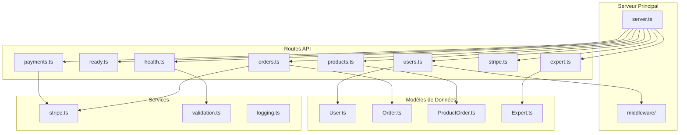

Maintenant, je vais créer la documentation complète des routes API en français.

<docs>
# Documentation des Routes API Backend

<cite>
**Fichiers Référencés dans ce Document**
- [health.ts](file://apps/api-backend/src/routes/health.ts)
- [ready.ts](file://apps/api-backend/src/routes/ready.ts)
- [users.ts](file://apps/api-backend/src/routes/users.ts)
- [products.ts](file://apps/api-backend/src/routes/products.ts)
- [orders.ts](file://apps/api-backend/src/routes/orders.ts)
- [payments.ts](file://apps/api-backend/src/routes/payments.ts)
- [stripe.ts](file://apps/api-backend/src/routes/stripe.ts)
- [expert.ts](file://apps/api-backend/src/routes/expert.ts)
- [auth.ts](file://apps/api-backend/src/middleware/auth.ts)
- [server.ts](file://apps/api-backend/src/server.ts)
- [User.ts](file://apps/api-backend/src/models/User.ts)
- [Order.ts](file://apps/api-backend/src/models/Order.ts)
- [payments.ts](file://apps/api-backend/src/types/payments.ts)
</cite>

## Table des Matières
1. [Introduction](#introduction)
2. [Structure du Projet](#structure-du-projet)
3. [Endpoints de Surveillance](#endpoints-de-surveillance)
4. [Endpoints de Gestion des Utilisateurs](#endpoints-de-gestion-des-utilisateurs)
5. [Endpoints de Catalogue de Produits](#endpoints-de-catalogue-de-produits)
6. [Endpoints de Gestion des Commandes](#endpoints-de-gestion-des-commandes)
7. [Endpoints de Paiements](#endpoints-de-paiements)
8. [Endpoints d'Intégration Stripe](#endpoints-dintégration-stripe)
9. [Endpoints d'Interface Expert](#endpoints-dinterface-expert)
10. [Architecture de Sécurité](#architecture-de-sécurité)
11. [Flux de Traitement Complexe](#flux-de-traitement-complexe)
12. [Erreurs Courantes et Solutions](#erreurs-courantes-et-solutions)

## Introduction

Le système backend de Oracle Lumira propose une architecture RESTful complète avec des endpoints spécialisés pour chaque aspect métier. Cette documentation couvre toutes les routes disponibles, leurs méthodes HTTP, leurs schémas de requête/réponse, et leurs mécanismes d'authentification.

Le backend est construit avec Express.js et utilise MongoDB comme base de données principale. Il intègre Stripe pour les paiements, un système d'authentification JWT, et des middlewares de sécurité avancés.

## Structure du Projet



**Sources du Diagramme**
- [server.ts](file://apps/api-backend/src/server.ts#L1-L50)
- [health.ts](file://apps/api-backend/src/routes/health.ts#L1-L20)
- [users.ts](file://apps/api-backend/src/routes/users.ts#L1-L20)

## Endpoints de Surveillance

### Endpoint de Santé (/api/health)

L'endpoint de santé fournit des informations détaillées sur l'état du système, incluant la connectivité de la base de données, la configuration Stripe, et les métriques de performance.

**Méthode:** GET  
**URL:** `/api/health`  
**Exigences d'Authentification:** Aucune

#### Réponse Succès (Statut 200)
```json
{
  "status": "healthy",
  "timestamp": "2024-01-15T10:30:00.000Z",
  "uptime": 3600,
  "version": "1.2.3",
  "environment": "production",
  "services": {
    "database": "connected",
    "stripe": "configured"
  },
  "memory": {
    "used": 256,
    "total": 1024,
    "percentage": 25
  }
}
```

#### Réponse Échec (Statut 503)
```json
{
  "status": "unhealthy",
  "timestamp": "2024-01-15T10:30:00.000Z",
  "error": "Health check failed",
  "details": "Database connection failed"
}
```

### Endpoint de Prêt (/api/ready)

L'endpoint de prêt effectue des vérifications approfondies de tous les services critiques avant de signaler que l'application est prête à recevoir du trafic.

**Méthode:** GET  
**URL:** `/api/ready`  
**Exigences d'Authentification:** Aucune

#### Réponse Succès (Statut 200)
```json
{
  "ready": true,
  "timestamp": "2024-01-15T10:30:00.000Z",
  "services": {
    "mongodb": {
      "connected": true,
      "responseTime": 120
    },
    "stripe": {
      "initialized": true,
      "responseTime": 240
    },
    "memory": {
      "status": "ok",
      "used": 256,
      "free": 768,
      "percentage": 25
    },
    "uptime": 3600
  },
  "version": "1.2.3",
  "environment": "production"
}
```

**Sources de la Section**
- [health.ts](file://apps/api-backend/src/routes/health.ts#L20-L128)
- [ready.ts](file://apps/api-backend/src/routes/ready.ts#L1-L307)

## Endpoints de Gestion des Utilisateurs

### Récupérer tous les utilisateurs

**Méthode:** GET  
**URL:** `/api/users`  
**Exigences d'Authentification:** Token JWT requis  
**Rôles Requis:** admin

#### Paramètres de Requête
- `page` (nombre, optionnel): Numéro de page (par défaut: 1)
- `limit` (nombre, optionnel): Nombre d'utilisateurs par page (par défaut: 20)
- `email` (chaîne, optionnel): Filtrer par adresse email
- `status` (chaîne, optionnel): Filtrer par statut d'abonnement

#### Réponse Succès (Statut 200)
```json
{
  "users": [
    {
      "_id": "65550b2b8f1b2c3d4e5f6a7b",
      "email": "john.doe@example.com",
      "firstName": "John",
      "lastName": "Doe",
      "subscriptionStatus": "active",
      "totalOrders": 3,
      "createdAt": "2024-01-01T00:00:00.000Z"
    }
  ],
  "pagination": {
    "current": 1,
    "total": 5,
    "count": 20,
    "limit": 20
  }
}
```

### Récupérer un utilisateur par ID

**Méthode:** GET  
**URL:** `/api/users/:id`  
**Exigences d'Authentification:** Token JWT requis  
**Rôles Requis:** admin

#### Réponse Succès (Statut 200)
```json
{
  "_id": "65550b2b8f1b2c3d4e5f6a7b",
  "email": "john.doe@example.com",
  "firstName": "John",
  "lastName": "Doe",
  "phone": "+33612345678",
  "dateOfBirth": "1990-01-01T00:00:00.000Z",
  "subscriptionStatus": "active",
  "totalOrders": 3,
  "lastOrderAt": "2024-01-15T10:30:00.000Z",
  "createdAt": "2024-01-01T00:00:00.000Z",
  "updatedAt": "2024-01-15T10:30:00.000Z"
}
```

### Mettre à jour un utilisateur

**Méthode:** PATCH  
**URL:** `/api/users/:id`  
**Exigences d'Authentification:** Token JWT requis  
**Rôles Requis:** admin

#### Corps de Requête
```json
{
  "subscriptionStatus": "active",
  "phone": "+33612345678",
  "firstName": "John",
  "lastName": "Doe"
}
```

#### Réponse Succès (Statut 200)
```json
{
  "_id": "65550b2b8f1b2c3d4e5f6a7b",
  "email": "john.doe@example.com",
  "firstName": "John",
  "lastName": "Doe",
  "phone": "+33612345678",
  "subscriptionStatus": "active",
  "totalOrders": 3,
  "lastOrderAt": "2024-01-15T10:30:00.000Z",
  "createdAt": "2024-01-01T00:00:00.000Z",
  "updatedAt": "2024-01-15T11:00:00.000Z"
}
```

### Récupérer les statistiques d'un utilisateur

**Méthode:** GET  
**URL:** `/api/users/:id/stats`  
**Exigences d'Authentification:** Token JWT requis  
**Rôles Requis:** admin

#### Réponse Succès (Statut 200)
```json
{
  "user": {
    "_id": "65550b2b8f1b2c3d4e5f6a7b",
    "email": "john.doe@example.com",
    "firstName": "John",
    "lastName": "Doe"
  },
  "orderStats": {
    "total": 5,
    "completed": 4,
    "pending": 1,
    "totalSpent": 12000
  },
  "recentOrders": [
    {
      "_id": "65550b2b8f1b2c3d4e5f6a7c",
      "orderNumber": "LU240115001",
      "level": 2,
      "amount": 1400,
      "status": "completed",
      "createdAt": "2024-01-15T10:30:00.000Z"
    }
  ],
  "levelDistribution": {
    "1": 1,
    "2": 3,
    "3": 1
  }
}
```

### Authentification Sanctuaire

**Méthode:** POST  
**URL:** `/api/users/auth/sanctuaire`  
**Exigences d'Authentification:** Aucune

#### Corps de Requête
```json
{
  "email": "john.doe@example.com"
}
```

#### Réponse Succès (Statut 200)
```json
{
  "success": true,
  "token": "eyJhbGciOiJIUzI1NiIsInR5cCI6IkpXVCJ9...",
  "user": {
    "id": "65550b2b8f1b2c3d4e5f6a7b",
    "email": "john.doe@example.com",
    "firstName": "John",
    "lastName": "Doe",
    "level": 3
  }
}
```

### Récupérer les commandes complétées (Sanctuaire)

**Méthode:** GET  
**URL:** `/api/users/orders/completed`  
**Exigences d'Authentification:** Token Sanctuaire requis

#### Réponse Succès (Statut 200)
```json
{
  "orders": [
    {
      "id": "65550b2b8f1b2c3d4e5f6a7c",
      "orderNumber": "LU240115001",
      "level": 2,
      "levelName": "Intuitive",
      "amount": 1400,
      "status": "completed",
      "createdAt": "2024-01-15T10:30:00.000Z",
      "deliveredAt": "2024-01-15T11:00:00.000Z",
      "generatedContent": {
        "reading": "...",
        "audioUrl": "https://storage.googleapis.com/...",
        "pdfUrl": "https://storage.googleapis.com/..."
      },
      "expertValidation": {
        "validationStatus": "approved",
        "validatedAt": "2024-01-15T11:30:00.000Z"
      }
    }
  ],
  "total": 1,
  "user": {
    "id": "65550b2b8f1b2c3d4e5f6a7b",
    "firstName": "John",
    "lastName": "Doe",
    "level": 1
  }
}
```

**Sources de la Section**
- [users.ts](file://apps/api-backend/src/routes/users.ts#L1-L303)

## Endpoints de Catalogue de Produits

### Créer un Intention de Paiement

**Méthode:** POST  
**URL:** `/api/products/create-payment-intent`  
**Exigences d'Authentification:** Aucune

#### Corps de Requête
```json
{
  "productId": "initie_simple",
  "customerEmail": "john.doe@example.com",
  "metadata": {
    "source": "spa-checkout",
    "level": "initie"
  }
}
```

#### Réponse Succès (Statut 200)
```json
{
  "clientSecret": "pi_12345_secret_67890...",
  "orderId": "pi_12345",
  "amount": 0,
  "currency": "eur",
  "productName": "Lecture Initiatique Simple"
}
```

### Récupérer le Statut d'une Commande

**Méthode:** GET  
**URL:** `/api/products/order/:orderId`  
**Alias:** `/api/products/orders/:orderId`  
**Exigences d'Authentification:** Aucune

#### Réponse Succès (Statut 200)
```json
{
  "order": {
    "id": "pi_12345",
    "productId": "initie_simple",
    "customerEmail": "john.doe@example.com",
    "amount": 0,
    "currency": "eur",
    "status": "completed",
    "paymentIntentId": "pi_12345",
    "createdAt": "2024-01-15T10:30:00.000Z",
    "updatedAt": "2024-01-15T11:00:00.000Z",
    "completedAt": "2024-01-15T11:00:00.000Z",
    "metadata": {
      "productName": "Lecture Initiatique Simple",
      "level": "initie"
    }
  },
  "product": {
    "id": "initie_simple",
    "name": "Lecture Initiatique Simple",
    "level": "Simple"
  },
  "accessGranted": true,
  "sanctuaryUrl": "/sanctuaire"
}
```

### Webhook Stripe pour Produits

**Méthode:** POST  
**URL:** `/api/products/webhook`  
**Exigences d'Authentification:** Signature Stripe requise

#### Corps de Requête (Raw JSON)
```json
{
  "id": "evt_12345",
  "type": "payment_intent.succeeded",
  "data": {
    "object": {
      "id": "pi_12345",
      "status": "succeeded",
      "amount": 0,
      "currency": "eur",
      "metadata": {
        "product_id": "initie_simple",
        "customerEmail": "john.doe@example.com"
      }
    }
  }
}
```

#### Réponse Succès (Statut 200)
```json
{
  "received": true,
  "event_type": "payment_intent.succeeded"
}
```

### Récupérer le Catalogue de Produits

**Méthode:** GET  
**URL:** `/api/products`  
**Exigences d'Authentification:** Aucune

#### Réponse Succès (Statut 200)
```json
{
  "products": [
    {
      "id": "initie_simple",
      "name": "Lecture Initiatique Simple",
      "level": 1,
      "amountCents": 0,
      "currency": "eur",
      "description": "1 carte + PDF 2 pages"
    },
    {
      "id": "mystique_intuitive",
      "name": "Lecture Mystique Intuitive",
      "level": 2,
      "amountCents": 1400,
      "currency": "eur",
      "description": "Profil âme + PDF 4 pages + audio 5 minutes"
    }
  ]
}
```

**Sources de la Section**
- [products.ts](file://apps/api-backend/src/routes/products.ts#L1-L782)

## Endpoints de Gestion des Commandes

### Récupérer toutes les commandes

**Méthode:** GET  
**URL:** `/api/orders`  
**Exigences d'Authentification:** Token JWT requis

#### Paramètres de Requête
- `page` (nombre, optionnel): Numéro de page (par défaut: 1)
- `limit` (nombre, optionnel): Nombre de commandes par page (par défaut: 10)
- `status` (chaîne, optionnel): Filtrer par statut
- `level` (nombre, optionnel): Filtrer par niveau
- `email` (chaîne, optionnel): Filtrer par email utilisateur
- `dateFrom` (date, optionnel): Filtrer par date de début
- `dateTo` (date, optionnel): Filtrer par date de fin

#### Réponse Succès (Statut 200)
```json
{
  "orders": [
    {
      "_id": "65550b2b8f1b2c3d4e5f6a7c",
      "orderNumber": "LU240115001",
      "level": 2,
      "levelName": "Intuitive",
      "amount": 1400,
      "currency": "eur",
      "status": "completed",
      "userId": {
        "_id": "65550b2b8f1b2c3d4e5f6a7b",
        "firstName": "John",
        "lastName": "Doe",
        "email": "john.doe@example.com",
        "phone": "+33612345678"
      },
      "createdAt": "2024-01-15T10:30:00.000Z",
      "updatedAt": "2024-01-15T11:00:00.000Z"
    }
  ],
  "pagination": {
    "current": 1,
    "total": 5,
    "count": 10,
    "limit": 10
  }
}
```

### Soumission Client Directe

**Méthode:** POST  
**URL:** `/api/orders/by-payment-intent/:paymentIntentId/client-submit`  
**Exigences d'Authentification:** Aucune

#### Corps de Requête (multipart/form-data)
- `formData`: Données du formulaire (JSON)
- `facePhoto`: Photo de visage (optionnel)
- `palmPhoto`: Photo de paume (optionnel)

#### Corps de Requête FormData
```json
{
  "formData": "{\"email\":\"john.doe@example.com\",\"firstName\":\"John\",\"lastName\":\"Doe\",\"specificQuestion\":\"Quelle est ma voie spirituelle?\"}"
}
```

#### Réponse Succès (Statut 200)
```json
{
  "success": true,
  "order": {
    "_id": "65550b2b8f1b2c3d4e5f6a7c",
    "orderNumber": "LU240115001",
    "level": 2,
    "levelName": "Intuitive",
    "amount": 1400,
    "status": "paid",
    "files": [
      {
        "filename": "facePhoto-123456789.jpg",
        "originalName": "visage.jpg",
        "path": "/uploads/facePhoto-123456789.jpg",
        "mimetype": "image/jpeg",
        "size": 102400,
        "type": "face_photo",
        "uploadedAt": "2024-01-15T10:30:00.000Z"
      }
    ],
    "formData": {
      "firstName": "John",
      "lastName": "Doe",
      "email": "john.doe@example.com",
      "specificQuestion": "Quelle est ma voie spirituelle?",
      "preferences": {
        "audioVoice": "feminine",
        "deliveryFormat": "email"
      }
    }
  }
}
```

### Récupérer une commande par ID

**Méthode:** GET  
**URL:** `/api/orders/:id`  
**Exigences d'Authentification:** Token JWT requis

#### Réponse Succès (Statut 200)
```json
{
  "_id": "65550b2b8f1b2c3d4e5f6a7c",
  "orderNumber": "LU240115001",
  "level": 2,
  "levelName": "Intuitive",
  "amount": 1400,
  "currency": "eur",
  "status": "completed",
  "userId": {
    "_id": "65550b2b8f1b2c3d4e5f6a7b",
    "firstName": "John",
    "lastName": "Doe",
    "email": "john.doe@example.com",
    "phone": "+33612345678",
    "stripeCustomerId": "cus_12345"
  },
  "formData": {
    "firstName": "John",
    "lastName": "Doe",
    "email": "john.doe@example.com",
    "specificQuestion": "Quelle est ma voie spirituelle?",
    "preferences": {
      "audioVoice": "feminine",
      "deliveryFormat": "email"
    }
  },
  "files": [],
  "clientInputs": {
    "birthTime": "14:30",
    "birthPlace": "Paris, France",
    "lifeQuestion": "Comment trouver mon équilibre?"
  },
  "generatedContent": {
    "reading": "...",
    "audioUrl": "https://storage.googleapis.com/...",
    "pdfUrl": "https://storage.googleapis.com/..."
  },
  "expertReview": {
    "expertId": "65550b2b8f1b2c3d4e5f6a7d",
    "status": "approved",
    "notes": "Contenu excellent et bien structuré",
    "reviewedAt": "2024-01-15T11:30:00.000Z"
  },
  "expertValidation": {
    "validationStatus": "approved",
    "validationNotes": "Contenu conforme aux standards",
    "validatedAt": "2024-01-15T12:00:00.000Z"
  },
  "createdAt": "2024-01-15T10:30:00.000Z",
  "updatedAt": "2024-01-15T12:00:00.000Z"
}
```

### Mettre à jour le Statut d'une Commande

**Méthode:** PATCH  
**URL:** `/api/orders/:id/status`  
**Exigences d'Authentification:** Token JWT requis

#### Corps de Requête
```json
{
  "status": "processing"
}
```

#### Réponse Succès (Statut 200)
```json
{
  "_id": "65550b2b8f1b2c3d4e5f6a7c",
  "orderNumber": "LU240115001",
  "level": 2,
  "levelName": "Intuitive",
  "amount": 1400,
  "currency": "eur",
  "status": "processing",
  "userId": "65550b2b8f1b2c3d4e5f6a7b",
  "createdAt": "2024-01-15T10:30:00.000Z",
  "updatedAt": "2024-01-15T11:00:00.000Z"
}
```

### Mettre à jour la Revue Expert

**Méthode:** PATCH  
**URL:** `/api/orders/:id/expert-review`  
**Exigences d'Authentification:** Token JWT requis

#### Corps de Requête
```json
{
  "expertId": "65550b2b8f1b2c3d4e5f6a7d",
  "status": "approved",
  "notes": "Contenu excellent et bien structuré"
}
```

#### Réponse Succès (Statut 200)
```json
{
  "_id": "65550b2b8f1b2c3d4e5f6a7c",
  "orderNumber": "LU240115001",
  "level": 2,
  "levelName": "Intuitive",
  "amount": 1400,
  "currency": "eur",
  "status": "processing",
  "userId": "65550b2b8f1b2c3d4e5f6a7b",
  "expertReview": {
    "expertId": "65550b2b8f1b2c3d4e5f6a7d",
    "status": "approved",
    "notes": "Contenu excellent et bien structuré",
    "reviewedAt": "2024-01-15T11:30:00.000Z"
  },
  "createdAt": "2024-01-15T10:30:00.000Z",
  "updatedAt": "2024-01-15T11:30:00.000Z"
}
```

### Mettre à jour le Contenu Généré

**Méthode:** PATCH  
**URL:** `/api/orders/:id/content`  
**Exigences d'Authentification:** Token JWT requis

#### Corps de Requête
```json
{
  "generatedContent": {
    "reading": "Votre profil astral indique...",
    "audioUrl": "https://storage.googleapis.com/audio.mp3",
    "pdfUrl": "https://storage.googleapis.com/pdf.pdf",
    "mandalaSvg": "<svg>...</svg>",
    "ritual": "Voici votre rituel personnalisé...",
    "blockagesAnalysis": "Analyse des blocages énergétiques...",
    "soulProfile": "Profil de votre âme..."
  }
}
```

#### Réponse Succès (Statut 200)
```json
{
  "_id": "65550b2b8f1b2c3d4e5f6a7c",
  "orderNumber": "LU240115001",
  "level": 2,
  "levelName": "Intuitive",
  "amount": 1400,
  "currency": "eur",
  "status": "processing",
  "userId": "65550b2b8f1b2c3d4e5f6a7b",
  "generatedContent": {
    "reading": "Votre profil astral indique...",
    "audioUrl": "https://storage.googleapis.com/audio.mp3",
    "pdfUrl": "https://storage.googleapis.com/pdf.pdf",
    "mandalaSvg": "<svg>...</svg>",
    "ritual": "Voici votre rituel personnalisé...",
    "blockagesAnalysis": "Analyse des blocages énergétiques...",
    "soulProfile": "Profil de votre âme..."
  },
  "createdAt": "2024-01-15T10:30:00.000Z",
  "updatedAt": "2024-01-15T11:30:00.000Z"
}
```

### Marquer une Commande comme Livrée

**Méthode:** PATCH  
**URL:** `/api/orders/:id/delivered`  
**Exigences d'Authentification:** Token JWT requis

#### Corps de Requête
```json
{
  "deliveryMethod": "email"
}
```

#### Réponse Succès (Statut 200)
```json
{
  "_id": "65550b2b8f1b2c3d4e5f6a7c",
  "orderNumber": "LU240115001",
  "level": 2,
  "levelName": "Intuitive",
  "amount": 1400,
  "currency": "eur",
  "status": "completed",
  "userId": "65550b2b8f1b2c3d4e5f6a7b",
  "deliveredAt": "2024-01-15T12:00:00.000Z",
  "deliveryMethod": "email",
  "createdAt": "2024-01-15T10:30:00.000Z",
  "updatedAt": "2024-01-15T12:00:00.000Z"
}
```

**Sources de la Section**
- [orders.ts](file://apps/api-backend/src/routes/orders.ts#L1-L668)

## Endpoints de Paiements

### Créer un Intention de Paiement

**Méthode:** POST  
**URL:** `/api/payments/create-payment-intent`  
**Exigences d'Authentification:** Token JWT requis

#### Corps de Requête
```json
{
  "expertId": "65550b2b8f1b2c3d4e5f6a7d",
  "amount": 1400,
  "description": "Consultation avec l'expert Jean Dupont",
  "metadata": {
    "orderId": "65550b2b8f1b2c3d4e5f6a7c"
  }
}
```

#### Réponse Succès (Statut 200)
```json
{
  "clientSecret": "pi_12345_secret_67890...",
  "orderId": "65550b2b8f1b2c3d4e5f6a7c",
  "amount": 1400,
  "expertName": "Jean Dupont"
}
```

### Confirmer un Paiement

**Méthode:** POST  
**URL:** `/api/payments/confirm-payment`  
**Exigences d'Authentification:** Aucune

#### Corps de Requête
```json
{
  "paymentIntentId": "pi_12345"
}
```

#### Réponse Succès (Statut 200)
```json
{
  "success": true,
  "order": {
    "id": "65550b2b8f1b2c3d4e5f6a7c",
    "status": "paid",
    "paymentStatus": "succeeded",
    "amount": 1400,
    "service": "consultation_expert"
  }
}
```

### Webhook de Paiement

**Méthode:** POST  
**URL:** `/api/payments/webhook