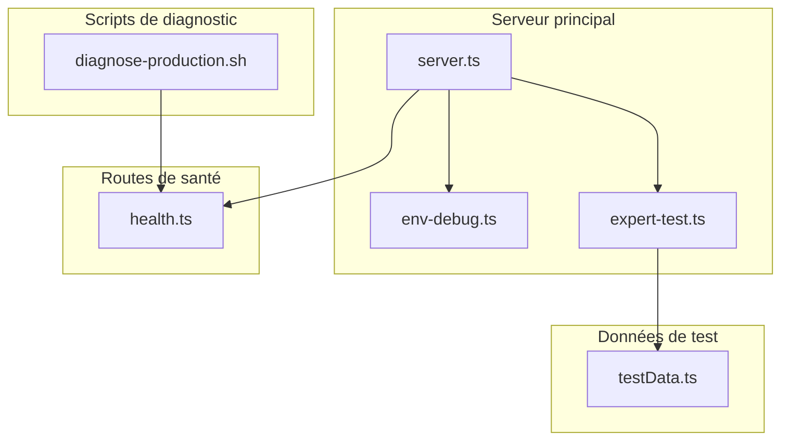
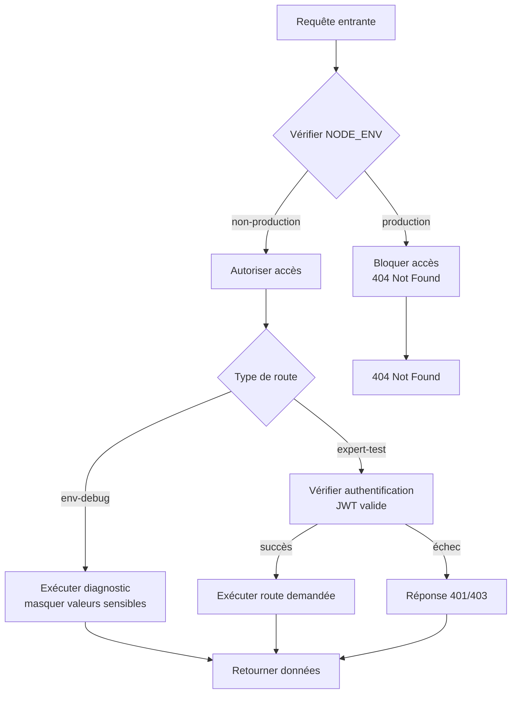
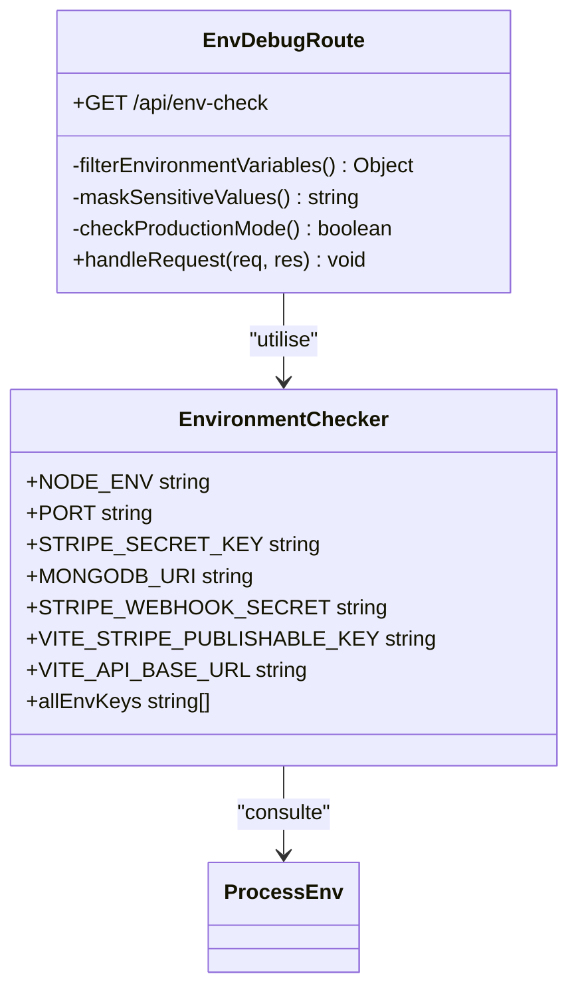
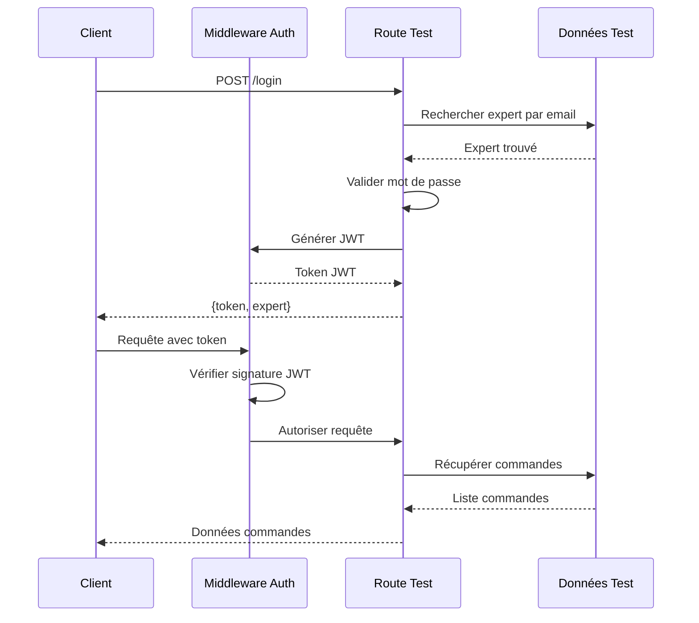
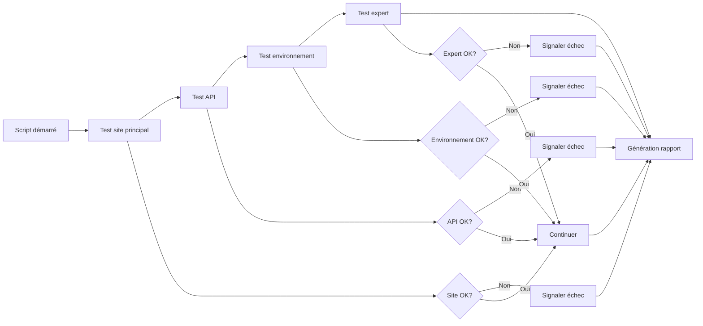

# Routes de débogage

<cite>
**Fichiers référencés dans ce document**
- [env-debug.ts](file://apps/api-backend/src/routes/env-debug.ts)
- [expert-test.ts](file://apps/api-backend/src/routes/expert-test.ts)
- [server.ts](file://apps/api-backend/src/server.ts)
- [testData.ts](file://apps/api-backend/src/data/testData.ts)
- [health.ts](file://apps/api-backend/src/routes/health.ts)
- [diagnose-production.sh](file://diagnose-production.sh)
</cite>

## Table des matières
1. [Introduction](#introduction)
2. [Structure du projet](#structure-du-projet)
3. [Routes de débogage principales](#routes-de-débogage-principales)
4. [Architecture des routes de débogage](#architecture-des-routes-de-débogage)
5. [Analyse détaillée des composants](#analyse-détaillée-des-composants)
6. [Intégration avec les scripts de diagnostic](#intégration-avec-les-scripts-de-diagnostic)
7. [Considérations de sécurité](#considérations-de-sécurité)
8. [Guide de dépannage](#guide-de-dépannage)
9. [Conclusion](#conclusion)

## Introduction

Les routes de débogage (/env-debug, /expert-test) constituent un ensemble critique d'outils de diagnostic intégrés dans l'architecture backend de Oracle Lumira. Ces endpoints spécialisés permettent aux développeurs et administrateurs système de diagnostiquer rapidement les problèmes de configuration, simuler des workflows experts, et valider l'état des services critiques.

Le système de routes de débogage est conçu avec une approche sécurisée, limitant l'accès aux environnements de développement et de test tout en fournissant des informations détaillées essentielles au diagnostic des problèmes en production.

## Structure du projet

Le système de routes de débogage est organisé selon une architecture modulaire qui sépare clairement les responsabilités :



**Sources du diagramme**
- [server.ts](file://apps/api-backend/src/server.ts#L180-L215)
- [env-debug.ts](file://apps/api-backend/src/routes/env-debug.ts#L1-L48)
- [expert-test.ts](file://apps/api-backend/src/routes/expert-test.ts#L1-L213)

**Sources de section**
- [server.ts](file://apps/api-backend/src/server.ts#L1-L275)
- [env-debug.ts](file://apps/api-backend/src/routes/env-debug.ts#L1-L48)
- [expert-test.ts](file://apps/api-backend/src/routes/expert-test.ts#L1-L213)

## Routes de débogage principales

### Route d'environnement (/api/env-check)

La route `/api/env-check` constitue le cœur du système de diagnostic des variables d'environnement. Elle fournit une vue complète des paramètres de configuration actuellement chargés sans exposer les valeurs sensibles.

#### Fonctionnalités principales :
- **Filtrage intelligent** : Affiche uniquement les variables pertinentes (STRIPE, MONGODB, VITE_, NODE_ENV, PORT)
- **Masquage sécurisé** : Les valeurs sensibles sont masquées avec des indicateurs de longueur et de préfixe
- **Contrôle d'accès** : Désactivé automatiquement en production pour éviter l'exposition de données sensibles

#### Données retournées :
```typescript
{
  environment: {
    NODE_ENV: "development",
    PORT: "3001",
    STRIPE_SECRET_KEY: "set (32 chars, starts with: sk_live_...)",
    MONGODB_URI: "set (50 chars, starts with: mongodb...)",
    STRIPE_WEBHOOK_SECRET: "set (24 chars)",
    VITE_STRIPE_PUBLISHABLE_KEY: "set (28 chars, starts with: pk_live_...)",
    VITE_API_BASE_URL: "https://api.oraclelumira.com",
    allEnvKeys: ["NODE_ENV", "PORT", "STRIPE_SECRET_KEY", "MONGODB_URI"]
  },
  timestamp: "2024-01-15T10:30:00.000Z"
}
```

### Route de test expert (/api/expert-test/*)

Le système expert-test offre une simulation complète des workflows d'expert, permettant de tester l'authentification, la gestion des commandes, et les interactions utilisateur sans nécessiter une base de données réelle.

#### Endpoints disponibles :
- **POST /api/expert-test/login** : Simulation d'authentification avec mots de passe prédéfinis
- **GET /api/expert-test/orders/pending** : Récupération des commandes en attente
- **GET /api/expert-test/orders/assigned** : Récupération des commandes assignées
- **POST /api/expert-test/orders/:id/assign** : Simulation d'assignation de commande
- **GET /api/expert-test/profile** : Récupération du profil expert
- **GET /api/expert-test/stats** : Statistiques simulées

**Sources de section**
- [env-debug.ts](file://apps/api-backend/src/routes/env-debug.ts#L8-L48)
- [expert-test.ts](file://apps/api-backend/src/routes/expert-test.ts#L1-L213)

## Architecture des routes de débogage

### Contrôle d'accès basé sur l'environnement



**Sources du diagramme**
- [env-debug.ts](file://apps/api-backend/src/routes/env-debug.ts#L10-L15)
- [expert-test.ts](file://apps/api-backend/src/routes/expert-test.ts#L20-L35)

### Intégration avec le serveur principal

Le système de routes de débogage s'intègre de manière transparente dans l'architecture du serveur principal, avec un contrôle d'accès automatique basé sur l'environnement :

```typescript
// Configuration conditionnelle dans server.ts
if (process.env.NODE_ENV !== 'production') {
  // Montage des routes de débogage sous un préfixe distinct
  app.use('/api/expert-test', expertTestRoutes);
  logger.info('Expert test routes mounted under /api/expert-test (non-production environment)');
} else {
  logger.info('Expert test routes disabled in production environment');
}
```

**Sources de section**
- [server.ts](file://apps/api-backend/src/server.ts#L212-L225)

## Analyse détaillée des composants

### Composant d'environnement



**Sources du diagramme**
- [env-debug.ts](file://apps/api-backend/src/routes/env-debug.ts#L10-L48)

#### Fonctionnalités avancées :
- **Filtrage intelligent** : Seules les clés contenant 'STRIPE', 'MONGODB', 'VITE_', ou spécifiques (NODE_ENV, PORT) sont affichées
- **Masquage sécurisé** : Les valeurs sensibles sont transformées en indicateurs informatifs
- **Validation automatique** : Vérification de la présence et de la validité des variables critiques

### Composant expert-test



**Sources du diagramme**
- [expert-test.ts](file://apps/api-backend/src/routes/expert-test.ts#L40-L80)
- [expert-test.ts](file://apps/api-backend/src/routes/expert-test.ts#L85-L120)

#### Système d'authentification expert :
- **Tokens JWT** : Utilisation de tokens temporaires pour simuler l'authentification
- **Mots de passe prédéfinis** : `maya123` et `sophia123` pour les comptes Oracle Maya et Oracle Sophia
- **Validation stricte** : Vérification des signatures et expiration des tokens

**Sources de section**
- [env-debug.ts](file://apps/api-backend/src/routes/env-debug.ts#L1-L48)
- [expert-test.ts](file://apps/api-backend/src/routes/expert-test.ts#L1-L213)

## Intégration avec les scripts de diagnostic

### Script de diagnostic de production

Le script `diagnose-production.sh` utilise les routes de débogage comme partie intégrante de son processus de diagnostic complet :

```bash
#!/bin/bash
echo "🔍 Oracle Lumira Container Diagnostics"
echo "======================================="

# Test de disponibilité du site principal
MAIN_RESPONSE=$(curl -s -o /dev/null -w "%{http_code}" https://oraclelumira.com 2>/dev/null || echo "000")

# Test de l'endpoint de santé
API_RESPONSE=$(curl -s -o /dev/null -w "%{http_code}" https://oraclelumira.com/api/healthz 2>/dev/null || echo "000")

# Test de la route d'environnement (si disponible)
ENV_RESPONSE=$(curl -s -o /dev/null -w "%{http_code}" https://oraclelumira.com/api/debug/env-check 2>/dev/null || echo "000")
```

### Flux de diagnostic automatisé



**Sources du diagramme**
- [diagnose-production.sh](file://diagnose-production.sh#L1-L67)

**Sources de section**
- [diagnose-production.sh](file://diagnose-production.sh#L1-L67)

## Considérations de sécurité

### Contrôles d'accès stricts

Les routes de débogage implémentent plusieurs couches de sécurité pour protéger les informations sensibles :

#### 1. Restriction par environnement
```typescript
// Blocage automatique en production
if (process.env.NODE_ENV === 'production') {
  res.status(404).json({ error: 'Not found' });
  return;
}
```

#### 2. Masquage des valeurs sensibles
```typescript
// Masquage sécurisé des clés secrètes
STRIPE_SECRET_KEY: process.env.STRIPE_SECRET_KEY ? 
  `set (${process.env.STRIPE_SECRET_KEY.length} chars, starts with: ${process.env.STRIPE_SECRET_KEY.substring(0, 7)}...)` : 
  'undefined'
```

#### 3. Filtrage des variables exposées
Seules les variables considérées comme potentiellement utiles pour le diagnostic sont exposées :
- Variables Stripe (secret, webhook, publishable)
- Variables MongoDB
- Variables Vite (préfixées VITE_)
- Variables d'environnement système critiques (NODE_ENV, PORT)

### Précautions recommandées

#### Environnement de développement :
- **Accès local uniquement** : Les routes ne doivent jamais être exposées sur les réseaux publics
- **Logs audités** : Toutes les requêtes vers les routes de débogage doivent être loggées pour audit
- **Permissions restrictives** : Limiter l'accès aux utilisateurs autorisés uniquement

#### Environnement de production :
- **Désactivation automatique** : Les routes sont automatiquement désactivées
- **Monitoring** : Surveillance des tentatives d'accès non autorisées
- **Audit régulier** : Vérification périodique de la configuration

**Sources de section**
- [env-debug.ts](file://apps/api-backend/src/routes/env-debug.ts#L10-L15)
- [server.ts](file://apps/api-backend/src/server.ts#L212-L225)

## Guide de dépannage

### Problèmes courants et solutions

#### 1. Accès refusé aux routes de débogage

**Symptôme** : Requêtes vers `/api/env-check` ou `/api/expert-test/*` renvoient 404

**Causes possibles** :
- Application en mode production (`NODE_ENV=production`)
- Configuration manquante du serveur
- Firewall bloquant les ports

**Solutions** :
```bash
# Vérifier l'environnement
echo $NODE_ENV

# Tester en mode développement
NODE_ENV=development npm start

# Vérifier la configuration du serveur
curl http://localhost:3001/api/healthz
```

#### 2. Variables d'environnement manquantes

**Symptôme** : Valeurs `undefined` dans la réponse de `/api/env-check`

**Actions recommandées** :
```bash
# Vérifier toutes les variables d'environnement
cat .env | grep -E "(STRIPE|MONGODB|VITE_|NODE_ENV)"

# Tester la configuration
npm run test:env
```

#### 3. Erreurs d'authentification expert

**Symptôme** : Réponses 401/403 depuis `/api/expert-test/*`

**Causes courantes** :
- Tokens expirés
- Clé secrète JWT incorrecte
- Format de token invalide

**Débogage** :
```javascript
// Vérifier la génération de token
const token = jwt.sign(
  { id: expert._id, email: expert.email, name: expert.name },
  process.env.JWT_SECRET || 'fallback-secret',
  { expiresIn: '24h' }
);
console.log('Generated token:', token);
```

### Scripts de diagnostic personnalisés

#### Diagnostic rapide
```bash
#!/bin/bash
echo "🚀 Diagnostic rapide Oracle Lumira"
echo "-----------------------------------"

# Test de base
curl -s https://oraclelumira.com/api/healthz | jq .

# Test environnement
curl -s https://oraclelumira.com/api/debug/env-check | jq .

# Test expert
curl -s -X POST \
  -H "Content-Type: application/json" \
  -d '{"email":"maya@lumira-oracle.com","password":"maya123"}' \
  https://oraclelumira.com/api/expert-test/login | jq .
```

#### Diagnostic complet
```bash
#!/bin/bash
echo "🔍 Diagnostic complet Oracle Lumira"
echo "-----------------------------------"

# Phase 1: Tests de connectivité
echo "Phase 1: Connectivité"
./diagnose-production.sh

# Phase 2: Tests de fonctionnalité
echo "Phase 2: Fonctionnalité"
./test-workflow.js

# Phase 3: Tests de performance
echo "Phase 3: Performance"
./test-complete-flow.js
```

**Sources de section**
- [env-debug.ts](file://apps/api-backend/src/routes/env-debug.ts#L10-L15)
- [expert-test.ts](file://apps/api-backend/src/routes/expert-test.ts#L40-L80)

## Conclusion

Les routes de débogage (/env-debug, /expert-test) représentent un élément crucial de l'écosystème de diagnostic d'Oracle Lumira. Elles offrent une solution robuste et sécurisée pour diagnostiquer les problèmes de configuration, simuler des workflows complexes, et valider l'état des services critiques.

### Points forts du système :

1. **Sécurité par défaut** : Contrôle d'accès automatique basé sur l'environnement
2. **Flexibilité** : Support pour différents niveaux de diagnostic (basique vs détaillé)
3. **Intégration transparente** : S'adapte naturellement à l'architecture existante
4. **Informations ciblées** : Filtre intelligent des variables d'environnement exposées
5. **Simulation réaliste** : Workflow expert complet sans dépendances externes

### Recommandations d'utilisation :

- **Développement** : Utiliser systématiquement pour valider la configuration avant déploiement
- **Tests** : Intégrer dans les suites de tests automatisés
- **Production** : Se limiter aux cas d'urgence avec autorisation explicite
- **Maintenance** : Utiliser comme premier outil de diagnostic lors de problèmes

Le système de routes de débogage constitue une pierre angulaire de la maintenance et du développement d'Oracle Lumira, offrant aux équipes techniques les outils nécessaires pour maintenir la fiabilité et la performance du système.