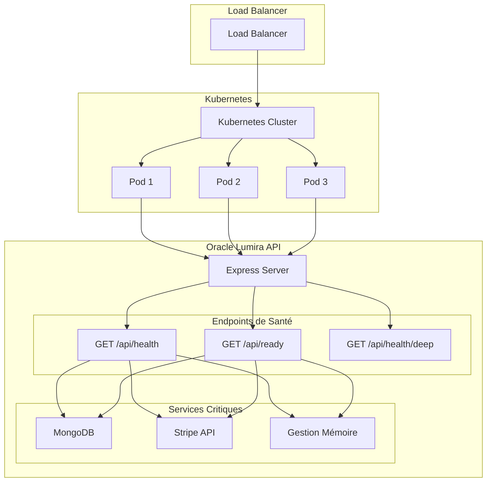
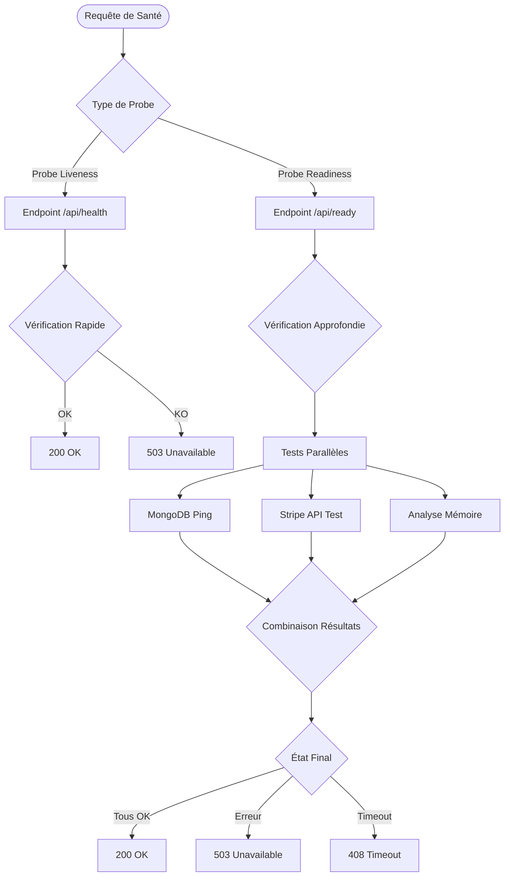

# Routes de Santé du Système

<cite>
**Fichiers Référencés dans ce Document**
- [health.ts](file://apps/api-backend/src/routes/health.ts)
- [ready.ts](file://apps/api-backend/src/routes/ready.ts)
- [server.ts](file://apps/api-backend/src/server.ts)
- [ready.test.ts](file://apps\api-backend\src\__tests__\ready.test.ts)
- [products.route.test.ts](file://apps\api-backend\src\__tests__\products.route.test.ts)
- [package.json](file://apps\api-backend\package.json)
</cite>

## Table des Matières
1. [Introduction](#introduction)
2. [Architecture des Routes de Santé](#architecture-des-routes-de-santé)
3. [Endpoint /health](#endpoint-health)
4. [Endpoint /ready](#endpoint-ready)
5. [Différences Clés entre /health et /ready](#différences-clés-entre-health-et-ready)
6. [Tests et Validation](#tests-et-validation)
7. [Intégration avec Kubernetes](#intégration-avec-kubernetes)
8. [Bonnes Pratiques en Production](#bonnes-pratiques-en-production)
9. [Exemples de Requêtes et Réponses](#exemples-de-requêtes-et-réponses)
10. [Dépannage](#dépannage)

## Introduction

Les routes de santé (/health et /ready) constituent un composant essentiel de la gestion de la disponibilité du service Oracle Lumira. Ces endpoints fournissent des informations critiques sur l'état du système pour les load balancers, les orchestrateurs de conteneurs (comme Kubernetes), et les systèmes de monitoring.

Le système implémente deux types d'endpoints de santé distincts :
- **/api/health** : Vérification rapide des services principaux
- **/api/ready** : Vérification complète de tous les services critiques

## Architecture des Routes de Santé



**Sources du Diagramme**
- [server.ts](file://apps/api-backend/src/server.ts#L180-L190)
- [health.ts](file://apps/api-backend/src/routes/health.ts#L1-L128)
- [ready.ts](file://apps/api-backend/src/routes/ready.ts#L1-L307)

## Endpoint /health

L'endpoint `/api/health` fournit une vue rapide de l'état général du système. Il vérifie les services critiques et retourne des informations de métriques de base.

### Fonctionnalités Principales

- **Vérification de la base de données** : État de la connexion MongoDB
- **Vérification Stripe** : Configuration de l'API Stripe
- **Métriques mémoire** : Utilisation mémoire heap
- **Informations système** : Uptime, version, environnement

### Structure de Réponse

```typescript
interface HealthResponse {
  status: 'healthy' | 'degraded' | 'unhealthy';
  timestamp: string;
  uptime: number;
  version: string;
  commitSha?: string;
  environment: string;
  services: {
    database: 'connected' | 'disconnected';
    stripe: 'configured' | 'missing';
  };
  memory: {
    used: number;
    total: number;
    percentage: number;
  };
}
```

### Codes de Statut

- **200 OK** : Service opérationnel (status = 'healthy')
- **200 OK** : Service dégradé (status = 'degraded')
- **503 Service Unavailable** : Service indisponible (status = 'unhealthy')

### Exemple de Réponse

```json
{
  "status": "healthy",
  "timestamp": "2024-01-15T10:30:00.000Z",
  "uptime": 3600,
  "version": "1.0.0",
  "environment": "production",
  "services": {
    "database": "connected",
    "stripe": "configured"
  },
  "memory": {
    "used": 256,
    "total": 1024,
    "percentage": 25
  }
}
```

**Sources de la Section**
- [health.ts](file://apps/api-backend/src/routes/health.ts#L8-L25)
- [health.ts](file://apps/api-backend/src/routes/health.ts#L27-L70)

## Endpoint /ready

L'endpoint `/api/ready` effectue une vérification approfondie de tous les services critiques avant de marquer l'application comme prête à recevoir du trafic production.

### Fonctionnalités Avancées

- **Timeout configurable** : 5 secondes maximum pour éviter les requests bloquées
- **Vérifications parallèles** : MongoDB et Stripe testés simultanément
- **Métriques détaillées** : Temps de réponse, état mémoire précis
- **Logs de monitoring** : Informations détaillées pour le debugging

### Structure de Réponse

```typescript
interface ReadinessStatus {
  ready: boolean;
  timestamp: string;
  services: {
    mongodb: {
      connected: boolean;
      responseTime?: number;
      error?: string;
    };
    stripe: {
      initialized: boolean;
      responseTime?: number;
      error?: string;
    };
    memory: {
      status: 'ok' | 'warning' | 'critical';
      used: number;
      free: number;
      percentage: number;
    };
    uptime: number;
  };
  version: string;
  environment: string;
}
```

### Codes de Statut

- **200 OK** : Application prête (ready = true)
- **503 Service Unavailable** : Application non prête (ready = false)
- **408 Request Timeout** : Vérifications trop lentes

### Exemple de Réponse

```json
{
  "ready": true,
  "timestamp": "2024-01-15T10:30:00.000Z",
  "services": {
    "mongodb": {
      "connected": true,
      "responseTime": 125
    },
    "stripe": {
      "initialized": true,
      "responseTime": 245
    },
    "memory": {
      "status": "ok",
      "used": 256,
      "free": 768,
      "percentage": 25
    },
    "uptime": 3600
  },
  "version": "1.0.0",
  "environment": "production"
}
```

**Sources de la Section**
- [ready.ts](file://apps/api-backend/src/routes/ready.ts#L30-L50)
- [ready.ts](file://apps/api-backend/src/routes/ready.ts#L130-L180)

## Différences Clés entre /health et /ready



**Sources du Diagramme**
- [health.ts](file://apps/api-backend/src/routes/health.ts#L27-L70)
- [ready.ts](file://apps/api-backend/src/routes/ready.ts#L130-L200)

### Comparaison Détaillée

| Aspect | /api/health | /api/ready |
|--------|-------------|------------|
| **Objectif** | Indicateur rapide de santé | Marquer prêt pour le trafic |
| **Vérifications** | Services principaux | Services critiques + mémoire |
| **Timeout** | Non défini | 5 secondes max |
| **Parallélisme** | Non | Oui |
| **Profondeur** | Basique | Approfondie |
| **Utilisation** | Monitoring continu | Probes Kubernetes |
| **Codes retour** | 200/503 | 200/503/408 |

## Tests et Validation

Le système inclut des tests unitaires complets pour valider le comportement des endpoints de santé.

### Tests de l'Endpoint /ready

```typescript
describe('🚀 Endpoint de Readiness - /api/ready', () => {
  it('devrait retourner 200 OK quand tous les services sont opérationnels', async () => {
    const response = await request(app)
      .get('/api/ready')
      .expect(200);
    
    expect(response.body.ready).toBe(true);
    expect(response.body.services.mongodb.connected).toBe(true);
    expect(response.body.services.stripe.initialized).toBe(true);
  });
});
```

### Tests de Scénarios d'Échec

- **MongoDB déconnecté** : Retourne 503
- **Stripe non configuré** : Retourne 503
- **Timeout MongoDB** : Retourne 503
- **Timeout Stripe** : Retourne 503

**Sources de la Section**
- [ready.test.ts](file://apps\api-backend\src\__tests__\ready.test.ts#L60-L100)
- [ready.test.ts](file://apps\api-backend\src\__tests__\ready.test.ts#L110-L150)

## Intégration avec Kubernetes

Les endpoints de santé sont conçus pour une intégration native avec Kubernetes :

### Configuration des Probes

```yaml
livenessProbe:
  httpGet:
    path: /api/health
    port: 3001
  initialDelaySeconds: 30
  periodSeconds: 10

readinessProbe:
  httpGet:
    path: /api/ready
    port: 3001
  initialDelaySeconds: 5
  periodSeconds: 5
  timeoutSeconds: 5
```

### Intégration Coolify

Le système supporte également les health checks de Coolify avec l'endpoint simplifié `/api/healthz`.

**Sources de la Section**
- [server.ts](file://apps/api-backend/src/server.ts#L180-L190)

## Bonnes Pratiques en Production

### Configuration des Environnements

1. **Variables d'Environnement**
   ```bash
   NODE_ENV=production
   MONGODB_URI=mongodb://localhost:27017/oracle-lumira
   STRIPE_SECRET_KEY=sk_live_xxxxxxxxxxxxx
   ```

2. **Monitoring et Alerting**
   - Surveiller les codes de statut 503
   - Alerte sur temps de réponse > 2 secondes
   - Notification d'erreurs de base de données

3. **Optimisations de Performance**
   - Timeout approprié (5 secondes recommandé)
   - Tests parallèles pour réduire la latence
   - Logs structurés pour le debugging

### Sécurité

- **Protection contre les attaques DDoS** : Rate limiting intégré
- **Cache Control** : Headers appropriés pour éviter la mise en cache
- **Debugging sélectif** : Endpoint verbose désactivé en production

**Sources de la Section**
- [ready.ts](file://apps/api-backend/src/routes/ready.ts#L130-L180)
- [server.ts](file://apps/api-backend/src/server.ts#L40-L60)

## Exemples de Requêtes et Réponses

### Requête /api/health

```bash
curl -X GET "http://localhost:3001/api/health" \
  -H "Accept: application/json"
```

### Réponse /api/health (Succès)

```json
{
  "status": "healthy",
  "timestamp": "2024-01-15T10:30:00.000Z",
  "uptime": 3600,
  "version": "1.0.0",
  "environment": "production",
  "services": {
    "database": "connected",
    "stripe": "configured"
  },
  "memory": {
    "used": 256,
    "total": 1024,
    "percentage": 25
  }
}
```

### Réponse /api/health (Erreur)

```json
{
  "status": "unhealthy",
  "timestamp": "2024-01-15T10:30:00.000Z",
  "error": "Health check failed",
  "details": "Database connection failed: Connection timeout"
}
```

### Requête /api/ready

```bash
curl -X GET "http://localhost:3001/api/ready" \
  -H "Accept: application/json"
```

### Réponse /api/ready (Prêt)

```json
{
  "ready": true,
  "timestamp": "2024-01-15T10:30:00.000Z",
  "services": {
    "mongodb": {
      "connected": true,
      "responseTime": 125
    },
    "stripe": {
      "initialized": true,
      "responseTime": 245
    },
    "memory": {
      "status": "ok",
      "used": 256,
      "free": 768,
      "percentage": 25
    },
    "uptime": 3600
  },
  "version": "1.0.0",
  "environment": "production"
}
```

### Réponse /api/ready (Non Prêt)

```json
{
  "ready": false,
  "timestamp": "2024-01-15T10:30:00.000Z",
  "services": {
    "mongodb": {
      "connected": false,
      "error": "MongoDB connection state: 0"
    },
    "stripe": {
      "initialized": true
    },
    "memory": {
      "status": "ok",
      "used": 256,
      "free": 768,
      "percentage": 25
    },
    "uptime": 3600
  },
  "version": "1.0.0",
  "environment": "production"
}
```

**Sources de la Section**
- [health.ts](file://apps/api-backend/src/routes/health.ts#L27-L70)
- [ready.ts](file://apps/api-backend/src/routes/ready.ts#L130-L200)

## Dépannage

### Problèmes Courants

1. **MongoDB Non Connecté**
   - Vérifier la variable d'environnement `MONGODB_URI`
   - Contrôler la connectivité réseau
   - Valider les identifiants d'authentification

2. **Stripe Non Configuré**
   - Vérifier la présence de `STRIPE_SECRET_KEY`
   - Valider la clé API Stripe
   - Tester la connectivité réseau

3. **Timeout de Vérification**
   - Augmenter les timeouts si nécessaire
   - Optimiser la connectivité réseau
   - Vérifier les performances système

### Commandes de Diagnostic

```bash
# Test rapide de l'endpoint health
curl -f http://localhost:3001/api/health

# Test complet de l'endpoint ready
curl -f http://localhost:3001/api/ready

# Test avec timeout
curl --max-time 5 http://localhost:3001/api/ready
```

### Logs de Debug

Le système génère des logs détaillés pour le debugging :

```javascript
// Logs de monitoring
console.log(`[READY] ${status.ready ? 'OK' : 'NOT_READY'} (${totalTime}ms)`);

// Logs d'erreur
console.error(`[READY] ERROR (${totalTime}ms): ${errorMessage}`);
```

**Sources de la Section**
- [ready.ts](file://apps/api-backend/src/routes/ready.ts#L180-L200)
- [ready.ts](file://apps/api-backend/src/routes/ready.ts#L200-L220)