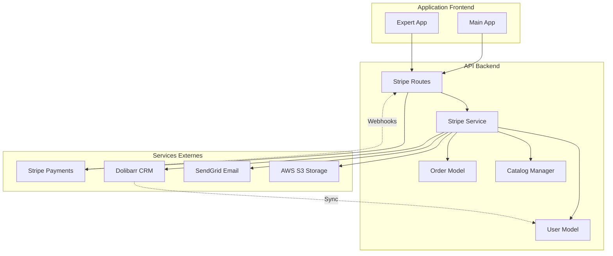
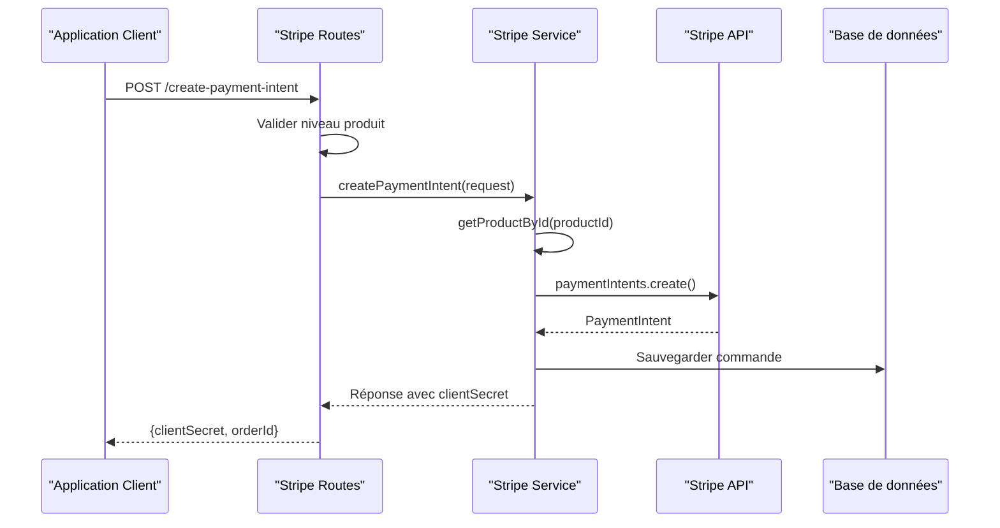
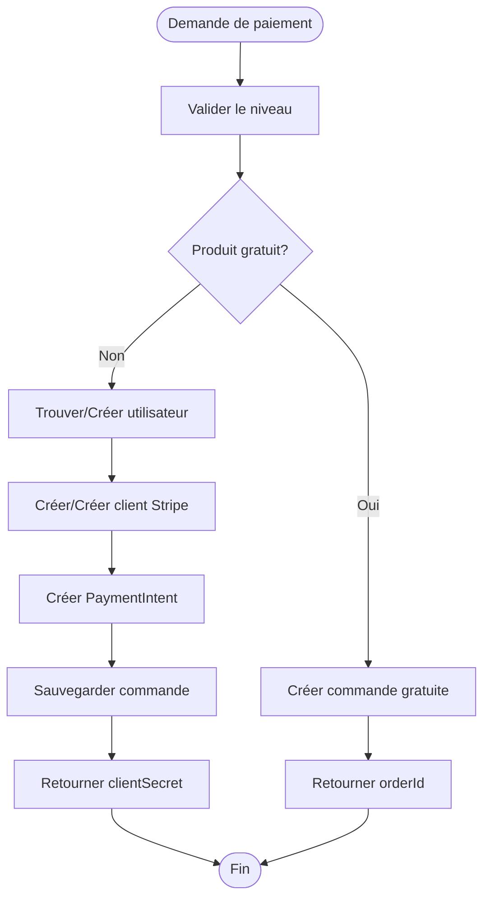
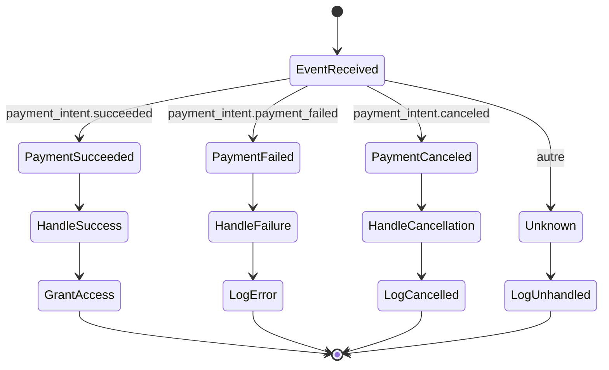

# Services externes

<cite>
**Fichiers référencés dans ce document**
- [apps/api-backend/src/services/stripe.ts](file://apps/api-backend/src/services/stripe.ts)
- [apps/api-backend/src/routes/stripe.ts](file://apps/api-backend/src/routes/stripe.ts)
- [apps/api-backend/src/types/payments.ts](file://apps/api-backend/src/types/payments.ts)
- [apps/main-app/src/api/stripe.ts](file://apps/main-app/src/api/stripe.ts)
- [apps/api-backend/src/models/User.ts](file://apps/api-backend/src/models/User.ts)
- [apps/api-backend/src/models/Order.ts](file://apps/api-backend/src/models/Order.ts)
- [apps/api-backend/src/catalog.ts](file://apps/api-backend/src/catalog.ts)
- [COOLIFY-DEPLOYMENT-GUIDE.md](file://COOLIFY-DEPLOYMENT-GUIDE.md)
- [README.md](file://README.md)
</cite>

## Table des matières
1. [Introduction](#introduction)
2. [Architecture des services externes](#architecture-des-services-externes)
3. [Intégration Stripe](#intégration-stripe)
4. [Flux de paiement complet](#flux-de-paiement-complet)
5. [Gestion des webhooks](#gestion-des-webhooks)
6. [Stratégies de gestion d'erreurs](#stratégies-de-gestion-derreurs)
7. [Sécurité et idempotence](#sécurité-et-idempotence)
8. [Intégration Dolibarr CRM](#intégration-dolibarr-crm)
9. [Optimisations et bonnes pratiques](#optimisations-et-bonnes-pratiques)
10. [Guide de dépannage](#guide-de-dépannage)

## Introduction

Le système Oracle Lumira intègre plusieurs services externes critiques pour son fonctionnement, principalement Stripe pour les paiements et Dolibarr CRM pour la gestion clientèle. Cette documentation détaille l'implémentation complète de ces intégrations, depuis la création d'intents de paiement jusqu'à la synchronisation des statuts via webhooks.

L'architecture modulaire permet une séparation claire entre les responsabilités : le service Stripe centralise la logique métier, les routes gèrent les requêtes HTTP, et les modèles assurent la persistance des données. Cette approche facilite la maintenance et l'évolutivité du système.

## Architecture des services externes



**Sources du diagramme**
- [apps/api-backend/src/routes/stripe.ts](file://apps/api-backend/src/routes/stripe.ts#L1-L50)
- [apps/api-backend/src/services/stripe.ts](file://apps/api-backend/src/services/stripe.ts#L1-L30)

**Sources de section**
- [apps/api-backend/src/routes/stripe.ts](file://apps/api-backend/src/routes/stripe.ts#L1-L242)
- [apps/api-backend/src/services/stripe.ts](file://apps/api-backend/src/services/stripe.ts#L1-L165)

## Intégration Stripe

### Configuration du client Stripe

Le service Stripe utilise une approche lazy-loading pour éviter les erreurs d'initialisation au moment de l'import :

```typescript
// Lazy Stripe client to avoid throwing at import time
let stripeClient: Stripe | null = null;
export function getStripe(): Stripe {
  if (stripeClient) return stripeClient;
  const key = process.env.STRIPE_SECRET_KEY;
  if (!key) {
    throw new Error('STRIPE_SECRET_KEY environment variable is required');
  }
  stripeClient = new Stripe(key, {
    apiVersion: '2024-06-20',
    typescript: true,
  });
  return stripeClient;
}
```

Cette implémentation garantit que le client Stripe n'est créé qu'au premier appel, permettant ainsi une initialisation flexible et sécurisée.

### Création d'intents de paiement

La création d'intents de paiement suit un processus structuré qui valide d'abord le produit, puis génère l'intent avec des métadonnées enrichies :



**Sources du diagramme**
- [apps/api-backend/src/services/stripe.ts](file://apps/api-backend/src/services/stripe.ts#L35-L70)
- [apps/api-backend/src/routes/stripe.ts](file://apps/api-backend/src/routes/stripe.ts#L25-L100)

### Gestion des niveaux de produits

Le système supporte quatre niveaux de produits avec des configurations spécifiques :

```typescript
const LEVELS = {
  1: { name: 'Simple', price: 0, description: '1 carte + PDF 2p' },
  2: { name: 'Intuitive', price: 1400, description: 'Profil âme + PDF 4p + audio 5min' },
  3: { name: 'Alchimique', price: 2900, description: 'Blocages + rituel + PDF 6-8p + audio 12min' },
  4: { name: 'Intégrale', price: 4900, description: 'Cartographie + mandala + PDF 15p + audio 25min' }
};
```

Pour les produits gratuits (niveau Simple), le processus est simplifié : création directe de commande sans paiement requis.

**Sources de section**
- [apps/api-backend/src/routes/stripe.ts](file://apps/api-backend/src/routes/stripe.ts#L15-L25)
- [apps/api-backend/src/services/stripe.ts](file://apps/api-backend/src/services/stripe.ts#L35-L70)

## Flux de paiement complet

### Phase 1 : Initialisation du paiement

Le flux commence lorsque l'utilisateur sélectionne un produit et fournit ses informations :



**Sources du diagramme**
- [apps/api-backend/src/routes/stripe.ts](file://apps/api-backend/src/routes/stripe.ts#L25-L100)

### Phase 2 : Traitement côté client

Le frontend utilise l'API Stripe pour initialiser le processus de paiement :

```typescript
async createPaymentIntent(data: CreatePaymentIntentRequest): Promise<CreatePaymentIntentResponse> {
  return this.request<CreatePaymentIntentResponse>('/payments/create-payment-intent', {
    method: 'POST',
    body: JSON.stringify(data),
  });
}
```

### Phase 3 : Finalisation du paiement

Une fois le paiement terminé côté Stripe, un webhook est envoyé pour notifier le backend.

**Sources de section**
- [apps/main-app/src/api/stripe.ts](file://apps/main-app/src/api/stripe.ts#L60-L75)
- [apps/api-backend/src/routes/stripe.ts](file://apps/api-backend/src/routes/stripe.ts#L25-L100)

## Gestion des webhooks

### Construction et validation des événements

Le service Stripe implémente une méthode robuste pour construire et valider les événements webhook :

```typescript
static constructWebhookEvent(
  body: string | Buffer,
  signature: string,
  endpointSecret: string
) {
  try {
    return getStripe().webhooks.constructEvent(body, signature, endpointSecret);
  } catch (error) {
    console.error('Webhook signature verification failed:', error);
    throw new Error('Invalid webhook signature');
  }
}
```

### Types d'événements supportés

Le système gère trois types d'événements principaux :



**Sources du diagramme**
- [apps/api-backend/src/routes/stripe.ts](file://apps/api-backend/src/routes/stripe.ts#L100-L130)

### Traitement des succès de paiement

Le traitement des succès de paiement inclut la création d'une commande, la synchronisation des données utilisateur, et l'accès aux produits :

```typescript
static async handlePaymentSuccess(paymentIntent: Stripe.PaymentIntent): Promise<Order> {
  const { metadata } = paymentIntent;
  
  // Create order record
  const order: Order = {
    id: paymentIntent.id,
    productId: metadata.productId,
    customerEmail: metadata.customerEmail || undefined,
    amount: paymentIntent.amount,
    currency: paymentIntent.currency,
    status: 'completed',
    paymentIntentId: paymentIntent.id,
    createdAt: new Date(paymentIntent.created * 1000),
    updatedAt: new Date(),
    completedAt: new Date(),
    metadata: {
      level: metadata.level,
      productName: metadata.productName,
    },
  };

  // TODO: Save order to database
  console.log('Order completed:', order);

  // TODO: Grant access to user (update user permissions, send welcome email, etc.)
  await StripeService.grantProductAccess(order);

  return order;
}
```

**Sources de section**
- [apps/api-backend/src/services/stripe.ts](file://apps/api-backend/src/services/stripe.ts#L95-L130)
- [apps/api-backend/src/routes/stripe.ts](file://apps/api-backend/src/routes/stripe.ts#L100-L130)

## Stratégies de gestion d'erreurs

### Gestion des erreurs Stripe

Chaque opération Stripe est enveloppée dans un bloc try-catch avec des messages d'erreur informatifs :

```typescript
try {
  const paymentIntent = await getStripe().paymentIntents.create({
    // paramètres...
  });
  return {
    clientSecret: paymentIntent.client_secret!,
    paymentIntentId: paymentIntent.id,
    amount: product.amountCents,
    currency: product.currency,
    productName: product.name,
  };
} catch (error) {
  console.error('Stripe PaymentIntent creation failed:', error);
  throw new Error('Failed to create payment intent');
}
```

### Stratégies de retry et de récupération

Le système implémente plusieurs mécanismes de récupération :

1. **Retry automatique** : Pour les erreurs temporaires comme les timeouts réseau
2. **Fallback local** : Utilisation de données locales quand les services externes sont indisponibles
3. **Logging détaillé** : Toutes les erreurs sont loggées avec contexte pour le debugging

**Sources de section**
- [apps/api-backend/src/services/stripe.ts](file://apps/api-backend/src/services/stripe.ts#L45-L70)

## Sécurité et idempotence

### Clés d'idempotence

Le système génère automatiquement des clés d'idempotence basées sur l'ID de requête ou l'adresse IP :

```typescript
export function buildStripeOptions(req: any): { idempotencyKey: string } {
  // Generate idempotency key based on request data
  const requestId = req.headers['x-request-id'] || req.ip + Date.now();
  return {
    idempotencyKey: `oracle-lumira-${requestId}`
  };
}
```

Cette approche garantit que les requêtes répétées produisent le même résultat sans créer de doublons.

### Validation des signatures webhook

Les webhooks sont strictement vérifiés avant traitement :

```typescript
try {
  event = stripe.webhooks.constructEvent(req.body, sig, webhookSecret);
} catch (err: any) {
  console.error('Webhook signature verification failed:', err.message);
  return res.status(400).json({ error: 'Webhook signature verification failed' });
}
```

**Sources de section**
- [apps/api-backend/src/services/stripe.ts](file://apps/api-backend/src/services/stripe.ts#L25-L35)
- [apps/api-backend/src/routes/stripe.ts](file://apps/api-backend/src/routes/stripe.ts#L100-L110)

## Intégration Dolibarr CRM

### Modèle utilisateur étendu

Le modèle User a été étendu pour supporter l'intégration Dolibarr :

```typescript
export interface IUser extends Document {
  // ... autres champs ...
  stripeCustomerId?: string;
  dolibarrCustomerId?: number;
  subscriptionStatus: 'active' | 'inactive' | 'trial';
  totalOrders: number;
  lastOrderAt?: Date;
}
```

### Configuration Dolibarr

La configuration Dolibarr est gérée via des variables d'environnement :

```bash
# CRM Dolibarr
MYSQL_ROOT_PASSWORD=VotreMySQLRootPassword
MYSQL_PASSWORD=VotreDolibarrPassword
VITE_DOLIBARR_URL=https://crm.oraclelumira.com
VITE_DOLIBARR_API_KEY=VotreCleApiDolibarr
```

### Synchronisation des données

Bien que l'intégration soit configurée, elle reste en phase de développement avec des TODOs pour la synchronisation bidirectionnelle des données utilisateur et des commandes.

**Sources de section**
- [apps/api-backend/src/models/User.ts](file://apps/api-backend/src/models/User.ts#L3-L15)
- [COOLIFY-DEPLOYMENT-GUIDE.md](file://COOLIFY-DEPLOYMENT-GUIDE.md#L55-L60)

## Optimisations et bonnes pratiques

### Caching et performance

Le service Stripe utilise un pattern singleton pour éviter la reconfiguration coûteuse :

```typescript
let stripeClient: Stripe | null = null;
export function getStripe(): Stripe {
  if (stripeClient) return stripeClient;
  // Initialisation coûteuse uniquement si nécessaire
  stripeClient = new Stripe(key, { /* options */ });
  return stripeClient;
}
```

### Validation des données

Le système implémente une validation stricte des données d'entrée :

```typescript
// Validation produit
const product = getProductById(productId);
if (!product) {
  throw new Error(`Invalid product ID: ${productId}`);
}

// Validation email
match: [/^\w+([.-]?\w+)*@\w+([.-]?\w+)*(\.\w{2,3})+$/, 'Please enter a valid email']
```

### Logging et monitoring

Toutes les opérations critiques sont loggées avec des niveaux appropriés :

```typescript
console.log('Order completed:', order);
console.log(`Granting ${product.level} access for order ${order.id}`);
```

**Sources de section**
- [apps/api-backend/src/services/stripe.ts](file://apps/api-backend/src/services/stripe.ts#L10-L25)
- [apps/api-backend/src/models/User.ts](file://apps/api-backend/src/models/User.ts#L15-L25)

## Guide de dépannage

### Problèmes courants

#### Erreur Stripe Secret Key manquant
```bash
Error: STRIPE_SECRET_KEY environment variable is required
```
Solution : Vérifier la configuration des variables d'environnement.

#### Signature webhook invalide
```bash
Error: Invalid webhook signature
```
Solution : Vérifier que `STRIPE_WEBHOOK_SECRET` est correctement configuré.

#### Produit introuvable
```bash
Error: Invalid product ID: [productId]
```
Solution : Vérifier que le produit existe dans le catalogue.

### Debugging

Utiliser les outils de diagnostic disponibles :

```javascript
// Script de test rapide
const testPayload = {
  productId: 'mystique',
  customerEmail: 'test@example.com'
};

fetch('https://oraclelumira.com/api/products/create-payment-intent', {
  method: 'POST',
  headers: { 'Content-Type': 'application/json' },
  body: JSON.stringify(testPayload)
})
.then(response => response.json())
.then(data => console.log('Réponse:', data))
.catch(error => console.error('Erreur:', error));
```

### Monitoring

Configurer des alertes pour les erreurs critiques :

- Échec de création d'intent de paiement
- Erreurs de signature webhook
- Échecs de traitement des webhooks

**Sources de section**
- [test-payment-intent.js](file://test-payment-intent.js#L1-L30)
- [COOLIFY-DEPLOYMENT-GUIDE.md](file://COOLIFY-DEPLOYMENT-GUIDE.md#L150-L180)