# Configuration du proxy inverse avec Nginx

<cite>
**Fichiers Référencés dans ce Document**
- [nginx.conf](file://nginx.conf)
- [nginx-frontend.conf](file://nginx-frontend.conf)
- [nginx-fullstack.conf](file://nginx-fullstack.conf)
- [docker-compose.yml](file://infrastructure/docker-compose.yml)
- [start-fullstack-optimized.sh](file://start-fullstack-optimized.sh)
- [Dockerfile](file://apps/main-app/Dockerfile)
- [apply-fixes.ps1](file://security/apply-fixes.ps1)
- [nginx-test.ps1](file://security/nginx-test.ps1)
- [NGINX-PROXY-FIX-SUCCESS.md](file://NGINX-PROXY-FIX-SUCCESS.md)
</cite>

## Table des Matières
1. [Introduction](#introduction)
2. [Structure du Projet](#structure-du-projet)
3. [Configuration Nginx Principale](#configuration-nginx-principale)
4. [Configuration Frontend Spécialisée](#configuration-frontend-spécialisée)
5. [Configuration Fullstack](#configuration-fullstack)
6. [Architecture de Proxy Inverse](#architecture-de-proxy-inverse)
7. [Analyse Détaillée des Composants](#analyse-détaillée-des-composants)
8. [Intégration Docker et Orchestration](#intégration-docker-et-orchestration)
9. [Considérations de Sécurité](#considérations-de-sécurité)
10. [Optimisations de Performance](#optimisations-de-performance)
11. [Guide de Dépannage](#guide-de-dépannage)
12. [Conclusion](#conclusion)

## Introduction

Cette documentation présente l'architecture de configuration du proxy inverse Nginx dans le projet Oracle Lumira V1 MVP. Le système utilise Nginx comme serveur web principal et reverse proxy pour orchestrer le trafic entre les applications frontend et backend, assurant la sécurité, la performance et la scalabilité de l'application.

Le projet implémente trois configurations Nginx distinctes :
- **nginx.conf** : Configuration principale pour le domaine racine
- **nginx-frontend.conf** : Configuration spécialisée pour les applications frontend
- **nginx-fullstack.conf** : Configuration optimisée pour le déploiement complet

## Structure du Projet

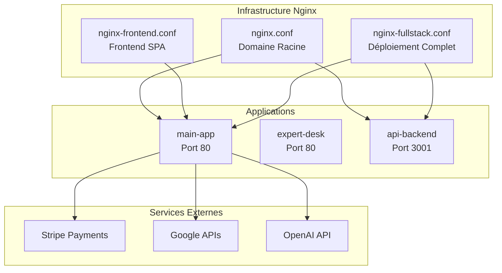

**Sources du Diagramme**
- [nginx.conf](file://nginx.conf#L1-L62)
- [nginx-frontend.conf](file://nginx-frontend.conf#L1-L61)
- [nginx-fullstack.conf](file://nginx-fullstack.conf#L1-L49)

## Configuration Nginx Principale

La configuration principale `nginx.conf` gère le domaine racine `oraclelumira.com` et `www.oraclelumira.com`. Elle implémente un proxy inverse sophistiqué avec gestion des en-têtes de sécurité et optimisations de performance.

### Bloc Serveur Principal

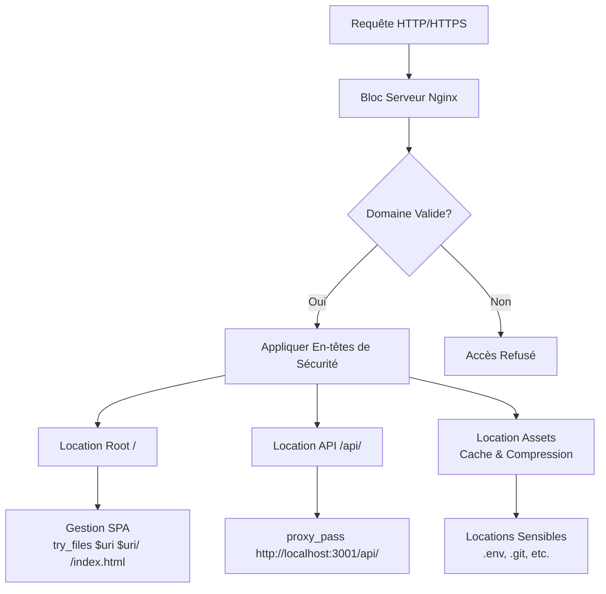

**Sources du Diagramme**
- [nginx.conf](file://nginx.conf#L15-L58)

### En-têtes de Sécurité Avancés

La configuration implémente plusieurs en-têtes de sécurité critiques :

- **X-Frame-Options**: Protection contre les attaques de framing
- **X-Content-Type-Options**: Prévention de la détection automatique des types MIME
- **X-XSS-Protection**: Protection contre les attaques XSS
- **Strict-Transport-Security**: Force HTTPS pour une année
- **Referrer-Policy**: Contrôle des informations de référence
- **Content-Security-Policy**: Politique de sécurité des contenus

### Règles de Localisation

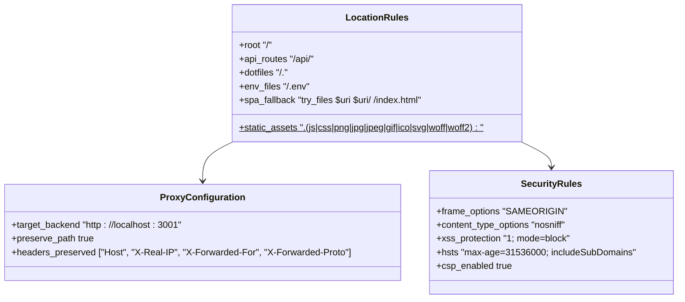

**Sources du Diagramme**
- [nginx.conf](file://nginx.conf#L15-L58)

**Sources de Section**
- [nginx.conf](file://nginx.conf#L1-L62)

## Configuration Frontend Spécialisée

La configuration `nginx-frontend.conf` est optimisée pour les applications Single Page Application (SPA) avec gestion des appels API vers des domaines externes.

### Architecture SPA avec Proxy API

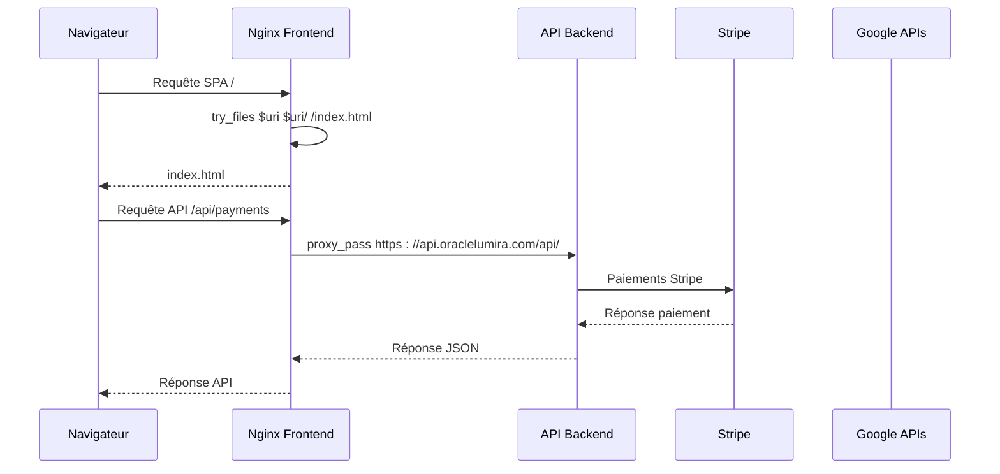

**Sources du Diagramme**
- [nginx-frontend.conf](file://nginx-frontend.conf#L28-L35)

### Configuration de Compression et Cache

La configuration inclut une stratégie de cache intelligente pour les ressources statiques :

- **Compression Gzip** : Activée pour tous les types de contenu textuels
- **Cache Longue Durée** : 1 an pour les assets immuables
- **En-têtes Cache-Control** : Public et immutable pour optimiser les performances

**Sources de Section**
- [nginx-frontend.conf](file://nginx-frontend.conf#L1-L61)

## Configuration Fullstack

La configuration `nginx-fullstack.conf` est conçue pour le déploiement complet avec intégration Docker et gestion des processus.

### Configuration de Base

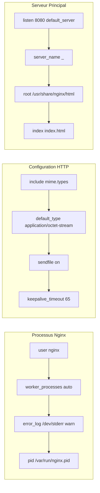

**Sources du Diagramme**
- [nginx-fullstack.conf](file://nginx-fullstack.conf#L1-L25)

### Intégration Docker et Process Management

La configuration supporte l'exécution dans des conteneurs Docker avec gestion des logs et des répertoires temporaires :

- **Logs Standard** : Utilisation de `/dev/stdout` et `/dev/stderr`
- **Répertoires Temporaires** : Configuration sécurisée pour exécution non-root
- **Gestion des Processus** : Configuration PID appropriée

**Sources de Section**
- [nginx-fullstack.conf](file://nginx-fullstack.conf#L1-L49)

## Architecture de Proxy Inverse

### Flux de Trafic Principal

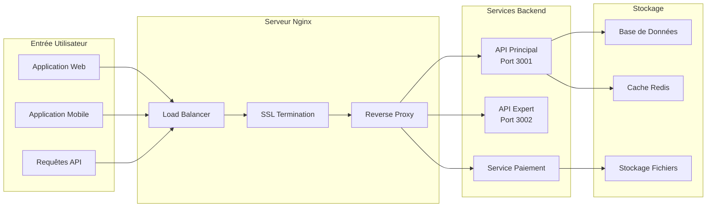

### Stratégie de Routage Intelligent

Le système implémente un routage intelligent basé sur les patterns d'URL :

1. **Ressources Statiques** : Servies directement depuis le système de fichiers
2. **API Backend** : Proxy vers les services backend sur ports différents
3. **SPA Fallback** : Gestion des routes client-side pour navigation sans rechargement
4. **Health Checks** : Endpoints dédiés pour monitoring et orchestration

## Analyse Détaillée des Composants

### Configuration des En-têtes de Sécurité

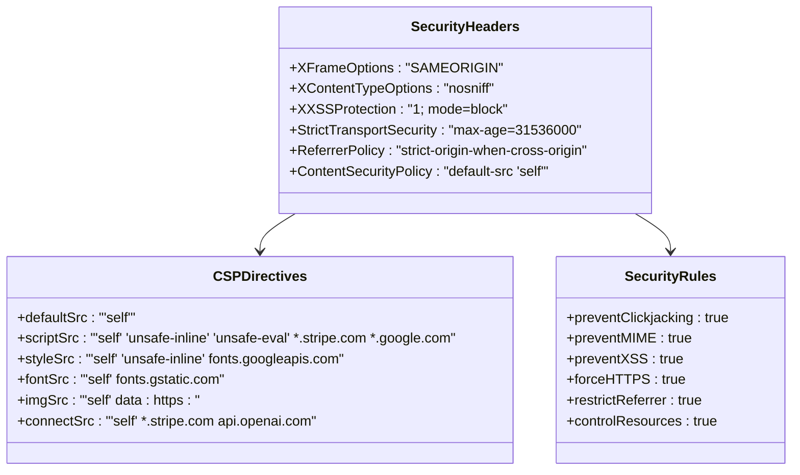

**Sources du Diagramme**
- [nginx.conf](file://nginx.conf#L19-L25)

### Gestion des En-têtes de Proxy

Chaque configuration Nginx implémente une stratégie cohérente pour la préservation des en-têtes :

- **Host** : Maintien du nom d'hôte original
- **X-Real-IP** : Adresse IP du client réelle
- **X-Forwarded-For** : Chaîne d'adresses IP pour tracing
- **X-Forwarded-Proto** : Protocole utilisé (HTTP/HTTPS)

### Optimisations de Compression

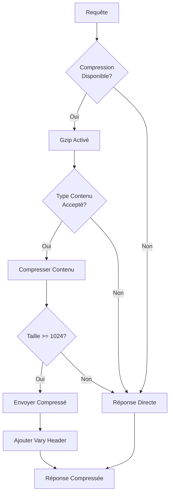

**Sources du Diagramme**
- [nginx.conf](file://nginx.conf#L10-L14)

**Sources de Section**
- [nginx.conf](file://nginx.conf#L10-L14)
- [nginx-frontend.conf](file://nginx-frontend.conf#L10-L13)

## Intégration Docker et Orchestration

### Configuration Docker Compose

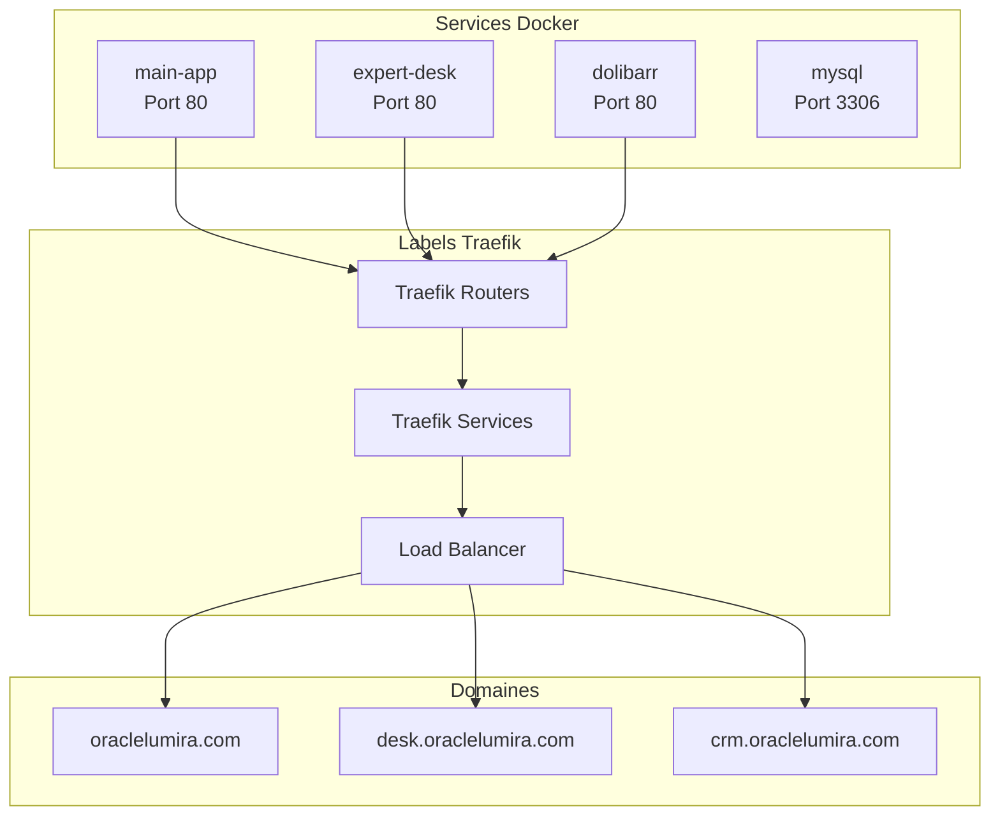

**Sources du Diagramme**
- [docker-compose.yml](file://infrastructure/docker-compose.yml#L4-L38)

### Scripts de Démarrage Optimisés

Le script `start-fullstack-optimized.sh` implémente une séquence de démarrage robuste :

1. **Validation Environnement** : Vérification des prérequis
2. **Démarrage Backend** : Initialisation du service API avec PM2
3. **Attente de Prêt** : Validation du service avant proxy
4. **Tests de Santé** : Vérification des endpoints critiques
5. **Démarrage Nginx** : Configuration et lancement du serveur

### Intégration avec Coolify

La configuration supporte l'orchestration avec Coolify grâce aux endpoints health :

- **/health.json** : Endpoint de santé standardisé
- **Logs Structurés** : Format compatible avec les systèmes de monitoring
- **Variables d'Environnement** : Configuration flexible pour différents environnements

**Sources de Section**
- [docker-compose.yml](file://infrastructure/docker-compose.yml#L1-L41)
- [start-fullstack-optimized.sh](file://start-fullstack-optimized.sh#L1-L82)

## Considérations de Sécurité

### Audit de Sécurité Automatisé

Le projet inclut un système d'audit de sécurité automatisé pour valider la configuration Nginx :

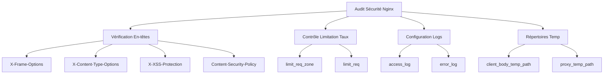

**Sources du Diagramme**
- [nginx-test.ps1](file://security/nginx-test.ps1#L33-L73)

### Protection contre les Attaques

La configuration implémente plusieurs couches de protection :

- **Content Security Policy** : Prévention des injections XSS
- **Restriction des Types MIME** : Protection contre l'exécution de scripts malveillants
- **Limitation des Taux** : Protection contre les attaques DDoS
- **Validation des Chemins** : Prévention d'accès aux fichiers sensibles

### Configuration de Logs Sécurisés

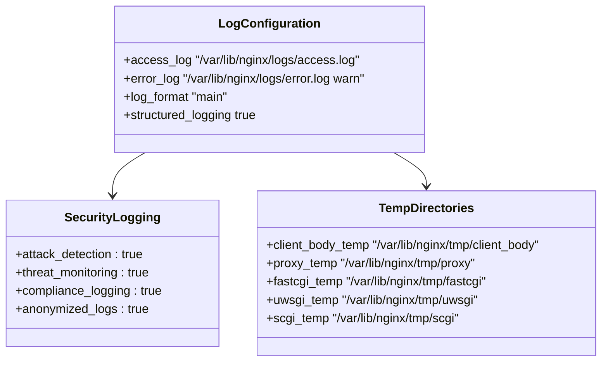

**Sources du Diagramme**
- [apply-fixes.ps1](file://security/apply-fixes.ps1#L90-L125)

**Sources de Section**
- [apply-fixes.ps1](file://security/apply-fixes.ps1#L58-L125)
- [nginx-test.ps1](file://security/nginx-test.ps1#L33-L73)

## Optimisations de Performance

### Cache Intelligent

La configuration implémente un système de cache intelligent basé sur les types de fichiers :

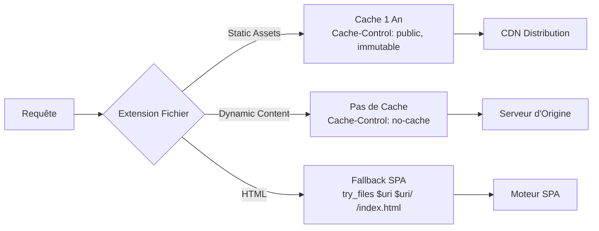

### Compression Multi-niveau

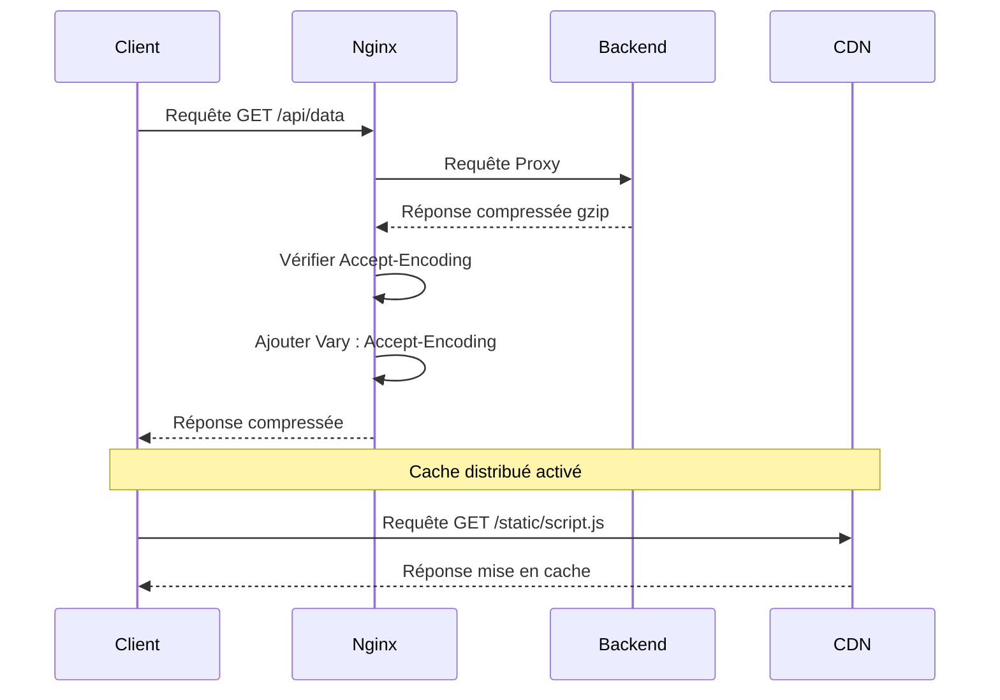

### Optimisations de Réseau

- **Keep-alive Connections** : Maintien des connexions persistantes
- **Sendfile Optimization** : Utilisation de sendfile pour transferts efficaces
- **Buffer Size Tuning** : Optimisation des buffers pour différents types de contenu
- **Connection Pooling** : Réutilisation des connexions vers les backends

## Guide de Dépannage

### Problèmes Courants et Solutions

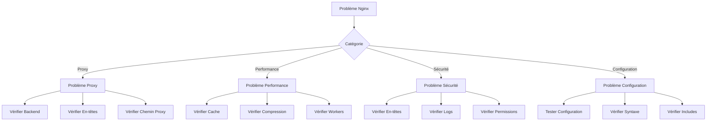

### Scripts de Diagnostic

Le projet inclut plusieurs scripts de diagnostic :

- **test-api-proxy-fix.sh** : Validation du proxy API
- **diagnose-bad-gateway.sh** : Diagnostic des erreurs Bad Gateway
- **validate-fixes.ps1** : Validation des corrections de sécurité
- **full-diagnostic.js** : Diagnostic complet du système

### Métriques de Surveillance

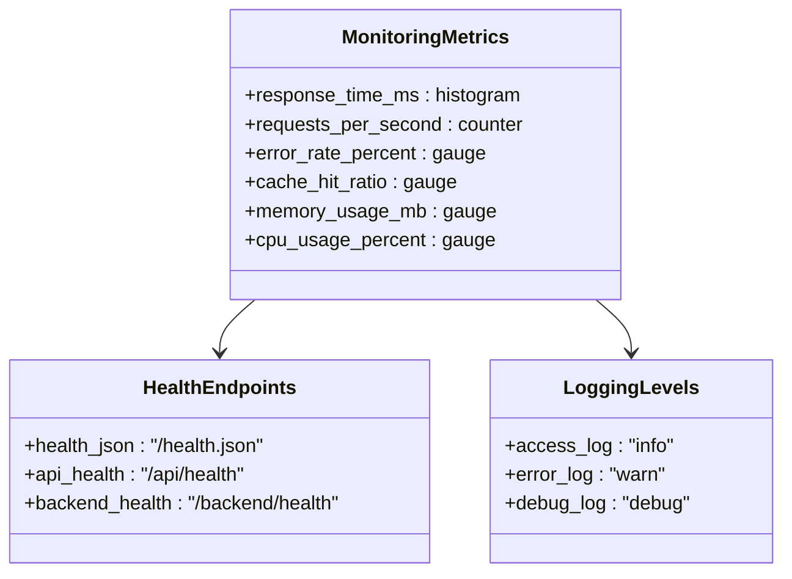

**Sources de Section**
- [start-fullstack-optimized.sh](file://start-fullstack-optimized.sh#L59-L70)

## Conclusion

La configuration du proxy inverse Nginx dans Oracle Lumira V1 MVP représente une architecture robuste et sécurisée pour l'orchestration des applications web modernes. Les trois configurations fournissent des solutions adaptées aux différents cas d'usage :

- **nginx.conf** : Idéale pour les déploiements simples avec backend local
- **nginx-frontend.conf** : Optimisée pour les SPAs avec API externe
- **nginx-fullstack.conf** : Conçue pour les déploiements Docker complets

L'intégration avec Docker et les outils d'orchestration comme Coolify permet une déploiement facile et maintenable. Les considérations de sécurité et de performance garantissent que le système peut supporter des charges élevées tout en maintenant des standards de sécurité élevés.

Les scripts de diagnostic et d'audit automatisés assurent la maintenance continue de la configuration, tandis que les optimisations de cache et de compression garantissent des performances optimales pour les utilisateurs finaux.

Cette architecture constitue une base solide pour l'évolution future du projet, permettant l'ajout de nouveaux services et la montée en charge sans compromettre la sécurité ou les performances.