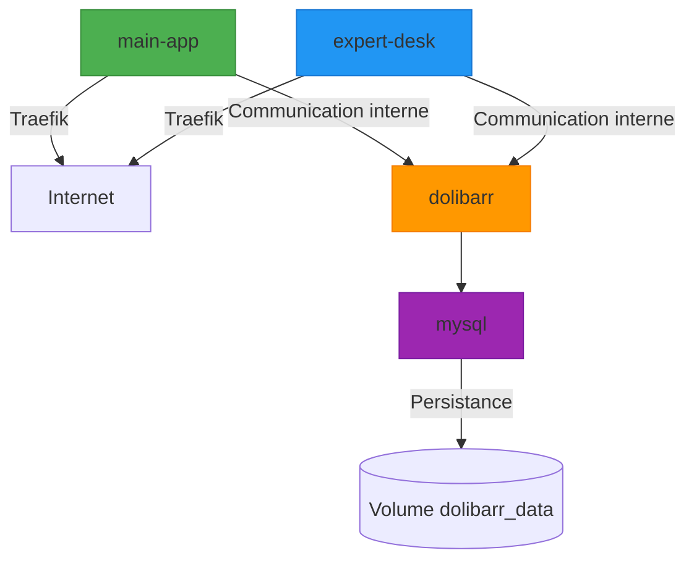

# Orchestration avec Docker

<cite>
**Fichiers référencés dans ce document**   
- [docker-compose.yml](file://infrastructure/docker-compose.yml)
- [Dockerfile](file://apps/main-app/Dockerfile)
- [Dockerfile](file://apps/expert-desk/Dockerfile)
- [nginx.conf](file://apps/expert-desk/nginx.conf)
- [nginx-fullstack.conf](file://nginx-fullstack.conf)
- [start-fullstack.sh](file://start-fullstack.sh)
- [deploy.sh](file://deploy.sh)
</cite>

## Table des matières
1. [Introduction](#introduction)
2. [Structure du fichier docker-compose.yml](#structure-du-fichier-docker-composeyml)
3. [Services définis dans l'orchestration](#services-définis-dans-lorchestration)
4. [Dépendances entre services](#dépendances-entre-services)
5. [Réseaux et configuration réseau](#réseaux-et-configuration-réseau)
6. [Volumes montés et persistance des données](#volumes-montés-et-persistance-des-données)
7. [Variables d'environnement](#variables-denvironnement)
8. [Stratégies de redémarrage](#stratégies-de-redémarrage)
9. [Sécurité et bonnes pratiques](#sécurité-et-bonnes-pratiques)
10. [Commandes Docker Compose courantes](#commandes-docker-compose-courantes)
11. [Intégration au pipeline de déploiement](#intégration-au-pipeline-de-déploiement)
12. [Considérations de production](#considérations-de-production)
13. [Conclusion](#conclusion)

## Introduction

Ce document présente une analyse détaillée de l'orchestration Docker mise en œuvre dans le projet LumiraV1-MVP via le fichier `docker-compose.yml`. L'objectif est de décrire l'architecture d'infrastructure conteneurisée, les services déployés, leurs interdépendances, et les bonnes pratiques appliquées pour assurer une mise en production robuste, sécurisée et évolutible. Le système repose sur Docker Compose pour orchestrer plusieurs applications front-end, un CRM (Dolibarr), et une base de données MySQL, avec une intégration transparente via Traefik comme reverse proxy.

**Section sources**
- [docker-compose.yml](file://infrastructure/docker-compose.yml#L1-L40)

## Structure du fichier docker-compose.yml

Le fichier `docker-compose.yml` est structuré selon la version 3.8 de Docker Compose, garantissant une compatibilité étendue avec les fonctionnalités modernes de Docker. Il définit plusieurs services conteneurisés, chacun avec des configurations spécifiques de construction, de redémarrage, de variables d’environnement, de volumes et d’étiquettes Traefik pour le routage HTTP. La structure hiérarchique permet une gestion claire des dépendances, des réseaux implicites et de la configuration globale.

Le fichier est organisé en trois services principaux : `main-app`, `expert-desk`, et `dolibarr`, chacun représentant une application distincte avec son propre contexte de construction ou image Docker. Aucun réseau explicite n’est défini, ce qui signifie que Docker utilise un réseau par défaut pour permettre la communication entre les conteneurs.

**Section sources**
- [docker-compose.yml](file://infrastructure/docker-compose.yml#L1-L10)

## Services définis dans l'orchestration

### Service main-app

Le service `main-app` correspond à l'application frontale principale de Lumira, accessible via `oraclelumira.com`. Il est construit à partir du Dockerfile situé dans `../apps/main-app`. Le conteneur est nommé `oracle_main` et est configuré pour redémarrer automatiquement sauf si arrêté manuellement (`restart: unless-stopped`). Ce service utilise Traefik pour le routage HTTP, en exposant le port 80 à l’intérieur du conteneur.

### Service expert-desk

Le service `expert-desk` représente une interface dédiée aux experts, accessible via `desk.oraclelumira.com`. Il est construit à partir de `../apps/expert-desk` et nommé `oracle_desk`. Comme `main-app`, il utilise Traefik pour le routage et expose le port 80. Ce service inclut probablement une configuration Nginx interne pour le serveur web statique.

### Service dolibarr

Le service `dolibarr` déploie une instance de Dolibarr CRM via une image Docker officielle (`dolibarr/dolibarr:17`). Il est configuré pour se connecter à une base de données MySQL (service `mysql`) et utilise des variables d’environnement pour la configuration. Le conteneur est nommé `oracle_crm` et expose également le port 80 via Traefik. Un volume nommé `dolibarr_data` est monté pour persister les données applicatives.

**Section sources**
- [docker-compose.yml](file://infrastructure/docker-compose.yml#L11-L40)

## Dépendances entre services

La dépendance entre services est explicitement définie via la directive `depends_on`. Dans le cas du service `dolibarr`, il dépend du service `mysql`, ce qui garantit que la base de données MySQL est démarrée avant que Dolibarr tente de s’y connecter. Cependant, `depends_on` ne vérifie que le démarrage du conteneur, pas la disponibilité du service (par exemple, MySQL en écoute sur le port 3306). Une vérification supplémentaire (healthcheck) serait nécessaire pour une orchestration plus robuste.

Les services `main-app` et `expert-desk` n’ont pas de dépendances explicites, ce qui suggère qu’ils sont autonomes ou communiquent via des services externes ou des API asynchrones.

**Diagram sources**
- [docker-compose.yml](file://infrastructure/docker-compose.yml#L1-L40)

## Réseaux et configuration réseau

Docker Compose crée automatiquement un réseau par défaut pour tous les services définis dans le fichier, permettant la communication inter-conteneur via des noms de service comme noms d’hôte. Par exemple, le service `dolibarr` peut se connecter à `mysql` en utilisant l’adresse `mysql` comme hôte.

Le routage externe est géré par Traefik, qui agit comme reverse proxy. Les étiquettes Docker (`labels`) dans chaque service configurent Traefik pour router les requêtes entrantes en fonction du nom d’hôte (`Host()`). Aucun port n’est exposé directement via `ports`, ce qui renforce la sécurité en centralisant le routage via Traefik.

**Section sources**
- [docker-compose.yml](file://infrastructure/docker-compose.yml#L1-L40)

## Volumes montés et persistance des données

Le service `dolibarr` utilise un volume nommé `dolibarr_data` pour persister les fichiers applicatifs (code, configurations, uploads). Ce volume est monté sur `/var/www/html` à l’intérieur du conteneur, ce qui correspond au répertoire racine du serveur web Apache dans l’image Dolibarr.

L’utilisation de volumes nommés garantit que les données survivent aux redémarrages ou reconstructions des conteneurs. Cependant, le fichier `docker-compose.yml` ne définit pas explicitement le volume dans la section `volumes`, ce qui signifie qu’il est créé automatiquement en mode anonyme ou doit être défini ailleurs (par exemple, dans un fichier de surcouche ou via la CLI).

**Section sources**
- [docker-compose.yml](file://infrastructure/docker-compose.yml#L30-L35)

## Variables d'environnement

Le service `dolibarr` utilise plusieurs variables d’environnement pour sa configuration :

- `DOLI_DB_TYPE`: Type de base de données (mysqli)
- `DOLI_DB_HOST`: Hôte de la base de données (mysql)
- `DOLI_DB_NAME`: Nom de la base de données (dolibarr)
- `DOLI_DB_USER`: Utilisateur de la base de données (dolibarr)
- `DOLI_DB_PASSWORD`: Mot de passe, injecté via une variable d’environnement `${MYSQL_PASSWORD}`
- `DOLI_URL_ROOT`: URL racine de l’application

L’utilisation de `${MYSQL_PASSWORD}` permet d’externaliser les secrets, évitant de les stocker en clair dans le fichier compose. Ces variables doivent être définies dans l’environnement hôte ou via un fichier `.env`.

**Section sources**
- [docker-compose.yml](file://infrastructure/docker-compose.yml#L24-L30)

## Stratégies de redémarrage

Tous les services utilisent la stratégie `restart: unless-stopped`, ce qui signifie que Docker redémarrera automatiquement les conteneurs en cas de panne ou de redémarrage du daemon, sauf s’ils ont été arrêtés manuellement. Cette stratégie assure une haute disponibilité des services critiques comme le front-end et le CRM.

Cette approche est adaptée aux environnements de production où la continuité du service est essentielle, tout en permettant un contrôle manuel lors des mises à jour ou interventions.

**Section sources**
- [docker-compose.yml](file://infrastructure/docker-compose.yml#L6-L7)

## Sécurité et bonnes pratiques

Plusieurs bonnes pratiques de sécurité sont implémentées :

- **Reverse proxy centralisé** : L’utilisation de Traefik limite l’exposition directe des ports des conteneurs.
- **Externalisation des secrets** : Le mot de passe MySQL est injecté via une variable d’environnement, réduisant le risque de fuite.
- **Nom de conteneur explicite** : Facilite la gestion et la surveillance.
- **Pas d’exposition de ports directs** : Renforce la sécurité en évitant les accès non filtrés.

Des améliorations possibles incluent :
- Ajout de `healthcheck` pour s’assurer que les services sont prêts avant d’accepter le trafic.
- Utilisation d’un fichier `.env` chiffré ou d’un gestionnaire de secrets.
- Application de contraintes de ressources (CPU, mémoire) pour éviter la surconsommation.

**Section sources**
- [docker-compose.yml](file://infrastructure/docker-compose.yml#L1-L40)

## Commandes Docker Compose courantes

Les commandes suivantes sont utilisées pour gérer l’orchestration :

- `docker-compose up -d` : Démarre tous les services en arrière-plan.
- `docker-compose down` : Arrête et supprime les conteneurs, réseaux et volumes anonymes.
- `docker-compose logs -f` : Affiche les logs en temps réel.
- `docker-compose restart` : Redémarre les services.
- `docker-compose build` : Reconstruit les images des services.

Ces commandes sont probablement encapsulées dans des scripts comme `start-fullstack.sh` ou `deploy.sh` pour automatiser le déploiement.

**Section sources**
- [start-fullstack.sh](file://start-fullstack.sh)
- [deploy.sh](file://deploy.sh)

## Intégration au pipeline de déploiement

Le fichier `docker-compose.yml` s’intègre dans un pipeline de déploiement automatisé, comme en témoignent les scripts présents dans la racine du projet (`deploy.sh`, `validate-fixes.ps1`, etc.). Le déploiement suit probablement les étapes suivantes :

1. Construction des images Docker.
2. Chargement des variables d’environnement (dont `MYSQL_PASSWORD`).
3. Démarrage des services via `docker-compose up`.
4. Validation de la santé des services.
5. Routage via Traefik.

Des outils comme Coolify sont mentionnés dans la documentation (`COOLIFY-DEPLOYMENT-GUIDE.md`), suggérant une intégration avec des plateformes de déploiement automatisé.

**Section sources**
- [deploy.sh](file://deploy.sh)
- [COOLIFY-DEPLOYMENT-GUIDE.md](file://COOLIFY-DEPLOYMENT-GUIDE.md)

## Considérations de production

Pour une utilisation en production, plusieurs aspects doivent être renforcés :

- **Surveillance** : Intégration avec des outils comme Prometheus/Grafana pour surveiller l’état des conteneurs.
- **Journalisation centralisée** : Utilisation de Fluentd ou ELK pour agréger les logs.
- **Scalabilité** : Actuellement, chaque service tourne en un seul exemplaire. Pour scaler, il faudrait utiliser Docker Swarm ou Kubernetes.
- **Sauvegardes** : Automatiser les sauvegardes du volume `dolibarr_data` et de la base de données MySQL.
- **Mise à jour continue** : Mettre en place un workflow CI/CD pour déployer automatiquement les nouvelles versions.

Le fichier `docker-compose.yml` fournit une base solide, mais une migration vers un orchestrateur plus avancé serait nécessaire pour une infrastructure hautement disponible et scalable.

**Section sources**
- [docker-compose.yml](file://infrastructure/docker-compose.yml#L1-L40)
- [DEPLOYMENT-RUNBOOK-FINAL.md](file://DEPLOYMENT-RUNBOOK-FINAL.md)

## Conclusion

Le fichier `docker-compose.yml` du projet LumiraV1-MVP illustre une orchestration Docker bien structurée, mettant en œuvre des bonnes pratiques en matière de sécurité, de routage et de gestion des dépendances. Il permet un déploiement simple et reproductible de plusieurs applications interconnectées, avec une intégration efficace via Traefik. Pour une montée en charge en production, des améliorations en matière de surveillance, de haute disponibilité et de gestion des états de santé sont recommandées.