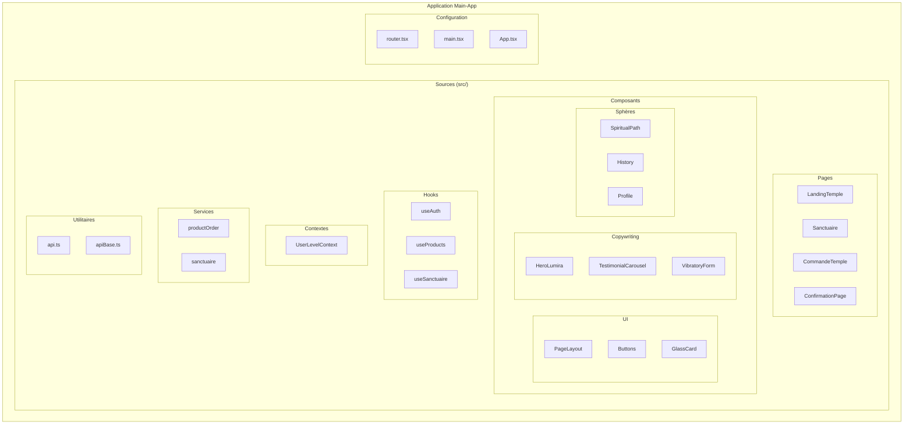
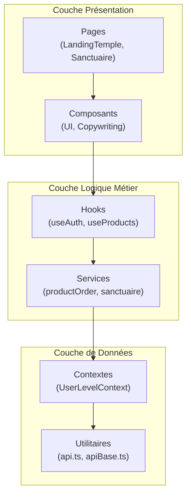
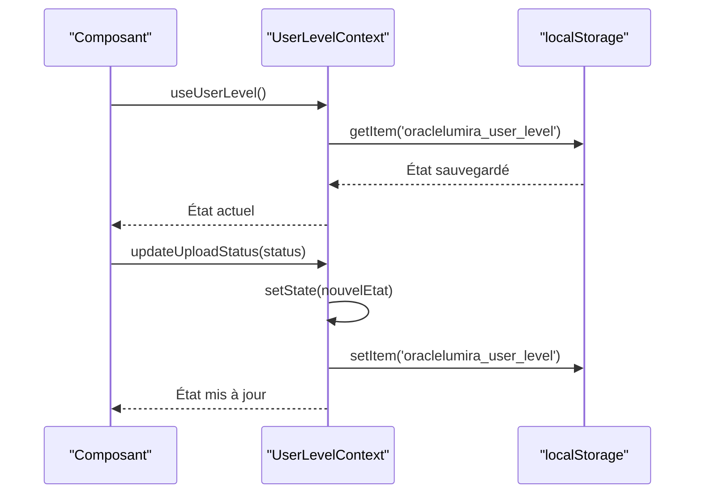
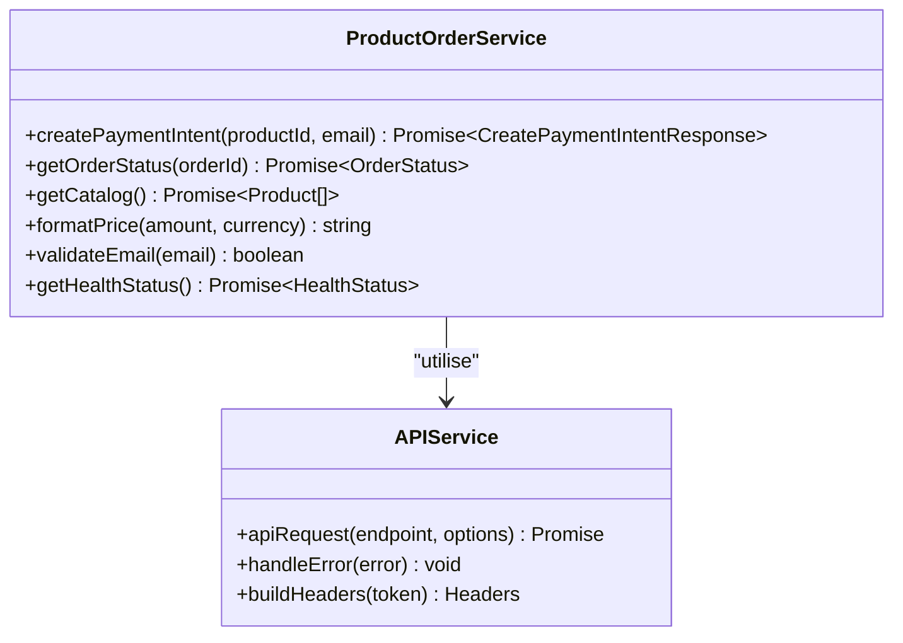
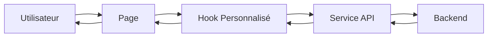

# Architecture Frontend - Application Main-App

<cite>
**Fichiers Référencés dans ce Document**
- [App.tsx](file://apps/main-app/src/App.tsx)
- [router.tsx](file://apps/main-app/src/router.tsx)
- [UserLevelContext.tsx](file://apps/main-app/src/contexts/UserLevelContext.tsx)
- [Sanctuaire.tsx](file://apps/main-app/src/pages/Sanctuaire.tsx)
- [useAuth.ts](file://apps/main-app/src/hooks/useAuth.ts)
- [PageLayout.tsx](file://apps/main-app/src/components/ui/PageLayout.tsx)
- [HeroLumira.tsx](file://apps/main-app/src/components/copywriting/HeroLumira.tsx)
- [productOrder.ts](file://apps/main-app/src/services/productOrder.ts)
</cite>

## Table des Matières
1. [Introduction](#introduction)
2. [Structure du Projet](#structure-du-projet)
3. [Architecture en Couches](#architecture-en-couches)
4. [Composants UI](#composants-ui)
5. [Gestion d'État](#gestion-détat)
6. [Routage](#routage)
7. [Services API](#services-api)
8. [Patterns de Conception](#patterns-de-conception)
9. [Flux de Données](#flux-de-données)
10. [Optimisations et Performance](#optimisations-et-performance)
11. [Guide de Dépannage](#guide-de-dépannage)
12. [Conclusion](#conclusion)

## Introduction

L'application frontend main-app est une architecture moderne React qui implémente une approche en couches pour créer une expérience utilisateur immersive dans le domaine de la spiritualité et de l'astrologie. Cette documentation explore l'architecture complète, depuis les composants UI jusqu'à la gestion d'état globale, en passant par le routage et les services API.

L'application utilise des technologies modernes comme React 18, TypeScript, Tailwind CSS, et Framer Motion pour offrir une interface utilisateur fluide et réactive. L'architecture suit les meilleures pratiques de développement React, incluant l'utilisation de hooks personnalisés, de contextes pour la gestion d'état, et une organisation modulaire des composants.

## Structure du Projet

L'application main-app suit une structure organisée en plusieurs dossiers principaux, chacun ayant un rôle spécifique dans l'architecture globale :



**Sources du Diagramme**
- [App.tsx](file://apps/main-app/src/App.tsx#L1-L104)
- [router.tsx](file://apps/main-app/src/router.tsx#L1-L83)

**Sources de Section**
- [App.tsx](file://apps/main-app/src/App.tsx#L1-L104)
- [router.tsx](file://apps/main-app/src/router.tsx#L1-L83)

## Architecture en Couches

L'architecture frontend de main-app suit un modèle en couches clair, séparant les responsabilités entre différentes couches pour maintenir la modularité et la maintenabilité :

### Couche Présentation (Pages & Composants)

La couche présentation gère l'affichage et l'interaction utilisateur. Elle comprend :

- **Pages** : Composants de haut niveau qui définissent la structure globale des vues
- **Composants UI** : Composants réutilisables pour l'interface utilisateur
- **Composants Copywriting** : Composants spécialisés pour le contenu marketing

### Couche Logique Métier (Hooks & Services)

Cette couche contient la logique métier et la gestion des états complexes :

- **Hooks Personnalisés** : Encapsulent la logique de composants réutilisables
- **Services** : Interfaces avec les APIs externes et la logique métier

### Couche de Données (Contextes & Utilitaires)

Gère la persistance des données et les utilitaires communs :

- **Contextes** : Gestion d'état global partagé
- **Utilitaires** : Fonctions auxiliaires et helpers



**Sources du Diagramme**
- [Sanctuaire.tsx](file://apps/main-app/src/pages/Sanctuaire.tsx#L1-L388)
- [useAuth.ts](file://apps/main-app/src/hooks/useAuth.ts#L1-L30)
- [UserLevelContext.tsx](file://apps/main-app/src/contexts/UserLevelContext.tsx#L1-L199)

## Composants UI

Les composants UI constituent la fondation de l'interface utilisateur, offrant des éléments réutilisables pour construire l'expérience utilisateur. Ils suivent un système de design cohérent basé sur Tailwind CSS et des animations fluides.

### Système de Design

Le système de design repose sur une palette cosmique inspirée de l'univers mystique :

- **Couleurs** : Palette de couleurs cosmiques avec des nuances de violet, or, et bleu
- **Typographie** : Utilisation de fontes comme Cinzel pour un aspect sacré
- **Effets** : Applications de verre (glassmorphism) et ombres subtiles

### Composants Clés

#### PageLayout
Le composant PageLayout fournit une structure de base pour toutes les pages :

```typescript
interface PageLayoutProps {
  children: React.ReactNode;
  variant?: 'dark';
  className?: string;
}
```

Il applique un gradient cosmique sombre comme arrière-plan et centre le contenu avec des marges adaptatives.

#### GlassCard
Un composant de carte avec effet de verre pour une apparence moderne :

```typescript
<GlassCard className="backdrop-blur-xl bg-white/5 border-white/10">
  {/* Contenu */}
</GlassCard>
```

#### Buttons
Boutons stylisés avec effets de survol et transitions fluides.

**Sources de Section**
- [PageLayout.tsx](file://apps/main-app/src/components/ui/PageLayout.tsx#L1-L26)
- [HeroLumira.tsx](file://apps/main-app/src/components/copywriting/HeroLumira.tsx#L1-L136)

## Gestion d'État

L'application utilise React Context pour la gestion d'état global, permettant de partager l'état utilisateur entre différents composants sans prop drilling.

### UserLevelContext

Le UserLevelContext est le cœur de la gestion d'état utilisateur, encapsulant :

```typescript
interface UserLevel {
  currentLevel: string | null;
  purchasedProduct: Product | null;
  purchasedDate: Date | null;
  uploadStatus: 'pending' | 'in-progress' | 'completed';
  uploadedFiles: UploadedFile[];
  availableFeatures: string[];
  hasAccess: boolean;
  profile?: UserProfile;
}
```

### Fonctionnalités du Contexte

1. **Persistance Locale** : L'état est sauvegardé dans localStorage pour la persistance
2. **Validation Hiérarchique** : Vérification des niveaux d'accès utilisateur
3. **Gestion des Fichiers** : Suivi des fichiers téléchargés
4. **Mise à Jour Dynamique** : Méthodes pour modifier l'état de manière réactive

### Hooks Associés

- **useUserLevel** : Hook pour accéder au contexte utilisateur
- **useInitializeUserLevel** : Initialisation après achat



**Sources du Diagramme**
- [UserLevelContext.tsx](file://apps/main-app/src/contexts/UserLevelContext.tsx#L60-L120)

**Sources de Section**
- [UserLevelContext.tsx](file://apps/main-app/src/contexts/UserLevelContext.tsx#L1-L199)

## Routage

L'application utilise React Router DOM pour gérer la navigation entre les différentes pages. Le système de routage est organisé de manière hiérarchique pour optimiser les performances.

### Architecture des Routes

```typescript
const AppRoutes: React.FC = () => (
  <Routes>
    <Route path="/" element={<LandingTemple />} />
    <Route path="/sanctuaire" element={<Sanctuaire />}>
      <Route path="path" element={<LazySpiritualPath />} />
      <Route path="draws" element={<LazyRawDraws />} />
      <Route path="synthesis" element={<LazySynthesis />} />
      <Route path="chat" element={<LazyConversations />} />
      <Route path="profile" element={<LazyProfile />} />
    </Route>
    {/* Autres routes */}
  </Routes>
);
```

### Optimisations de Routage

1. **Lazy Loading** : Les composants des sphères sont chargés dynamiquement
2. **Suspense Fallback** : Affichage d'un Skeleton pendant le chargement
3. **Outlet** : Système de rendu imbriqué pour les sous-pages

### Navigation Programmatique

L'application utilise `useNavigate` pour la navigation programmatique, permettant aux composants de rediriger l'utilisateur sans lien traditionnel.

**Sources de Section**
- [router.tsx](file://apps/main-app/src/router.tsx#L1-L83)
- [Sanctuaire.tsx](file://apps/main-app/src/pages/Sanctuaire.tsx#L1-L388)

## Services API

Les services API encapsulent la logique de communication avec les backends, offrant une interface cohérente pour les requêtes réseau.

### Architecture des Services



**Sources du Diagramme**
- [productOrder.ts](file://apps/main-app/src/services/productOrder.ts#L1-L105)

### Fonctionnalités Principales

1. **Création d'Intents de Paiement** : Intégration Stripe pour les transactions
2. **Gestion des Commandes** : Suivi des statuts de commande
3. **Catalogue Produits** : Récupération des produits disponibles
4. **Validation** : Validation des emails et formats de données
5. **Santé API** : Vérification de la disponibilité des services

### Patterns Utilisés

- **Async/Await** : Gestion asynchrone des requêtes
- **Error Handling** : Gestion centralisée des erreurs
- **Type Safety** : Typage strict pour les réponses API

**Sources de Section**
- [productOrder.ts](file://apps/main-app/src/services/productOrder.ts#L1-L105)

## Patterns de Conception

L'application implémente plusieurs patterns de conception modernes pour améliorer la maintenabilité et la scalabilité.

### Composants Fonctionnels

Tous les composants utilisent la syntaxe fonctionnelle avec TypeScript, offrant :

- **Type Safety** : Typage strict pour les props et états
- **Hooks** : Utilisation extensive des hooks React
- **Composition** : Composition de composants plutôt que d'héritage

### Hooks Personnalisés

Les hooks personnalisés encapsulent la logique réutilisable :

```typescript
export const useAuth = () => {
  const [user, setUser] = useState<User | null>(null);
  const [token, setToken] = useState<string | null>(null);

  useEffect(() => {
    // Logique d'authentification
  }, []);

  return { user, token, isAuthenticated: !!token };
};
```

### Pattern Provider/Consumer

Le pattern Provider/Consumer est utilisé pour la gestion d'état global :

```typescript
<UserLevelProvider>
  <Router>
    <AppRoutes />
  </Router>
</UserLevelProvider>
```

### Pattern Factory

Les composants de copywriting suivent un pattern factory pour générer des variantes :

```typescript
export interface HeroLumiraProps {
  title: string;
  subTitle: string;
  ctaLabel: string;
  perks: string[];
  onCTAClick?: () => void;
}
```

**Sources de Section**
- [useAuth.ts](file://apps/main-app/src/hooks/useAuth.ts#L1-L30)
- [HeroLumira.tsx](file://apps/main-app/src/components/copywriting/HeroLumira.tsx#L1-L136)

## Flux de Données

Le flux de données dans l'application suit un pattern unidirectionnel, facilitant la prévisibilité et la maintenance.

### Flux Principal



**Sources du Diagramme**
- [Sanctuaire.tsx](file://apps/main-app/src/pages/Sanctuaire.tsx#L1-L388)
- [useAuth.ts](file://apps/main-app/src/hooks/useAuth.ts#L1-L30)

### Exemple Concret : Formulaire de Commande

1. **Interaction Utilisateur** : Clic sur le bouton de commande
2. **Page** : Gère l'état du formulaire
3. **Hook** : Valide les données et prépare la requête
4. **Service** : Envoie la requête d'intent de paiement
5. **Backend** : Traite la requête et retourne l'intent
6. **Service** : Traite la réponse
7. **Hook** : Met à jour l'état local
8. **Page** : Affiche le résultat à l'utilisateur

### Gestion des États Asynchrones

L'application utilise des patterns pour gérer les états asynchrones :

- **Loading States** : Indicateurs visuels pendant les requêtes
- **Error Boundaries** : Gestion des erreurs de réseau
- **Success States** : Feedback positif pour les opérations réussies

**Sources de Section**
- [Sanctuaire.tsx](file://apps/main-app/src/pages/Sanctuaire.tsx#L1-L388)
- [productOrder.ts](file://apps/main-app/src/services/productOrder.ts#L1-L105)

## Optimisations et Performance

L'application implémente plusieurs optimisations pour garantir des performances optimales.

### Lazy Loading

Les composants volumineux sont chargés de manière lazy :

```typescript
const LazySpiritualPath = React.lazy(() => import('./components/spheres/SpiritualPath'));
```

### Code Splitting

Le bundler Vite effectue automatiquement le code splitting pour optimiser les temps de chargement.

### Memoization

Utilisation de `React.memo` pour éviter les re-rendus inutiles :

```typescript
export default React.memo(HeroLumira);
```

### Optimisations CSS

- **Tailwind CSS** : Classes utilitaires pour un CSS minimal
- **CSS Variables** : Variables pour les couleurs et espacements
- **Animations** : Utilisation de Framer Motion pour des animations fluides

### Performance des Images

- **Optimisation** : Images compressées et formatées
- **Lazy Loading** : Images chargées seulement lorsqu'elles sont visibles
- **Responsive** : Images adaptatives selon la taille d'écran

## Guide de Dépannage

### Problèmes Courants

1. **Context Non Disponible**
   - **Symptôme** : Erreur "useUserLevel must be used within a UserLevelProvider"
   - **Solution** : Vérifier que le provider enveloppe bien le composant

2. **Routes Non Chargées**
   - **Symptôme** : Composants non affichés
   - **Solution** : Vérifier les imports lazy et les chemins de route

3. **Problèmes d'Authentification**
   - **Symptôme** : Token manquant ou invalide
   - **Solution** : Vérifier localStorage et les headers d'API

### Debugging

L'application inclut des logs de débogage conditionnels :

```typescript
const DEBUG = import.meta.env.DEV || import.meta.env.VITE_DEBUG === 'true';
if (DEBUG) console.log('Debug message');
```

### Outils de Développement

- **React DevTools** : Inspection des composants et états
- **Network Tab** : Surveillance des requêtes API
- **Console Logs** : Messages de débogage intégrés

## Conclusion

L'architecture frontend de main-app représente une approche moderne et structurée pour développer des applications React complexes. Elle combine les meilleures pratiques de développement avec des technologies avancées pour offrir une expérience utilisateur exceptionnelle.

### Points Forts

1. **Modularité** : Organisation claire des dossiers et fichiers
2. **Réutilisabilité** : Composants et hooks réutilisables
3. **Performance** : Optimisations intégrées pour les temps de chargement
4. **Maintenabilité** : Code bien structuré et documenté
5. **Extensibilité** : Architecture facilement extensible

### Recommandations Futures

1. **Tests** : Implémentation d'une suite de tests unitaires et d'intégration
2. **Monitoring** : Ajout de métriques de performance et d'erreurs
3. **Internationalisation** : Support multilingue pour une audience mondiale
4. **Accessibility** : Amélioration de l'accessibilité pour tous les utilisateurs

Cette architecture fournit une base solide pour l'évolution continue de l'application, permettant d'ajouter de nouvelles fonctionnalités tout en maintenant la qualité du code et les performances utilisateur.