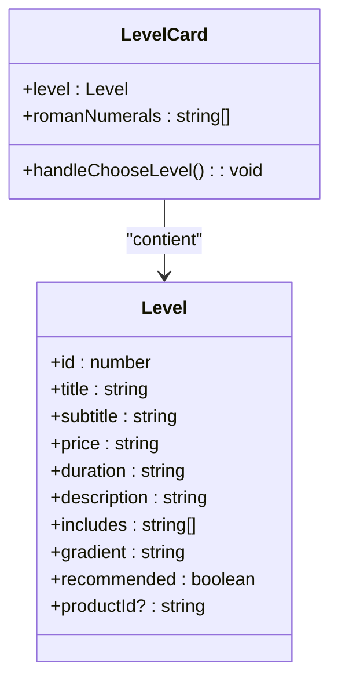
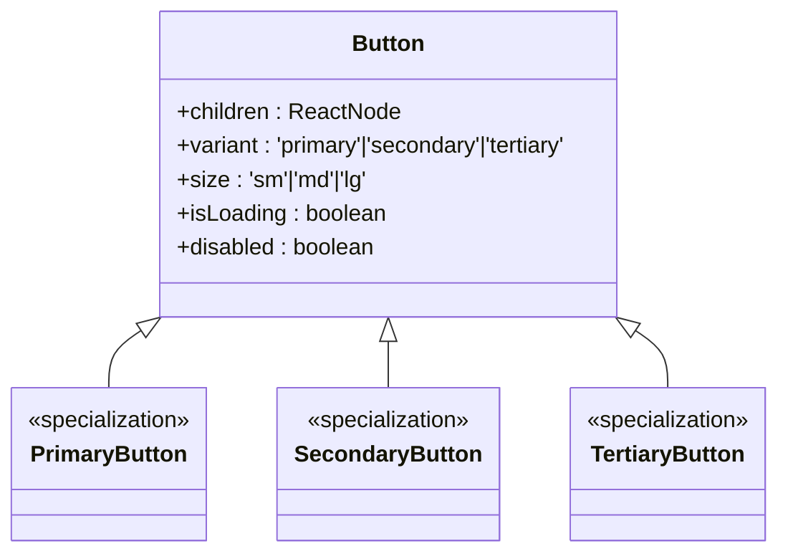
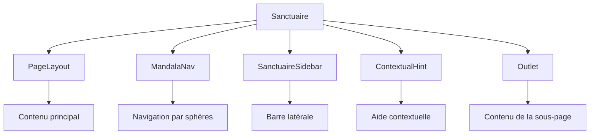

# Composants UI

<cite>
**Fichiers référencés dans ce document**  
- [HeroLumira.tsx](file://apps/main-app/src/components/copywriting/HeroLumira.tsx)
- [SpiritualPath.tsx](file://apps/main-app/src/components/spheres/SpiritualPath.tsx)
- [LevelCard.tsx](file://apps/main-app/src/components/LevelCard.tsx)
- [UpsellSection.tsx](file://apps/main-app/src/components/UpsellSection.tsx)
- [Buttons.tsx](file://apps/main-app/src/components/ui/Buttons.tsx)
- [GlassCard.tsx](file://apps/main-app/src/components/ui/GlassCard.tsx)
- [PageLayout.tsx](file://apps/main-app/src/components/ui/PageLayout.tsx)
- [ParticleSystem.tsx](file://apps/main-app/src/components/ParticleSystem.tsx)
- [StarField.tsx](file://apps/main-app/src/components/micro/StarField.tsx)
- [MandalaNav.tsx](file://apps/main-app/src/components/mandala/MandalaNav.tsx)
- [LandingTemple.tsx](file://apps/main-app/src/pages/LandingTemple.tsx)
- [Sanctuaire.tsx](file://apps/main-app/src/pages/Sanctuaire.tsx)
</cite>

## Table des matières
1. [Introduction](#introduction)
2. [Structure par dossiers](#structure-par-dossiers)
3. [Composants principaux](#composants-principaux)
4. [Composants réutilisables](#composants-réutilisables)
5. [Intégration dans les pages](#intégration-dans-les-pages)
6. [Animations et effets visuels](#animations-et-effets-visuels)
7. [Bonnes pratiques](#bonnes-pratiques)
8. [Conclusion](#conclusion)

## Introduction
Cette documentation présente en détail les composants UI de l'application main-app, en mettant l'accent sur leur structure, leur comportement visuel et leur intégration dans l'expérience utilisateur. Les composants sont conçus pour créer une interface immersive et spirituelle, utilisant des animations subtiles, des effets de particules et une hiérarchie visuelle soignée.

## Structure par dossiers
La structure des composants UI suit une organisation thématique claire, facilitant la maintenance et la réutilisation. Chaque dossier regroupe des composants ayant des responsabilités similaires.

### Organisation des dossiers
- **copywriting** : Composants centrés sur le contenu textuel et les sections marketing (HeroLumira, DimensionalUpsells)
- **spheres** : Composants liés aux différentes sphères spirituelles (SpiritualPath, Conversations, Profile)
- **ui** : Composants réutilisables de base (boutons, cartes, en-têtes)
- **layout** : Composants de structure de page (SanctuaireSidebar)
- **mandala** : Composants de navigation et d'interface centrés sur le mandala
- **micro** : Petits composants d'animation (StarField)
- **sanctuaire** : Composants spécifiques à l'expérience du sanctuaire

**Section sources**
- [HeroLumira.tsx](file://apps/main-app/src/components/copywriting/HeroLumira.tsx)
- [SpiritualPath.tsx](file://apps/main-app/src/components/spheres/SpiritualPath.tsx)
- [Buttons.tsx](file://apps/main-app/src/components/ui/Buttons.tsx)

## Composants principaux

### HeroLumira
Le composant HeroLumira est la section d'en-tête principale de la page d'accueil, conçue pour captiver l'utilisateur dès son arrivée.

**Props**
- `title` : Titre principal (string)
- `subTitle` : Sous-titre descriptif (string)
- `ctaLabel` : Texte du bouton d'appel à l'action (string)
- `perks` : Liste des avantages à afficher (string[])
- `onCTAClick` : Fonction appelée lors du clic sur le CTA (fonction)
- `className` : Classes CSS supplémentaires (string)

**Comportement visuel**
- Animation d'apparition progressive avec Framer Motion
- Icône centrale avec animation de rotation continue
- Arrière-plan gradient avec motif de points cosmiques
- Carte en verre (GlassCard) pour les avantages avec animations séquentielles

**Section sources**
- [HeroLumira.tsx](file://apps/main-app/src/components/copywriting/HeroLumira.tsx)

### SpiritualPath
Ce composant affiche le parcours spirituel de l'utilisateur, montrant sa progression à travers différents niveaux.

**Props**
- `level` : Niveau actuel (1|2|3|4)
- `completed` : Nombre d'étapes complétées (number)
- `total` : Nombre total d'étapes (number)

**Comportement visuel**
- Animation de chargement avec skeleton screen
- Indicateur de progression circulaire avec Framer Motion
- Timeline horizontale avec cercles représentant chaque étape
- Gestion des états vides avec EmptyState

**Section sources**
- [SpiritualPath.tsx](file://apps/main-app/src/components/spheres/SpiritualPath.tsx)

### LevelCard
Le composant LevelCard représente un niveau d'initiation disponible, permettant à l'utilisateur de choisir son parcours.

**Props**
- `level` : Objet contenant les détails du niveau (id, title, subtitle, price, duration, description, includes, gradient, recommended, productId)

**Comportement visuel**
- Animation de survol avec agrandissement subtil
- Badge "Populaire" animé pour les niveaux recommandés
- Effet de particules au survol
- Icône numérique romaine avec animation de halo
- Effet de vague lumineuse sur le bouton CTA

**Diagram sources**
- [LevelCard.tsx](file://apps/main-app/src/components/LevelCard.tsx)

### UpsellSection
Ce composant présente des offres complémentaires pour enrichir l'expérience utilisateur.

**Props**
- Aucune props requise, utilise des données internes

**Comportement visuel**
- Grille responsive de cartes d'offres
- Animations d'apparition séquentielles
- Effets de nébuleuse au survol
- Icônes thématiques pour chaque type d'offre
- Animations de texte lumineux

**Section sources**
- [UpsellSection.tsx](file://apps/main-app/src/components/UpsellSection.tsx)

## Composants réutilisables

### Boutons (Buttons.tsx)
Système de boutons standardisé avec plusieurs variantes.

**Variantes**
- **Primary** : Dégradé doré, pour les actions principales
- **Secondary** : Translucide avec bordure, pour les actions secondaires
- **Tertiary** : Texte seulement, pour les liens ou actions mineures

**Tailles**
- sm : Petit
- md : Moyen (par défaut)
- lg : Grand

**Fonctionnalités**
- Support du chargement (isLoading)
- Animations de survol avec Framer Motion
- Accessibilité intégrée

**Diagram sources**
- [Buttons.tsx](file://apps/main-app/src/components/ui/Buttons.tsx)

### GlassCard
Composant de carte en verre utilisée pour contenir du contenu important.

**Props**
- `children` : Contenu à afficher
- `className` : Classes CSS supplémentaires

**Style**
- Arrière-plan translucide avec dégradé
- Flou d'arrière-plan (backdrop-blur)
- Bordure subtile
- Coins arrondis

**Section sources**
- [GlassCard.tsx](file://apps/main-app/src/components/ui/GlassCard.tsx)

### PageLayout
Composant de mise en page de page avec thème sombre cosmique.

**Props**
- `children` : Contenu de la page
- `variant` : Variante de style ('dark')
- `className` : Classes CSS supplémentaires

**Section sources**
- [PageLayout.tsx](file://apps/main-app/src/components/ui/PageLayout.tsx)

## Intégration dans les pages

### LandingTemple
Page d'accueil principale qui orchestre plusieurs composants.

**Composants utilisés**
- Hero : Section d'en-tête
- LevelsSection : Grille des niveaux disponibles
- DynamicForm : Formulaire interactif
- Testimonials : Témoignages des utilisateurs
- UpsellSection : Offres complémentaires
- Footer : Pied de page

**Section sources**
- [LandingTemple.tsx](file://apps/main-app/src/pages/LandingTemple.tsx)

### Sanctuaire
Page principale du sanctuaire personnel de l'utilisateur.

**Composants utilisés**
- PageLayout : Structure de page
- MandalaNav : Navigation centrale
- SanctuaireSidebar : Barre latérale
- ContextualHint : Aides contextuelles
- Outlet : Conteneur pour les sous-pages

**Fonctionnalités**
- Navigation par mandala interactif
- Statut de progression visible
- Interface responsive avec adaptation mobile
- Gestion des états (profil complété/non complété)

**Diagram sources**
- [Sanctuaire.tsx](file://apps/main-app/src/pages/Sanctuaire.tsx)

## Animations et effets visuels

### ParticleSystem
Système de particules animées en canvas pour créer une ambiance cosmique.

**Fonctionnalités**
- Particules dorées et blanches
- Mouvement fluide avec rebond sur les bords
- Effet de halo pour les particules dorées
- Adaptation à la taille de l'écran
- Animation fluide à 60fps

**Section sources**
- [ParticleSystem.tsx](file://apps/main-app/src/components/ParticleSystem.tsx)

### StarField
Animation de champ d'étoiles avec apparition séquentielle.

**Fonctionnalités**
- Apparition progressive des étoiles
- Effet de halo cosmique
- Adaptation au mode de préférence de réduction d'animation
- Animation fluide avec Framer Motion

**Section sources**
- [StarField.tsx](file://apps/main-app/src/components/micro/StarField.tsx)

### MandalaNav
Composant de navigation centrale en forme de mandala.

**Fonctionnalités**
- Disposition pentagonale des sphères
- Indicateurs de progression circulaires
- Animations de survol et de sélection
- Guide pour les nouveaux utilisateurs
- Adaptation mobile avec navigation fixe

**Section sources**
- [MandalaNav.tsx](file://apps/main-app/src/components/mandala/MandalaNav.tsx)

## Bonnes pratiques

### Accessibilité
