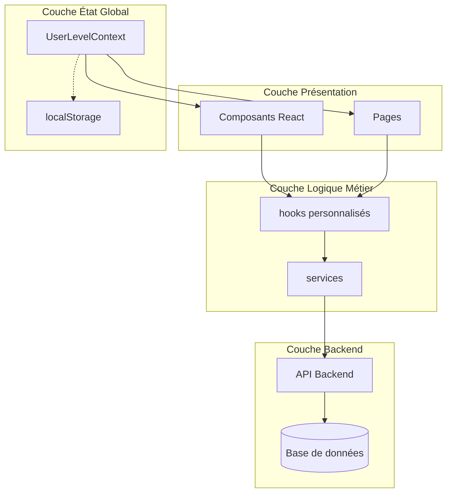
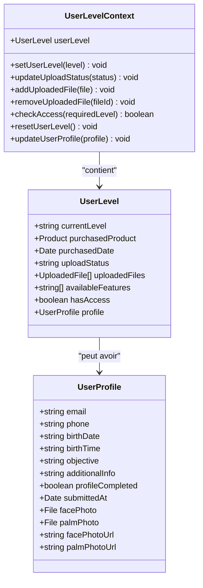
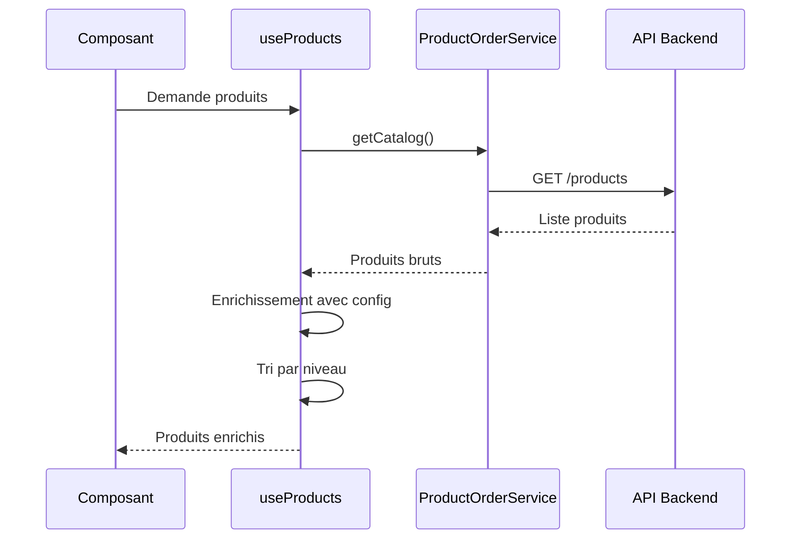
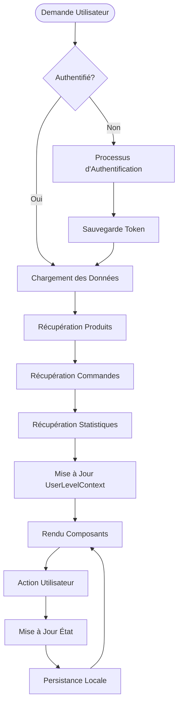
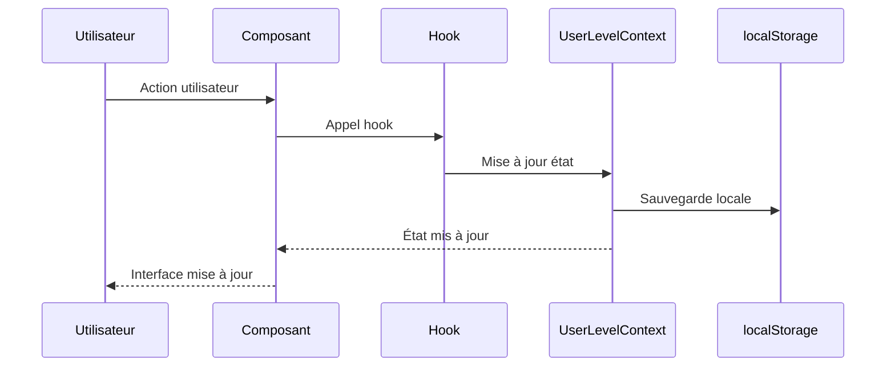
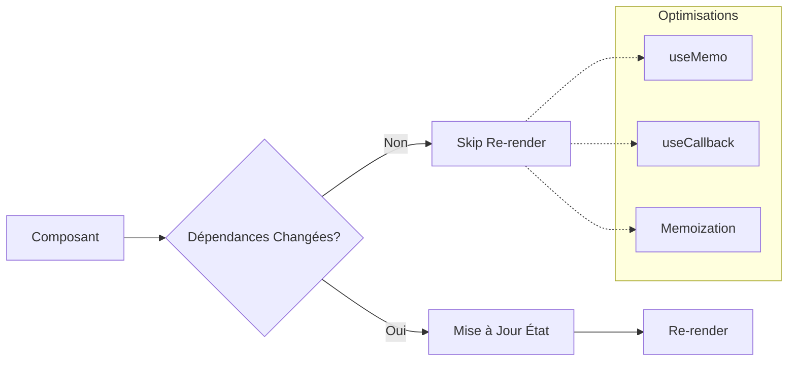
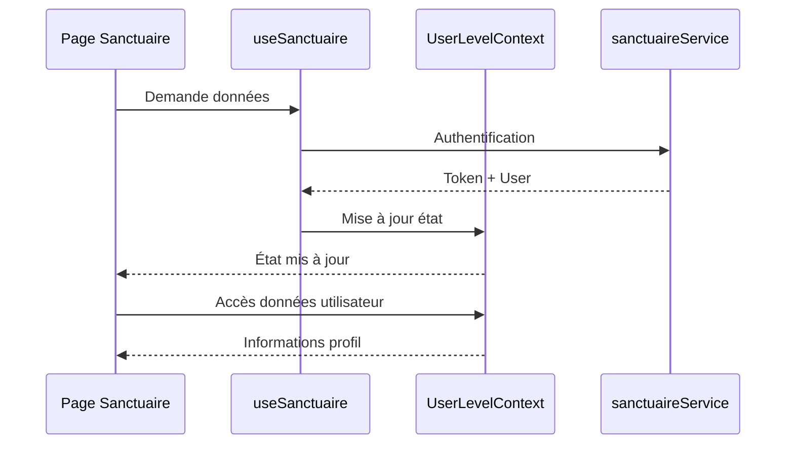

# Gestion d'état

<cite>
**Fichiers Référencés dans ce Document**
- [UserLevelContext.tsx](file://apps/main-app/src/contexts/UserLevelContext.tsx)
- [useAuth.ts](file://apps/main-app/src/hooks/useAuth.ts)
- [useProducts.ts](file://apps/main-app/src/hooks/useProducts.ts)
- [useSanctuaire.ts](file://apps/main-app/src/hooks/useSanctuaire.ts)
- [useScrollAnimation.ts](file://apps/main-app/src/hooks/useScrollAnimation.ts)
- [Sanctuaire.tsx](file://apps/main-app/src/pages/Sanctuaire.tsx)
- [LandingTemple.tsx](file://apps/main-app/src/pages/LandingTemple.tsx)
- [sanctuaire.ts](file://apps/main-app/src/services/sanctuaire.ts)
</cite>

## Table des matières
1. [Introduction](#introduction)
2. [Architecture de la Gestion d'État](#architecture-de-la-gestion-détat)
3. [React Context - UserLevelContext](#react-context---userlevelcontext)
4. [Hooks Personnalisés](#hooks-personnalisés)
5. [Flux de Données](#flux-de-données)
6. [Stratégies de Cache et Synchronisation](#stratégies-de-cache-et-synchronisation)
7. [Gestion des États de Chargement](#gestion-des-états-de-chargement)
8. [Optimisations de Performance](#optimisations-de-performance)
9. [Exemples d'Utilisation Concrets](#exemples-dutilisation-concrets)
10. [Guide de Dépannage](#guide-de-dépannage)
11. [Conclusion](#conclusion)

## Introduction

Le système de gestion d'état de l'application Oracle Lumira utilise une architecture hybride combinant React Context pour l'état partagé global et des hooks personnalisés pour la logique métier spécifique. Cette approche permet une distribution efficace de l'état tout en maintenant la simplicité et la maintenabilité du code.

L'architecture repose sur trois piliers principaux :
- **UserLevelContext** : Gestion de l'état utilisateur global
- **Hooks personnalisés** : Logique métier spécialisée
- **Services** : Communication backend et gestion des données

## Architecture de la Gestion d'État



**Sources du diagramme**
- [UserLevelContext.tsx](file://apps/main-app/src/contexts/UserLevelContext.tsx#L1-L199)
- [useAuth.ts](file://apps/main-app/src/hooks/useAuth.ts#L1-L30)
- [useProducts.ts](file://apps/main-app/src/hooks/useProducts.ts#L1-L90)

## React Context - UserLevelContext

### Structure et Types

Le `UserLevelContext` constitue le cœur de la gestion d'état global, centralisant toutes les informations relatives au niveau utilisateur, aux produits achetés et aux fonctionnalités disponibles.

```typescript
export interface UserLevel {
  currentLevel: string | null;
  purchasedProduct: Product | null;
  purchasedDate: Date | null;
  uploadStatus: 'pending' | 'in-progress' | 'completed';
  uploadedFiles: UploadedFile[];
  availableFeatures: string[];
  hasAccess: boolean;
  profile?: UserProfile;
}
```

### Fonctionnalités Principales

Le contexte offre plusieurs méthodes essentielles :

1. **Gestion du cycle de vie** : Chargement et sauvegarde automatique dans localStorage
2. **Manipulation des fichiers** : Ajout, suppression et suivi des uploads
3. **Contrôle d'accès** : Hiérarchie des niveaux et vérification des permissions
4. **Mise à jour du profil** : Gestion des informations utilisateur



**Sources du diagramme**
- [UserLevelContext.tsx](file://apps/main-app/src/contexts/UserLevelContext.tsx#L10-L47)

### Stratégies de Persistance

Le contexte implémente une stratégie de persistance robuste utilisant localStorage :

```typescript
// Chargement automatique au montage
useEffect(() => {
  const savedLevel = localStorage.getItem('oraclelumira_user_level');
  if (savedLevel) {
    try {
      const parsedLevel = JSON.parse(savedLevel);
      // Conversion des dates depuis string
      if (parsedLevel.purchasedDate) {
        parsedLevel.purchasedDate = new Date(parsedLevel.purchasedDate);
      }
      setUserLevel(parsedLevel);
    } catch (error) {
      console.error('Error parsing saved user level:', error);
      localStorage.removeItem('oraclelumira_user_level');
    }
  }
}, []);
```

**Sources de la section**
- [UserLevelContext.tsx](file://apps/main-app/src/contexts/UserLevelContext.tsx#L55-L75)

## Hooks Personnalisés

### useAuth - Gestion de Session

Le hook `useAuth` fournit une abstraction simple pour gérer l'authentification utilisateur :

```typescript
export const useAuth = () => {
  const [user, setUser] = useState<User | null>(null);
  const [token, setToken] = useState<string | null>(null);

  useEffect(() => {
    try {
      const raw = localStorage.getItem('user_me');
      const t = localStorage.getItem('token');
      setToken(t);
      if (raw) {
        const parsed = JSON.parse(raw);
        setUser(parsed);
      }
    } catch (e) {
      setUser(null);
      setToken(null);
    }
  }, []);

  return { user, token, isAuthenticated: !!token };
};
```

### useProducts - Récupération Produits

Ce hook gère la récupération et l'enrichissement des produits disponibles :



**Sources du diagramme**
- [useProducts.ts](file://apps/main-app/src/hooks/useProducts.ts#L45-L65)

### useSanctuaire - Accès au Sanctuaire

Le hook `useSanctuaire` orchestre l'accès au sanctuaire spirituel avec gestion d'état complexe :

```typescript
export function useSanctuaire() {
  const [isAuthenticated, setIsAuthenticated] = useState(false);
  const [user, setUser] = useState<SanctuaireUser | null>(null);
  const [orders, setOrders] = useState<CompletedOrder[]>([]);
  const [stats, setStats] = useState<SanctuaireStats | null>(null);
  const [loading, setLoading] = useState(true);
  const [error, setError] = useState<string | null>(null);
  
  // Logique de chargement et d'authentification
}
```

### useScrollAnimation - Effets Visuels

Ce hook minimaliste gère les animations basées sur le scrolling :

```typescript
export const useScrollAnimation = () => {
  const [scrollY, setScrollY] = useState(0);

  useEffect(() => {
    const handleScroll = () => {
      setScrollY(window.scrollY);
    };

    window.addEventListener('scroll', handleScroll);
    return () => window.removeEventListener('scroll', handleScroll);
  }, []);

  return scrollY;
};
```

**Sources de la section**
- [useAuth.ts](file://apps/main-app/src/hooks/useAuth.ts#L1-L30)
- [useProducts.ts](file://apps/main-app/src/hooks/useProducts.ts#L45-L90)
- [useSanctuaire.ts](file://apps/main-app/src/hooks/useSanctuaire.ts#L1-L114)
- [useScrollAnimation.ts](file://apps/main-app/src/hooks/useScrollAnimation.ts#L1-L34)

## Flux de Données

### Architecture de Flux



**Sources du diagramme**
- [UserLevelContext.tsx](file://apps/main-app/src/contexts/UserLevelContext.tsx#L55-L75)
- [useSanctuaire.ts](file://apps/main-app/src/hooks/useSanctuaire.ts#L15-L45)

### Exemple de Flux Complexe

Dans la page Sanctuaire, le flux suit cette séquence :

1. **Initialisation** : Vérification de l'authentification
2. **Chargement** : Récupération des commandes et statistiques
3. **Affichage** : Présentation du tableau de bord
4. **Interaction** : Mise à jour des données en temps réel

**Sources de la section**
- [Sanctuaire.tsx](file://apps/main-app/src/pages/Sanctuaire.tsx#L1-L388)

## Stratégies de Cache et Synchronisation

### Cache Local

Le système utilise localStorage comme cache primaire avec synchronisation automatique :

```typescript
// Sauvegarde automatique dans localStorage
useEffect(() => {
  if (userLevel.currentLevel) {
    localStorage.setItem('oraclelumira_user_level', JSON.stringify(userLevel));
  }
}, [userLevel]);
```

### Cache API

Les hooks implémentent des stratégies de cache intelligente :

- **Produits** : Cache en mémoire avec revalidation périodique
- **Commandes** : Cache local avec synchronisation push
- **Statistiques** : Cache optimiste avec invalidation manuelle

### Synchronisation en Temps Réel



**Sources du diagramme**
- [UserLevelContext.tsx](file://apps/main-app/src/contexts/UserLevelContext.tsx#L75-L85)

## Gestion des États de Chargement

### Stratégies de Loading States

Chaque hook implémente ses propres stratégies de loading :

```typescript
// useProducts
const [isLoading, setIsLoading] = useState(true);
const [error, setError] = useState<Error | null>(null);

// useSanctuaire
const [loading, setLoading] = useState(true);
const [error, setError] = useState<string | null>(null);
```

### Patterns de Loading

1. **Loading Initial** : Affichage pendant la première requête
2. **Loading Incremental** : Mise à jour partielle des données
3. **Loading Optimiste** : Interface immédiate avec feedback asynchrone

### Gestion d'Erreurs

```typescript
const handleError = (error: any) => {
  setError(error.message || 'Erreur inattendue');
  setLoading(false);
  
  // Logique de retry automatique
  if (error.status === 500) {
    setTimeout(loadUserData, 5000);
  }
};
```

**Sources de la section**
- [useProducts.ts](file://apps/main-app/src/hooks/useProducts.ts#L45-L65)
- [useSanctuaire.ts](file://apps/main-app/src/hooks/useSanctuaire.ts#L15-L25)

## Optimisations de Performance

### useMemo et useCallback

Le code utilise ces hooks pour éviter les re-rendus inutiles :

```typescript
// Memoisation du produit par niveau
export const useProductByLevel = (level: string) => {
  const { data, isLoading, error } = useProducts();
  const product = useMemo(() => 
    data?.find((p) => p.level === level) || null, 
    [data, level]
  );
  return { data: product, isLoading, error };
};
```

### Éviter les Re-rendus



### Mémoisation des Calculs Coûteux

```typescript
// Configuration d'upload par niveau
const getLevelUploadConfig = (level: string) => {
  const configs = {
    initie: { /* config */ },
    mystique: { /* config */ },
    profond: { /* config */ },
    integrale: { /* config */ }
  };
  return (configs as any)[level] || configs.initie;
};
```

**Sources de la section**
- [useProducts.ts](file://apps/main-app/src/hooks/useProducts.ts#L65-L75)

## Exemples d'Utilisation Concrets

### Dans la Page LandingTemple

La page utilise plusieurs hooks pour construire son interface :

```typescript
const LandingTemple: React.FC = () => {
  const { user } = useAuth();
  const { userLevel } = useUserLevel();
  const { data: products, isLoading } = useProducts();
  
  return (
    <div className="min-h-screen">
      <Hero />
      <LevelsSection />
      <DynamicForm />
      <Testimonials />
      <UpsellSection />
      <Footer />
    </div>
  );
};
```

### Dans la Page Sanctuaire

Le Sanctuaire utilise une architecture plus complexe :

```typescript
const Sanctuaire: React.FC = () => {
  const { user } = useAuth();
  const { userLevel } = useUserLevel();
  const { 
    isAuthenticated, 
    user: sanctuaireUser, 
    orders, 
    stats, 
    loading, 
    error 
  } = useSanctuaire();
  
  // Logique de navigation et d'affichage
};
```

### Intégration avec UserLevelContext



**Sources du diagramme**
- [Sanctuaire.tsx](file://apps/main-app/src/pages/Sanctuaire.tsx#L1-L50)
- [useSanctuaire.ts](file://apps/main-app/src/hooks/useSanctuaire.ts#L40-L60)

**Sources de la section**
- [LandingTemple.tsx](file://apps/main-app/src/pages/LandingTemple.tsx#L1-L22)
- [Sanctuaire.tsx](file://apps/main-app/src/pages/Sanctuaire.tsx#L1-L388)

## Guide de Dépannage

### Problèmes Courants

1. **Context Non Fourni**
   ```typescript
   // Erreur : useUserLevel must be used within a UserLevelProvider
   // Solution : Assurer que UserLevelProvider enveloppe le composant
   ```

2. **Données Obsolètes**
   ```typescript
   // Force la revalidation des données
   const refreshData = async () => {
     if (isAuthenticated) {
       await loadUserData();
     }
   };
   ```

3. **Problèmes de Synchronisation**
   ```typescript
   // Vérification de cohérence des données
   useEffect(() => {
     if (userLevel.currentLevel && !userLevel.purchasedProduct) {
       console.warn('Niveau sans produit associé');
     }
   }, [userLevel]);
   ```

### Debugging

```typescript
// Utilitaire de debug pour UserLevelContext
const debugUserLevel = () => {
  console.log('État actuel :', userLevel);
  console.log('Local storage :', localStorage.getItem('oraclelumira_user_level'));
};
```

### Bonnes Pratiques

1. **Validation des Types** : Toujours utiliser des interfaces TypeScript
2. **Gestion d'Erreurs** : Implémenter des fallbacks appropriés
3. **Nettoyage des Effets** : Retirer les listeners dans les cleanup functions
4. **Persistance Conditionnelle** : Ne sauvegarder que les données pertinentes

## Conclusion

Le système de gestion d'état d'Oracle Lumira représente une architecture solide et extensible qui combine les forces de React Context et des hooks personnalisés. Cette approche permet :

- **Centralisation** : Un état global cohérent pour toute l'application
- **Flexibilité** : Des hooks spécialisés pour chaque domaine métier
- **Performance** : Des optimisations intelligentes pour éviter les re-rendus inutiles
- **Maintenabilité** : Une séparation claire des responsabilités

L'implémentation de la persistance localStorage, des stratégies de cache et de synchronisation garantit une expérience utilisateur fluide même en cas de déconnexion réseau. Les patterns de loading states et de gestion d'erreurs offrent une interface robuste et réactive.

Cette architecture peut servir de base pour des extensions futures tout en maintenant la simplicité et la compréhension du code existant.