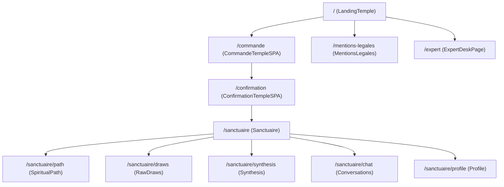
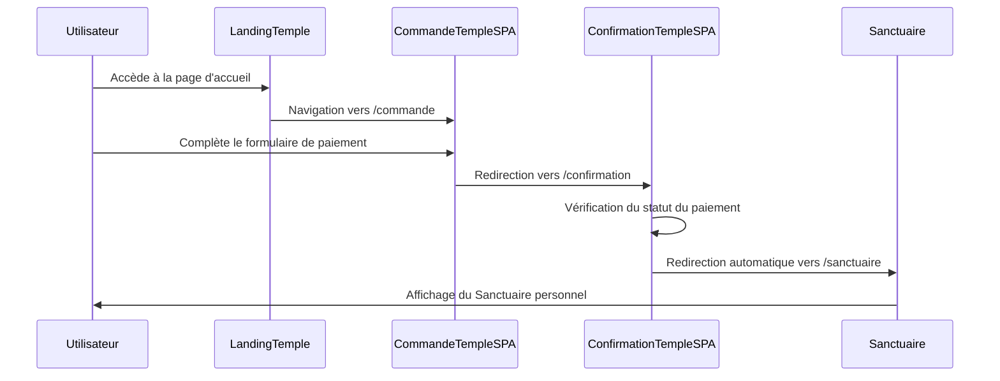
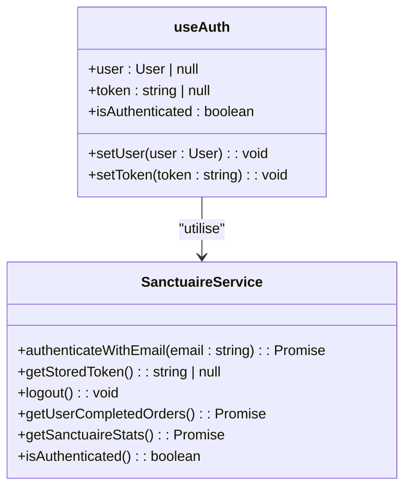
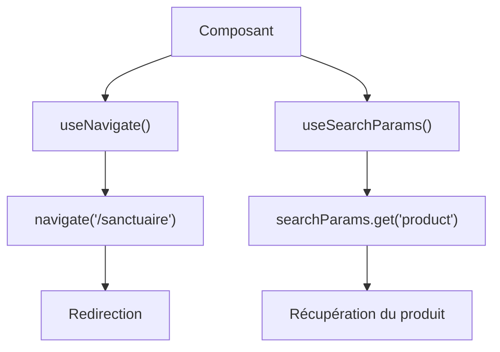
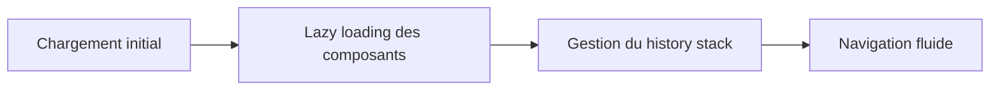
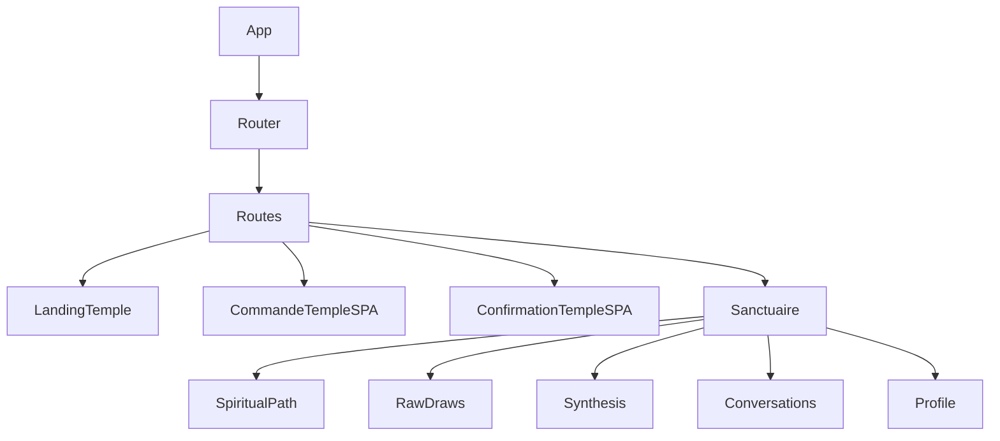

# Routage

<cite>
**Fichiers référencés dans ce document**  
- [router.tsx](file://apps/main-app/src/router.tsx)
- [useAuth.ts](file://apps/main-app/src/hooks/useAuth.ts)
- [LandingTemple.tsx](file://apps/main-app/src/pages/LandingTemple.tsx)
- [CommandeTempleSPA.tsx](file://apps/main-app/src/pages/CommandeTempleSPA.tsx)
- [ConfirmationTempleSPA.tsx](file://apps/main-app/src/pages/ConfirmationTempleSPA.tsx)
- [Sanctuaire.tsx](file://apps/main-app/src/pages/Sanctuaire.tsx)
- [SanctuairePage.tsx](file://apps/main-app/src/pages/SanctuairePage.tsx)
- [sanctuaire.ts](file://apps/main-app/src/services/sanctuaire.ts)
- [productOrder.ts](file://apps/main-app/src/services/productOrder.ts)
- [App.tsx](file://apps/main-app/src/App.tsx)
- [MandalaNav.tsx](file://apps/main-app/src/components/mandala/MandalaNav.tsx)
</cite>

## Table des matières
1. [Introduction](#introduction)
2. [Structure du routage](#structure-du-routage)
3. [Flux utilisateur principal](#flux-utilisateur-principal)
4. [Routes protégées et authentification](#routes-protégées-et-authentification)
5. [Navigation programmatique et gestion des paramètres](#navigation-programmatique-et-gestion-des-paramètres)
6. [Variantes SPA](#variantes-spa)
7. [Bonnes pratiques de routage](#bonnes-pratiques-de-routage)
8. [Architecture et intégration](#architecture-et-intégration)

## Introduction
Le système de routage de l'application Oracle Lumira est basé sur React Router et gère les différents parcours utilisateur à travers l'application. Il comprend des routes publiques pour la découverte et la commande, ainsi que des routes protégées pour l'accès au Sanctuaire personnel. Le routage est conçu pour offrir une expérience utilisateur fluide, avec des transitions entre les différentes étapes du parcours client.

**Section sources**
- [router.tsx](file://apps/main-app/src/router.tsx)
- [App.tsx](file://apps/main-app/src/App.tsx)

## Structure du routage
Le système de routage est configuré dans le fichier `router.tsx` et utilise React Router pour définir les différentes routes de l'application. La configuration inclut des routes principales ainsi que des routes imbriquées pour le Sanctuaire.

**Diagram sources**
- [router.tsx](file://apps/main-app/src/router.tsx)

**Section sources**
- [router.tsx](file://apps/main-app/src/router.tsx)

## Flux utilisateur principal
Le flux utilisateur typique suit un parcours en plusieurs étapes, commençant par la page de destination et se terminant par l'accès au Sanctuaire personnel.

### Étape 1 : Landing → Commande
L'utilisateur commence sur la page d'accueil (`LandingTemple`) et accède à la page de commande via le lien `/commande`. Cette transition est gérée par React Router et permet à l'utilisateur de sélectionner un produit avant de procéder au paiement.

### Étape 2 : Commande → Confirmation
Après avoir initié le processus de paiement, l'utilisateur est redirigé vers la page de confirmation (`ConfirmationTempleSPA`). Cette page vérifie le statut du paiement et affiche un message approprié selon que la transaction a réussi ou échoué.

### Étape 3 : Confirmation → Sanctuaire
Une fois le paiement confirmé, l'utilisateur est automatiquement redirigé vers le Sanctuaire personnel. Cette redirection est gérée par le composant `ConfirmationTempleSPA` qui utilise `useNavigate` pour effectuer la transition.

**Diagram sources**
- [CommandeTempleSPA.tsx](file://apps/main-app/src/pages/CommandeTempleSPA.tsx)
- [ConfirmationTempleSPA.tsx](file://apps/main-app/src/pages/ConfirmationTempleSPA.tsx)
- [Sanctuaire.tsx](file://apps/main-app/src/pages/Sanctuaire.tsx)

**Section sources**
- [CommandeTempleSPA.tsx](file://apps/main-app/src/pages/CommandeTempleSPA.tsx)
- [ConfirmationTempleSPA.tsx](file://apps/main-app/src/pages/ConfirmationTempleSPA.tsx)
- [Sanctuaire.tsx](file://apps/main-app/src/pages/Sanctuaire.tsx)

## Routes protégées et authentification
L'accès au Sanctuaire est protégé et nécessite une authentification. Le système utilise un hook personnalisé `useAuth` pour gérer l'état d'authentification de l'utilisateur.

### Mécanisme d'authentification
Le hook `useAuth` vérifie la présence d'un token d'authentification dans le localStorage. Si le token est présent, l'utilisateur est considéré comme authentifié et peut accéder au Sanctuaire.

**Diagram sources**
- [useAuth.ts](file://apps/main-app/src/hooks/useAuth.ts)
- [sanctuaire.ts](file://apps/main-app/src/services/sanctuaire.ts)

**Section sources**
- [useAuth.ts](file://apps/main-app/src/hooks/useAuth.ts)
- [sanctuaire.ts](file://apps/main-app/src/services/sanctuaire.ts)

## Navigation programmatique et gestion des paramètres
Le système de routage utilise la navigation programmatique pour gérer les transitions entre les différentes étapes du parcours utilisateur.

### Navigation programmatique
La navigation programmatique est implémentée à l'aide du hook `useNavigate` de React Router. Ce hook est utilisé dans plusieurs composants pour effectuer des redirections en fonction des actions de l'utilisateur.

### Gestion des paramètres d'URL
Les paramètres d'URL sont gérés à l'aide du hook `useSearchParams`. Ce hook permet d'accéder aux paramètres de requête dans l'URL et de les utiliser pour personnaliser le comportement de l'application.

**Diagram sources**
- [CommandeTempleSPA.tsx](file://apps/main-app/src/pages/CommandeTempleSPA.tsx)
- [ConfirmationTempleSPA.tsx](file://apps/main-app/src/pages/ConfirmationTempleSPA.tsx)

**Section sources**
- [CommandeTempleSPA.tsx](file://apps/main-app/src/pages/CommandeTempleSPA.tsx)
- [ConfirmationTempleSPA.tsx](file://apps/main-app/src/pages/ConfirmationTempleSPA.tsx)

## Variantes SPA
L'application propose des variantes SPA (Single Page Application) pour certaines fonctionnalités, notamment pour le processus de commande.

### CommandeTempleSPA
La variante SPA de la page de commande (`CommandeTempleSPA`) offre une expérience utilisateur fluide sans rechargement de page. Elle utilise Stripe Elements pour intégrer le formulaire de paiement directement dans l'application.

### ConfirmationTempleSPA
La page de confirmation SPA (`ConfirmationTempleSPA`) vérifie automatiquement le statut du paiement et met à jour l'interface en conséquence. Elle inclut un compte à rebours pour la redirection automatique vers le Sanctuaire.

**Section sources**
- [CommandeTempleSPA.tsx](file://apps/main-app/src/pages/CommandeTempleSPA.tsx)
- [ConfirmationTempleSPA.tsx](file://apps/main-app/src/pages/ConfirmationTempleSPA.tsx)

## Bonnes pratiques de routage
Le système de routage suit plusieurs bonnes pratiques pour optimiser les performances et l'expérience utilisateur.

### Lazy loading
Le lazy loading est implémenté pour les composants du Sanctuaire afin d'optimiser les performances. Les composants sont chargés uniquement lorsque nécessaire, ce qui réduit le temps de chargement initial de l'application.

### Gestion du history stack
La gestion du history stack est assurée par React Router, qui permet de naviguer entre les différentes pages de l'application tout en maintenant un historique cohérent.

**Diagram sources**
- [router.tsx](file://apps/main-app/src/router.tsx)

**Section sources**
- [router.tsx](file://apps/main-app/src/router.tsx)

## Architecture et intégration
L'architecture du système de routage est conçue pour être modulaire et facilement extensible.

### Intégration avec les hooks
Le système de routage est étroitement intégré avec les hooks personnalisés de l'application, notamment `useAuth` pour la gestion de l'authentification.

### Structure des composants
La structure des composants suit une approche modulaire, avec des composants spécifiques pour chaque page et des composants réutilisables pour les éléments d'interface commune.

**Diagram sources**
- [App.tsx](file://apps/main-app/src/App.tsx)
- [router.tsx](file://apps/main-app/src/router.tsx)

**Section sources**
- [App.tsx](file://apps/main-app/src/App.tsx)
- [router.tsx](file://apps/main-app/src/router.tsx)