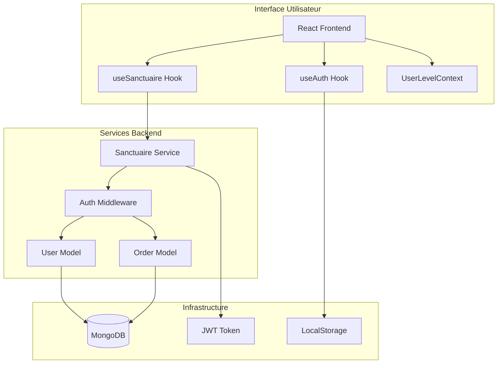
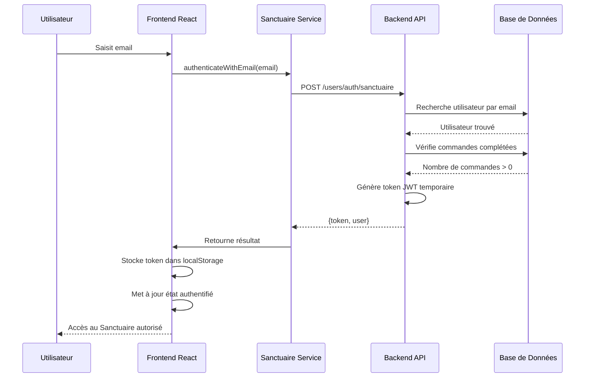
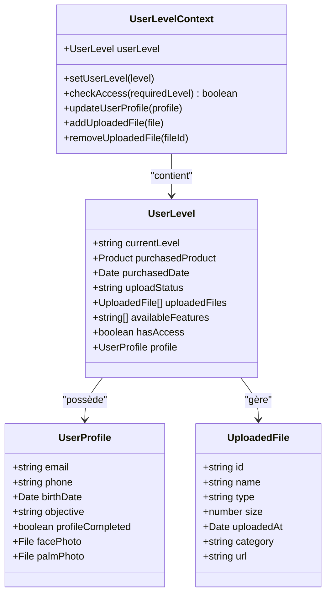
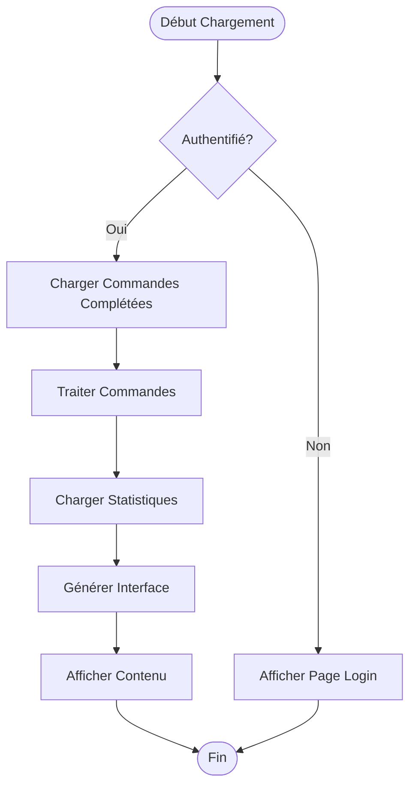
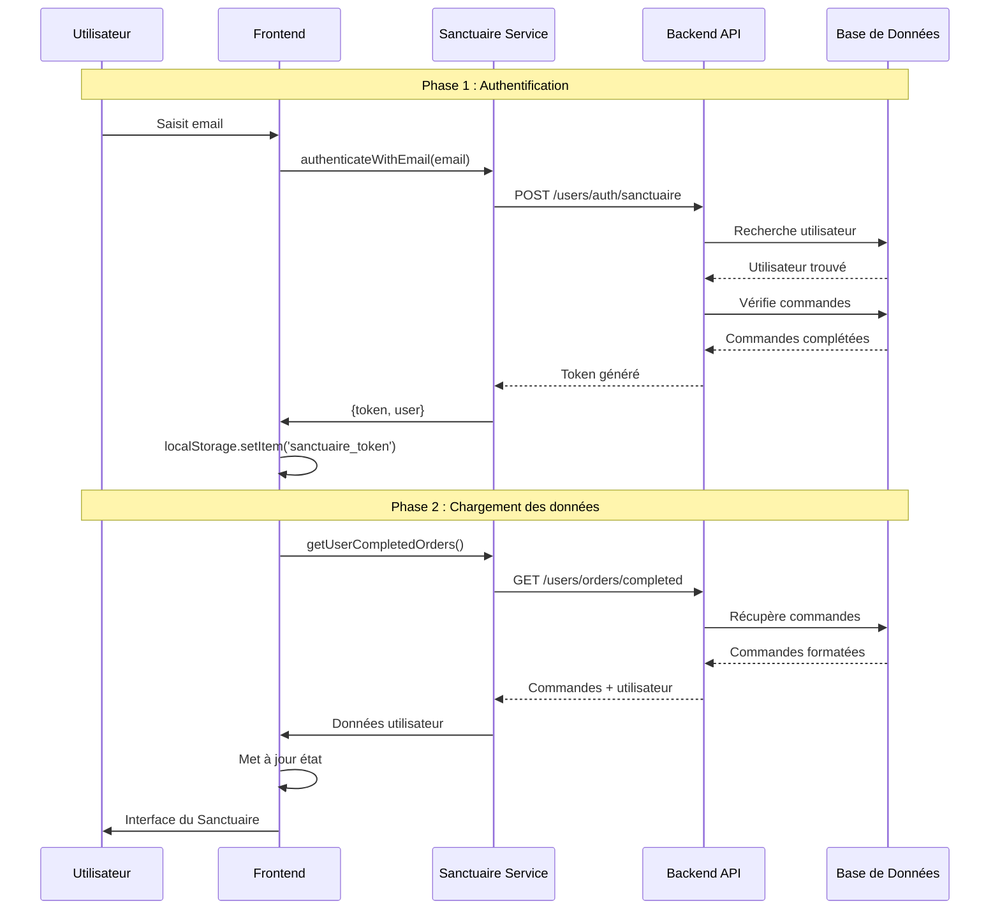

# Accès au Sanctuaire client

<cite>
**Fichiers Référencés dans ce Document**
- [useAuth.ts](file://apps/main-app/src/hooks/useAuth.ts)
- [sanctuaire.ts](file://apps/main-app/src/services/sanctuaire.ts)
- [UserLevelContext.tsx](file://apps/main-app/src/contexts/UserLevelContext.tsx)
- [Sanctuaire.tsx](file://apps/main-app/src/pages/Sanctuaire.tsx)
- [useSanctuaire.ts](file://apps/main-app/src/hooks/useSanctuaire.ts)
- [User.ts](file://apps/api-backend/src/models/User.ts)
- [users.ts](file://apps/api-backend/src/routes/users.ts)
</cite>

## Table des Matières
1. [Introduction](#introduction)
2. [Architecture du Système d'Authentification](#architecture-du-système-dauthentification)
3. [Processus d'Authentification](#processus-dauthentification)
4. [Gestion des Sessions et Persistance](#gestion-des-sessions-et-persistance)
5. [Contexte Utilisateur et Niveaux d'Accès](#contexte-utilisateur-et-niveaux-daccès)
6. [Chargement Dynamique des Contenus](#chargement-dynamique-des-contenus)
7. [Protection des Routes Sensibles](#protection-des-routes-sensibles)
8. [Gestion des Erreurs et Expériences Utilisateur](#gestion-des-erreurs-et-expériences-utilisateur)
9. [Exemples Pratiques](#exemples-pratiques)
10. [Conclusion](#conclusion)

## Introduction

Le système d'accès au Sanctuaire client représente un mécanisme sophistiqué d'authentification et de gestion des niveaux d'accès pour les utilisateurs de l'application Lumira. Ce système garantit que seuls les utilisateurs ayant effectué des commandes complétées peuvent accéder aux contenus spirituels personnalisés, tout en maintenant une expérience utilisateur fluide et sécurisée.

L'architecture repose sur une authentification par email temporaire avec génération de tokens JWT, combinée à une gestion contextuelle des niveaux d'accès et à un chargement dynamique des contenus selon les produits commandés.

## Architecture du Système d'Authentification

Le système d'authentification du Sanctuaire suit une architecture en couches qui sépare clairement les responsabilités entre l'interface utilisateur, les services backend et la base de données.



**Sources du Diagramme**
- [useAuth.ts](file://apps/main-app/src/hooks/useAuth.ts#L1-L30)
- [sanctuaire.ts](file://apps/main-app/src/services/sanctuaire.ts#L1-L215)
- [UserLevelContext.tsx](file://apps/main-app/src/contexts/UserLevelContext.tsx#L1-L199)

**Sources de Section**
- [useAuth.ts](file://apps/main-app/src/hooks/useAuth.ts#L1-L30)
- [sanctuaire.ts](file://apps/main-app/src/services/sanctuaire.ts#L1-L215)
- [UserLevelContext.tsx](file://apps/main-app/src/contexts/UserLevelContext.tsx#L1-L199)

## Processus d'Authentification

Le processus d'authentification au Sanctuaire suit un flux sécurisé qui combine authentification par email et validation des commandes précédentes.



**Sources du Diagramme**
- [sanctuaire.ts](file://apps/main-app/src/services/sanctuaire.ts#L40-L60)
- [users.ts](file://apps/api-backend/src/routes/users.ts#L100-L140)

### Mécanisme d'Authentification par Email

Le service d'authentification utilise une approche sécurisée basée sur l'email pour vérifier l'identité de l'utilisateur :

```typescript
async authenticateWithEmail(email: string): Promise<{ token: string; user: SanctuaireUser }> {
  const response = await apiRequest<{ success: boolean; token: string; user: SanctuaireUser }>(
    '/users/auth/sanctuaire',
    {
      method: 'POST',
      body: JSON.stringify({ email })
    }
  );

  if (response.success) {
    this.token = response.token;
    localStorage.setItem('sanctuaire_token', response.token);
    return { token: response.token, user: response.user };
  }

  throw new Error('Authentification échouée');
}
```

### Validation des Commandes Complétées

Le backend valide que l'utilisateur a effectué au moins une commande complétée avant d'autoriser l'accès :

```typescript
// Vérifier qu'il a au moins une commande complétée
const completedOrders = await Order.find({ 
  userId: user._id, 
  status: 'completed' 
}).countDocuments();

if (completedOrders === 0) {
  return res.status(403).json({ 
    error: 'Aucune commande complétée trouvée',
    message: 'Vous devez avoir au moins une lecture complétée pour accéder au sanctuaire'
  });
}
```

**Sources de Section**
- [sanctuaire.ts](file://apps/main-app/src/services/sanctuaire.ts#L40-L60)
- [users.ts](file://apps/api-backend/src/routes/users.ts#L100-L140)

## Gestion des Sessions et Persistance

La gestion des sessions repose sur une combinaison de localStorage pour la persistance côté client et de tokens JWT pour l'authentification côté serveur.

### Persistance côté Client

Le hook `useAuth` gère la persistance des informations d'authentification dans le localStorage :

```typescript
export const useAuth = () => {
  const [user, setUser] = useState<User | null>(null);
  const [token, setToken] = useState<string | null>(null);

  useEffect(() => {
    try {
      const raw = localStorage.getItem('user_me');
      const t = localStorage.getItem('token');
      setToken(t);
      if (raw) {
        const parsed = JSON.parse(raw);
        setUser(parsed);
      }
    } catch (e) {
      setUser(null);
      setToken(null);
    }
  }, []);

  return { user, token, isAuthenticated: !!token };
};
```

### Gestion des Tokens Temporaires

Le service Sanctuaire utilise des tokens temporaires avec expiration de 24 heures :

```typescript
// Générer token temporaire (24h)
const token = jwt.sign(
  { 
    userId: user._id, 
    email: user.email,
    type: 'sanctuaire_access'
  },
  process.env.JWT_SECRET || 'fallback_secret',
  { expiresIn: '24h' }
);
```

### Déconnexion Automatique

Le système implémente une déconnexion automatique en cas d'erreur d'authentification :

```typescript
logout = () => {
  sanctuaireService.logout();
  setIsAuthenticated(false);
  setUser(null);
  setOrders([]);
  setStats(null);
  setError(null);
};
```

**Sources de Section**
- [useAuth.ts](file://apps/main-app/src/hooks/useAuth.ts#L1-L30)
- [sanctuaire.ts](file://apps/main-app/src/services/sanctuaire.ts#L50-L70)
- [useSanctuaire.ts](file://apps/main-app/src/hooks/useSanctuaire.ts#L70-L80)

## Contexte Utilisateur et Niveaux d'Accès

Le système de niveaux d'accès utilise un contexte React pour gérer dynamiquement les permissions et fonctionnalités disponibles selon le produit commandé.



**Sources du Diagramme**
- [UserLevelContext.tsx](file://apps/main-app/src/contexts/UserLevelContext.tsx#L10-L50)

### Hiérarchie des Niveaux

Le système utilise une hiérarchie de niveaux définie par ordre croissant de privilèges :

```typescript
const checkAccess = (requiredLevel: string): boolean => {
  if (!userLevel.currentLevel) return false;
  
  const levelHierarchy = ['initie', 'mystique', 'profond', 'integrale'];
  const currentIndex = levelHierarchy.indexOf(userLevel.currentLevel);
  const requiredIndex = levelHierarchy.indexOf(requiredLevel);
  
  return currentIndex >= requiredIndex;
};
```

### Initialisation du Contexte

Le contexte s'initialise automatiquement au chargement de l'application :

```typescript
// Chargement du niveau depuis localStorage au montage
useEffect(() => {
  const savedLevel = localStorage.getItem('oraclelumira_user_level');
  if (savedLevel) {
    try {
      const parsedLevel = JSON.parse(savedLevel);
      // Conversion des dates depuis string
      if (parsedLevel.purchasedDate) {
        parsedLevel.purchasedDate = new Date(parsedLevel.purchasedDate);
      }
      setUserLevel(parsedLevel);
    } catch (error) {
      console.error('Error parsing saved user level:', error);
      localStorage.removeItem('oraclelumira_user_level');
    }
  }
}, []);
```

**Sources de Section**
- [UserLevelContext.tsx](file://apps/main-app/src/contexts/UserLevelContext.tsx#L50-L100)
- [UserLevelContext.tsx](file://apps/main-app/src/contexts/UserLevelContext.tsx#L120-L150)

## Chargement Dynamique des Contenus

Le système charge dynamiquement les contenus du Sanctuaire en fonction des commandes complétées de l'utilisateur.



**Sources du Diagramme**
- [useSanctuaire.ts](file://apps/main-app/src/hooks/useSanctuaire.ts#L20-L40)

### Récupération des Commandes Complétées

Le service récupère toutes les commandes complétées avec contenu validé :

```typescript
async getUserCompletedOrders(): Promise<{ orders: CompletedOrder[]; total: number; user: SanctuaireUser }> {
  const token = this.getStoredToken();
  if (!token) {
    throw new Error('Token d\'authentification requis');
  }

  return apiRequest<{ orders: CompletedOrder[]; total: number; user: SanctuaireUser }>(
    '/users/orders/completed',
    {
      headers: {
        'Authorization': `Bearer ${token}`
      }
    }
  );
}
```

### Formatage des Données

Les données sont formatées spécifiquement pour l'interface utilisateur :

```typescript
// Formater les données pour le sanctuaire
const formattedOrders = orders.map(order => ({
  id: order._id,
  orderNumber: order.orderNumber,
  level: order.level,
  levelName: order.levelName,
  amount: order.amount,
  status: order.status,
  createdAt: order.createdAt,
  deliveredAt: order.deliveredAt,
  generatedContent: order.generatedContent,
  expertValidation: order.expertValidation,
  formData: {
    firstName: order.formData?.firstName,
    lastName: order.formData?.lastName,
    specificQuestion: order.formData?.specificQuestion
  }
}));
```

### Statistiques Dynamiques

Les statistiques sont calculées en temps réel selon les commandes disponibles :

```typescript
const stats = {
  totalOrders: orders.length,
  completedOrders: completedOrders.length,
  pendingOrders: pendingOrders.length,
  totalSpent: orders.reduce((sum, order) => sum + order.amount, 0),
  currentLevel: completedOrders.length,
  maxLevel: Math.max(...completedOrders.map(o => o.level), 0),
  levelProgress: Math.round((completedOrders.length / 4) * 100),
  availableContent: {
    readings: completedOrders.filter(o => o.generatedContent?.reading).length,
    audios: completedOrders.filter(o => o.generatedContent?.audioUrl).length,
    pdfs: completedOrders.filter(o => o.generatedContent?.pdfUrl).length,
    mandalas: completedOrders.filter(o => o.generatedContent?.mandalaSvg).length
  }
};
```

**Sources de Section**
- [sanctuaire.ts](file://apps/main-app/src/services/sanctuaire.ts#L80-L120)
- [users.ts](file://apps/api-backend/src/routes/users.ts#L150-L200)
- [useSanctuaire.ts](file://apps/main-app/src/hooks/useSanctuaire.ts#L20-L50)

## Protection des Routes Sensibles

Le système implémente plusieurs couches de protection pour sécuriser l'accès aux routes du Sanctuaire.

### Middleware d'Authentification

Le backend utilise un middleware dédié pour valider les tokens Sanctuaire :

```typescript
const authenticateSanctuaire = async (req: any, res: any, next: any) => {
  try {
    const token = req.header('Authorization')?.replace('Bearer ', '');
    
    if (!token) {
      return res.status(401).json({ error: 'Token d\'authentification requis' });
    }

    const decoded = jwt.verify(token, process.env.JWT_SECRET || 'fallback_secret') as any;
    
    if (decoded.type !== 'sanctuaire_access') {
      return res.status(401).json({ error: 'Token invalide pour le sanctuaire' });
    }
    
    const user = await User.findById(decoded.userId);
    if (!user) {
      return res.status(401).json({ error: 'Utilisateur introuvable' });
    }

    req.user = user;
    next();
  } catch (error) {
    res.status(401).json({ error: 'Token invalide' });
  }
};
```

### Protection des Routes Frontend

Le composant Sanctuaire protège automatiquement l'accès aux sous-pages :

```typescript
const Sanctuaire: React.FC = () => {
  const { user } = useAuth();
  const navigate = useNavigate();
  const location = useLocation();
  const { userLevel } = useUserLevel();

  // Protection des routes sensibles
  if (!user && location.pathname !== '/sanctuaire') {
    navigate('/');
    return null;
  }

  return (
    <PageLayout variant="dark">
      {/* Contenu protégé */}
    </PageLayout>
  );
};
```

### Vérification des Permissions

Le contexte utilisateur vérifie systématiquement les permissions avant d'afficher des fonctionnalités :

```typescript
const checkAccess = (requiredLevel: string): boolean => {
  if (!userLevel.currentLevel) return false;
  
  const levelHierarchy = ['initie', 'mystique', 'profond', 'integrale'];
  const currentIndex = levelHierarchy.indexOf(userLevel.currentLevel);
  const requiredIndex = levelHierarchy.indexOf(requiredLevel);
  
  return currentIndex >= requiredIndex;
};
```

**Sources de Section**
- [users.ts](file://apps/api-backend/src/routes/users.ts#L140-L180)
- [Sanctuaire.tsx](file://apps/main-app/src/pages/Sanctuaire.tsx#L1-L50)
- [UserLevelContext.tsx](file://apps/main-app/src/contexts/UserLevelContext.tsx#L120-L140)

## Gestion des Erreurs et Expériences Utilisateur

Le système implémente une gestion robuste des erreurs avec des messages d'interface utilisateur clairs et des actions de récupération appropriées.

### Gestion des Erreurs d'Authentification

```typescript
const authenticateWithEmail = async (email: string) => {
  try {
    setLoading(true);
    setError(null);
    
    const result = await sanctuaireService.authenticateWithEmail(email);
    
    setIsAuthenticated(true);
    setUser(result.user);
    
    // Charger les données utilisateur
    await loadUserData();
    
    return result;
  } catch (err: any) {
    setError(err.message || 'Erreur d\'authentification');
    throw err;
  } finally {
    setLoading(false);
  }
};
```

### Messages d'Erreur Contextuels

Le système fournit des messages d'erreur adaptés selon le contexte :

```typescript
// Dans le hook useSanctuaire
const loadUserData = async () => {
  try {
    // Logique de chargement...
  } catch (err: any) {
    console.error('Erreur chargement données sanctuaire:', err);
    setError(err.message || 'Erreur de chargement');
    
    // Si erreur d'auth, déconnecter
    if (err.message?.includes('Token') || err.message?.includes('authentification')) {
      logout();
    }
  }
};
```

### Interface de Notification

L'interface utilisateur affiche des notifications contextuelles :

```typescript
// Dans le composant Sanctuaire
let hint = '';
if (path.includes('/path')) hint = labels.emptyPath;
else if (path.includes('/draws')) hint = labels.emptyDraws;
else if (path.includes('/synthesis')) hint = 'Explorez vos insights par catégories spirituelles';
else if (path.includes('/chat')) hint = labels.emptyConv;
else hint = 'Naviguez dans votre sanctuaire personnel';

return (
  <GlassCard className="p-6 backdrop-blur-xl bg-white/5 border-white/10">
    <p className="text-sm text-white/70 italic font-light leading-relaxed">{hint}</p>
  </GlassCard>
);
```

**Sources de Section**
- [useSanctuaire.ts](file://apps/main-app/src/hooks/useSanctuaire.ts#L50-L80)
- [Sanctuaire.tsx](file://apps/main-app/src/pages/Sanctuaire.tsx#L350-L380)

## Exemples Pratiques

### Exemple de Requête d'Authentification

```javascript
// Requête d'authentification au Sanctuaire
const response = await fetch('/api/users/auth/sanctuaire', {
  method: 'POST',
  headers: {
    'Content-Type': 'application/json',
  },
  body: JSON.stringify({
    email: 'utilisateur@exemple.com'
  })
});

if (response.ok) {
  const data = await response.json();
  // Stocker le token
  localStorage.setItem('sanctuaire_token', data.token);
  // Mettre à jour l'état de l'application
  setAuthenticated(true);
}
```

### Exemple de Réponse avec Token

```json
{
  "success": true,
  "token": "eyJhbGciOiJIUzI1NiIsInR5cCI6IkpXVCJ9...",
  "user": {
    "id": "654321abcdef654321abcdef",
    "email": "utilisateur@exemple.com",
    "firstName": "Jean",
    "lastName": "Dupont",
    "level": 3
  }
}
```

### Exemple de Gestion d'Erreurs

```typescript
// Gestion d'erreur spécifique pour token expiré
try {
  const orders = await sanctuaireService.getUserCompletedOrders();
} catch (error) {
  if (error.message.includes('Token')) {
    // Redirection vers la page de login
    navigate('/login');
    // Affichage d'un toast
    toast.error('Votre session a expiré. Veuillez vous reconnecter.');
  }
}
```

### Flux Complet d'Accès au Sanctuaire



**Sources du Diagramme**
- [sanctuaire.ts](file://apps/main-app/src/services/sanctuaire.ts#L40-L120)
- [users.ts](file://apps/api-backend/src/routes/users.ts#L100-L200)

## Conclusion

Le système d'accès au Sanctuaire client représente une solution robuste et sécurisée pour gérer l'authentification et l'accès aux contenus personnalisés. Il combine efficacement :

- **Authentification par email temporaire** avec validation des commandes précédentes
- **Gestion contextuelle des niveaux d'accès** via React Context
- **Persistance sécurisée** des sessions avec localStorage
- **Chargement dynamique** des contenus selon les produits commandés
- **Protection multi-couches** des routes sensibles
- **Expérience utilisateur fluide** avec gestion d'erreurs appropriée

Cette architecture permet de maintenir un équilibre optimal entre sécurité, performance et expérience utilisateur, tout en offrant une base extensible pour les futures fonctionnalités du Sanctuaire.