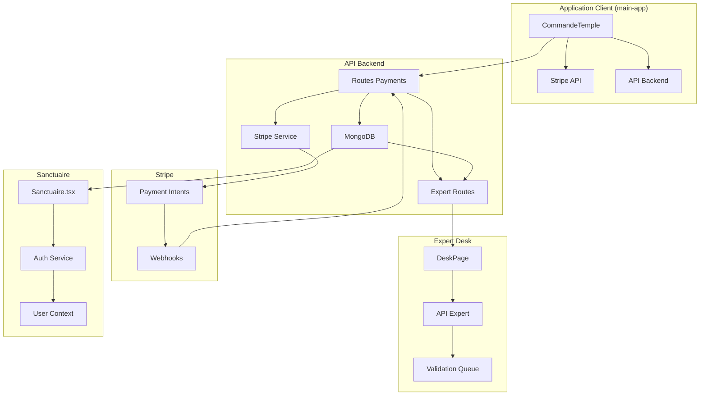
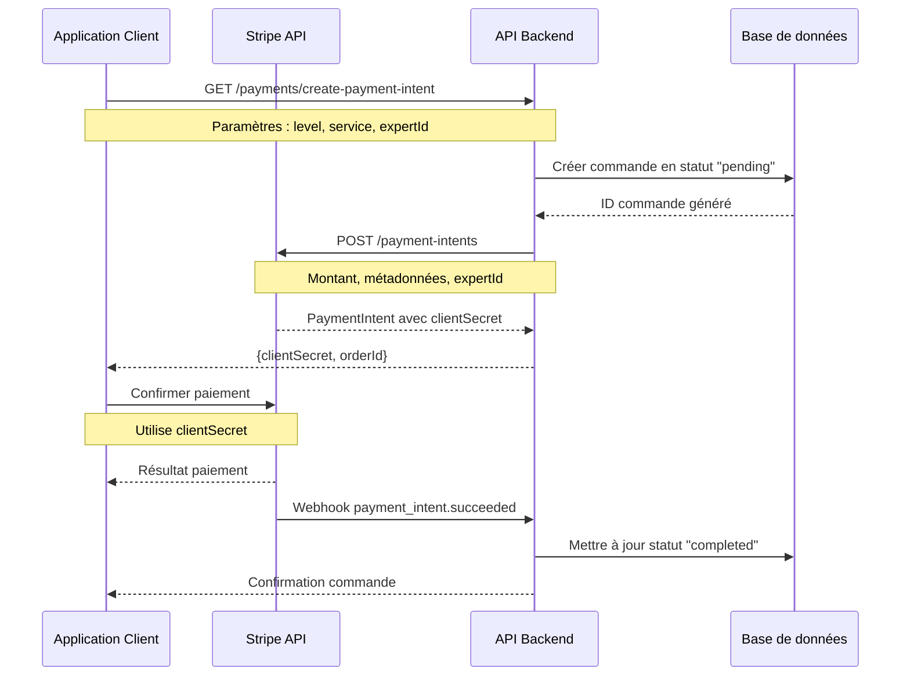
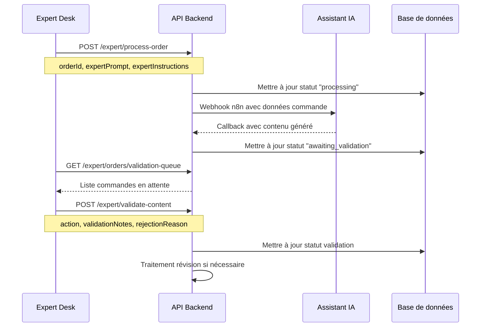
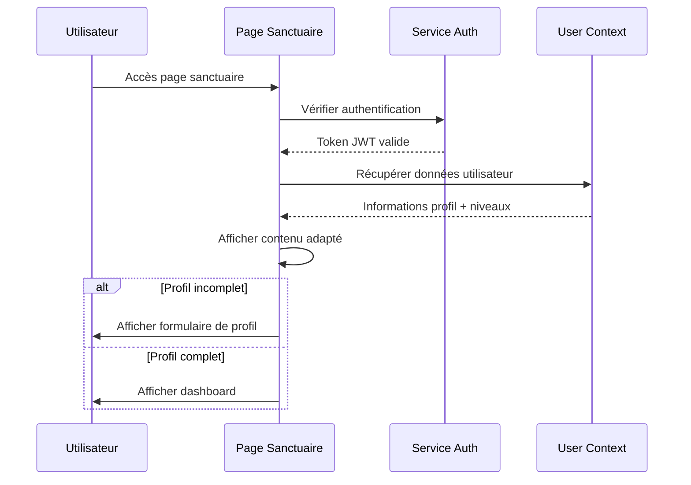
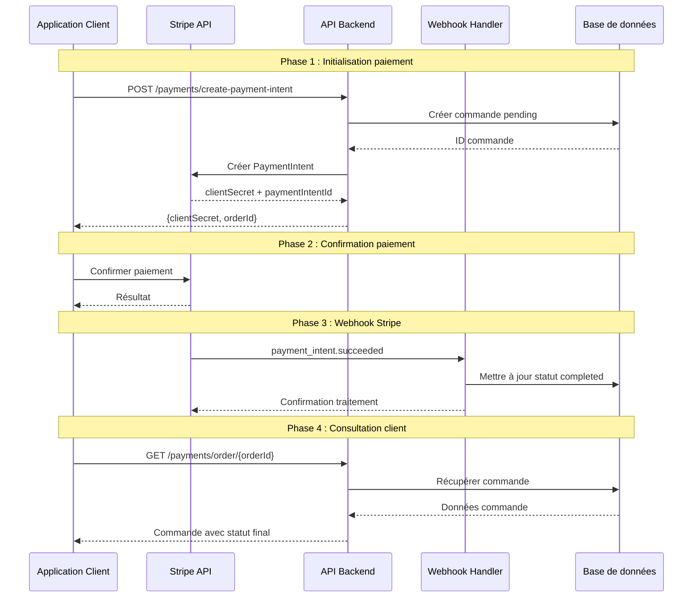
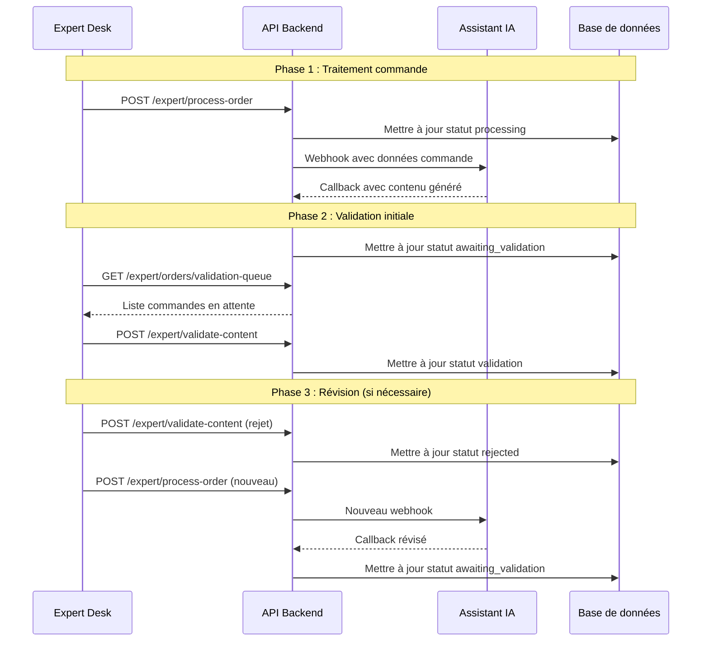

# Flux de données dans Lumira

<cite>
**Fichiers référencés dans ce document**
- [CommandeTemple.tsx](file://apps/main-app/src/pages/CommandeTemple.tsx)
- [stripe.ts](file://apps/main-app/src/api/stripe.ts)
- [payments.ts](file://apps/api-backend/src/routes/payments.ts)
- [stripe.ts](file://apps/api-backend/src/services/stripe.ts)
- [Order.ts](file://apps/api-backend/src/models/Order.ts)
- [DeskPage.tsx](file://apps/expert-desk/src/pages/DeskPage.tsx)
- [api.ts](file://apps/expert-desk/src/utils/api.ts)
- [expert.ts](file://apps/api-backend/src/routes/expert.ts)
- [Sanctuaire.tsx](file://apps/main-app/src/pages/Sanctuaire.tsx)
</cite>

## Table des matières
1. [Introduction](#introduction)
2. [Architecture des flux de données](#architecture-des-flux-de-données)
3. [Flux de commande client](#flux-de-commande-client)
4. [Flux de traitement expert](#flux-de-traitement-expert)
5. [Flux d'accès au Sanctuaire](#flux-daccès-au-sanctuaire)
6. [Protocoles et sécurité](#protocoles-et-sécurité)
7. [Formats de données](#formats-de-données)
8. [Diagrammes de séquence](#diagrammes-de-séquence)
9. [Considérations de performance](#considérations-de-performance)
10. [Guide de dépannage](#guide-de-dépannage)

## Introduction

Le système Lumira implémente trois flux de données principaux qui orchestreront l'expérience utilisateur complète : le processus de commande client, le traitement par les experts, et l'accès au Sanctuaire spirituel. Chaque flux suit un parcours spécifique tout en maintenant la sécurité des données sensibles et l'intégrité des transactions.

## Architecture des flux de données



**Sources du diagramme**
- [CommandeTemple.tsx](file://apps/main-app/src/pages/CommandeTemple.tsx#L1-L50)
- [payments.ts](file://apps/api-backend/src/routes/payments.ts#L1-L30)
- [DeskPage.tsx](file://apps/expert-desk/src/pages/DeskPage.tsx#L1-L50)
- [Sanctuaire.tsx](file://apps/main-app/src/pages/Sanctuaire.tsx#L1-L50)

## Flux de commande client

Le flux de commande client représente le parcours complet depuis la sélection d'un service jusqu'à la confirmation finale. Ce processus implique plusieurs étapes critiques avec échange de données sécurisées.

### Séquence d'échanges



**Sources du diagramme**
- [CommandeTemple.tsx](file://apps/main-app/src/pages/CommandeTemple.tsx#L100-L150)
- [payments.ts](file://apps/api-backend/src/routes/payments.ts#L15-L50)

### Détails du processus

Le processus commence lorsque l'utilisateur sélectionne un niveau de service et un expert. Les données envoyées incluent :

- **Niveau de service** : Simple, Intuitive, Alchimique, Intégrale
- **Type de service** : Basic, Premium, VIP
- **ID expert** : Identifiant unique de l'expert sélectionné
- **Informations client** : Email, nom, téléphone

Le backend crée d'abord une commande en statut "pending" avant de générer l'intention de paiement Stripe. Cette approche garantit que chaque paiement est associé à une commande valide.

**Sources de la section**
- [CommandeTemple.tsx](file://apps/main-app/src/pages/CommandeTemple.tsx#L100-L130)
- [payments.ts](file://apps/api-backend/src/routes/payments.ts#L15-L40)

## Flux de traitement expert

Le flux de traitement expert permet aux experts de valider et approuver le contenu généré par l'IA. Ce processus implique une validation en deux temps avec gestion des révisions.

### Processus de validation



**Sources du diagramme**
- [DeskPage.tsx](file://apps/expert-desk/src/pages/DeskPage.tsx#L100-L200)
- [expert.ts](file://apps/api-backend/src/routes/expert.ts#L400-L500)

### Gestion des révisions

Le système gère automatiquement les révisions en cas de rejet par l'expert. Lorsqu'une commande est rejetée, le système :

1. Incrémente le compteur de révisions
2. Remet la commande en statut "awaiting_validation"
3. Notifie l'expert de la nouvelle demande de révision
4. Permet de soumettre un nouveau contenu généré

**Sources de la section**
- [DeskPage.tsx](file://apps/expert-desk/src/pages/DeskPage.tsx#L150-L200)
- [expert.ts](file://apps/api-backend/src/routes/expert.ts#L300-L350)

## Flux d'accès au Sanctuaire

Le flux d'accès au Sanctuaire permet aux utilisateurs authentifiés d'accéder à leur espace personnel avec contenu généré. Ce processus implique l'authentification et la récupération des données utilisateur.

### Processus d'authentification



**Sources du diagramme**
- [Sanctuaire.tsx](file://apps/main-app/src/pages/Sanctuaire.tsx#L50-L150)

### Gestion des niveaux d'accès

Le système utilise un système de niveaux hiérarchique qui contrôle l'accès aux différents contenus :

- **Niveau 1 (Simple)** : Accès basique aux informations de base
- **Niveau 2 (Intuitive)** : Accès aux analyses de base
- **Niveau 3 (Alchimique)** : Accès aux analyses approfondies
- **Niveau 4 (Intégrale)** : Accès complet aux contenus avancés

**Sources de la section**
- [Sanctuaire.tsx](file://apps/main-app/src/pages/Sanctuaire.tsx#L200-L300)

## Protocoles et sécurité

### HTTPS et chiffrement

Tous les échanges de données utilisent HTTPS avec chiffrement TLS 1.2+. Les clés d'API sont stockées en sécurité et ne transitent jamais dans les requêtes client.

### Protection des données sensibles

Les données sensibles suivantes sont protégées :

- **Tokens JWT** : Utilisés pour l'authentification côté client
- **Intents de paiement Stripe** : Données temporaires pour les transactions
- **Informations personnelles** : Données utilisateur chiffrées
- **Contenu généré** : Accès contrôlé par niveau d'utilisateur

### Validation des signatures

Le système utilise des signatures HMAC pour valider l'authenticité des webhooks Stripe et des callbacks n8n.

**Sources de la section**
- [stripe.ts](file://apps/api-backend/src/services/stripe.ts#L20-L40)
- [payments.ts](file://apps/api-backend/src/routes/payments.ts#L60-L80)

## Formats de données

### Structure JSON des commandes

```json
{
  "order": {
    "id": "order_12345",
    "status": "completed",
    "paymentStatus": "succeeded",
    "amount": 7900,
    "service": "premium",
    "level": "intuitive",
    "duration": 60,
    "expert": {
      "name": "Expert Lumira",
      "specialties": ["tarot", "oracle"],
      "rating": 4.8
    },
    "customerEmail": "client@example.com",
    "createdAt": "2024-01-15T10:30:00Z",
    "paidAt": "2024-01-15T10:35:00Z"
  }
}
```

### Schéma des données d'expert

```json
{
  "expert": {
    "id": "expert_12345",
    "name": "Oracle Expert",
    "email": "expert@oraclelumira.com",
    "role": "expert",
    "isActive": true,
    "lastLogin": "2024-01-15T10:30:00Z"
  }
}
```

**Sources de la section**
- [Order.ts](file://apps/api-backend/src/models/Order.ts#L1-L50)
- [expert.ts](file://apps/api-backend/src/routes/expert.ts#L100-L150)

## Diagrammes de séquence

### Diagramme complet du flux de paiement



**Sources du diagramme**
- [CommandeTemple.tsx](file://apps/main-app/src/pages/CommandeTemple.tsx#L100-L150)
- [payments.ts](file://apps/api-backend/src/routes/payments.ts#L15-L100)

### Diagramme de validation expert



**Sources du diagramme**
- [DeskPage.tsx](file://apps/expert-desk/src/pages/DeskPage.tsx#L100-L200)
- [expert.ts](file://apps/api-backend/src/routes/expert.ts#L400-L500)

## Considérations de performance

### Optimisations des performances

Le système implémente plusieurs optimisations pour assurer une expérience fluide :

- **Indexation MongoDB** : Index sur les champs fréquemment consultés (status, expertId, createdAt)
- **Pagination** : Limitation des résultats pour éviter les requêtes trop volumineuses
- **Cache des sessions Stripe** : Réutilisation des sessions pour réduire les appels API
- **Streaming des webhooks** : Traitement asynchrone des événements Stripe

### Gestion des erreurs

Le système gère les erreurs avec des stratégies robustes :

- **Retry automatique** : Tentatives de retransmission en cas d'échec temporaire
- **Dead letter queues** : Messages échoués redirigés vers des files d'attente spéciales
- **Monitoring en temps réel** : Alertes sur anomalies de performance

**Sources de la section**
- [Order.ts](file://apps/api-backend/src/models/Order.ts#L200-L250)
- [payments.ts](file://apps/api-backend/src/routes/payments.ts#L60-L80)

## Guide de dépannage

### Problèmes courants et solutions

#### Erreurs de paiement

**Symptôme** : Le paiement échoue avec message d'erreur
**Cause** : Clé Stripe invalide ou configuration manquante
**Solution** : Vérifier la variable d'environnement STRIPE_SECRET_KEY

#### Webhooks non reçus

**Symptôme** : Les paiements ne se finalisent pas automatiquement
**Cause** : Endpoint webhook inaccessible ou signature invalide
**Solution** : Tester l'endpoint avec Stripe CLI et vérifier la signature

#### Accès refusé aux experts

**Symptôme** : Erreur 401 lors de la connexion expert
**Cause** : Token JWT expiré ou compte désactivé
**Solution** : Renouveler le token ou vérifier l'état du compte expert

### Monitoring et diagnostics

Le système propose plusieurs outils de diagnostic :

- **Logs centralisés** : Agrégation des logs pour analyse
- **Dashboard de métriques** : Surveillance des performances en temps réel
- **Tests automatisés** : Validation continue des flux critiques
- **Alertes intelligentes** : Notification précoce des anomalies

**Sources de la section**
- [payments.ts](file://apps/api-backend/src/routes/payments.ts#L60-L80)
- [expert.ts](file://apps/api-backend/src/routes/expert.ts#L200-L250)