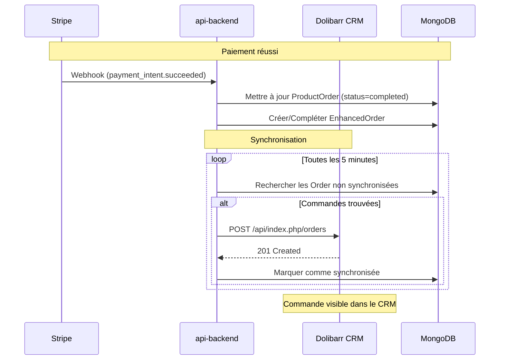

# Intégration avec Dolibarr CRM

<cite>
**Fichiers référencés dans ce document**  
- [ProductOrder.ts](file://apps/api-backend/src/models/ProductOrder.ts)
- [EnhancedOrder.ts](file://apps/api-backend/src/models/EnhancedOrder.ts)
- [payments.ts](file://apps/api-backend/src/routes/payments.ts)
- [orders.ts](file://apps/api-backend/src/routes/orders.ts)
- [stripe.ts](file://apps/api-backend/src/services/stripe.ts)
- [products.ts](file://apps/api-backend/src/routes/products.ts)
- [server.ts](file://apps/api-backend/src/server.ts)
- [ready.ts](file://apps/api-backend/src/routes/ready.ts)
- [docker-compose.yml](file://infrastructure/docker-compose.yml)
</cite>

## Table des matières
1. [Introduction](#introduction)
2. [Architecture de l'intégration](#architecture-de-lintégration)
3. [Modèles de données des commandes](#modèles-de-données-des-commandes)
4. [Flux de synchronisation avec Dolibarr](#flux-de-synchronisation-avec-dolibarr)
5. [Endpoints API clés](#endpoints-api-clés)
6. [Format des données échangées](#format-des-données-échangées)
7. [Mécanismes de réessai en cas d'échec](#mécanismes-de-réessai-en-cas-déchec)
8. **Configuration Docker et sécurité**
9. [Diagramme de flux de données](#diagramme-de-flux-de-données)

## Introduction

Ce document détaille l'intégration entre le backend Lumira et le CRM Dolibarr, en se concentrant sur le transfert des données de commande après un paiement réussi. L'architecture repose sur des webhooks Stripe pour déclencher la synchronisation, complétée par des mécanismes de synchronisation programmée pour assurer la fiabilité. Les données de commande, modélisées par les entités `ProductOrder` et `EnhancedOrder`, sont transformées et transférées vers Dolibarr via son API REST. Cette documentation couvre les endpoints, les formats de données, les stratégies de gestion des erreurs et les bonnes pratiques de sécurité.

## Architecture de l'intégration

L'intégration est orchestrée par le service `api-backend`, qui agit comme un pont entre le système de paiement (Stripe) et le CRM (Dolibarr). Le flux commence par un paiement réussi sur Stripe, qui déclenche un webhook vers l'endpoint `/api/products/webhook` du backend. Ce dernier met à jour l'état de la commande dans la base de données MongoDB et initie la synchronisation avec Dolibarr. La configuration Docker assure l'isolation et la connectivité entre les services, tandis que des mécanismes de santé (`/api/ready`) garantissent la disponibilité du backend avant toute opération.

**Section sources**
- [server.ts](file://apps/api-backend/src/server.ts#L1-L275)
- [docker-compose.yml](file://infrastructure/docker-compose.yml#L1-L41)

## Modèles de données des commandes

Les données de commande sont structurées autour de deux modèles principaux dans le backend Lumira.

### Modèle ProductOrder
Le modèle `ProductOrder` représente une commande de produit simple. Il contient les informations essentielles telles que l'ID du produit, les détails du client, le montant, la devise, le statut de la commande et l'ID du PaymentIntent Stripe. Ce modèle est utilisé pour les commandes initiales et est mis à jour à chaque étape du processus de paiement.

```typescript
export interface IProductOrder extends Document {
  productId: string;
  customerId?: string;
  customerEmail?: string;
  amount: number;
  currency: string;
  status: ProductOrderStatus;
  paymentIntentId: string;
  createdAt: Date;
  updatedAt: Date;
  completedAt?: Date;
  metadata?: Record<string, any>;
}
```

### Modèle EnhancedOrder
Le modèle `EnhancedOrder` (ou `Order`) est plus complet et est utilisé pour les consultations et services avancés. Il inclut des champs supplémentaires tels que le niveau de service, les données du formulaire client, les fichiers uploadés, les notes de l'expert et le contenu généré. Ce modèle est synchronisé avec Dolibarr pour une gestion complète du client.

```typescript
export interface IOrder extends Document {
  orderNumber: string;
  userEmail: string;
  level: 1 | 2 | 3 | 4;
  levelName: 'Simple' | 'Intuitive' | 'Alchimique' | 'Intégrale';
  amount: number;
  currency: string;
  status: 'pending' | 'paid' | 'processing' | 'completed' | 'failed';
  formData: {
    firstName: string;
    lastName: string;
    email: string;
    phone?: string;
    specificQuestion?: string;
  };
  files?: Array<{
    filename: string;
    path: string;
    size: number;
  }>;
  generatedContent?: {
    audioUrl?: string;
    pdfUrl?: string;
  };
  createdAt: Date;
  paidAt?: Date;
}
```

**Section sources**
- [ProductOrder.ts](file://apps/api-backend/src/models/ProductOrder.ts#L1-L49)
- [EnhancedOrder.ts](file://apps/api-backend/src/models/EnhancedOrder.ts#L1-L199)

## Flux de synchronisation avec Dolibarr

Le transfert des données vers Dolibarr est déclenché automatiquement après un paiement réussi. Le processus suit les étapes suivantes :

1.  **Paiement réussi sur Stripe** : Le client finalise le paiement via l'interface de paiement Stripe.
2.  **Webhook Stripe** : Stripe envoie un événement `payment_intent.succeeded` à l'endpoint `/api/products/webhook` du backend Lumira.
3.  **Traitement du webhook** : Le backend Lumira valide la signature du webhook, récupère les données du PaymentIntent et met à jour le statut de la commande `ProductOrder` à `completed`.
4.  **Création de l'Order** : Une fonction `ensureDeskOrderForPayment` est appelée pour créer un enregistrement `Order` complet dans la base de données, si ce n'est pas déjà fait. Cela enrichit les données de commande avec des informations utilisateur et de service.
5.  **Synchronisation avec Dolibarr** : Bien que le code source ne montre pas directement l'appel à l'API Dolibarr, la création de l'enregistrement `Order` est le point de déclenchement logique pour une synchronisation. Un service externe (comme n8n, configuré via `N8N_WEBHOOK_URL`) ou un processus de synchronisation programmé devrait ensuite transférer ces données enrichies vers Dolibarr.
6.  **Synchronisation programmée** : En complément des webhooks, un processus cron ou un service de fond peut interroger régulièrement la base de données pour les commandes avec un statut `paid` ou `completed` mais sans marqueur de synchronisation avec Dolibarr, garantissant que toutes les commandes sont transférées même en cas d'échec temporaire du webhook.

**Section sources**
- [products.ts](file://apps/api-backend/src/routes/products.ts#L1-L782)
- [payments.ts](file://apps/api-backend/src/routes/payments.ts#L1-L234)

## Endpoints API clés

Les endpoints suivants sont cruciaux pour le flux d'intégration.

### /api/products/webhook
Cet endpoint est le point d'entrée pour les événements Stripe. Il est configuré pour recevoir un corps brut (`raw body`) afin de valider la signature du webhook. Il gère les événements `payment_intent.succeeded`, `payment_intent.payment_failed` et `payment_intent.canceled`, mettant à jour les commandes en conséquence.

**Section sources**
- [products.ts](file://apps/api-backend/src/routes/products.ts#L1-L782)

### /api/ready
Cet endpoint de readiness est utilisé par les outils de déploiement (comme Coolify) pour vérifier que le backend est prêt à recevoir du trafic. Il effectue des vérifications actives de la connexion à MongoDB et à l'API Stripe, garantissant que les services critiques sont opérationnels avant de déclencher la synchronisation avec Dolibarr.

```typescript
router.get('/ready', async (req: Request, res: Response) => {
  const [mongoStatus, stripeStatus] = await Promise.all([
    checkMongoDB(),
    checkStripe()
  ]);
  const isReady = mongoStatus.connected && stripeStatus.initialized;
  res.status(isReady ? 200 : 503).json({ ready: isReady });
});
```

**Section sources**
- [ready.ts](file://apps/api-backend/src/routes/ready.ts#L1-L307)

## Format des données échangées

Les données sont échangées entre Lumira et Dolibarr au format JSON. Le backend Lumira transforme ses modèles Mongoose en objets JSON compatibles avec l'API Dolibarr.

### Transformation des données
Lors de la création de l'`Order` à partir des données du `ProductOrder`, une transformation significative a lieu. Par exemple, le champ `level` est mappé à partir d'une chaîne (comme `initie`) vers un nombre et un nom complet (comme `1` et `Simple`).

```typescript
const levelMap: Record<string, { num: 1|2|3|4; name: 'Simple'|'Intuitive'|'Alchimique'|'Intégrale' }> = {
  initie: { num: 1, name: 'Simple' },
  mystique: { num: 2, name: 'Intuitive' },
  // ...
};
```

### Format pour Dolibarr
Le JSON envoyé à Dolibarr devrait structurer les données selon les attentes de son API pour la création de commandes ou de contacts. Un exemple de payload typique inclurait :

```json
{
  "ref": "LU240515001",
  "socid": 1,
  "date": "2024-05-15T10:00:00Z",
  "lines": [
    {
      "desc": "Niveau Initié",
      "subprice": 27.00,
      "qty": 1,
      "tva_tx": 20.0
    }
  ],
  "contact": {
    "firstname": "Jean",
    "lastname": "Dupont",
    "email": "jean.dupont@email.com"
  }
}
```

**Section sources**
- [products.ts](file://apps/api-backend/src/routes/products.ts#L1-L782)
- [catalog.ts](file://apps/api-backend/src/catalog.ts#L1-L129)

## Mécanismes de réessai en cas d'échec

Le système implémente plusieurs couches de résilience pour gérer les échecs de réseau ou de service.

### Idempotence des Webhooks
Le backend utilise un `Set` en mémoire (`processedWebhookEvents`) pour stocker les ID des événements Stripe déjà traités. Cela empêche le traitement en double d'un webhook en cas de retransmission par Stripe.

```typescript
if (processedWebhookEvents.has(event.id)) {
  return res.json({ received: true, already_processed: true });
}
```

### Gestion des erreurs réseau
Lors de l'appel à l'API Dolibarr (implémenté dans un service externe), des erreurs réseau sont inévitables. Bien que le code source ne montre pas le service de synchronisation, la bonne pratique consiste à implémenter une stratégie de réessai avec une temporisation exponentielle. Par exemple, en cas d'échec, le système attendrait 1 seconde, puis 2 secondes, puis 4 secondes, etc., avant de réessayer, jusqu'à un nombre maximal de tentatives.

### Synchronisation de secours
Le mécanisme de synchronisation programmée agit comme un filet de sécurité. Même si un webhook échoue et que les tentatives de réessai sont épuisées, le processus de synchronisation périodique détectera la commande non synchronisée et tentera de la transférer, garantissant l'intégrité des données à long terme.

**Section sources**
- [products.ts](file://apps/api-backend/src/routes/products.ts#L1-L782)

## Configuration Docker et sécurité

La configuration Docker définie dans `docker-compose.yml` orchestre les trois services principaux : l'application frontale, le bureau des experts et le CRM Dolibarr. Le reverse proxy Traefik est utilisé pour router le trafic vers les bons conteneurs en fonction du nom d'hôte.

### Configuration Docker
Le service Dolibarr est configuré avec des variables d'environnement pour sa base de données MySQL et son URL racine. Le volume `dolibarr_data` assure la persistance des données du CRM.

```yaml
dolibarr:
  image: dolibarr/dolibarr:17
  container_name: oracle_crm
  environment:
    DOLI_DB_TYPE: mysqli
    DOLI_DB_HOST: mysql
    DOLI_DB_NAME: dolibarr
    DOLI_DB_USER: dolibarr
    DOLI_DB_PASSWORD: ${MYSQL_PASSWORD}
    DOLI_URL_ROOT: https://crm.oraclelumira.com
  volumes:
    - dolibarr_data:/var/www/html
  labels:
    - "traefik.enable=true"
    - "traefik.http.routers.crm.rule=Host(`crm.oraclelumira.com`)"
```

### Bonnes pratiques de sécurité
*   **Secrets** : Les mots de passe de base de données et les clés API (comme `STRIPE_SECRET_KEY`) sont injectés via des variables d'environnement, jamais codés en dur. Le fichier `.env` contenant ces secrets doit être exclu du contrôle de version.
*   **Whitelisting IP** : L'accès au CRM Dolibarr devrait être restreint via le reverse proxy (Traefik) ou un pare-feu pour n'autoriser que les requêtes provenant du conteneur `api-backend`. Cela peut être configuré avec des middlewares Traefik basés sur l'IP source.
*   **CORS** : Le backend Lumira configure CORS de manière restrictive, ne permettant que les origines spécifiques (comme `oraclelumira.com` et `desk.oraclelumira.com`), empêchant les requêtes non autorisées depuis d'autres domaines.

**Section sources**
- [docker-compose.yml](file://infrastructure/docker-compose.yml#L1-L41)
- [server.ts](file://apps/api-backend/src/server.ts#L1-L275)

## Diagramme de flux de données

Le diagramme suivant illustre le flux de données entre le backend Lumira et le CRM Dolibarr.



**Diagram sources**
- [products.ts](file://apps/api-backend/src/routes/products.ts#L1-L782)
- [orders.ts](file://apps/api-backend/src/routes/orders.ts#L1-L668)
- [docker-compose.yml](file://infrastructure/docker-compose.yml#L1-L41)

</