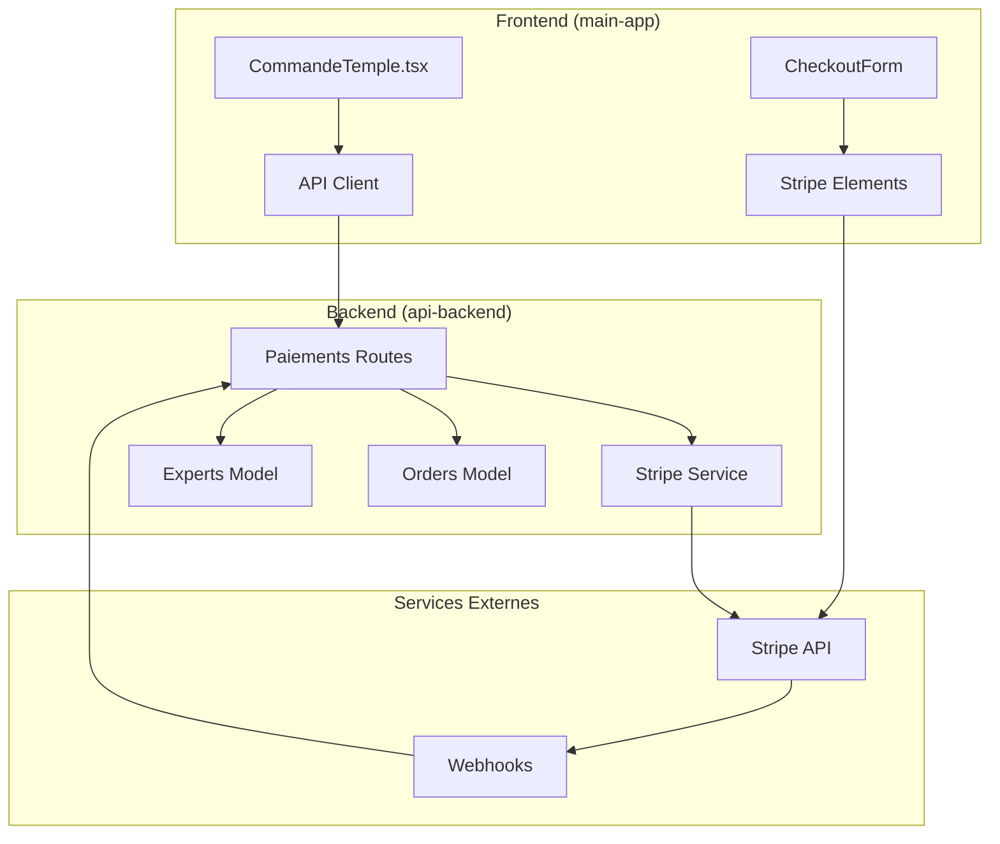
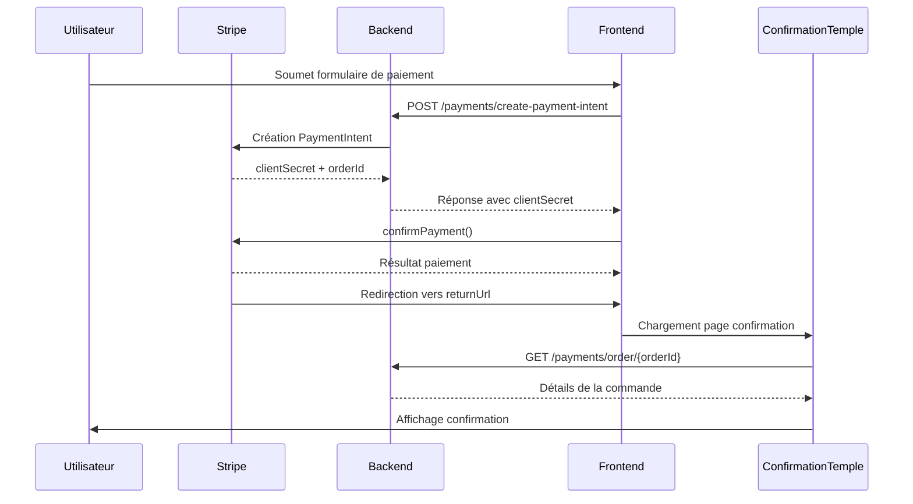
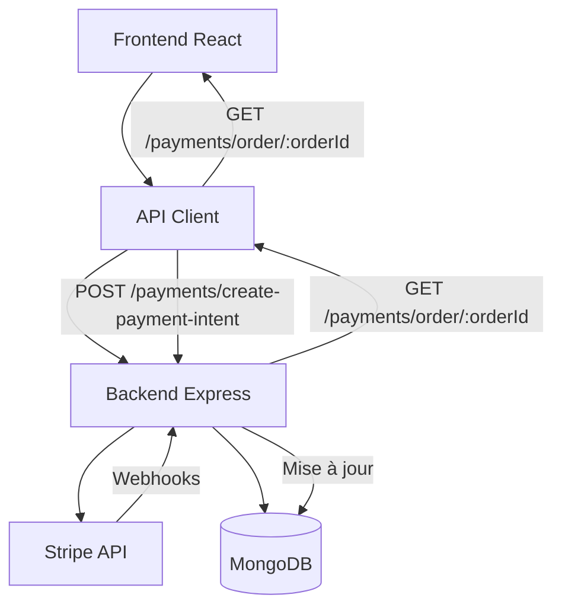

# Parcours de commande client

<cite>
**Fichiers référencés dans ce document**
- [CommandeTemple.tsx](file://apps/main-app/src/pages/CommandeTemple.tsx)
- [ConfirmationTemple.tsx](file://apps/main-app/src/pages/ConfirmationTemple.tsx)
- [stripe.ts](file://apps/main-app/src/api/stripe.ts)
- [payments.ts](file://apps/api-backend/src/routes/payments.ts)
- [stripe.ts](file://apps/api-backend/src/services/stripe.ts)
- [payments.ts](file://apps/api-backend/src/types/payments.ts)
- [api.ts](file://apps/main-app/src/utils/api.ts)
</cite>

## Table des matières
1. [Introduction](#introduction)
2. [Architecture du parcours de commande](#architecture-du-parcours-de-commande)
3. [Étape 1 : Tunnel de commande (CommandeTemple.tsx)](#étape-1-tunnel-de-commande-commandetempletsx)
4. [Étape 2 : Création de l'intention de paiement](#étape-2-création-de-lintention-de-paiement)
5. [Étape 3 : Interface de paiement Stripe](#étape-3-interface-de-paiement-stripe)
6. [Étape 4 : Confirmation et redirection](#étape-4-confirmation-et-redirection)
7. [Étape 5 : Gestion des webhooks Stripe](#étape-5-gestion-des-webhooks-stripe)
8. [Communication API entre front-end et back-end](#communication-api-entre-front-end-et-back-end)
9. [Sécurité et validation](#sécurité-et-validation)
10. [Gestion des erreurs](#gestion-des-erreurs)
11. [Bonnes pratiques de sécurité](#bonnes-pratiques-de-sécurité)
12. [Conclusion](#conclusion)

## Introduction

Le parcours de commande client dans l'application Lumira constitue un processus complet et sécurisé permettant aux utilisateurs de passer commande pour les services d'Oracle Lumira. Ce système sophistiqué intègre Stripe comme plateforme de paiement, garantissant une expérience utilisateur fluide tout en maintenant des standards élevés de sécurité et de fiabilité.

Le processus suit un flux strict de validation et d'autorisation, commençant par la sélection du service et terminant par la confirmation définitive de la commande. Chaque étape est conçue pour offrir une transparence totale aux utilisateurs tout en protégeant leurs informations sensibles.

## Architecture du parcours de commande

Le système de commande client s'articule autour d'une architecture en couches bien définie, séparant clairement les responsabilités entre le frontend, le backend et les services externes comme Stripe.



**Sources du diagramme**
- [CommandeTemple.tsx](file://apps/main-app/src/pages/CommandeTemple.tsx#L1-L387)
- [payments.ts](file://apps/api-backend/src/routes/payments.ts#L1-L234)
- [stripe.ts](file://apps/api-backend/src/services/stripe.ts#L1-L165)

## Étape 1 : Tunnel de commande (CommandeTemple.tsx)

La première étape du parcours de commande se trouve dans le composant `CommandeTemple.tsx`, qui agit comme le point d'entrée principal pour la finalisation des achats. Ce composant gère l'initialisation du processus de paiement et coordonne toutes les interactions nécessaires.

### Initialisation et validation des paramètres

Le composant commence par valider les paramètres requis provenant de l'URL :

```typescript
const level = searchParams.get('level');
const service = searchParams.get('service');
const expert = searchParams.get('expert') || 'Expert Lumira';
const expertId = searchParams.get('expertId') || '674123456789abcdef012345';
```

Cette validation garantit que toutes les informations nécessaires sont présentes avant de procéder à la création de l'intention de paiement.

### Configuration des services disponibles

Le système supporte trois niveaux de service distincts, chacun avec ses propres caractéristiques :

```typescript
const serviceConfig = {
  basic: {
    name: 'Consultation Basique',
    price: 29,
    duration: 30,
    features: [
      'Analyse personnalisée de votre situation',
      'Conseils pratiques adaptés',
      'Support par chat pendant 7 jours'
    ]
  },
  premium: {
    name: 'Consultation Premium',
    price: 79,
    duration: 60,
    features: [
      'Analyse approfondie et rapport détaillé',
      'Session vidéo personnalisée',
      'Plan d\'action sur mesure',
      'Support prioritaire pendant 30 jours',
      'Ressources exclusives'
    ]
  },
  vip: {
    name: 'Consultation VIP',
    price: 149,
    duration: 120,
    features: [
      'Analyse complète multi-dimensionnelle',
      'Sessions vidéo illimitées pendant 1 mois',
      'Coaching personnalisé',
      'Accès aux experts spécialisés',
      'Support 24/7 pendant 90 jours',
      'Garantie satisfaction'
    ]
  }
};
```

### Initialisation du processus de paiement

Lorsque tous les paramètres sont valides, le système initie le processus de paiement en appelant l'API backend :

```typescript
useEffect(() => {
  const initialize = async () => {
    if (!level || !service || !currentService) {
      setInitError('Parametres de commande manquants');
      setIsInitializing(false);
      return;
    }
    try {
      const res = await stripeAPI.createPaymentIntent({
        level,
        service: service as 'basic' | 'premium' | 'vip',
        expertId,
        customerEmail: 'client@example.com',
        customerName: 'Client Test',
      });
      setClientSecret(res.clientSecret);
      setOrderId(res.orderId);
    } catch (e) {
      console.error('Failed to initialize payment:', e);
      setInitError(e instanceof Error ? e.message : "Echec de l'initialisation du paiement");
    } finally {
      setIsInitializing(false);
    }
  };
  initialize();
}, [level, service, expertId, currentService]);
```

**Sources de section**
- [CommandeTemple.tsx](file://apps/main-app/src/pages/CommandeTemple.tsx#L110-L140)
- [stripe.ts](file://apps/main-app/src/api/stripe.ts#L1-L173)

## Étape 2 : Création de l'intention de paiement

La création de l'intention de paiement représente la phase critique où le backend génère une transaction Stripe sécurisée. Cette étape implique plusieurs étapes de validation et de création d'ordre.

### Requête API du frontend

Le frontend envoie une requête POST vers `/payments/create-payment-intent` avec les paramètres suivants :

```typescript
interface CreatePaymentIntentRequest {
  level: string;
  service: 'basic' | 'premium' | 'vip';
  expertId: string;
  userId?: string;
  customerEmail?: string;
  customerName?: string;
}
```

Exemple de requête JSON :
```json
{
  "level": "3",
  "service": "premium",
  "expertId": "674123456789abcdef012345",
  "customerEmail": "client@example.com",
  "customerName": "Client Test"
}
```

### Validation côté backend

Le backend effectue plusieurs validations cruciales :

```typescript
// Validation des paramètres requis
if (!expertId || !amount) {
  return res.status(400).json({ error: 'Expert ID and amount are required' });
}

// Vérification de l'existence de l'expert
const expert = await Expert.findById(expertId);
if (!expert) {
  return res.status(404).json({ error: 'Expert not found' });
}
```

### Création de l'ordre et de l'intention de paiement

Le backend crée d'abord un ordre dans la base de données MongoDB :

```typescript
const order = new Order({
  expertId: expert._id,
  amount,
  status: 'pending',
  createdAt: new Date(),
  updatedAt: new Date()
});
```

Ensuite, il génère l'intention de paiement Stripe :

```typescript
const paymentIntent = await getStripe().paymentIntents.create({
  amount: Math.round(amount * 100),
  currency: 'eur',
  metadata: {
    orderId: order._id.toString(),
    expertId: expert._id.toString(),
    ...metadata
  },
  description: description || `Consultation with ${expert.name}`,
}, { idempotencyKey });
```

### Réponse du backend

Le backend retourne une réponse contenant toutes les informations nécessaires au frontend :

```typescript
res.json({
  clientSecret: paymentIntent.client_secret,
  orderId: order._id.toString(),
  amount,
  expertName: expert.name
});
```

Exemple de réponse JSON :
```json
{
  "clientSecret": "pi_123456789_secret_abcdefg",
  "orderId": "674123456789abcdef012345",
  "amount": 79,
  "expertName": "Expert Lumira"
}
```

**Sources de section**
- [payments.ts](file://apps/api-backend/src/routes/payments.ts#L15-L45)
- [stripe.ts](file://apps/api-backend/src/services/stripe.ts#L25-L55)

## Étape 3 : Interface de paiement Stripe

Une fois l'intention de paiement créée, le frontend initialise l'interface de paiement Stripe à travers le composant `CheckoutForm`. Cette interface permet à l'utilisateur de saisir ses informations de paiement de manière sécurisée.

### Initialisation Stripe Elements

Le composant `CheckoutForm` utilise Stripe Elements pour afficher l'interface de paiement :

```typescript
const CheckoutForm: React.FC<CheckoutFormProps> = ({ orderId, amount, onSuccess }) => {
  const stripe = useStripe();
  const elements = useElements();
  const [isLoading, setIsLoading] = useState(false);
  const [errorMessage, setErrorMessage] = useState<string | null>(null);
```

### Configuration des options Stripe

Le système configure des options d'apparence personnalisées pour correspondre à la charte graphique de Lumira :

```typescript
const stripeOptions = {
  clientSecret: clientSecret!,
  appearance: {
    theme: 'night' as const,
    variables: {
      colorPrimary: '#D4AF37',
      colorBackground: '#0F0B19',
      colorText: '#E5E7EB',
      colorDanger: '#EF4444',
      borderRadius: '12px',
      fontFamily: 'Inter, system-ui, sans-serif',
    }
  }
} as const;
```

### Traitement du formulaire de paiement

Lorsque l'utilisateur soumet le formulaire, le système traite la demande de paiement :

```typescript
const handleSubmit = async (e: React.FormEvent) => {
  e.preventDefault();
  if (!stripe || !elements) return;

  setIsLoading(true);
  setErrorMessage(null);
  try {
    const returnUrl = `${window.location.origin}/confirmation?order_id=${orderId}`;
    const { error } = await stripe.confirmPayment({
      elements,
      confirmParams: { return_url: returnUrl },
      redirect: 'if_required',
    });
    if (error) {
      setErrorMessage(error.message || 'Erreur lors du paiement');
    } else {
      onSuccess();
    }
  } catch (err) {
    console.error('Payment error:', err);
    setErrorMessage('Erreur inattendue');
  } finally {
    setIsLoading(false);
  }
};
```

### Gestion des erreurs Stripe

Le système gère différentes catégories d'erreurs :

- **Erreurs réseau** : Tentative de nouvelle tentative automatique
- **Erreurs de validation** : Affichage de messages détaillés à l'utilisateur
- **Erreurs Stripe** : Loggage et notification pour analyse

**Sources de section**
- [CommandeTemple.tsx](file://apps/main-app/src/pages/CommandeTemple.tsx#L25-L85)
- [CommandeTemple.tsx](file://apps/main-app/src/pages/CommandeTemple.tsx#L364-L385)

## Étape 4 : Confirmation et redirection

Après le traitement du paiement par Stripe, l'utilisateur est redirigé vers la page de confirmation. Cette étape implique plusieurs mécanismes de validation et de mise à jour d'état.

### Redirection vers la page de confirmation

Stripe redirige automatiquement l'utilisateur vers l'URL de retour configurée :

```typescript
const returnUrl = `${window.location.origin}/confirmation?order_id=${orderId}`;
```

### Validation de la réussite du paiement

La page `ConfirmationTemple.tsx` valide la réussite du paiement à travers les paramètres de recherche :

```typescript
const [searchParams] = useSearchParams();
const success = searchParams.get('success') === 'true';
```

### Interface de confirmation utilisateur

La page de confirmation offre une expérience utilisateur optimisée avec :

- **Animation de succès** : Animation visuelle de confirmation
- **Chronologie des étapes** : Vue d'ensemble du processus
- **Actions recommandées** : Boutons pour continuer l'expérience



**Sources du diagramme**
- [CommandeTemple.tsx](file://apps/main-app/src/pages/CommandeTemple.tsx#L110-L140)
- [ConfirmationTemple.tsx](file://apps/main-app/src/pages/ConfirmationTemple.tsx#L1-L140)

**Sources de section**
- [CommandeTemple.tsx](file://apps/main-app/src/pages/CommandeTemple.tsx#L140-L180)
- [ConfirmationTemple.tsx](file://apps/main-app/src/pages/ConfirmationTemple.tsx#L1-L50)

## Étape 5 : Gestion des webhooks Stripe

Pour assurer la synchronisation complète entre Stripe et le système Lumira, un système de webhooks gère les événements de paiement en temps réel.

### Configuration des webhooks

Le backend écoute plusieurs types d'événements Stripe :

```typescript
switch (event.type) {
  case 'payment_intent.succeeded':
    const paymentIntent = event.data.object;
    const orderId = paymentIntent.metadata?.orderId;
    
    if (orderId) {
      const order = await Order.findById(orderId);
      if (order) {
        order.status = 'completed';
        order.updatedAt = new Date();
        await order.save();
      }
    }
    break;

  case 'payment_intent.payment_failed':
    const failedPaymentIntent = event.data.object;
    const failedOrderId = failedPaymentIntent.metadata?.orderId;
    
    if (failedOrderId) {
      const order = await Order.findById(failedOrderId);
      if (order) {
        order.status = 'failed';
        order.updatedAt = new Date();
        await order.save();
      }
    }
    break;
}
```

### Prévention des doublons

Le système maintient un registre des événements déjà traités :

```typescript
const processedEvents = new Set<string>();

if (processedEvents.has(event.id)) {
  return res.json({ received: true, duplicate: true });
}

processedEvents.add(event.id);
```

### Sauvegarde des événements traités

Chaque événement est enregistré dans la base de données pour audit :

```typescript
await ProcessedEvent.create({
  eventId: event.id,
  eventType: event.type,
  processed: true,
  processedAt: new Date()
});
```

**Sources de section**
- [payments.ts](file://apps/api-backend/src/routes/payments.ts#L70-L120)

## Communication API entre front-end et back-end

Le système utilise une architecture API REST bien structurée pour la communication entre les couches frontend et backend.

### Flux de communication



**Sources du diagramme**
- [stripe.ts](file://apps/main-app/src/api/stripe.ts#L40-L80)
- [payments.ts](file://apps/api-backend/src/routes/payments.ts#L1-L50)

### Types d'APIs

#### 1. Création d'intention de paiement
- **Endpoint** : `POST /payments/create-payment-intent`
- **Requête** : `{ level, service, expertId, customerEmail }`
- **Réponse** : `{ clientSecret, orderId, amount, expertName }`

#### 2. Confirmation de paiement
- **Endpoint** : `POST /payments/confirm-payment`
- **Requête** : `{ paymentIntentId }`
- **Réponse** : `{ success, order }`

#### 3. Consultation d'ordre
- **Endpoint** : `GET /payments/order/:orderId`
- **Réponse** : `{ order: {...} }`

### Gestion des erreurs API

Le système implémente une gestion d'erreurs cohérente :

```typescript
private async request<T>(endpoint: string, options: RequestInit = {}): Promise<T> {
  const response = await fetch(`${API_BASE_URL}${endpoint}`, config);

  if (!response.ok) {
    const errorData = await response.json().catch(() => ({}));
    throw new Error(errorData.error || `HTTP ${response.status}: ${response.statusText}`);
  }

  return response.json();
}
```

**Sources de section**
- [stripe.ts](file://apps/main-app/src/api/stripe.ts#L20-L40)
- [api.ts](file://apps/main-app/src/utils/api.ts#L20-L50)

## Sécurité et validation

Le système implémente plusieurs couches de sécurité pour protéger les transactions et les données utilisateur.

### Validation côté client

#### 1. Clé Stripe
```typescript
export function validateStripeKey(): string {
  const pk = import.meta.env.VITE_STRIPE_PUBLISHABLE_KEY;
  
  if (!pk) {
    throw new Error('VITE_STRIPE_PUBLISHABLE_KEY is required but not set');
  }
  
  if (!/^pk_(test|live)_[a-zA-Z0-9]+$/.test(pk)) {
    throw new Error(`Invalid Stripe publishable key format: ${pk.substring(0, 10)}...`);
  }
  
  return pk;
}
```

#### 2. Validation des paramètres de commande
```typescript
if (!level || !service || !currentService) {
  setInitError('Parametres de commande manquants');
  return;
}
```

### Validation côté serveur

#### 1. Validation des paramètres d'intention de paiement
```typescript
if (!expertId || !amount) {
  return res.status(400).json({ error: 'Expert ID and amount are required' });
}

const expert = await Expert.findById(expertId);
if (!expert) {
  return res.status(404).json({ error: 'Expert not found' });
}
```

#### 2. Protection CSRF
Le système utilise des tokens CSRF pour protéger contre les attaques cross-site request forgery.

### Chiffrement et sécurité des données

#### 1. Transmission sécurisée
- Utilisation de HTTPS pour toutes les communications
- Chiffrement SSL/TLS pour les données en transit

#### 2. Stockage sécurisé
- Les clés Stripe ne sont jamais stockées côté client
- Les informations de paiement sont gérées par Stripe

#### 3. Idempotence des requêtes
```typescript
export function buildStripeOptions(req: any): { idempotencyKey: string } {
  const requestId = req.headers['x-request-id'] || req.ip + Date.now();
  return {
    idempotencyKey: `oracle-lumira-${requestId}`
  };
}
```

**Sources de section**
- [api.ts](file://apps/main-app/src/utils/api.ts#L50-L80)
- [payments.ts](file://apps/api-backend/src/routes/payments.ts#L15-L30)
- [stripe.ts](file://apps/api-backend/src/services/stripe.ts#L20-L30)

## Gestion des erreurs

Le système implémente une gestion d'erreurs complète couvrant tous les points critiques du parcours de commande.

### Erreurs frontend

#### 1. Erreurs d'initialisation
```typescript
if (initError || !level || !service || !expert || !currentService) {
  return (
    <div className="min-h-screen bg-gradient-to-br from-mystical-abyss via-mystical-midnight to-mystical-deep-blue flex items-center justify-center">
      <motion.div initial={{ opacity: 0 }} animate={{ opacity: 1 }} className="max-w-md p-8 text-center space-y-4">
        <AlertCircle className="w-16 h-16 text-red-400 mx-auto" />
        <h2 className="text-2xl font-bold text-mystical-night">Erreur de configuration</h2>
        <p className="text-mystical-night/70">{initError || 'Parametres manquants'}</p>
      </motion.div>
    </div>
  );
}
```

#### 2. Erreurs de paiement
```typescript
setErrorMessage(error.message || 'Erreur lors du paiement');
```

### Erreurs backend

#### 1. Erreurs de validation
```typescript
if (!expertId || !amount) {
  return res.status(400).json({ error: 'Expert ID and amount are required' });
}
```

#### 2. Erreurs de traitement
```typescript
try {
  const paymentIntent = await getStripe().paymentIntents.create({...});
  // ...
} catch (error) {
  res.status(500).json({ error: 'Internal server error' });
}
```

### Logging et monitoring

#### 1. Logging des erreurs
```typescript
console.error('Payment error:', err);
console.error('Failed to initialize payment:', e);
```

#### 2. Monitoring des performances
- Tracking des temps de réponse API
- Surveillance des taux d'échec de paiement
- Alertes pour anomalies

**Sources de section**
- [CommandeTemple.tsx](file://apps/main-app/src/pages/CommandeTemple.tsx#L150-L180)
- [payments.ts](file://apps/api-backend/src/routes/payments.ts#L20-L25)

## Bonnes pratiques de sécurité

Le système Lumira implémente plusieurs bonnes pratiques de sécurité pour protéger les transactions et les données utilisateur.

### 1. Séparation des responsabilités

#### Frontend
- **Clés publiques Stripe** : Stockées en tant que variables d'environnement
- **Logique métier** : Limitée aux interactions utilisateur
- **Validation** : Double validation (client + serveur)

#### Backend
- **Clés privées Stripe** : Stockées en sécurité dans l'environnement
- **Logique métier** : Validation complète des données
- **Persistence** : Base de données sécurisée avec index appropriés

### 2. Validation multi-niveaux

#### Validation côté client
```typescript
// Validation des paramètres de commande
if (!level || !service || !currentService) {
  setInitError('Parametres de commande manquants');
  return;
}

// Validation de la clé Stripe
if (!/^pk_(test|live)_[a-zA-Z0-9]+$/.test(pk)) {
  throw new Error(`Invalid Stripe publishable key format: ${pk.substring(0, 10)}...`);
}
```

#### Validation côté serveur
```typescript
// Validation des paramètres requis
if (!expertId || !amount) {
  return res.status(400).json({ error: 'Expert ID and amount are required' });
}

// Vérification de l'expert
const expert = await Expert.findById(expertId);
if (!expert) {
  return res.status(404).json({ error: 'Expert not found' });
}
```

### 3. Protection contre les attaques courantes

#### CSRF Protection
- Utilisation de tokens CSRF pour toutes les requêtes POST
- Validation des origines des requêtes

#### Injection SQL
- Utilisation de Mongoose pour la manipulation de données
- Paramétrage des requêtes pour éviter l'injection

#### XSS Prevention
- Sanitisation des entrées utilisateur
- Utilisation de bibliothèques de rendu sécurisées

### 4. Chiffrement et cryptographie

#### Transmission sécurisée
- HTTPS obligatoire pour toutes les communications
- Certificats SSL/TLS valides

#### Stockage sécurisé
- Hashage des mots de passe utilisateur
- Chiffrement des données sensibles en repos

### 5. Audit et conformité

#### Logging complet
```typescript
// Log des événements critiques
console.log('Order completed:', order);
console.log('Access granted successfully:', {
  orderId: order.id,
  level: product.level,
  customerEmail: order.customerEmail,
});
```

#### Conformité réglementaire
- Respect RGPD pour la gestion des données personnelles
- Logs d'audit pour traçabilité
- Sécurité des données en ligne avec PCI DSS

**Sources de section**
- [api.ts](file://apps/main-app/src/utils/api.ts#L50-L80)
- [stripe.ts](file://apps/api-backend/src/services/stripe.ts#L25-L55)

## Conclusion

Le parcours de commande client dans l'application Lumira représente un exemple exemplaire d'intégration sécurisée et efficace entre les technologies frontend modernes et les services backend robustes. Le système combine la simplicité d'utilisation pour l'utilisateur final avec des mécanismes de sécurité sophistiqués et une architecture extensible.

### Points forts du système

1. **Expérience utilisateur optimisée** : Interface intuitive avec feedback visuel immédiat
2. **Sécurité renforcée** : Validation multi-niveaux et protection contre les attaques courantes
3. **Fiabilité** : Gestion d'erreurs complète et récupération automatique
4. **Extensibilité** : Architecture modulaire permettant l'ajout facile de nouveaux services
5. **Auditabilité** : Logging complet pour traçabilité et conformité

### Améliorations futures possibles

1. **Support multi-devise** : Optimisation pour les appareils mobiles
2. **Internationalisation** : Support de multiples langues et devises
3. **Analytics avancés** : Métriques détaillées sur le parcours utilisateur
4. **Personnalisation** : Options de personnalisation des formulaires de paiement
5. **Notifications** : Système de notifications en temps réel

### Recommandations pour l'implémentation

1. **Tests automatisés** : Implémentation complète de tests E2E pour le parcours de commande
2. **Monitoring** : Déploiement de systèmes de monitoring en temps réel
3. **Documentation** : Mise à jour continue de la documentation technique
4. **Formation** : Formation des équipes sur les meilleures pratiques de sécurité
5. **Maintenance** : Planification régulière de la maintenance et des mises à jour

Ce système constitue une base solide pour l'expansion future de l'application Lumira, offrant une expérience de paiement fiable et sécurisée tout en maintenant les standards les plus élevés de qualité et de sécurité.