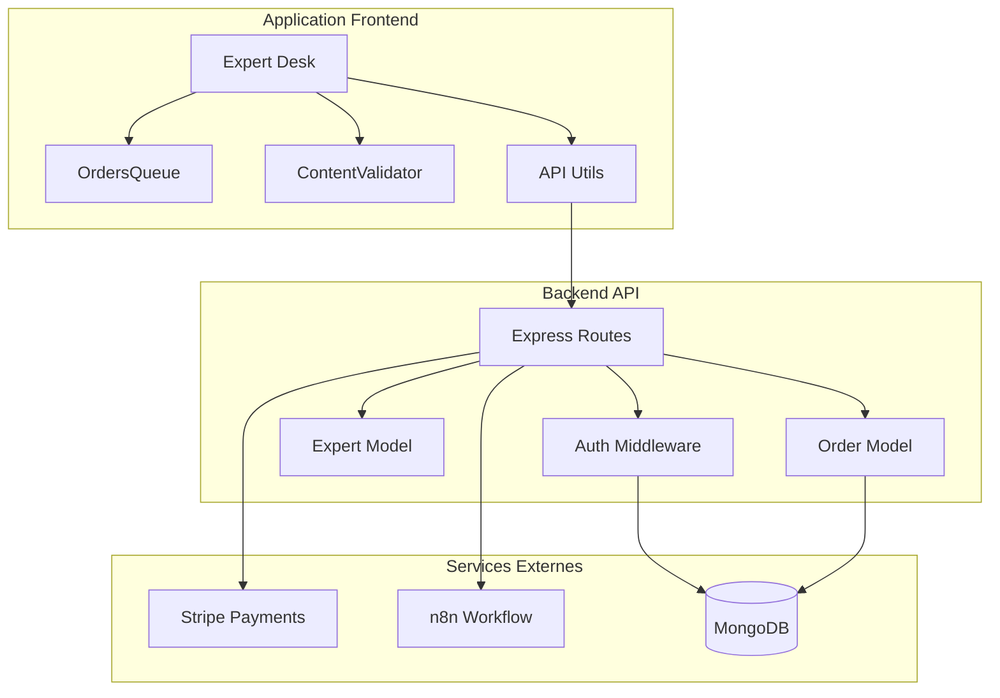
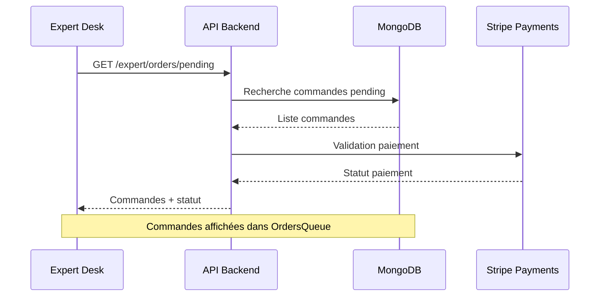
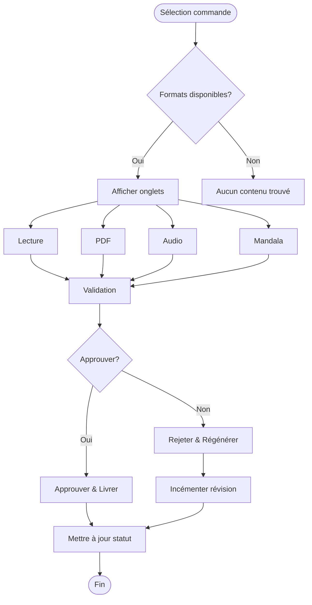
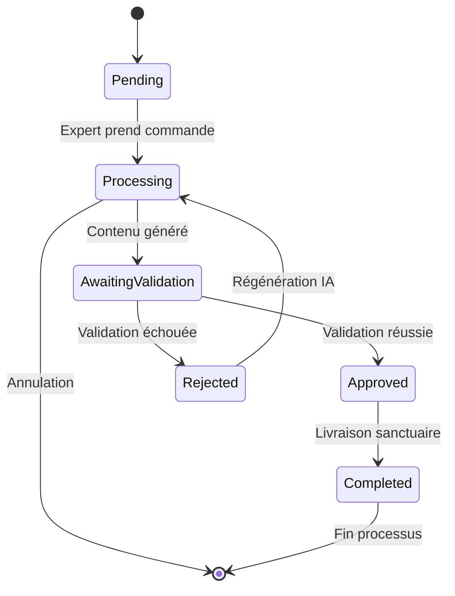
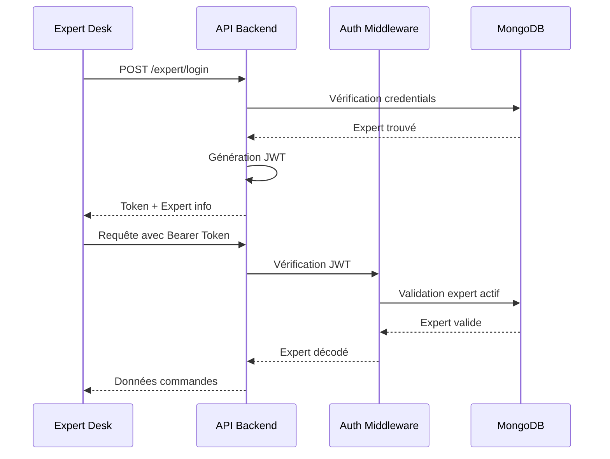
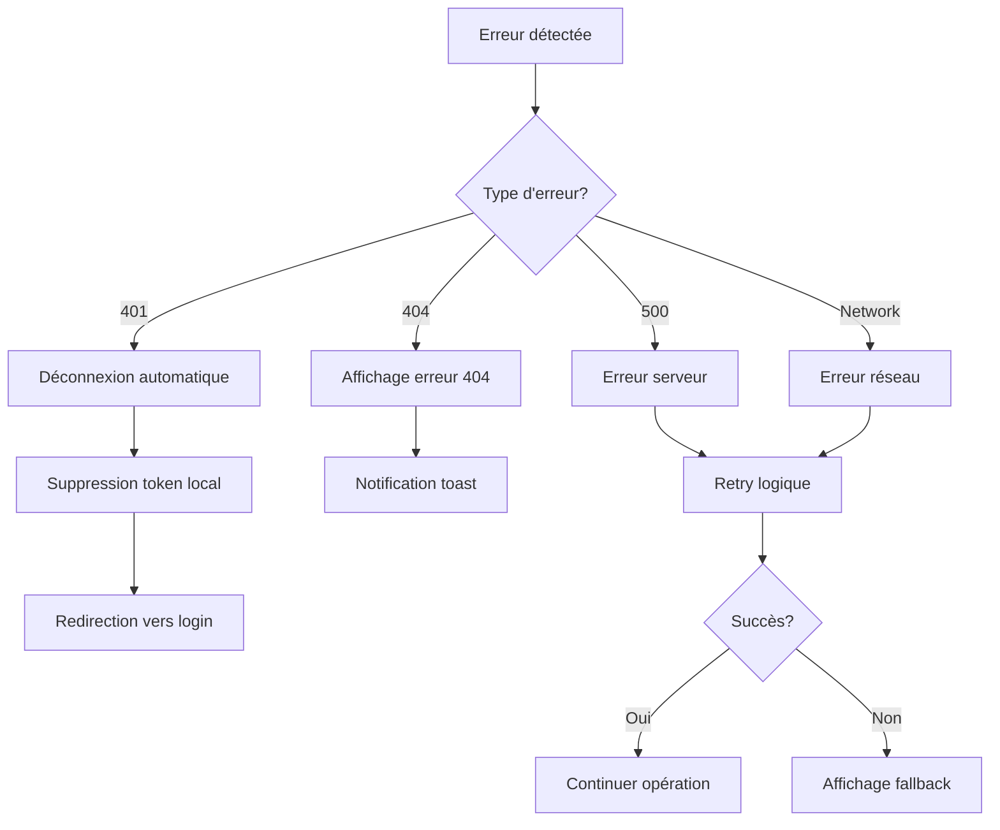

# Traitement des commandes par l'interface Expert Desk

<cite>
**Fichiers référencés dans ce document**
- [DeskPage.tsx](file://apps/expert-desk/src/pages/DeskPage.tsx)
- [OrdersQueue.tsx](file://apps/expert-desk/src/components/OrdersQueue.tsx)
- [ContentValidator.tsx](file://apps/expert-desk/src/components/ContentValidator.tsx)
- [api.ts](file://apps/expert-desk/src/utils/api.ts)
- [useAuth.ts](file://apps/expert-desk/src/hooks/useAuth.ts)
- [Order.ts](file://apps/expert-desk/src/types/Order.ts)
- [Order.ts](file://apps/api-backend/src/models/Order.ts)
- [expert.ts](file://apps/api-backend/src/routes/expert.ts)
- [orders.ts](file://apps/api-backend/src/routes/orders.ts)
- [enhancedOrder.ts](file://apps/api-backend/src/models/EnhancedOrder.ts)
</cite>

## Table des matières
1. [Introduction](#introduction)
2. [Architecture du système](#architecture-du-système)
3. [Flux de traitement des commandes](#flux-de-traitement-des-commandes)
4. [Interface utilisateur Expert Desk](#interface-utilisateur-expert-desk)
5. [Validation du contenu](#validation-du-contenu)
6. [Gestion de l'authentification](#gestion-de-lauthentification)
7. [Modèles de données](#modèles-de-données)
8. [Considérations de performance](#considérations-de-performance)
9. [Gestion des erreurs](#gestion-des-erreurs)
10. [Conclusion](#conclusion)

## Introduction

L'interface Expert Desk est un système de gestion de commandes conçu pour permettre aux experts de traiter les demandes de contenu générées par l'application Lumira Oracle. Ce système offre une interface intuitive pour gérer les commandes en attente, les valider, et orchestrer le processus de livraison au sanctuaire des clients.

Le système fonctionne selon un flux de travail en plusieurs étapes :
1. Les commandes sont créées après paiement via l'API backend
2. Elles sont ajoutées à une file d'attente (OrdersQueue)
3. Les experts peuvent prendre en charge les commandes
4. Le contenu généré est validé par l'expert via ContentValidator
5. Les mises à jour d'état sont synchronisées avec le backend

## Architecture du système



**Sources du diagramme**
- [DeskPage.tsx](file://apps/expert-desk/src/pages/DeskPage.tsx#L1-L50)
- [api.ts](file://apps/expert-desk/src/utils/api.ts#L1-L63)
- [expert.ts](file://apps/api-backend/src/routes/expert.ts#L1-L100)

## Flux de traitement des commandes

### Phase 1 : Récupération des commandes

Le processus commence lorsque l'expert se connecte à l'interface Expert Desk. La première étape consiste à récupérer les commandes en attente via l'API `/api/expert/orders/pending`.



**Sources du diagramme**
- [DeskPage.tsx](file://apps/expert-desk/src/pages/DeskPage.tsx#L60-L85)
- [api.ts](file://apps/expert-desk/src/utils/api.ts#L45-L55)

### Phase 2 : Prise en charge des commandes

Une fois une commande sélectionnée, l'expert peut la prendre en charge via le bouton "Prendre cette commande". Cette action déclenche une requête POST vers `/api/expert/orders/{orderId}/assign`.

**Sources de la phase**
- [DeskPage.tsx](file://apps/expert-desk/src/pages/DeskPage.tsx#L100-L120)
- [OrdersQueue.tsx](file://apps/expert-desk/src/components/OrdersQueue.tsx#L150-L170)

### Phase 3 : Validation du contenu

Après avoir pris en charge une commande, l'expert accède au ContentValidator pour examiner et valider le contenu généré. Le système supporte plusieurs formats :

- **Lecture** : Contenu textuel principal
- **PDF** : Documents générés
- **Audio** : Fichiers audio
- **Mandala** : SVG généré



**Sources du diagramme**
- [ContentValidator.tsx](file://apps/expert-desk/src/components/ContentValidator.tsx#L100-L150)
- [ContentValidator.tsx](file://apps/expert-desk/src/components/ContentValidator.tsx#L200-L250)

## Interface utilisateur Expert Desk

### Composant OrdersQueue

Le composant OrdersQueue affiche toutes les commandes en attente avec leurs informations principales :

```typescript
interface Order {
  _id: string;
  orderNumber: string;
  level: number;
  levelName: string;
  amount: number;
  userEmail: string;
  formData: {
    firstName: string;
    lastName: string;
    email: string;
    phone?: string;
    specificQuestion?: string;
  };
  createdAt: string;
  files?: Array<{
    filename: string;
    originalName: string;
    size: number;
  }>;
}
```

**Sources de la phase**
- [OrdersQueue.tsx](file://apps/expert-desk/src/components/OrdersQueue.tsx#L1-L50)
- [Order.ts](file://apps/expert-desk/src/types/Order.ts#L1-L30)

### Composant ContentValidator

Le ContentValidator permet aux experts de :
- Examiner le contenu généré sous différents formats
- Ajouter des notes de validation
- Approuver ou rejeter le contenu
- Indiquer les raisons de rejet

**Sources de la phase**
- [ContentValidator.tsx](file://apps/expert-desk/src/components/ContentValidator.tsx#L1-L100)

## Validation du contenu

### Processus de validation

La validation du contenu suit un workflow strict avec gestion des états :



**Sources du diagramme**
- [Order.ts](file://apps/api-backend/src/models/Order.ts#L10-L20)
- [expert.ts](file://apps/api-backend/src/routes/expert.ts#L940-L978)

### Payloads JSON échangés

#### Requête de validation
```json
{
  "orderId": "654321",
  "action": "approve",
  "validationNotes": "Contenu de haute qualité, conforme aux attentes",
  "rejectionReason": ""
}
```

#### Réponse de validation
```json
{
  "success": true,
  "message": "Contenu validé et livré au sanctuaire du client",
  "orderId": "654321",
  "status": "completed",
  "action": "approved"
}
```

**Sources de la phase**
- [expert.ts](file://apps/api-backend/src/routes/expert.ts#L940-L978)

## Gestion de l'authentification

### Sécurisation de l'accès

L'authentification JWT joue un rôle crucial dans la sécurisation de l'accès à l'interface expert :



**Sources du diagramme**
- [expert.ts](file://apps/api-backend/src/routes/expert.ts#L150-L200)
- [api.ts](file://apps/expert-desk/src/utils/api.ts#L15-L30)

### Middleware d'authentification

Le middleware `authenticateExpert` vérifie :
- La présence du token dans l'en-tête Authorization
- La validité du token JWT
- L'existence et l'activité de l'expert

**Sources de la phase**
- [expert.ts](file://apps/api-backend/src/routes/expert.ts#L120-L150)

## Modèles de données

### Structure de l'ordre

Le modèle Order contient tous les champs nécessaires pour suivre le processus complet :

```typescript
interface IOrder {
  orderNumber: string;
  userId: mongoose.Types.ObjectId;
  userEmail: string;
  level: 1 | 2 | 3 | 4;
  levelName: 'Simple' | 'Intuitive' | 'Alchimique' | 'Intégrale';
  amount: number;
  status: 'pending' | 'paid' | 'processing' | 'awaiting_validation' | 'completed' | 'failed' | 'refunded';
  
  // Expert validation system
  expertValidation?: {
    validatorId?: string;
    validatorName?: string;
    validationStatus: 'pending' | 'approved' | 'rejected';
    validationNotes?: string;
    validatedAt?: Date;
    rejectionReason?: string;
  };
  
  // Generated content
  generatedContent?: {
    reading?: string;
    audioUrl?: string;
    pdfUrl?: string;
    mandalaSvg?: string;
  };
  
  // Revision tracking
  revisionCount?: number;
}
```

**Sources de la phase**
- [Order.ts](file://apps/api-backend/src/models/Order.ts#L1-L100)

### Indexation pour performances

Le modèle utilise plusieurs indexs pour optimiser les requêtes courantes :
- `status`: Pour filtrer les commandes par statut
- `expertValidation.validationStatus`: Pour les commandes en attente de validation
- `createdAt`: Pour trier chronologiquement

**Sources de la phase**
- [Order.ts](file://apps/api-backend/src/models/Order.ts#L260-L275)

## Considérations de performance

### Optimisations de la file d'attente

Pour assurer une expérience utilisateur fluide, plusieurs optimisations ont été mises en place :

1. **Chargement différé** : Seules les commandes visibles sont chargées
2. **Cache local** : Les données sont stockées localement pour éviter les rechargements fréquents
3. **Polling intelligent** : Actualisation automatique des données toutes les 30 secondes
4. **Pagination** : Limitation du nombre d'éléments affichés simultanément

### Gestion des états de chargement

```typescript
// États de chargement pour améliorer l'expérience utilisateur
const [loading, setLoading] = useState(true);
const [refreshing, setRefreshing] = useState(false);
const [takingOrder, setTakingOrder] = useState<string | null>(null);
```

**Sources de la phase**
- [DeskPage.tsx](file://apps/expert-desk/src/pages/DeskPage.tsx#L20-L30)

## Gestion des erreurs

### Stratégies de récupération

Le système implémente plusieurs mécanismes de récupération d'erreurs :



**Sources du diagramme**
- [api.ts](file://apps/expert-desk/src/utils/api.ts#L30-L50)

### Messages d'erreur utilisateur

Les erreurs sont présentées sous forme de notifications toast pour une meilleure expérience utilisateur :

```typescript
// Exemple de gestion d'erreur
const errorMessage = error.response?.data?.error || 'Erreur lors du traitement';
toast.error(errorMessage);
```

**Sources de la phase**
- [DeskPage.tsx](file://apps/expert-desk/src/pages/DeskPage.tsx#L80-L90)

## Conclusion

L'interface Expert Desk représente un système robuste et bien structuré pour la gestion des commandes de contenu. Son architecture modulaire, ses mécanismes de sécurité solides, et ses optimisations de performance assurent une expérience utilisateur fluide tout en maintenant la sécurité des données.

Les points clés du système incluent :

- **Flux de traitement** : De la création de commande à la livraison finale
- **Interface utilisateur** : Intuitive et responsive avec plusieurs vues
- **Validation** : Système de validation flexible avec support multi-formats
- **Sécurité** : Authentification JWT et contrôle d'accès strict
- **Performance** : Optimisations pour une expérience utilisateur optimale

Ce système constitue une base solide pour l'évolution future des fonctionnalités d'expertise dans l'application Lumira Oracle.