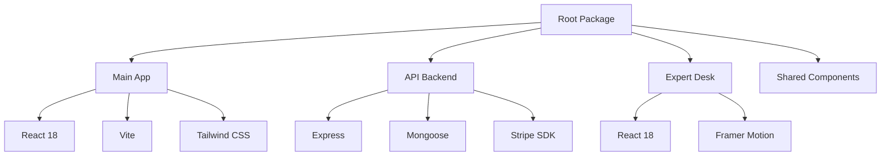
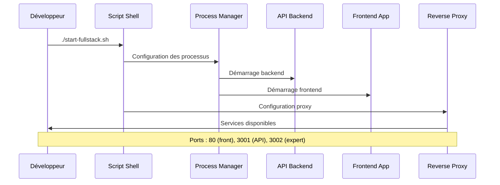
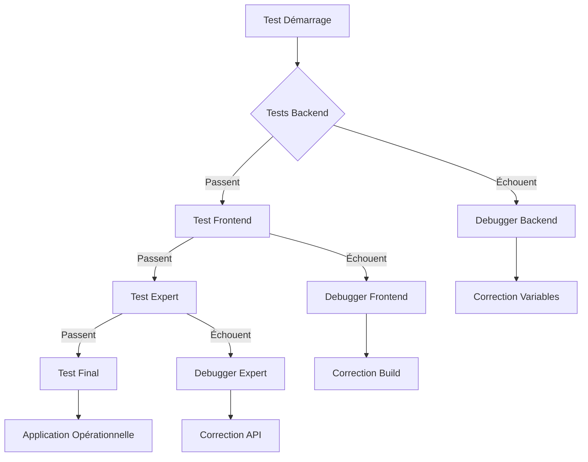
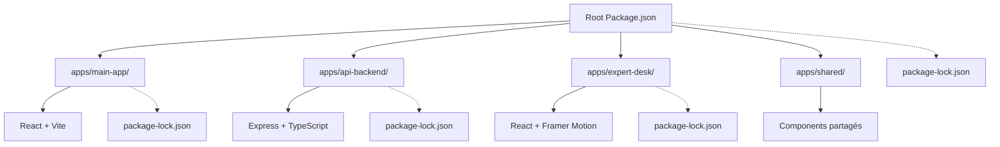
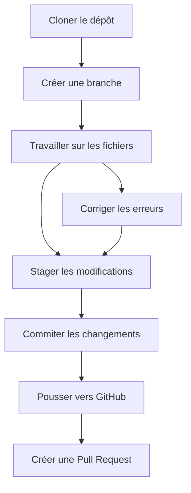
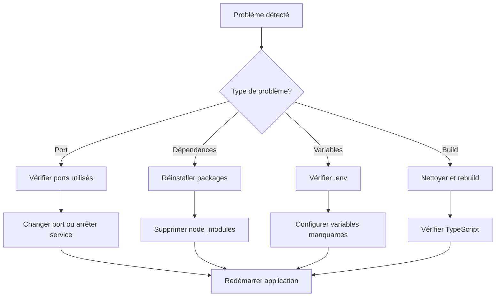

# Guide de démarrage développeur

<cite>
**Fichiers référencés dans ce document**
- [README.md](file://README.md)
- [TUTORIEL-GIT-DEBUTANT.md](file://TUTORIEL-GIT-DEBUTANT.md)
- [PACKAGE-MANAGEMENT-STRATEGY.md](file://PACKAGE-MANAGEMENT-STRATEGY.md)
- [start-fullstack.sh](file://start-fullstack.sh)
- [quick-test.js](file://quick-test.js)
- [check-env.js](file://check-env.js)
- [ecosystem.config.json](file://ecosystem.config.json)
- [deploy.sh](file://deploy.sh)
- [apps/api-backend/package.json](file://apps/api-backend/package.json)
- [apps/main-app/package.json](file://apps/main-app/package.json)
- [apps/api-backend/src/routes/env-debug.ts](file://apps/api-backend/src/routes/env-debug.ts)
</cite>

## Table des matières
1. [Introduction](#introduction)
2. [Prérequis système](#prérequis-système)
3. [Installation du projet](#installation-du-projet)
4. [Configuration des variables d'environnement](#configuration-des-variables-denvironnement)
5. [Lancement de l'application](#lancement-de-lapplication)
6. [Exécution des tests](#exécution-des-tests)
7. [Stratégie de gestion des paquets](#stratégie-de-gestion-des-paquets)
8. [Guide Git pour débutants](#guide-git-pour-débutants)
9. [Dépannage](#dépannage)
10. [Scripts utiles](#scripts-utiles)
11. [Conclusion](#conclusion)

## Introduction

Oracle Lumira est une application web mystique qui offre des lectures vibratoires personnalisées à travers 4 niveaux d'exploration spirituelle. Cette plateforme combine React/TypeScript, design immersif et intégrations avancées (Stripe, MongoDB, Dolibarr, n8n).

Ce guide vous accompagnera étape par étape pour configurer votre environnement de développement et démarrer avec le projet Oracle Lumira.

## Prérequis système

Avant de commencer, assurez-vous que votre système dispose des éléments suivants :

### Logiciels requis
- **Node.js 18+** : Version LTS recommandée
- **npm** : Gestionnaire de paquets Node.js
- **Git** : Contrôle de version distribué
- **Docker** (optionnel) : Conteneurisation des services
- **PostgreSQL** (optionnel) : Base de données alternative

### Recommandations
- **IDE** : Visual Studio Code, WebStorm ou éditeur de texte de votre choix
- **Navigateur** : Chrome, Firefox ou Edge pour les tests
- **Terminal** : PowerShell (Windows), Terminal (macOS) ou Bash (Linux)

## Installation du projet

### Étape 1 : Clonage du dépôt

```bash
# Clonez le dépôt depuis GitHub
git clone https://github.com/votre-repo/oracle-lumira

# Accédez au répertoire du projet
cd oracle-lumira
```

### Étape 2 : Installation des dépendances

Le projet utilise une architecture monorepo avec npm workspaces. Suivez ces étapes :

```bash
# Installation racine (toutes les applications)
npm install

# Ou installation sélective pour une application spécifique
npm install --workspace=apps/main-app
npm install --workspace=apps/api-backend
```

### Structure des dépendances



**Sources du diagramme**
- [apps/main-app/package.json](file://apps/main-app/package.json#L1-L45)
- [apps/api-backend/package.json](file://apps/api-backend/package.json#L1-L76)

**Sources de la section**
- [README.md](file://README.md#L50-L70)
- [PACKAGE-MANAGEMENT-STRATEGY.md](file://PACKAGE-MANAGEMENT-STRATEGY.md#L1-L50)

## Configuration des variables d'environnement

### Variables backend (.env)

Créez un fichier `.env` dans `apps/api-backend/` :

```bash
# Copiez le fichier exemple
cp apps/api-backend/.env.example apps/api-backend/.env

# Éditez le fichier avec vos valeurs
nano apps/api-backend/.env
```

Contenu du fichier `.env` :

```env
# Variables d'environnement critiques

# Stripe
STRIPE_SECRET_KEY=sk_test_votre_cle_secrete_stripe
STRIPE_WEBHOOK_SECRET=whsec_votre_webhook_secret
VITE_STRIPE_PUBLISHABLE_KEY=pk_test_votre_cle_publique_stripe

# Base de données
MONGODB_URI=mongodb://localhost:27017/oracle-lumira

# Sécurité
JWT_SECRET=votre_secret_jwt_32_caracteres_minimum

# URL API
VITE_API_BASE_URL=http://localhost:3001/api

# Environnement
NODE_ENV=development
PORT=3001
```

### Variables frontend (.env)

Pour l'application principale :

```bash
# Copiez le fichier exemple
cp apps/main-app/.env.example apps/main-app/.env

# Éditez le fichier
nano apps/main-app/.env
```

Contenu du fichier `.env` :

```env
# URL de l'API backend
VITE_API_URL=http://localhost:3001/api

# Clé publique Stripe
VITE_STRIPE_PUBLISHABLE_KEY=pk_test_votre_cle_publique_stripe

# Configuration de l'environnement
VITE_APP_ENV=development
```

### Validation des variables d'environnement

Utilisez le script de diagnostic pour vérifier la configuration :

```bash
# Test rapide de connectivité API
node check-env.js

# Vérification des variables d'environnement
curl http://localhost:3001/api/env-check
```

**Sources de la section**
- [check-env.js](file://check-env.js#L1-L75)
- [apps/api-backend/src/routes/env-debug.ts](file://apps/api-backend/src/routes/env-debug.ts#L1-L46)

## Lancement de l'application

### Mode développement avec scripts prédéfinis

Le projet fournit plusieurs scripts pour faciliter le développement :

```bash
# Lancement complet (backend + frontend)
./start-fullstack.sh

# Lancement minimal (sans Docker)
./start-minimal.sh

# Lancement avec optimisations
./start-fullstack-optimized.sh
```

### Lancement manuel pas à pas

#### Terminal 1 : Backend API

```bash
# Accédez au répertoire backend
cd apps/api-backend

# Lancez le serveur de développement
npm run dev

# Pour un build et lancement
npm run build
npm start
```

#### Terminal 2 : Frontend principal

```bash
# Accédez au répertoire frontend
cd apps/main-app

# Lancez le serveur de développement
npm run dev

# Pour un build de production
npm run build
```

#### Terminal 3 : Expert Desk

```bash
# Accédez au répertoire expert desk
cd apps/expert-desk

# Lancez le serveur de développement
npm run dev
```

### Architecture de lancement



**Sources du diagramme**
- [start-fullstack.sh](file://start-fullstack.sh#L1-L81)
- [ecosystem.config.json](file://ecosystem.config.json#L1-L31)

**Sources de la section**
- [start-fullstack.sh](file://start-fullstack.sh#L1-L81)
- [deploy.sh](file://deploy.sh#L1-L105)

## Exécution des tests

### Tests rapides

Le projet inclut un script de test rapide pour valider la connectivité :

```javascript
// Exécutez dans la console du navigateur
(async function() {
    console.log('🚀 Test rapide de l\'API...');
    
    // Test de la route de santé
    const healthResponse = await fetch('/api/health');
    console.log('✅ Health check status:', healthResponse.status);
    
    // Test de la route login
    const loginResponse = await fetch('/api/expert/login', {
        method: 'POST',
        headers: { 'Content-Type': 'application/json' },
        body: JSON.stringify({ email: 'test', password: 'test' })
    });
    
    console.log('Login route status:', loginResponse.status);
})();
```

### Tests automatisés

```bash
# Tests unitaires complets
npm test

# Tests en mode surveillance
npm run test:watch

# Tests de couverture
npm run test:coverage

# Test de disponibilité
npm run test:ready
```

### Tests de flux complet

```bash
# Test du workflow complet
node test-complete-flow.js

# Test du workflow expert
node test-expert-desk-workflow.js

# Test des paiements
node test-payment-intent.js
```

### Validation des tests



**Sources du diagramme**
- [quick-test.js](file://quick-test.js#L1-L49)
- [test-complete-flow.js](file://test-complete-flow.js)

**Sources de la section**
- [quick-test.js](file://quick-test.js#L1-L49)
- [apps/api-backend/package.json](file://apps/api-backend/package.json#L10-L15)

## Stratégie de gestion des paquets

### Architecture monorepo

Oracle Lumira utilise une architecture monorepo avec npm workspaces :



**Sources du diagramme**
- [PACKAGE-MANAGEMENT-STRATEGY.md](file://PACKAGE-MANAGEMENT-STRATEGY.md#L1-L30)

### Avantages de la stratégie

1. **Single lockfile** : Élimination des conflits de versions
2. **Dépendances partagées** : Optimisation des packages communs
3. **VSCode optimisé** : Pas de warnings sur les lockfiles
4. **Build Docker efficace** : Cache plus performant
5. **CI/CD simplifié** : Une seule installation nécessaire

### Commandes de maintenance

```bash
# Ajout d'une dépendance à une application spécifique
npm install --workspace=apps/main-app package-name

# Ajout d'une dépendance racine (devDependencies)
npm install -D package-name

# Audit de sécurité
npm audit fix

# Nettoyage des dépendances
npm dedupe
```

### Gestion des conflits

Le projet résout les conflits VSCode en ignorant les lockfiles dans les sous-applications :

```gitignore
# Ignorer les lockfiles dans les sous-applications
apps/*/package-lock.json
apps/*/yarn.lock
apps/*/pnpm-lock.yaml
```

**Sources de la section**
- [PACKAGE-MANAGEMENT-STRATEGY.md](file://PACKAGE-MANAGEMENT-STRATEGY.md#L1-L110)

## Guide Git pour débutants

### Configuration initiale

Configurez votre environnement Git :

```bash
# Vérifiez la version Git
git --version

# Configurez votre identité
git config --global user.name "Votre Nom"
git config --global user.email "votre@email.com"

# Activez l'affichage coloré
git config --global color.ui true
```

### Flux de travail recommandé



### Étapes détaillées

#### 1. Préparation de l'environnement

```bash
# Ouvrir le terminal
# Windows : Win + R, tapez cmd
# Mac : Cmd + Espace, tapez Terminal
# Linux : Ctrl + Alt + T

# Naviguer vers le projet
cd C:\Users\VotreNom\Desktop\oracle-lumira

# Vérifier la structure
ls  # ou dir sur Windows
```

#### 2. Création d'une nouvelle branche

```bash
# Créer et basculer sur une nouvelle branche
git checkout -b feature/nouvelle-fonctionnalite

# Vérifier la branche active
git branch
```

#### 3. Copie des fichiers depuis WebContainer

**Important** : Copiez manuellement le contenu des fichiers depuis WebContainer vers votre éditeur local.

#### 4. Configuration des variables d'environnement

```bash
# Backend
cp apps/api-backend/.env.example apps/api-backend/.env
# Éditer avec vos vraies valeurs

# Frontend
cp apps/main-app/.env.example apps/main-app/.env
# Éditer avec vos vraies valeurs
```

#### 5. Test en local

```bash
# Installer les dépendances
cd apps/api-backend && npm install
cd ../main-app && npm install

# Démarrer les serveurs
# Terminal 1 : Backend
cd apps/api-backend && npm run dev

# Terminal 2 : Frontend
cd apps/main-app && npm run dev
```

#### 6. Commit et poussage

```bash
# Vérifier les changements
git status

# Ajouter les fichiers modifiés
git add .

# Créer le commit
git commit -m "feat: nouvelle fonctionnalité

- Description détaillée des changements
- Impact sur l'application
- Tests effectués"

# Pousser vers GitHub
git push origin feature/nouvelle-fonctionnalite
```

**Sources de la section**
- [TUTORIEL-GIT-DEBUTANT.md](file://TUTORIEL-GIT-DEBUTANT.md#L1-L267)

## Dépannage

### Problèmes courants et solutions

#### Port déjà utilisé

```bash
# Windows
netstat -ano | findstr :3000
taskkill /PID numero_process /F

# macOS/Linux
lsof -ti:3000 | xargs kill -9
```

#### Dépendances manquantes

```bash
# Réinstaller toutes les dépendances
npm install

# Nettoyer et réinstaller
rm -rf node_modules package-lock.json
npm install
```

#### Variables d'environnement manquantes

```bash
# Vérifier les variables d'environnement
node check-env.js

# Test de connectivité API
curl http://localhost:3001/api/health
```

#### Erreurs de build

```bash
# Nettoyer le build
npm run clean

# Rebuild avec cache
npm run build -- --force

# Vérifier la configuration TypeScript
npx tsc --noEmit
```

### Diagnostic complet



### Logs et debugging

```bash
# Logs PM2
pm2 logs api-backend

# Logs Docker
docker-compose logs -f

# Logs Nginx
tail -f /var/log/nginx/error.log

# Logs application
npm run dev  # Console directe
```

**Sources de la section**
- [check-env.js](file://check-env.js#L1-L75)
- [start-fullstack.sh](file://start-fullstack.sh#L1-L81)

## Scripts utiles

### Scripts de développement

```bash
# Lancement rapide
./start-fullstack.sh

# Lancement minimal
./start-minimal.sh

# Déploiement
./deploy.sh

# Nettoyage
npm run clean
```

### Scripts de test

```bash
# Test rapide
node quick-test.js

# Test complet
node test-complete-flow.js

# Test expert
node test-expert-desk-workflow.js
```

### Scripts de diagnostic

```bash
# Vérification environnement
node check-env.js

# Diagnostic Docker
./diagnose-bad-gateway.sh
./diagnose-container.sh
```

### Scripts de maintenance

```bash
# Audit sécurité
npm audit fix

# Nettoyage dépendances
npm dedupe

# Validation TypeScript
npx tsc --noEmit
```

**Sources de la section**
- [start-fullstack.sh](file://start-fullstack.sh#L1-L81)
- [quick-test.js](file://quick-test.js#L1-L49)
- [check-env.js](file://check-env.js#L1-L75)

## Conclusion

Vous êtes maintenant prêt à contribuer au projet Oracle Lumira ! Voici les étapes clés à retenir :

1. **Installation** : Clonez le dépôt et installez les dépendances
2. **Configuration** : Configurez vos variables d'environnement
3. **Lancement** : Utilisez les scripts prédéfinis pour démarrer
4. **Tests** : Validez votre configuration avec les tests fournis
5. **Développement** : Suivez le flux Git recommandé

### Prochaines étapes recommandées

- Explorez la structure des composants React
- Familiarisez-vous avec l'API backend
- Participer aux discussions sur les issues GitHub
- Proposer des améliorations via des pull requests

### Ressources supplémentaires

- Documentation API : [README.md](README.md)
- Guide Git : [TUTORIEL-GIT-DEBUTANT.md](TUTORIEL-GIT-DEBUTANT.md)
- Stratégie de gestion des paquets : [PACKAGE-MANAGEMENT-STRATEGY.md](PACKAGE-MANAGEMENT-STRATEGY.md)

**Sources de la section**
- [README.md](file://README.md#L1-L259)
- [TUTORIEL-GIT-DEBUTANT.md](file://TUTORIEL-GIT-DEBUTANT.md#L1-L267)