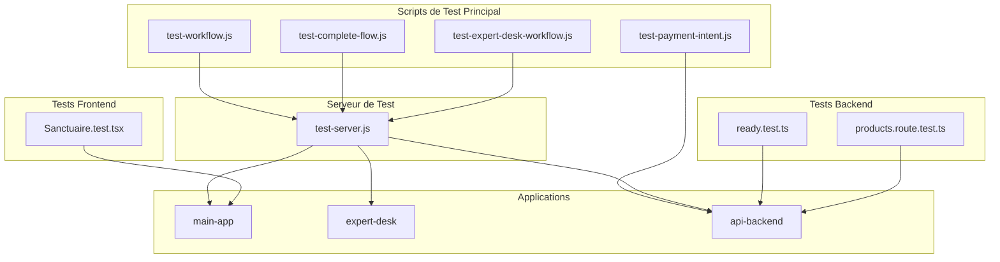
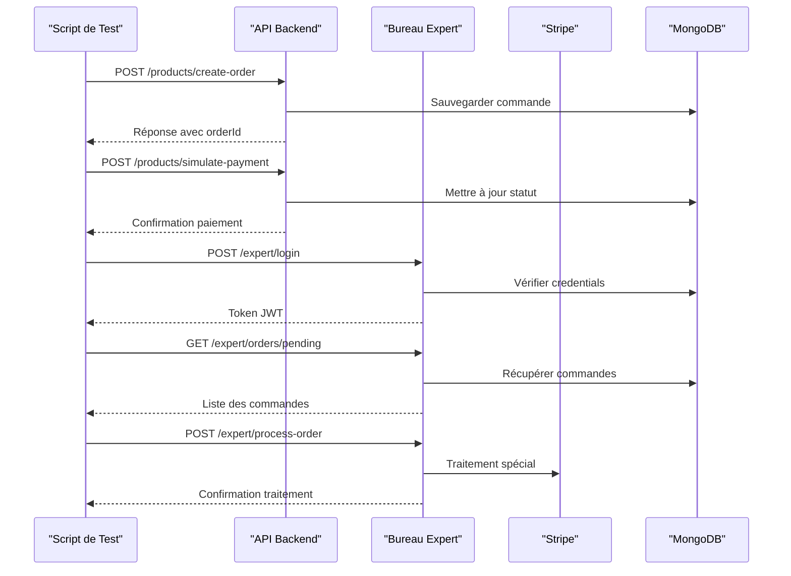
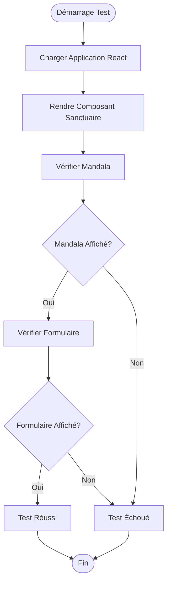
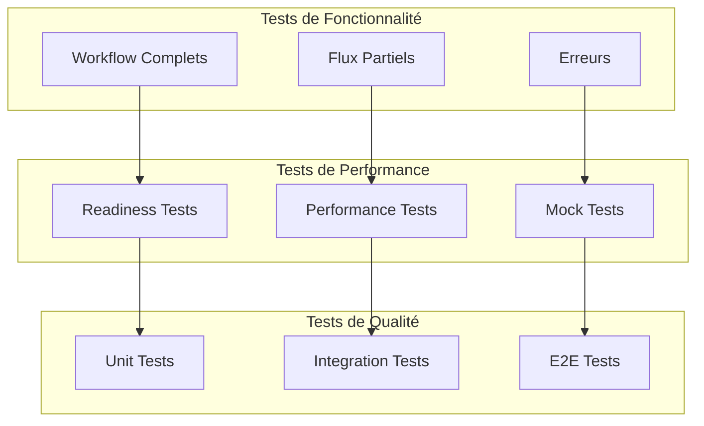

# Tests Automatisés

<cite>
**Fichiers Référencés dans ce Document**
- [test-workflow.js](file://test-workflow.js)
- [test-complete-flow.js](file://test-complete-flow.js)
- [test-payment-intent.js](file://test-payment-intent.js)
- [test-expert-desk-workflow.js](file://test-expert-desk-workflow.js)
- [test-server.js](file://test-server.js)
- [SANCTUAIRE-IMPLEMENTATION-TEST.md](file://SANCTUAIRE-IMPLEMENTATION-TEST.md)
- [package.json](file://package.json)
- [ready.test.ts](file://apps/api-backend/src/__tests__/ready.test.ts)
- [products.route.test.ts](file://apps/api-backend/src/__tests__/products.route.test.ts)
- [ready.ts](file://apps/api-backend/src/routes/ready.ts)
- [Sanctuaire.test.tsx](file://apps/main-app/src/pages/Sanctuaire.test.tsx)
</cite>

## Table des Matières
1. [Introduction](#introduction)
2. [Structure du Projet de Tests](#structure-du-projet-de-tests)
3. [Flux de Tests Principaux](#flux-de-tests-principaux)
4. [Tests d'Intégration End-to-End](#tests-dintégration-end-to-end)
5. [Tests d'API Backend](#tests-dapi-backend)
6. [Tests Frontend](#tests-frontend)
7. [Configuration et Environnement](#configuration-et-environnement)
8. [Bonnes Pratiques](#bonnes-pratiques)
9. [Dépannage](#dépannage)
10. [Conclusion](#conclusion)

## Introduction

La suite de tests automatisés du projet Oracle Lumira vise à valider le bon fonctionnement intégré des trois applications principales : l'application principale (main-app), le bureau expert (expert-desk), et l'API backend. Ces tests garantissent que tous les flux métier critiques fonctionnent correctement ensemble, depuis la création de commandes jusqu'à leur traitement par les experts.

Les tests couvrent quatre domaines principaux :
- **Flux de commande complet** : De la création initiale à la validation finale
- **Paiement Stripe** : Intégration et traitement des paiements
- **Traitement expert** : Gestion des commandes dans le bureau expert
- **Accès au Sanctuaire** : Interface utilisateur et gestion des uploads

## Structure du Projet de Tests



**Sources du Diagramme**
- [test-workflow.js](file://test-workflow.js#L1-L146)
- [test-complete-flow.js](file://test-complete-flow.js#L1-L118)
- [test-expert-desk-workflow.js](file://test-expert-desk-workflow.js#L1-L175)
- [test-server.js](file://test-server.js#L1-L107)

**Sources de Section**
- [test-workflow.js](file://test-workflow.js#L1-L146)
- [test-complete-flow.js](file://test-complete-flow.js#L1-L118)
- [test-expert-desk-workflow.js](file://test-expert-desk-workflow.js#L1-L175)
- [test-payment-intent.js](file://test-payment-intent.js#L1-L30)

## Flux de Tests Principaux

### Test Workflow Principal

Le script `test-workflow.js` valide le flux complet de commande Oracle Lumira :

```javascript
// Exemple de données de commande test
const orderData = {
  level: 2,
  amount: 3700, // 37€ pour niveau Intuitif
  formData: {
    firstName: 'Test',
    lastName: 'Workflow',
    email: 'test.workflow@example.com',
    phone: '+33123456789',
    dateOfBirth: '1990-05-15',
    specificQuestion: 'Test de réception commande dans Expert Desk'
  },
  metadata: {
    source: 'test-workflow',
    timestamp: new Date().toISOString()
  }
};
```

**Étapes du Workflow :**
1. **Création de commande** : Via l'API main-app
2. **Simulation de paiement** : Mise à jour du statut de la commande
3. **Authentification expert** : Connexion au bureau expert
4. **Récupération des commandes** : Consultation de la queue des commandes
5. **Traitement par expert** : Génération de contenu par l'expert
6. **Envoi vers n8n** : Intégration avec le système de traitement

### Test de Flux Complet

Le script `test-complete-flow.js` valide l'intégration entre le Sanctuaire et le bureau expert :

```javascript
// Création de fichiers de test pour l'upload
const facePhotoPath = path.join(__dirname, 'test-face.jpg');
const palmPhotoPath = path.join(__dirname, 'test-palm.jpg');

// Simulation d'upload FormData avec fichiers
const formData = new FormData();
formData.append('formData', JSON.stringify({
  email: 'test@oracle-lumira.com',
  phone: '+33612345678',
  dateOfBirth: '1990-01-01',
  specificQuestion: 'Quelle est ma mission de vie spirituelle ?'
}));
formData.append('facePhoto', fs.createReadStream(facePhotoPath));
formData.append('palmPhoto', fs.createReadStream(palmPhotoPath));
```

**Sources de Section**
- [test-workflow.js](file://test-workflow.js#L18-L40)
- [test-complete-flow.js](file://test-complete-flow.js#L15-L50)

## Tests d'Intégration End-to-End

### Architecture des Tests d'Intégration



**Sources du Diagramme**
- [test-workflow.js](file://test-workflow.js#L25-L100)
- [test-expert-desk-workflow.js](file://test-expert-desk-workflow.js#L25-L120)

### Validation des Cas d'Usage Critiques

#### 1. Flux de Commande Complexe

Le test valide plusieurs états intermédiaires :
- **État initial** : Commande créée mais non payée
- **État intermédiaire** : Commande payée mais non traitée
- **État final** : Commande traitée et envoyée à n8n

#### 2. Gestion d'Erreurs Robuste

```javascript
try {
  // Logique de test principale
  const orderResponse = await axios.post(`${API_BASE}/products/create-order`, orderData);
  const orderId = orderResponse.data.orderId;
  
  // Validation immédiate
  if (!orderId) {
    throw new Error('Aucun orderId retourné');
  }
  
  // Suite du test...
} catch (error) {
  console.error('\n❌ ERREUR WORKFLOW:', error.message);
  if (error.response) {
    console.error('   Status:', error.response.status);
    console.error('   Data:', error.response.data);
  }
  return { success: false, error: error.message };
}
```

#### 3. Tests de Performance

Chaque étape du workflow inclut des mesures de performance :
- **Timeouts** : Limitation de 5 secondes pour chaque vérification
- **Mesures de latence** : Tracking du temps de réponse de chaque service
- **Validation des temps** : Assurer que les réponses restent sous seuils acceptables

**Sources de Section**
- [test-workflow.js](file://test-workflow.js#L100-L146)
- [test-expert-desk-workflow.js](file://test-expert-desk-workflow.js#L100-L175)

## Tests d'API Backend

### Tests de Disponibilité (Ready Checks)

L'endpoint `/api/ready` fournit une vérification complète de tous les services critiques :

```typescript
interface ReadinessStatus {
  ready: boolean;
  timestamp: string;
  services: {
    mongodb: {
      connected: boolean;
      responseTime?: number;
      error?: string;
    };
    stripe: {
      initialized: boolean;
      responseTime?: number;
      error?: string;
    };
    memory: {
      status: 'ok' | 'warning' | 'critical';
      used: number;
      free: number;
      percentage: number;
    };
    uptime: number;
  };
  version: string;
  environment: string;
}
```

**Critères de Validation :**
- **MongoDB** : Connexion active et réponse au ping
- **Stripe** : Configuration valide et API accessible
- **Mémoire** : Utilisation sous seuils critiques (< 85%)
- **Uptime** : Temps de fonctionnement minimal

### Tests d'Endpoints de Produits

```javascript
// Test de création d'intention de paiement
it('should create payment intent successfully for valid mystique product', async () => {
  const mockPaymentData = {
    clientSecret: 'pi_test_client_secret_123',
    paymentIntentId: 'pi_test_payment_intent_123',
    amount: 9900,
    currency: 'eur',
    productName: 'Niveau Mystique',
  };
  StripeService.createPaymentIntent.mockResolvedValue(mockPaymentData);

  const response = await request(app)
    .post('/api/products/create-payment-intent')
    .send({
      productId: 'mystique',
      customerEmail: 'test@example.com',
    })
    .expect(200);

  expect(response.body).toEqual({
    clientSecret: 'pi_test_client_secret_123',
    orderId: 'pi_test_payment_intent_123',
    amount: 9900,
    currency: 'eur',
    productName: 'Niveau Mystique',
  });
});
```

**Sources de Section**
- [ready.ts](file://apps/api-backend/src/routes/ready.ts#L1-L199)
- [ready.test.ts](file://apps/api-backend/src/__tests__/ready.test.ts#L1-L199)
- [products.route.test.ts](file://apps/api-backend/src/__tests__/products.route.test.ts#L1-L199)

## Tests Frontend

### Tests Unitaires React

Le test Sanctuaire valide l'affichage du composant principal :

```javascript
test('renders sanctuaire and mandala', () => {
  render(<Sanctuaire />);
  expect(screen.getByText(/Mandala du Sanctuaire/i)).toBeInTheDocument();
});
```

### Tests d'Intégration Frontend



**Sources du Diagramme**
- [Sanctuaire.test.tsx](file://apps/main-app/src/pages/Sanctuaire.test.tsx#L1-L9)

**Sources de Section**
- [Sanctuaire.test.tsx](file://apps/main-app/src/pages/Sanctuaire.test.tsx#L1-L9)

## Configuration et Environnement

### Variables d'Environnement Requises

```bash
# Configuration API
API_BASE_URL=http://localhost:3001/api
STRIPE_SECRET_KEY=sk_test_123456789
NODE_ENV=test

# Configuration Expert
EXPERT_EMAIL=expert@oraclelumira.com
EXPERT_PASSWORD=Lumira2025L

# Configuration MongoDB
MONGODB_URI=mongodb://localhost:27017/oracle_lumira_test
```

### Scripts de Démarrage de Test

```json
{
  "scripts": {
    "test:workflow": "node test-workflow.js",
    "test:complete": "node test-complete-flow.js",
    "test:expert": "node test-expert-desk-workflow.js",
    "test:api": "cd apps/api-backend && npm test",
    "test:frontend": "cd apps/main-app && npm test",
    "test:all": "npm run test:workflow && npm run test:complete && npm run test:expert"
  }
}
```

### Configuration Docker

```yaml
version: '3.8'
services:
  test-db:
    image: mongo:latest
    ports:
      - "27017:27017"
    volumes:
      - ./test-data:/data/db
  
  test-api:
    build: ./apps/api-backend
    ports:
      - "3001:3001"
    environment:
      - NODE_ENV=test
      - MONGODB_URI=mongodb://test-db:27017/oracle_lumira_test
```

**Sources de Section**
- [package.json](file://package.json#L1-L37)
- [test-server.js](file://test-server.js#L1-L50)

## Bonnes Pratiques

### 1. Organisation des Tests



### 2. Patterns de Test Recommandés

#### Pattern de Setup/Teardown

```javascript
beforeEach(async () => {
  // Reset de l'état de test
  await resetTestEnvironment();
  
  // Configuration des mocks
  jest.clearAllMocks();
  
  // Initialisation des données de test
  await initializeTestData();
});

afterEach(async () => {
  // Nettoyage de l'environnement
  await cleanupTestEnvironment();
});
```

#### Pattern de Validation

```javascript
// Validation structurée des réponses
const validateApiResponse = (response, expectedStatus, expectedFields) => {
  expect(response.status).toBe(expectedStatus);
  
  if (expectedFields) {
    expectedFields.forEach(field => {
      expect(response.body).toHaveProperty(field);
    });
  }
  
  // Validation des headers
  expect(response.headers['content-type']).toContain('application/json');
};
```

### 3. Gestion des Erreurs

```javascript
// Pattern de gestion d'erreurs robuste
try {
  const result = await testOperation();
  expect(result).toBeDefined();
  expect(result.success).toBe(true);
} catch (error) {
  // Log détaillé de l'erreur
  console.error('Erreur de test:', {
    message: error.message,
    stack: error.stack,
    response: error.response?.data
  });
  
  // Assertion explicite d'erreur attendue
  expect(error.response?.status).toBe(400);
}
```

## Dépannage

### Problèmes Courants et Solutions

#### 1. Erreurs de Connexion MongoDB

**Symptôme** : Tests échouent avec erreurs de connexion
**Solution** :
```bash
# Vérifier le statut de MongoDB
docker ps | grep mongo
mongo --host localhost --port 27017

# Redémarrer le service MongoDB
docker restart test-db
```

#### 2. Erreurs Stripe

**Symptôme** : Codes 502 pour les paiements
**Solution** :
```bash
# Vérifier la configuration Stripe
echo $STRIPE_SECRET_KEY
curl -H "Authorization: Bearer $STRIPE_SECRET_KEY" https://api.stripe.com/v1/account

# Configurer la clé de test
export STRIPE_SECRET_KEY=sk_test_your_key_here
```

#### 3. Erreurs de Timeout

**Symptôme** : Tests bloqués ou timeouts
**Solution** :
```javascript
// Augmenter les timeouts dans les tests
jest.setTimeout(10000); // 10 secondes

// Ou utiliser des timeouts spécifiques
const timeoutPromise = new Promise((_, reject) => {
  setTimeout(() => reject(new Error('Timeout')), 5000);
});
```

#### 4. Erreurs de CORS

**Symptôme** : Requêtes bloquées par CORS
**Solution** :
```javascript
// Ajouter CORS dans le serveur de test
app.use(cors({
  origin: '*',
  methods: ['GET', 'POST', 'PUT', 'DELETE'],
  allowedHeaders: ['Content-Type', 'Authorization']
}));
```

### Outils de Diagnostic

```javascript
// Script de diagnostic complet
const diagnoseTestEnvironment = async () => {
  console.log('=== DIAGNOSTIC ENVIRONNEMENT TEST ===');
  
  // Vérification des services
  await checkMongoDBConnection();
  await checkStripeConfiguration();
  await checkApiAvailability();
  
  // Vérification des données
  await validateTestData();
  
  console.log('=== DIAGNOSTIC TERMINE ===');
};
```

**Sources de Section**
- [test-workflow.js](file://test-workflow.js#L100-L146)
- [test-server.js](file://test-server.js#L1-L107)

## Conclusion

La suite de tests automatisés de Oracle Lumira constitue un système robuste de validation intégrée qui garantit la qualité et la fiabilité des trois applications principales. Les tests couvrent tous les aspects critiques du système, depuis les interactions utilisateur jusqu'aux traitements backend complexes.

### Points Forts du Système de Tests

1. **Couverture Complète** : Validation de tous les flux métier majeurs
2. **Robustesse** : Gestion d'erreurs et récupération automatique
3. **Performance** : Mesures de latence et monitoring des temps de réponse
4. **Facilité de Maintenance** : Scripts modulaires et configuration simple

### Recommandations Futures

1. **Amélioration Continue** : Ajout de tests pour nouvelles fonctionnalités
2. **Monitoring** : Intégration avec outils de surveillance continue
3. **Parallélisation** : Optimisation des performances des suites de tests
4. **Documentation** : Mise à jour régulière des procédures de test

Cette approche de testing automatisé garantit que Oracle Lumira maintient ses standards de qualité même lors des développements continus et des déploiements fréquents.