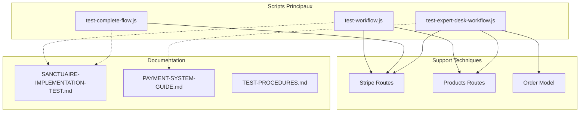
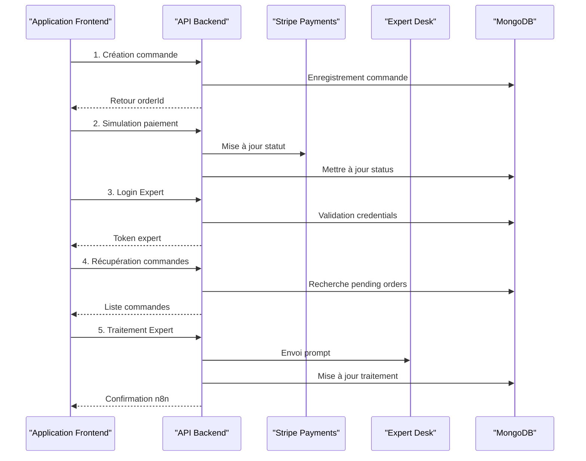
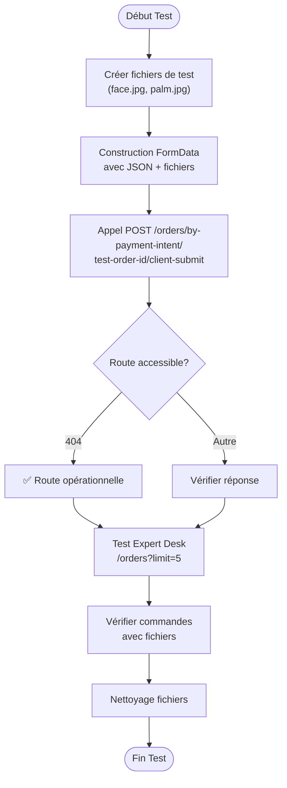
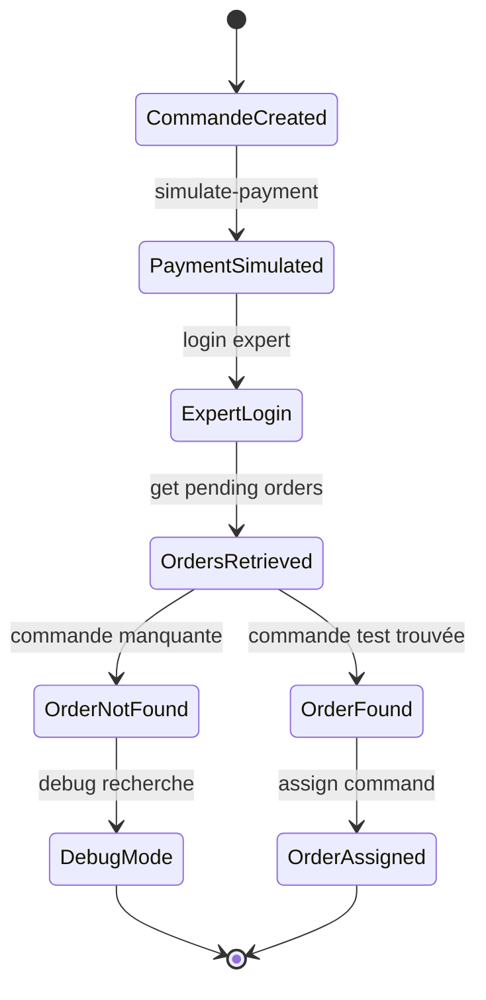
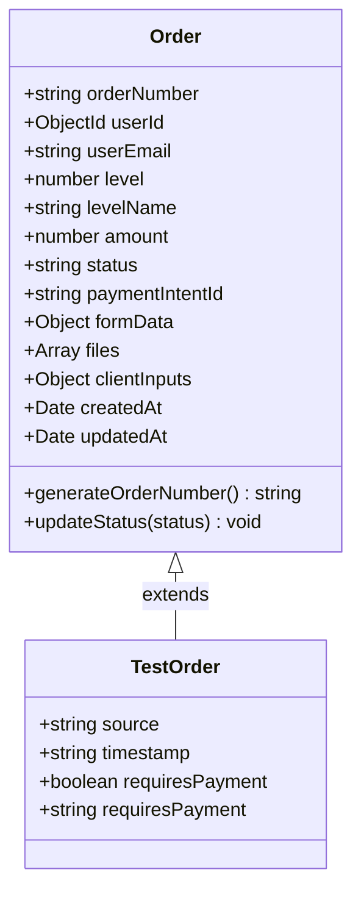
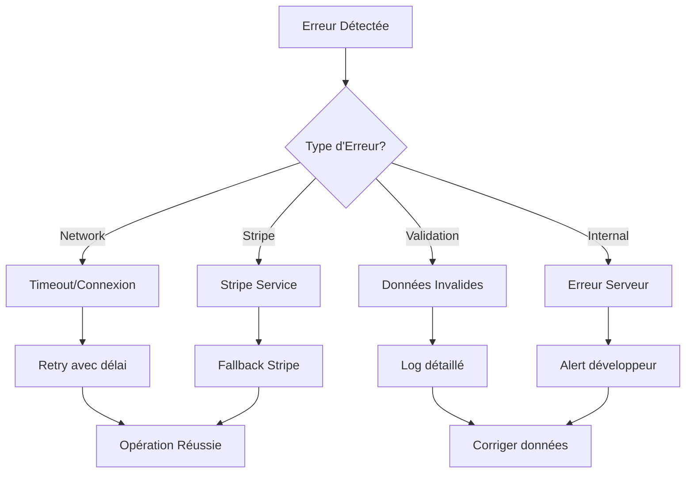

# Tests End-to-End - LumiraV1-MVP

<cite>
**Fichiers Référencés dans ce Document**
- [test-workflow.js](file://test-workflow.js)
- [test-complete-flow.js](file://test-complete-flow.js)
- [test-expert-desk-workflow.js](file://test-expert-desk-workflow.js)
- [SANCTUAIRE-IMPLEMENTATION-TEST.md](file://SANCTUAIRE-IMPLEMENTATION-TEST.md)
- [PAYMENT-SYSTEM-GUIDE.md](file://PAYMENT-SYSTEM-GUIDE.md)
- [TEST-PROCEDURES.md](file://TEST-PROCEDURES.md)
- [stripe.ts](file://apps/api-backend/src/routes/stripe.ts)
- [products.ts](file://apps/api-backend/src/routes/products.ts)
- [Order.ts](file://apps/api-backend/src/models/Order.ts)
</cite>

## Table des Matières
1. [Introduction](#introduction)
2. [Structure des Tests](#structure-des-tests)
3. [Flux de Test Principal](#flux-de-test-principal)
4. [Tests d'Intégration Complets](#tests-dintégration-complets)
5. [Tests Spécialisés](#tests-spécialisés)
6. [Architecture des Tests](#architecture-des-tests)
7. [Gestion des Erreurs](#gestion-des-erreurs)
8. [Guide de Dépannage](#guide-de-dépannage)
9. [Conclusion](#conclusion)

## Introduction

Les tests end-to-end du projet LumiraV1-MVP constituent un ensemble complet de scripts automatisés qui valident le parcours utilisateur complet depuis la création d'une commande jusqu'à l'accès au Sanctuaire. Ces tests simulent des interactions utilisateur réelles tout en vérifiant l'intégration entre tous les composants du système : frontend, backend, base de données et services externes comme Stripe.

Le système de tests couvre plusieurs workflows critiques :
- **Flux de paiement complet** : De la création de commande à la validation Stripe
- **Workflow Expert Desk** : Validation de la réception des commandes dans l'interface expert
- **Upload Sanctuaire** : Tests de la soumission de fichiers et synchronisation
- **Validation des états** : Vérification de la cohérence des données à travers les différents états

## Structure des Tests

### Hiérarchie des Scripts de Test



**Sources du Diagramme**
- [test-workflow.js](file://test-workflow.js#L1-L146)
- [test-complete-flow.js](file://test-complete-flow.js#L1-L118)
- [test-expert-desk-workflow.js](file://test-expert-desk-workflow.js#L1-L175)

### Composants Clés des Tests

Les tests utilisent principalement les bibliothèques suivantes :

- **Axios** : Pour les appels HTTP directs aux APIs
- **FormData** : Pour la simulation d'uploads avec fichiers
- **Multer** : Pour la gestion des uploads côté serveur
- **MongoDB** : Pour la validation de l'état de la base de données

**Sources de Section**
- [test-workflow.js](file://test-workflow.js#L1-L10)
- [test-complete-flow.js](file://test-complete-flow.js#L1-L10)

## Flux de Test Principal

### Workflow Oracle Lumira Complet

Le script `test-workflow.js` orchestre un parcours utilisateur complet en 5 étapes principales :



**Sources du Diagramme**
- [test-workflow.js](file://test-workflow.js#L15-L85)

### Étapes Détaillées du Workflow

#### 1. Création de Commande Test
```javascript
const orderData = {
  level: 2,
  amount: 3700, // 37€ pour niveau Intuitif
  formData: {
    firstName: 'Test',
    lastName: 'Workflow',
    email: 'test.workflow@example.com',
    phone: '+33123456789',
    dateOfBirth: '1990-05-15',
    specificQuestion: 'Test de réception commande dans Expert Desk avec design stellaire'
  },
  metadata: {
    source: 'test-workflow',
    timestamp: new Date().toISOString()
  }
};
```

#### 2. Simulation de Paiement
Le système simule un paiement réussi en mettant à jour le statut de la commande sans passer par Stripe réel.

#### 3. Validation Expert Desk
Les tests vérifient que les commandes payées apparaissent dans la queue Expert Desk avec les bonnes informations.

**Sources de Section**
- [test-workflow.js](file://test-workflow.js#L20-L50)
- [test-workflow.js](file://test-workflow.js#L55-L85)

## Tests d'Intégration Complets

### Test de Flux Upload Sanctuaire

Le script `test-complete-flow.js` valide la synchronisation end-to-end avec fichiers :



**Sources du Diagramme**
- [test-complete-flow.js](file://test-complete-flow.js#L15-L70)

### Validation des Routes et Endpoints

Les tests vérifient plusieurs endpoints critiques :

- **/orders/by-payment-intent/:id/client-submit** : Upload avec multer
- **/orders** : API Expert Desk avec limit=5
- **/orders/:orderId** : Consultation détaillée de commande

**Sources de Section**
- [test-complete-flow.js](file://test-complete-flow.js#L40-L80)

## Tests Spécialisés

### Test Expert Desk Workflow

Le script `test-expert-desk-workflow.js` se concentre spécifiquement sur la réception des commandes dans l'interface expert :



**Sources du Diagramme**
- [test-expert-desk-workflow.js](file://test-expert-desk-workflow.js#L25-L120)

### Tests de Validation du Sanctuaire

Le fichier `SANCTUAIRE-IMPLEMENTATION-TEST.md` documente les tests UX et fonctionnels du Sanctuaire :

- **État 1** : Formulaire actif avec mandala central
- **État 2** : Formulaire soumis en mode read-only
- **État 3** : Dashboard complet avec progression spirituelle

**Sources de Section**
- [SANCTUAIRE-IMPLEMENTATION-TEST.md](file://SANCTUAIRE-IMPLEMENTATION-TEST.md#L1-L50)
- [test-expert-desk-workflow.js](file://test-expert-desk-workflow.js#L80-L120)

## Architecture des Tests

### Modèle de Données des Tests

Les tests utilisent le modèle `Order` enrichi pour simuler les états réels :



**Sources du Diagramme**
- [Order.ts](file://apps/api-backend/src/models/Order.ts#L1-L50)

### Gestion des Assertions

Les tests effectuent plusieurs types d'assertions :

1. **Réponses API** : Vérification des codes de statut et des données retournées
2. **État de la Base de Données** : Validation des documents créés/modifiés
3. **Consistance des Données** : Vérification des relations entre entités
4. **Messages d'Erreur** : Validation des réponses d'erreur appropriées

**Sources de Section**
- [test-workflow.js](file://test-workflow.js#L60-L90)
- [test-expert-desk-workflow.js](file://test-expert-desk-workflow.js#L90-L130)

## Gestion des Erreurs

### Stratégies de Gestion d'Erreurs

Les tests implémentent une gestion d'erreurs robuste avec plusieurs niveaux de détection :



**Sources du Diagramme**
- [test-workflow.js](file://test-workflow.js#L90-L120)

### Codes d'Erreur et Messages

Les tests gèrent plusieurs catégories d'erreurs :

- **400 Bad Request** : Données de formulaire invalides
- **404 Not Found** : Ressources introuvables
- **500 Internal Server Error** : Erreurs serveur internes
- **502 Bad Gateway** : Problèmes de service externe (Stripe)

**Sources de Section**
- [test-workflow.js](file://test-workflow.js#L95-L115)

## Guide de Dépannage

### Problèmes Courants et Solutions

#### 1. Erreurs de Timeout
**Symptôme** : Tests échouent avec des timeouts
**Solution** :
```bash
# Augmenter les timeouts dans les scripts
# Vérifier la connectivité réseau
# Redémarrer les services backend
```

#### 2. Commandes Non Trouvées dans Expert Desk
**Symptôme** : La commande test n'apparaît pas dans la queue
**Solution** :
```javascript
// Vérifier les logs webhook
console.log('Vérification webhook processing...');
// Attendre un peu pour les webhooks
await new Promise(resolve => setTimeout(resolve, 2000));
```

#### 3. Erreurs de Signature Stripe
**Symptôme** : Webhook signature verification failed
**Solution** :
```bash
# Vérifier la configuration Stripe
echo $STRIPE_WEBHOOK_SECRET
# Redémarrer avec les bonnes variables d'environnement
```

#### 4. Problèmes de Base de Données
**Symptôme** : Erreurs de connexion MongoDB
**Solution** :
```bash
# Vérifier la base de données
docker ps | grep mongo
mongo --host localhost:27017
show collections
db.orders.countDocuments()
```

### Commandes de Diagnostic

```bash
# Diagnostic complet
./test-workflow.js
./test-complete-flow.js
./test-expert-desk-workflow.js

# Validation de l'environnement
node -v
npm -v
docker --version

# Vérification des services
curl -v http://localhost:3001/api/health
curl -v http://localhost:3000/api/health
```

**Sources de Section**
- [TEST-PROCEDURES.md](file://TEST-PROCEDURES.md#L1-L50)
- [test-workflow.js](file://test-workflow.js#L120-L146)

## Conclusion

Les tests end-to-end du projet LumiraV1-MVP fournissent une couverture complète du parcours utilisateur, depuis la création de commande jusqu'à l'accès au Sanctuaire. Ils permettent de valider :

- **L'intégration API** : Communication entre frontend/backend
- **La gestion des paiements** : Flux Stripe complet
- **La synchronisation des données** : État cohérent à travers le système
- **La résilience** : Gestion des erreurs et récupération

Ces tests automatisés garantissent la qualité et la fiabilité du système avant déploiement en production, offrant une base solide pour l'évolution continue du projet.

**Sources de Section**
- [test-workflow.js](file://test-workflow.js#L130-L146)
- [PAYMENT-SYSTEM-GUIDE.md](file://PAYMENT-SYSTEM-GUIDE.md#L1-L50)