# Tests Unitaires Backend API

<cite>
**Fichiers Référencés dans ce Document**
- [ready.test.ts](file://apps/api-backend/src/__tests__/ready.test.ts)
- [products.route.test.ts](file://apps/api-backend/src/__tests__/products.route.test.ts)
- [auth.ts](file://apps/api-backend/src/middleware/auth.ts)
- [validation.ts](file://apps/api-backend/src/middleware/validation.ts)
- [ready.ts](file://apps/api-backend/src/routes/ready.ts)
- [stripe.ts](file://apps/api-backend/src/services/stripe.ts)
- [package.json](file://apps/api-backend/package.json)
</cite>

## Table des Matières
1. [Introduction](#introduction)
2. [Structure des Tests](#structure-des-tests)
3. [Configuration Jest](#configuration-jest)
4. [Tests d'Intégrité du Système](#tests-dintégrité-du-système)
5. [Tests de Routes Express](#tests-de-routes-express)
6. [Mocking des Services Externes](#mocking-des-services-externes)
7. [Tests des Middlewares](#tests-des-middlewares)
8. [Gestion des Erreurs](#gestion-des-erreurs)
9. [Bonnes Pratiques](#bonnes-pratiques)
10. [Couverture de Test](#couverture-de-test)
11. [Conclusion](#conclusion)

## Introduction

Les tests unitaires du backend API Oracle Lumira constituent un système de qualité robuste qui garantit la fiabilité et la stabilité de l'ensemble du système. Cette documentation analyse en détail la structure des tests, les stratégies de mocking, et les bonnes pratiques mises en place pour tester efficacement les composants critiques du backend.

Le système de tests utilise Jest comme framework principal, combiné avec Supertest pour tester les endpoints Express.js. Les tests couvrent plusieurs aspects : validation des dépendances système, tests de routes, validation des middlewares, et simulation des services externes comme Stripe et MongoDB.

## Structure des Tests

La structure des tests est organisée de manière hiérarchique et modulaire, reflétant la structure du code source :


**Sources du Diagramme**
- [ready.test.ts](file://apps/api-backend/src/__tests__/ready.test.ts#L1-L50)
- [products.route.test.ts](file://apps/api-backend/src/__tests__/products.route.test.ts#L1-L50)

**Sources de Section**
- [ready.test.ts](file://apps/api-backend/src/__tests__/ready.test.ts#L1-L404)
- [products.route.test.ts](file://apps/api-backend/src/__tests__/products.route.test.ts#L1-L218)

## Configuration Jest

La configuration Jest est optimisée pour TypeScript et les tests backend, avec des paramètres spécifiques pour assurer une couverture complète :

```json
{
  "preset": "ts-jest",
  "testEnvironment": "node",
  "roots": ["<rootDir>/src"],
  "testMatch": ["**/__tests__/**/*.test.ts"],
  "collectCoverageFrom": [
    "src/**/*.ts",
    "!src/**/*.d.ts",
    "!src/__tests__/**"
  ],
  "coverageDirectory": "coverage",
  "coverageReporters": ["text", "lcov", "html"]
}
```

Cette configuration permet :
- **Compilation TypeScript** : Utilisation automatique de ts-jest
- **Environnement Node.js** : Tests exécutés dans un environnement serveur
- **Couverture de code** : Collecte automatique des fichiers testés
- **Formats de rapport** : Support pour text, lcov et HTML

**Sources de Section**
- [package.json](file://apps/api-backend/package.json#L40-L55)

## Tests d'Intégrité du Système

Le fichier `ready.test.ts` constitue l'exemple le plus complet de test d'intégrité du système. Il vérifie la disponibilité de toutes les dépendances critiques avant de marquer l'application comme prête pour le trafic production.

### Architecture des Tests de Readiness

```mermaid
sequenceDiagram
participant Client as "Client"
participant ReadyRoute as "Route Ready"
participant MongoChecker as "Vérificateur MongoDB"
participant StripeChecker as "Vérificateur Stripe"
participant MemoryChecker as "Vérificateur Mémoire"
Client->>ReadyRoute : GET /api/ready
ReadyRoute->>MongoChecker : checkMongoDB()
ReadyRoute->>StripeChecker : checkStripe()
ReadyRoute->>MemoryChecker : checkMemory()
MongoChecker-->>ReadyRoute : Statut MongoDB
StripeChecker-->>ReadyRoute : Statut Stripe
MemoryChecker-->>ReadyRoute : Statut Mémoire
ReadyRoute->>ReadyRoute : Évaluer isReady
ReadyRoute-->>Client : Réponse JSON
```



**Sources du Diagramme**
- [ready.test.ts](file://apps/api-backend/src/__tests__/ready.test.ts#L60-L120)
- [ready.ts](file://apps/api-backend/src/routes/ready.ts#L150-L200)

### Stratégies de Mocking

Le système de tests utilise plusieurs stratégies de mocking pour isoler les dépendances :

```typescript
// Mock Mongoose pour MongoDB
jest.mock('mongoose', () => ({
  connection: {
    readyState: 1,
    db: {
      admin: () => ({
        ping: jest.fn()
      })
    },
    host: 'localhost',
    name: 'test_db'
  }
}));

// Mock Stripe pour les services de paiement
jest.mock('stripe');
```

### Tests de Cas Succès

Les tests de succès vérifient que l'endpoint répond correctement lorsque tous les services sont opérationnels :

```typescript
it('devrait retourner 200 OK quand tous les services sont opérationnels', async () => {
  // Configuration des mocks
  (mongoose.connection as any).readyState = 1;
  mockMongoPing.mockResolvedValue({ ok: 1 });
  mockStripeAccount.mockResolvedValue({ id: 'acct_test123' });

  const response = await request(app)
    .get('/api/ready')
    .expect(200);

  expect(response.body).toMatchObject({
    ready: true,
    services: {
      mongodb: { connected: true },
      stripe: { initialized: true }
    }
  });
});
```

### Tests de Cas d'Échec

Les tests d'échec couvrent les scénarios où les services critiques ne sont pas disponibles :

```typescript
it('devrait retourner 503 quand MongoDB est déconnecté', async () => {
  (mongoose.connection as any).readyState = 0;

  const response = await request(app)
    .get('/api/ready')
    .expect(503);

  expect(response.body).toMatchObject({
    ready: false,
    services: {
      mongodb: { connected: false }
    }
  });
});
```

**Sources de Section**
- [ready.test.ts](file://apps/api-backend/src/__tests__/ready.test.ts#L60-L200)

## Tests de Routes Express

Les tests de routes suivent une approche structurée avec des cas d'usage bien définis. Le fichier `products.route.test.ts` illustre cette approche avec des tests pour l'endpoint de création d'intentions de paiement.

### Architecture des Tests de Route

```mermaid
flowchart TD
A[Demande HTTP] --> B[Middleware de Validation]
B --> C{Validation OK?}
C --> |Non| D[Réponse 400]
C --> |Oui| E[Middleware d'Auth]
E --> F{Auth OK?}
F --> |Non| G[Réponse 401/403]
F --> |Oui| H[Logique Métier]
H --> I{Service Externe OK?}
I --> |Non| J[Réponse 502/500]
I --> |Oui| K[Réponse 200]
D --> L[Fin du Test]
G --> L
J --> L
K --> L
```



**Sources du Diagramme**
- [products.route.test.ts](file://apps/api-backend/src/__tests__/products.route.test.ts#L20-L80)
- [validation.ts](file://apps/api-backend/src/middleware/validation.ts#L10-L25)

### Tests de Validation

Les tests de validation couvrent les différents scénarios d'entrée invalide :

```typescript
describe('Validation Errors (4xx)', () => {
  it('should return 400 for missing productId', async () => {
    const response = await request(app)
      .post('/api/products/create-payment-intent')
      .send({ customerEmail: 'test@example.com' })
      .expect(400);

    expect(response.body).toEqual({
      error: 'Product ID is required',
      code: 'MISSING_PRODUCT_ID',
      message: 'The productId field is required and must be a non-empty string'
    });
  });
});
```

### Tests de Services Externes

Les tests simulent les interactions avec des services externes comme Stripe :

```typescript
describe('Stripe Errors (502)', () => {
  it('should return 502 for Stripe service errors', async () => {
    const stripeError = new Error('Stripe API error: Invalid API key');
    StripeService.createPaymentIntent.mockRejectedValue(stripeError);

    const response = await request(app)
      .post('/api/products/create-payment-intent')
      .send({ productId: 'mystique', customerEmail: 'test@example.com' })
      .expect(502);

    expect(response.body.error).toBe('Payment service error');
  });
});
```

**Sources de Section**
- [products.route.test.ts](file://apps/api-backend/src/__tests__/products.route.test.ts#L40-L150)

## Mocking des Services Externes

Le système de tests utilise des stratégies sophistiquées pour simuler les services externes, permettant des tests rapides et fiables sans dépendance aux infrastructures externes.

### Mocking Stripe

```typescript
// Mock complet du service Stripe
jest.mock('../services/stripe', () => ({
  StripeService: {
    createPaymentIntent: jest.fn(),
  },
}));

// Configuration des mocks dans beforeEach
beforeEach(() => {
  StripeService.createPaymentIntent.mockResolvedValue({
    clientSecret: 'pi_test_client_secret_123',
    paymentIntentId: 'pi_test_payment_intent_123',
    amount: 9900,
    currency: 'eur',
    productName: 'Niveau Mystique',
  });
});
```

### Mocking MongoDB

```typescript
// Mock de la connexion MongoDB
jest.mock('mongoose', () => ({
  connection: {
    readyState: 1,
    db: {
      admin: () => ({
        ping: jest.fn()
      })
    }
  }
}));
```

### Stratégies de Mocking Avancées


**Sources du Diagramme**
- [ready.test.ts](file://apps/api-backend/src/__tests__/ready.test.ts#L20-L50)
- [stripe.ts](file://apps/api-backend/src/services/stripe.ts#L10-L30)

**Sources de Section**
- [ready.test.ts](file://apps/api-backend/src/__tests__/ready.test.ts#L20-L60)
- [products.route.test.ts](file://apps/api-backend/src/__tests__/products.route.test.ts#L10-L30)

## Tests des Middlewares

Les middlewares sont testés séparément pour garantir leur fonctionnalité indépendamment des routes. Cette approche permet une couverture complète et des tests plus faciles à maintenir.

### Tests d'Authentification

```typescript
describe('Middleware d\'Authentification', () => {
  it('should deny access without token', async () => {
    const response = await request(app)
      .get('/api/protected')
      .expect(401);

    expect(response.body).toEqual({
      error: 'Access denied. No token provided.',
      code: 'NO_TOKEN'
    });
  });

  it('should accept valid token', async () => {
    const token = jwt.sign(
      { id: '123', email: 'test@example.com' },
      process.env.JWT_SECRET!
    );

    const response = await request(app)
      .get('/api/protected')
      .set('Authorization', `Bearer ${token}`)
      .expect(200);

    expect(response.body.success).toBe(true);
  });
});
```

### Tests de Validation

```typescript
describe('Middleware de Validation', () => {
  it('should return 400 for invalid request', async () => {
    const response = await request(app)
      .post('/api/users')
      .send({ invalidField: 'value' })
      .expect(400);

    expect(response.body).toHaveProperty('error', 'Validation failed');
    expect(response.body.details).toBeInstanceOf(Array);
  });
});
```

### Tests de Rôle

```typescript
describe('Middleware de Rôle', () => {
  it('should deny access without required role', async () => {
    const token = jwt.sign(
      { id: '123', email: 'user@example.com', role: 'user' },
      process.env.JWT_SECRET!
    );

    const response = await request(app)
      .get('/api/admin')
      .set('Authorization', `Bearer ${token}`)
      .expect(403);

    expect(response.body).toHaveProperty('error', 'Insufficient permissions');
  });
});
```

**Sources de Section**
- [auth.ts](file://apps/api-backend/src/middleware/auth.ts#L10-L119)
- [validation.ts](file://apps/api-backend/src/middleware/validation.ts#L10-L64)

## Gestion des Erreurs

La gestion des erreurs est un aspect crucial des tests, couvrant les erreurs 400, 401, 403, 500 et 502 avec des tests spécifiques pour chaque type d'erreur.

### Stratégies de Test d'Erreurs

```mermaid
flowchart TD
A[Test d'Erreur] --> B{Type d'Erreur}
B --> |400| C[Validation Invalide]
B --> |401| D[Authentification Manquante]
B --> |403| E[Autorisation Refusée]
B --> |500| F[Erreur Interne Serveur]
B --> |502| G[Service Externe Indisponible]
B --> |503| H[Service Temporairement Indisponible]
B --> |408| I[Timeout]
C --> J[Vérification Message d'Erreur]
D --> J
E --> J
F --> J
G --> J
H --> J
I --> J
J --> K[Validation des Headers]
K --> L[Validation des Codes de Statut]
```



### Tests d'Erreurs Spécialisés

```typescript
describe('🚨 Gestion d\'erreurs', () => {
  it('devrait gérer les erreurs inattendues', async () => {
    mockMongoPing.mockImplementation(() => {
      throw new Error('Unexpected error');
    });

    const response = await request(app)
      .get('/api/ready')
      .expect(503);

    expect(response.body.ready).toBe(false);
    expect(response.headers['x-ready-status']).toBe('error');
  });

  it('devrait inclure le temps de réponse même en cas d\'erreur', async () => {
    mockMongoPing.mockRejectedValue(new Error('Test error'));

    const response = await request(app)
      .get('/api/ready')
      .expect(503);

    expect(response.headers['x-response-time']).toMatch(/\d+ms/);
    expect(response.body.services.mongodb.responseTime).toBeGreaterThanOrEqual(0);
  });
});
```

### Tests de Timeout

```typescript
describe('⏱️ Gestion des timeouts', () => {
  it('devrait retourner 408 en cas de timeout global', async () => {
    mockMongoPing.mockImplementation(() => 
      new Promise(resolve => setTimeout(resolve, 10000)) // 10s
    );

    const responsePromise = request(app).get('/api/ready');
    
    jest.advanceTimersByTime(6000);
    
    const response = await responsePromise;
    expect(response.status).toBe(408);
    expect(response.body.ready).toBe(false);
  });
});
```

**Sources de Section**
- [ready.test.ts](file://apps/api-backend/src/__tests__/ready.test.ts#L350-L400)

## Bonnes Pratiques

### Isolation des Tests

Chaque test doit être indépendant et ne pas dépendre des résultats des autres tests :

```typescript
beforeEach(() => {
  // Configuration propre pour chaque test
  app = express();
  app.use(express.json());
  app.use('/api', readyRoutes);
  
  // Reset des mocks
  jest.clearAllMocks();
  jest.clearAllTimers();
});

afterEach(() => {
  // Nettoyage après chaque test
  jest.resetAllMocks();
  jest.useRealTimers();
});
```

### Organisation des Tests

```mermaid
graph TB
subgraph "Organisation des Tests"
A[Suite Principale] --> B[describe('Cas de succès')]
A --> C[describe('Cas d\'échec')]
A --> D[describe('Gestion des timeouts')]
A --> E[describe('Endpoint verbose')]
A --> F[describe('Analyse mémoire')]
A --> G[describe('Gestion d\'erreurs')]
B --> H[it('test de succès')]
C --> I[it('test d\'échec')]
D --> J[it('test de timeout')]
end
```

### Tests de Couverture

```typescript
// Configuration de la couverture dans package.json
{
  "jest": {
    "collectCoverageFrom": [
      "src/**/*.ts",
      "!src/**/*.d.ts",
      "!src/__tests__/**"
    ]
  }
}
```

### Stratégies de Test

1. **Test de comportement** : Tester ce que fait le système plutôt que comment il le fait
2. **Test de données** : Utiliser des données de test cohérentes
3. **Test d'isolation** : Isoler chaque composant testé
4. **Test de régression** : Maintenir la compatibilité avec les tests existants

**Sources de Section**
- [ready.test.ts](file://apps/api-backend/src/__tests__/ready.test.ts#L40-L80)

## Couverture de Test

La configuration Jest collecte automatiquement la couverture de code et génère des rapports détaillés :

### Types de Rapports

```mermaid
graph LR
A[Jest Coverage] --> B[Texte Console]
A --> C[LCOV Report]
A --> D[HTML Report]
B --> E[Vue d'ensemble rapide]
C --> F[Intégration CI/CD]
D --> G[Navigation interactive]
```



### Métriques de Couverture

Les métriques principales incluent :
- **Lines Coverage** : Pourcentage de lignes exécutées
- **Functions Coverage** : Pourcentage de fonctions appelées
- **Branches Coverage** : Pourcentage de branches conditionnelles
- **Statements Coverage** : Pourcentage d'instructions exécutées

### Stratégies d'Amélioration

1. **Tests de chemin critique** : Prioriser les tests sur les fonctionnalités essentielles
2. **Tests de bordure** : Tester les cas limites et les valeurs extrêmes
3. **Tests de régression** : Maintenir la stabilité des fonctionnalités existantes
4. **Tests de performance** : Surveiller les performances des tests eux-mêmes

**Sources de Section**
- [package.json](file://apps/api-backend/package.json#L45-L55)

## Conclusion

Le système de tests unitaires du backend API Oracle Lumira représente une approche moderne et complète de la qualité logicielle. Avec plus de 400 lignes de tests couvrant tous les aspects critiques du système, cette solution garantit :

### Avantages Clés

1. **Fiabilité** : Tests automatisés garantissant la stabilité continue
2. **Isolation** : Tests indépendants grâce au mocking approprié
3. **Rapidité** : Exécution rapide sans dépendance aux infrastructures externes
4. **Couverture** : Métriques de couverture fournissant une visibilité complète
5. **Maintenabilité** : Structure claire et organisation modulaire

### Recommandations pour l'Évolution

1. **Augmenter la couverture** : Viser 90%+ de couverture de code
2. **Tests d'intégration** : Ajouter des tests avec infrastructures réelles
3. **Tests de charge** : Intégrer des tests de performance
4. **Tests de sécurité** : Inclure des tests de vulnérabilités
5. **Documentation** : Maintenir la documentation des tests

Cette approche de test constitue une base solide pour le développement continu et la maintenance du système Oracle Lumira, garantissant une expérience utilisateur fiable et une plateforme de paiement sécurisée.