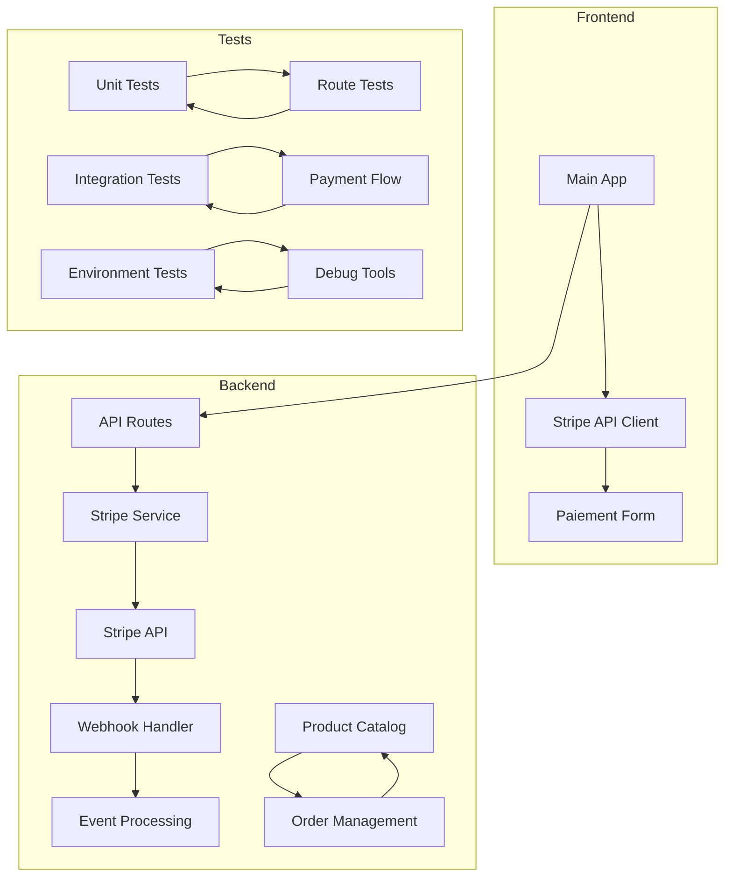
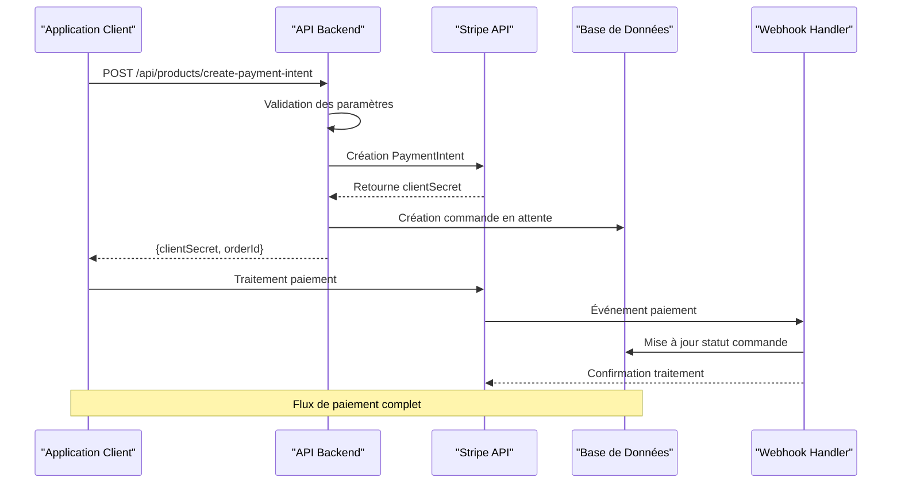
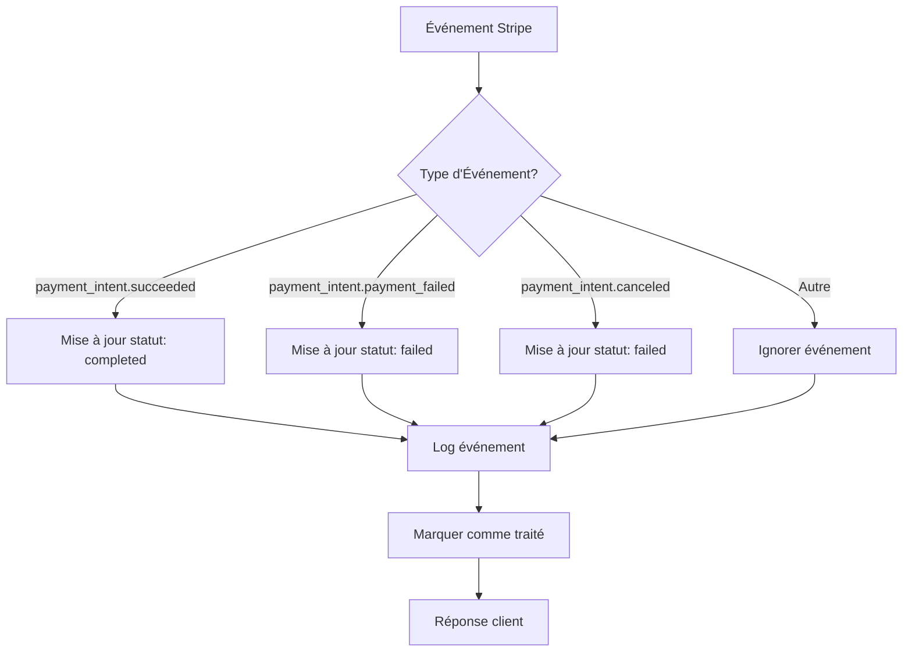
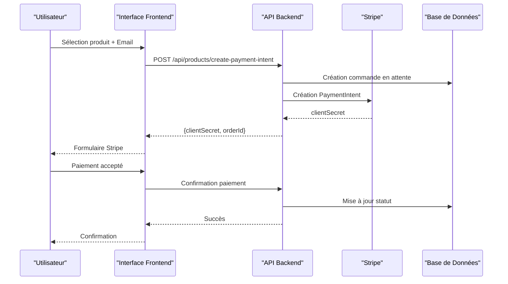
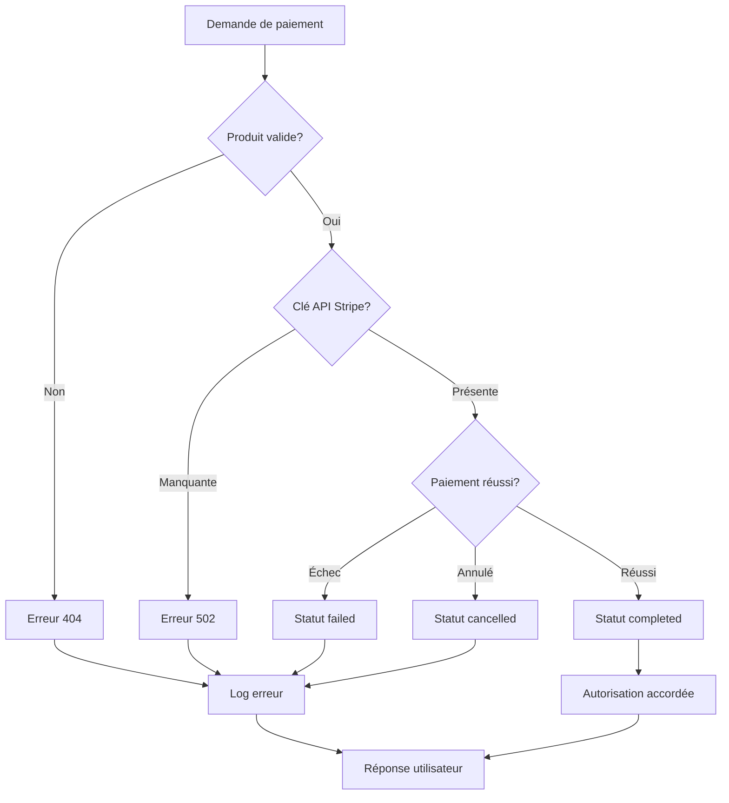

# Tests de Paiement Stripe

<cite>
**Fichiers Référencés dans ce Document**
- [test-payment-intent.js](file://test-payment-intent.js)
- [products.route.test.ts](file://apps/api-backend/src/__tests__/products.route.test.ts)
- [payments.ts](file://apps/api-backend/src/routes/payments.ts)
- [stripe.ts](file://apps/api-backend/src/services/stripe.ts)
- [ProductOrder.ts](file://apps/api-backend/src/models/ProductOrder.ts)
- [catalog.ts](file://apps/api-backend/src/catalog.ts)
- [payments.ts](file://apps/api-backend/src/types/payments.ts)
- [env-debug.ts](file://apps/api-backend/src/routes/env-debug.ts)
- [stripe.ts](file://apps/main-app/src/api/stripe.ts)
- [test-complete-flow.js](file://test-complete-flow.js)
- [PAYMENT-INTENT-IMPLEMENTATION-STATUS.md](file://PAYMENT-INTENT-IMPLEMENTATION-STATUS.md)
</cite>

## Table des Matières
1. [Introduction](#introduction)
2. [Structure du Projet](#structure-du-projet)
3. [Composants Principaux](#composants-principaux)
4. [Vue d'Ensemble de l'Architecture](#vue-densemble-de-larchitecture)
5. [Analyse Détaillée des Composants](#analyse-détaillée-des-composants)
6. [Tests d'Intégration Stripe](#tests-dintégration-stripe)
7. [Scénarios de Paiement](#scénarios-de-paiement)
8. [Configuration et Environnement](#configuration-et-environnement)
9. [Débogage et Résolution des Problèmes](#débogage-et-résolution-des-problèmes)
10. [Conclusion](#conclusion)

## Introduction

Le système de paiement Stripe de Oracle Lumira est une solution de paiement en ligne robuste qui permet aux utilisateurs d'acheter des niveaux de service différents. Ce document analyse en détail les tests de paiement, l'intégration Stripe, la gestion des webhooks et la mise à jour des états des commandes.

Le système utilise plusieurs couches :
- **Backend API** : Gestion des intents de paiement et webhooks
- **Services Stripe** : Intégration avec l'API Stripe
- **Modèles de Données** : Gestion des commandes et produits
- **Tests Unitaires** : Validation des fonctionnalités
- **Scripts de Test** : Simulation d'événements Stripe

## Structure du Projet



**Sources du Diagramme**
- [stripe.ts](file://apps/main-app/src/api/stripe.ts#L1-L50)
- [payments.ts](file://apps/api-backend/src/routes/payments.ts#L1-L50)
- [stripe.ts](file://apps/api-backend/src/services/stripe.ts#L1-L50)

**Sources de Section**
- [package.json](file://package.json#L1-L37)
- [catalog.ts](file://apps/api-backend/src/catalog.ts#L1-L50)

## Composants Principaux

### Service Stripe Principal

Le service Stripe centralise toutes les interactions avec l'API Stripe :

```typescript
// Initialisation lazy du client Stripe
export function getStripe(): Stripe {
  if (stripeClient) return stripeClient;
  const key = process.env.STRIPE_SECRET_KEY;
  if (!key) {
    throw new Error('STRIPE_SECRET_KEY environment variable is required');
  }
  stripeClient = new Stripe(key, {
    apiVersion: '2024-06-20',
    typescript: true,
  });
  return stripeClient;
}
```

### Modèle ProductOrder

La classe ProductOrder gère l'état des commandes avec des statuts précis :

```typescript
export type ProductOrderStatus = 'pending' | 'processing' | 'completed' | 'failed' | 'cancelled';

export interface IProductOrder extends Document {
  productId: string;
  customerId?: string;
  customerEmail?: string;
  amount: number;
  currency: string;
  status: ProductOrderStatus;
  paymentIntentId: string;
  createdAt: Date;
  updatedAt: Date;
  completedAt?: Date;
  metadata?: Record<string, any>;
}
```

**Sources de Section**
- [stripe.ts](file://apps/api-backend/src/services/stripe.ts#L6-L25)
- [ProductOrder.ts](file://apps/api-backend/src/models/ProductOrder.ts#L1-L49)

## Vue d'Ensemble de l'Architecture



**Sources du Diagramme**
- [payments.ts](file://apps/api-backend/src/routes/payments.ts#L15-L60)
- [stripe.ts](file://apps/api-backend/src/services/stripe.ts#L30-L80)

## Analyse Détaillée des Composants

### Route de Création d'Intent de Paiement

La route principale pour créer un intent de paiement :

```typescript
router.post('/create-payment-intent', async (req, res) => {
  try {
    const { productId, customerEmail, metadata = {} } = req.body;
    
    // Validation produit
    const product = getProductById(productId);
    if (!product) {
      return res.status(404).json({ error: 'Product not found' });
    }
    
    // Création PaymentIntent Stripe
    const paymentIntent = await getStripe().paymentIntents.create({
      amount: product.amountCents,
      currency: product.currency,
      automatic_payment_methods: { enabled: true },
      metadata: {
        productId,
        productName: product.name,
        level: product.level,
        customerEmail: customerEmail || '',
        ...metadata,
      },
      description: `Oracle Lumira - ${product.name}`,
      statement_descriptor: 'ORACLE LUMIRA',
    });
    
    // Retour clientSecret
    res.json({
      clientSecret: paymentIntent.client_secret!,
      orderId: paymentIntent.id,
      amount: product.amountCents,
      currency: product.currency,
      productName: product.name,
    });
  } catch (error) {
    res.status(500).json({ error: 'Failed to create payment intent' });
  }
});
```

### Gestion des Webhooks

Le système traite trois types d'événements Stripe :



**Sources du Diagramme**
- [payments.ts](file://apps/api-backend/src/routes/payments.ts#L120-L180)

### Service Stripe Avancé

Le service Stripe fournit des méthodes utilitaires pour la gestion des événements :

```typescript
static async handlePaymentSuccess(paymentIntent: Stripe.PaymentIntent): Promise<Order> {
  const { metadata } = paymentIntent;
  
  // Création de l'ordre
  const order: Order = {
    id: paymentIntent.id,
    productId: metadata.productId,
    customerEmail: metadata.customerEmail || undefined,
    amount: paymentIntent.amount,
    currency: paymentIntent.currency,
    status: 'completed',
    paymentIntentId: paymentIntent.id,
    createdAt: new Date(paymentIntent.created * 1000),
    updatedAt: new Date(),
    completedAt: new Date(),
    metadata: {
      level: metadata.level,
      productName: metadata.productName,
    },
  };
  
  // Attribution d'accès au produit
  await StripeService.grantProductAccess(order);
  
  return order;
}
```

**Sources de Section**
- [payments.ts](file://apps/api-backend/src/routes/payments.ts#L15-L60)
- [stripe.ts](file://apps/api-backend/src/services/stripe.ts#L80-L120)

## Tests d'Intégration Stripe

### Tests Unitaires des Routes Produits

Les tests couvrent tous les scénarios possibles :

```typescript
describe('POST /api/products/create-payment-intent', () => {
  describe('Happy Path', () => {
    it('should create payment intent successfully for valid mystique product', async () => {
      const mockPaymentData = {
        clientSecret: 'pi_test_client_secret_123',
        paymentIntentId: 'pi_test_payment_intent_123',
        amount: 9900,
        currency: 'eur',
        productName: 'Niveau Mystique',
      };
      StripeService.createPaymentIntent.mockResolvedValue(mockPaymentData);

      const response = await request(app)
        .post('/api/products/create-payment-intent')
        .send({
          productId: 'mystique',
          customerEmail: 'test@example.com',
        })
        .expect(200);

      expect(response.body).toEqual({
        clientSecret: 'pi_test_client_secret_123',
        orderId: 'pi_test_payment_intent_123',
        amount: 9900,
        currency: 'eur',
        productName: 'Niveau Mystique',
      });
    });
  });

  describe('Validation Errors (4xx)', () => {
    it('should return 400 for missing productId', async () => {
      const response = await request(app)
        .post('/api/products/create-payment-intent')
        .send({
          customerEmail: 'test@example.com',
        })
        .expect(400);

      expect(response.body).toEqual({
        error: 'Product ID is required',
        code: 'MISSING_PRODUCT_ID',
        message: 'The productId field is required and must be a non-empty string',
        validProductIds: Object.keys(PRODUCT_CATALOG),
        timestamp: expect.any(String),
        requestId: expect.any(String),
      });
    });
  });
});
```

### Script de Test Rapide

Un script simple pour tester l'endpoint de création d'intent :

```javascript
// Quick test script for the payment intent endpoint
const productId = process.argv[2] || 'mystique';
const customerEmail = process.argv[3] || undefined;

const testPayload = {
  productId,
  ...(customerEmail && { customerEmail })
};

console.log('Testing POST /api/products/create-payment-intent');
console.log('Payload:', JSON.stringify(testPayload, null, 2));

fetch('https://oraclelumira.com/api/products/create-payment-intent', {
  method: 'POST',
  headers: {
    'Content-Type': 'application/json',
  },
  body: JSON.stringify(testPayload)
})
.then(response => {
  console.log('Status:', response.status, response.statusText);
  return response.json();
})
.then(data => {
  console.log('Response:', JSON.stringify(data, null, 2));
})
.catch(error => {
  console.error('Error:', error);
});
```

**Sources de Section**
- [products.route.test.ts](file://apps/api-backend/src/__tests__/products.route.test.ts#L20-L80)
- [test-payment-intent.js](file://test-payment-intent.js#L1-L30)

## Scénarios de Paiement

### Scénario de Paiement Réussi



**Sources du Diagramme**
- [payments.ts](file://apps/api-backend/src/routes/payments.ts#L15-L60)
- [stripe.ts](file://apps/main-app/src/api/stripe.ts#L50-L80)

### Scénario de Paiement Échoué



**Sources du Diagramme**
- [products.route.test.ts](file://apps/api-backend/src/__tests__/products.route.test.ts#L80-L150)

### Scénario d'Annulation de Paiement

Lorsqu'un paiement est annulé, le système met à jour automatiquement l'état de la commande :

```typescript
case 'payment_intent.canceled':
  const canceledPaymentIntent = event.data.object;
  const canceledOrderId = canceledPaymentIntent.metadata?.orderId;
  
  if (canceledOrderId) {
    const order = await Order.findById(canceledOrderId);
    if (order) {
      order.status = 'failed';
      order.updatedAt = new Date();
      await order.save();
    }
  }
  break;
```

**Sources de Section**
- [payments.ts](file://apps/api-backend/src/routes/payments.ts#L160-L180)

## Configuration et Environnement

### Variables d'Environnement Requises

Le système nécessite plusieurs variables d'environnement :

```typescript
// Variables essentielles pour Stripe
STRIPE_SECRET_KEY: "sk_test_your_stripe_secret_key_here"
STRIPE_WEBHOOK_SECRET: "whsec_your_webhook_secret_here"
VITE_STRIPE_PUBLISHABLE_KEY: pk_test_your_publishable_key_here

// Variables MongoDB
MONGODB_URI: "mongodb://localhost:27017/oracle-lumira"

// Variables générales
NODE_ENV: "production"
PORT: "3000"
```

### Validation des Clés Stripe

Le système valide les clés Stripe au démarrage :

```typescript
export function validateStripeKey(): string {
  const pk = import.meta.env.VITE_STRIPE_PUBLISHABLE_KEY;
  
  if (!pk) {
    throw new Error('VITE_STRIPE_PUBLISHABLE_KEY is required but not set');
  }
  
  if (!/^pk_(test|live)_[a-zA-Z0-9]+$/.test(pk)) {
    throw new Error(`Invalid Stripe publishable key format: ${pk.substring(0, 10)}...`);
  }
  
  if (import.meta.env.DEV || import.meta.env.VITE_DEBUG === 'true') {
    console.log(`Stripe key validated: ${pk.substring(0, 15)}...`);
  }
  return pk;
}
```

### Scripts de Débogage

Le système inclut des outils de diagnostic :

```typescript
router.get('/env-check', (req: Request, res: Response) => {
  const envCheck = {
    NODE_ENV: process.env.NODE_ENV || 'undefined',
    STRIPE_SECRET_KEY: process.env.STRIPE_SECRET_KEY ? 
      `set (${process.env.STRIPE_SECRET_KEY.length} chars)` : 
      'undefined',
    MONGODB_URI: process.env.MONGODB_URI ? 
      `set (${process.env.MONGODB_URI.length} chars)` : 
      'undefined',
    allEnvKeys: Object.keys(process.env).filter(key => 
      key.includes('STRIPE') || 
      key.includes('MONGODB') || 
      key.includes('VITE_')
    )
  };

  res.json({ environment: envCheck });
});
```

**Sources de Section**
- [env-debug.ts](file://apps/api-backend/src/routes/env-debug.ts#L15-L45)
- [stripe.ts](file://apps/main-app/src/api/stripe.ts#L15-L35)

## Débogage et Résolution des Problèmes

### Problèmes Courants et Solutions

#### 1. Clé API Stripe Manquante

**Symptôme** : Erreur 500 lors de la création d'intent de paiement

**Solution** :
```bash
# Vérifier l'environnement
curl https://oraclelumira.com/api/debug/env-check

# Attendre que PM2 propage les variables
export STRIPE_SECRET_KEY="${STRIPE_SECRET_KEY}"
pm2 restart api-backend
```

#### 2. Signature Webhook Invalide

**Symptôme** : Erreur 400 lors de la réception d'événements

**Solution** :
```typescript
// Vérification de la signature webhook
try {
  event = getStripe().webhooks.constructEvent(
    req.body, 
    sig, 
    process.env.STRIPE_WEBHOOK_SECRET!
  );
} catch (err) {
  return res.status(400).send(`Webhook signature verification failed.`);
}
```

#### 3. Synchronisation des Événements

**Problème** : Événements traités plusieurs fois

**Solution** :
```typescript
// Vérification d'idempotence
if (processedEvents.has(event.id)) {
  return res.json({ received: true, duplicate: true });
}

processedEvents.add(event.id);
```

### Stratégies de Simulation d'Événements Stripe

Pour tester les webhooks sans utiliser Stripe live :

```javascript
// Simulation événement paiement réussi
const simulateSuccess = {
  id: 'evt_test_success',
  type: 'payment_intent.succeeded',
  data: {
    object: {
      id: 'pi_test_123',
      status: 'succeeded',
      metadata: {
        orderId: 'order_123',
        productId: 'mystique',
        customerEmail: 'test@example.com'
      }
    }
  }
};

// Simulation événement échec paiement
const simulateFailure = {
  id: 'evt_test_failure',
  type: 'payment_intent.payment_failed',
  data: {
    object: {
      id: 'pi_test_456',
      status: 'failed',
      metadata: {
        orderId: 'order_456'
      }
    }
  }
};
```

### Conseils pour le Débogage

1. **Logging Détaillé** : Activer les logs complets pour tracer chaque étape
2. **Validation des Clés** : Vérifier que toutes les clés sont correctement configurées
3. **Tests Locaux** : Utiliser des cartes de test Stripe (4242...)
4. **Webhook Testing** : Tester les webhooks avec des outils comme ngrok
5. **Monitoring** : Surveiller les erreurs 500 et les timeouts

**Sources de Section**
- [PAYMENT-INTENT-IMPLEMENTATION-STATUS.md](file://PAYMENT-INTENT-IMPLEMENTATION-STATUS.md#L45-L100)
- [payments.ts](file://apps/api-backend/src/routes/payments.ts#L80-L120)

## Conclusion

Le système de paiement Stripe de Oracle Lumira offre une solution robuste et bien testée pour la gestion des transactions. Les points forts incluent :

### Avantages du Système

1. **Tests Complets** : Couverture exhaustive des scénarios de paiement
2. **Gestion d'Erreurs** : Catégorisation précise des erreurs (4xx/5xx)
3. **Webhooks Robustes** : Traitement sécurisé des événements Stripe
4. **Modularité** : Séparation claire entre frontend/backend
5. **Débogage Facile** : Outils de diagnostic intégrés

### Recommandations Amélioration

1. **Tests Automatisés** : Intégrer des tests end-to-end avec Stripe
2. **Monitoring** : Ajouter des métriques de performance
3. **Fallback** : Améliorer la gestion des erreurs réseau
4. **Sécurité** : Renforcer la validation des signatures webhook
5. **Documentation** : Compléter la documentation des endpoints

### Prochaines Étapes

Le système est prêt pour la production avec une configuration appropriée. Les tests continus et le monitoring régulier garantiront sa fiabilité à long terme.
