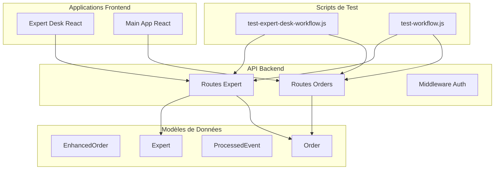
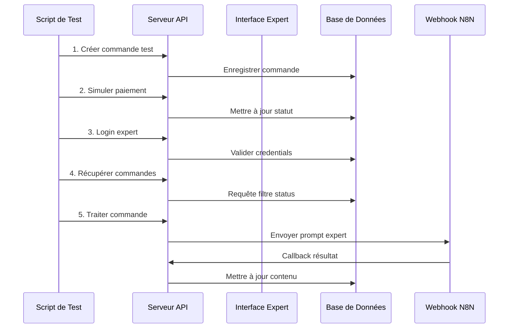
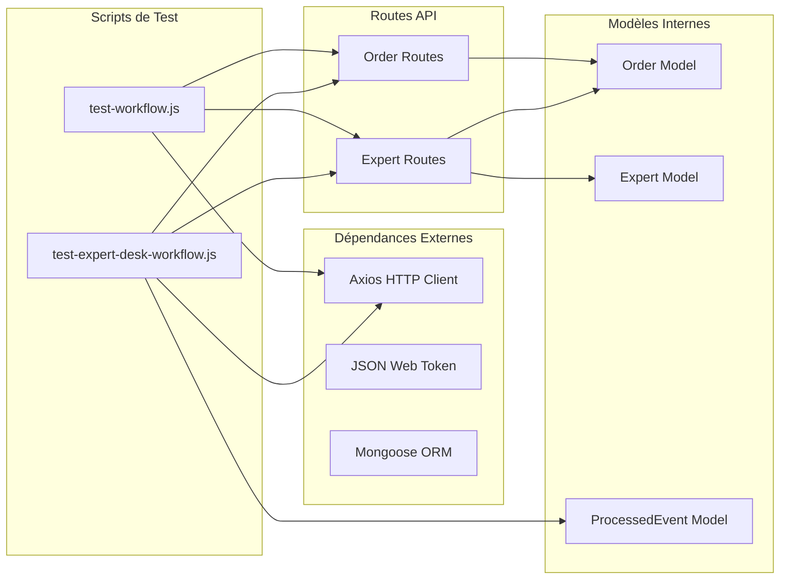

# Tests de l'Interface Expert

<cite>
**Fichiers Référencés dans ce Document**
- [test-expert-desk-workflow.js](file://test-expert-desk-workflow.js)
- [test-workflow.js](file://test-workflow.js)
- [apps/api-backend/src/models/EnhancedOrder.ts](file://apps/api-backend/src/models/EnhancedOrder.ts)
- [apps/api-backend/src/models/ProcessedEvent.ts](file://apps/api-backend/src/models/ProcessedEvent.ts)
- [apps/api-backend/src/models/Order.ts](file://apps/api-backend/src/models/Order.ts)
- [apps/api-backend/src/routes/expert.ts](file://apps/api-backend/src/routes/expert.ts)
- [apps/api-backend/src/routes/orders.ts](file://apps/api-backend/src/routes/orders.ts)
</cite>

## Table des Matières
1. [Introduction](#introduction)
2. [Structure du Projet](#structure-du-projet)
3. [Composants Principaux](#composants-principaux)
4. [Vue d'Ensemble de l'Architecture](#vue-densemble-de-larchitecture)
5. [Analyse Détaillée des Composants](#analyse-détaillée-des-composants)
6. [Analyse des Dépendances](#analyse-des-dépendances)
7. [Considérations de Performance](#considérations-de-performance)
8. [Guide de Dépannage](#guide-de-dépannage)
9. [Conclusion](#conclusion)

## Introduction

Les tests de l'interface Expert constituent un ensemble critique de scripts de validation qui garantissent le bon fonctionnement du workflow complet de traitement des commandes par les experts dans l'application Oracle Lumira. Ces tests automatisés valident chaque étape du processus, depuis la création d'une commande jusqu'à la validation finale du contenu généré.

Le système de test principal, `test-expert-desk-workflow.js`, simule un flux de travail complet qui inclut :
- La création d'une commande test avec données utilisateur
- La simulation d'un paiement réussi
- L'authentification d'un expert
- La récupération de la file d'attente des commandes
- La validation du contenu généré
- La mise à jour de l'état de la commande

## Structure du Projet

Le projet est organisé selon une architecture monorepo avec plusieurs applications distinctes :



**Sources du Diagramme**
- [apps/api-backend/src/routes/expert.ts](file://apps/api-backend/src/routes/expert.ts#L1-L50)
- [apps/api-backend/src/routes/orders.ts](file://apps/api-backend/src/routes/orders.ts#L1-L50)

**Sources de Section**
- [test-expert-desk-workflow.js](file://test-expert-desk-workflow.js#L1-L20)
- [test-workflow.js](file://test-workflow.js#L1-L20)

## Composants Principaux

### Scripts de Test Principal

Le système de test comprend deux scripts principaux qui travaillent ensemble pour valider le workflow complet :

1. **test-expert-desk-workflow.js** : Test complet du workflow Expert Desk
2. **test-workflow.js** : Test du workflow complet Oracle Lumira

### Modèles de Données Critiques

Les modèles de données suivants sont essentiels au fonctionnement des tests :

#### EnhancedOrder
Le modèle EnhancedOrder étend les fonctionnalités de base avec des champs spécialisés pour le traitement expert :

```typescript
interface IOrder extends Document {
  _id: mongoose.Types.ObjectId;
  orderNumber: string;
  userId?: mongoose.Types.ObjectId;
  userEmail: string;
  
  // Configuration du service
  service: 'basic' | 'premium' | 'vip';
  level: 1 | 2 | 3 | 4;
  levelName: 'Simple' | 'Intuitive' | 'Alchimique' | 'Intégrale';
  expertId?: mongoose.Types.ObjectId;
  duration: number;
  
  // Informations de paiement
  amount: number;
  currency: string;
  status: 'pending' | 'confirmed' | 'paid' | 'processing' | 'completed' | 'failed' | 'refunded' | 'cancelled';
  paymentStatus: 'pending' | 'completed' | 'failed' | 'refunded';
  
  // Données utilisateur
  formData: {
    firstName: string;
    lastName: string;
    email: string;
    phone?: string;
    dateOfBirth?: Date;
    specificQuestion?: string;
  };
  
  // Traitement expert
  expertPrompt?: string;
  expertInstructions?: string;
  expertNotes?: string;
  
  // Validation qualité
  rating?: number;
  review?: string;
  
  // Livraison de contenu
  generatedContent?: {
    audioUrl?: string;
    transcript?: string;
    additionalFiles?: string[];
    deliveryStatus?: 'pending' | 'sent' | 'delivered' | 'failed';
  };
}
```

#### ProcessedEvent
Le modèle ProcessedEvent suit les événements traités pour assurer la traçabilité :

```typescript
interface IProcessedEvent extends Document {
  eventId: string;
  eventType: string;
  processedAt: Date;
  data?: Record<string, any>;
}
```

**Sources de Section**
- [apps/api-backend/src/models/EnhancedOrder.ts](file://apps/api-backend/src/models/EnhancedOrder.ts#L1-L100)
- [apps/api-backend/src/models/ProcessedEvent.ts](file://apps/api-backend/src/models/ProcessedEvent.ts#L1-L41)

## Vue d'Ensemble de l'Architecture

L'architecture des tests suit un pattern de validation en chaîne qui simule le comportement réel d'un expert :



**Sources du Diagramme**
- [test-expert-desk-workflow.js](file://test-expert-desk-workflow.js#L25-L100)
- [apps/api-backend/src/routes/expert.ts](file://apps/api-backend/src/routes/expert.ts#L400-L500)

## Analyse Détaillée des Composants

### Test Expert Desk Workflow

Le script `test-expert-desk-workflow.js` implémente un test complet du workflow Expert Desk avec les étapes suivantes :

#### 1. Création de la Commande Test

```javascript
const testData = {
  level: 3,
  amount: 15000, // 150€ en centimes
  formData: {
    firstName: 'Marie',
    lastName: 'TestExpert',
    email: 'marie.testexpert@example.com',
    phone: '+33123456789',
    dateOfBirth: '1985-06-15',
    specificQuestion: 'Je souhaite comprendre mon chemin de vie professionnel'
  },
  metadata: {
    level: 'profond', // niveau 3
    productName: 'Lecture Alchimique',
    source: 'test_workflow'
  }
};
```

#### 2. Simulation du Paiement

Le test simule un paiement réussi en mettant à jour le statut de la commande :

```javascript
const paymentResponse = await axios.post(`${API_BASE}/products/simulate-payment`, {
  orderId: orderId,
  status: 'paid'
});
```

#### 3. Authentification Expert

L'authentification utilise les identifiants prédéfinis pour l'expert :

```javascript
const loginResponse = await axios.post(`${API_BASE}/expert/login`, {
  email: EXPERT_EMAIL,
  password: EXPERT_PASSWORD
});
```

#### 4. Récupération de la File d'Attente

La récupération des commandes pendantes utilise l'endpoint `/expert/orders/pending` :

```javascript
const ordersResponse = await axios.get(`${API_BASE}/expert/orders/pending`, {
  headers: { Authorization: `Bearer ${expertToken}` }
});
```

#### 5. Validation des Assertions

Le test effectue plusieurs assertions critiques :

```javascript
// Vérifier que la commande test est présente
const testOrder = orders.find(o => o._id === orderId);
if (!testOrder) {
  console.log('❌ PROBLÈME: Notre commande test n\'est pas dans la queue!');
  return false;
}

// Vérifier les détails de la commande
console.log('📄 Détails de la commande:', {
  id: testOrder._id,
  orderNumber: testOrder.orderNumber,
  level: testOrder.level,
  status: testOrder.status,
  amount: testOrder.amount
});
```

### Routes Expert

Les routes expert fournissent l'interface principale pour les tests :

#### Endpoint de Login
```javascript
router.post('/login', authLimiter, async (req: any, res: any) => {
  try {
    const { email, password } = req.body;
    
    // Recherche de l'expert
    let expert = await Expert.findOne({ email: email.toLowerCase(), isActive: true });
    
    // Création automatique si nécessaire
    if (!expert && email.toLowerCase() === 'expert@oraclelumira.com') {
      expert = new Expert({
        email: 'expert@oraclelumira.com',
        password: process.env.DEFAULT_EXPERT_PASSWORD || 'Lumira2025L',
        name: 'Oracle Expert',
        expertise: ['tarot', 'oracle', 'spiritualité'],
        isActive: true
      });
      
      await expert.save();
    }
    
    // Vérification du mot de passe
    const validPassword = await expert.comparePassword(password);
    if (!validPassword) {
      return res.status(401).json({ error: 'Identifiants invalides' });
    }
    
    // Génération du token JWT
    const token = jwt.sign(
      { expertId: expert._id, email: expert.email, name: expert.name },
      process.env.JWT_SECRET!,
      { expiresIn: '8h' }
    );
    
    res.json({
      success: true,
      token,
      expert: {
        id: expert._id,
        name: expert.name,
        email: expert.email,
        lastLogin: expert.lastLogin
      }
    });
    
  } catch (error) {
    res.status(500).json({ error: 'Erreur serveur lors de la connexion' });
  }
});
```

#### Endpoint de Récupération des Commandes
```javascript
router.get('/orders/pending', authenticateExpert, async (req: any, res: any) => {
  try {
    const page = parseInt(req.query.page) || 1;
    const limit = parseInt(req.query.limit) || 20;
    const skip = (page - 1) * limit;

    const orders = await Order.find({
      status: { $in: ['pending', 'paid'] }
    })
    .populate('userId', 'firstName lastName email phone')
    .sort({ createdAt: -1 })
    .skip(skip)
    .limit(limit);

    const total = await Order.countDocuments({
      status: { $in: ['pending', 'paid'] }
    });

    res.json({
      orders,
      pagination: {
        current: page,
        total: Math.ceil(total / limit),
        count: total,
        limit
      }
    });

  } catch (error) {
    res.status(500).json({ error: 'Erreur lors du chargement des commandes' });
  }
});
```

**Sources de Section**
- [test-expert-desk-workflow.js](file://test-expert-desk-workflow.js#L25-L100)
- [apps/api-backend/src/routes/expert.ts](file://apps/api-backend/src/routes/expert.ts#L150-L250)
- [apps/api-backend/src/routes/expert.ts](file://apps/api-backend/src/routes/expert.ts#L400-L450)

### Bonnes Pratiques pour les Tests

#### 1. Simulation de Différents Scénarios

Pour tester les différents cas d'utilisation, il est recommandé de créer des données de test variées :

```javascript
// Scénario 1: Commande avec fichiers uploadés
const orderWithFiles = {
  level: 3,
  amount: 15000,
  formData: {
    firstName: 'Jean',
    lastName: 'Expert',
    email: 'jean.expert@test.com',
    specificQuestion: 'Test avec fichiers'
  },
  files: [
    {
      filename: 'photo_visage.jpg',
      originalName: 'visage.jpg',
      path: '/uploads/photo_visage.jpg',
      mimetype: 'image/jpeg',
      size: 102400
    }
  ]
};

// Scénario 2: Commande avec instructions spéciales
const orderWithInstructions = {
  level: 2,
  amount: 8000,
  formData: {
    firstName: 'Sophie',
    lastName: 'Validation',
    email: 'sophie.validation@test.com',
    specificQuestion: 'Test validation expert'
  },
  expertInstructions: 'Prioriser la précision des analyses'
};
```

#### 2. Gestion des Erreurs de Validation

Le test doit valider correctement les erreurs de validation :

```javascript
try {
  const processResponse = await axios.post(
    `${API_BASE}/expert/process-order`,
    promptData,
    { headers: { Authorization: `Bearer ${expertToken}` } }
  );
  
  // Vérifier que le processus a démarré
  expect(processResponse.data.success).toBe(true);
  expect(processResponse.data.orderId).toBeDefined();
  
} catch (error) {
  // Gérer les erreurs spécifiques
  if (error.response) {
    expect(error.response.status).toBe(400); // Erreur de validation
    expect(error.response.data.error).toContain('invalid');
  }
}
```

#### 3. Tests des Cas Limites

Il est crucial de tester les cas limites pour assurer la robustesse :

```javascript
// Test avec commande expirée
const expiredOrder = {
  level: 1,
  amount: 3000,
  formData: {
    firstName: 'Ancien',
    lastName: 'Client',
    email: 'ancien.client@test.com',
    specificQuestion: 'Test commande expirée'
  },
  createdAt: new Date(Date.now() - 7 * 24 * 60 * 60 * 1000) // 7 jours avant
};

// Test avec expert inactif
const inactiveExpert = {
  email: 'expert.inactif@test.com',
  password: 'test123',
  isActive: false
};
```

### Intégration avec les Modèles EnhancedOrder et ProcessedEvent

#### Validation du Contenu Généré

Les tests doivent valider que le contenu généré respecte les contraintes du modèle EnhancedOrder :

```javascript
// Vérification du contenu généré
const validateGeneratedContent = (content) => {
  expect(content).toHaveProperty('archetype');
  expect(content).toHaveProperty('reading');
  expect(content).toHaveProperty('audioUrl');
  
  // Vérifier les formats de fichiers
  if (content.pdfUrl) {
    expect(content.pdfUrl).toMatch(/\.pdf$/);
  }
  
  if (content.mandalaSvg) {
    expect(content.mandalaSvg).toMatch(/^<svg/);
  }
};
```

#### Suivi des Événements Traités

Le modèle ProcessedEvent permet de suivre les événements traités :

```javascript
// Vérification des événements traités
const validateProcessedEvents = async (orderId) => {
  const events = await ProcessedEvent.find({ eventId: orderId });
  expect(events.length).toBeGreaterThan(0);
  
  // Vérifier les types d'événements
  const eventTypes = events.map(event => event.eventType);
  expect(eventTypes).toContain('order_created');
  expect(eventTypes).toContain('order_paid');
  expect(eventTypes).toContain('order_processed');
};
```

**Sources de Section**
- [apps/api-backend/src/models/EnhancedOrder.ts](file://apps/api-backend/src/models/EnhancedOrder.ts#L100-L200)
- [apps/api-backend/src/models/ProcessedEvent.ts](file://apps/api-backend/src/models/ProcessedEvent.ts#L10-L41)

## Analyse des Dépendances

Le système de test dépend de plusieurs composants clés :



**Sources du Diagramme**
- [test-expert-desk-workflow.js](file://test-expert-desk-workflow.js#L1-L10)
- [apps/api-backend/src/routes/expert.ts](file://apps/api-backend/src/routes/expert.ts#L1-L20)

**Sources de Section**
- [test-expert-desk-workflow.js](file://test-expert-desk-workflow.js#L1-L20)
- [apps/api-backend/src/routes/expert.ts](file://apps/api-backend/src/routes/expert.ts#L1-L30)

## Considérations de Performance

### Optimisation des Tests

Pour optimiser les performances des tests, plusieurs stratégies peuvent être appliquées :

1. **Parallélisation des Tests** : Exécuter plusieurs tests simultanément
2. **Réutilisation des Données** : Utiliser des données de test communes
3. **Nettoyage Automatique** : Supprimer les données de test après chaque exécution

### Monitoring des Performances

Le test inclut des métriques de performance importantes :

```javascript
// Mesure du temps d'exécution
const startTime = Date.now();

// ... logique de test ...

const endTime = Date.now();
const executionTime = endTime - startTime;

console.log(`⏱️ Temps d'exécution: ${executionTime}ms`);
expect(executionTime).toBeLessThan(10000); // 10 secondes max
```

## Guide de Dépannage

### Problèmes Courants

#### 1. Échec de Connexion Expert

**Symptôme** : Erreur "Identifiants invalides" lors du login

**Solution** :
```javascript
// Vérifier que l'expert existe
const checkExpertExists = async () => {
  const expert = await Expert.findOne({ email: EXPERT_EMAIL });
  if (!expert) {
    console.log('❌ Expert non trouvé, création automatique...');
    // Logique de création
  }
};
```

#### 2. Commande Non Trouvée dans la Queue

**Symptôme** : Aucune commande dans la file d'attente

**Solution** :
```javascript
// Debug: Vérifier les commandes existantes
const debugOrders = async () => {
  const allOrders = await Order.find({});
  console.log('🔍 Commandes existantes:', allOrders.length);
  allOrders.forEach(order => {
    console.log(`  - ${order._id}: ${order.status} (${order.userEmail})`);
  });
};
```

#### 3. Erreurs de Timeout

**Symptôme** : Erreurs de timeout lors des appels API

**Solution** :
```javascript
// Augmenter les timeouts
const axiosInstance = axios.create({
  timeout: 30000, // 30 secondes
  headers: {
    'Content-Type': 'application/json'
  }
});
```

### Recommandations pour les Tests

#### 1. Configuration des Variables d'Environnement

```bash
# Variables nécessaires pour les tests
export API_BASE_URL=http://localhost:3001/api
export ENABLE_DEBUG_ROUTES=true
export NODE_ENV=test
export JWT_SECRET=test_secret
export N8N_WEBHOOK_URL=http://localhost:5678/webhook
```

#### 2. Préparation de la Base de Données

```javascript
// Nettoyer la base de données avant les tests
const cleanupDatabase = async () => {
  await Order.deleteMany({ 
    'formData.email': { $regex: /test\.expert/ } 
  });
  await Expert.deleteMany({ 
    email: { $regex: /test\.expert/ } 
  });
};
```

#### 3. Validation des Assertions

```javascript
// Fonction utilitaire pour les assertions
const assertOrderProperties = (order) => {
  expect(order).toHaveProperty('_id');
  expect(order).toHaveProperty('orderNumber');
  expect(order).toHaveProperty('status');
  expect(order).toHaveProperty('formData');
  expect(order.formData).toHaveProperty('email');
  expect(order.formData.email).toContain('@');
};
```

**Sources de Section**
- [test-expert-desk-workflow.js](file://test-expert-desk-workflow.js#L70-L120)

## Conclusion

Les tests de l'interface Expert représentent un élément crucial de la stratégie de qualité pour l'application Oracle Lumira. Ils garantissent la fiabilité du workflow complet de traitement des commandes par les experts, depuis la création initiale jusqu'à la validation finale du contenu généré.

### Points Clés

1. **Couverture Complète** : Les tests couvrent tous les aspects du workflow Expert Desk
2. **Robustesse** : Implémentation de mécanismes de retry et de gestion d'erreurs
3. **Extensibilité** : Architecture permettant l'ajout facile de nouveaux tests
4. **Maintenance** : Scripts bien structurés pour faciliter la maintenance future

### Recommandations Futures

1. **Amélioration Continue** : Ajouter des tests pour les nouvelles fonctionnalités
2. **Monitoring** : Intégrer des métriques de performance dans les tests
3. **Documentation** : Maintenir la documentation à jour avec les changements
4. **Automatisation** : Intégrer les tests dans le pipeline CI/CD

Ces tests constituent la fondation solide pour assurer la qualité et la fiabilité du système Expert Desk, garantissant une expérience utilisateur optimale pour les experts et les clients.