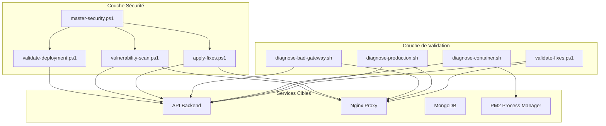
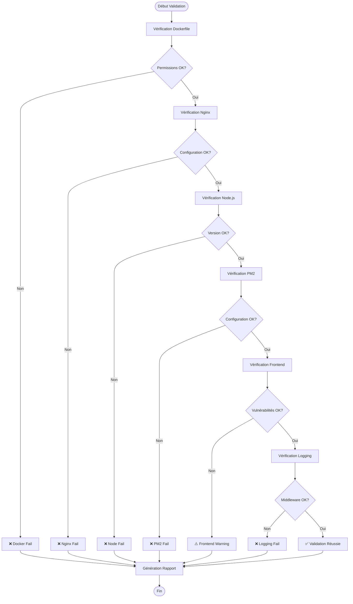
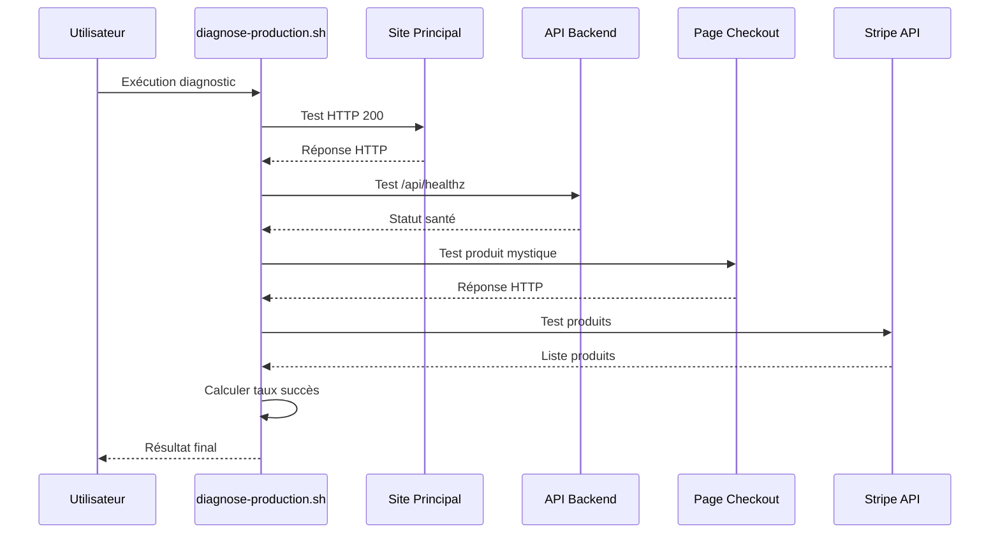
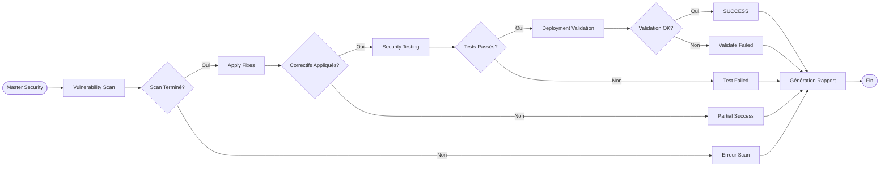
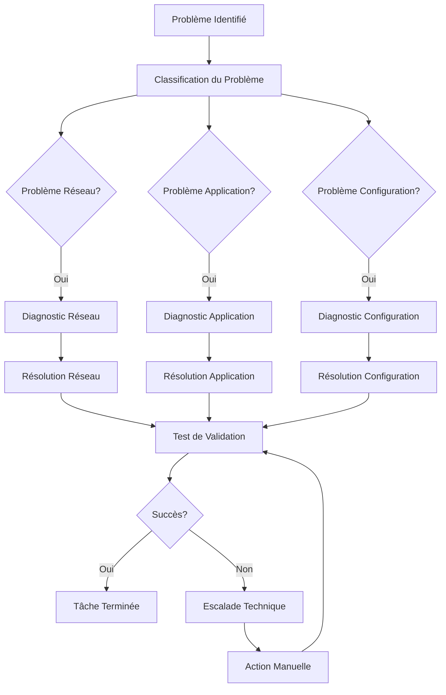

# Validation des Correctifs et Diagnostic Système

<cite>
**Fichiers Référencés dans ce Document**
- [validate-fixes.ps1](file://validate-fixes.ps1)
- [diagnose-production.sh](file://diagnose-production.sh)
- [diagnose-container.sh](file://diagnose-container.sh)
- [diagnose-bad-gateway.sh](file://diagnose-bad-gateway.sh)
- [security\apply-fixes.ps1](file://security\apply-fixes.ps1)
- [security\master-security.ps1](file://security\master-security.ps1)
- [security\vulnerability-scan.ps1](file://security\vulnerability-scan.ps1)
- [security\validate-deployment.ps1](file://security\validate-deployment.ps1)
- [security\nginx-test.ps1](file://security\nginx-test.ps1)
- [security\run-tests.ps1](file://security\run-tests.ps1)
</cite>

## Table des Matières
1. [Introduction](#introduction)
2. [Architecture du Système de Validation](#architecture-du-système-de-validation)
3. [Scripts de Validation des Correctifs](#scripts-de-validation-des-correctifs)
4. [Scripts de Diagnostic Production](#scripts-de-diagnostic-production)
5. [Processus de Sécurité Automatisé](#processus-de-sécurité-automatisé)
6. [Analyse Détaillée des Scripts](#analyse-détaillée-des-scripts)
7. [Guide de Résolution des Problèmes](#guide-de-résolution-des-problèmes)
8. [Exemples de Sortie et Interprétation](#exemples-de-sortie-et-interprétation)
9. [Meilleures Pratiques](#meilleures-pratiques)
10. [Conclusion](#conclusion)

## Introduction

Le système de validation des correctifs d'Oracle Lumira constitue un ensemble sophistiqué d'outils automatisés conçus pour garantir la sécurité, la performance et la fiabilité des applications en production. Ce système implémente une approche proactive de la maintenance système, permettant de détecter et de corriger automatiquement les vulnérabilités, de valider les configurations de déploiement et de diagnostiquer les problèmes en temps réel.

Les scripts de validation couvrent plusieurs aspects critiques :
- **Validation des correctifs applicatifs** : Vérification de l'application des correctifs de sécurité
- **Diagnostic de production** : Surveillance continue des services en production
- **Tests de déploiement** : Validation préalable des configurations avant mise en ligne
- **Analyse de sécurité** : Scan automatisé des vulnérabilités et configuration sécurisée

## Architecture du Système de Validation

Le système de validation s'articule autour d'une architecture modulaire composée de plusieurs couches interconnectées :



**Sources du Diagramme**
- [validate-fixes.ps1](file://validate-fixes.ps1#L1-L144)
- [security\master-security.ps1](file://security\master-security.ps1#L1-L315)

## Scripts de Validation des Correctifs

### validate-fixes.ps1 - Validation Automatisée

Le script `validate-fixes.ps1` constitue le cœur du processus de validation des correctifs. Il effectue une série de vérifications cruciales pour s'assurer que tous les correctifs de sécurité ont été correctement appliqués.

#### Fonctionnalités Principales

Le script réalise six vérifications essentielles :

1. **Permissions Docker Nginx** : Vérifie la configuration des répertoires temporaires
2. **Configuration Nginx Optimisée** : Contrôle les chemins de logs et temporaire
3. **Version Node.js Verrouillée** : S'assure de l'utilisation d'une version spécifique
4. **Optimisation PM2** : Valide la configuration du gestionnaire de processus
5. **Vulnérabilités Frontend** : Analyse les dépendances frontend
6. **Structure de Logging** : Vérifie la présence du middleware de logging

#### Processus de Validation



**Sources du Diagramme**
- [validate-fixes.ps1](file://validate-fixes.ps1#L15-L144)

**Sources de Section**
- [validate-fixes.ps1](file://validate-fixes.ps1#L1-L144)

## Scripts de Diagnostic Production

### diagnose-production.sh - Diagnostic Global

Le script `diagnose-production.sh` effectue un diagnostic complet des services en production, testant la connectivité et la disponibilité des différents composants.

#### Tests Effectués

1. **Site Principal** : Vérification de la disponibilité du site principal
2. **Endpoint Health API** : Test de l'endpoint de santé de l'API
3. **Page de Checkout** : Validation du flux de paiement
4. **API Produits Stripe** : Contrôle de l'intégration Stripe

#### Méthodologie de Diagnostic



**Sources du Diagramme**
- [diagnose-production.sh](file://diagnose-production.sh#L1-L67)

### diagnose-container.sh - Diagnostic Conteneur

Le script `diagnose-container.sh` est spécifiquement conçu pour diagnostiquer les problèmes au sein des conteneurs de production, fournissant des informations détaillées sur l'état des services internes.

#### Tests Internes

1. **État PM2** : Vérification du process manager
2. **Ports en écoute** : Contrôle des ports 3001
3. **Logs PM2** : Inspection des derniers logs
4. **Test API Direct** : Validation du backend local
5. **Fichiers Compilés** : Vérification de l'existence des fichiers
6. **Variables d'Environnement** : Contrôle des variables critiques
7. **Processus Actifs** : Surveillance des processus Node.js

**Sources de Section**
- [diagnose-production.sh](file://diagnose-production.sh#L1-L67)
- [diagnose-container.sh](file://diagnose-container.sh#L1-L55)

## Processus de Sécurité Automatisé

### master-security.ps1 - Orchestrateur de Sécurité

Le script `master-security.ps1` agit comme orchestrateur principal, coordonnant toutes les opérations de sécurité et générant des rapports consolidés.

#### Opérations Automatisées

1. **Scan de Vulnérabilités** : Analyse des dépendances
2. **Application des Correctifs** : Correction automatique des vulnérabilités
3. **Tests de Sécurité** : Validation des configurations
4. **Validation de Déploiement** : Préparation pour la production

#### Flux de Traitement



**Sources du Diagramme**
- [security\master-security.ps1](file://security\master-security.ps1#L100-L150)

**Sources de Section**
- [security\master-security.ps1](file://security\master-security.ps1#L1-L315)

## Analyse Détaillée des Scripts

### apply-fixes.ps1 - Application des Correctifs

Le script `apply-fixes.ps1` applique automatiquement les correctifs de sécurité identifiés lors des scans. Il supporte plusieurs composants :

#### Composants de Fix

1. **Docker Nginx Permissions** : Configuration des répertoires temporaires
2. **Nginx Configuration** : Optimisation des chemins de logs et temporaire
3. **Frontend Dependencies** : Mise à jour des packages vulnérables
4. **Logging Configuration** : Amélioration de la configuration de logging

#### Mécanisme de Sauvegarde

Le script implémente un mécanisme de sauvegarde automatique avant toute modification :

```powershell
function Create-Backup {
    param([string]$FilePath)
    if (-not $SkipBackup -and (Test-Path $FilePath)) {
        $backupPath = "$FilePath.backup-$(Get-Date -Format 'yyyyMMdd-HHmmss')"
        Copy-Item $FilePath $backupPath
        Write-Host "📋 Backup created: $backupPath" -ForegroundColor Gray
    }
}
```

### vulnerability-scan.ps1 - Scan Automatisé

Le script `vulnerability-scan.ps1` effectue un scan complet des vulnérabilités :

#### Analyse Multi-Niveau

1. **Frontend Dependencies** : Scan des packages React/Vue
2. **Backend Dependencies** : Analyse des packages Node.js
3. **Docker Security** : Scan des images conteneur
4. **Configuration Security** : Vérification des configurations

#### Critères de Sévérité

- **High Severity** : Vulnérabilités critiques nécessitant une action immédiate
- **Moderate Severity** : Vulnérabilités importantes mais non critiques
- **Low Severity** : Vulnérabilités mineures

**Sources de Section**
- [security\apply-fixes.ps1](file://security\apply-fixes.ps1#L1-L234)
- [security\vulnerability-scan.ps1](file://security\vulnerability-scan.ps1#L1-L139)

## Guide de Résolution des Problèmes

### Problèmes Courants et Solutions

#### Erreurs 502 Bad Gateway

Les erreurs 502 indiquent généralement un problème de communication entre Nginx et l'API backend. Le script `diagnose-bad-gateway.sh` fournit un diagnostic détaillé :

**Symptômes** :
- Pages blanches ou erreurs 502
- Temps de réponse très longs
- Logs d'erreurs Nginx

**Actions de Diagnostic** :
1. Vérifier l'état des conteneurs Docker
2. Contrôler les logs de Nginx
3. Tester la connectivité interne
4. Examiner les processus PM2

**Solutions Recommandées** :
- Redémarrer le service PM2 : `pm2 restart lumira-api`
- Vérifier la configuration Nginx : `nginx -t`
- Contrôler les variables d'environnement

#### Problèmes de Connectivité API

**Symptômes** :
- Endpoints API non accessibles
- Erreurs de timeout
- Codes de statut HTTP incorrects

**Diagnostic** :
```bash
# Test direct sur localhost
curl -s -o /dev/null -w "%{http_code}" http://localhost:3001/api/health

# Vérification des ports
netstat -tuln | grep :3001

# Inspection des logs PM2
pm2 logs lumira-api --lines 20
```

#### Configuration Docker Incorrecte

**Problèmes Fréquents** :
- Permissions insuffisantes
- Répertoires temporaires manquants
- Configuration utilisateur incorrecte

**Correction** :
```bash
# Application des correctifs Docker
.\security\apply-fixes.ps1 -Component docker

# Vérification des permissions
docker exec oracle-lumira ls -la /var/lib/nginx/
```

### Workflow de Résolution



## Exemples de Sortie et Interprétation

### Exemple de Sortie validate-fixes.ps1

```
🔍 Validation des Correctifs Oracle Lumira
------------------------------------------

📦 Verification Dockerfile...
✅ Permissions nginx configurees

🌐 Verification Nginx config...
✅ Configuration nginx optimisee

📌 Verification version Node.js...
✅ Version Node.js verrouillee (20.18.1)

⚙️  Verification PM2 ecosystem...
✅ PM2 ecosystem optimise

🛡️  Verification vulnerabilites frontend...
✅ Aucune vulnerabilite HIGH

📄 Verification logging structure...
✅ Middleware logging cree

📊 RESUME VALIDATION
Correctifs appliques: 5/6
Taux de reussite: 83.3%

📋 DETAILS VALIDATION:
  ✅ dockerfile permissions
  ✅ nginx config updated
  ✅ node version locked
  ✅ pm2 optimized
  ⚠️  frontend vulnerabilities
  ✅ ecosystem enhanced
```

### Exemple de Sortie diagnose-production.sh

```
🔍 Oracle Lumira Container Diagnostics
=======================================

1. Testing main site (https://oraclelumira.com)...
✅ Main site: OK (HTTP 200)

2. Testing API health endpoint...
✅ API health: OK (HTTP 200)
   Details: {"status":"healthy","timestamp":"2024-01-15T10:30:00Z"}

3. Testing checkout page (mystique product)...
✅ Checkout page: OK (HTTP 200)

4. Testing Stripe products API...
✅ Products API: OK (HTTP 200)

🏁 Diagnostics complete!

🎉 ALL TESTS PASSED! Oracle Lumira is fully operational.
```

### Exemple de Sortie vulnerability-scan.ps1

```
🔍 Starting Oracle Lumira Security Scan...

📦 Scanning Frontend Dependencies...
Frontend: 2 vulnerabilities found
  High: 1, Moderate: 1, Low: 0

📦 Scanning Backend Dependencies...
Backend: 0 vulnerabilities found

🐳 Docker Security Check...
Building test image for security scan...
Running Trivy security scan...
[...]

🔧 Configuration Security Check...
✅ Server tokens hidden
⚠️  Security headers not fully configured

📊 Security Report Summary:
  Overall Status: WARNING
  Total Vulnerabilities: 2 (High: 1)
  Configuration Issues: 1

⚠️  WARNING: Issues detected. Review and resolve before production deployment.
```

**Sources de Section**
- [validate-fixes.ps1](file://validate-fixes.ps1#L100-L144)
- [diagnose-production.sh](file://diagnose-production.sh#L50-L67)
- [security\vulnerability-scan.ps1](file://security\vulnerability-scan.ps1#L120-L139)

## Meilleures Pratiques

### Intégration Continue

1. **Automatisation des Tests** : Intégrer les scripts de validation dans les pipelines CI/CD
2. **Monitoring Continu** : Implémenter des alertes basées sur les diagnostics
3. **Rollback Automatique** : Configurer des mécanismes de rollback en cas d'échec

### Stratégie de Déploiement

1. **Phase Progressive** : Déployer en phases avec validation après chaque étape
2. **Canari** : Utiliser des déploiements canari pour minimiser les risques
3. **Surveillance Post-Déploiement** : Surveiller les métriques après déploiement

### Maintenance Préventive

1. **Planification Régulière** : Planifier des sessions de maintenance régulières
2. **Documentation** : Maintenir une documentation à jour des procédures
3. **Formation Équipe** : Former l'équipe aux outils de diagnostic

### Sécurité et Conformité

1. **Audit Régulier** : Effectuer des audits de sécurité périodiques
2. **Patch Management** : Maintenir un processus de patch management
3. **Compliance Monitoring** : Surveiller la conformité aux standards de sécurité

## Conclusion

Le système de validation des correctifs d'Oracle Lumira représente une approche moderne et proactive de la maintenance système. En combinant l'automatisation des tâches de sécurité, le diagnostic continu des services et la génération de rapports détaillés, ce système permet de maintenir une haute disponibilité et sécurité des applications en production.

Les scripts analysés dans ce document constituent un ensemble cohérent d'outils qui répondent aux besoins critiques de surveillance, de diagnostic et de correction automatique. Leur utilisation systématique permettra de :

- **Réduire les temps d'arrêt** grâce à la détection précoce des problèmes
- **Améliorer la sécurité** par l'application automatique des correctifs
- **Optimiser les performances** grâce aux validations régulières
- **Faciliter la maintenance** avec des rapports clairs et des recommandations

L'investissement dans ces outils de validation constitue une base solide pour la pérennité et la fiabilité des applications Oracle Lumira, garantissant une expérience utilisateur optimale tout en maintenant les normes de sécurité les plus élevées.