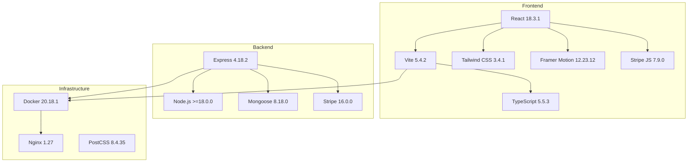
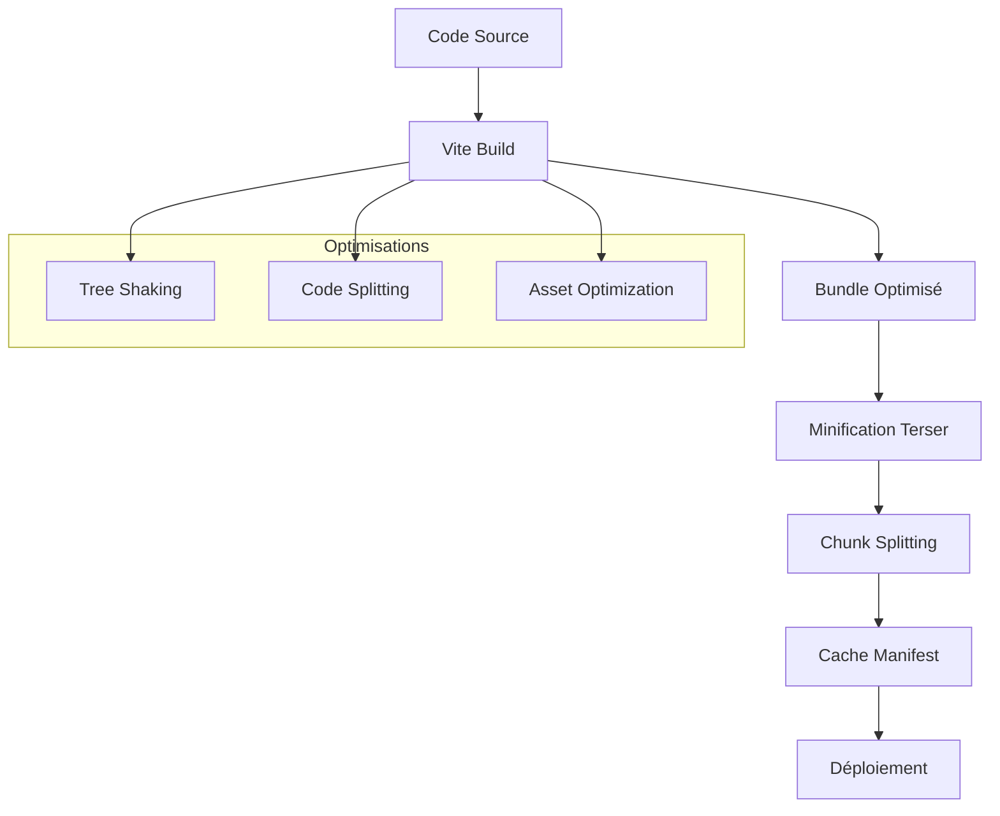
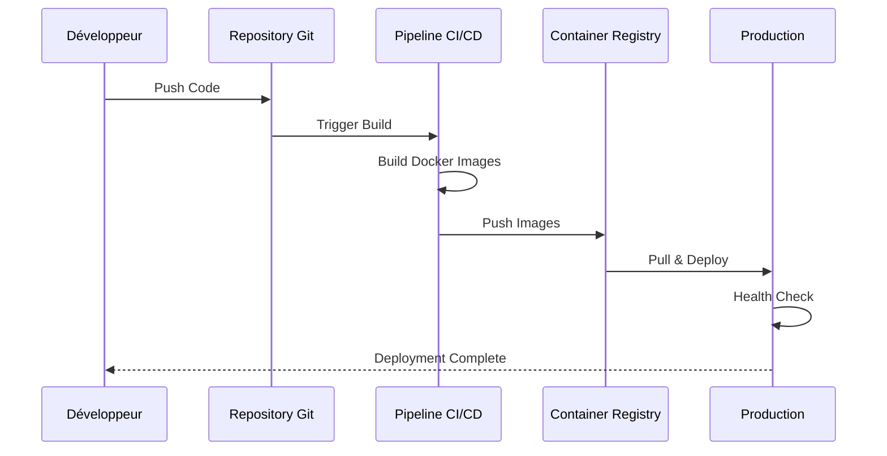

# Pile Technologique LumiraV1-MVP

<cite>
**Fichiers Référencés dans ce Document**
- [package.json](file://package.json)
- [apps/main-app/package.json](file://apps/main-app/package.json)
- [apps/expert-desk/package.json](file://apps/expert-desk/package.json)
- [apps/api-backend/package.json](file://apps/api-backend/package.json)
- [apps/main-app/vite.config.ts](file://apps/main-app/vite.config.ts)
- [apps/main-app/tailwind.config.js](file://apps/main-app/tailwind.config.js)
- [apps/expert-desk/vite.config.ts](file://apps/expert-desk/vite.config.ts)
- [apps/api-backend/src/server.ts](file://apps/api-backend/src/server.ts)
- [apps/api-backend/src/models/User.ts](file://apps/api-backend/src/models/User.ts)
- [apps/main-app/src/App.tsx](file://apps/main-app/src/App.tsx)
- [apps/main-app/src/components/ui/GlassCard.tsx](file://apps/main-app/src/components/ui/GlassCard.tsx)
- [apps/main-app/src/hooks/useScrollAnimation.ts](file://apps/main-app/src/hooks/useScrollAnimation.ts)
- [apps/main-app/src/components/CircularProgress.tsx](file://apps/main-app/src/components/CircularProgress.tsx)
- [apps/api-backend/src/services/stripe.ts](file://apps/api-backend/src/services/stripe.ts)
- [Dockerfile](file://Dockerfile)
</cite>

## Table des Matières
1. [Introduction](#introduction)
2. [Vue d'Ensemble de la Pile Technologique](#vue-densemble-de-la-pile-technologique)
3. [Frontend : Technologies React](#frontend--technologies-react)
4. [Build Tools et Bundlers](#build-tools-et-bundlers)
5. [Backend : Architecture Express.js](#backend--architecture-expressjs)
6. [Base de Données : Mongoose et MongoDB](#base-de-données--mongoose-et-mongodb)
7. [Styling et Design System](#styling-et-design-system)
8. [Animations et Interactions](#animations-et-interactions)
9. [Gestion des Paiements](#gestion-des-paiements)
10. [Containerisation et Déploiement](#containerisation-et-déploiement)
11. [Analyse Détaillée des Composants](#analyse-détaillée-des-composants)
12. [Optimisations et Performances](#optimisations-et-performances)
13. [Conclusion](#conclusion)

## Introduction

LumiraV1-MVP est une application web moderne qui utilise une pile technologique sophistiquée combinant les dernières innovations du développement web. Cette documentation présente en détail chaque technologie clé, leur rôle dans l'architecture, leurs versions principales, et les raisons de leur choix stratégique.

La pile technologique de LumiraV1-MVP est conçue pour offrir :
- **Performance optimale** grâce à Vite et React
- **Scalabilité** avec Express.js et MongoDB
- **Expérience utilisateur immersive** avec Tailwind CSS et Framer Motion
- **Déploiement simplifié** avec Docker
- **Sécurité robuste** avec Helmet et JWT

## Vue d'Ensemble de la Pile Technologique



**Sources du Diagramme**
- [apps/main-app/package.json](file://apps/main-app/package.json#L10-L25)
- [apps/api-backend/package.json](file://apps/api-backend/package.json#L10-L25)
- [Dockerfile](file://Dockerfile#L1-L20)

## Frontend : Technologies React

### React 18.3.1 - Fondation de l'Interface Utilisateur

React est le cœur de l'interface utilisateur de LumiraV1-MVP, offrant une approche déclarative et composantiale pour construire des interfaces utilisateur complexes.

**Caractéristiques Clés :**
- **Conception Composantiale** : Architecture modulaire permettant la réutilisabilité
- **Virtual DOM** : Optimisation des performances grâce au diffing algorithmique
- **Hooks** : Gestion d'état et cycle de vie sans classes
- **Server Components** : Potentiel pour l'optimisation côté serveur

**Implémentation dans le Code :**
```typescript
// Exemple d'utilisation des hooks React
export const useScrollAnimation = () => {
  const [scrollY, setScrollY] = useState(0);
  
  useEffect(() => {
    const handleScroll = () => {
      setScrollY(window.scrollY);
    };
    
    window.addEventListener('scroll', handleScroll);
    return () => window.removeEventListener('scroll', handleScroll);
  }, []);
  
  return scrollY;
};
```

### TypeScript 5.5.3 - Typage Fort et Sécurité

TypeScript apporte la sécurité des types à JavaScript, améliorant la maintenabilité et la qualité du code.

**Avantages :**
- **Détection d'erreurs** à la compilation
- **Meilleure documentation** automatique
- **Refactoring sécurisé** grâce aux types
- **Support IDE** amélioré

**Configuration TypeScript :**
Le projet utilise plusieurs fichiers de configuration TypeScript :
- `tsconfig.json` : Configuration principale
- `tsconfig.app.json` : Configuration spécifique à l'application
- `tsconfig.node.json` : Configuration pour les environnements Node.js

### Vite 5.4.2 - Outil de Build Moderne

Vite remplace traditionnellement Webpack et Rollup, offrant des temps de build et de rechargement à chaud significativement plus rapides.

**Fonctionnalités Principales :**
- **Serveur de développement rapide** avec ES modules natifs
- **Compilation optimisée** pour la production
- **Plugin React** natif pour une intégration transparente
- **Support HMR** (Hot Module Replacement) avancé

**Configuration Vite :**
```typescript
export default defineConfig({
  plugins: [react()],
  server: {
    proxy: {
      '/api': {
        target: 'http://localhost:3001',
        changeOrigin: true,
        secure: false,
      },
    },
  },
});
```

**Sources de Section**
- [apps/main-app/package.json](file://apps/main-app/package.json#L10-L25)
- [apps/main-app/vite.config.ts](file://apps/main-app/vite.config.ts#L1-L20)
- [apps/main-app/src/hooks/useScrollAnimation.ts](file://apps/main-app/src/hooks/useScrollAnimation.ts#L1-L34)

## Build Tools et Bundlers

### Architecture Multi-Applications

Le projet utilise une architecture monorepo avec trois applications distinctes :
- **main-app** : Application principale pour les utilisateurs finaux
- **expert-desk** : Interface pour les experts et administrateurs
- **api-backend** : Serveur backend RESTful

**Avantages de cette Architecture :**
- **Code partagé** entre applications
- **Développement synchronisé** des fonctionnalités
- **Tests cohérents** pour toutes les applications
- **Maintenance simplifiée**

### Optimisations de Build



**Sources du Diagramme**
- [apps/expert-desk/vite.config.ts](file://apps/expert-desk/vite.config.ts#L10-L25)
- [apps/main-app/vite.config.ts](file://apps/main-app/vite.config.ts#L1-L20)

## Backend : Architecture Express.js

### Express 4.18.2 - Framework Web Minimaliste

Express.js fournit l'infrastructure de base pour le serveur backend, offrant une API légère et flexible pour construire des applications web.

**Architecture Modulaire :**
```typescript
// Configuration du serveur Express
const app = express();
const PORT = parseInt(process.env.PORT || '3001', 10);

// Middleware de sécurité
app.use(helmet({
  contentSecurityPolicy: {
    directives: {
      defaultSrc: ["'self'"],
      styleSrc: ["'self'", "'unsafe-inline'"],
      scriptSrc: ["'self'"],
      imgSrc: ["'self'", "data:", "https:"],
    },
  },
}));
```

### Sécurité et Middleware

**Middleware de Sécurité :**
- **Helmet** : Protection contre les vulnérabilités web courantes
- **Rate Limiting** : Prévention des attaques par force brute
- **CORS** : Contrôle d'accès cross-origin
- **Body Parsing** : Validation et limitation des requêtes

**Configuration de Sécurité :**
```typescript
// Configuration CORS pour production
const corsOptions = {
  origin: allowedOrigins,
  methods: ['GET', 'POST', 'PUT', 'DELETE', 'OPTIONS'],
  allowedHeaders: ['Content-Type', 'Authorization', 'stripe-signature'],
  credentials: false,
};
```

### Gestion des Webhooks

Le système de webhooks Stripe nécessite une configuration particulière pour la vérification des signatures :

```typescript
// Webhook routes avant le middleware de parsing
app.use('/api/payments/webhook', express.raw({ type: 'application/json' }));
app.use('/api/products/webhook', express.raw({ type: 'application/json' }));
app.use('/api/stripe/webhook', express.raw({ type: 'application/json' }));
```

**Sources de Section**
- [apps/api-backend/src/server.ts](file://apps/api-backend/src/server.ts#L1-L199)
- [apps/api-backend/package.json](file://apps/api-backend/package.json#L10-L25)

## Base de Données : Mongoose et MongoDB

### Mongoose 8.18.0 - ODM pour MongoDB

Mongoose fournit un schéma strict et des validations pour MongoDB, facilitant la manipulation des données.

**Modèle Utilisateur :**
```typescript
export interface IUser extends Document {
  _id: mongoose.Types.ObjectId;
  email: string;
  firstName: string;
  lastName: string;
  phone?: string;
  dateOfBirth?: Date;
  createdAt: Date;
  updatedAt: Date;
  stripeCustomerId?: string;
  dolibarrCustomerId?: number;
  subscriptionStatus: 'active' | 'inactive' | 'trial';
  totalOrders: number;
  lastOrderAt?: Date;
}

const userSchema = new Schema<IUser>({
  email: {
    type: String,
    required: true,
    unique: true,
    lowercase: true,
    trim: true,
    match: [/^\w+([.-]?\w+)*@\w+([.-]?\w+)*(\.\w{2,3})+$/, 'Please enter a valid email']
  },
  // ... autres champs
}, {
  timestamps: true,
  toJSON: {
    transform: (doc, ret) => {
      delete (ret as any).__v;
      return ret;
    }
  }
});
```

### Stratégie de Modélisation

**Avantages de Mongoose :**
- **Validation** automatique des données
- **Middleware** pour les opérations CRUD
- **Indexes** optimisés pour les performances
- **Types TypeScript** intégrés

**Exemple d'Indexation :**
```typescript
// Index pour les requêtes de recherche
userSchema.index({ createdAt: -1 });

// Index unique avec sparse pour éviter les doublons
userSchema.index({ stripeCustomerId: 1 }, { unique: true, sparse: true });
```

**Sources de Section**
- [apps/api-backend/src/models/User.ts](file://apps/api-backend/src/models/User.ts#L1-L84)
- [apps/api-backend/package.json](file://apps/api-backend/package.json#L15-L16)

## Styling et Design System

### Tailwind CSS 3.4.1 - Utility-First CSS

Tailwind CSS permet de créer des designs responsifs rapidement grâce à ses classes utilitaires.

**Palette Cosmique :**
```javascript
colors: {
  cosmic: {
    'void': '#0B0B1A',
    'deep': '#1A1B3A',
    'nebula': '#2D2B5A',
    'galaxy': '#4A4B7A',
    'stardust': '#6B6B9A',
    'aurora': '#8B7BD8',
    'celestial': '#B19CD9',
    'ethereal': '#D4C5E8',
    'divine': '#F0E6FF',
    // Couleurs or cosmique
    'gold': '#FFD700',
    'gold-warm': '#FFC947',
    'gold-bright': '#FFEB3B',
  }
}
```

### Animation CSS Avancée

**Effets Visuels :**
- **Shooting Stars** : Animations de météores cosmiques
- **Galaxy Swirl** : Rotation spirale des galaxies
- **Aurora Wave** : Ondulations d'aurore boréale
- **Cosmic Drift** : Mouvement flottant des nébuleuses

**Exemple d'Animation :**
```javascript
animation: {
  'shooting-star': 'shooting-star 3s ease-out infinite',
  'mandala-rotate': 'mandala-rotate 20s linear infinite',
  'cosmic-drift': 'cosmic-drift 15s ease-in-out infinite',
},
```

### Composant de Carte Verre

```typescript
const GlassCard: React.FC<GlassCardProps> = ({ children, className = '' }) => {
  return (
    <div className={`bg-gradient-to-br from-mystical-gold/10 to-mystical-purple/10 backdrop-blur-sm border border-mystical-gold/30 rounded-2xl md:rounded-3xl p-6 md:p-8 ${className}`}>
      {children}
    </div>
  );
};
```

**Sources de Section**
- [apps/main-app/tailwind.config.js](file://apps/main-app/tailwind.config.js#L1-L184)
- [apps/main-app/src/components/ui/GlassCard.tsx](file://apps/main-app/src/components/ui/GlassCard.tsx#L1-L18)

## Animations et Interactions

### Framer Motion 12.23.12 - Bibliothèque d'Animations

Framer Motion offre une API intuitive pour créer des animations fluides et performantes.

**Exemple d'Animation Circulaire :**
```typescript
<motion.circle
  cx="60"
  cy="60"
  r={radius}
  fill="none"
  stroke="url(#cosmicGradient)"
  strokeWidth="6"
  strokeLinecap="round"
  strokeDasharray={strokeDasharray}
  strokeDashoffset={strokeDashoffset}
  filter="url(#glow)"
  style={{ transition: 'stroke-dashoffset 1.5s ease-in-out' }}
  animate={{
    filter: [
      'drop-shadow(0 0 10px rgba(255, 215, 0, 0.5))',
      'drop-shadow(0 0 20px rgba(139, 123, 216, 0.7))',
      'drop-shadow(0 0 10px rgba(255, 215, 0, 0.5))',
    ]
  }}
  transition={{ duration: 3, repeat: Infinity }}
/>
```

### Effets Parallaxe et Interaction

**Système de Position Souris :**
```typescript
export const useMousePosition = () => {
  const [mousePosition, setMousePosition] = useState({ x: 0, y: 0 });

  useEffect(() => {
    const handleMouseMove = (e: MouseEvent) => {
      const x = (e.clientX - window.innerWidth / 2) / window.innerWidth;
      const y = (e.clientY - window.innerHeight / 2) / window.innerHeight;
      setMousePosition({ x: x * 100, y: y * 100 });
    };

    window.addEventListener('mousemove', handleMouseMove);
    return () => window.removeEventListener('mousemove', handleMouseMove);
  }, []);

  return mousePosition;
};
```

**Sources de Section**
- [apps/main-app/src/components/CircularProgress.tsx](file://apps/main-app/src/components/CircularProgress.tsx#L1-L111)
- [apps/main-app/src/hooks/useScrollAnimation.ts](file://apps/main-app/src/hooks/useScrollAnimation.ts#L1-L34)

## Gestion des Paiements

### Stripe 16.0.0 - Solution de Paiement Intégrée

Stripe fournit une solution complète pour traiter les paiements en ligne, intégrée via les bibliothèques officielles.

**Service Stripe :**
```typescript
export class StripeService {
  static async createPaymentIntent(request: CreatePaymentIntentRequest) {
    const { productId, customerEmail, metadata = {} } = request;
    
    const product = getProductById(productId);
    if (!product) {
      throw new Error(`Invalid product ID: ${productId}`);
    }

    try {
      const paymentIntent = await getStripe().paymentIntents.create({
        amount: product.amountCents,
        currency: product.currency,
        automatic_payment_methods: {
          enabled: true,
        },
        metadata: {
          productId,
          productName: product.name,
          level: product.level,
          customerEmail: customerEmail || '',
          ...metadata,
        },
        description: `Oracle Lumira - ${product.name}`,
        statement_descriptor: 'ORACLE LUMIRA',
      });

      return {
        clientSecret: paymentIntent.client_secret!,
        paymentIntentId: paymentIntent.id,
        amount: product.amountCents,
        currency: product.currency,
        productName: product.name,
      };
    } catch (error) {
      console.error('Stripe PaymentIntent creation failed:', error);
      throw new Error('Failed to create payment intent');
    }
  }
}
```

### Sécurité des Transactions

**Mesures de Sécurité :**
- **Idempotency Keys** : Prévention des doublons de paiement
- **Webhook Signature Verification** : Validation des notifications Stripe
- **Automatic Payment Methods** : Simplification de l'expérience utilisateur
- **Metadata Tracking** : Tracabilité complète des transactions

**Sources de Section**
- [apps/api-backend/src/services/stripe.ts](file://apps/api-backend/src/services/stripe.ts#L1-L165)
- [apps/api-backend/package.json](file://apps/api-backend/package.json#L18-L19)

## Containerisation et Déploiement

### Docker 20.18.1 - Conteneurisation

Le projet utilise Docker pour la conteneurisation, permettant un déploiement consistant et scalable.

**Architecture Multi-Stage :**
```dockerfile
# Stage 1: Build frontend (Vite)
FROM node:20.18.1-alpine AS frontend-builder
WORKDIR /app

# Variables d'environnement pour Vite
ARG VITE_STRIPE_PUBLISHABLE_KEY
ARG VITE_API_BASE_URL
ARG VITE_APP_DOMAIN

ENV VITE_STRIPE_PUBLISHABLE_KEY=$VITE_STRIPE_PUBLISHABLE_KEY
ENV VITE_API_BASE_URL=$VITE_API_BASE_URL
ENV VITE_APP_DOMAIN=$VITE_APP_DOMAIN

# Installation et build
COPY apps/main-app/package*.json ./apps/main-app/
RUN cd apps/main-app && npm install
COPY apps/main-app ./apps/main-app/
RUN cd apps/main-app && npm run build
```

### Configuration Nginx Optimisée

**Configuration SPA (Single Page Application) :**
```nginx
# Minimal nginx config for SPA
location / {
    try_files $uri /index.html;
}

# Health check endpoint
location /health.json {
    return 200 '{"status":"healthy","service":"oracle-lumira-frontend","timestamp":"'$(date -Iseconds)'","port":80}';
    add_header Content-Type application/json;
}
```

### Stratégie de Déploiement



**Sources du Diagramme**
- [Dockerfile](file://Dockerfile#L1-L44)
- [Dockerfile](file://Dockerfile#L25-L44)

## Analyse Détaillée des Composants

### Architecture des Applications

**Structure des Applications :**
```
apps/
├── main-app/           # Application principale
│   ├── src/components/ # Composants React
│   ├── src/pages/      # Pages routées
│   ├── src/hooks/      # Hooks personnalisés
│   └── src/context/    # Contextes React
├── expert-desk/        # Interface expert
│   ├── src/components/ # Composants spécialisés
│   └── src/pages/      # Interface d'administration
└── api-backend/        # Serveur backend
    ├── src/routes/     # Routes Express
    ├── src/models/     # Schémas Mongoose
    ├── src/services/   # Services métier
    └── src/middleware/ # Middleware Express
```

### Patterns de Conception

**Pattern Repository :**
```typescript
// Exemple de service utilisateur
export class UserService {
  static async createUser(userData: CreateUserRequest) {
    const existingUser = await User.findOne({ email: userData.email });
    if (existingUser) {
      throw new Error('User already exists');
    }
    
    const user = new User(userData);
    await user.save();
    return user;
  }
}
```

**Pattern Factory :**
```typescript
// Factory pour les modèles de données
export function getModel<T>(modelName: string): Model<T> {
  switch (modelName) {
    case 'User':
      return User as Model<T>;
    case 'Order':
      return Order as Model<T>;
    default:
      throw new Error(`Model ${modelName} not found`);
  }
}
```

## Optimisations et Performances

### Optimisations Frontend

**Stratégies de Chargement :**
- **Code Splitting** : Division du bundle en chunks
- **Lazy Loading** : Chargement à la demande des composants
- **Image Optimization** : Compression et format adaptatif
- **Service Workers** : Cache offline et mise à jour progressive

**Configuration Vite :**
```typescript
build: {
  outDir: 'dist',
  sourcemap: false,
  minify: 'terser',
  rollupOptions: {
    output: {
      manualChunks: {
        vendor: ['react', 'react-dom', 'react-router-dom'],
        ui: ['lucide-react', 'framer-motion']
      }
    }
  }
}
```

### Optimisations Backend

**Gestion des Ressources :**
- **Connection Pooling** : Réutilisation des connexions MongoDB
- **Caching** : Redis ou mémoire pour les données fréquemment accédées
- **Load Balancing** : Distribution de la charge entre instances
- **Monitoring** : Métriques et alertes en temps réel

**Exemple de Middleware de Logging :**
```typescript
app.use((req, res, next) => {
  logger.info(`${req.method} ${req.path} - ${req.ip}`);
  next();
});
```

## Conclusion

La pile technologique de LumiraV1-MVP représente une approche moderne et bien pensée pour le développement d'applications web complexes. Chaque technologie a été choisie pour ses forces spécifiques et leur complémentarité.

**Points Forts de la Pile :**
- **Performance** : Vite et React offrent des temps de chargement et de rendu exceptionnels
- **Maintenabilité** : TypeScript et Mongoose garantissent la qualité du code
- **Scalabilité** : Express.js et MongoDB supportent la croissance
- **Expérience Utilisateur** : Tailwind CSS et Framer Motion créent des interfaces immersives
- **Déploiement** : Docker simplifie la gestion des environnements

**Évolution Future :**
- **Migration vers Next.js** : Pour améliorer le SEO et le SSR
- **Microservices** : Pour découpler les fonctionnalités
- **GraphQL** : Pour une API plus flexible
- **WebAssembly** : Pour des calculs intensifs

Cette architecture solide constitue une base solide pour l'évolution continue de LumiraV1-MVP vers des fonctionnalités plus avancées tout en maintenant les performances et la maintenabilité.