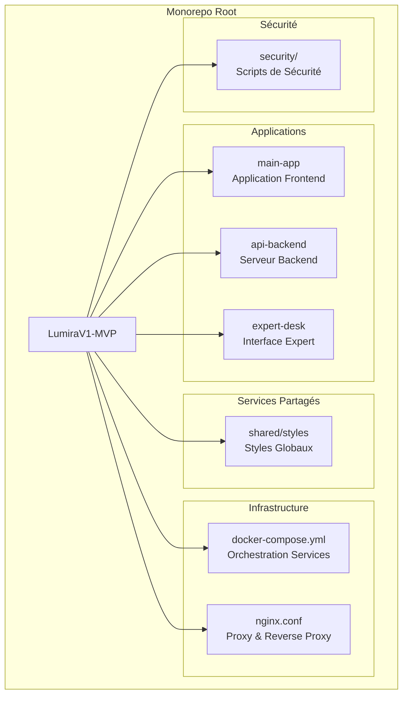
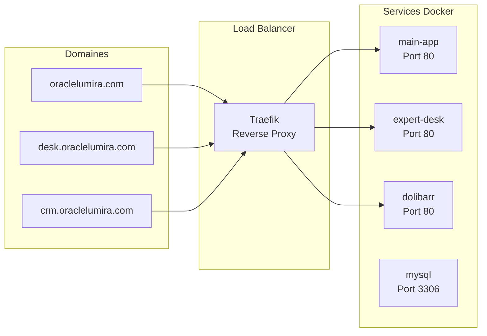
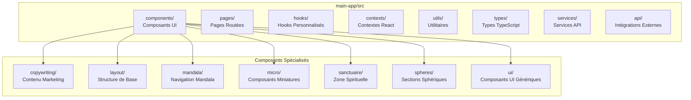
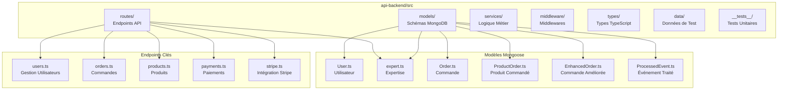
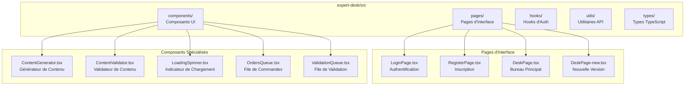
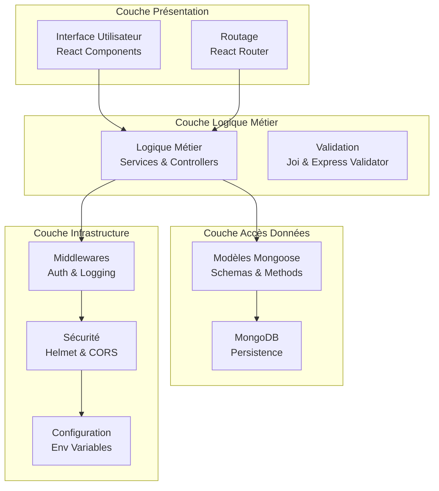
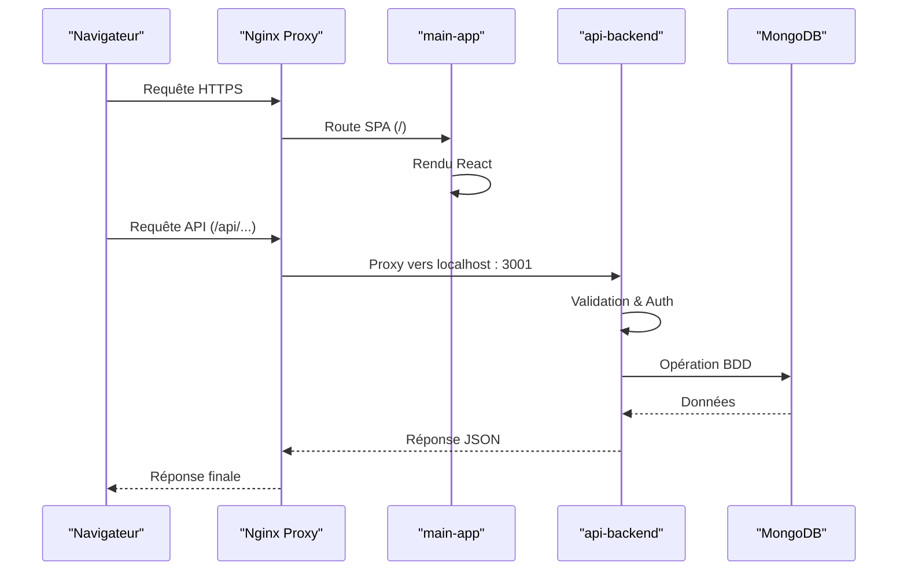

# Structure de Répertoire du Projet Monorepo

<cite>
**Fichiers Référencés dans ce Document**
- [apps/main-app/package.json](file://apps/main-app/package.json)
- [apps/api-backend/package.json](file://apps/api-backend/package.json)
- [apps/expert-desk/package.json](file://apps/expert-desk/package.json)
- [apps/main-app/src/App.tsx](file://apps/main-app/src/App.tsx)
- [apps/api-backend/src/server.ts](file://apps/api-backend/src/server.ts)
- [apps/expert-desk/src/App.tsx](file://apps/expert-desk/src/App.tsx)
- [infrastructure/docker-compose.yml](file://infrastructure/docker-compose.yml)
- [nginx.conf](file://nginx.conf)
</cite>

## Table des Matières
1. [Introduction](#introduction)
2. [Vue d'Ensemble du Monorepo](#vue-densemble-du-monorepo)
3. [Applications Principales](#applications-principales)
4. [Infrastructure et Sécurité](#infrastructure-et-sécurité)
5. [Organisation des Applications](#organisation-des-applications)
6. [Séparation des Préoccupations](#séparation-des-préoccupations)
7. [Exemples Concrets](#exemples-concrets)
8. [Configuration et Déploiement](#configuration-et-déploiement)
9. [Conclusion](#conclusion)

## Introduction

Le projet Lumira V1-MVP est organisé comme un monorepo moderne, regroupant plusieurs applications et services dans une structure hiérarchique bien définie. Cette approche permet une meilleure gestion du code, une séparation claire des responsabilités et une facilité de déploiement.

## Vue d'Ensemble du Monorepo

La structure du monorepo suit une organisation logique où chaque application principale (apps) possède sa propre architecture complète, tandis que l'infrastructure partagée et les configurations de sécurité sont centralisées.



**Sources du Diagramme**
- [apps/main-app/package.json](file://apps/main-app/package.json)
- [apps/api-backend/package.json](file://apps/api-backend/package.json)
- [apps/expert-desk/package.json](file://apps/expert-desk/package.json)
- [infrastructure/docker-compose.yml](file://infrastructure/docker-compose.yml)

## Applications Principales

### 1. Application Principal (main-app)

L'application principale constitue le frontend interactif de l'application, développée avec React, TypeScript et Vite. Elle gère l'interface utilisateur complète, l'expérience utilisateur et les interactions avec l'API backend.

**Caractéristiques principales :**
- **Technologie** : React 18.3.1, TypeScript 5.5.3, Vite 5.4.2
- **Gestion d'état** : Context API pour la gestion des niveaux utilisateur
- **Routage** : React Router DOM v7.8.2
- **Styling** : Tailwind CSS 3.4.1 avec configuration personnalisée
- **Animations** : Framer Motion 12.23.12 pour les animations fluides

### 2. Backend API (api-backend)

Le serveur backend est construit avec Express.js, TypeScript et MongoDB, fournissant toutes les fonctionnalités métier et l'accès aux données.

**Caractéristiques principales :**
- **Technologie** : Express 4.18.2, TypeScript 5.3.3, Mongoose 8.0.3
- **Sécurité** : Helmet 7.1.0, CORS configuré dynamiquement
- **Validation** : Joi 17.11.0, express-validator 7.0.1
- **Base de données** : MongoDB avec schémas Mongoose
- **Paiements** : Stripe 16.0.0 intégré nativement

### 3. Bureau Expert (expert-desk)

L'interface dédiée aux experts pour la gestion des contenus et validations, construite avec React et TypeScript.

**Caractéristiques principales :**
- **Technologie** : React 18.2.0, TypeScript 5.2.2, Vite 5.2.0
- **Authentification** : Hook personnalisé useAuth pour la gestion des sessions
- **UI** : Composants spécialisés pour la file d'attente et validation
- **Routing** : React Router DOM v6.26.2

## Infrastructure et Sécurité

### Infrastructure Containerisée

L'infrastructure utilise Docker Compose pour orchestrer les services, permettant un déploiement cohérent et reproductible.



**Sources du Diagramme**
- [infrastructure/docker-compose.yml](file://infrastructure/docker-compose.yml#L1-L41)

### Configuration Nginx

Le serveur Nginx agit comme reverse proxy et load balancer, gérant la distribution du trafic vers les différents services.

**Fonctionnalités clés :**
- **Compression Gzip** : Amélioration des performances réseau
- **Cache statique** : Optimisation des ressources front-end
- **Headers de sécurité** : Protection contre les vulnérabilités courantes
- **CORS** : Configuration managée par le backend Express

## Organisation des Applications

### Structure de main-app

L'application main-app suit une organisation modulaire avec séparation claire des responsabilités :



**Sources du Diagramme**
- [apps/main-app/src/App.tsx](file://apps/main-app/src/App.tsx#L1-L104)

### Structure de api-backend

Le backend utilise une architecture MVC-like avec séparation des responsabilités :



**Sources du Diagramme**
- [apps/api-backend/src/server.ts](file://apps/api-backend/src/server.ts#L1-L275)

### Structure de expert-desk

L'interface expert suit une architecture simplifiée mais efficace :



**Sources du Diagramme**
- [apps/expert-desk/src/App.tsx](file://apps/expert-desk/src/App.tsx#L1-L54)

## Séparation des Préoccupations

### Architecture en Couches

Chaque application respecte la séparation des préoccupations en utilisant une architecture en couches :



### Exemple de Flux de Données



**Sources du Diagramme**
- [nginx.conf](file://nginx.conf#L30-L45)
- [apps/api-backend/src/server.ts](file://apps/api-backend/src/server.ts#L100-L150)

## Exemples Concrets

### Placement des Composants React

Dans **main-app**, les composants sont organisés selon leur domaine fonctionnel :

- **Composants de marketing** : `src/components/copywriting/`
- **Navigation** : `src/components/mandala/` et `src/components/layout/`
- **Zone spirituelle** : `src/components/sanctuaire/`
- **Sections sphériques** : `src/components/spheres/`
- **Composants UI génériques** : `src/components/ui/`

### Modèles Mongoose dans api-backend

Les modèles sont structurés pour refléter la logique métier :

```typescript
// Exemple de modèle User
export interface IUser {
  email: string;
  password: string;
  role: UserRole;
  createdAt: Date;
  updatedAt: Date;
}

export const UserSchema = new Schema<IUser>({
  email: { type: String, required: true, unique: true },
  password: { type: String, required: true },
  role: { type: String, enum: ['user', 'admin', 'expert'], default: 'user' },
});
```

### Configuration de Build

Chaque application dispose de ses propres configurations de build :

- **main-app** : Vite avec Tailwind CSS et PostCSS
- **expert-desk** : Vite avec configuration optimisée pour React
- **api-backend** : TypeScript compilé en JavaScript

## Configuration et Déploiement

### Docker Compose

Le fichier docker-compose orchestre tous les services nécessaires :

```yaml
services:
  main-app:
    build: ../apps/main-app
    container_name: oracle_main
    restart: unless-stopped
    labels:
      - "traefik.enable=true"
      - "traefik.http.routers.main.rule=Host(`oraclelumira.com`)"

  expert-desk:
    build: ../apps/expert-desk
    container_name: oracle_desk
    restart: unless-stopped
    labels:
      - "traefik.enable=true"
      - "traefik.http.routers.desk.rule=Host(`desk.oraclelumira.com`)"
```

### Configuration Nginx

Le serveur Nginx gère la distribution du trafic et fournit des fonctionnalités avancées :

- **Compression** : Gzip pour les fichiers texte
- **Cache** : En-têtes de cache pour les ressources statiques
- **Sécurité** : Headers de sécurité stricts
- **Proxy** : Routage intelligent vers les services backend

### Variables d'Environnement

Chaque service utilise des variables d'environnement spécifiques :

- **API Backend** : PORT=3001, MONGODB_URI, UPLOADS_DIR
- **Main App** : Variables de configuration Vite et Tailwind
- **Expert Desk** : Configuration React et API endpoints

## Conclusion

La structure de répertoire du projet Lumira V1-MVP représente une architecture monorepo bien pensée qui favorise :

1. **La modularité** : Chaque application a sa propre identité
2. **La séparation des responsabilités** : Clarté entre frontend, backend et services
3. **La scalabilité** : Facilité d'ajout de nouvelles fonctionnalités
4. **La maintenabilité** : Organisation logique du code
5. **Le déploiement** : Orchestration cohérente avec Docker et Nginx

Cette approche permet une collaboration efficace entre équipes de développement tout en maintenant une architecture solide et extensible pour l'écosystème Lumira.