# Vue d'ensemble du système Oracle Lumira

<cite>
**Fichiers référencés dans ce document**
- [README.md](file://README.md)
- [package.json](file://package.json)
- [apps/main-app/package.json](file://apps/main-app/package.json)
- [apps/api-backend/package.json](file://apps/api-backend/package.json)
- [apps/expert-desk/package.json](file://apps/expert-desk/package.json)
- [apps/main-app/src/router.tsx](file://apps/main-app/src/router.tsx)
- [apps/main-app/src/services/sanctuaire.ts](file://apps/main-app/src/services/sanctuaire.ts)
- [apps/api-backend/src/models/User.ts](file://apps/api-backend/src/models/User.ts)
- [apps/api-backend/src/models/Order.ts](file://apps/api-backend/src/models/Order.ts)
- [apps/api-backend/src/routes/users.ts](file://apps/api-backend/src/routes/users.ts)
- [apps/main-app/src/pages/LandingTemple.tsx](file://apps/main-app/src/pages/LandingTemple.tsx)
- [apps/expert-desk/src/App.tsx](file://apps/expert-desk/src/App.tsx)
- [apps/main-app/src/utils/api.ts](file://apps/main-app/src/utils/api.ts)
- [infrastructure/docker-compose.yml](file://infrastructure/docker-compose.yml)
- [AUDIT-DESK-SANCTUAIRE-RAPPORT.md](file://AUDIT-DESK-SANCTUAIRE-RAPPORT.md)
</cite>

## Table des matières
1. [Introduction](#introduction)
2. [Architecture globale](#architecture-globale)
3. [Points d'entrée principaux](#points-dentrée-principaux)
4. [Flux de données et workflows](#flux-de-données-et-workflows)
5. [Composants principaux](#composants-principaux)
6. [Intégrations système](#intégrations-système)
7. [Parcours utilisateur](#parcours-utilisateur)
8. [Considérations de performance](#considérations-de-performance)
9. [Guide de dépannage](#guide-de-dépannage)
10. [Conclusion](#conclusion)

## Introduction

Oracle Lumira est une application web mystique qui offre des lectures vibratoires personnalisées à travers 4 niveaux d'exploration spirituelle. Cette plateforme combine React/TypeScript, un design immersif et des intégrations avancées (Stripe, MongoDB, Dolibarr, n8n) pour créer une expérience utilisateur profonde et interactive.

L'application suit une architecture monorepo moderne avec trois applications principales :
- **Landing Temple** : Interface d'accueil immersive
- **Main App** : Application client complète avec dashboard
- **Expert Desk** : Interface d'administration pour les experts

## Architecture globale

Oracle Lumira utilise une architecture microservices moderne avec une approche monorepo, permettant une gestion centralisée du code tout en maintenant la séparation des responsabilités.

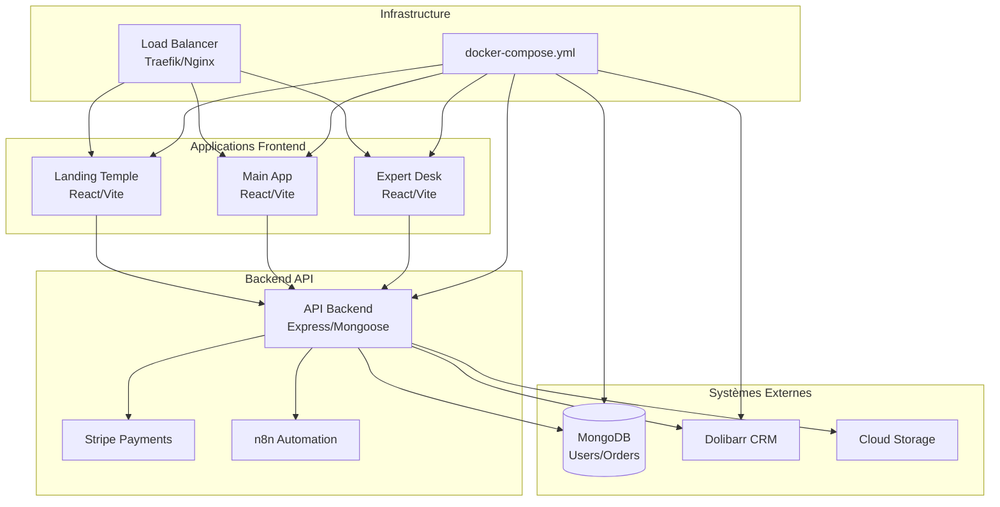

**Sources du diagramme**
- [infrastructure/docker-compose.yml](file://infrastructure/docker-compose.yml#L1-L41)
- [apps/main-app/package.json](file://apps/main-app/package.json#L1-L45)
- [apps/api-backend/package.json](file://apps/api-backend/package.json#L1-L76)
- [apps/expert-desk/package.json](file://apps/expert-desk/package.json#L1-L42)

**Sources de section**
- [README.md](file://README.md#L1-L259)
- [infrastructure/docker-compose.yml](file://infrastructure/docker-compose.yml#L1-L41)

## Points d'entrée principaux

### Landing Temple (Point d'entrée principal)

Le Landing Temple constitue le premier contact utilisateur avec Oracle Lumira. Il offre une expérience immersive avec des éléments visuels sophistiqués.

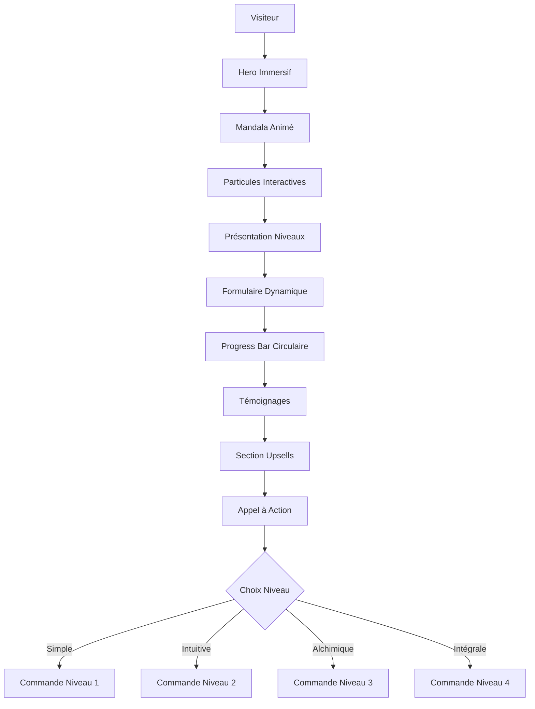

**Caractéristiques principales :**
- **Hero immersif** avec animation mandala
- **Section niveaux** présentant 4 niveaux d'exploration
- **Formulaire adaptatif** selon le niveau sélectionné
- **Progress bar** type mandala pour indication de progression
- **Témoignages** et preuve sociale

### Sanctuaire (Dashboard client)

Le Sanctuaire est le dashboard personnel des utilisateurs, accessible après authentification sécurisée.

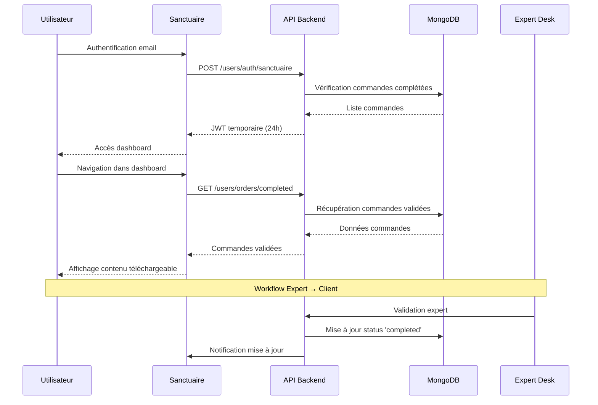

**Sources du diagramme**
- [apps/api-backend/src/routes/users.ts](file://apps/api-backend/src/routes/users.ts#L100-L150)
- [apps/main-app/src/services/sanctuaire.ts](file://apps/main-app/src/services/sanctuaire.ts#L59-L111)

### Expert Desk (Interface expert)

L'Expert Desk est l'interface d'administration pour les experts, permettant la validation et génération de contenus.

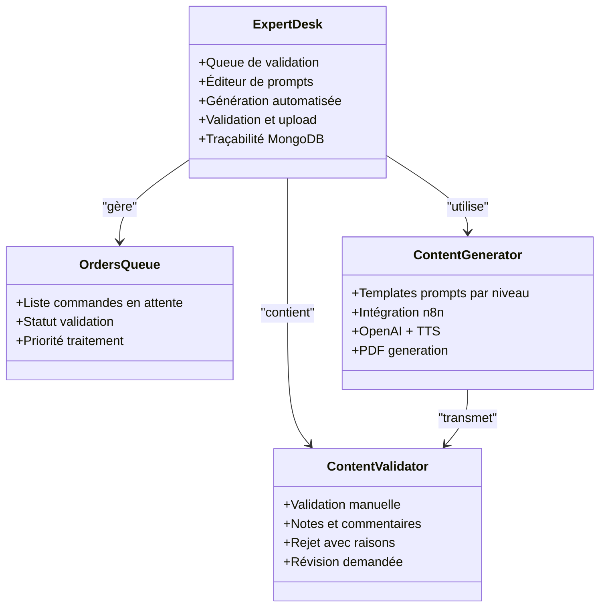

**Sources du diagramme**
- [apps/expert-desk/src/App.tsx](file://apps/expert-desk/src/App.tsx#L1-L54)
- [apps/main-app/src/pages/LandingTemple.tsx](file://apps/main-app/src/pages/LandingTemple.tsx#L1-L22)

**Sources de section**
- [apps/main-app/src/router.tsx](file://apps/main-app/src/router.tsx#L1-L25)
- [apps/main-app/src/services/sanctuaire.ts](file://apps/main-app/src/services/sanctuaire.ts#L1-L64)
- [apps/expert-desk/src/App.tsx](file://apps/expert-desk/src/App.tsx#L1-L54)

## Flux de données et workflows

### Workflow complet utilisateur

Le flux de données dans Oracle Lumira suit un parcours bien structuré depuis l'accès jusqu'à la livraison du contenu.

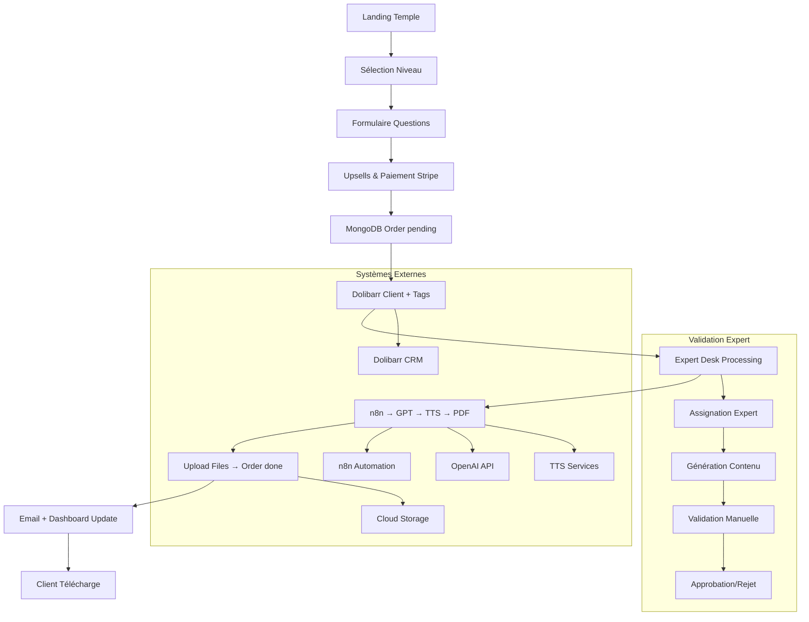

**Sources du diagramme**
- [README.md](file://README.md#L100-L120)
- [AUDIT-DESK-SANCTUAIRE-RAPPORT.md](file://AUDIT-DESK-SANCTUAIRE-RAPPORT.md#L139-L188)

### Flux de données backend

Le backend gère la persistance des données et orchestre les interactions avec les systèmes externes.

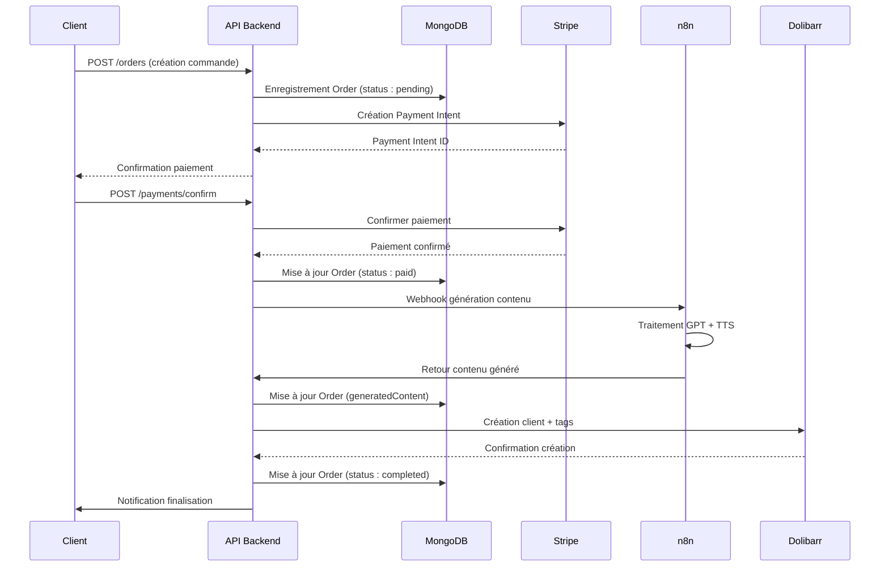

**Sources du diagramme**
- [apps/api-backend/src/models/Order.ts](file://apps/api-backend/src/models/Order.ts#L1-L199)
- [apps/api-backend/src/routes/users.ts](file://apps/api-backend/src/routes/users.ts#L100-L150)

**Sources de section**
- [README.md](file://README.md#L100-L120)
- [AUDIT-DESK-SANCTUAIRE-RAPPORT.md](file://AUDIT-DESK-SANCTUAIRE-RAPPORT.md#L139-L188)

## Composants principaux

### Architecture frontend

Les applications frontend utilisent React 18 avec TypeScript et Vite pour des performances optimales.

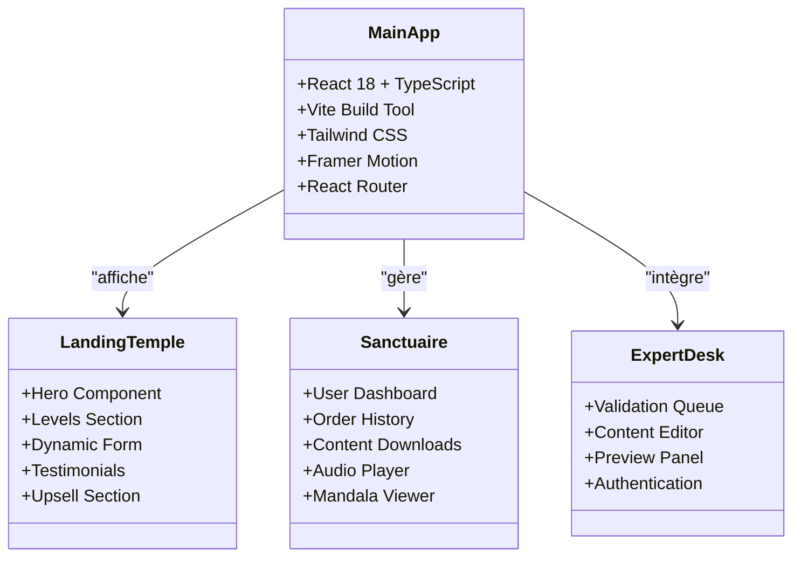

**Sources du diagramme**
- [apps/main-app/package.json](file://apps/main-app/package.json#L1-L45)
- [apps/main-app/src/pages/LandingTemple.tsx](file://apps/main-app/src/pages/LandingTemple.tsx#L1-L22)
- [apps/expert-desk/package.json](file://apps/expert-desk/package.json#L1-L42)

### Modèles de données

La base de données MongoDB stocke les informations essentielles pour le fonctionnement de l'application.

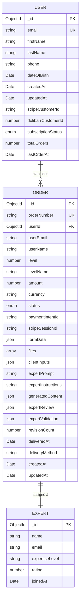

**Sources du diagramme**
- [apps/api-backend/src/models/User.ts](file://apps/api-backend/src/models/User.ts#L1-L83)
- [apps/api-backend/src/models/Order.ts](file://apps/api-backend/src/models/Order.ts#L1-L199)

**Sources de section**
- [apps/main-app/src/utils/api.ts](file://apps/main-app/src/utils/api.ts#L1-L80)
- [apps/api-backend/src/models/User.ts](file://apps/api-backend/src/models/User.ts#L1-L83)
- [apps/api-backend/src/models/Order.ts](file://apps/api-backend/src/models/Order.ts#L1-L199)

## Intégrations système

### Systèmes externes intégrés

Oracle Lumira s'intègre avec plusieurs systèmes externes pour fournir une expérience complète.

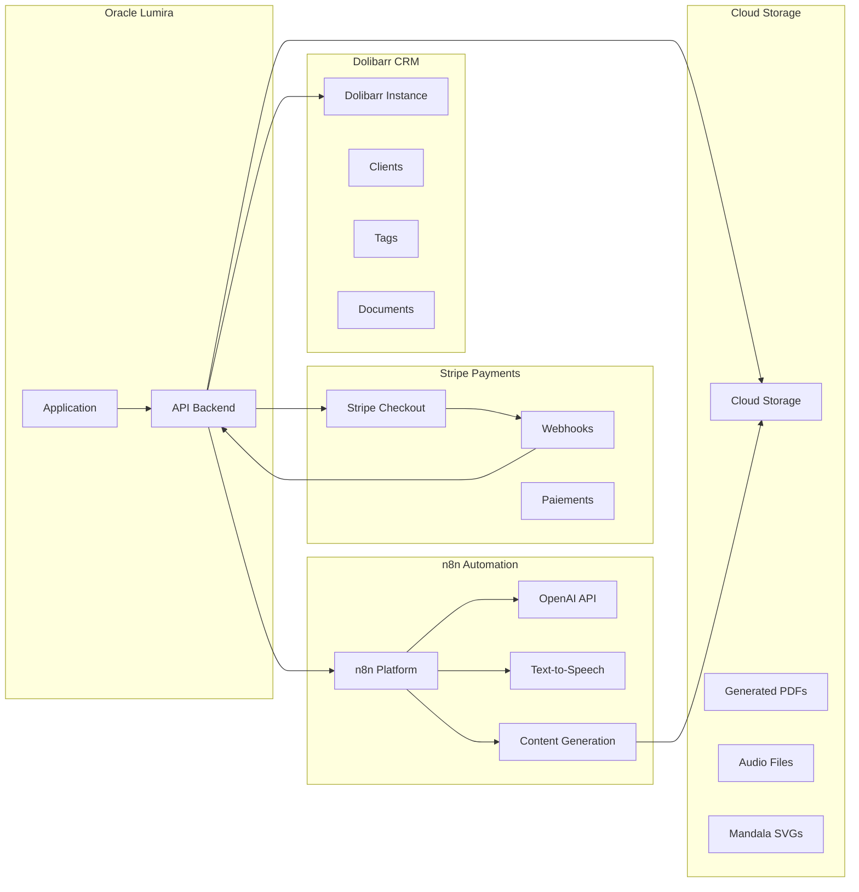

**Sources du diagramme**
- [apps/api-backend/package.json](file://apps/api-backend/package.json#L15-L30)
- [infrastructure/docker-compose.yml](file://infrastructure/docker-compose.yml#L1-L41)

### Configuration des variables d'environnement

```typescript
// Variables Stripe requises
VITE_STRIPE_PUBLISHABLE_KEY=pk_test_...
STRIPE_SECRET_KEY=sk_test_...

// Base de données
MONGODB_URI=mongodb://localhost:27017/oracle-lumira

// Dolibarr CRM
VITE_DOLIBARR_URL=https://crm.domain.com
VITE_DOLIBARR_API_KEY=...

// n8n Automation
N8N_WEBHOOK_URL=https://n8n.domain.com/webhook/lumira-assistant
N8N_TOKEN=...
```

**Sources de section**
- [README.md](file://README.md#L50-L80)
- [infrastructure/docker-compose.yml](file://infrastructure/docker-compose.yml#L1-L41)

## Parcours utilisateur

### Parcours client complet

Le parcours utilisateur est conçu pour être fluide et intuitif, guidant l'utilisateur à travers chaque étape.

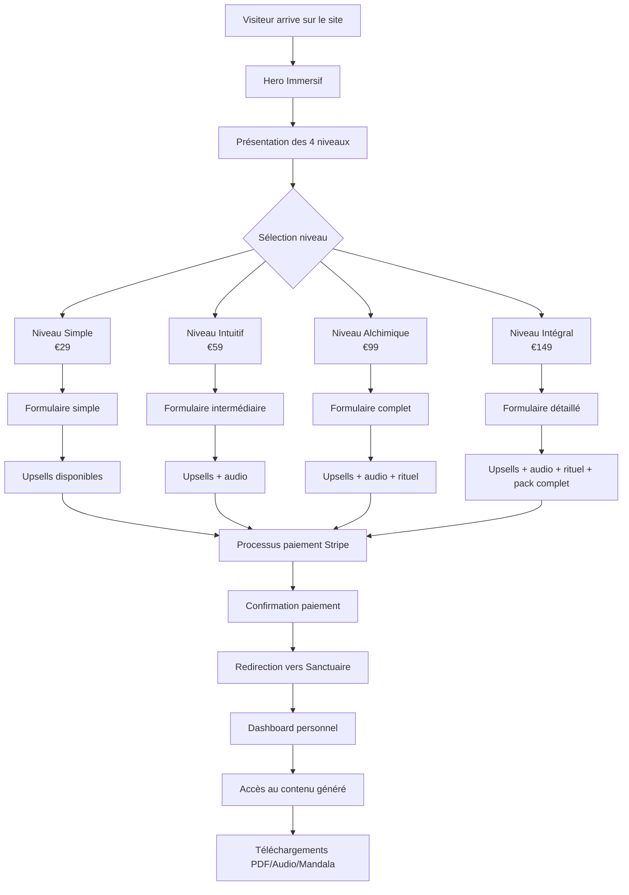

### Parcours expert

Le parcours expert permet aux experts de valider et générer le contenu des lectures.

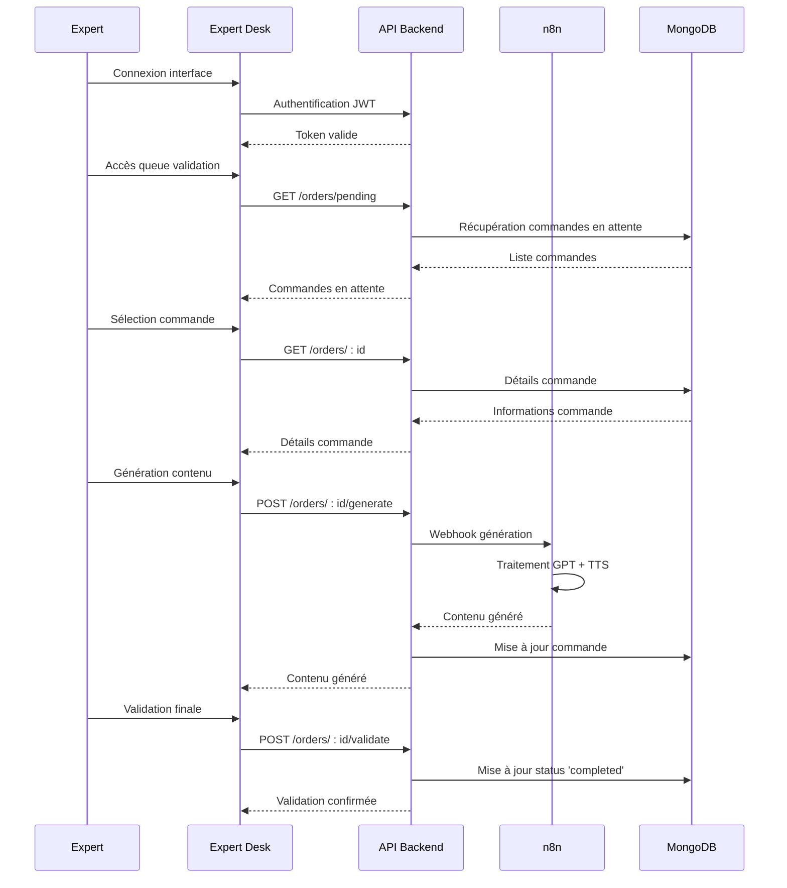

**Sources du diagramme**
- [apps/expert-desk/src/App.tsx](file://apps/expert-desk/src/App.tsx#L1-L54)
- [apps/api-backend/src/routes/users.ts](file://apps/api-backend/src/routes/users.ts#L100-L150)

### Parcours administrateur

L'administrateur peut gérer les utilisateurs et surveiller le système.

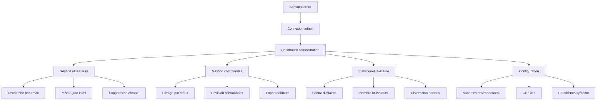

**Sources de section**
- [apps/api-backend/src/routes/users.ts](file://apps/api-backend/src/routes/users.ts#L1-L100)
- [apps/main-app/src/services/sanctuaire.ts](file://apps/main-app/src/services/sanctuaire.ts#L1-L64)

## Considérations de performance

### Optimisations frontend

L'application utilise plusieurs techniques d'optimisation pour garantir des performances élevées.

**Techniques d'optimisation :**
- **Bundle splitting** automatique avec Vite
- **Lazy loading** des composants lourds
- **Gzip compression** avec Nginx
- **Cache stratégique** pour les assets
- **Optimisation CSS** avec Tailwind

**Mesures de performance :**
- **Mobile-first** design responsive
- **Animations optimisées** (transform/opacity priority)
- **Code splitting** pour réduction bundle initial
- **Image optimization** avec formats modernes

### Optimisations backend

Le backend est optimisé pour gérer efficacement les requêtes et les traitements.

**Techniques d'optimisation :**
- **Rate limiting** avec Express Rate Limit
- **Validation** avec Joi pour sécurité
- **Logging** avec Winston pour monitoring
- **Middleware** d'authentification optimisé
- **Indexes MongoDB** pour requêtes rapides

**Sources de section**
- [README.md](file://README.md#L150-L180)
- [apps/api-backend/package.json](file://apps/api-backend/package.json#L15-L30)

## Guide de dépannage

### Problèmes courants et solutions

**Problème : Erreur d'authentification sanctuaire**
```bash
# Vérification des logs backend
docker logs oracle_lumira_api

# Vérification des tokens JWT
curl -H "Authorization: Bearer <token>" http://localhost:3000/api/users/auth/sanctuaire

# Vérification des commandes complétées
mongo
db.orders.find({userId: "<user-id>", status: "completed"})
```

**Problème : Intégration Stripe échouée**
```bash
# Vérification clés Stripe
echo $VITE_STRIPE_PUBLISHABLE_KEY
echo $STRIPE_SECRET_KEY

# Test webhook Stripe
stripe listen --forward-to=localhost:3000/api/payments/webhook
```

**Problème : n8n ne génère pas de contenu**
```bash
# Vérification connexion n8n
curl -X POST https://n8n.domain.com/webhook/lumira-assistant \
  -H "Authorization: Bearer <n8n-token>" \
  -H "Content-Type: application/json" \
  -d '{"level": 1, "formData": {...}}'

# Vérification logs n8n
docker logs oracle_n8n
```

### Diagnostic système

**Scripts de diagnostic disponibles :**
- `diagnose-bad-gateway.sh` : Vérification proxy Nginx
- `diagnose-container.sh` : Diagnostic containers Docker
- `diagnose-production.sh` : Diagnostic production
- `full-diagnostic.js` : Diagnostic complet système

**Sources de section**
- [README.md](file://README.md#L200-L230)
- [deploy.sh](file://deploy.sh)
- [deploy.ps1](file://deploy.ps1)

## Conclusion

Oracle Lumira représente une solution complète et sophistiquée pour la création et distribution de lectures spirituelles personnalisées. Son architecture monorepo moderne, combinée avec des technologies éprouvées (React, Express, MongoDB), permet de fournir une expérience utilisateur fluide et performante.

**Points forts identifiés :**
- **Architecture modulaire** avec séparation claire des responsabilités
- **Intégrations robustes** avec systèmes externes (Stripe, Dolibarr, n8n)
- **Expérience utilisateur** immersive et intuitive
- **Sécurité renforcée** avec authentification JWT et validation multi-critères
- **Scalabilité** avec Docker et docker-compose

**Améliorations futures prévues :**
- Migration vers Next.js pour améliorer SEO
- Implémentation de WebSocket pour notifications temps réel
- Extension du système de niveaux avec nouvelles fonctionnalités
- Amélioration de l'interface mobile native

Cette documentation fournit une vue d'ensemble complète du système Oracle Lumira, couvrant à la fois les aspects techniques pour les développeurs et les considérations architecturales pour les décideurs techniques.