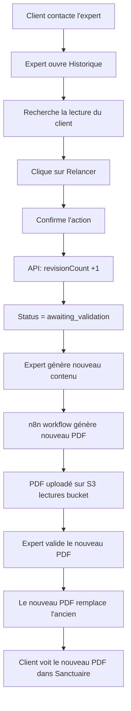

# Système d'Historique des Validations - Expert Desk

## 📋 Vue d'ensemble

Le système d'historique permet aux experts de :
- **Consulter** toutes les lectures validées ou rejetées
- **Relancer** une lecture déjà validée à la demande du client
- **Suivre** les versions successives d'une même lecture
- **Remplacer** automatiquement le PDF dans le sanctuaire après nouvelle validation

## 🎯 Fonctionnalités clés

### 1. Onglet Historique
- Accessible depuis le menu principal de l'Expert Desk
- Affiche les 100 dernières validations (approuvées ou rejetées)
- Tri par date de validation décroissante

### 2. Filtrage et Recherche
- **Filtres rapides** : Toutes / Validées / Rejetées
- **Recherche** : Par nom, email, numéro de commande
- **Badge de version** : Affiche le numéro de révision (v1, v2, etc.)

### 3. Visualisation détaillée
Lorsqu'une lecture est sélectionnée, l'expert peut voir :
- Informations client complètes
- Question spirituelle / Objectif
- PDF généré (visualisation + téléchargement)
- Notes de validation
- Historique des révisions

### 4. Relance de lecture

#### Processus
1. **Sélection** : L'expert sélectionne une lecture validée
2. **Confirmation** : Un avertissement s'affiche (action irréversible)
3. **Régénération** : Le système :
   - Incrémente `revisionCount`
   - Passe le statut à `awaiting_validation`
   - Crée une nouvelle entrée de validation
   - **Garde l'ancien PDF** jusqu'à la nouvelle validation

4. **Nouvelle validation** : 
   - L'expert reçoit la lecture dans la queue de validation
   - Après approbation, **le nouveau PDF remplace l'ancien** dans le sanctuaire
   - Le client voit immédiatement le nouveau PDF

## 🏗️ Architecture technique

### Frontend (Expert Desk)

#### Nouveaux composants
```
apps/expert-desk/src/components/
├── HistoryQueue.tsx      # Liste des lectures validées
└── HistoryViewer.tsx     # Détails et relance d'une lecture
```

#### Routes API utilisées
```typescript
GET  /expert/orders/validated-history  // Récupérer l'historique
POST /expert/regenerate-lecture         // Relancer une lecture
```

### Backend (API)

#### Routes ajoutées dans `expert.ts`
```typescript
// Historique des validations (100 dernières)
router.get('/orders/validated-history', authenticateExpert, ...)

// Relancer une lecture
router.post('/regenerate-lecture', authenticateExpert, ...)
```

#### Logique de régénération
```typescript
const newRevisionCount = (order.revisionCount || 0) + 1;

order.status = 'awaiting_validation';
order.revisionCount = newRevisionCount;
order.expertValidation = {
  validatorId: expertId,
  validatorName: expertName,
  validationStatus: 'pending',
  validationNotes: `Régénération demandée - Version ${newRevisionCount + 1}`,
  validatedAt: new Date()
};

// L'ancien PDF reste accessible jusqu'à la nouvelle validation
await order.save();
```

## 📊 Modèle de données

### Order Schema (MongoDB)
```typescript
{
  revisionCount: number,              // Compteur de versions
  status: 'awaiting_validation',      // Après relance
  generatedContent: {
    pdfUrl: string,                   // URL du PDF (remplacé après validation)
    // ... autres contenus
  },
  expertValidation: {
    validatorId: string,
    validatorName: string,
    validationStatus: 'pending' | 'approved' | 'rejected',
    validationNotes: string,
    validatedAt: Date
  }
}
```

## 🔄 Workflow complet

### Scénario : Client demande une relance



## 🎨 UX/UI

### Onglet Historique
- **Badge vert** avec icône cadenas ouvert pour lectures validées
- **Badge rouge** pour lectures rejetées
- **Badge orange** avec icône rotation pour les révisions (v2, v3, etc.)

### Bouton Relancer
- Visible uniquement sur lectures validées
- Confirmation en 2 étapes pour éviter erreurs
- Affichage du loader pendant le traitement

### Messages utilisateur
- ✅ "Régénération lancée avec succès - Version X"
- ⚠️ "Cette action va régénérer une nouvelle version de la lecture"
- 🔄 "En cours de régénération..."

## 🔒 Sécurité

### Authentification
- Toutes les routes protégées par `authenticateExpert` middleware
- Token JWT vérifié pour chaque requête

### Validation
- Seules les lectures **approved** peuvent être relancées
- Vérification de l'existence de la commande
- Tracking de l'expert qui a demandé la relance

### Traçabilité
- `revisionCount` conservé dans la base
- Notes de validation incluant "Régénération demandée - Version X"
- `validatedAt` timestamp pour chaque action

## 📝 Notes importantes

### Gestion du PDF
1. **Avant validation** : L'ancien PDF reste accessible
2. **Après validation** : Le nouveau PDF remplace l'ancien dans le sanctuaire
3. **Bucket S3** : `oracle-lumira-lectures` pour tous les PDFs générés

### Workflow n8n
- Le workflow n8n doit être déclenché manuellement ou automatiquement après relance
- Le callback HMAC met à jour `generatedContent.pdfUrl`
- Le statut passe de `awaiting_validation` à `completed` après validation

### Multi-bucket S3
- `oracle-lumira-uploads-tachfine-1983` : Photos client
- `oracle-lumira-lectures` : PDFs générés par n8n
- Détection automatique du bucket via l'URL

## 🚀 Déploiement

### Variables d'environnement requises
```bash
# API Backend
AWS_LECTURES_BUCKET_NAME=oracle-lumira-lectures
AWS_S3_BUCKET_NAME=oracle-lumira-uploads-tachfine-1983
JWT_SECRET=<votre_secret>
```

### Commandes
```bash
# Build Expert Desk
cd apps/expert-desk && npm run build

# Build API Backend
cd apps/api-backend && npm run build

# Déployer sur Coolify
git push origin main
```

## 🎯 Cas d'usage

### Cas 1 : Erreur dans la lecture initiale
1. Client signale une erreur
2. Expert ouvre Historique
3. Trouve la lecture concernée
4. Clique "Relancer"
5. Génère une nouvelle version corrigée
6. Valide → Le client reçoit la version corrigée

### Cas 2 : Demande de complément
1. Client demande des précisions
2. Expert relance la lecture avec nouvelles instructions
3. n8n génère un PDF enrichi
4. Après validation, remplace l'ancien

### Cas 3 : Évolution de l'offre
1. Oracle Lumira améliore le template de lecture
2. Expert peut relancer les anciennes lectures
3. Clients bénéficient de la nouvelle version

## 📈 Métriques

Le système permet de suivre :
- Nombre de relances par expert
- Taux de révision par niveau d'offre
- Délai moyen entre relances
- Satisfaction client après révision

---

**Date de mise en place** : Novembre 2025  
**Version** : 1.0  
**Auteur** : Équipe Oracle Lumira
