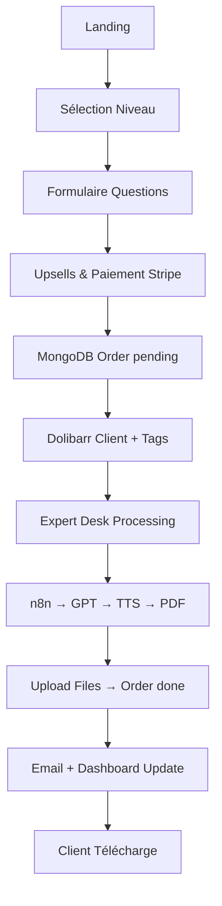

# 🔮 Oracle Lumira - Lectures Vibratoires

## 🎯 Vue d'ensemble

Oracle Lumira est une application web mystique offrant des lectures vibratoires personnalisées à travers 4 niveaux d'exploration spirituelle. L'application combine React/TypeScript, design immersif et intégrations avancées (Stripe, MongoDB, Dolibarr, n8n).

## ✨ Fonctionnalités

### 🏛️ Landing Temple
- Hero immersif avec mandala animé et particules interactives
- Présentation des 4 niveaux de lecture (Simple → Intégrale)
- Formulaire dynamique adaptatif selon le niveau
- Progress bar circulaire type mandala
- Témoignages et preuve sociale

### 🛒 Système de Commande
- Sélection niveau + upsells (mandala, audio, rituel, pack complet)
- Formulaire questions rituelles progressif
- Intégration Stripe pour paiements
- Confirmation et redirection Sanctuaire

### 🏰 Sanctuaire Client
- Dashboard personnel avec historique des lectures
- Téléchargements PDF/audio/mandala
- Timeline vibratoire des niveaux atteints
- Player audio intégré avec ambiance 432 Hz
- Cartes Persona dynamiques

### 👑 Expert Desk Oracle
- Interface 3 colonnes : Queue / Editor / Preview
- Templates de prompts par niveau
- Génération via n8n + OpenAI + TTS
- Validation et upload automatique
- Traçabilité complète MongoDB

## 🛠️ Stack Technique

### Frontend
- **React 18** + **TypeScript** + **Vite**
- **Tailwind CSS** + thème mystique personnalisé
- **Framer Motion** pour animations fluides
- **React Router** navigation SPA
- **Lucide React** pour iconographie

### Backend & Intégrations
- **MongoDB** (données users/orders) + mock fallback
- **Stripe** (paiements) + webhooks
- **Dolibarr CRM** (clients, tags, documents)
- **n8n** (automation GPT + TTS)
- **Docker** + **docker-compose** ready

### Design System
```css
Palette mystique :
- Fond abyssal : #0A0A0F
- Or sacré : #D4AF37, #FFD700, #FBBF24
- Violet astral : #C084FC, #A78BFA
- Typographie : Playfair Display italic + Inter
```

## 🚀 Installation & Développement

### Prérequis
- Node.js 18+
- npm/yarn
- Docker (optionnel)

### Installation rapide
```bash
git clone https://github.com/votre-repo/oracle-lumira
cd oracle-lumira
npm install
cp .env.example .env
npm run dev
```

### Variables d'environnement
```env
# Stripe
VITE_STRIPE_PUBLISHABLE_KEY=pk_test_...
STRIPE_SECRET_KEY=sk_test_...

# MongoDB
MONGODB_URI=mongodb://localhost:27017/oracle-lumira

# Dolibarr CRM
VITE_DOLIBARR_URL=https://crm.domain.com
VITE_DOLIBARR_API_KEY=...

# n8n Automation
N8N_WEBHOOK_URL=https://n8n.domain.com/webhook/lumira-assistant
N8N_TOKEN=...
```

### Build production
```bash
npm run build
```

### Docker
```bash
docker-compose up --build
```

## 🧭 Architecture & Routes

```
/                 → Landing Temple (hero + 4 niveaux + formulaire)
/commande         → Page commande (récap + upsells + paiement)
/confirmation     → Confirmation post-paiement 
/sanctuaire       → Dashboard client (lectures + téléchargements)
/expert           → Desk Oracle (génération lectures expertes)
```

## 📊 Workflow Complet



## 🎨 Composants Clés

### Pages
- `LandingTemple.tsx` - Page d'accueil immersive
- `CommandeTemple.tsx` - Tunnel de commande
- `ConfirmationTemple.tsx` - Confirmation paiement
- `DashboardSanctuaire.tsx` - Espace client

### Expert
- `ExpertDesk.tsx` - Interface expert complète

### Components
- `Hero.tsx` - Section hero avec animations
- `LevelsSection.tsx` + `LevelCard.tsx` - Présentation niveaux
- `DynamicForm.tsx` - Formulaire adaptatif
- `CircularProgress.tsx` - Progress mandala
- `MandalaAnimation.tsx` - Animation centrale
- `ParticleSystem.tsx` - Particules interactives
- `GoldenMist.tsx` - Effets visuels

### API
- `mongodb.ts` - CRUD orders/users + mock
- `stripe.ts` - Intégration paiements
- `dolibarr.ts` - CRM automation

## 🔧 Scripts Disponibles

```bash
npm run dev          # Serveur développement
npm run build        # Build production
npm run preview      # Preview build
npm run lint         # ESLint check

# Docker
docker-compose up    # Lancement complet (app + mongo + n8n)
```

## 📱 Responsive & Performance

- **Mobile-first** design avec Tailwind
- **Animations optimisées** (transform/opacity priority)
- **Lazy loading** des assets lourds
- **Bundle splitting** automatique Vite
- **Gzip compression** nginx

## 🔐 Sécurité

- **Variables d'env** sensibles (.env gitignored)
- **Stripe webhook** signature verification
- **Headers sécurité** nginx (XSS, CSRF, etc.)
- **MongoDB** authentification

## 🌐 Déploiement Production

### Prérequis serveur
- VPS/serveur avec Docker
- Nom de domaine → oraclelumira.com
- SSL/TLS (Let's Encrypt recommandé)

### Stack recommandée
- **Frontend** : Nginx + build statique
- **Database** : MongoDB Atlas ou instance
- **CRM** : Dolibarr hébergé
- **Automation** : n8n cloud ou self-hosted
- **CI/CD** : Coolify v4 ou GitHub Actions

### Commandes déploiement
```bash
# Build & upload
npm run build
docker build -t oracle-lumira:latest .
docker push registry/oracle-lumira:latest

# Coolify deployment
git push origin main  # Auto-deploy si configuré
```

## 🧪 Tests & Debug

### Mode development
- Routes accessibles sur `http://localhost:5173`
- MongoDB mock fallback si URI manquant
- Console logs détaillés pour API calls

### Test du workflow
1. Sélectionner niveau 3 sur landing
2. Remplir formulaire + activer upsells
3. Simuler paiement (mode test Stripe)
4. Vérifier création MongoDB + Dolibarr
5. Accéder `/expert` et traiter commande
6. Valider livraison dans `/sanctuaire`

## 📚 Documentation Avancée

### Personnalisation thème
Modifier `tailwind.config.js` section `colors.mystical`

### Ajout nouveaux niveaux
1. Mettre à jour `LevelsSection.tsx` data
2. Ajouter template prompt dans `ExpertDesk.tsx`
3. Adapter logique `DynamicForm.tsx`

### Intégration APIs externes
- Stripe : webhooks dans `src/api/stripe.ts`
- MongoDB : schémas dans `src/api/mongodb.ts`
- Dolibarr : endpoints dans `src/api/dolibarr.ts`

## 🤝 Contribution

1. Fork le projet
2. Créer branch feature (`git checkout -b feature/nouvelle-fonctionnalite`)
3. Commit changes (`git commit -m 'Ajout nouvelle fonctionnalité'`)
4. Push branch (`git push origin feature/nouvelle-fonctionnalite`)
5. Ouvrir Pull Request

## 📄 Licence

Propriétaire - Oracle Lumira © 2024

## 🆘 Support

- **Email** : support@oraclelumira.com
- **Documentation** : Ce README + commentaires code
- **Issues** : GitHub Issues pour bugs/features

---

*Révèle ton archétype avec Oracle Lumira* ✨🔮
